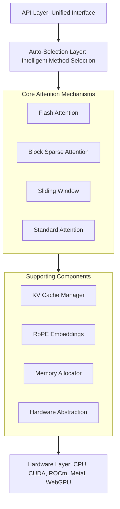
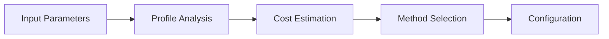
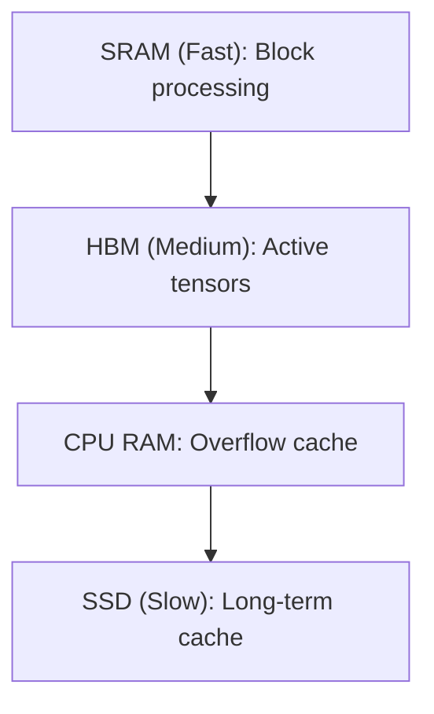

# Long-Context Attention Architecture

## Overview

The Long-Context Attention library implements state-of-the-art attention mechanisms optimized for processing long sequences in transformer models. The architecture is designed to be modular, efficient, and hardware-aware, supporting sequences up to 128K tokens while maintaining sub-quadratic memory complexity.

## System Architecture



## Core Components

### 1. Flash Attention (`flash.rs`)

**Purpose**: Implements the Flash Attention algorithm for exact attention computation with O(N) memory complexity.

**Key Features**:
- IO-aware algorithm minimizing HBM accesses
- Tiling and recomputation strategies
- Support for multiple block sizes (32, 64, 128)
- Causal and non-causal masking
- Gradient checkpointing options

**Architecture**:
```rust
pub struct FlashAttention {
    config: FlashAttentionConfig,
    max_seq_len: usize,
    head_dim: usize,
    block_size: BlockSize,
    softmax_scale: f32,
    cached_blocks: Option<BlockCache>,
}
```

**Data Flow**:
1. Input tensors are tiled into blocks
2. Blocks are processed in SRAM-sized chunks
3. Softmax is computed incrementally
4. Output is assembled from block results

### 2. Block Sparse Attention (`block_sparse.rs`)

**Purpose**: Reduces computational complexity through structured sparsity patterns.

**Key Features**:
- Multiple sparsity patterns (fixed, random, local-global, adaptive)
- Configurable block sizes and sparsity ratios
- Dynamic pattern generation based on content
- Efficient sparse matrix operations

**Architecture**:
```rust
pub struct BlockSparseAttention {
    config: SparsityConfig,
    pattern_generator: PatternGenerator,
    sparse_compute: SparseCompute,
    pattern_cache: LRUCache<PatternKey, SparsityPattern>,
}
```

**Sparsity Patterns**:
- **Fixed**: Predefined pattern (e.g., diagonal, strided)
- **Random**: Randomly sampled blocks
- **Local-Global**: Local windows + global tokens
- **Adaptive**: Content-based dynamic patterns

### 3. Sliding Window Attention (`sliding_window.rs`)

**Purpose**: Limits attention to local context windows for efficiency.

**Key Features**:
- Configurable window sizes and overlaps
- Efficient window management
- Support for causal masking
- Window position encoding

**Architecture**:
```rust
pub struct SlidingWindowAttention {
    window_size: usize,
    overlap: usize,
    window_manager: WindowManager,
    position_encoder: PositionEncoder,
}
```

### 4. KV Cache Manager (`kv_cache.rs`)

**Purpose**: Manages key-value caching for efficient autoregressive generation.

**Key Features**:
- Multiple eviction policies (LRU, FIFO, sliding window)
- Compression methods (8-bit quantization, pruning)
- Dynamic memory management
- Multi-level caching hierarchy

**Architecture**:
```rust
pub struct KVCache {
    primary_cache: TensorCache,
    compressed_cache: CompressedCache,
    eviction_manager: EvictionManager,
    memory_tracker: MemoryTracker,
}
```

**Cache Hierarchy**:
1. **L1 Cache**: Hot data in HBM
2. **L2 Cache**: Compressed recent data
3. **L3 Cache**: Disk-backed for very long contexts

### 5. RoPE (Rotary Position Embeddings) (`rope.rs`)

**Purpose**: Provides position information for long sequences.

**Key Features**:
- Multiple frequency scaling methods
- Support for sequence lengths beyond training
- Cached frequency computation
- Inverse transformations

**Scaling Methods**:
- **Linear**: Standard RoPE
- **NTK**: Neural Tangent Kernel scaling
- **YaRN**: Yet another RoPE extension

### 6. Auto-Selector (`auto_select.rs`)

**Purpose**: Automatically selects optimal attention mechanism based on context.

**Selection Criteria**:
- Sequence length
- Batch size
- Available memory
- Optimization target (latency/memory/quality)
- Hardware capabilities

**Decision Flow**:


## Data Flow

### Forward Pass

1. **Input Processing**:
   - Apply RoPE embeddings
   - Tile into appropriate blocks
   - Prepare masks if needed

2. **Attention Computation**:
   - Selected mechanism processes tiles
   - Intermediate results stored in cache
   - Incremental softmax computation

3. **Output Assembly**:
   - Gather results from tiles
   - Apply final projections
   - Return attention output

### Backward Pass

1. **Gradient Reception**:
   - Receive gradients from upstream
   - Prepare for backward computation

2. **Gradient Computation**:
   - Recompute or retrieve cached values
   - Calculate gradients for Q, K, V
   - Handle special cases (masks, sparsity)

3. **Gradient Propagation**:
   - Return gradients to previous layer
   - Update statistics for profiling

## Memory Management

### Memory Hierarchy



### Memory Optimization Strategies

1. **Tiling**: Process data in SRAM-sized blocks
2. **Recomputation**: Trade compute for memory
3. **Compression**: Quantize cached values
4. **Eviction**: Remove least useful cached data
5. **Prefetching**: Anticipate future memory needs

## Hardware Abstraction

### Compute Backends

- **CPU**: Optimized with SIMD instructions
- **CUDA**: Kernel fusion and tensor cores
- **ROCm**: AMD GPU optimization
- **Metal**: Apple Silicon acceleration
- **WebGPU**: Browser-based computation

### Device Management

```rust
pub trait ComputeDevice {
    fn allocate(&mut self, size: usize) -> DeviceBuffer;
    fn compute(&mut self, kernel: &Kernel, args: &[Buffer]);
    fn synchronize(&mut self);
}
```

## Performance Optimizations

### Algorithmic Optimizations

1. **Kernel Fusion**: Combine multiple operations
2. **Memory Coalescing**: Optimize memory access patterns
3. **Operator Reordering**: Minimize intermediate memory
4. **Sparse Computation**: Skip zero blocks
5. **Mixed Precision**: Use FP16/BF16 where appropriate

### System Optimizations

1. **Parallelization**: Multi-head and batch parallelism
2. **Pipelining**: Overlap compute and memory transfer
3. **Caching**: Reuse computed values
4. **Profiling**: Runtime performance monitoring
5. **Auto-tuning**: Dynamic parameter adjustment

## Scalability Considerations

### Sequence Length Scaling

- **< 512 tokens**: Standard attention
- **512-2K tokens**: Flash attention
- **2K-8K tokens**: Block sparse or sliding window
- **8K-128K tokens**: Hierarchical methods with compression

### Batch Size Scaling

- Dynamic batching with padding minimization
- Gradient accumulation for large batches
- Memory-aware batch scheduling

### Model Size Scaling

- Support for model parallelism
- Efficient weight sharing
- Checkpoint strategies

## Error Handling

### Validation

- Input shape validation
- Memory availability checks
- Numerical stability checks
- Hardware capability verification

### Recovery Strategies

- Fallback to simpler methods
- Automatic memory cleanup
- Graceful degradation
- Error logging and reporting

## Configuration Examples

### High Throughput Configuration
```rust
AttentionConfig {
    attention_type: AttentionType::Flash,
    flash_config: FlashAttentionConfig {
        block_size: BlockSize::B128,
        use_triton: true,
        causal: true,
        backward: Backward::Recompute,
    },
}
```

### Memory-Efficient Configuration
```rust
AttentionConfig {
    attention_type: AttentionType::BlockSparse,
    sparse_config: SparsityConfig {
        block_size: 64,
        sparsity_ratio: 0.95,
        pattern: BlockPattern::LocalGlobal,
        local_window: 256,
        global_tokens: vec![0, 512, 1024],
    },
}
```

### Long-Context Configuration
```rust
AttentionConfig {
    attention_type: AttentionType::SlidingWindow,
    window_config: SlidingWindowConfig {
        window_size: 512,
        overlap: 128,
        use_causal_mask: true,
    },
    cache_config: Some(CacheConfig {
        max_seq_len: 32768,
        compression: CompressionMethod::Quantize8Bit,
        eviction_policy: EvictionPolicy::LRU,
    }),
}
```