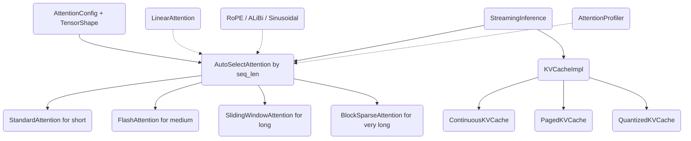

# Long-Context Attention

## Overview

Long-Context Attention is a from-scratch Rust library that implements the family
of attention mechanisms used to push transformer context windows from a few
thousand tokens toward hundreds of thousands. It is built for learning and
experimentation: every algorithm is written as plain, readable CPU code over
flat `Vec<f32>` tensors so the data movement, masking, and online-softmax math
are fully visible rather than hidden inside a vendor kernel.

The crate teaches the core ideas behind efficient long-context attention:

- The quadratic memory and compute cost of standard attention, and why it
  becomes the bottleneck at long sequence lengths.
- **FlashAttention**'s tiling and online-softmax trick that turns the O(n²)
  intermediate score matrix into an O(n) streaming computation without changing
  the result.
- **Sparsity and locality** as the other lever: sliding windows, dilated
  windows, and Longformer-style block-sparse patterns that bound the number of
  key/value positions each query attends to.
- **Linear attention**, which reorders the computation via a kernel feature map
  to avoid forming the score matrix at all.
- **Positional encoding** options — rotary embeddings (RoPE), ALiBi linear
  biases, and classic sinusoidal embeddings.
- **KV caching** for autoregressive decoding: continuous buffers, paged
  allocation in the style of vLLM, and INT8 quantization for memory savings.
- **Dispatch**: choosing an algorithm automatically from sequence length, and
  driving a prefill/decode streaming loop.

### Scope and honesty

This is a **CPU-only, algorithmic** implementation. The asymptotic memory and
compute behavior of each algorithm is real and reflected in the code, but there
is **no GPU code** — no CUDA, ROCm, Metal, or Triton kernels — despite the
GPU-flavored vocabulary (`GpuArchitecture`, "kernels") that appears in the API.
GPU architecture only selects integer thresholds for the auto-selector. There is
no training/backward pass: FlashAttention computes and stores a logsumexp value
that a backward kernel would need, but only the forward direction is exposed.
The public surface uses flat `&[f32]` slices and `TensorShape` rather than a
tensor library; `ndarray` is a dev-dependency only.

## Architecture



The library has three layers that compose cleanly:

1. **Configuration layer** (`config`). `AttentionConfig` holds every knob —
   head counts, dimensions, algorithm choice, window/block sizes, masking, data
   type — with builder methods and validation. `TensorShape` is a small
   `(batch, seq_len, num_heads, head_dim)` descriptor passed alongside the flat
   buffers, since the crate does not carry shapes inside the data.

2. **Algorithm layer** (`attention`, `flash`, `sliding_window`, `block_sparse`,
   `rope`). Each attention variant is an independent struct constructed from an
   `AttentionConfig`, with a `forward` method that consumes query/key/value
   slices and returns an `AttentionOutput`. Positional encodings transform the
   query/key buffers (RoPE) or produce additive bias matrices (ALiBi) before
   scoring.

3. **Orchestration layer** (`auto_select`, `kv_cache`, `streaming`).
   `AutoSelectAttention` owns one instance of each core algorithm and dispatches
   by sequence length. The KV caches store key/value history for decoding.
   `StreamingInference` ties a cache strategy and an attention strategy together
   into a prefill-then-decode loop.

All buffers use the same canonical memory layout: a flat `Vec<f32>` indexed as
`b * seq_len * num_heads * head_dim + s * num_heads * head_dim + h * head_dim + d`.
Keeping this layout uniform across every module is what lets the auto-selector
and streaming engine pass buffers between algorithms without reshaping.

## Core Components

### Configuration (`config`)

`AttentionConfig` is the single configuration type. Defaults are 8 heads, head
dim 64, `max_seq_len` 8192, `AttentionType::Auto`, window 4096, block size 64,
256 global tokens, 3 random blocks, RoPE on, causal on, dropout 0, FP32.

```rust
let config = AttentionConfig::new(16, 128)
    .with_attention_type(AttentionType::Flash)
    .with_window_size(2048)
    .with_num_kv_heads(8)   // grouped-query attention
    .with_causal(false);
```

Key derived methods:

- `scale()` returns `head_dim^(-0.5)`, the attention softmax temperature.
- `effective_num_kv_heads()` resolves the optional GQA KV-head count.
- `validate()` rejects zero head counts/dimensions, a `num_heads` not divisible
  by `num_kv_heads`, and zero window/block sizes, returning
  `Error::InvalidConfig`.

`AttentionType` is the enum {`Standard`, `Flash`, `SlidingWindow`, `BlockSparse`,
`Linear`, `Auto`}. `DataType` is {`Float16`, `Float32`, `BFloat16`} but the
implementation computes in `f32`; `DataType` is metadata only.

### Standard attention (`attention`)

`StandardAttention` is the reference implementation and the correctness oracle
for the others. For each batch and head it computes the full `[q_len, kv_len]`
score matrix, applies the causal mask, applies an optional additive mask,
softmaxes each query row with the max-subtraction numerical-stability trick, and
multiplies the weights by values. Cost is O(q_len · kv_len · head_dim) compute
and O(q_len · kv_len) intermediate memory per head.

The causal mask uses an offset that handles both prefill and decode:

```rust
// qi may attend to ki only if ki <= qi + (kv_len - q_len)
if ki > qi + (kv_len - q_len) {
    scores[qi * kv_len + ki] = f32::NEG_INFINITY;
}
```

During prefill `kv_len == q_len`, so the offset is zero and a query attends to
itself and earlier positions. During decode `q_len == 1` and `kv_len` is the
cached length, so the single query attends to all cached positions.

The module also exposes reusable helpers: `softmax(scores, num_rows, num_cols)`
operating row-wise in place, `apply_causal_mask(scores, q_len, kv_len)`, and
`expand_kv_heads` for GQA.

`expand_kv_heads(kv, kv_shape, target_num_heads)` replicates each KV head into a
contiguous group of `target_num_heads / num_kv_heads` query heads, returning the
expanded buffer and its new shape. When the head counts already match it returns
the input unchanged. The grouping is `target_h = kv_h * num_groups + g`, so KV
head 0 fans out to query heads `0..num_groups`, KV head 1 to the next group, and
so on — the layout grouped-query attention expects so that adjacent query heads
share a KV head. This is the in-memory analogue of the broadcast a GPU kernel
would do on the fly; here it is materialized because the downstream attention
forward methods index a single flat buffer.

A worked example of the causal mask offset clarifies the prefill/decode duality.
Suppose a model has already cached 4 tokens and is decoding token 5. Then
`q_len = 1` and `kv_len = 5`, so `offset = kv_len - q_len = 4`; the lone query
(local index 0) may attend to any `ki <= 0 + 4`, i.e. all five cached positions —
correct, because a newly generated token should see the entire history. During
prefill of a 5-token prompt, `q_len = kv_len = 5`, `offset = 0`, and query `qi`
sees `ki <= qi`, the usual lower-triangular pattern. A single formula covers both
regimes, which is what lets the same `StandardAttention::forward` serve prefill
and decode without special-casing.

### FlashAttention (`flash`)

`FlashAttention` reproduces the FlashAttention idea on CPU. It tiles queries into
blocks of `block_m` (default 64) and keys/values into blocks of `block_n`
(default 64), then for each query block streams over key blocks maintaining three
running accumulators per query row: the running max `m_i`, the running
normalizer `l_i`, and the output accumulator `acc`.

The online-softmax update, applied per query row as each KV block arrives:

```rust
let m_new = m_i[qi].max(m_ij);          // new running max
let alpha = (m_i[qi] - m_new).exp();    // rescale factor for old state
let beta  = (m_ij - m_new).exp();       // scale factor for new block
let l_new = alpha * l_i[qi] + beta * l_ij;
// rescale existing accumulator, then add this block's contribution
```

Because the score matrix is never materialized in full — only one `block_m ×
block_n` tile at a time — the intermediate memory is O(block_m · block_n) per
head plus the O(n) output, instead of O(n²). For causal attention the inner loop
stops at the diagonal key block (`end_kv_block`), skipping fully-masked tiles.
After finishing a query block, the kernel writes `m_i + ln(l_i)` into a
`logsumexp` buffer — the statistic a backward pass would consume, though no
backward is implemented.

The subtle correctness point is the accumulator rescale. When a later KV block
raises the running max from `m_i` to `m_new`, every previously accumulated output
contribution was normalized against the old max and old `l_i`, so it must be
multiplied by `alpha * l_i / l_new` to be consistent with the new statistics
before the current block's contribution (scaled by `beta / l_new`) is added. The
implementation does exactly this per query row per output dimension. Skipping the
rescale — a common bug in hand-written flash kernels — produces outputs that
silently diverge from standard attention only on inputs whose per-block maxima
differ, which is why the test suite deliberately uses small block sizes (4×4 on a
length-12 sequence) to force many cross-block max updates and then compares
against `StandardAttention`.

`estimate_memory(batch, seq_len)` returns the tile + accumulator + output +
logsumexp byte count, which is dominated by the O(n) output term; tests assert it
stays well under the O(n²) figure and scales sub-quadratically. Concretely, for
32 heads and head dim 128 at 32K tokens, a dense `n × n` score matrix per head
would be on the order of gigabytes, whereas this kernel's non-output state is the
fixed `block_m × block_n` tile (a few thousand floats) plus the O(n) logsumexp,
so the estimate comes in under the 1 GB bound the test checks.

`LinearAttention` is the other occupant of this module. It applies the ELU+1
feature map `φ(x) = x + 1` for `x ≥ 0`, `exp(x)` otherwise, accumulates the
`[head_dim, head_dim]` matrix `K^T V` and the key sum in a single pass over keys,
then computes each query's output as `φ(Q) · (K^T V)` normalized by
`φ(Q) · Σφ(K)`. This is O(n · head_dim²) — linear in sequence length.

The trick is associativity. Softmax attention must compute `softmax(QK^T) V`,
and the softmax forces the `n × n` matrix `QK^T` to be formed before it can be
multiplied by `V`. Linear attention replaces the softmax with a separable kernel
`φ(q)·φ(k)`, after which the product can be reassociated as
`φ(Q) · (φ(K)^T V)`: the inner `φ(K)^T V` is a small `head_dim × head_dim`
summary that absorbs the entire key/value history in one pass, and each query is
then a single matrix-vector product against that summary. The normalizer
`φ(Q) · Σφ(K)` plays the role of the softmax denominator. The cost of this
linearity is that linear attention is an **approximation** — it cannot represent
the sharp, content-dependent selectivity of true softmax — so the crate offers it
as an option rather than a drop-in equal of the exact variants, and tests assert
only shape and finiteness for it, not equivalence to standard attention. The
`1e-6` guard on the normalizer avoids division by a near-zero denominator when a
query maps to a near-orthogonal feature.

### Sliding window attention (`sliding_window`)

`SlidingWindowAttention` restricts every query to the `window_size` most recent
key positions (causal) or a symmetric window (non-causal). For each query it
computes scores only within `[window_start, window_end)`, softmaxes, and weights
the values:

```rust
let window_start = if qi >= window_size { qi - window_size + 1 } else { 0 };
let window_end = if causal { (qi + 1).min(kv_len) } else { (qi + window_size).min(kv_len) };
```

Memory is O(n · window_size) for scores rather than O(n²), reflected in
`estimate_memory`. `window_size()` exposes the configured window.

`DilatedSlidingWindowAttention` adds a `dilation` stride: it collects window
positions spaced `dilation` apart (`qi - i*dilation`), giving a wider receptive
field for the same number of attended positions, in the spirit of dilated
convolutions and Longformer's dilated heads. With `window_size = w` attended
positions and `dilation = d`, the effective receptive span is `w * d` tokens even
though only `w` keys are scored per query, so a model can stack a few dilated
heads with different `d` values to cover a long range cheaply. Unlike the
contiguous window, the dilated variant builds an explicit `positions` vector per
query (rather than iterating a range), because the attended set is no longer a
contiguous interval; this costs a small allocation per query but keeps the
scoring loop identical to the dense path over the gathered positions.

The sliding window's chief virtue is that its per-query cost is **independent of
total sequence length** — doubling `n` doubles the number of queries but leaves
each query's `window_len` unchanged. That is what makes it the auto-selector's
choice in the long-but-not-enormous regime: it sacrifices the ability to attend
beyond the window (information must propagate across windows over multiple layers,
the same way a stack of convolutions grows its receptive field) in exchange for
strictly linear memory and compute. The non-causal branch widens the window
symmetrically around the query, which is appropriate for encoder-style
bidirectional models.

### Block sparse attention (`block_sparse`)

`BlockSparseAttention` implements the Longformer attention pattern at block
granularity. `SparsePattern` is a `num_blocks × num_blocks` boolean matrix with
`set`/`get`, `count_active`, and a `sparsity()` ratio.

`build_pattern(seq_len)` constructs the pattern in three steps:

1. **Local window** — each query block attends to the `window_size / block_size`
   blocks before it (and itself); non-causal also looks forward.
2. **Random blocks** — `num_random_blocks` additional randomly chosen blocks per
   row (respecting causality), giving sparse long-range connections.
3. **Global tokens** — the first `num_global_tokens / block_size` blocks both
   attend to all blocks and are attended by all blocks (full rows and columns).

`forward` then, per query block, gathers the union of attended key positions
(filtered by the causal mask), computes a dense softmax over just those
positions, and accumulates the weighted values. Cost scales with the number of
active blocks rather than n².

The three-part pattern is the heart of the Longformer recipe and each part buys a
different capability. The **local window** preserves the fine-grained
short-range dependencies that dominate language modeling. The **global tokens**
give the model a handful of positions (typically prompt or task tokens) with full
visibility in both directions, which is how Longformer-style models route
long-range information without dense attention — every block can reach a global
block in one hop. The **random blocks** add a few stochastic long edges per row;
in expectation they keep the attention graph's diameter small, approximating the
mixing of full attention at a fraction of the cost. `SparsePattern::sparsity()`
makes the trade-off measurable: for a long sequence with a modest window, global
count, and random count, the active fraction is small and the reported sparsity
approaches 1.0, directly proportional to the compute saved versus dense
attention. Because the pattern is built once per `forward` and reused across all
batches and heads, the random choices are shared within a call but reseeded
across calls (it draws from `rand::thread_rng()`), which is acceptable for a
forward-only library but is a place a production system would want a fixed seed
for reproducibility.

### Positional encodings (`rope`)

`RotaryEmbedding` precomputes per-position `cos`/`sin` tables from inverse
frequencies `1 / base^(2i/dim)` (default `base = 10000`). `apply` rotates each
pair `(x_i, x_{i+half})` in place by the angle for that position:

```rust
x[idx1] = x1 * cos - x2 * sin;
x[idx2] = x1 * sin + x2 * cos;
```

Rotation preserves vector magnitude (a tested property) and at position 0 is the
identity. `position_ids` allow non-contiguous positions (e.g. for KV-cache
decode).

`ALiBiPositionalBias` computes per-head slopes as a geometric sequence with ratio
`2^(-8/num_heads)` and produces an additive bias `-slope · |qi - ki|` — a
distance penalty added to scores instead of rotating inputs. Slopes are positive
and decreasing across heads; the bias is symmetric in `(qi, ki)` and zero on the
diagonal.

`sinusoidal_position_embedding(position, dim)` returns the classic transformer
embedding with `sin` in the first half and `cos` in the second.

The two learned-free schemes occupy different points in the design space. RoPE
acts **multiplicatively on the query and key vectors before scoring**, so the
dot product of a rotated query and a rotated key depends only on their relative
offset — the property that lets RoPE generalize across positions and interact
cleanly with KV caches (each cached key was rotated once, at the position it was
produced, via `position_ids`). ALiBi instead acts **additively on the scores**,
needing no change to Q/K at all; its per-head slopes mean some heads attend
sharply local (large slope, steep distance penalty) while others stay nearly
uniform (small slope), giving the model a built-in multi-scale view of distance.
The crate keeps both because they represent the two dominant families in
long-context models, and the `use_rope` / `use_alibi` flags on `AttentionConfig`
let a caller pick. Precomputing RoPE's `cos`/`sin` tables up to `max_seq_len`
trades `O(max_seq_len * head_dim/2)` memory for an O(1) per-element lookup at
apply time — the right trade when the same embedding is applied every layer and
every step.

### KV caches (`kv_cache`)

Three cache strategies share the goal of storing key/value history for decoding:

- **`ContinuousKVCache`** — pre-allocates a `[batch, max_seq_len, num_heads,
  head_dim]` buffer per layer. `update(layer, key, value, seq_len)` appends at
  the current offset and returns a slice of the populated region; it errors with
  `SequenceTooLong` past `max_seq_len`. Simple and fast, but reserves the maximum
  up front.

- **`PagedKVCache`** — vLLM-style paging. Memory is a pool of fixed-size blocks;
  each sequence owns a block table mapping logical positions to physical blocks.
  `allocate_sequence`, `update`, `gather`, and `free_sequence` let many sequences
  share one pool without contiguous reservations, and `num_free_blocks` /
  `num_sequences` report pool state. Out-of-blocks returns `Error::OutOfMemory`.

- **`QuantizedKVCache`** — stores keys and values as INT8 with a per-token,
  per-head scale `max(|x|)/127`. `update` quantizes and stores; `get` dequantizes
  back to `f32`. `memory_savings()` reports the fraction saved versus FP32,
  `(1 - (1 + 4/head_dim)/4)` — close to 4× for large head dimensions.

The three caches form a deliberate progression in the memory/complexity
trade-off. `ContinuousKVCache` is the simplest and fastest to index but
pessimistic on memory: it reserves `batch * max_seq_len * num_heads * head_dim`
floats per layer regardless of how many tokens are actually generated, which is
wasteful when sequences finish early or vary in length. `PagedKVCache` solves
exactly that by decoupling logical position from physical storage — a sequence
grows by claiming blocks from a shared free list on demand and returns them on
`free_sequence`, so total memory tracks the live token count across all sequences
rather than the sum of worst cases. This is the same insight as virtual memory
paging and is why vLLM-style serving can pack far more concurrent sequences into
the same budget. `QuantizedKVCache` attacks the per-element size instead of the
allocation pattern: by keeping the scale per token and head it bounds the
quantization error within each small group of `head_dim` values, since a single
outlier only stretches the scale for its own token-head rather than the whole
tensor. The `1e-5` floor on the scale prevents division by zero for all-zero
vectors. These are orthogonal optimizations — a production cache would combine
paging with quantization, which this library keeps separate for clarity.

### Auto-selection (`auto_select`)

`AutoSelectAttention` constructs one `StandardAttention`, `FlashAttention`,
`SlidingWindowAttention`, and `BlockSparseAttention` from a shared config, then
routes by sequence length using `SelectionThresholds`:

```
seq_len < flash_min            -> Standard
seq_len < sliding_window_min   -> Flash
seq_len < block_sparse_min     -> SlidingWindow
otherwise                      -> BlockSparse
```

`SelectionThresholds::for_gpu(arch)` returns different cut-offs per
`GpuArchitecture` (V100/Generic, A100, H100) — these are tuning constants only;
no GPU is detected or used. `select_impl` exposes the decision, `forward`
executes it, and `estimate_memory` returns the chosen algorithm's footprint
(using the O(n²) formula for standard).

A concrete dispatch trace with the default (Generic) thresholds
`flash_min = 512`, `sliding_window_min = 4096`, `block_sparse_min = 16384`: a
length-128 sequence routes to `Standard` (tiling overhead would not pay off), a
length-2048 sequence to `Flash` (the sweet spot where O(n) memory matters but the
window/sparsity approximations are unnecessary), a length-8192 sequence to
`SlidingWindow`, and a length-65536 sequence to `BlockSparse`. Switching to the
A100 profile raises `flash_min` to 256 and pushes the sliding/sparse cutoffs out
to 8192/32768, reflecting that a larger, faster device profitably runs exact
attention over longer spans before resorting to approximation. Because these are
plain integer constants, the selector itself is allocation-free and its decision
is a pure function of length — `select_impl` is exposed so callers can inspect or
override the choice.

`AttentionProfiler` records `(seq_len, AttentionType, time_ms)` samples and can
report `average_time` and the empirically `best_impl` for a length — a hook for
data-driven dispatch on top of the static thresholds. The intended workflow is to
run representative shapes through each algorithm, feed the timings to the
profiler, and let `best_impl` recommend the empirically fastest variant, which
can then be used to re-tune `SelectionThresholds`. This separates the static,
length-based policy (cheap, always available) from an optional measured policy
(accurate, but requires a calibration pass).

### Streaming inference (`streaming`)

`StreamingInference` drives autoregressive generation. It holds a
`StreamingConfig` (layers, batch, max length, heads, dim, masking) plus an
`AttentionStrategy` ({`Standard`, `Flash`, `SlidingWindow { window_size }`}) and a
`CacheStrategy` ({`Continuous`, `Paged { block_size, num_blocks }`,
`Quantized`}). Internally a `KVCacheImpl` enum wraps the chosen cache.

The loop runs in two stages:

- **`prefill(query, key, value, seq_len, layer)`** processes the whole prompt at
  once, fills the cache, and computes attention over the prompt. After the last
  layer it marks prefill done and records per-batch lengths.
- **`decode_step(query, key, value, layer)`** appends a single token's KV to the
  cache, gathers the full cached KV, and runs attention with `q_len = 1` against
  `kv_len = new_len`. It errors if called before prefill or past `max_seq_len`.

`forward` auto-routes to prefill or decode based on state. The
`StreamingInferenceBuilder` provides a fluent constructor
(`.flash_attention()`, `.sliding_window(w)`, `.paged_cache(bs, nb)`,
`.quantized_cache()`, etc.). `current_seq_len`, `is_prefill_done`,
`remaining_capacity`, and `reset` round out the runtime API.

The crucial data-flow detail is the asymmetry between the two stages. In prefill,
query, key, and value all have length `seq_len`, and attention is computed
directly over the prompt (the cache is filled as a side effect for later use). In
decode, only a single new token's Q/K/V arrive; the engine appends the new K/V to
the cache, then runs attention with a `q_shape` of `seq_len = 1` against a
`kv_shape` whose `seq_len` is the full cached length `new_len`. This is precisely
the case the unified causal-mask offset was built for — `q_len = 1`,
`kv_len = new_len`, offset `new_len - 1`, so the new token attends to everything
before it. The per-layer `layer` argument lets a multi-layer model reuse one
engine, with the engine only advancing its recorded sequence length when the last
layer completes, so all layers in a step observe a consistent cache length. The
`StreamingConfig::attention_strategy` chooses how that attention is computed
(standard exact, flash for memory, or sliding window for very long contexts),
decoupled from the `cache_strategy` that chooses how history is stored — any
combination of the two is valid.

### Error handling

All fallible operations return `crate::Result<T>`, an alias for
`std::result::Result<T, Error>`, where `Error` is a `thiserror`-derived enum. The
variants map one-to-one onto the failure modes the library actually produces:
`InvalidConfig` from `AttentionConfig::validate` and from calling `decode_step`
before `prefill`; `DimensionMismatch` from a query/KV head-count disagreement in
`StandardAttention::forward`; `OutOfMemory` from `PagedKVCache` when the free
block list cannot satisfy an allocation; `CacheError` for an unknown layer or
sequence id; `SequenceTooLong` when a cache or streaming append would exceed
`max_seq_len`; and `InvalidMask` reserved for malformed masks. Because each
variant carries the relevant numbers (e.g. `SequenceTooLong { length, max }`),
callers get actionable diagnostics rather than a bare unit error. The forward
methods that cannot fail on valid input (flash, sliding, sparse, linear) still
return `Result` for a uniform signature, which keeps the auto-selector's `match`
over algorithms simple and lets future validation be added without breaking the
API. This `Result`-everywhere discipline follows the repo's Rust convention and
means no attention path panics on bad configuration — it surfaces a typed error
instead.

## Data Structures

```rust
/// Algorithm selector.
pub enum AttentionType {
    Standard, Flash, SlidingWindow, BlockSparse, Linear, Auto,
}

/// Full configuration (builder methods elided).
pub struct AttentionConfig {
    pub num_heads: usize,
    pub head_dim: usize,
    pub num_kv_heads: Option<usize>,   // GQA/MQA
    pub max_seq_len: usize,
    pub attention_type: AttentionType,
    pub window_size: usize,
    pub block_size: usize,
    pub num_global_tokens: usize,
    pub num_random_blocks: usize,
    pub use_alibi: bool,
    pub use_rope: bool,
    pub causal: bool,
    pub dropout: f32,
    pub dtype: DataType,
}

/// Shape descriptor carried alongside flat buffers.
pub struct TensorShape {
    pub batch: usize,
    pub seq_len: usize,
    pub num_heads: usize,
    pub head_dim: usize,
}

/// Output of every attention forward pass.
pub struct AttentionOutput {
    pub output: Vec<f32>,                  // [batch, seq_len, num_heads, head_dim]
    pub shape: TensorShape,
    pub attention_weights: Option<Vec<f32>>,
}

/// Block sparse attendance pattern.
pub struct SparsePattern {
    pub num_blocks: usize,
    pub block_size: usize,
    pub pattern: Vec<bool>,                // num_blocks * num_blocks
}

/// Per-layer KV history.
pub struct KVCacheEntry {
    pub key: Vec<f32>,
    pub value: Vec<f32>,
    pub current_len: usize,
}

/// Streaming engine configuration.
pub struct StreamingConfig {
    pub num_layers: usize,
    pub batch_size: usize,
    pub max_seq_len: usize,
    pub num_heads: usize,
    pub head_dim: usize,
    pub causal: bool,
    pub attention_strategy: AttentionStrategy,
    pub cache_strategy: CacheStrategy,
}

/// Library error type.
pub enum Error {
    InvalidConfig(String),
    DimensionMismatch { expected: usize, actual: usize },
    OutOfMemory { required: usize, available: usize },
    CacheError(String),
    SequenceTooLong { length: usize, max: usize },
    InvalidMask,
}
```

The canonical buffer layout is contiguous over `[batch, seq_len, num_heads,
head_dim]` with element index:

```
idx = b * seq_len * num_heads * head_dim
    + s * num_heads * head_dim
    + h * head_dim
    + d
```

Every module reads and writes this same layout, which is why outputs of one
algorithm can flow into another (e.g. via the auto-selector or streaming engine)
without reshaping.

### Memory layout and indexing

The choice of a `[batch, seq_len, num_heads, head_dim]` ("BSHD") layout over the
alternative `[batch, num_heads, seq_len, head_dim]` ("BHSD") is deliberate and
shapes the inner loops. In BSHD, the `head_dim` values for a given
`(b, s, h)` are contiguous, so the dot-product over `d` and the value
accumulation over `d` both walk contiguous memory — cache-friendly for the
innermost loop. The cost is that iterating keys at fixed `(b, h)` strides by
`num_heads * head_dim` between positions rather than being contiguous, which the
code pays by computing explicit linear indices everywhere rather than relying on
slicing. Keeping every module on the same convention is what makes the system
composable: `AutoSelectAttention` can hand the same `query`/`key`/`value` slices
to whichever algorithm it selects, and `StreamingInference` can append a decode
token's K/V to a cache and feed the gathered result straight back into an
attention `forward`, with no transpose or copy beyond what the cache itself does.

Because shapes travel out-of-band in `TensorShape` rather than inside the data,
the caller is responsible for supplying buffers whose length matches
`batch * seq_len * num_heads * head_dim`. The one shape check the library
enforces is that query and key/value head counts agree
(`Error::DimensionMismatch`); other mismatches manifest as out-of-bounds indexing
and are the caller's contract to satisfy. This is a conscious simplicity trade —
a tensor library would track and verify shapes, but flat slices keep the
arithmetic explicit and the dependencies minimal.

## API Design

Each attention algorithm follows the same shape: construct from a config, then
call `forward` with flat buffers and shapes.

```rust
// Construction
StandardAttention::new(config) -> StandardAttention
FlashAttention::new(config) -> FlashAttention
FlashAttention::with_block_sizes(config, block_m, block_n) -> FlashAttention
LinearAttention::new(config) -> LinearAttention
SlidingWindowAttention::new(config) -> SlidingWindowAttention
DilatedSlidingWindowAttention::new(config, dilation) -> DilatedSlidingWindowAttention
BlockSparseAttention::new(config) -> BlockSparseAttention
AutoSelectAttention::new(config) -> AutoSelectAttention
AutoSelectAttention::for_gpu(config, GpuArchitecture) -> AutoSelectAttention

// Forward (most variants)
fn forward(
    &self,
    query: &[f32],
    key: &[f32],
    value: &[f32],
    q_shape: TensorShape,
    kv_shape: TensorShape,
    attention_mask: Option<&[f32]>,
) -> Result<AttentionOutput>;
```

Positional encodings:

```rust
RotaryEmbedding::new(head_dim, max_seq_len) -> RotaryEmbedding
RotaryEmbedding::with_base(head_dim, max_seq_len, base) -> RotaryEmbedding
fn apply(&self, x: &mut [f32], shape: TensorShape, position_ids: Option<&[usize]>);

ALiBiPositionalBias::new(num_heads, max_seq_len) -> ALiBiPositionalBias
fn compute_bias(&self, q_len: usize, kv_len: usize) -> Vec<f32>;

fn sinusoidal_position_embedding(position: usize, dim: usize) -> Vec<f32>;
```

KV caches:

```rust
ContinuousKVCache::new(num_layers, batch, max_seq_len, num_heads, head_dim)
fn update(&mut self, layer, key, value, seq_len) -> Result<(&[f32], &[f32])>
fn get(&self, layer) -> Option<(&[f32], &[f32], usize)>

PagedKVCache::new(num_blocks, block_size, num_heads, head_dim)
fn allocate_sequence(&mut self, seq_id, initial_tokens) -> Result<()>
fn update(&mut self, seq_id, key, value) -> Result<()>
fn gather(&self, seq_id) -> Result<(Vec<f32>, Vec<f32>)>
fn free_sequence(&mut self, seq_id)

QuantizedKVCache::new(batch, max_seq_len, num_heads, head_dim)
fn update(&mut self, key, value, seq_len) -> Result<()>
fn get(&self) -> (Vec<f32>, Vec<f32>)
fn memory_savings(&self) -> f32
```

Streaming:

```rust
StreamingInferenceBuilder::new()
    .num_layers(n).batch_size(n).num_heads(n).head_dim(n).max_seq_len(n)
    .flash_attention()             // or .standard_attention() / .sliding_window(w)
    .continuous_cache()            // or .paged_cache(bs, nb) / .quantized_cache()
    .build() -> StreamingInference

fn prefill(&mut self, q, k, v, seq_len, layer) -> Result<InferenceStepResult>
fn decode_step(&mut self, q, k, v, layer) -> Result<InferenceStepResult>
fn forward(&mut self, q, k, v, seq_len, layer) -> Result<InferenceStepResult>
```

All fallible operations return `Result<T, Error>`; the error enum distinguishes
configuration, dimension, capacity, and cache faults.

## Performance

The performance story is about **asymptotic memory and compute**, not measured
GPU throughput (there is none). The relevant complexities, per batch and head:

| Algorithm | Score memory | Compute |
|-----------|--------------|---------|
| Standard | O(n²) | O(n² · head_dim) |
| FlashAttention | O(block_m · block_n) tile | O(n² · head_dim), tiled |
| Sliding window | O(n · window) | O(n · window · head_dim) |
| Block sparse | O(active blocks) | O(active blocks · block_size² · head_dim) |
| Linear | O(head_dim²) | O(n · head_dim²) |

Design choices that back these up:

- **FlashAttention never materializes the full score matrix.** Only one
  `block_m × block_n` tile lives at a time; the running `(m_i, l_i, acc)` state
  is O(block_m). `estimate_memory` confirms the footprint is dominated by the
  O(n) output, and tests assert sub-quadratic scaling across 1K/2K/4K lengths.
- **Sliding window bounds the inner loop** to `window_size` keys per query, so
  both compute and the per-query score buffer are independent of total length.
- **Block sparse touches only active blocks**, so for high sparsity the work is a
  small fraction of dense attention; `SparsePattern::sparsity()` quantifies it.
- **Linear attention reorders the matmuls** so the `[head_dim, head_dim]`
  summary matrix is built once per head in a single pass — no `n × n` product.
- **Quantized KV cache** cuts cache memory toward 4× via INT8 plus per-token
  scales, traded against quantization error.
- **Paged KV cache** avoids per-sequence worst-case reservation, packing many
  sequences into a shared block pool.

`benches/attention.rs` provides Criterion micro-benchmarks for standard and flash
attention at sequence lengths 64/128/256/512 and for the streaming engine, giving
real (CPU) timings on the host running them. No throughput numbers are baked into
the docs because they would be machine-specific.

The auto-selector's thresholds encode the practical crossover points: standard
attention is cheapest for short sequences (no tiling overhead), flash wins in the
mid-range, sliding/sparse take over once length dominates.

A worked sparsity figure makes the block-sparse saving concrete. Take
`seq_len = 16384`, `block_size = 64` (so 256 blocks), `window_size = 512` (8
window blocks), `num_global_tokens = 256` (4 global blocks), and
`num_random_blocks = 3`. A causal local window contributes on the order of 8
active blocks per row, plus 3 random and the global rows/columns; the active
count is a few thousand of the 256² = 65,536 possible block pairs, so
`SparsePattern::sparsity()` reports roughly 0.95–0.98. Dense attention at this
length would form a 16384² score matrix per head (about a gigabyte in f32),
whereas block-sparse touches only the active blocks — the saving is the
complement of the sparsity ratio. This is the mechanism behind the order-of-
magnitude reductions that long-context models rely on, expressed here in code
rather than asserted as a benchmark.

The benchmark harness is intentionally scoped to what is meaningful on CPU. It
times `StandardAttention` and `FlashAttention` across the lengths 64/128/256/512
and exercises the `StreamingInference` engine, using Criterion's statistical
sampling. These produce real, reproducible numbers on the machine that runs them,
which is the honest way to report performance for a CPU library — as opposed to
quoting GPU throughput the code cannot achieve. A reader who wants numbers runs
`cargo bench` and reads them off their own hardware.

## Testing Strategy

The crate ships 142 unit tests (module counts: attention 19, flash 18, rope 27,
block_sparse 19, sliding_window 3, config 4, auto_select 6, kv_cache 24,
streaming 22), runnable with `cargo test`. The strategy is layered:

- **Correctness oracles.** `StandardAttention` is the ground truth.
  `test_flash_attention_matches_standard` and
  `test_flash_attention_online_softmax_correctness` assert FlashAttention equals
  standard attention within tolerance, including with small block sizes that
  force many online-softmax merges — the key risk for the tiling math.

- **Masking and causality.** Tests verify causal masks for square (prefill) and
  asymmetric (decode, `q_len < kv_len`) shapes, that the first position attends
  only to itself, and that additive masks are honored.

- **Numerical stability.** Several tests feed large magnitudes through softmax,
  flash, and RoPE and assert outputs stay finite — exercising the
  max-subtraction in softmax and the rescaling in online softmax.

- **Algebraic properties.** RoPE is checked to be the identity at position 0,
  position-dependent, deterministic, and magnitude-preserving. ALiBi slopes are
  asserted positive and decreasing, and the bias symmetric, zero-diagonal, and
  monotonic in distance. Sinusoidal embeddings are bounded to `[-1, 1]`.

- **Shape and batch invariants.** Output length and `TensorShape` fields are
  checked across batch sizes and head configurations; `expand_kv_heads` is tested
  for both the expansion and no-op paths, and a dimension mismatch is asserted to
  return `Error::DimensionMismatch`.

- **Cache behavior.** Continuous cache append/reset, paged allocation, block
  reuse and freeing, capacity-exceeded errors, and INT8 quantize/dequantize
  round-trips (with bounded error) are all covered.

- **Streaming state machine.** Tests cover prefill, single and repeated decode
  steps, the "decode before prefill" error, capacity limits, and the builder's
  strategy combinations.

Edge cases emphasized: sequences shorter than a window/block, sequence length not
a multiple of the block size, position 0 in positional encodings, and
length-exceeds-max in caches and streaming.

The distribution of tests across modules mirrors where the algorithmic risk
lives. `rope` carries the most (27), because positional encoding is easy to get
subtly wrong and its properties — identity at zero, magnitude preservation,
determinism, monotone ALiBi penalties — are precisely checkable. `kv_cache` (24)
and `streaming` (22) are next, since cache indexing and the prefill/decode state
machine have the most stateful, off-by-one-prone logic. `attention` (19) and
`flash` (18) are validated chiefly through equivalence and stability, with
`block_sparse` (19) checking pattern construction and execution. The thinner
modules — `sliding_window` (3), `config` (4), `auto_select` (6) — are simpler and
largely covered by their callers. The guiding principle is differential testing:
rather than hardcoding expected output tensors (brittle and uninformative), the
suite pins the approximate algorithms to the exact reference and verifies
invariants that must hold for any correct implementation, which is what gives
confidence that the tiling, masking, and online-softmax machinery is right.

## References

- Dao et al., *FlashAttention: Fast and Memory-Efficient Exact Attention with
  IO-Awareness* (https://arxiv.org/abs/2205.14135)
- Dao, *FlashAttention-2* (https://arxiv.org/abs/2307.08691)
- Beltagy et al., *Longformer: The Long-Document Transformer*
  (https://arxiv.org/abs/2004.05150)
- Su et al., *RoFormer: Enhanced Transformer with Rotary Position Embedding*
  (https://arxiv.org/abs/2104.09864)
- Press et al., *Train Short, Test Long: Attention with Linear Biases (ALiBi)*
  (https://arxiv.org/abs/2108.12409)
- Katharopoulos et al., *Transformers are RNNs: Fast Autoregressive Transformers
  with Linear Attention* (https://arxiv.org/abs/2006.16236)
- Kwon et al., *Efficient Memory Management for LLM Serving with PagedAttention
  (vLLM)* (https://arxiv.org/abs/2309.06180)
