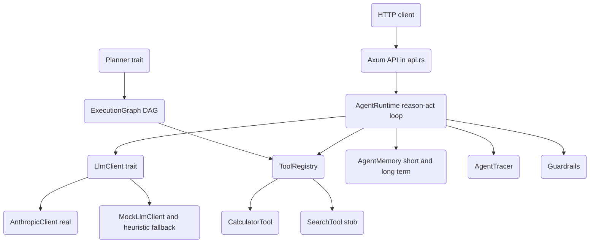

# LLM Agentic Runtime

A from-scratch Rust runtime for LLM-driven autonomous agents. It runs a ReAct-style
reason/act loop over a pluggable LLM client, dispatches tool calls through a trait-based
registry, persists step history in a tiered memory, and exposes the whole thing over an
Axum HTTP API. The reasoning loop is model-agnostic: attach a real Anthropic client, a
deterministic mock, or run with no client at all.

## Features

- **ReAct reasoning loop** — the `AgentRuntime` iterates think → act → observe, parsing
  each model turn into a `(thought, action, action_input)` triple and stopping on a
  `finish` action, a timeout, or a max-step cap (`agent.rs`).
- **Pluggable LLM client** — the `LlmClient` trait abstracts the model. `AnthropicClient`
  is a real raw-HTTP wrapper over the Anthropic Messages API; `MockLlmClient` replays
  scripted responses for offline tests (`llm.rs`).
- **Deterministic fallback** — with no `LlmClient` attached the runtime uses a built-in
  heuristic so demos and tests run without a network call or API key (`AgentRuntime::think_simulated`).
- **Trait-based tools** — implement `Tool` and register it in `ToolRegistry`. Ships with
  `CalculatorTool` (recursive expression evaluator) and a `SearchTool` stub (`tools.rs`).
- **Tiered memory** — `AgentMemory` keeps a bounded short-term `VecDeque`, overflows into
  scored long-term entries, and supports keyword recall plus run summaries (`memory.rs`).
- **Planners** — `SimplePlanner`, `RulePlanner`, and `HybridPlanner` produce a `Plan` of
  dependency-linked `PlanStep`s; `PlanOptimizer` finds parallelizable levels (`planner.rs`).
- **DAG executor** — `ExecutionGraph` builds a node graph from a plan, runs ready nodes in
  batches, resolves `$node` input references, and topologically orders execution (`executor.rs`).
- **Guardrails** — `Guardrails` enforces blocked regex patterns, tool allow/deny lists, and
  length limits; `CommonGuardrails`, `SqlGuard`, and `ContentModeration` add presets (`guardrails.rs`).
- **Tracing** — `AgentTracer` records traces, writes them as JSON, computes statistics, and
  exports successful runs as chat-formatted training data (`tracing.rs`).
- **HTTP API** — Axum server with run/poll/cancel endpoints, an in-memory task registry, and
  background execution (`api.rs`, `main.rs`).

## Architecture



| Component | Module | Responsibility |
|-----------|--------|----------------|
| Agent runtime | `agent` | ReAct loop, state machine, ReAct prompt build and parse |
| LLM client | `llm` | `LlmClient` trait, real `AnthropicClient`, `MockLlmClient` |
| Tools | `tools` | `Tool` trait, `ToolRegistry`, calculator and search tools |
| Memory | `memory` | Short/long-term store, importance scoring, recall, summary |
| Planner | `planner` | `Plan`/`PlanStep` types and simple/rule/hybrid planners |
| Executor | `executor` | DAG build from plan, batched parallel run, topo sort |
| Guardrails | `guardrails` | Pattern/tool/length validation, SQL and content checks |
| Tracing | `tracing` | Trace capture, JSON persistence, stats, training export |
| HTTP API | `api` | Run/poll/cancel endpoints over a background task registry |

## Quick Start

### Prerequisites

- Rust 1.75+ (2021 edition) and Cargo.
- No external services are required to build, test, or run the deterministic path.
- An `ANTHROPIC_API_KEY` is required only to drive the agent with a real model.

### Installation

```bash
cd 23-llm-agentic-runtime
cargo build
```

### Running

```bash
# Deterministic heuristic path (no key needed):
cargo run

# Drive the loop with a real model:
ANTHROPIC_API_KEY=sk-... BIND_ADDR=127.0.0.1:8080 cargo run
```

The server listens on `BIND_ADDR` (default `0.0.0.0:8080`) and exposes `GET /health`,
`GET /tools`, `POST /agent/run`, `GET /agent/{task_id}`, and `POST /agent/{task_id}/cancel`.

```bash
curl -s localhost:8080/agent/run \
  -H 'content-type: application/json' \
  -d '{"task":"summarize the plan","max_steps":10}'
# {"task_id":"...","status":"running"}
```

## Usage

Run the agent loop in-process with a scripted mock client (no key, no network):

```rust
use llm_agentic_runtime::{
    AgentContext, AgentMemory, AgentRuntime, AgentRuntimeConfig, MockLlmClient,
    SearchTool, SimplePlanner, ToolRegistry,
};

#[tokio::main]
async fn main() {
    let mut tools = ToolRegistry::new();
    tools.register(Box::new(SearchTool::new("search")));

    // The model searches first, then finishes.
    let scripted = vec![
        r#"{"thought":"search it","action":"search","action_input":{"query":"France"}}"#.to_string(),
        r#"{"thought":"answer","action":"finish","action_input":{"answer":"Paris"}}"#.to_string(),
    ];

    let mut runtime = AgentRuntime::new(
        tools,
        Box::new(SimplePlanner::new()),
        AgentMemory::new(10),
        AgentRuntimeConfig::default(),
    )
    .with_llm(Box::new(MockLlmClient::new(scripted)));

    let result = runtime
        .run(AgentContext::new("capital of France").with_max_steps(5))
        .await;

    assert!(result.success);
    println!("answer = {:?}", result.answer); // Some("Paris")
}
```

Swap `MockLlmClient` for `AnthropicClient::from_env()` to use a real model, or omit
`.with_llm(...)` entirely to run the deterministic heuristic.

## What's Real vs Simulated

- **Real:** the ReAct loop, state machine, ReAct prompt/JSON parsing, timeout and
  max-step handling; the `LlmClient` trait and the `AnthropicClient` HTTP wrapper; the
  `MockLlmClient`; the `CalculatorTool` expression evaluator; `ToolRegistry`; tiered
  `AgentMemory`; planners and `PlanOptimizer`; the `ExecutionGraph` DAG (build, batched
  run, dependency resolution, topo sort); `Guardrails` and the SQL/content presets; the
  `AgentTracer` (JSON persistence, stats, training export); and the Axum API
  (run/poll/cancel over an in-memory registry). All are exercised by unit tests.
- **Simulated / requires credentials:** `AnthropicClient` needs a live `ANTHROPIC_API_KEY`
  and network — without it the runtime falls back to the deterministic heuristic.
  `SearchTool` is a stub that returns an explicit "no backend configured" placeholder
  rather than real results. Unknown actions in the loop and executor are echoed rather
  than executed. Memory `embedding` fields are placeholders; long-term recall is keyword
  matching, not vector similarity. The task registry is in-memory and non-persistent.

## Testing

```bash
cargo test
```

Tests live in `#[cfg(test)]` modules in each source file. They cover the agent loop
(deterministic and mock-LLM paths, timeout, ReAct parsing), tools, memory tiering and
recall, planners and parallelism, the execution graph, guardrails, the tracer, and the
HTTP API (health, tools listing, run-then-poll, 404). No external services or API key are
needed — the API tests run the deterministic path.

## Project Structure

```
23-llm-agentic-runtime/
  src/
    lib.rs         # Crate root, Error enum, shared constants
    agent.rs       # AgentRuntime ReAct loop and state machine
    llm.rs         # LlmClient trait, AnthropicClient, MockLlmClient
    tools.rs       # Tool trait, ToolRegistry, calculator and search tools
    memory.rs      # AgentMemory tiered store, WorkingMemory
    planner.rs     # Plan/PlanStep, planners, PlanOptimizer
    executor.rs    # ExecutionGraph DAG executor
    guardrails.rs  # Guardrails and content/SQL safety checks
    tracing.rs     # AgentTracer, training-data export
    api.rs         # Axum HTTP API
    main.rs        # Binary entry point (HTTP server)
  docs/BLUEPRINT.md   # Full architecture and design
```

## License

MIT — see [LICENSE](../LICENSE)
