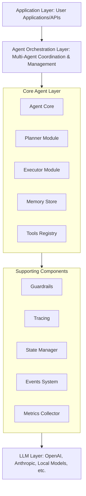
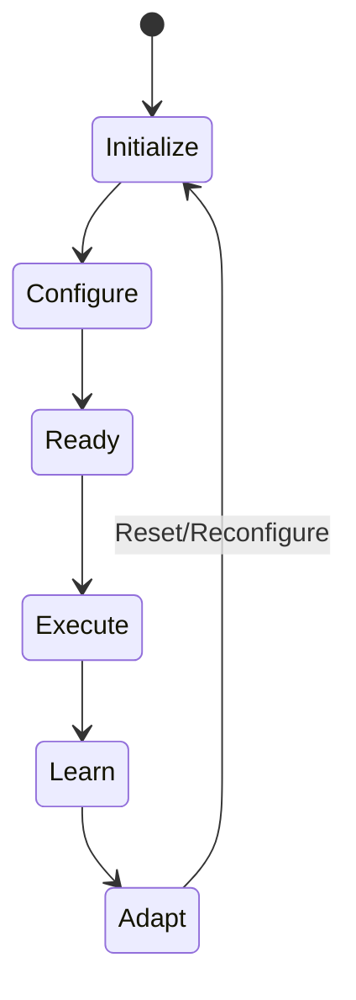
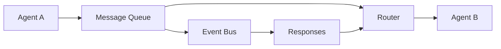
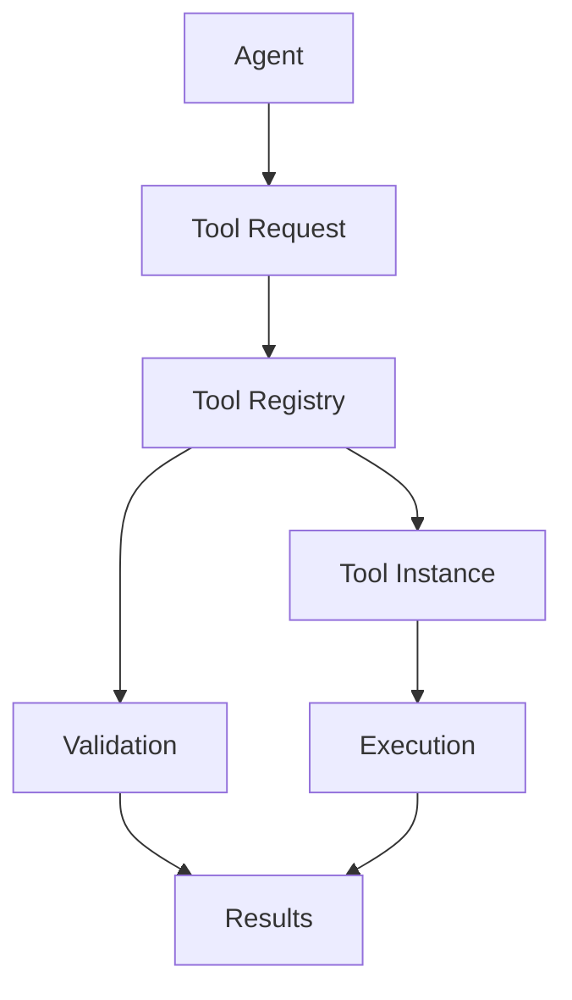
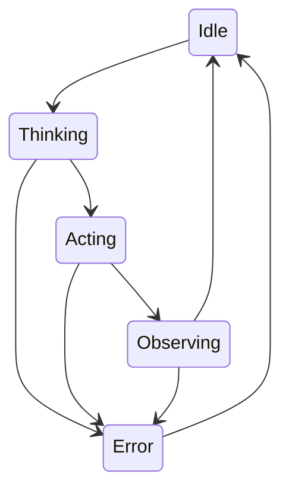

# LLM Agentic Runtime Architecture

## Overview

The LLM Agentic Runtime is a comprehensive framework for building, orchestrating, and executing autonomous AI agents. It implements the ReAct (Reasoning and Acting) pattern along with other advanced planning strategies to enable sophisticated multi-step reasoning and task execution.

## System Architecture



## Core Components

### 1. Agent Core (`agent.rs`)

The central component that coordinates all agent activities.

**Key Responsibilities:**
- State management (Idle, Thinking, Acting, Error)
- Capability management
- Context and memory integration
- Task execution orchestration

**Architecture:**
```rust
pub struct Agent {
    config: AgentConfig,
    state: AgentState,
    planner: Box<dyn PlannerTrait>,
    executor: Box<dyn ExecutorTrait>,
    memory: Box<dyn MemoryTrait>,
    tools: ToolRegistry,
    guardrails: Option<Guardrail>,
}
```

### 2. Planning Module (`planner.rs`)

Implements various planning strategies for decomposing complex tasks.

**Planning Strategies:**
- **ReAct**: Thought → Action → Observation cycle
- **Chain of Thought**: Sequential reasoning steps
- **Tree of Thought**: Exploratory branching
- **Adaptive**: Dynamic strategy selection

**Planning Flow:**


### 3. Execution Module (`executor.rs`)

Handles the execution of planned steps with various execution modes.

**Execution Modes:**
- Sequential: One step at a time
- Parallel: Multiple independent steps
- Adaptive: Dynamic parallelization

**Features:**
- Retry logic with exponential backoff
- Timeout management
- Resource constraints
- Checkpoint/resume capability

### 4. Memory System (`memory.rs`)

Provides various memory types for agent context and learning.

**Memory Types:**
- **Short-term**: Current task context
- **Long-term**: Persistent knowledge
- **Episodic**: Event-based memories
- **Semantic**: Concept relationships

### 5. Tool System (`tools.rs`)

Manages external tool integration and execution.

**Tool Features:**
- Dynamic registration
- Type-safe execution
- Async support
- State management
- Result caching

### 6. Guardrails (`guardrails.rs`)

Ensures safe and compliant agent behavior.

**Safety Checks:**
- Content filtering
- PII detection
- Toxicity detection
- Output validation
- Rate limiting

## Data Flow

### Task Execution Flow

1. **Input Reception**
   - User provides task/query
   - Context and constraints defined

2. **Planning Phase**
   - Task decomposition
   - Strategy selection
   - Plan generation
   - Validation

3. **Execution Phase**
   - Step execution
   - Tool invocation
   - Result collection
   - State updates

4. **Memory Updates**
   - Store results
   - Update context
   - Learn from experience

5. **Output Generation**
   - Result aggregation
   - Guardrail validation
   - Response formatting

## Agent Lifecycle



## Communication Patterns

### Inter-Agent Communication



### Tool Communication



## State Management

### Agent States

- **Idle**: Ready for new tasks
- **Thinking**: Planning/reasoning
- **Acting**: Executing actions
- **Observing**: Processing results
- **Error**: Error state, needs recovery

### State Transitions



## Concurrency Model

### Task Parallelization

- Thread pool for CPU-bound tasks
- Async runtime (Tokio) for I/O-bound operations
- Lock-free data structures where possible
- Message passing for coordination

### Resource Management

- Memory pools for allocation
- Connection pooling for external services
- Rate limiting for API calls
- Backpressure handling

## Security Architecture

### Authentication & Authorization

- Token-based authentication
- Role-based access control
- Capability-based permissions
- Session management

### Data Protection

- Encryption at rest and in transit
- PII redaction
- Audit logging
- Secure credential storage

## Scalability Considerations

### Horizontal Scaling

- Stateless agent design
- Distributed memory stores
- Load balancing
- Service mesh integration

### Performance Optimization

- Lazy loading of components
- Caching at multiple levels
- Batch processing
- Connection pooling

## Monitoring & Observability

### Metrics Collection

- Request/response times
- Success/failure rates
- Resource utilization
- Tool usage statistics

### Tracing

- Distributed tracing (OpenTelemetry)
- Span correlation
- Context propagation
- Performance profiling

### Logging

- Structured logging
- Log levels and filtering
- Centralized aggregation
- Real-time streaming

## Extension Points

### Plugin Architecture

- Tool plugins
- Strategy plugins
- Memory backends
- LLM providers

### Custom Implementations

```rust
pub trait CustomAgent {
    fn process(&mut self, input: &str) -> Result<String>;
    fn learn(&mut self, feedback: &Feedback);
}
```

## Deployment Architecture

### Container Deployment

```dockerfile
FROM rust:latest
COPY . /app
RUN cargo build --release
CMD ["./target/release/agentic-runtime"]
```

### Kubernetes Deployment

```yaml
apiVersion: apps/v1
kind: Deployment
spec:
  replicas: 3
  template:
    spec:
      containers:
      - name: agent
        image: agentic-runtime:latest
```

## Configuration Management

### Configuration Hierarchy

1. Default configuration
2. Environment variables
3. Configuration files
4. Runtime overrides

### Dynamic Configuration

- Hot reloading
- Feature flags
- A/B testing support
- Gradual rollouts