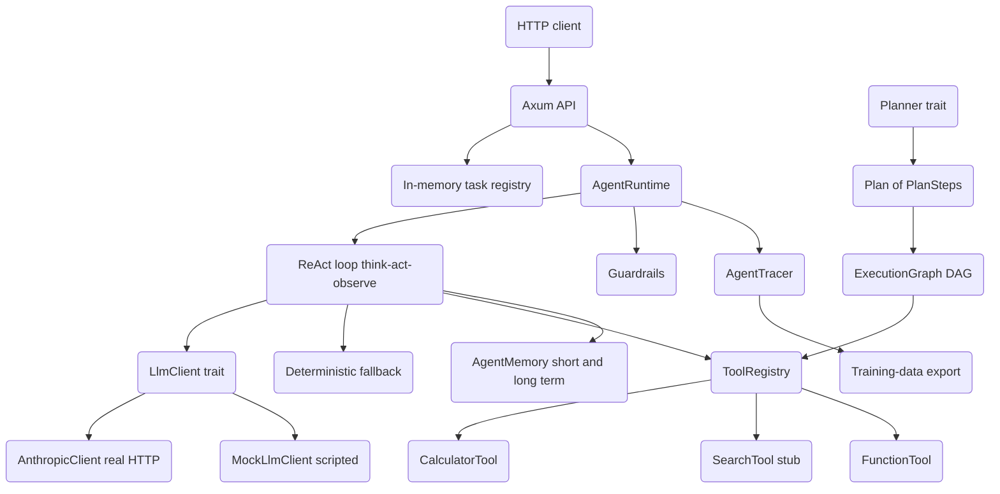

# LLM Agentic Runtime

## Overview

The LLM Agentic Runtime is a from-scratch Rust crate for building autonomous, tool-using
agents on top of a large language model. It implements the ReAct pattern — a loop that
alternates between *reasoning* (the model emits a thought) and *acting* (the runtime
executes a tool and feeds the result back) — and wraps that loop in the supporting
machinery a real agent needs: a pluggable model client, a tool registry, a tiered memory,
a planner, a DAG executor, safety guardrails, execution tracing, and an HTTP API.

The design goal is to keep the reasoning loop *model-agnostic* and *runnable offline*. The
runtime talks to anything that implements the `LlmClient` trait. Three modes coexist:

1. **Real model.** `AnthropicClient` is a thin raw-HTTP wrapper over the Anthropic Messages
   API (`POST /v1/messages`). Rust has no official Anthropic SDK, so the client is built
   directly on `reqwest`. It is selected automatically when `ANTHROPIC_API_KEY` is set.
2. **Scripted mock.** `MockLlmClient` replays a queue of canned responses, letting the loop
   be unit-tested deterministically with no network and no key.
3. **No client.** When no `LlmClient` is attached, the runtime falls back to a deterministic
   heuristic (`think_simulated`) that produces a short, terminating trace — handy for demos
   and for keeping the HTTP service alive without credentials.

The crate is structured to teach the moving parts of an agent runtime in isolation: each
concern (loop, model, tools, memory, planning, execution, safety, tracing, transport) lives
in its own module with its own unit tests. Concepts covered include the ReAct loop and its
JSON protocol, trait objects for pluggable backends, dependency-ordered DAG execution,
tiered memory with importance scoring, regex-based input/output guardrails, and turning
execution traces into fine-tuning data.

Scope: this is a teaching-grade runtime. It is honest about its stubs — the search tool has
no backend, long-term recall is keyword matching rather than vector similarity, and the
task registry is in-memory. Everything that *is* implemented is covered by tests.

## Architecture



The system has three layers:

- **Transport.** `api.rs` exposes the runtime over HTTP with Axum. A run is started on a
  background Tokio task; its status and result are kept in an in-memory registry keyed by a
  UUID. `main.rs` is a thin binary that binds an address and serves.
- **Core loop.** `AgentRuntime` (in `agent.rs`) owns the reason/act loop. On each turn it
  builds a ReAct system prompt from the registered tools, asks the `LlmClient` for the next
  step, parses the JSON, and either finishes, calls a tool, or records an error. Every step
  is pushed onto the trace and into memory.
- **Supporting subsystems.** Tools (`tools.rs`), memory (`memory.rs`), planning
  (`planner.rs`), DAG execution (`executor.rs`), guardrails (`guardrails.rs`), and tracing
  (`tracing.rs`) are independent modules the loop and the API compose together.

The planner and executor form a second, complementary path. A `Planner` decomposes a task
into a `Plan` of dependency-linked `PlanStep`s; an `ExecutionGraph` turns that plan into a
DAG and runs ready nodes in batches. This path is exercised directly (and by tests) rather
than being wired into every ReAct turn — the ReAct loop and the plan/DAG executor are two
ways to drive tools.

## Core Components

### Agent runtime (`agent.rs`)

`AgentRuntime` is the heart of the crate. It holds a `ToolRegistry`, a boxed `Planner`, an
`AgentMemory`, an `AgentRuntimeConfig`, an optional boxed `LlmClient`, and mutable run state
(current `AgentState`, the active `AgentContext`, and the accumulating trace).

The state machine moves through `Idle → Thinking → Acting → Observing` and terminates in
`Completed` or `Failed`:

```rust
pub enum AgentState {
    Idle, Thinking, Acting, Observing, Completed, Failed,
}
```

`run` drives the loop up to `context.max_steps`, checking the wall-clock timeout each
iteration:

```rust
pub async fn run(&mut self, context: AgentContext) -> AgentResult {
    self.current_context = Some(context.clone());
    self.state = AgentState::Thinking;
    self.trace.clear();

    let start_time = Instant::now();
    let timeout = Duration::from_secs_f64(context.timeout_seconds);

    for step in 0..context.max_steps {
        if start_time.elapsed() > timeout {
            self.state = AgentState::Failed;
            return AgentResult::failure(/* ... */);
        }

        let (thought, action, action_input) = match self.think(step).await {
            Ok(t) => t,
            Err(e) => return AgentResult::failure(/* ... */),
        };

        let mut tao = ThoughtActionObservation::new(step, thought)
            .with_action(action.clone(), action_input.clone());

        if action == "finish" {
            self.state = AgentState::Completed;
            let answer = action_input.get("answer")
                .and_then(|v| v.as_str()).unwrap_or("").to_string();
            tao.observation = Some(answer.clone());
            self.trace.push(tao);
            return AgentResult::success(answer, self.trace.clone(), /* ... */);
        }

        match self.act(&action, &action_input).await {
            Ok(observation) => tao.observation = Some(observation),
            Err(e) => {
                tao.error = Some(e.to_string());
                tao.observation = Some(format!("Error: {}", e));
            }
        }

        self.trace.push(tao.clone());
        self.memory.add_step(tao);
    }

    AgentResult::failure(format!("Maximum steps ({}) exceeded", context.max_steps), /* ... */)
}
```

Two things to note. First, a tool error does *not* abort the run: the error is captured on
the step as both `error` and a human-readable `observation`, so the model can see what went
wrong and recover on the next turn. Second, the loop terminates in exactly three ways —
`finish`, timeout, or max steps — so it can never hang.

**A concrete turn.** Consider the task *"capital of France"* driven by a scripted mock that
first searches and then finishes. On step 0, `think` builds the ReAct system prompt and a
user prompt restating the task, calls the client, and parses the reply
`{"thought":"search it","action":"search","action_input":{"query":"France"}}`. Because the
action is not `finish`, `act` looks up `search` in the registry and runs it; the stub
returns its placeholder string, which becomes the step's `observation`. The completed
`ThoughtActionObservation` is pushed onto the trace and handed to memory. On step 1, the
user prompt now includes the step-0 thought/action/observation as history; the model replies
`{"action":"finish","action_input":{"answer":"Paris"}}`, the loop pulls `answer` out of the
input map, records a final step, and returns `AgentResult::success("Paris", ...)`. This is
exactly the scenario asserted by `test_agent_mock_llm_drives_a_tool_then_finishes`.

**Thinking.** `think` is where the model (or the fallback) decides the next move:

```rust
async fn think(&self, step: usize)
    -> Result<(String, String, HashMap<String, serde_json::Value>)>
{
    let context = self.current_context.as_ref().unwrap();
    match &self.llm {
        None => Ok(self.think_simulated(step)),
        Some(client) => {
            let system = self.react_system_prompt();
            let user = self.react_user_prompt(context);
            let reply = client.complete(&system, &[ChatMessage::user(user)]).await?;
            parse_react_step(&reply)
        }
    }
}
```

The system prompt instructs the model to reply with *only* a JSON object:

```text
{"thought": "<reasoning>", "action": "<tool name or 'finish'>", "action_input": {...}}
```

followed by the formatted tool descriptions from the registry. The user prompt restates the
task and replays the trace so far (`thought` / `action` / `observation` per past step) and
asks for the next JSON step.

**Parsing.** `parse_react_step` is deliberately tolerant of models that wrap JSON in prose.
`extract_json_object` scans for the first balanced `{...}` via a naive brace-depth counter,
and the parser pulls out `thought`, `action` (required — a missing action is a
`ParseError`), and `action_input` (defaulting to an empty map if absent or non-object).

**Deterministic fallback.** With no client attached, `think_simulated` returns an `analyze`
step on step 0, a `process` step for a couple of intermediate steps, and a `finish` step
once `step >= 5` or three steps have accumulated — yielding a short, terminating trace.

**Acting.** `act` looks the action up in the registry. A registered tool is executed; an
unknown action is echoed back (`"Executed action '<name>' with input: ..."`) rather than
erroring, which keeps the loop moving for actions like the fallback's `analyze`/`process`.

`AgentRuntimeConfig` carries flags (`sandbox_enabled`, `guardrails_enabled`,
`tracing_enabled`, `retry_on_failure`, `max_retries`); `with_llm` attaches a client; `reset`
clears state, trace, and memory for a fresh task.

### LLM client (`llm.rs`)

The `LlmClient` trait is the single seam between the loop and any model:

```rust
#[async_trait]
pub trait LlmClient: Send + Sync {
    async fn complete(&self, system: &str, messages: &[ChatMessage]) -> Result<String>;
}
```

`ChatMessage` is a `{ role, content }` pair with `user` and `assistant` constructors.

**`AnthropicClient`** is a real client. It posts a Messages-API request body
(`model`, `max_tokens`, `system`, `messages`) to `{base_url}/v1/messages` with the
`x-api-key` and `anthropic-version: 2023-06-01` headers, then concatenates the text of
every `type == "text"` content block in the response. Non-2xx responses and empty content
become `Error::LlmError`. It defaults to model `claude-opus-4-8` and `max_tokens: 1024`,
with builder overrides (`with_model`, `with_max_tokens`, `with_base_url`) and a
`from_env` constructor that reads `ANTHROPIC_API_KEY`. `reqwest` is configured with
`rustls-tls` to avoid a system OpenSSL dependency.

**`MockLlmClient`** replays a `VecDeque<String>` of scripted responses behind a `Mutex`.
Once the queue is exhausted it returns a synthetic `finish` step, so a test loop can never
hang. `MockLlmClient::finishing(answer)` builds a one-element script that finishes
immediately with the given answer.

### Tools (`tools.rs`)

A tool implements the `Tool` trait:

```rust
#[async_trait]
pub trait Tool: Send + Sync {
    fn name(&self) -> &str;
    fn description(&self) -> &str;
    fn parameters(&self) -> ToolSchema;
    async fn execute(&self, inputs: HashMap<String, serde_json::Value>) -> Result<String>;
    fn metadata(&self) -> ToolMetadata { /* default: name + description + parameters */ }
}
```

`ToolSchema` is a small JSON-Schema-shaped struct (`type`, a map of `ParameterSchema`
properties, and a `required` list). Three implementations ship:

- **`FunctionTool`** wraps a closure `Fn(HashMap<String, Value>) -> Result<String>`, so any
  Rust function can be registered as a tool with an explicit schema.
- **`CalculatorTool`** evaluates a math expression. `evaluate_simple` first tries to parse
  the trimmed string as an `f64`, then scans for the right-most `+ - * /` operator and
  recurses on the two sides, returning `Error::ToolExecutionFailed` on division by zero or
  an unparseable expression. (It is right-to-left and not operator-precedence aware — a
  deliberately simple demo evaluator.)
- **`SearchTool`** is a stub. It validates a `query` parameter but has no backend; rather
  than fabricate results it returns an explicit placeholder telling the caller to plug in a
  real implementation.

`ToolRegistry` is a `HashMap<String, Box<dyn Tool>>` keyed by tool name. Beyond
`register`/`get_tool`/`tool_names`, it produces two model-facing views:
`get_tool_schemas` emits OpenAI-style function schemas (used by the `/tools` endpoint), and
`get_formatted_descriptions` produces the `- name(params): description` lines embedded in
the ReAct system prompt.

The calculator's evaluator is a good illustration of the "deliberately simple" stance. It is
fully recursive but makes no attempt at operator precedence — it scans for the *right-most*
of `+ - * /` and splits there:

```rust
fn evaluate_simple(&self, expr: &str) -> Result<f64> {
    let expr = expr.trim();
    if let Ok(num) = expr.parse::<f64>() {
        return Ok(num);
    }
    for op in ['+', '-', '*', '/'] {
        if let Some(pos) = expr.rfind(op) {
            if pos > 0 {
                let left = self.evaluate_simple(&expr[..pos])?;
                let right = self.evaluate_simple(&expr[pos + 1..])?;
                return match op {
                    '+' => Ok(left + right),
                    '-' => Ok(left - right),
                    '*' => Ok(left * right),
                    '/' if right == 0.0 =>
                        Err(Error::ToolExecutionFailed("Division by zero".to_string())),
                    '/' => Ok(left / right),
                    _ => unreachable!(),
                };
            }
        }
    }
    Err(Error::ToolExecutionFailed(format!("Cannot evaluate: {}", expr)))
}
```

This evaluates `2+3` to `5` (the test asserts exactly this) but would not respect precedence
in `2+3*4`. It exists to give the agent a working numeric tool and to demonstrate a tool that
returns a typed `Result`, not to be a general expression engine.

### Memory (`memory.rs`)

`AgentMemory` is a two-tier store. Short-term memory is a bounded `VecDeque` of
`ThoughtActionObservation`s; when it exceeds `short_term_limit`, the oldest step overflows
into long-term memory as a scored `MemoryEntry`:

```rust
pub fn add_step(&mut self, step: ThoughtActionObservation) {
    self.short_term.push_back(step.clone());
    if self.short_term.len() > self.short_term_limit {
        if let Some(overflow) = self.short_term.pop_front() {
            self.store_long_term(overflow);
        }
    }
}
```

`calculate_importance` assigns a base score of 0.5, bumps it for steps that errored
(+0.3) or that finished (+0.2), discounts routine `think` steps (−0.1), and clamps to
`[0, 1]`. `search_long_term` does keyword matching: entries whose thought+observation
contains the query get a +0.5 boost on top of their importance, and the top-k by score are
returned. `get_recent_context` renders the last five short-term steps as a prompt-ready
string (truncating long observations to 200 chars), and `summarize` reports counts,
error totals, and average latency as a `MemorySummary`.

The two-tier split mirrors how a real agent manages context: the short-term window is what
you would replay into a prompt verbatim, while long-term memory is the larger, scored corpus
you would *search* rather than dump. Concretely, `add_step` keeps the working window at
exactly `short_term_limit` entries, and the test `test_agent_memory` confirms that after
adding seven steps to a limit-five memory, five remain short-term and two have spilled to
long-term. Importance scoring then biases what survives in the long-term tier toward the
steps most worth recalling — errors and completions over routine thinking.

The `embedding: Option<Vec<f32>>` field on `MemoryEntry` is a placeholder — no embedding
model is wired in, so recall is lexical, not semantic. Swapping in real semantic recall
would mean populating `embedding` in `store_long_term` and replacing the keyword scan in
`search_long_term` with a vector similarity search, with no change to the rest of the API.
`WorkingMemory` is a separate per-task scratchpad with a goal, a notes list, and a typed
variable map, intended for intermediate values a single task accumulates outside the
step-by-step trace.

### Planner (`planner.rs`)

A `Plan` is a `Vec<PlanStep>` plus a cursor; a `PlanStep` carries an `action`, a
`description`, a list of dependency indices, and an input map:

```rust
pub struct PlanStep {
    pub action: String,
    pub description: String,
    pub dependencies: Vec<usize>,
    pub inputs: HashMap<String, serde_json::Value>,
}
```

The `Planner` trait has one async `plan(task, tools) -> Result<Plan>` method. Three
implementations exist. `SimplePlanner` always emits a fixed `analyze → execute → finish`
chain. `RulePlanner` matches the (lowercased) task against registered substring patterns
and instantiates the matching step template, falling back to a single `think` step.
`HybridPlanner` tries the rule planner first and, if the result is shorter than a threshold,
expands to a richer `understand → gather → process → synthesize → finish` plan.

The hybrid planner encodes a simple cost/quality trade-off: cheap rule-based plans are
preferred, and the (potentially more expensive) detailed plan is only produced when the rule
plan is too thin to be useful:

```rust
async fn plan(&self, task: &str, tools: &[String]) -> Result<Plan> {
    let rule_plan = self.rule_planner.plan(task, tools).await?;
    if rule_plan.len() >= self.use_model_threshold {
        Ok(rule_plan)                  // good enough — use it
    } else {
        Ok(Plan::new(/* understand → gather → process → synthesize → finish */))
    }
}
```

`PlanOptimizer` provides two static analyses. `find_parallel_steps` computes the dependency
level of each step (a step's level is one more than the max level of its dependencies) and
groups steps by level — each level is a batch that can run in parallel. For an `a, b → c`
graph it returns `[[a, b], [c]]`: `a` and `b` are independent and share level 0, and `c`
depends on both so it sits alone at level 1 (the test asserts exactly these sizes). `optimize`
marks the reachable steps (those that are depended upon, or the final step) as the prelude to
pruning dead steps. Together these turn a flat list of steps into the level structure the
`ExecutionGraph` exploits when it runs ready nodes in batches.

### Executor (`executor.rs`)

`ExecutionGraph` turns a `Plan` into a DAG and runs it. `build_from_plan` creates one
`ExecutionNode` per step, mapping the plan's integer dependency indices to `step_<i>` node
IDs. Each node tracks a `NodeStatus` (`Pending`/`Running`/`Completed`/`Failed`), a result,
and an error.

`execute` repeatedly finds nodes whose dependencies are all in the `completed` set, runs up
to `max_parallel` of them, and loops until every node is complete. A round with no ready
nodes and an incomplete graph is reported as a stuck-graph `Error::Internal` (cycle or
missing dependency):

```rust
pub async fn execute(&mut self) -> Result<HashMap<String, String>> {
    let mut results = HashMap::new();
    while !self.is_complete() {
        let ready: Vec<String> = self.nodes.iter()
            .filter(|(_, n)| n.status == NodeStatus::Pending && n.is_ready(&self.completed))
            .map(|(id, _)| id.clone())
            .collect();
        if ready.is_empty() && !self.is_complete() {
            return Err(Error::Internal("Execution graph is stuck".to_string()));
        }
        for node_id in ready.into_iter().take(self.max_parallel) {
            self.execute_node(&node_id, &mut results).await?;
        }
    }
    Ok(results)
}
```

`execute_node` resolves inputs before running. `resolve_inputs` rewrites any string input of
the form `$node_id` to that node's recorded result, leaving other values untouched — this is
how a downstream step consumes an upstream result. Known actions run their tool; unknown
actions are simulated (`"Executed <action>"`). A tool error transitions the node to `Failed`,
records the error on the node, and propagates out of `execute`, so a single failing node
fails the whole graph run (unlike the ReAct loop, which absorbs tool errors).

`execution_order` produces a deterministic topological sort independent of actual execution.
It is a standard depth-first topo sort with two refinements: it iterates the node keys in
*sorted* order so the output is stable across runs (a `HashMap` would otherwise be
unordered), and it uses a `temp_visited` set so a cycle is detected and skipped rather than
recursing forever:

```rust
fn topo_sort(&self, node_id: &str, visited: &mut HashSet<String>,
             temp_visited: &mut HashSet<String>, order: &mut Vec<String>) {
    if temp_visited.contains(node_id) { return; }      // cycle guard
    if !visited.contains(node_id) {
        temp_visited.insert(node_id.to_string());
        if let Some(node) = self.nodes.get(node_id) {
            for dep in &node.dependencies {
                self.topo_sort(dep, visited, temp_visited, order);  // deps first
            }
        }
        temp_visited.remove(node_id);
        visited.insert(node_id.to_string());
        order.push(node_id.to_string());               // then the node
    }
}
```

Because dependencies are visited before the node itself is appended, the resulting `order`
already lists every dependency ahead of its dependents — the test asserts exactly this for an
`a → b → c` chain. `reset` returns every node to `Pending` and clears the completed set so a
graph can be re-executed.

### Guardrails (`guardrails.rs`)

`Guardrails` validates inputs, outputs, and actions. It holds compiled blocked regexes, an
optional tool allow-list, a tool deny-list, input/output length caps (default 100 000
chars), and custom predicate validators. `validate_input` and `validate_output` reject text
that is too long or matches a blocked pattern (or fails a custom validator);
`validate_action` rejects blocked tools and tools outside the allow-list. Each returns a
`ValidationResult { passed, reason }`.

`CommonGuardrails` ships presets: PII patterns (SSN, 16-digit card, email, phone), harmful
code patterns (`os.system`, `subprocess`, `eval`, `exec`, `__import__`, file writes,
`shutil.rmtree`), and constructors `with_pii_protection`, `with_code_safety`, and
`comprehensive`. `SqlGuard::is_safe_query` allows only `SELECT` statements free of a
dangerous-keyword set (`DROP`, `DELETE`, `;`, `--`, etc.), and `sanitize_param` escapes
quotes and backslashes. `ContentModeration` adds blocked-word and length checks.

### Tracing (`tracing.rs`)

`AgentTracer` captures runs for debugging and for building training data. `start_trace`
mints a timestamped, UUID-suffixed trace ID and records the task and a `TraceContext`;
`log_step` appends a `TraceStep`; `end_trace` attaches the `TraceResult` and, when file
output is enabled, writes the trace to `{output_dir}/{trace_id}.json`. `load_traces` reads
JSON traces back from the directory.

`export_training_data` converts each *successful* trace into a chat transcript — a user
message with the task, then per step an assistant turn (`Thought:` / `Action:` /
`Action Input:`) and a user `Observation:` turn — yielding `TrainingExample`s ready for
fine-tuning. `statistics` aggregates trace counts, success/failure split, average steps,
and average latency. `TracingSpan` offers simple nested timing.

### HTTP API (`api.rs`, `main.rs`)

The Axum router exposes five routes:

```rust
Router::new()
    .route("/health", get(health))
    .route("/tools", get(list_tools))
    .route("/agent/run", post(run_agent))
    .route("/agent/:task_id", get(get_agent_status))
    .route("/agent/:task_id/cancel", post(cancel_agent))
    .with_state(AppState::default())
```

`AppState` wraps an `Arc<Mutex<HashMap<String, TaskRecord>>>` task registry. `run_agent`
mints a UUID, inserts a `running` record, and spawns a Tokio task that builds a fresh
`AgentRuntime` and runs the request to completion, then writes `completed`/`failed` and the
result back into the registry (unless the task was cancelled in the meantime). The runtime
attaches an `AnthropicClient` only when `ANTHROPIC_API_KEY` is present; otherwise it runs
the deterministic heuristic, so the service is always functional. `get_agent_status` returns
the record (404 if unknown); `cancel_agent` aborts the join handle and marks the task
cancelled. `main.rs` reads `BIND_ADDR` (default `0.0.0.0:8080`) and serves.

### Extending the runtime

The three traits are the intended extension points, and each is small enough to implement in
a few lines:

- **A new model backend.** Implement `LlmClient::complete` to call any provider (OpenAI,
  a local server, a fixed policy) and attach it with `runtime.with_llm(Box::new(client))`.
  The runtime only needs a string reply containing the ReAct JSON; how that string is
  produced is entirely the client's concern. `AnthropicClient::with_base_url` shows the
  pattern for pointing a real client at a stand-in server during testing.
- **A new tool.** Implement `Tool` (name, description, `parameters` schema, async `execute`)
  and `registry.register(Box::new(MyTool))`. The schema flows automatically into both the
  `/tools` endpoint and the ReAct system prompt's tool descriptions, so a freshly registered
  tool is immediately visible to the model. `FunctionTool` covers the common case of wrapping
  an existing closure without a new type.
- **A new planning strategy.** Implement `Planner::plan` to emit a `Plan` of `PlanStep`s with
  dependency indices; feed it to an `ExecutionGraph` to run the resulting DAG. The supplied
  `SimplePlanner`/`RulePlanner`/`HybridPlanner` are reference points, not the only options.

Because the runtime composes these via constructor injection — `AgentRuntime::new(tools,
planner, memory, config)` — swapping any one of them out requires no change to the loop.

## Data Structures

The reasoning loop revolves around three serializable types in `agent.rs`:

```rust
pub struct AgentContext {
    pub task: String,
    pub max_steps: usize,
    pub timeout_seconds: f64,
    pub model_config: HashMap<String, String>,
    pub tools_enabled: Vec<String>,
    pub metadata: HashMap<String, String>,
}

pub struct ThoughtActionObservation {
    pub step: usize,
    pub thought: String,
    pub action: Option<String>,
    pub action_input: Option<HashMap<String, serde_json::Value>>,
    pub observation: Option<String>,
    pub error: Option<String>,
    pub timestamp: f64,
    pub latency_ms: f64,
}

pub struct AgentResult {
    pub success: bool,
    pub answer: Option<String>,
    pub steps: Vec<ThoughtActionObservation>,
    pub total_tokens: usize,
    pub total_latency_ms: f64,
    pub error: Option<String>,
}
```

`AgentContext` uses a builder style (`new`, `with_max_steps`, `with_timeout`, `with_tools`)
with defaults from the crate constants `DEFAULT_MAX_STEPS = 20` and
`DEFAULT_TIMEOUT_SECONDS = 300.0`. `ThoughtActionObservation` likewise builds up via
`with_action` / `with_observation` / `with_error`. `AgentResult::success` and `::failure`
are the two terminal constructors.

Tools are described by:

```rust
pub struct ToolSchema {
    #[serde(rename = "type")]
    pub schema_type: String,
    pub properties: HashMap<String, ParameterSchema>,
    pub required: Vec<String>,
}

pub struct ParameterSchema {
    #[serde(rename = "type")]
    pub param_type: String,
    pub description: Option<String>,
}
```

Planning and execution use `PlanStep` / `Plan` (above) and the executor's `ExecutionNode`:

```rust
pub enum NodeStatus { Pending, Running, Completed, Failed }

pub struct ExecutionNode {
    pub id: String,
    pub action: String,
    pub inputs: HashMap<String, serde_json::Value>,
    pub dependencies: Vec<String>,
    pub status: NodeStatus,
    pub result: Option<String>,
    pub error: Option<String>,
}
```

Errors funnel through a single crate-wide enum (`lib.rs`), with `Result<T>` aliased to
`std::result::Result<T, Error>`:

```rust
pub enum Error {
    Timeout(String),
    MaxStepsExceeded(usize),
    ToolNotFound(String),
    ToolExecutionFailed(String),
    InvalidAction(String),
    ParseError(String),
    PlanningFailed(String),
    GuardrailViolation(String),
    ValidationFailed(String),
    SerializationError(String),
    LlmError(String),
    Internal(String),
}
```

## API Design

The crate's public surface is the set of trait/struct exports re-exported from `lib.rs`. The
key extension points are three traits:

```rust
// Drive the loop with any model.
#[async_trait]
pub trait LlmClient: Send + Sync {
    async fn complete(&self, system: &str, messages: &[ChatMessage]) -> Result<String>;
}

// Register any callable as an agent action.
#[async_trait]
pub trait Tool: Send + Sync {
    fn name(&self) -> &str;
    fn description(&self) -> &str;
    fn parameters(&self) -> ToolSchema;
    async fn execute(&self, inputs: HashMap<String, serde_json::Value>) -> Result<String>;
}

// Plug in a task-decomposition strategy.
#[async_trait]
pub trait Planner {
    async fn plan(&self, task: &str, tools: &[String]) -> Result<Plan>;
}
```

The runtime is assembled and driven as:

```rust
let mut runtime = AgentRuntime::new(tools, planner, memory, config)
    .with_llm(Box::new(client)); // optional
let result: AgentResult = runtime.run(AgentContext::new("task")).await;
```

The HTTP API mirrors this over the network:

| Method | Path | Body / params | Returns |
|--------|------|---------------|---------|
| `GET` | `/health` | — | `"ok"` |
| `GET` | `/tools` | — | `{ "tools": [ ...schemas ] }` |
| `POST` | `/agent/run` | `{ task, max_steps?, timeout_seconds?, tools?, model? }` | `{ task_id, status: "running" }` |
| `GET` | `/agent/{task_id}` | path id | `{ task_id, status, result? }` (404 if unknown) |
| `POST` | `/agent/{task_id}/cancel` | path id | `{ task_id, status }` (404 if unknown) |

`AgentRequest` defaults `max_steps` to 20 and `timeout_seconds` to 300 via serde defaults.
`status` is one of `running`, `completed`, `failed`, or `cancelled`. The `result` field is
populated once the background task reaches a terminal state.

## Cross-Cutting Concerns

### Error handling

All fallible operations return `Result<T, Error>` with the single crate-wide `Error` enum
defined in `lib.rs` and derived with `thiserror`. The variants map to distinct failure
modes — `LlmError` for model/transport problems, `ParseError` for malformed model replies,
`ToolNotFound` / `ToolExecutionFailed` for tool dispatch, `ValidationFailed` /
`GuardrailViolation` for safety rejections, and `Internal` for invariant violations such as
a stuck execution graph. The reasoning loop translates errors into the run's narrative
rather than propagating them: a failed `think` ends the run as `AgentResult::failure`, but a
failed `act` is *absorbed* into the step (recorded as both `error` and a readable
`observation`) so the model can attempt recovery. This asymmetry is deliberate — the agent
cannot proceed without a next action, but it can reason its way around a tool failure.

The `AnthropicClient` is careful about partial failures: a non-2xx HTTP status is surfaced
with the response body attached, a decode failure becomes an `LlmError`, and a structurally
valid response that happens to contain no text blocks is rejected rather than silently
returning an empty string. The mock client, by contrast, can never fail — it degrades to a
`finish` step — which is what makes the loop tests deterministic.

### Concurrency model

The runtime is single-threaded *per run*: `AgentRuntime::run` takes `&mut self` and mutates
the trace and memory in place, so one runtime drives one task at a time. Concurrency lives
at two other layers. First, the HTTP API spawns each agent run on its own Tokio task with a
fresh `AgentRuntime`, so the server handles many runs in parallel without sharing mutable
runtime state; the only shared state is the `Arc<Mutex<HashMap<..>>>` task registry, which
is held only briefly to read or update a record. Second, the `ExecutionGraph` is internally
concurrent within a single plan: it identifies all ready nodes and runs up to `max_parallel`
per round. Tools are `Send + Sync` and their `execute` is `async`, so independent tool calls
do not block one another or the server's event loop.

Cancellation is cooperative at the transport boundary: `cancel_agent` aborts the run's
`JoinHandle` and marks the record `cancelled`, and the spawned task guards against clobbering
a record the client already cancelled.

### Design rationale

Several choices recur across the modules and are worth stating explicitly:

- **Trait objects over generics for the pluggable seams.** `Box<dyn LlmClient>`,
  `Box<dyn Tool>`, and `Box<dyn Planner>` let the runtime hold a heterogeneous, runtime-chosen
  set of backends and tools without threading type parameters through every signature. The
  cost — dynamic dispatch — is negligible next to a model round-trip.
- **Honest stubs over fabricated behavior.** The `SearchTool` returns an explicit
  "no backend configured" message rather than inventing search results, and unknown actions
  are echoed rather than silently succeeding. This keeps the runtime's behavior legible and
  prevents a demo from masquerading as a working integration.
- **Offline-first.** The deterministic heuristic and the mock client mean the entire system —
  loop, tools, memory, API — is exercisable with `cargo test` and `cargo run` and no
  credentials. The real model is strictly opt-in via `ANTHROPIC_API_KEY`.
- **Serializable core types.** `AgentContext`, `ThoughtActionObservation`, and `AgentResult`
  all derive `Serialize`/`Deserialize`, which is what lets the API return results as JSON and
  the tracer persist and reload traces without bespoke encoding.

## Performance

This is a teaching-grade runtime, so the design favors clarity over raw throughput, and no
benchmarks are claimed. The relevant performance-shaping choices are:

- **Bounded work per run.** Every run is capped by both `max_steps` (default 20) and a
  wall-clock `timeout_seconds` (default 300), checked at the top of each loop iteration, so
  a single run has a hard upper bound regardless of model behavior.
- **Bounded memory.** Short-term memory is a fixed-capacity `VecDeque`; overflow moves to
  long-term storage rather than growing the hot working set unboundedly.
- **Batched parallelism in the executor.** `ExecutionGraph` runs up to `max_parallel`
  (default 5) ready nodes per round, and `PlanOptimizer::find_parallel_steps` exposes the
  dependency levels that bound how much can run concurrently.
- **Async, non-blocking I/O.** The model call and tool execution are `async`; the HTTP API
  runs each agent on its own Tokio task so the server stays responsive and runs are
  concurrent. `reqwest` uses `rustls` to avoid native-TLS overhead and a system dependency.
- **Cheap offline path.** With no API key, the deterministic heuristic and mock client make
  the loop and the API run with zero network latency — the basis for fast tests.

Real end-to-end latency is dominated by the model round-trip when `AnthropicClient` is in
use, which the crate does not attempt to characterize.

## Testing Strategy

Every module carries a `#[cfg(test)]` block; correctness is verified close to the code under
test, with no external services and no API key required.

- **Agent loop (`agent.rs`).** Tests cover the deterministic path (a default run succeeds
  with a non-empty trace), the timeout/step bounds, the `AgentContext` builder, and two
  mock-LLM scenarios: one that finishes immediately with a known answer, and one where the
  scripted model first calls the `search` tool and then finishes — asserting the tool
  actually ran by inspecting the trace. A dedicated test confirms `parse_react_step`
  extracts JSON even when the model wraps it in surrounding prose.
- **LLM client (`llm.rs`).** Tests assert `MockLlmClient` replays responses in order and
  then degrades to a `finish` step, and that `finishing(...)` emits the expected answer.
  (`AnthropicClient`'s `with_base_url` exists specifically so it can be pointed at a local
  mock server, keeping real-network tests out of the default suite.)
- **Tools (`tools.rs`).** The calculator is checked on a real expression, the search stub is
  checked to echo its query in the placeholder, and the registry is checked for
  registration, lookup, count, and schema emission.
- **Memory (`memory.rs`).** Tests verify the short-term/long-term tiering boundary, recent
  context rendering, keyword recall, the working-memory scratchpad, and the summary's step,
  error, and latency aggregates.
- **Planner (`planner.rs`).** Tests cover plan cursor advancement/completion, the simple and
  rule planners, and the parallel-level grouping (two independent steps in level 0, their
  shared dependent in level 1).
- **Executor (`executor.rs`).** Tests cover node readiness, building a graph from a plan,
  the topological ordering guarantees (dependencies before dependents), and an end-to-end
  two-node execution reaching completion.
- **Guardrails (`guardrails.rs`).** Tests cover blocked patterns, length limits, the
  allow/deny tool logic, PII detection, the SQL read-only guard, and content moderation.
- **Tracing (`tracing.rs`).** Tests (using a `tempfile::TempDir`, file output disabled)
  cover capturing a trace, exporting a successful trace as a training example, the
  success/failure statistics, and span timing.
- **HTTP API (`api.rs`).** Tower's `oneshot` drives the router directly: `/health` and
  `/tools` return 200 with the expected shape, a `POST /agent/run` followed by polling
  reaches a terminal state with a result attached, and an unknown task id is a 404. These
  run on the deterministic path, so no key is needed.

Run the full suite with `cargo test`.

## References

- Yao et al., *ReAct: Synergizing Reasoning and Acting in Language Models* — <https://arxiv.org/abs/2210.03629>
- Shinn et al., *Reflexion: Language Agents with Verbal Reinforcement Learning* — <https://arxiv.org/abs/2303.11366>
- Schick et al., *Toolformer: Language Models Can Teach Themselves to Use Tools* — <https://arxiv.org/abs/2302.04761>
- Anthropic Messages API reference — <https://docs.anthropic.com/en/api/messages>
- Axum web framework — <https://docs.rs/axum>
