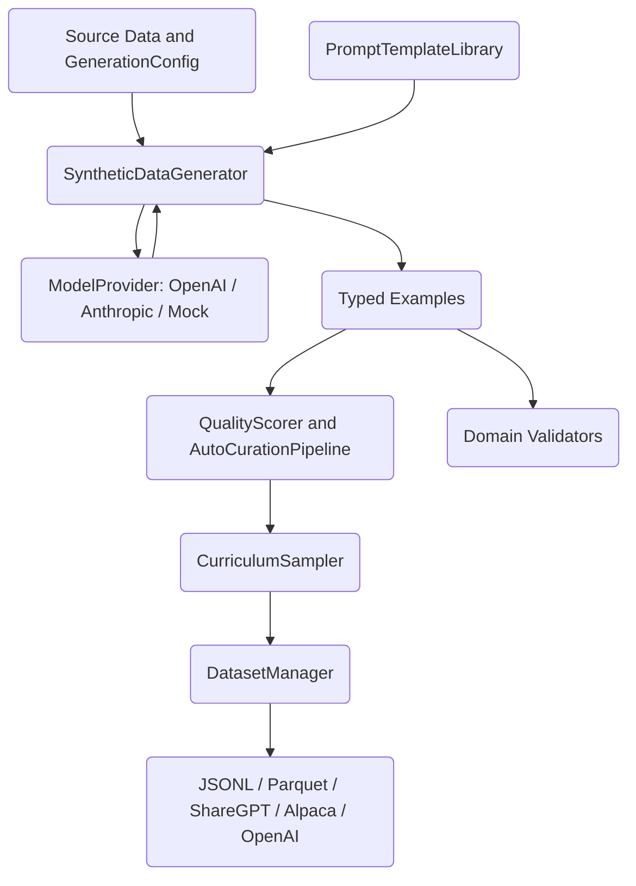

# Synthetic Data Generator

A synthetic data generation pipeline for building training data for RAG systems and
LLM fine-tuning, written from scratch in Python. It produces RAG Q&A pairs,
instruction-following examples, and multi-turn conversations through a pluggable LLM
provider, then scores, filters, samples, and exports the results into standard
fine-tuning formats.

## Features

- **Multiple data types** — RAG Q&A, instruction-following, and conversation examples,
  plus a preference schema for RLHF (`DataType`, `RAGExample`, `InstructionExample`,
  `ConversationExample`, `PreferenceExample` in `schemas.py`).
- **Pluggable providers** — a `ModelProvider` ABC with `OpenAIProvider`,
  `AnthropicProvider`, a credential-free `MockProvider`, and a `RateLimitedProvider`
  wrapper (`provider.py`).
- **Generation engine** — difficulty-weighted batch generation with JSON parsing,
  retry-on-failure, and a parallel `BatchGenerator` (`SyntheticDataGenerator`,
  `generator.py`).
- **LLM-as-judge quality scoring** — per-type scoring prompts, pairwise comparison for
  preference data, hallucination detection, and an auto-curation pipeline
  (`QualityScorer`, `HallucinationDetector`, `AutoCurationPipeline` in `quality.py`).
- **Curriculum sampling** — sigmoid-weighted easy-to-hard sampling, an LLM
  `DifficultyScorer`, balanced batch sampling, plus curriculum management and progress
  tracking (`curriculum.py`).
- **Domain validation** — legal, medical, technical, and financial validators that
  enforce terminology, pattern, length, and disclaimer rules, with a registry for
  custom domains (`domains.py`).
- **Dataset management** — JSONL/JSON/Parquet/CSV export, hash-based deduplication,
  bias reporting, dataset merging, and ShareGPT/Alpaca/OpenAI training exports
  (`DatasetManager`, `Dataset` in `dataset.py`).
- **Prompt template library** — system/user templates per data type and per domain
  (`PromptTemplateLibrary`, `DomainPromptTemplates` in `templates.py`).
- **Optional FastAPI service** — generation, scoring, curation, validation, and export
  endpoints, gated on `fastapi` being installed (`create_api` in `api.py`).

## Architecture



| Component | Module | Responsibility |
|-----------|--------|----------------|
| Schemas | `schemas.py` | Example dataclasses, `DataType`/`DifficultyLevel` enums, `GenerationConfig` |
| Providers | `provider.py` | LLM provider ABC and OpenAI/Anthropic/Mock/rate-limited implementations |
| Generator | `generator.py` | Difficulty-weighted batch and parallel generation |
| Templates | `templates.py` | Prompt templates per data type and domain |
| Quality | `quality.py` | LLM-as-judge scoring, hallucination detection, curation |
| Curriculum | `curriculum.py` | Difficulty sampling, scoring, progress tracking |
| Domains | `domains.py` | Domain-specific validation and registry |
| Dataset | `dataset.py` | Persistence, dedup, bias checks, training-format export |
| API | `api.py` | Optional FastAPI service over the pipeline |

## Quick Start

### Prerequisites

- Python 3.10+
- `numpy` (the only required runtime dependency). OpenAI/Anthropic providers, FastAPI,
  and Parquet/CSV export are optional extras. No external services are needed to run the
  tests — they use `MockProvider`.

### Installation

```bash
cd 24-synthetic-data-generator
pip install -e ".[dev]"        # core + test tooling
# optional extras:
pip install -e ".[openai]"     # OpenAIProvider
pip install -e ".[anthropic]"  # AnthropicProvider
pip install -e ".[api]"        # FastAPI service
pip install -e ".[full]"       # all of the above + pandas/pyarrow
```

### Running

There is no default daemon. Drive the library directly (see Usage), or start the
optional API:

```python
import uvicorn
from syntheticdata import create_api
from syntheticdata.provider import MockProvider

app = create_api(model_provider=MockProvider(), output_dir="./output")
uvicorn.run(app, host="0.0.0.0", port=8000)
```

## Usage

The example below runs end to end with no API key, using `MockProvider`:

```python
import asyncio
from syntheticdata import (
    SyntheticDataGenerator,
    GenerationConfig,
    DataType,
    DatasetManager,
)
from syntheticdata.provider import MockProvider


async def main():
    config = GenerationConfig(
        data_type=DataType.RAG_QA,
        num_samples=5,
        domain="technical",
        min_quality_score=0.0,  # no scorer attached, so keep everything
    )
    generator = SyntheticDataGenerator(
        model_provider=MockProvider(),
        config=config,
    )

    source_data = [{"context": "Python is a high-level programming language."}]
    examples = await generator.generate_batch(num_samples=5, source_data=source_data)
    print(f"Generated {len(examples)} examples")

    manager = DatasetManager("./output")
    manager.save_dataset(examples, "train", format="jsonl")
    manager.export_for_training(examples, format="sharegpt")


asyncio.run(main())
```

To use a real LLM, swap in a credentialed provider:

```python
from syntheticdata.provider import OpenAIProvider

provider = OpenAIProvider(api_key="sk-...", model="gpt-4")  # requires `openai`
```

## What's Real vs Simulated

- **Real:** All schemas, the generation engine, difficulty distribution math, prompt
  templates, LLM-as-judge scoring logic, hallucination detection, the curation pipeline,
  curriculum/balanced sampling, domain validators, dataset persistence/dedup/bias
  reporting, and the training-format exporters are fully implemented and exercised by
  the test suite against `MockProvider`.
- **Simulated / requires credentials:** `OpenAIProvider` and `AnthropicProvider` need
  API keys and the `openai`/`anthropic` packages; without them the pipeline runs on
  `MockProvider`, which returns canned JSON. The `MockProvider` does not call a model, so
  quality and difficulty scores reflect template/parse behavior, not real model judgment.
  Parquet/CSV export needs `pandas`/`pyarrow`; the FastAPI service needs `fastapi`;
  DVC versioning (`use_dvc=True`) shells out to the `dvc` CLI if installed.

## Testing

```bash
pip install -e ".[dev]"
pytest tests/ -v
```

The suite (`test_generator`, `test_quality`, `test_curriculum`, `test_domains`,
`test_integration`, `test_edge_cases`) covers generation, scoring, curriculum
management, domain validation, end-to-end workflows, and edge cases. All tests run
fully offline against `MockProvider`; no API keys or external services are required.

## Project Structure

```
24-synthetic-data-generator/
├── src/syntheticdata/
│   ├── schemas.py       # Example dataclasses, enums, GenerationConfig
│   ├── provider.py      # LLM provider ABC + OpenAI/Anthropic/Mock/rate-limited
│   ├── templates.py     # Prompt template library + domain prompts
│   ├── generator.py     # SyntheticDataGenerator + BatchGenerator
│   ├── quality.py       # QualityScorer, HallucinationDetector, curation
│   ├── curriculum.py    # Curriculum sampling, scoring, progress tracking
│   ├── domains.py       # Domain validators + registry
│   ├── dataset.py       # Dataset + DatasetManager (persist/export/dedup)
│   └── api.py           # Optional FastAPI service
├── tests/               # pytest suite (offline, MockProvider)
└── docs/
    ├── BLUEPRINT.md     # Full architecture and design
    ├── ARCHITECTURE.md  # Architecture notes
    └── SETUP.md         # Environment setup
```

## License

MIT — see ../LICENSE
