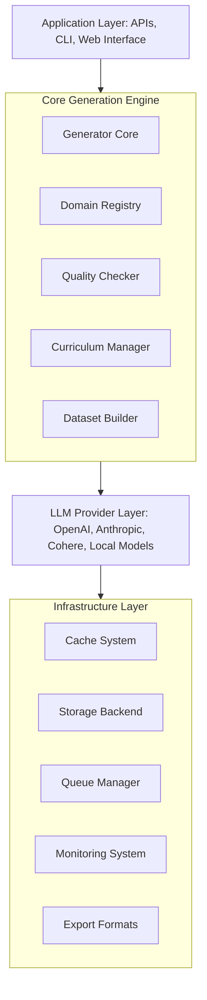
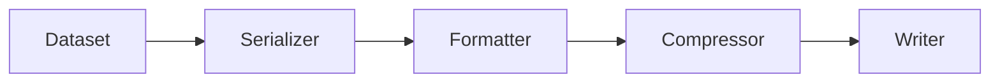

# Synthetic Data Generator Architecture

## Overview

The Synthetic Data Generator is a comprehensive Python framework for generating high-quality synthetic datasets using Large Language Models (LLMs). It supports multiple domains, quality assurance, curriculum-based generation, and distributed processing.

## System Architecture



## Core Components

### 1. Generator Core (`generator.py`)

**Purpose**: Central orchestration of synthetic data generation.

**Key Features**:
- Async generation pipeline
- Batch processing
- Retry logic with exponential backoff
- Template-based generation
- Multi-provider support

**Architecture**:
```python
class SyntheticDataGenerator:
    def __init__(self, config: GeneratorConfig):
        self.llm_provider = LLMProvider(config)
        self.template_engine = TemplateEngine()
        self.quality_checker = QualityChecker()
        self.cache = CacheManager()
```

### 2. Domain Registry (`domains.py`)

**Purpose**: Manages domain-specific generation logic.

**Supported Domains**:
- Question-Answering (QA)
- Mathematics
- Coding/Programming
- Reasoning
- Science
- Language Translation
- Conversational

**Domain Architecture**:
```python
@dataclass
class Domain:
    name: str
    templates: List[Template]
    validators: List[Validator]
    examples: List[Example]
    constraints: Dict[str, Any]
```

### 3. Quality Assurance (`quality.py`)

**Purpose**: Ensures generated data meets quality standards.

**Quality Metrics**:
- Relevance score
- Diversity index
- Correctness validation
- Consistency checking
- Complexity assessment

**Quality Pipeline**:


### 4. Curriculum Manager (`curriculum.py`)

**Purpose**: Manages progressive difficulty and structured learning paths.

**Features**:
- Level-based progression
- Prerequisite management
- Adaptive difficulty
- Spaced repetition
- Performance tracking

### 5. Dataset Builder (`dataset.py`)

**Purpose**: Constructs and manages datasets.

**Capabilities**:
- Incremental building
- Format conversion
- Metadata management
- Version control
- Deduplication

## Data Flow

### Generation Pipeline

1. **Request Processing**
   ```mermaid
   flowchart LR
       A[User Request] --> B[Configuration] --> C[Domain Selection] --> D[Template Loading]
   ```

2. **Generation Phase**
   ```mermaid
   flowchart LR
       A[Prompt Construction] --> B[LLM Call] --> C[Response Parsing] --> D[Validation]
   ```

3. **Quality Assurance**
   ```mermaid
   flowchart LR
       A[Quality Scoring] --> B[Threshold Check] --> C[Filtering] --> D[Enhancement]
   ```

4. **Dataset Construction**
   ```mermaid
   flowchart LR
       A[Sample Collection] --> B[Deduplication] --> C[Metadata Addition] --> D[Formatting]
   ```

5. **Export & Storage**
   ```mermaid
   flowchart LR
       A[Format Selection] --> B[Serialization] --> C[Compression] --> D[Storage/Export]
   ```

## Provider Integration

### LLM Providers

```python
class LLMProvider(ABC):
    @abstractmethod
    async def generate(self, prompt: str, **kwargs) -> str:
        pass

class OpenAIProvider(LLMProvider):
    async def generate(self, prompt: str, **kwargs) -> str:
        # OpenAI API implementation

class AnthropicProvider(LLMProvider):
    async def generate(self, prompt: str, **kwargs) -> str:
        # Anthropic API implementation
```

### Provider Selection

- Cost-based routing
- Quality-based selection
- Fallback mechanisms
- Load balancing

## Template System

### Template Structure

```yaml
template:
  id: "qa_basic"
  domain: "qa"
  format: |
    Question: {question}
    Context: {context}
    Answer: {answer}
  variables:
    - question: "string"
    - context: "string"
    - answer: "string"
  constraints:
    max_length: 500
    min_length: 50
```

### Template Processing

1. Variable extraction
2. Constraint validation
3. Dynamic field population
4. Format rendering

## Quality Assurance System

### Multi-Level Quality Checks

1. **Syntax Level**
   - Grammar checking
   - Format validation
   - Structure verification

2. **Semantic Level**
   - Relevance scoring
   - Coherence checking
   - Factual accuracy

3. **Diversity Level**
   - Uniqueness scoring
   - Distribution analysis
   - Redundancy detection

### Quality Scoring Formula

```
Quality Score = w1 * Relevance + w2 * Correctness + w3 * Diversity + w4 * Complexity
```

Where weights (w1, w2, w3, w4) are configurable per domain.

## Storage Architecture

### Data Storage Layers

1. **Hot Storage** (Redis/Memory)
   - Active generation cache
   - Temporary datasets
   - Session data

2. **Warm Storage** (PostgreSQL/MongoDB)
   - Recent datasets
   - Metadata indexes
   - User data

3. **Cold Storage** (S3/Cloud Storage)
   - Archived datasets
   - Backups
   - Large exports

### Storage Schema

```sql
CREATE TABLE datasets (
    id UUID PRIMARY KEY,
    name VARCHAR(255),
    domain VARCHAR(100),
    created_at TIMESTAMP,
    metadata JSONB,
    samples_count INTEGER,
    quality_score FLOAT
);

CREATE TABLE samples (
    id UUID PRIMARY KEY,
    dataset_id UUID REFERENCES datasets(id),
    content JSONB,
    quality_score FLOAT,
    metadata JSONB,
    created_at TIMESTAMP
);
```

## Caching Strategy

### Cache Levels

1. **Request Cache**
   - LRU cache for API responses
   - TTL: 1 hour

2. **Template Cache**
   - Compiled templates
   - TTL: 24 hours

3. **Result Cache**
   - Generated samples
   - TTL: 7 days

### Cache Key Structure

```
cache_key = f"{domain}:{template_id}:{hash(prompt)}:{model}:{timestamp}"
```

## Scalability Features

### Horizontal Scaling

- Stateless workers
- Queue-based distribution
- Shared cache layer
- Database sharding

### Vertical Scaling

- Batch processing optimization
- Memory pooling
- Connection pooling
- Async I/O

### Distributed Generation

```python
class DistributedGenerator:
    def __init__(self, num_workers: int):
        self.workers = [Worker(i) for i in range(num_workers)]
        self.queue = asyncio.Queue()
        self.results = asyncio.Queue()

    async def generate_distributed(self, tasks: List[Task]):
        # Distribute tasks across workers
        # Collect and aggregate results
```

## Monitoring & Observability

### Metrics Collection

- Generation rate (samples/minute)
- Quality distribution
- Error rates
- API latency
- Cache hit rates

### Logging Strategy

```python
logger.info("Generation started", extra={
    "domain": domain,
    "num_samples": num_samples,
    "request_id": request_id,
    "user_id": user_id
})
```

### Health Checks

```python
@app.route("/health")
def health_check():
    return {
        "status": "healthy",
        "components": {
            "database": check_database(),
            "cache": check_cache(),
            "llm_provider": check_llm_provider()
        }
    }
```

## Security Considerations

### Data Protection

- PII detection and removal
- Encryption at rest
- Secure API communication
- Access control

### Rate Limiting

```python
rate_limiter = RateLimiter(
    max_requests_per_minute=100,
    max_requests_per_hour=1000
)
```

### Input Validation

- Prompt injection prevention
- Size limits
- Content filtering
- Schema validation

## Performance Optimization

### Async Processing

```python
async def generate_batch(prompts: List[str]):
    tasks = [generate_single(p) for p in prompts]
    results = await asyncio.gather(*tasks)
    return results
```

### Batch Processing

- Optimal batch sizes
- Dynamic batching
- Priority queues
- Back-pressure handling

### Memory Management

- Streaming large datasets
- Lazy loading
- Memory pools
- Garbage collection tuning

## Export Formats

### Supported Formats

1. **JSON/JSONL**
2. **CSV/TSV**
3. **Parquet**
4. **HuggingFace Dataset**
5. **TensorFlow TFRecord**
6. **PyTorch format**

### Format Conversion Pipeline

