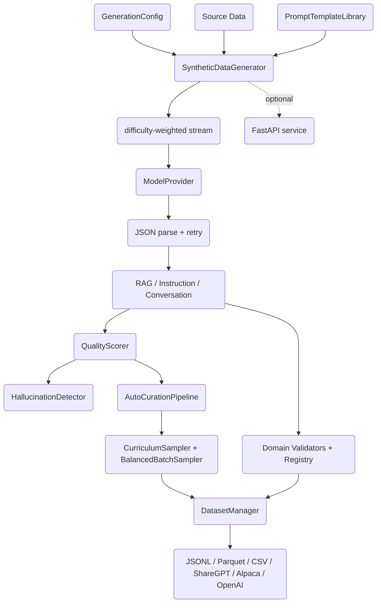

# Synthetic Data Generator

## Overview

The Synthetic Data Generator is a Python pipeline for producing training data for
retrieval-augmented generation (RAG) systems and LLM fine-tuning. Given source material
and a configuration, it generates typed examples through a language model, scores them
with an LLM-as-judge, filters and samples them by difficulty, validates them against
domain rules, and exports them into the formats fine-tuning tools expect.

The system is built from a small number of composable parts:

- A set of **dataclass schemas** for the four data types it understands — RAG Q&A,
  instruction-following, conversation, and preference (RLHF) examples.
- A **provider abstraction** that hides the difference between OpenAI, Anthropic, a
  deterministic mock, and a rate-limited wrapper behind one async interface.
- A **generation engine** that turns a `GenerationConfig` into a difficulty-weighted
  stream of examples, parsing JSON out of model responses and retrying on failure.
- A **quality layer** that uses the model itself as a judge, detects hallucinations
  against source context, and runs an accept/reject curation pass.
- A **curriculum layer** that samples examples easy-to-hard, scores difficulty with the
  model, and tracks learner progress through ordered levels.
- A **domain layer** of validators that enforce terminology, regex patterns, length
  limits, and disclaimer requirements for legal, medical, technical, and financial data.
- A **dataset layer** that persists, deduplicates, bias-checks, merges, and exports
  collections into ShareGPT, Alpaca, and OpenAI formats.
- An **optional FastAPI service** that exposes the pipeline over HTTP.

The concepts this project teaches are: self-instruct-style data generation, LLM-as-judge
evaluation, curriculum learning for training data, provider abstraction over LLM APIs,
and the practical mechanics of preparing fine-tuning datasets. The scope is the
generation and curation pipeline itself — it does not train models, only the data they
consume.

Everything except the credentialed OpenAI/Anthropic providers runs offline. The default
`MockProvider` returns canned JSON keyed off the prompt, so the whole pipeline — and the
entire test suite — executes without network access or API keys.

## Architecture



The flow is a pipeline. `GenerationConfig` and optional source data feed
`SyntheticDataGenerator`, which expands the configured difficulty distribution into a
shuffled stream of target difficulties. For each item it renders a prompt from
`PromptTemplateLibrary`, calls the active `ModelProvider`, parses JSON out of the
response, and constructs the appropriate typed example. Examples then flow into the
optional quality and domain stages, are sampled by the curriculum components, and are
finally collected and exported by `DatasetManager`. The FastAPI layer wraps the same
components but is only importable when `fastapi` is installed.

Each layer depends only on the layers below it. The generator depends on schemas,
templates, and the provider interface; the quality and curriculum layers depend on
schemas and the provider interface; the dataset layer depends only on schemas. Nothing
depends on a concrete provider, which is what makes the mock-backed offline path work.

## Core Components

### Schemas (`schemas.py`)

The schema module defines two enums and five dataclasses. `DataType` enumerates the four
generation modes (`RAG_QA`, `INSTRUCTION`, `CONVERSATION`, `PREFERENCE`).
`DifficultyLevel` is an integer-valued enum (`EASY=1`, `MEDIUM=2`, `HARD=3`, `EXPERT=4`);
the integer values are used directly by the curriculum sampler to compute difficulty
thresholds.

Each example dataclass carries an `id`, type-specific content fields, a `difficulty`, a
free-form `metadata` dict, and a `to_dict()` method that serializes the difficulty enum
to its name for JSON output. `RAGExample` holds `question`/`answer`/`context` plus a
`context_relevance` score. `InstructionExample` holds `instruction`/`input`/`output`
plus a `task_type`. `ConversationExample` holds a list of role/content messages and an
optional `system_prompt`. `PreferenceExample` holds a `prompt` with `chosen`/`rejected`
responses and their scores for RLHF-style training.

`GenerationConfig` is the central knob. It carries the data type, sample count, optional
domain, model/temperature/token settings, quality thresholds, batch/parallel settings,
retry settings, the difficulty distribution, and a domain-specific config dict. Its
`__post_init__` syncs the `quality_threshold` alias onto `min_quality_score`, and
`get_difficulty_counts(total)` converts the ratio distribution into integer per-level
counts, assigning any rounding remainder to `MEDIUM` so the counts always sum to `total`.

### Providers (`provider.py`)

`ModelProvider` is an abstract base class with two async methods: `generate(messages,
temperature, max_tokens, **kwargs) -> str` and `generate_json(...) -> dict`. Every
concrete provider implements both.

- **`OpenAIProvider`** wraps `openai.AsyncOpenAI`. Its `generate_json` passes
  `response_format={"type": "json_object"}` to request structured output. It raises an
  informative `ImportError` if the `openai` package is missing.
- **`AnthropicProvider`** wraps `anthropic.AsyncAnthropic`. Because the Anthropic API
  takes the system prompt as a separate argument, it splits any `system` message out of
  the message list before calling `messages.create`. Its `generate_json` appends a "respond
  with valid JSON only" instruction and falls back to a regex extraction of the first
  `{...}` block if the response is not pure JSON.
- **`MockProvider`** returns canned responses with no network call. If constructed with an
  explicit list of responses it cycles through them; otherwise it inspects the prompt and
  returns a plausible instruction, conversation, or RAG-QA JSON payload. It records every
  call in `self.calls` and increments `call_count`, which the tests assert against.
  `MockModelProvider` is an alias for it.
- **`RateLimitedProvider`** is a decorator over any other provider. It uses an
  `asyncio.Lock` and a minimum inter-request interval (`60 / requests_per_minute`) to
  throttle calls, sleeping when requests arrive too quickly.

This is the seam that makes the system testable: the generator, scorer, and difficulty
scorer all take a `ModelProvider`, so a single mock substitution converts an
LLM-dependent pipeline into a deterministic one. The interface is deliberately narrow —
two methods, the same signature — so adding a new backend (a local model server, a
different vendor) is a matter of implementing `generate` and reusing the JSON-extraction
fallback shared by the existing providers.

```python
class ModelProvider(ABC):
    @abstractmethod
    async def generate(self, messages, temperature=0.7, max_tokens=2048, **kwargs) -> str:
        ...

    @abstractmethod
    async def generate_json(self, messages, temperature=0.7, max_tokens=2048, **kwargs) -> dict:
        ...


class AnthropicProvider(ModelProvider):
    async def generate(self, messages, temperature=0.7, max_tokens=2048, **kwargs) -> str:
        # Anthropic takes the system prompt as a separate argument, so split it out.
        system = None
        chat_messages = []
        for msg in messages:
            if msg["role"] == "system":
                system = msg["content"]
            else:
                chat_messages.append(msg)
        response = await self.client.messages.create(
            model=self.model,
            max_tokens=max_tokens,
            system=system,
            messages=chat_messages,
            temperature=temperature,
        )
        return response.content[0].text
```

The `MockProvider` is the workhorse of the test suite. Its prompt-sniffing branch is what
lets the same mock serve every data type without configuration:

```python
class MockProvider(ModelProvider):
    async def generate(self, messages, temperature=0.7, max_tokens=2048, **kwargs) -> str:
        self.calls.append({"messages": messages, "temperature": temperature,
                           "max_tokens": max_tokens})
        if self.responses:                         # explicit list -> cycle through it
            response = self.responses[self.call_count % len(self.responses)]
        else:                                      # otherwise infer the shape from the prompt
            prompt = str(messages)
            if "instruction" in prompt.lower():
                response = json.dumps({"instruction": "...", "input": "...",
                                       "output": "...", "explanation": "..."})
            elif "conversation" in prompt.lower():
                response = json.dumps({"messages": [...], "system_prompt": "..."})
            else:
                response = json.dumps({"question": "...", "answer": "...",
                                       "reasoning": "..."})
        self.call_count += 1
        return response
```

### Generation Engine (`generator.py`)

`SyntheticDataGenerator` is the heart of the system. Its constructor is tolerant of two
call styles — the canonical `config`-first form and a legacy `model_provider`-first form
— and defaults to a `MockProvider`, a fresh `PromptTemplateLibrary`, and a default
`GenerationConfig` when arguments are omitted.

`generate_batch(num_samples, source_data, config)` is the primary entry point. It
computes per-difficulty counts from the config, then consumes `_generate_stream`. For
each candidate example it optionally scores quality (only if a scorer was supplied),
dropping examples below `min_quality_score`, and otherwise appends them and stamps the
score into `metadata`. It bounds total work at `num_samples * 3` attempts so quality
filtering cannot loop forever, and stops once enough examples are collected.

`_generate_stream` flattens the difficulty counts into a list, shuffles it for variety,
and for each target difficulty dispatches to `_generate_rag_qa`, `_generate_instruction`,
or `_generate_conversation` based on the configured data type. Each per-type method
renders the relevant template, prepends domain system context when a domain is set,
calls the provider, parses the JSON, and builds the typed example. Generation failures
are swallowed — the method yields `None`, which `generate_batch` counts as a failed
attempt — so a single malformed model response never aborts a batch.

`_parse_json_response` first tries `json.loads`, then falls back to extracting the first
`{...}` block via regex. `_generate_id` hashes content with SHA-256 and truncates to 16
hex characters, giving deterministic IDs (the same content always produces the same ID),
which the tests rely on.

The control flow of a batch — difficulty expansion, optional scoring, bounded retries —
is the core algorithm of the engine:

```python
async def generate_batch(self, num_samples, source_data=None, config=None) -> list:
    config = config or self.config
    examples = []
    attempts = 0
    max_attempts = num_samples * 3              # cap so quality filtering can't loop forever
    difficulty_counts = config.get_difficulty_counts(num_samples)

    async for example in self._generate_stream(source_data, difficulty_counts, config):
        if example is None:                     # a failed/parse-error generation
            attempts += 1
            if attempts >= max_attempts:
                break
            continue
        if self.scorer:                         # scoring is opt-in
            score = await self.scorer.score(example)
            if score < config.min_quality_score:
                attempts += 1
                if attempts >= max_attempts:
                    break
                continue
            example.metadata["quality_score"] = score
        examples.append(example)
        if len(examples) >= num_samples:
            break
        attempts += 1
        if attempts >= max_attempts:
            break
    return examples
```

The per-type generators all share the same shape: render a template, prepend domain
system context when a domain is configured, call the provider, parse JSON, and build a
typed example — returning `None` on any failure rather than raising:

```python
async def _generate_rag_qa(self, source, difficulty, config) -> Optional[RAGExample]:
    context = source.get("context", "") if source else ""
    if not context:
        raise ValueError("Context required for RAG QA generation")
    user_prompt = self.templates.RAG_QA_USER.substitute(
        context=context, difficulty=difficulty.name.lower())
    system_prompt = self.templates.RAG_QA_SYSTEM
    if config.domain:
        domain_config = DomainPromptTemplates.get_domain_config(config.domain)
        system_prompt = f"{domain_config['system_context']}\n\n{system_prompt}"
    try:
        response = await self.model.generate(
            messages=[{"role": "system", "content": system_prompt},
                      {"role": "user", "content": user_prompt}],
            temperature=config.temperature, max_tokens=config.max_tokens)
        data = self._parse_json_response(response)
        if not data:
            return None
        return RAGExample(
            id=self._generate_id(data.get("question", "")),
            question=data["question"], answer=data["answer"], context=context,
            difficulty=difficulty, domain=config.domain,
            metadata={"reasoning": data.get("reasoning", "")})
    except Exception:
        return None
```

`BatchGenerator` layers bounded parallelism on top of this single-batch engine:

```python
async def generate_large_dataset(self, total_samples, source_data=None, config=None):
    num_batches = (total_samples + self.batch_size - 1) // self.batch_size
    semaphore = asyncio.Semaphore(self.max_concurrent)

    async def generate_batch(batch_idx):
        async with semaphore:
            samples_needed = min(self.batch_size,
                                 total_samples - batch_idx * self.batch_size)
            return await self.generator.generate_batch(samples_needed, source_data, config)

    tasks = [generate_batch(i) for i in range(num_batches)]
    results = await asyncio.gather(*tasks, return_exceptions=True)
    all_examples = []
    for result in results:
        if isinstance(result, list):            # drop any batch that raised
            all_examples.extend(result)
    return all_examples[:total_samples]
```

Beyond batch generation the class offers `generate_dataset` (wraps a batch in a `Dataset`
with metadata), `generate_stream` (async iterator of examples), `augment_dataset`
(re-generates variations of each sample), and `generate_conditional` (filters config
kwargs by condition). `BatchGenerator` provides high-throughput generation: it splits a
large request into batches, runs them under an `asyncio.Semaphore` for bounded
concurrency, gathers results with `return_exceptions=True`, and truncates to the
requested total.

### Quality Scoring (`quality.py`)

`QualityScorer` implements LLM-as-judge evaluation. `score(example)` dispatches on the
example type to a type-specific method, each of which builds a rubric prompt asking the
model to rate five criteria (accuracy, relevance/clarity, completeness, etc.) on a 0–10
scale and emit an `overall_score` in `[0, 1]`. The scorer reads back the `overall_score`
field and returns it, defaulting to `0.5` on any parse or model error — so a flaky judge
degrades to a neutral score rather than crashing the pipeline. Every such fallback is
logged as a warning (with the underlying exception or offending response) and counted in
`judge_error_count`, so a fully-broken judge is visible rather than silently producing a
wall of neutral scores. `compare_pair` runs a pairwise A-vs-B comparison and returns
normalized scores for preference-data generation.

`QualityScorer` also offers `evaluate(dataset)`, which scores every sample and returns
aggregate statistics (average/min/max score, count, samples above threshold, and a
`judge_errors` count of samples that fell back to the neutral score during that run), and
`generate_feedback(dataset)`, which returns improvement suggestions.

The scoring methods share a defensive structure: build a rubric, ask for a structured
verdict, read the single field that matters, and never let a bad judge response propagate
as an exception — but each failure is logged and counted, never swallowed silently.

```python
async def _score_rag_qa(self, example: RAGExample) -> float:
    prompt = f"""Evaluate this question-answer pair for quality.
Context:
{example.context}
Question: {example.question}
Answer: {example.answer}
Score each criterion from 0 to 10:
1. Accuracy  2. Relevance  3. Completeness  4. Clarity  5. Naturalness
Output JSON with per-criterion scores plus "overall_score" (0-1) and "issues"."""
    try:
        response = await self.model.generate(
            messages=[{"role": "user", "content": prompt}],
            temperature=0.1,           # low temperature for stable judging
            max_tokens=500)
    except Exception as exc:
        self._record_judge_error("RAG QA scoring", exc)   # warn + count, never crash
        return 0.5
    scores = self._parse_json(response)
    if "overall_score" not in scores:
        self._record_judge_error("RAG QA scoring", "missing 'overall_score'")
        return 0.5
    return scores["overall_score"]
```

`HallucinationDetector.detect(answer, context)` asks the model to check each claim in an
answer against the supplied context and return a `hallucination_score` in `[0, 1]`,
again defaulting to `0.5` on error (with a warning logged for each fallback). `AutoCurationPipeline.curate(examples)` ties the two
together: it scores each example, rejects those below `min_quality` with a reason string,
runs hallucination detection on RAG examples (when a detector is wired in) and rejects
those above `max_hallucination_score`, and returns the `(accepted, rejected)` split.

```python
async def curate(self, examples) -> tuple[list, list]:
    accepted, rejected = [], []
    for ex in examples:
        quality_score = await self.quality_scorer.score(ex)
        if quality_score < self.min_quality:
            rejected.append((ex, f"Low quality: {quality_score:.2f}"))
            continue
        if isinstance(ex, RAGExample) and self.hallucination_detector:
            h = await self.hallucination_detector.detect(ex.answer, ex.context)
            if h > self.max_hallucination:
                rejected.append((ex, f"Hallucination detected: {h:.2f}"))
                continue
        accepted.append(ex)
    return accepted, rejected
```

Keeping rejection reasons as strings rather than discarding rejects is deliberate: it
makes curation auditable, and the FastAPI `/curate` endpoint surfaces them as a
`rejection_reasons` map so callers can see *why* examples were dropped.

### Curriculum (`curriculum.py`)

`CurriculumSampler` implements easy-to-hard sampling. It groups examples by difficulty
value and computes a sampling weight per level using a sigmoid centered on the current
difficulty: `weight = 1 / (1 + exp(-10 * (current_difficulty - threshold)))`, where
`threshold = difficulty.value / 4.0`. Weights are normalized, each level contributes its
share of the batch via `np.random.choice` without replacement, and any shortfall is
filled with medium-difficulty examples. After each batch, `_step` advances the curriculum:
once past `warmup_steps`, `current_difficulty` increases by `increase_rate` (capped at
1.0). `get_difficulty_for_step` exposes the target difficulty for an arbitrary step, and
`reset` returns the sampler to its initial state.

The sigmoid is the design choice that gives the curriculum its smooth ramp. With a steep
slope (the `-10` coefficient), each level's weight transitions sharply from near-zero to
near-one as `current_difficulty` crosses that level's threshold, so early in training the
sampler favors easy examples and gradually shifts mass toward harder ones:

```python
def _compute_weights(self) -> dict:
    weights = {}
    for diff in DifficultyLevel:
        threshold = diff.value / 4.0          # EASY=0.25 ... EXPERT=1.0
        weight = 1 / (1 + np.exp(-10 * (self.current_difficulty - threshold)))
        weights[diff.value] = weight
    total = sum(weights.values())
    return {k: v / total for k, v in weights.items()}   # normalize to a distribution

def _step(self):
    self.step += 1
    if self.step > self.warmup_steps:         # hold easy during warmup, then ramp
        self.current_difficulty = min(1.0, self.current_difficulty + self.increase_rate)
```

The warmup window matters: holding `current_difficulty` constant for `warmup_steps`
batches lets a learner stabilize on easy material before the difficulty starts climbing,
mirroring how curriculum-learning schedules avoid hard examples too early.

`DifficultyScorer` uses the model to classify an example's difficulty. It prompts the
model to output exactly one of `EASY`/`MEDIUM`/`HARD`/`EXPERT`, maps the response back to
a `DifficultyLevel` (defaulting to `MEDIUM` on anything unexpected), and offers
`batch_score` to score many examples concurrently with `asyncio.gather`.

`BalancedBatchSampler` produces batches balanced across difficulty and/or domain by
grouping examples on a composite key, sampling evenly from each group, and topping up
randomly to reach the requested batch size.

The module also includes curriculum-management machinery: `CurriculumManager` holds an
ordered set of named `CurriculumLevel`s with topics, prerequisites, tags, and mastery
thresholds, and supports advancing, prerequisite checks, JSON import/export, and
personalized path generation. `ProgressTracker` records per-level attempts and computes
stats; `AdaptiveCurriculum` recommends advance/review/continue from recent scores;
`SpacedRepetitionScheduler` adjusts review intervals by performance; and
`CurriculumAnalytics` aggregates trackers into cohort insights (average progress,
struggling levels, top performers).

### Domains (`domains.py`)

The domain layer validates generated content against per-domain rules. `DomainType`
enumerates the supported domains, and `DomainConfig` is a dataclass describing required
and prohibited terms, quality thresholds, citation/disclaimer requirements, length caps,
and required/prohibited regex patterns.

`DomainValidator` is an abstract base providing shared `check_terminology`,
`check_patterns`, and `check_length` helpers; each concrete validator's `validate(example)`
returns `(is_valid, issues)`. The four built-in validators ship sensible defaults:

- **`LegalDomainValidator`** prohibits absolutist words ("guarantee", "always",
  "never"), requires citations and disclaimers, and flags content lacking
  attorney/legal-advice disclaimers.
- **`MedicalDomainValidator`** prohibits "cure"/"miracle"/"100%", enforces the highest
  accuracy threshold, requires healthcare disclaimers, and flags dangerous advice
  patterns such as self-diagnosis or dosage modification.
- **`TechnicalDomainValidator`** is permissive on terminology but flags unsafe patterns
  such as `eval(`, disabling SSL, and hardcoded passwords.
- **`FinancialDomainValidator`** prohibits "guaranteed returns"/"risk-free", requires
  disclaimers, and flags definitive market predictions and unrealistic-return claims.

Each validator follows the same template-method pattern: the base class supplies reusable
checks, and the subclass adds domain-specific rules on top. The medical validator is
representative — it runs the shared checks, requires a disclaimer for non-trivial content,
and flags a list of dangerous-advice regexes:

```python
def validate(self, example) -> tuple[bool, list[str]]:
    issues = []
    text = getattr(example, "answer", None) or getattr(example, "output", None) or str(example)

    issues.extend(self.check_terminology(text))     # required/prohibited terms
    issues.extend(self.check_patterns(text))        # required/prohibited regexes
    issues.extend(self.check_length(text))          # max_response_length

    if self.config.require_disclaimers:
        disclaimer_patterns = [r"(?i)consult.*healthcare", r"(?i)consult.*physician",
                               r"(?i)medical advice", r"(?i)seek medical attention"]
        if not any(re.search(p, text) for p in disclaimer_patterns) and len(text) > 200:
            issues.append("Medical content should include healthcare disclaimers")

    for pattern, description in [(r"(?i)diagnose.*yourself", "Self-diagnosis advice"),
                                 (r"(?i)increase.*dose", "Dosage modification advice"),
                                 (r"(?i)mix.*medication", "Medication mixing advice")]:
        if re.search(pattern, text):
            issues.append(f"Contains potentially dangerous advice: {description}")

    return len(issues) == 0, issues
```

The thresholds differ by domain to reflect real risk tolerance: medical sets the strictest
bar (`min_accuracy_score=0.95`, `max_hallucination_rate=0.02`), legal and financial sit in
the middle and require citations and disclaimers, and technical is permissive on
terminology but still flags unsafe code (`eval(`, disabled SSL, hardcoded passwords).

`DomainRegistry` maps domain names to validator classes, supports registering custom
domains (by config or by a decorator), and returns a permissive `CustomDomainValidator`
for unknown domains. The module-level helpers `validate_for_domain(example, domain,
config)` and `get_domain_config(domain)` provide a functional entry point over the
singleton registry.

### Dataset Management (`dataset.py`)

`Dataset` is a thin iterable container of samples plus metadata, with `to_list` and
direct `export_json`/`export_jsonl`/`export_parquet`/`export_csv` methods (Parquet/CSV
import pandas lazily and raise a clear `ImportError` when it is absent).

`DatasetManager` is the richer interface. It manages an output directory and an internal
sample buffer (`add_samples`/`get_samples`/`clear_samples`/`build`) with checkpoint
save/load. `save_dataset` writes JSONL, JSON, or Parquet and optionally runs `dvc add`
when `use_dvc=True`. `load_dataset` reads any of those formats back. `list_datasets`
enumerates the output directory with size and mtime.

`deduplicate` removes near-duplicates by hashing type-specific content fields with MD5.
`check_bias` reports difficulty distribution, length statistics (mean/std/min/max), and
domain distribution across a collection. `export_for_training` converts examples into
**ShareGPT** (`conversations` with human/gpt turns), **Alpaca**
(`instruction`/`input`/`output`), or **OpenAI** (`messages` with roles) formats, handling
each example type appropriately. `merge_datasets` concatenates multiple files with
optional hash-based dedup.

The export logic is where the schema's polymorphism pays off — one method emits the right
shape for each example type into each target format:

```python
def export_for_training(self, examples, format="sharegpt", output_path=None) -> Path:
    output_path = output_path or self.output_dir / f"train_{format}.json"
    converted = []
    if format == "sharegpt":
        for ex in examples:
            if isinstance(ex, InstructionExample):
                text = ex.instruction + (f"\n\n{ex.input}" if ex.input else "")
                converted.append({"conversations": [
                    {"from": "human", "value": text},
                    {"from": "gpt", "value": ex.output}]})
            elif isinstance(ex, ConversationExample):
                converted.append({"conversations": [
                    {"from": "human" if m["role"] == "user" else "gpt",
                     "value": m["content"]} for m in ex.messages]})
            elif isinstance(ex, RAGExample):
                converted.append({"conversations": [
                    {"from": "human", "value": f"Context: {ex.context}\n\nQuestion: {ex.question}"},
                    {"from": "gpt", "value": ex.answer}]})
    elif format == "alpaca":
        ...   # instruction/input/output, RAG mapped onto the same triple
    elif format == "openai":
        ...   # messages with roles, conversation system_prompt preserved
    else:
        raise ValueError(f"Unknown export format: {format}")
    with open(output_path, "w") as f:
        json.dump(converted, f, indent=2)
    return output_path
```

Serialization is centralized in `_to_dict`, which prefers an example's own `to_dict`
(which name-encodes the difficulty enum), falls back to `dataclasses.asdict` with enum
handling, and passes plain dicts through unchanged — so loading a JSONL file back and
re-saving it is lossless.

### API (`api.py`)

`create_api(model_provider, output_dir)` builds a FastAPI app, importing FastAPI lazily so
the package works without it. Endpoints cover the pipeline: `POST /generate` (with
`GET /jobs/{id}/status` and `/result`), `POST /score`, `POST /curate`, `POST /validate`,
`POST /dataset/save`, `POST /dataset/export`, plus `GET /datasets`, `GET /domains`,
`GET /health`, and a root info endpoint. Requests and responses are typed with Pydantic
models. `DVCIntegration` provides helpers for data-versioning workflows.

## Data Structures

The schemas are the contract the rest of the system is written against.

```python
from dataclasses import dataclass, field
from typing import Optional
from enum import Enum


class DataType(Enum):
    RAG_QA = "rag_qa"
    INSTRUCTION = "instruction"
    CONVERSATION = "conversation"
    PREFERENCE = "preference"


class DifficultyLevel(Enum):
    EASY = 1
    MEDIUM = 2
    HARD = 3
    EXPERT = 4


@dataclass
class RAGExample:
    id: str
    question: str
    answer: str
    context: str
    context_relevance: float = 1.0
    difficulty: DifficultyLevel = DifficultyLevel.MEDIUM
    domain: Optional[str] = None
    metadata: dict = field(default_factory=dict)


@dataclass
class InstructionExample:
    id: str
    instruction: str
    output: str
    input: str = ""
    difficulty: DifficultyLevel = DifficultyLevel.MEDIUM
    task_type: str = "general"
    domain: Optional[str] = None
    metadata: dict = field(default_factory=dict)


@dataclass
class ConversationExample:
    id: str
    messages: list  # [{"role": "user"/"assistant", "content": "..."}]
    system_prompt: Optional[str] = None
    difficulty: DifficultyLevel = DifficultyLevel.MEDIUM
    metadata: dict = field(default_factory=dict)


@dataclass
class PreferenceExample:
    id: str
    prompt: str
    chosen: str
    rejected: str
    chosen_score: float
    rejected_score: float
    metadata: dict = field(default_factory=dict)
```

`GenerationConfig` ties generation parameters together and owns the difficulty math:

```python
@dataclass
class GenerationConfig:
    data_type: DataType = DataType.INSTRUCTION
    num_samples: int = 10
    domain: Optional[str] = None

    model: str = "gpt-4"
    temperature: float = 0.8
    max_tokens: int = 2048

    min_quality_score: float = 0.7
    quality_threshold: float = 0.7  # alias, synced in __post_init__
    require_human_review: bool = False

    dataset_size: int = 100
    batch_size: int = 10
    max_parallel: int = 5
    max_retries: int = 3
    retry_delay: float = 1.0

    difficulty_distribution: dict = field(default_factory=lambda: {
        DifficultyLevel.EASY: 0.2,
        DifficultyLevel.MEDIUM: 0.4,
        DifficultyLevel.HARD: 0.3,
        DifficultyLevel.EXPERT: 0.1,
    })
    domain_config: dict = field(default_factory=dict)

    def get_difficulty_counts(self, total: int) -> dict:
        counts = {}
        remaining = total
        for diff, ratio in self.difficulty_distribution.items():
            count = int(total * ratio)
            counts[diff] = count
            remaining -= count
        counts[DifficultyLevel.MEDIUM] = counts.get(DifficultyLevel.MEDIUM, 0) + remaining
        return counts
```

`DomainConfig` describes the rules a domain validator enforces:

```python
@dataclass
class DomainConfig:
    domain_type: DomainType
    name: str
    description: str = ""

    required_terms: list[str] = field(default_factory=list)
    prohibited_terms: list[str] = field(default_factory=list)

    min_accuracy_score: float = 0.8
    min_relevance_score: float = 0.7
    max_hallucination_rate: float = 0.1

    require_citations: bool = False
    require_disclaimers: bool = False
    max_response_length: int = 2048

    required_patterns: list[str] = field(default_factory=list)
    prohibited_patterns: list[str] = field(default_factory=list)
    metadata: dict = field(default_factory=dict)
```

## API Design

The public Python API is exported from the package root:

```python
# Provider interface — every provider implements both methods.
class ModelProvider(ABC):
    async def generate(self, messages, temperature=0.7, max_tokens=2048, **kwargs) -> str
    async def generate_json(self, messages, temperature=0.7, max_tokens=2048, **kwargs) -> dict

# Generation
generator = SyntheticDataGenerator(config=..., model_provider=..., quality_scorer=...)
examples = await generator.generate_batch(num_samples, source_data, config)
dataset  = await generator.generate_dataset(domain="technical", num_samples=10)

# Quality
scorer = QualityScorer(model_provider, min_score=0.7)
score  = await scorer.score(example)                 # 0..1
sa, sb = await scorer.compare_pair(a, b, prompt)     # preference scores
report = await scorer.evaluate(dataset)              # aggregate stats

# Curriculum
sampler = CurriculumSampler(initial_difficulty=0.2, difficulty_increase_rate=0.1)
batch   = sampler.sample_batch(examples, batch_size=32)
level   = await DifficultyScorer(provider).score_difficulty(example)

# Domains
ok, issues = validate_for_domain(example, "medical")
config     = get_domain_config("legal")

# Dataset
manager = DatasetManager("./output")
manager.save_dataset(examples, "train", format="jsonl")
manager.export_for_training(examples, format="sharegpt")  # or "alpaca", "openai"
report = manager.check_bias(examples)
```

The optional HTTP API (available when `fastapi` is installed) exposes the same pipeline:

```
GET  /                      service info
GET  /health                liveness
POST /generate              start a generation job  -> job_id
GET  /jobs/{job_id}/status  poll job progress
GET  /jobs/{job_id}/result  fetch examples + statistics + quality report
POST /score                 score a list of examples
POST /curate                accept/reject via the curation pipeline
POST /validate              domain validation
POST /dataset/save          persist a dataset
POST /dataset/export        export to a training format
GET  /datasets              list saved datasets
GET  /domains               list registered domains
```

## Performance

The pipeline's throughput is bounded by the model provider, not by the Python code around
it. Two real mechanisms in the source address scale:

- **Bounded concurrency.** `BatchGenerator` splits a large request into batches of
  `batch_size` and runs them under an `asyncio.Semaphore(max_concurrent)`, so the number
  of in-flight model calls is capped while still overlapping I/O. Results are gathered
  with `return_exceptions=True` so one failed batch does not sink the rest.
- **Rate limiting.** `RateLimitedProvider` enforces a minimum interval of
  `60 / requests_per_minute` seconds between calls behind an `asyncio.Lock`, keeping the
  pipeline within provider quotas.

Quality filtering is bounded: `generate_batch` caps total attempts at `num_samples * 3`,
so even with an aggressive `min_quality_score` the loop terminates. ID generation
(`SHA-256` truncated to 16 hex chars) and hash-based deduplication (`MD5` over content
fields) are O(n) over examples. There are no committed benchmark numbers; the costs that
matter in practice are model latency and token usage, both governed by the provider and
`max_tokens`.

## Testing Strategy

All tests run offline against `MockProvider`; `conftest.py` puts `src/` on the path and
`pyproject.toml` sets `asyncio_mode = "auto"` so async tests need no per-test markers. The
suite spans unit, integration, and edge-case layers:

- **`test_generator.py`** — RAG-QA batch generation, difficulty-count math (default and
  custom distributions summing correctly), domain propagation onto examples,
  deterministic ID generation, `BatchGenerator` parallel generation, and `MockProvider`
  response cycling and call tracking.
- **`test_quality.py`** — scoring RAG and instruction examples, pairwise comparison, the
  `0.5` fallback on judge errors, and hallucination detection on supported vs unsupported
  answers.
- **`test_curriculum.py`** — curriculum initialization, level progression and
  prerequisites, adaptive difficulty recommendations, progress tracking, mastery
  criteria, spaced-repetition scheduling, JSON export/import, analytics, and personalized
  paths.
- **`test_domains.py`** — each built-in validator's accept/reject behavior (prohibited
  terms, missing disclaimers, dangerous advice, unsafe code, problematic financial
  claims), custom-domain registration, and the registry and helper functions.
- **`test_integration.py`** — end-to-end workflows: full generation pipeline, multi-domain
  generation, curriculum-driven generation, the QA pipeline, parallel batch generation,
  error recovery and retry, export-format round-trips, incremental dataset building,
  augmentation, streaming, conditional generation, and feedback loops.
- **`test_edge_cases.py`** — boundary and failure-mode coverage across the modules.

The deterministic `MockProvider` is what makes these assertions stable: because the same
prompt yields the same canned JSON, generation, parsing, scoring fallbacks, and export
shapes can all be asserted exactly without a live model.

## References

- [Self-Instruct: Aligning Language Models with Self-Generated Instructions](https://arxiv.org/abs/2212.10560)
- [WizardLM: Empowering Large Language Models to Follow Complex Instructions](https://arxiv.org/abs/2304.12244)
- [Textbooks Are All You Need](https://arxiv.org/abs/2306.11644)
- [Training language models to follow instructions with human feedback (InstructGPT)](https://arxiv.org/abs/2203.02155)
- [Judging LLM-as-a-Judge with MT-Bench and Chatbot Arena](https://arxiv.org/abs/2306.05685)
