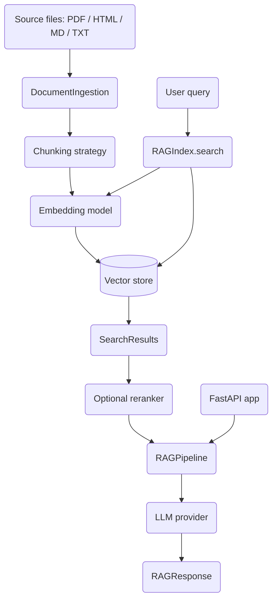

# RAG Baseline

A Retrieval-Augmented Generation system built from scratch in Python: document
ingestion, chunking, embedding-based retrieval, BM25/hybrid search, reranking, and
LLM generation, exposed both as a library (`ragbaseline`) and a FastAPI service. The
full pipeline runs locally with mock embeddings and a mock LLM, so no API keys are
required to exercise it end to end.

## Features

- **Pluggable document parsers** — PDF, HTML, Markdown, and plain text via a common
  `DocumentParser` interface and `DocumentIngestion` dispatcher (`parsers.py`).
- **Multiple chunking strategies** — `FixedSizeChunker`, `SentenceChunker`,
  `RecursiveChunker`, `SemanticChunker`, and `HierarchicalChunker` (`chunking.py`).
- **Swappable embeddings** — `MockEmbedding` (deterministic, hash-seeded),
  `SentenceTransformerEmbedding`, `OpenAIEmbedding`, and `HuggingFaceEmbedding`, behind
  a `get_embedding_model` factory (`embeddings.py`).
- **Vector stores** — NumPy-based `SimpleVectorStore` plus `ChromaVectorStore`,
  `QdrantVectorStore`, and `PineconeVectorStore` (`vectorstore.py`).
- **Lexical and hybrid retrieval** — a from-scratch `BM25` scorer and a
  `HybridRetriever` that fuses vector and keyword results with Reciprocal Rank Fusion
  (`retrieval.py`).
- **Advanced retrievers** — `VectorRetriever`, `FusionRetriever`, and `MMRRetriever`
  for diversity-aware retrieval (`retrieval.py`).
- **Reranking** — `CrossEncoderReranker` and `CohereReranker` behind a `get_reranker`
  factory (`retrieval.py`).
- **Metadata filtering** — operator syntax (`$in`, `$gte`, `$lt`, `$contains`, …) and a
  `MetadataFilter` string parser shared across stores and BM25.
- **LLM generation** — `OpenAIProvider`, `AnthropicProvider`, and `MockLLMProvider`
  with sync and streaming generation behind `get_llm_provider` (`pipeline.py`).
- **Multi-tenancy and analytics** — `TenantManager`, `RetrievalLogger`, and
  `UsageTracker` for per-tenant isolation, JSONL query logs, and usage metrics
  (`enterprise.py`).
- **FastAPI service** — query, streaming query, search, ingest, tenant, analytics, and
  usage endpoints (`api.py`).

## Architecture



| Component | Module | Responsibility |
|-----------|--------|----------------|
| Parsers | `parsers.py` | Turn files into `Document` objects by format |
| Chunking | `chunking.py` | Split documents into `Chunk` objects |
| Embeddings | `embeddings.py` | Encode text into vectors |
| Vector store | `vectorstore.py` | Store vectors and run similarity search |
| Index | `index.py` | Combine chunker + embeddings + store (`RAGIndex`) |
| Retrieval | `retrieval.py` | BM25, hybrid, fusion, MMR, reranking, filters |
| Pipeline | `pipeline.py` | Retrieve, build context, generate (`RAGPipeline`) |
| Enterprise | `enterprise.py` | Tenants, retrieval logging, usage tracking |
| API | `api.py` | FastAPI REST + SSE streaming endpoints |
| Schemas | `schemas.py` | `Document`, `Chunk`, `SearchResult`, `RAGResponse` |

## Quick Start

### Prerequisites

- Python 3.10+
- No external services or API keys are required to run the tests or the default
  in-memory pipeline. Optional integrations (OpenAI, Anthropic, Chroma, Cohere,
  sentence-transformers, FastAPI) are installed via extras. See
  [docs/SETUP.md](docs/SETUP.md) for detailed environment setup.

### Installation

```bash
# Core install (NumPy only)
pip install -e .

# With test dependencies
pip install -e ".[dev]"

# Everything (parsers, embeddings, providers, API)
pip install -e ".[full]"
```

### Running

```bash
# Start the FastAPI service (defaults to the mock LLM provider, no keys needed)
uvicorn ragbaseline.api:app --reload
# or
python -m ragbaseline.api
```

## Usage

The example below uses the fully local stack (`MockEmbedding`, `SimpleVectorStore`,
`MockLLMProvider`) and runs without any credentials.

```python
import asyncio

from ragbaseline import (
    Document, RAGConfig, RAGIndex, RAGPipeline,
    MockEmbedding, SimpleVectorStore, MockLLMProvider, FixedSizeChunker,
)

# Build an index from a chunker + embedding model + vector store
index = RAGIndex(
    embedding_model=MockEmbedding(dimension=128),
    vector_store=SimpleVectorStore(),
    chunker=FixedSizeChunker(chunk_size=200, chunk_overlap=20),
)

index.index_document(Document(
    id="geo",
    content="France is a country in Europe. Its capital is Paris.",
    metadata={"filename": "geo.txt"},
))

# Generate an answer over retrieved context
pipeline = RAGPipeline(
    index=index,
    llm_provider=MockLLMProvider(responses=["The capital of France is Paris."]),
    config=RAGConfig(top_k=3),
)

response = asyncio.run(pipeline.query("What is the capital of France?"))
print(response.answer)                       # -> The capital of France is Paris.
for src in response.sources:
    print(src.id, round(src.score, 3))
```

Swap `MockEmbedding`/`MockLLMProvider` for `OpenAIEmbedding`/`OpenAIProvider` (or the
Anthropic / sentence-transformers equivalents) to run against real models.

## What's Real vs Simulated

- **Real (no credentials, exercised by the test suite):** document parsing (plain text
  always; PDF/HTML/Markdown when their optional deps are installed), all chunking
  strategies, `MockEmbedding` (deterministic hash-seeded vectors), `SimpleVectorStore`
  cosine search with metadata filtering, `RAGIndex`, `RAGPipeline` (sync + streaming),
  the from-scratch `BM25` scorer, `HybridRetriever` RRF fusion, fusion/MMR retrievers,
  `MultiIndexManager`, `MetadataFilter`, and the enterprise logging/usage trackers. The
  FastAPI app defaults to the mock LLM provider, so it runs without keys.
- **Simulated / requires credentials or optional deps:** `OpenAIEmbedding` /
  `OpenAIProvider` (OpenAI key), `AnthropicProvider` (Anthropic key), `CohereReranker`
  (Cohere key), `ChromaVectorStore` / `QdrantVectorStore` / `PineconeVectorStore` (their
  client libraries / services), `SentenceTransformerEmbedding`, `HuggingFaceEmbedding`,
  and `CrossEncoderReranker` (model downloads). `LocalLLMProvider` returns a fixed
  placeholder string rather than calling a real local model.

## Testing

```bash
pytest tests/ -v
```

The suite covers schemas, parsing, every chunking strategy, embedding determinism,
vector-store add/search/delete/filter, `RAGIndex`, the index- and retriever-based
pipelines, BM25 and hybrid retrieval, streaming, multi-index isolation, and edge cases
(empty/whitespace/very long documents, concurrent queries). It runs entirely on the
mock/local components — no external services required.

## Project Structure

```
25-rag-baseline/
  README.md                 # This file
  pyproject.toml            # Package metadata, extras, pytest config
  Dockerfile                # Container build for the API
  docker-compose.yml        # Local API stack
  src/ragbaseline/
    schemas.py              # Document, Chunk, SearchResult, RAGResponse, RAGConfig
    parsers.py              # PDF / HTML / Markdown / text parsers + ingestion
    chunking.py             # Fixed, sentence, recursive, semantic, hierarchical chunkers
    embeddings.py           # Mock / SentenceTransformer / OpenAI / HuggingFace
    vectorstore.py          # Simple / Chroma / Qdrant / Pinecone stores
    index.py                # RAGIndex, MultiIndexManager
    retrieval.py            # BM25, hybrid, fusion, MMR, rerankers, filters
    pipeline.py             # LLM providers and RAGPipeline
    enterprise.py           # TenantManager, RetrievalLogger, UsageTracker
    api.py                  # FastAPI application
  tests/                    # Unit + integration tests (mock components)
  docs/
    BLUEPRINT.md            # Full architecture and design
    SETUP.md                # Detailed environment setup
    API.md, ARCHITECTURE.md, DEPLOYMENT.md, CONTRIBUTING.md
```

## License

MIT — see [LICENSE](../LICENSE)
