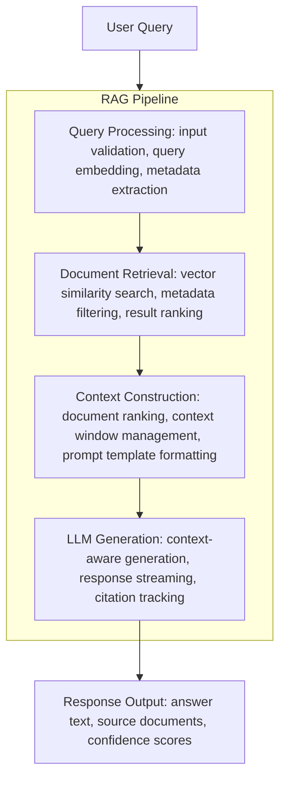
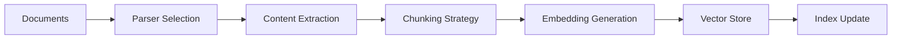

# RAG Baseline Architecture

## Overview

The RAG Baseline project implements a production-ready Retrieval-Augmented Generation (RAG) pipeline for intelligent document retrieval and question answering. The system combines vector similarity search with Large Language Model (LLM) generation to provide accurate, contextual responses based on a knowledge base.

## System Architecture



## Core Components

### 1. Document Processing Pipeline


#### Parsers (`parsers.py`)
- **PDFParser**: Extracts text from PDF documents
- **TextParser**: Handles plain text files
- **MarkdownParser**: Processes markdown with structure preservation
- **HTMLParser**: Extracts content from HTML documents

#### Chunking Strategies (`chunking.py`)
- **FixedSizeChunker**: Splits documents into fixed-size chunks with configurable overlap
- **SentenceChunker**: Maintains sentence boundaries for coherent chunks
- **SemanticChunker**: Groups semantically related content
- **HierarchicalChunker**: Preserves document structure (headers, sections)

#### Embedding System (`embeddings.py`)
- **OpenAIEmbedder**: Uses OpenAI's text-embedding models
- **LocalEmbedder**: Sentence transformers for on-premise deployment
- **CachedEmbedder**: LRU cache for embedding reuse
- **BatchedEmbedder**: Efficient batch processing for large volumes

### 2. Vector Storage Layer

#### Vector Stores (`vectorstore.py`)
- **InMemoryVectorStore**: Fast, memory-based storage for development
- **ChromaVectorStore**: Persistent storage with Chroma DB
- **QdrantVectorStore**: Scalable vector database integration
- **PineconeVectorStore**: Cloud-native vector search

#### Index Management (`index.py`)
- **RAGIndex**: Unified interface for document management
- **BatchIndexer**: Efficient bulk document processing
- **IncrementalIndexer**: Real-time document updates

### 3. Retrieval System

#### Retrieval Strategies (`retrieval.py`)
- **VectorRetriever**: Pure semantic similarity search
- **HybridRetriever**: Combines vector and keyword search
- **MMRRetriever**: Maximal Marginal Relevance for diversity
- **RerankedRetriever**: Neural reranking for precision

### 4. Generation Pipeline

#### LLM Providers (`pipeline.py`)
- **OpenAIProvider**: GPT models integration
- **AnthropicProvider**: Claude models support
- **LocalLLMProvider**: On-premise LLM deployment

#### Pipeline Components
- **RAGPipeline**: Standard request-response flow
- **StreamingRAGPipeline**: Real-time streaming responses
- **CachedPipeline**: Response caching for efficiency

## Data Flow

### 1. Document Ingestion Flow



### 2. Query Processing Flow


### 3. Observability Loop


Each query is logged (question, sources, response, latency) by `RetrievalLogger`
and counted per tenant by `UsageTracker`; the aggregates are exposed via the
`/analytics` and `/usage/{tenant_id}` endpoints.

## Storage Architecture

### Document Storage
```
/storage/
  /documents/          # Original documents
    /{doc_id}/
      metadata.json    # Document metadata
      content.txt      # Extracted text
  /chunks/            # Processed chunks
    /{chunk_id}/
      content.txt     # Chunk text
      embedding.npy   # Vector embedding
      metadata.json   # Chunk metadata
```

### Vector Index Structure
```
/index/
  /vectors/
    segments/         # Vector segments
    metadata/         # Index metadata
  /inverted/         # Keyword index
```

## API Architecture

The FastAPI app (`ragbaseline.api.create_app`) mounts all routes at the root
(no `/api/v1` prefix) and defaults to the mock LLM provider so it runs without
credentials. See [API.md](API.md) for full request/response schemas.

### REST API Endpoints

```
GET    /health                 # Health check
POST   /query                  # RAG query (retrieve + generate)
POST   /query/stream           # RAG query, SSE streaming
POST   /search                 # Retrieval only, no generation
POST   /ingest                 # Ingest a document from a file path
POST   /ingest/text            # Ingest raw text content
GET    /tenants                # List tenant IDs
GET    /tenants/{tenant_id}    # Tenant info
DELETE /tenants/{tenant_id}    # Delete a tenant and its data
GET    /analytics              # Aggregate retrieval analytics
GET    /usage/{tenant_id}      # Per-tenant usage metrics
```

Streaming uses Server-Sent Events over the `POST /query/stream` route (there are
no WebSocket endpoints). Interactive OpenAPI docs are served at `/docs`,
`/redoc`, and `/openapi.json`.

### Security middleware

API-key auth (`API_KEYS`), sliding-window rate limiting
(`RATE_LIMIT_PER_MINUTE`), and a per-request timeout (`REQUEST_TIMEOUT_SECONDS`)
are opt-in and disabled unless their environment variables are set. When auth is
enabled, keys are accepted via `Authorization: Bearer <key>` or `X-API-Key`, and
`/`, `/health`, `/ready`, `/readiness`, `/docs`, `/redoc`, and `/openapi.json`
stay open.

## Enterprise Features

### Multi-Tenancy (`enterprise.py`)

```python
class TenantManager:
    - Isolated vector stores per tenant
    - Tenant-specific configurations
    - Resource quotas and limits
    - Access control and permissions
```

### Monitoring and Observability

```python
class RAGMonitor:
    - Query latency tracking
    - Retrieval accuracy metrics
    - LLM token usage monitoring
    - Error rate tracking
    - Cache hit rates
```

## Scaling Considerations

### Horizontal Scaling

1. **Retrieval Layer**
   - Multiple retriever instances
   - Load balancing across replicas
   - Distributed vector index sharding

2. **Generation Layer**
   - LLM request pooling
   - Multi-provider failover
   - Response caching

### Vertical Scaling

1. **Vector Store Optimization**
   - HNSW index parameters
   - Memory mapping for large indices
   - GPU acceleration for similarity search

2. **Embedding Optimization**
   - Batch processing
   - Model quantization
   - Caching strategies

## Performance Optimizations

### 1. Embedding Cache
- LRU cache with configurable size
- Persistent cache for common queries
- Batch embedding requests

### 2. Vector Index Optimization
- Approximate nearest neighbor search
- Index compression techniques
- Incremental index updates

### 3. LLM Optimization
- Prompt caching
- Response streaming
- Token budget management

## Security Architecture

### Data Security
- Encryption at rest for documents
- TLS for data in transit
- Secure key management

### Access Control
- API key authentication
- Role-based access control
- Tenant isolation

### Privacy
- PII detection and masking
- Audit logging
- Data retention policies

## Deployment Architecture

### Docker Deployment

```yaml
services:
  rag-api:
    - FastAPI application
    - Auto-scaling enabled

  vector-db:
    - Persistent volume
    - Backup strategies

  redis:
    - Caching layer
    - Session management
```

### Kubernetes Deployment

```yaml
Deployments:
  - rag-api (3 replicas)
  - vector-store (StatefulSet)
  - embedder-service (2 replicas)

Services:
  - LoadBalancer for API
  - ClusterIP for internal services
```

## Configuration Management

### Environment-based Configuration

```python
config/
  base.yaml       # Base configuration
  dev.yaml        # Development overrides
  staging.yaml    # Staging configuration
  prod.yaml       # Production settings
```

### Dynamic Configuration

- Feature flags for gradual rollouts
- A/B testing configurations
- Runtime parameter updates

## Monitoring and Alerting

### Metrics Collection

```python
Metrics:
  - query_latency_seconds
  - retrieval_precision_ratio
  - llm_tokens_used_total
  - cache_hit_rate
  - error_rate
```

### Alerting Rules

```yaml
Alerts:
  - High query latency (> 2s)
  - Low retrieval precision (< 0.7)
  - High error rate (> 1%)
  - Resource exhaustion
```

