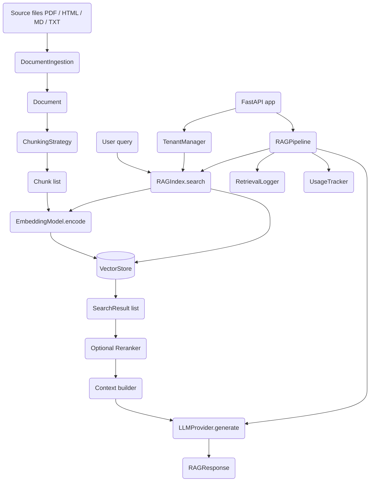

# RAG Baseline

## Overview

RAG Baseline is a Retrieval-Augmented Generation system implemented from scratch in
Python. It takes a corpus of documents, splits them into chunks, embeds the chunks into
vectors, stores those vectors for similarity search, and at query time retrieves the
most relevant chunks to ground an LLM's answer. The system is packaged as a library
(`ragbaseline`) and as a FastAPI service.

The design goal is a complete, honest baseline: every stage of a RAG pipeline is
present and swappable, and the entire flow runs locally with deterministic mock
components so it can be tested without any network access or API keys. Real providers
(OpenAI, Anthropic, Cohere) and real vector databases (Chroma, Qdrant, Pinecone) plug
in through the same interfaces when their dependencies and credentials are available.

The concepts this codebase exercises:

- The canonical RAG stages — parse, chunk, embed, index, retrieve, rerank, generate.
- Vector similarity search and cosine scoring over dense embeddings.
- Lexical retrieval with a from-scratch BM25 implementation.
- Hybrid retrieval and Reciprocal Rank Fusion (RRF) for combining rankings.
- Maximal Marginal Relevance (MMR) for diversity-aware retrieval.
- Cross-encoder and API-based reranking.
- Metadata filtering with an operator query language.
- Streaming generation over Server-Sent Events.
- Multi-tenant isolation, retrieval logging, and usage tracking.

Scope: the project focuses on the retrieval and orchestration layer. It does not train
embedding models or LLMs; it consumes them. Persistence beyond the optional vector-store
backends is limited to JSON/pickle snapshots and JSONL logs.

## Architecture



The system is organized as a set of small, interface-driven layers:

- **Ingestion layer** (`parsers.py`) converts raw files into `Document` objects.
  `DocumentIngestion` holds an ordered list of parsers and dispatches by file
  extension.
- **Chunking layer** (`chunking.py`) splits a `Document` into `Chunk` objects using one
  of several strategies, all implementing `ChunkingStrategy.chunk`.
- **Embedding layer** (`embeddings.py`) maps chunk text to dense vectors. Two interface
  families exist: the synchronous `EmbeddingModel` protocol (`.encode`) used by
  `RAGIndex`, and the asynchronous `EmbeddingProvider` ABC (`.embed` / `.embed_batch`)
  used by the async retrievers.
- **Storage layer** (`vectorstore.py`) persists vectors and answers nearest-neighbor
  queries. `SimpleVectorStore` is the synchronous default used by `RAGIndex`; the
  async `VectorStore` ABC has Chroma/Qdrant/Pinecone implementations.
- **Index layer** (`index.py`) wires a chunker, embedding model, and vector store into
  `RAGIndex`, the single object the pipeline talks to. `MultiIndexManager` keeps a set
  of named indices for multi-tenant use.
- **Retrieval layer** (`retrieval.py`) adds lexical (`BM25`), hybrid, fusion, MMR, and
  reranking strategies, plus metadata filtering.
- **Generation layer** (`pipeline.py`) retrieves, assembles context, and calls an
  `LLMProvider`. `RAGPipeline` supports both an index-based and a retriever-based
  interface.
- **Enterprise layer** (`enterprise.py`) provides per-tenant isolation, JSONL retrieval
  logging with analytics, and usage tracking.
- **API layer** (`api.py`) exposes the pipeline over HTTP with FastAPI, including SSE
  streaming.

A deliberate design wrinkle: `RAGIndex` calls the **synchronous** vector-store
signature `add(ids, embeddings, documents, metadatas)` and
`search(query_embedding, k, filter)`, which is what `SimpleVectorStore` implements. The
async `VectorStore` ABC (Chroma/Qdrant/Pinecone) is consumed by the async
`VectorRetriever` path instead. The two retrieval paths coexist so that the simple,
dependency-free flow stays fully synchronous while richer async retrievers remain
available.

## Core Components

### Document Ingestion

`parsers.py` defines `DocumentParser`, an ABC with `supports(file_path)` and
`parse(file_path) -> Document`. Concrete parsers:

- `PDFParser` — extracts page text with PyMuPDF (`fitz`).
- `HTMLParser` — strips `script`/`style` and extracts text with BeautifulSoup.
- `MarkdownParser` — renders Markdown to HTML then extracts text, falling back to raw
  Markdown if the optional deps are missing; pulls the first `# ` heading as the title.
- `TextParser` — reads `.txt` / `.text` directly (no optional deps).

Each parser imports its heavy dependency lazily inside `parse`, raising a clear
`ImportError` with an install hint if it is absent. IDs are content-addressed via
`generate_id(str(file_path))`.

`DocumentIngestion` registers the four parsers (custom parsers can be inserted at the
front with `add_parser`) and dispatches:

```python
class DocumentIngestion:
    def ingest(self, file_path: Path) -> Document:
        file_path = Path(file_path)
        for parser in self.parsers:
            if parser.supports(file_path):
                return parser.parse(file_path)
        raise ValueError(f"No parser found for {file_path}")

    def ingest_directory(self, dir_path: Path) -> Iterator[Document]:
        for file_path in Path(dir_path).rglob("*"):
            if file_path.is_file():
                try:
                    yield self.ingest(file_path)
                except ValueError:
                    continue  # Skip unsupported files
```

### Chunking Strategies

`chunking.py` defines `ChunkingStrategy.chunk(document) -> list[Chunk]`. Five strategies
are implemented:

- **`FixedSizeChunker`** — character windows of `chunk_size` with `chunk_overlap`.
  Step size is `max(1, chunk_size - chunk_overlap)`; optional `split_on="word"` snaps
  the window end back to the last space. Each chunk records `start_char`/`end_char` and
  a `total_chunks` count is back-filled after the pass.
- **`SentenceChunker`** — groups `sentences_per_chunk` sentences with
  `overlap_sentences`. Sentence splitting is a hand-written scanner that handles
  honorifics (`Dr`, `Mr`, …), abbreviations (`Inc`, `U.S.A`, `e.g`, …), and common
  sentence starters to decide whether a period ends a sentence.
- **`RecursiveChunker`** — splits on a separator hierarchy
  (`["\n\n", "\n", ". ", " ", ""]`), recursing into finer separators when a piece is
  still larger than `chunk_size`.
- **`SemanticChunker`** — splits on paragraph boundaries, embeds each paragraph, and
  merges adjacent paragraphs whose cosine similarity exceeds `similarity_threshold`
  (subject to `max_chunk_size`). Has both a sync `chunk` and an async `chunk_async`; if
  no embedder is supplied it falls back to a length-based pseudo-embedding.
- **`HierarchicalChunker`** — parses Markdown headers into a section tree, attaches
  `section_path`/`parent_section` metadata, optionally isolates fenced code blocks, and
  merges chunks below `min_chunk_size`.

The core windowing loop:

```python
step = max(1, self.chunk_size - self.chunk_overlap)
while start < len(text):
    end = start + self.chunk_size
    if self.split_on == "word" and end < len(text):
        last_space = text.rfind(" ", start, end)
        if last_space > start:
            end = last_space
    chunk_text = text[start:end]
    ...
    start += step
```

The `SentenceChunker` deserves special attention because it avoids an NLTK dependency in
favor of a hand-written boundary detector. The detector scans for `.`, `!`, or `?`
followed by a space and an uppercase letter, then disambiguates using three word sets:

- **Honorifics** (`Dr`, `Mr`, `Mrs`, `Ms`, `Prof`, `Jr`, `Sr`) are always followed by a
  name and never end a sentence.
- **Other abbreviations** (`Inc`, `Ltd`, `Corp`, `U.S.A`, `i.e`, `e.g`, `al`, …) may or
  may not end a sentence; multi-period forms like `U.S.A` are normalized by stripping
  dots before the lookup.
- **Sentence starters** (`He`, `The`, `However`, `Therefore`, …) signal that the word
  *after* the punctuation likely begins a new sentence.

A boundary is taken only when the preceding token is not a honorific and either is not
an abbreviation or is followed by a known sentence starter. This keeps `Dr. Smith`
together while still splitting `... in the U.S. However, ...`. The grouping pass then
emits chunks of `sentences_per_chunk` sentences, stepping forward by
`max(1, sentences_per_chunk - overlap_sentences)` so overlap is expressed in whole
sentences rather than characters.

The `HierarchicalChunker` builds a section stack from Markdown headers (`#`–`######`),
recording each section's `level`, `title`, `parent_section`, and full `section_path`.
Code fences are tracked so a fenced block is never split mid-code, and when
`preserve_code_blocks` is set, each block becomes its own chunk tagged
`is_code_block: True`. Oversized sections are split at the best available delimiter
(`\n\n`, `\n`, `. `, `! `, `? `) past the halfway point, and a final
`_merge_small_chunks` pass folds anything below `min_chunk_size` into its neighbor so the
output has no tiny fragments.

### Embeddings

`embeddings.py` provides two interfaces. The synchronous `EmbeddingModel` protocol
(used by `RAGIndex`) exposes `dimension` and `encode(texts) -> np.ndarray`:

- `MockEmbedding` — seeds NumPy's RNG with `hash(text)` to produce deterministic,
  unit-normalized vectors, and caches per text. This is what the tests use.
- `SentenceTransformerEmbedding` — wraps a `sentence-transformers` model
  (`BAAI/bge-small-en-v1.5` by default), normalizing embeddings.
- `OpenAIEmbedding` — calls the OpenAI embeddings API in batches of 100, inferring the
  dimension (1536 for small/ada, 3072 for large).
- `HuggingFaceEmbedding` — runs a `transformers` model directly, CLS-pooling and
  L2-normalizing the output.

The async `EmbeddingProvider` ABC (used by async retrievers) exposes `embed` /
`embed_batch` and has `OpenAIEmbedder` and `LocalEmbedder` implementations, plus two
decorators that share the provider interface so they can wrap any base embedder:

- **`CachedEmbedder`** keeps an `OrderedDict` LRU cache keyed on text. `embed` checks
  the cache and `move_to_end`s on a hit; `embed_batch` partitions the input into cached
  and uncached, embeds only the misses in a single batch call, and stitches results back
  into the original order. Both paths evict from the front once the cache exceeds
  `cache_size`.
- **`BatchedEmbedder`** coalesces concurrent single-text `embed` calls. Each call
  appends a `(text, Future)` pair under an `asyncio.Lock`; once `batch_size` pairs
  accumulate (or `batch_timeout` elapses via a scheduled task) the pending batch is sent
  as one `embed_batch` call and the futures are resolved. Exceptions are propagated to
  every waiting future in the batch.

This decorator stacking (`BatchedEmbedder(CachedEmbedder(OpenAIEmbedder()))`, for
example) lets the async path amortize both repeated and concurrent embedding work
without changing call sites.

`MockEmbedding` determinism is the key to a testable system:

```python
def encode(self, texts: list[str]) -> np.ndarray:
    embeddings = []
    for text in texts:
        if text not in self._cache:
            np.random.seed(hash(text) % (2**32))
            embedding = np.random.randn(self.dimension)
            embedding = embedding / np.linalg.norm(embedding)
            self._cache[text] = embedding
        embeddings.append(self._cache[text])
    return np.array(embeddings)
```

### Vector Stores

`vectorstore.py` has two store families. `SimpleVectorStore` is the synchronous default
that `RAGIndex` drives. It keeps a stacked NumPy embedding matrix plus parallel `ids`,
`documents`, and `metadatas` lists, and computes cosine similarity by normalizing both
sides:

```python
query_norm = query_embedding / (np.linalg.norm(query_embedding) + 1e-10)
emb_norms = self.embeddings / (np.linalg.norm(self.embeddings, axis=1, keepdims=True) + 1e-10)
similarities = np.dot(emb_norms, query_norm)
```

Metadata filters are applied as a mask before the top-k `argsort`; filtered rows are set
to `-inf` so they sort to the bottom, and the final loop skips any row still masked out
so a filter that matches fewer than `k` documents returns fewer than `k` results rather
than padding with irrelevant rows. The operator language supports `$in`, `$eq`, `$gte`,
and `$lte`; a bare value is treated as equality and a missing key fails the match.
`save`/`load` snapshot the matrix to `embeddings.npy` and the parallel lists to
`metadata.json`. The richer operator set (`$ne`, `$gt`, `$lt`, `$contains`) is
implemented consistently in `BM25._match_filter` and `MetadataFilter.validate`, so the
same query language works across vector search, lexical search, and the string DSL.

The async `VectorStore` ABC defines `add` / `search` / `delete` / `size` plus default
`update`, `clear`, `add_batch`, and `search_batch`. Implementations:

- `InMemoryVectorStore` — dict-of-vectors store with `$in`/`$eq`/`$ne` filtering and
  pickle persistence.
- `ChromaVectorStore` — wraps a ChromaDB collection (`hnsw:space=cosine`), converting
  distances to scores via `1 - distance`.
- `QdrantVectorStore` — recreates a cosine collection and upserts `PointStruct`s.
- `PineconeVectorStore` — upserts tuples and queries with metadata included.

Both `get_vector_store(store_type)` (simple/chroma) and `VectorStore.from_config` act as
factories.

### Index

`index.py` ties the pieces together. `RAGIndex.index_document` chunks, embeds the chunk
texts in one `encode` call, and adds them to the store; `search` embeds the query and
delegates to the store:

```python
def index_document(self, document: Document):
    chunks = self.chunker.chunk(document)
    if not chunks:
        return
    texts = [c.content for c in chunks]
    embeddings = self.embedding_model.encode(texts)
    self.vector_store.add(
        ids=[c.id for c in chunks],
        embeddings=embeddings,
        documents=texts,
        metadatas=[c.metadata for c in chunks],
    )

def search(self, query, k=5, filter=None):
    query_embedding = self.embedding_model.encode([query])
    return self.vector_store.search(query_embedding, k, filter)
```

`MultiIndexManager` keeps a `dict[str, RAGIndex]` and offers `create_index`,
`get_index`, `delete_index`, and `list_indices` for per-tenant separation in-process.

### Retrieval

`retrieval.py` adds lexical and combined retrieval on top of vector search.

**BM25** is implemented from scratch. `add_documents` tokenizes with `\w+`, tracks
per-document term frequencies, document lengths, and document frequencies, and maintains
the average document length. Scoring uses the standard BM25 formula with IDF and
length-normalized term frequency:

```python
df = self.doc_freqs[term]
idf = math.log((self.n_docs - df + 0.5) / (df + 0.5) + 1)
tf = term_freqs.get(term, 0)
tf_norm = (tf * (self.k1 + 1)) / (
    tf + self.k1 * (1 - self.b + self.b * doc_len / self.avg_doc_len)
)
score += idf * tf_norm
```

`delete` removes documents and rebuilds the document-frequency table.

**`HybridRetriever`** (the exported alias of `LegacyHybridRetriever`) runs vector search
and BM25 in parallel, each over `k*2` candidates, then fuses with Reciprocal Rank
Fusion. RRF weights vector vs. lexical rankings by `alpha`:

```python
# vector results
rrf_score = alpha * (1 / (k + rank))
# bm25 results
rrf_score = (1 - alpha) * (1 / (k + rank))
```

The async `Retriever` ABC (`retrieve` / `retrieve_batch`) backs the retriever-based
pipeline path:

- `VectorRetriever` — embeds the query via an async embedder and searches an async
  store, with an optional `score_threshold`.
- `AsyncHybridRetriever` / `FusionRetriever` — fuse several retrievers with weighted,
  max, or RRF strategies; RRF breaks ties by last-seen rank position.
- `RerankedRetriever` — retrieves then reranks, with optional `fallback_on_error`.
- `MMRRetriever` — re-selects results to balance relevance against diversity using the
  Maximal Marginal Relevance score
  `lambda * relevance - (1 - lambda) * max_similarity`.

The MMR selection loop greedily picks, at each step, the remaining candidate whose MMR
score is highest given what has already been chosen:

```python
while len(selected) < self.k and remaining:
    best_score = float('-inf')
    best_idx = 0
    for idx, result in enumerate(remaining):
        relevance = result.score
        max_sim = max(
            (self._cosine_similarity(embeddings[result.id], embeddings[sel.id])
             for sel in selected),
            default=0.0,
        )
        mmr_score = self.lambda_mult * relevance - (1 - self.lambda_mult) * max_sim
        if mmr_score > best_score:
            best_score, best_idx = mmr_score, idx
    selected.append(remaining.pop(best_idx))
```

With `lambda_mult == 1.0` the retriever short-circuits to pure relevance (no diversity
penalty). The fusion retrievers (`AsyncHybridRetriever`, `FusionRetriever`) implement
RRF with an explicit tie-break: results with equal fused scores are ordered by their
last-seen rank position, so a document that appeared higher in a later retriever's list
wins ties. `_weighted_fusion` and `_max_fusion` offer simpler alternatives selected by
`fusion_method`.

**Reranking** is defined by the `Reranker` ABC. `CrossEncoderReranker` scores
query/document pairs with a `sentence-transformers` cross-encoder;
`CohereReranker` calls the Cohere rerank API. `get_reranker` selects between them.

**`MetadataFilter`** parses a string DSL into the operator dict used by the stores:

```text
"file_type:pdf"               -> {"file_type": "pdf"}
"date:>=2024-01-01"           -> {"date": {"$gte": "2024-01-01"}}
"category:in:pricing,sales"   -> {"category": {"$in": ["pricing", "sales"]}}
```

`AND`-joined clauses are supported, and `validate` checks a metadata dict against a
parsed filter.

### Generation Pipeline

`pipeline.py` defines the `LLMProvider` ABC (`generate`, with a default
`generate_stream` that yields the full response). Providers:

- `OpenAIProvider` — async OpenAI chat completions, with true token streaming.
- `AnthropicProvider` — async Anthropic messages, extracting the system message and
  streaming via `messages.stream`.
- `MockLLMProvider` — cycles through a fixed list of responses (used in tests).
- `LocalLLMProvider` — returns a placeholder string; a stub for local-model wiring.

`RAGPipeline` accepts either an `index` or a `retriever`. Its `query` method retrieves,
optionally reranks, builds context, and generates:

```python
if self.retriever is not None:
    results = await self.retriever.retrieve(question, filter=filter)  # filter passed only if set
else:
    results = self.index.search(question, k=self.config.top_k, filter=filter)

context = self._build_context(results)
messages = self._build_messages(question, context)
answer = await self.llm.generate(messages)
return RAGResponse(answer=answer, sources=results, query=question)
```

Context building enforces a character budget derived from `max_context_tokens * 4`,
numbering each source and prefixing it with its `filename` metadata. An optional
in-process result cache keys on `question:filter`. `AsyncRAGPipeline` and
`StreamingRAGPipeline` are retriever-only variants kept for the async test surface, with
`PipelineConfig` (validated, YAML-loadable) for their configuration.

Reranking inside `RAGPipeline.query` is intentionally tolerant of return shapes. An
explicitly supplied `reranker` may return either `(index, score)` tuples (which are
mapped back onto the original `SearchResult`s) or already-constructed `SearchResult`
objects; both are normalized into a uniform list. If no explicit reranker is given but
`config.rerank` is set and there are more than `rerank_top_k` results, the pipeline falls
back to an internal cross-encoder pass that returns the original ordering unchanged when
`sentence-transformers` is unavailable, so enabling reranking never hard-fails on a
missing optional dependency. `retry_on_error` wraps retrieval in a single retry.

Putting it together, a single `query` call proceeds:

1. **Cache check** — if caching is on and `question:filter` is present, return the
   cached `RAGResponse`.
2. **Retrieve** — via `retriever.retrieve` (filter passed only when set) or
   `index.search(question, k=top_k, filter=...)`, optionally retried once.
3. **Rerank** — apply an explicit reranker or the config-driven cross-encoder fallback.
4. **Build context** — number sources, prefix with `filename`, and stop at the character
   budget.
5. **Build messages** — `system_prompt` plus a user message embedding the context (or a
   caller-supplied `prompt_template`).
6. **Generate** — `await llm.generate(messages)`, then assemble and (optionally) cache a
   `RAGResponse`.

The streaming path (`query_stream`) follows steps 2, 4, and 5, then yields tokens from
`llm.generate_stream` rather than awaiting a single answer.

### Enterprise

`enterprise.py` adds operational concerns:

- **`TenantManager`** — lazily creates an isolated `RAGIndex` per tenant under a
  per-tenant directory, defaulting to a Chroma store named `tenant_{id}` and a
  `SentenceChunker`. It writes a `metadata.json` per tenant and exposes
  `get_tenant_index`, `get_tenant_pipeline`, `list_tenants`, `get_tenant_info`, and a
  destructive `delete_tenant`.
- **`RetrievalLogger`** — appends one JSON object per query to a JSONL file, maintains
  in-memory latency/tenant counters, rotates the log past `rotation_size_mb`, and offers
  `get_analytics`, `analyze_logs` (with date/tenant filters), and `export_logs`
  (JSONL/CSV). Latency percentiles are computed with NumPy.
- **`UsageTracker`** — accumulates per-tenant query counts, token counts, and document
  counts in a `usage.json` file for billing/quota purposes.

Each retrieval log line is a flat JSON object capturing what was asked, what came back,
and how long it took:

```python
log_entry = {
    "timestamp": datetime.utcnow().isoformat(),
    "query": query,
    "num_results": len(results),
    "result_ids": [r.id for r in results],
    "result_scores": [r.score for r in results],
    "response_length": len(response) if response else 0,
    "tenant_id": tenant_id,
    "user_id": user_id,
    "latency_ms": latency_ms,
    "metadata": metadata or {},
}
```

`get_analytics` summarizes the in-memory counters (total queries, per-tenant counts, and
avg/p50/p95/p99/min/max latency), while `analyze_logs` re-reads the file from disk and
supports `start_date`/`end_date`/`tenant_id` filters, unique-query counts, and a
top-users list. `export_logs` re-emits filtered records as JSONL or flattens them to CSV
(joining `result_ids`/`result_scores` and JSON-encoding `metadata`).

`TenantManager` lazily materializes a tenant's index on first access. The creation path
makes a per-tenant directory, builds the default embedding model
(`sentence-transformers` / `BAAI/bge-small-en-v1.5`), provisions a Chroma collection
named `tenant_{id}` rooted in that directory (falling back to a `SimpleVectorStore` when
the default backend is not Chroma), attaches a `SentenceChunker`, and writes a
`metadata.json` recording the creation timestamp. `get_tenant_info` augments the stored
metadata with a live `document_count` when the index is loaded, and `delete_tenant`
removes both the in-memory cache entry and the on-disk directory.

### API

`api.py` builds the FastAPI app through `create_app`, which wires a `TenantManager`,
`RetrievalLogger`, `UsageTracker`, and `DocumentIngestion` into `app.state` and adds
permissive CORS. The default LLM provider is `"mock"`, so the service runs without any
credentials. Endpoints cover health, query (with background logging and usage tracking),
SSE streaming, retrieval-only search, file and raw-text ingestion, tenant CRUD,
analytics, and usage. `main()` runs it under uvicorn on port 8000.

Each request builds a fresh `RAGPipeline` from the resolved tenant index and a provider
from `get_llm_provider`, so providers and configuration can vary per request without
shared mutable state. The `/ingest` and `/ingest/text` handlers chunk the document once
to report a `chunks` count, then call `index.index_document`. The `/query` handler
measures wall-clock latency around the pipeline call and hands the log/usage writes to
`background_tasks`, so the response returns before those side effects complete.

### Design Decisions and Trade-offs

Several choices in the codebase are worth calling out as deliberate baseline trade-offs:

- **Two parallel interface families (sync and async).** `RAGIndex` and the default flow
  are synchronous and dependency-free, which keeps the common path simple and easy to
  test. The async `EmbeddingProvider` / `VectorStore` / `Retriever` families exist for
  the richer retrievers and the external backends. The cost is two encode/search
  signatures; the benefit is that the zero-dependency path never touches `asyncio`.
- **Exact search by default.** `SimpleVectorStore` does a full linear scan rather than
  building an ANN index. For a baseline and for tests this is correct and predictable;
  scaling out means switching to a Chroma/Qdrant/Pinecone backend through the same
  `from_config` factory.
- **Lazy, optional dependencies.** Heavy libraries (PyMuPDF, BeautifulSoup, openai,
  anthropic, chromadb, sentence-transformers) are imported inside the methods that need
  them and raise actionable `ImportError`s. This is why `pip install -e .` pulls only
  NumPy, and why parsing/embedding/generation degrade gracefully when an extra is
  missing.
- **Deterministic mocks as first-class components.** `MockEmbedding` and
  `MockLLMProvider` are not test doubles bolted on from the outside; they implement the
  same interfaces as the real providers and are the default for the API. This makes the
  whole system runnable and reproducible offline.
- **Content-addressed IDs.** Documents and (via `generate_id`) raw-text ingestion derive
  IDs from content hashes, so re-ingesting identical input is idempotent at the document
  level. Chunk IDs are derived from the document ID plus chunk index.

## Data Structures

The core schemas live in `schemas.py`. All are dataclasses with `to_dict` (and, where
useful, `from_dict` / `to_json`) helpers.

```python
@dataclass
class Document:
    id: str
    content: str
    metadata: dict = field(default_factory=dict)
    source: str = ""


@dataclass
class Chunk:
    id: str
    content: str
    document_id: str
    chunk_index: int = 0
    metadata: dict = field(default_factory=dict)
    start_char: int = 0
    end_char: int = 0


@dataclass
class SearchResult:
    id: str
    score: float = 0.0
    content: str = ""
    metadata: dict = field(default_factory=dict)

    # Ordering by score so results can be sorted/heapified directly
    def __gt__(self, other): return self.score > other.score
    def __lt__(self, other): return self.score < other.score


@dataclass
class RAGResponse:
    query: str
    answer: str
    sources: list[SearchResult]
    metadata: dict = field(default_factory=dict)


@dataclass
class RAGConfig:
    # Retrieval
    top_k: int = 5
    rerank: bool = False
    rerank_top_k: int = 3
    # Generation
    model: str = "gpt-3.5-turbo"
    temperature: float = 0.7
    max_tokens: int = 1024
    stream: bool = False
    # Prompt
    system_prompt: str = "You are a helpful assistant that answers questions ..."
```

IDs are generated deterministically from content so re-ingesting the same source is
idempotent:

```python
def generate_id(content: str) -> str:
    return hashlib.sha256(content.encode()).hexdigest()[:16]
```

Two configuration dataclasses support retrieval and the async pipeline:

```python
@dataclass
class RetrievalConfig:
    retriever_type: str = "vector"
    k: int = 5
    score_threshold: float = 0.0
    reranking_enabled: bool = False
    mmr_lambda: float = 0.5
    vector_weight: float = 0.5   # hybrid vector vs. BM25 weight
    bm25_k1: float = 1.5
    bm25_b: float = 0.75
    # __post_init__ validates ranges (k > 0; thresholds/weights in [0, 1])


@dataclass
class VectorStoreConfig:
    type: str = "in_memory"
    dimension: int = 384
    collection_name: str = "documents"
    persist_directory: str = "./data"
    host: str = "localhost"
    port: int = 6333
    index_name: str = "documents"
    api_key: str = ""
    environment: str = ""
```

## API Design

### Library interfaces

The public surface is re-exported from `ragbaseline/__init__.py`. The central
synchronous interfaces:

```python
class ChunkingStrategy(ABC):
    def chunk(self, document: Document) -> list[Chunk]: ...

class EmbeddingModel(Protocol):       # used by RAGIndex
    dimension: int
    def encode(self, texts: list[str]) -> np.ndarray: ...

class RAGIndex:
    def index_document(self, document: Document) -> None: ...
    def index_documents(self, documents: list[Document]) -> None: ...
    def search(self, query: str, k: int = 5, filter: dict = None) -> list[SearchResult]: ...

class RAGPipeline:
    def __init__(self, index=None, llm_provider=None, config=None, *, retriever=None, ...): ...
    async def query(self, question: str, filter: dict = None) -> RAGResponse: ...
    async def query_stream(self, question: str, filter: dict = None) -> AsyncIterator[str]: ...
```

The asynchronous retrieval interfaces:

```python
class EmbeddingProvider(ABC):
    @property
    def dimension(self) -> int: ...
    async def embed(self, text: str) -> np.ndarray: ...
    async def embed_batch(self, texts: list[str]) -> list[np.ndarray]: ...

class VectorStore(ABC):
    async def add(self, ids, vectors, metadata=None): ...
    async def search(self, query, k=5, filter=None) -> list[SearchResult]: ...
    async def delete(self, ids): ...
    def size(self) -> int: ...

class Retriever(ABC):
    async def retrieve(self, query: str, filter: dict = None) -> list[SearchResult]: ...

class LLMProvider(ABC):
    async def generate(self, messages, temperature=0.7, max_tokens=1024) -> str: ...
    async def generate_stream(self, messages, ...) -> AsyncIterator[str]: ...
```

Factory helpers (`get_embedding_model`, `get_vector_store`, `get_llm_provider`,
`get_reranker`) select implementations by string type.

### REST endpoints

`create_app()` registers the following routes (request/response bodies are Pydantic
models in `api.py`):

```text
GET    /health                 -> {status, version}
POST   /query                  -> {answer, sources, query, latency_ms}
POST   /query/stream           -> text/event-stream of {content} chunks, then [DONE]
POST   /search                 -> {results, latency_ms}            (retrieval only)
POST   /ingest                 -> {status, document_id, chunks}    (from file path)
POST   /ingest/text            -> {status, document_id, chunks}    (raw text)
GET    /tenants                -> [tenant_id, ...]
GET    /tenants/{tenant_id}    -> {tenant_id, document_count, created_at}
DELETE /tenants/{tenant_id}    -> {status, tenant_id}
GET    /analytics             -> {total_queries, tenants, latency}
GET    /usage/{tenant_id}      -> {queries, tokens_in, tokens_out, documents}
```

`/query` accepts `top_k`, an explicit `filter` dict or a `filter_string` parsed by
`MetadataFilter`, and `rerank`/`stream` flags. Query logging and usage tracking run as
FastAPI background tasks so they do not add to request latency.

## Performance

The repository does not ship measured benchmarks, so this section states only what the
implementation's complexity and design imply; no throughput or latency numbers are
claimed.

- **`SimpleVectorStore` search is exact and linear.** Each query computes cosine
  similarity against every stored vector with vectorized NumPy operations
  (`O(n · d)`), then an `O(n log n)` `argsort`. This is appropriate for the
  baseline/test scale; for large corpora the Chroma/Qdrant/Pinecone backends provide
  approximate nearest-neighbor indexes (HNSW/IVF) instead.
- **BM25 scoring is linear in the corpus.** `search` scores every document against the
  query terms (`O(n · |query|)`) and selects top-k with `argsort`; statistics are
  precomputed at `add_documents` time.
- **Embedding is batched.** `RAGIndex.index_document` issues a single `encode` call for
  all chunks of a document, and `OpenAIEmbedding` batches API calls in groups of 100.
  `CachedEmbedder` (LRU) and `BatchedEmbedder` (timeout-coalesced batching) reduce
  repeated and concurrent embedding work in the async path.
- **Context is bounded.** `RAGPipeline._build_context` stops adding sources once the
  accumulated text would exceed `max_context_tokens * 4` characters, capping prompt
  size regardless of `top_k`.
- **Logging stays off the request path.** The API records retrieval logs and usage in
  background tasks; `RetrievalLogger` rotates its JSONL file past `rotation_size_mb`.
- **Determinism over speed in tests.** `MockEmbedding` trades model quality for
  reproducibility, letting the full pipeline run in-process without GPUs or network.

## Testing Strategy

Tests live in `tests/` and run under `pytest` with `asyncio_mode = "auto"` (configured
in `pyproject.toml`); `conftest.py` adds `src/` to the path and provides an
asyncio-run fallback when `pytest-asyncio` is absent. Everything runs on the mock/local
components, so no external services are required.

Coverage by area:

- **Schemas** — construction and `to_dict` round-trips for `Document` and friends.
- **Chunking** — fixed-size size bounds and overlap behavior, sentence-boundary
  preservation, recursive separator handling, empty-document handling, and a
  cross-strategy comparison of chunk counts and retrieval quality.
- **Embeddings** — `MockEmbedding` shape and determinism (identical input yields
  identical vectors).
- **Vector store** — add/search/delete, `count`, and metadata filtering on
  `SimpleVectorStore`.
- **Index** — `index_document`, `count`, and `search` over a `RAGIndex`, including the
  empty-index case.
- **Pipeline** — index-based and retriever-based `query`, query-with-filter, custom
  system prompts (asserting the prompt reaches the LLM), `top_k` enforcement, and
  concurrent queries via `asyncio.gather`.
- **Retrieval** — BM25 keyword ranking, BM25 metadata filtering, BM25 deletion, and
  `HybridRetriever` fusion including alpha overrides and empty-result handling.
- **Streaming** — chunk ordering, long responses, and empty-index streaming using
  custom `LLMProvider` subclasses that yield token-by-token.
- **Multi-index** — creation, isolation, listing, deletion, and missing-index lookups
  via `MultiIndexManager`.
- **Edge cases** — empty, whitespace-only, very long (~24 KB), and special-character /
  Unicode documents.
- **Document parsing integration** — Markdown and text parsing followed by indexing and
  search, plus whole-directory ingestion that skips unsupported files.

Integration tests build a small fixed corpus (Python, Rust, ML, RAG, vector-database
documents) and assert end-to-end behavior: documents index, queries return relevant and
score-ordered sources, metadata filters constrain results, and responses are
`RAGResponse` objects with non-empty answers.

## References

- Lewis et al., "Retrieval-Augmented Generation for Knowledge-Intensive NLP Tasks"
  (https://arxiv.org/abs/2005.11401)
- Karpukhin et al., "Dense Passage Retrieval for Open-Domain QA"
  (https://arxiv.org/abs/2004.04906)
- Robertson & Zaragoza, "The Probabilistic Relevance Framework: BM25 and Beyond"
  (https://www.staff.city.ac.uk/~sbrp622/papers/foundations_bm25_review.pdf)
- Carbonell & Goldstein, "The Use of MMR for Reordering Documents and Producing
  Summaries" (https://www.cs.cmu.edu/~jgc/publication/The_Use_MMR_Diversity_Based_LTMIR_1998.pdf)
- Cormack et al., "Reciprocal Rank Fusion Outperforms Condorcet and Individual Rank
  Learning Methods" (https://plg.uwaterloo.ca/~gvcormac/cormacksigir09-rrf.pdf)
- Thakur et al., "BEIR: A Heterogeneous Benchmark for Zero-shot Evaluation of IR Models"
  (https://arxiv.org/abs/2104.08663)
- ChromaDB documentation (https://docs.trychroma.com/)
- Sentence-Transformers documentation (https://www.sbert.net/)
