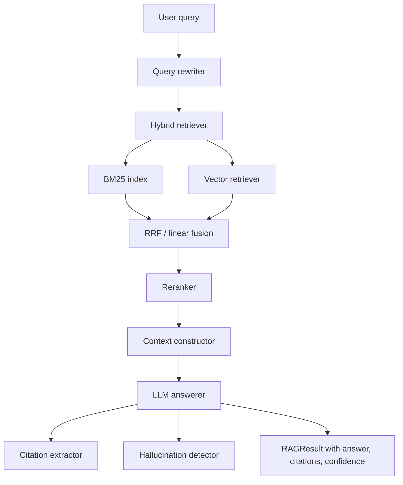

# Advanced RAG

A from-scratch Retrieval-Augmented Generation library implementing the full advanced-RAG
pipeline: query rewriting, hybrid (BM25 + dense vector) retrieval with rank fusion,
neural reranking, context construction, and grounded answer generation with citations and
hallucination checks. The retrieval and ranking algorithms are implemented directly in
Python; LLM-dependent stages degrade gracefully to deterministic rule-based fallbacks so the
whole pipeline runs with no external services.

## Features

- **Hybrid retrieval** — combines a self-contained BM25 lexical index (`BM25Index`) and dense
  vector search (`VectorRetriever`) and fuses the two with Reciprocal Rank Fusion or weighted
  linear combination (`HybridRetriever`).
- **Query rewriting** — pluggable rewriters: rule-based acronym/pattern expansion
  (`RuleBasedRewriter`), LLM-driven intent detection plus expansion and decomposition
  (`LLMQueryRewriter`), and a combined `HybridQueryRewriter`.
- **Multi-hop retrieval** — iterative search that generates follow-up queries to fill
  information gaps for complex questions (`MultiHopRetriever`).
- **Neural reranking** — cross-encoder reranking (`CrossEncoderReranker`), LLM relevance
  scoring (`SLMReranker`), and a `MultiStageReranker` with MMR diversity filtering.
- **Context construction** — semantic deduplication, extractive or LLM compression, and
  token-budgeted assembly (`ContextConstructor`, `LLMCompressor`, `SemanticDeduplicator`).
- **Grounded generation** — answer generation with inline citation extraction
  (`CitationExtractor`), hallucination detection (`HallucinationDetector`), and a composite
  confidence score (`LLMAnswerer`).
- **Evaluation suite** — retrieval metrics (recall@k, precision@k, MRR, nDCG@k) and
  answer/context metrics with bootstrap confidence intervals (`RAGEvaluator`), plus an A/B
  testing framework with t-test significance analysis (`ABTestManager`).
- **Enterprise plumbing** — per-tenant configuration (`TenantConfig`,
  `TenantConfigManager`) and pluggable component registries (`RerankerRegistry`).
- **Utilities** — multi-level LRU/TTL caching (`RAGCacheManager`), Prometheus-or-mock metrics
  (`MetricsCollector`), and async batch processing (`BatchProcessor`, `parallel_map`).
- **FastAPI service** — REST endpoints for query, search, indexing, deletion, stats, and
  health (`advancedrag.api.main`).

## Architecture



| Component | Module | Responsibility |
|-----------|--------|----------------|
| Pipeline | `pipeline.py` | Orchestrates rewrite to retrieve to rerank to construct to generate |
| BM25 index | `retrieval/bm25.py` | Lexical scoring over an inverted index |
| Vector retriever | `retrieval/vector.py` | Cosine similarity over an in-memory store |
| Hybrid retriever | `retrieval/hybrid.py` | Runs both retrievers and fuses results |
| Multi-hop retriever | `retrieval/multi_hop.py` | Iterative follow-up retrieval |
| Query rewriter | `query/rewriter.py` | Rule-based, LLM, and hybrid query rewriting |
| Reranker | `reranking/reranker.py` | Cross-encoder, SLM, and multi-stage MMR reranking |
| Context constructor | `context/constructor.py` | Dedup, compress, token-budget assembly |
| Answerer | `generation/answerer.py` | Generation, citations, hallucination, confidence |
| Evaluation | `evaluation/` | Metrics, reports, and A/B testing |
| Enterprise | `enterprise/` | Tenant config and component registries |
| Utils | `utils/` | Caching, monitoring, batching |
| API | `api/main.py` | FastAPI REST service |

## Quick Start

### Prerequisites

- Python 3.9+
- No external services required to run the library or its tests. Optional extras
  (`ml`, `vectordb`, `llm`, `api`, `cache`, `observability`) pull in heavier dependencies.

### Installation

```bash
pip install -e ".[dev]"        # core + test tooling
pip install -e ".[full]"       # all optional extras
```

### Running

```bash
# Run the FastAPI service (requires the `api` extra)
uvicorn advancedrag.api.main:app --reload
# -> http://localhost:8000  (health at /health, docs at /docs)
```

### Security & limits

Three cross-cutting protections are opt-in via environment variables (stdlib only,
no extra dependencies). All default to a safe, dev-friendly posture:

| Env var | Default | Behavior |
|---------|---------|----------|
| `API_KEYS` | *(unset)* | Comma-separated valid keys. Unset/empty **disables auth** (a startup warning is logged). When set, requests need `Authorization: Bearer <key>` or `X-API-Key: <key>`; missing/invalid returns 401. |
| `RATE_LIMIT_PER_MINUTE` | `120` | Per-caller sliding-window limit (keyed by API key, else client IP). `0` disables. Over-limit returns 429 with `Retry-After`. |
| `REQUEST_TIMEOUT_SECONDS` | `30` | Per-request timeout. `0` disables. On timeout returns 504 JSON. |

Health/readiness/root and docs (`/docs`, `/redoc`, `/openapi.json`) stay open regardless.

```bash
API_KEYS=my-secret-key uvicorn advancedrag.api.main:app
curl -H "Authorization: Bearer my-secret-key" \
     -H "Content-Type: application/json" \
     -d '{"query": "What is Python?"}' \
     http://localhost:8000/v1/query
```

## Usage

The default pipeline runs entirely in process with mock embeddings, an in-memory vector
store, a mock reranker, and rule-based query rewriting:

```python
import asyncio
from advancedrag import create_pipeline, Document

pipeline = create_pipeline()

pipeline.add_documents([
    Document(id="d1", content="Paris is the capital of France.", metadata={"title": "France"}),
    Document(id="d2", content="Berlin is the capital of Germany.", metadata={"title": "Germany"}),
])

async def main():
    result = await pipeline.execute("What is the capital of France?", top_k=2)
    print(result.answer.answer)
    print("confidence:", result.answer.confidence)
    for c in result.answer.citations:
        print(f"  [{c.source_id}] {c.quoted_text}")
    print(f"latency: {result.latency_ms:.1f} ms")

asyncio.run(main())
```

Swap in real components by passing them to `create_pipeline`:

```python
from advancedrag import (
    create_pipeline, SentenceTransformerEmbedding,
    SimpleVectorStore, CrossEncoderReranker,
)

pipeline = create_pipeline(
    embedding_model=SentenceTransformerEmbedding("BAAI/bge-small-en-v1.5"),  # needs `ml` extra
    vector_store=SimpleVectorStore(),
    reranker=CrossEncoderReranker("cross-encoder/ms-marco-MiniLM-L-6-v2"),   # needs `ml` extra
    llm_client=my_async_llm_client,  # any object with `async generate(prompt) -> str`
)
```

## What's Real vs Simulated

- **Real:** BM25 indexing and scoring, cosine vector search over `SimpleVectorStore`, RRF and
  linear fusion, rule-based query rewriting, multi-hop merge/dedup logic, MMR diversity,
  context dedup/compression/assembly, citation extraction, rule-based hallucination checks,
  confidence scoring, all evaluation metrics and bootstrap CIs, A/B t-test analysis, caching,
  metrics, batching, and the FastAPI endpoints. These run with no external services and are
  covered by the test suite. The API ships opt-in production hardening (API-key auth,
  in-process rate limiting, request timeouts) that is **disabled by default** — see
  [Security & limits](#security--limits) — so the quick-start and tests need no credentials.
- **Simulated / requires credentials:** The default `MockEmbedding` produces deterministic
  random vectors and `MockReranker` passes results through unchanged — both are for testing.
  LLM-dependent stages (`LLMQueryRewriter`, `SLMReranker`, LLM compression, LLM-based
  hallucination verification, answer generation) require you to supply an async LLM client;
  without one the pipeline returns a templated mock answer. If `SLMReranker` cannot parse
  the LLM's score JSON it logs a warning and falls back to neutral relevance scores, marking
  each result with `fallback: true` in its features. `SentenceTransformerEmbedding` and
  `CrossEncoderReranker` require the `ml` extra (PyTorch + sentence-transformers).
- **Not implemented in code:** The `vectordb` extra, `.env.example`, and `docker-compose.yml`
  reference ChromaDB, Qdrant, Pinecone, Weaviate, and Redis, but the library ships only the
  in-memory `SimpleVectorStore`; those backends have no adapter code here.

## Testing

```bash
pip install -e ".[dev]"
pytest tests/ -v
```

The suite has 267 tests across 11 files covering retrieval, fusion, reranking, query
rewriting, multi-hop, context construction, generation, evaluation, enterprise config, the
API, and utilities. Tests run fully in process with no external services; LLM-dependent paths
are exercised with mock clients.

## Project Structure

```
26-advanced-rag/
  README.md                       # This file
  pyproject.toml                  # Package metadata and optional extras
  docker-compose.yml              # Optional Redis/vector-store services (no adapter code)
  src/advancedrag/
    schemas.py                    # Core dataclasses (Document, RAGResult, ...)
    pipeline.py                   # RAGPipeline orchestration + create_pipeline factory
    retrieval/                    # bm25, vector, hybrid, multi_hop
    query/rewriter.py             # Rule-based / LLM / hybrid rewriters
    reranking/reranker.py         # Cross-encoder, SLM, multi-stage rerankers
    context/constructor.py        # Dedup, compression, assembly
    generation/answerer.py        # Answer, citations, hallucination detection
    evaluation/                   # evaluator (metrics) + ab_testing
    enterprise/                   # tenant config + component registries
    utils/                        # cache, monitoring, batch
    api/main.py                   # FastAPI app
  tests/                          # 267 tests across 11 files
  docs/
    BLUEPRINT.md                  # Full architecture and design
    SETUP.md                      # Environment setup
```

## License

MIT — see [LICENSE](../LICENSE)
