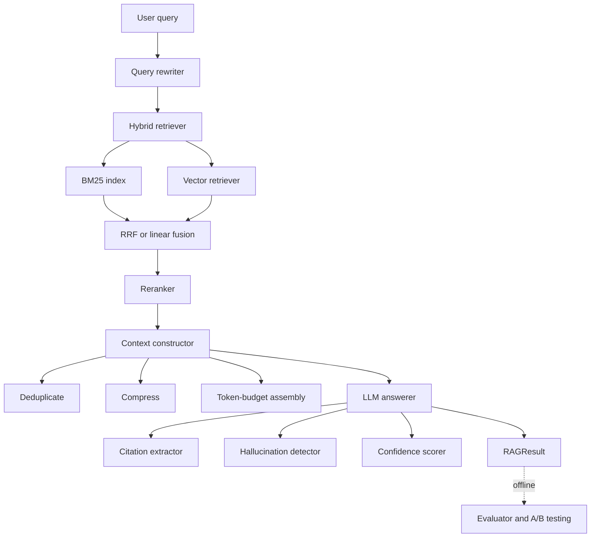

# Advanced RAG

## Overview

Advanced RAG is a from-scratch implementation of a modern Retrieval-Augmented Generation
pipeline. It takes a user query and walks it through six stages — query rewriting, hybrid
retrieval, neural reranking, context construction, grounded generation, and (offline)
evaluation — returning an answer with inline citations, a confidence score, and hallucination
flags.

The goal is pedagogical and self-contained. Every retrieval and ranking algorithm — BM25
scoring, dense cosine search, Reciprocal Rank Fusion, weighted linear fusion, MMR diversity,
multi-hop merging, citation parsing, and the full evaluation metric set — is implemented
directly in Python with no reliance on a search engine or vector database service. Stages that
genuinely need a large language model (LLM query rewriting, SLM reranking, abstractive
compression, claim verification, answer generation) accept an injected async LLM client and
fall back to deterministic rule-based behaviour when none is supplied. As a result the entire
pipeline runs in process, deterministically, with no external dependencies — which is exactly
what makes it testable.

Concepts this project teaches:

- **Lexical vs. dense retrieval** and why hybrid systems fuse both signals.
- **Rank fusion** — RRF (rank-based, scale-free) vs. linear combination (score-based,
  normalization-dependent).
- **Multi-stage reranking** — cheap coarse ranking followed by expensive fine ranking, then a
  diversity pass.
- **Context engineering** — deduplication, compression, and packing documents into a token
  budget.
- **Grounded generation** — citation extraction, hallucination detection, and confidence
  calibration.
- **RAG evaluation** — retrieval metrics (recall, precision, MRR, nDCG), answer/context
  proxy metrics, bootstrap confidence intervals, and A/B significance testing.

Scope: this is a library plus a thin FastAPI service. It is not a hosted product; persistence
is in-memory, and the default embedding/reranker components are mocks intended for tests and
demonstrations.

## Architecture



The system is organized as a set of independent, composable components wired together by
`RAGPipeline`. Each stage consumes the output of the previous one through a small set of
dataclasses defined in `schemas.py`, so any component can be swapped for an alternative
implementation (or a mock) without touching the others.

- **Query layer** (`query/`) normalizes and enriches the query before retrieval.
- **Retrieval layer** (`retrieval/`) finds candidate documents using lexical and dense
  signals and fuses them; a multi-hop variant iterates for complex queries.
- **Reranking layer** (`reranking/`) re-scores candidates with stronger but slower models and
  optionally enforces diversity.
- **Context layer** (`context/`) turns the surviving documents into a single bounded string.
- **Generation layer** (`generation/`) produces the answer and attaches provenance and quality
  signals.
- **Evaluation layer** (`evaluation/`) is offline tooling for measuring and comparing
  configurations.
- **Enterprise and utils** (`enterprise/`, `utils/`) provide tenant configuration, plugin
  registries, caching, metrics, and batching.
- **API** (`api/`) exposes the pipeline over HTTP.

The data contract between stages is intentionally narrow. The query layer emits a
`RewrittenQuery`; the retrieval layer emits `list[RetrievalResult]`; reranking transforms those
into `list[RerankResult]` (recording both the original and new rank so reordering is auditable);
context construction collapses the surviving documents into a single `ConstructedContext`; and
generation produces a `GeneratedAnswer`. The pipeline finally bundles everything — including the
intermediate retrieval and rerank lists and an end-to-end `latency_ms` — into a `RAGResult`, so a
caller can inspect not just the answer but every decision that led to it. This transparency is
what makes the evaluation layer possible: metrics read `result.retrieval_results` and
`result.answer` directly off the same objects the pipeline produced at serving time, so offline
evaluation measures exactly what production returns.

## Core Components

### Pipeline orchestration (`pipeline.py`)

`RAGPipeline` holds a retriever, a reranker, an optional query rewriter (defaulting to
`RuleBasedRewriter`), an optional LLM client, and a config dict (`top_k_retrieval`,
`top_k_rerank`, `max_context_tokens`). Its `execute` coroutine runs the pipeline:

1. **Rewrite** (optional): rewrite the query; the rewritten form is used for search while the
   *original* query is used for reranking (reranking against the user's true intent).
2. **Retrieve**: call `retriever.search` with `top_k_retrieval`.
3. **Rerank**: call `reranker.rerank` with `top_k_rerank`, passing the original query.
4. **Construct context**: assemble the top-`top_k` reranked documents into a
   `ConstructedContext`.
5. **Generate**: if an LLM client is present, generate a cited answer; otherwise return a
   templated mock answer so the pipeline always produces a `RAGResult`.

```python
async def execute(self, query, top_k=5, filter_dict=None, rewrite_query=True) -> RAGResult:
    start = time.time()
    if rewrite_query:
        rewritten = await self.query_rewriter.rewrite(query)
        search_query = rewritten.rewritten
    else:
        rewritten, search_query = None, query

    retrieval_results = self.retriever.search(
        search_query, top_k=self.config["top_k_retrieval"], filter_dict=filter_dict)
    reranked = await self.reranker.rerank(
        query, retrieval_results, top_k=self.config["top_k_rerank"])
    context = self._construct_context(reranked[:top_k])
    answer = await self._generate_answer(query, context) if self.llm else _mock_answer(...)

    return RAGResult(query=query, rewritten_query=rewritten,
                     retrieval_results=retrieval_results[:top_k],
                     reranked_results=reranked[:top_k], context=context,
                     answer=answer, latency_ms=(time.time() - start) * 1000, metadata={...})
```

`create_pipeline` is the factory: it defaults every component to an in-process implementation
(`MockEmbedding`, `SimpleVectorStore`, `MockReranker`, `RuleBasedRewriter`), builds a
`HybridRetriever`, and returns a ready-to-run `RAGPipeline`. `add_documents` and
`delete_documents` delegate to the retriever, which keeps the BM25 and vector indices in sync.

Note: the pipeline's built-in `_construct_context` is a lightweight assembler (it numbers and
concatenates documents). The richer `ContextConstructor` (dedup + compression) lives in
`context/` and is used directly or via custom wiring.

A worked example of the full default flow:

```python
import asyncio
from advancedrag import create_pipeline, Document

pipeline = create_pipeline()                       # mock embed + in-mem store + mock rerank
pipeline.add_documents([
    Document(id="d1", content="Paris is the capital of France.", metadata={"title": "France"}),
    Document(id="d2", content="The Eiffel Tower is in Paris.",   metadata={"title": "Eiffel"}),
])

async def run():
    result = await pipeline.execute("What is the capital of France?", top_k=2)
    print(result.answer.answer)         # templated mock answer (no LLM client supplied)
    print(result.answer.confidence)     # heuristic confidence score
    print([c.source_id for c in result.answer.citations])
    print(f"{result.latency_ms:.2f} ms")

asyncio.run(run())
```

With no LLM client the rule-based rewriter expands the query, the hybrid retriever fuses BM25 and
(mock) vector hits, the mock reranker passes them through, the context is assembled, and a
templated answer with citations to the top documents is returned — every stage runs, so the
shape of the output matches a fully-wired production pipeline. Supplying `llm_client=...` swaps
the templated answer for a real generated, cited, hallucination-checked response.

### BM25 index (`retrieval/bm25.py`)

`BM25Index` implements Okapi BM25 over an inverted index built in memory. Indexing tokenizes
each document (lowercase, alphanumeric split, stopword removal, single-character drop), records
term frequencies, document lengths, and document frequencies, and populates an inverted index
mapping each term to a list of `(doc_index, term_frequency)` pairs.

Scoring iterates over query terms, looks each up in the inverted index, computes IDF and the
length-normalized term-frequency component, and accumulates per-document scores:

```python
for term in query_terms:
    if term not in self.inverted_index:
        continue
    df = self.doc_freqs[term]
    idf = math.log((self.n_docs - df + 0.5) / (df + 0.5) + 1)
    for doc_idx, tf in self.inverted_index[term]:
        doc_len = self.doc_lens[doc_idx]
        tf_norm = (tf * (self.k1 + 1)) / (
            tf + self.k1 * (1 - self.b + self.b * doc_len / self.avg_doc_len))
        doc_scores[doc_idx] += idf * tf_norm
```

The two parameters control the standard BM25 knobs: `k1` (default 1.5) governs term-frequency
saturation — how quickly additional occurrences of a term stop helping — and `b` (default 0.75)
governs length normalization, penalizing long documents that match a term simply by virtue of
their length. The `+1` inside the IDF logarithm is the BM25+ smoothing variant that keeps IDF
non-negative even for terms appearing in more than half the corpus.

Because the inverted index stores `(doc_index, term_frequency)` pairs per term, scoring is
proportional to the number of postings for the query terms rather than the corpus size: a query
never touches documents that share no terms with it. Average document length (`avg_doc_len`) is
recomputed on every `add_documents` call so the normalization stays correct as the corpus grows.

Deletion is deliberately simple and correct rather than fast: it filters the surviving documents
and rebuilds the entire index, because incrementally patching document frequencies, the inverted
index, and the average-length statistic in place is error-prone. For the in-memory,
demonstration-scale corpora this library targets, an O(n) rebuild on delete is an acceptable
trade for guaranteed consistency.

Metadata filtering is shared in spirit with the vector store: `_match_filter` supports plain
equality (`{"lang": "en"}`) and Mongo-style operators (`$in`, `$eq`, `$ne`, `$gt`, `$gte`,
`$lt`, `$lte`), applied after scoring so the filter narrows an already-ranked candidate set.

### Vector retrieval (`retrieval/vector.py`)

`VectorStore` is an abstract base with `add` / `search` / `delete`. `SimpleVectorStore` is the
only concrete backend: it stores embeddings in a NumPy matrix and computes cosine similarity by
L2-normalizing both the stored matrix and the query vector and taking a dot product. It returns
the top-`k` results with positive similarity and supports the same metadata-filter operators.

Cosine similarity is computed by normalizing every stored vector and the query vector to unit
length and taking a single matrix-vector dot product, so all N similarities fall out of one
NumPy operation:

```python
query_norm = query_embedding / np.linalg.norm(query_embedding)
emb_norms = self.embeddings / np.linalg.norm(self.embeddings, axis=1, keepdims=True)
similarities = np.dot(emb_norms, query_norm)
top_indices = np.argsort(similarities)[-k:][::-1]
```

The abstract `VectorStore` interface (`add` / `search` / `delete`) is the seam where a real
backend (ChromaDB, Qdrant, FAISS) would plug in: any class implementing those three methods can
replace `SimpleVectorStore` without changes elsewhere. The store search returns raw tuples
`(id, content, metadata, score)` rather than `Document` objects, keeping the storage layer
independent of the schema; `VectorRetriever` adapts those tuples into `RetrievalResult`s.

`VectorRetriever` ties an embedding model (a `Protocol` with `dimension` and
`encode(list[str]) -> np.ndarray`) to a store: it embeds documents on `add_documents` and
embeds the query on `search`, returning `RetrievalResult` objects tagged `retriever_type="vector"`.

Two embedding models ship:

- `MockEmbedding` — deterministic random unit vectors seeded by `hash(text)`, with a per-text
  cache. Same text always yields the same vector, so tests are reproducible. Because the vectors
  are random, mock similarity is essentially noise; the mock exists to exercise the *plumbing*
  (shapes, normalization, top-k, filtering), not to produce meaningful rankings.
- `SentenceTransformerEmbedding` — wraps `sentence-transformers` (default
  `BAAI/bge-small-en-v1.5`), encoding with `normalize_embeddings=True` so the store's cosine
  math is consistent. Importing it requires the `ml` extra (PyTorch + sentence-transformers);
  the import is guarded so the dependency is only needed when this class is actually used.

### Hybrid retrieval and fusion (`retrieval/hybrid.py`)

`HybridRetriever` owns a `BM25Index` and a `VectorRetriever` and keeps them in sync on
`add_documents` / `delete`. On `search` it fetches `top_k * 3` candidates from each retriever
and fuses them. Default weights are `bm25_weight=0.4`, `vector_weight=0.6`; `search` accepts an
`alpha` override that maps to the vector weight (`bm25_weight = 1 - alpha`).

**Reciprocal Rank Fusion** scores each document by the weighted sum of `1 / (k + rank + 1)`
across both result lists (`k=60` by default), making it scale-free and robust to differing
score distributions:

```python
rrf_score = weight / (k + result.rank + 1)
doc_scores[doc_id] += rrf_score
```

RRF is the default for a reason: BM25 scores and cosine similarities live on entirely different
scales (an unbounded positive sum versus a value in roughly `[-1, 1]`), so adding them directly
is meaningless. RRF sidesteps this by discarding the scores and using only the *rank* a document
achieved in each list. A document ranked first in both lists scores highest; a document that
appears in only one list still contributes, but less. The constant `k=60` dampens the influence
of top ranks so that, for example, ranks 1 and 2 are not wildly far apart — a value taken from
the original RRF paper.

**Linear combination** min-max normalizes each retriever's scores to `[0, 1]` and takes a
weighted sum:

```python
doc_scores[doc_id] += norm_score * bm25_weight     # then += norm_score * vector_weight
```

This preserves *score magnitude* — the distance between the top result and the runner-up — which
RRF throws away. It is the better choice when both retrievers produce well-calibrated, comparable
scores, but it is sensitive to outliers because min-max normalization stretches whatever range
the candidate batch happens to have. When every score in a list is equal, normalization returns
`1.0` for all entries rather than dividing by zero. Both strategies merge by document ID so a
document found by both retrievers is scored once with its combined contribution; fused results
are tagged `hybrid_rrf` or `hybrid_linear`. The `fetch_k = top_k * 3` over-fetch gives fusion a
deeper pool than the requested result count, so documents that rank modestly in each list but
appear in both can still surface to the top after fusion.

### Multi-hop retrieval (`retrieval/multi_hop.py`)

`MultiHopRetriever` wraps any retriever and performs up to `max_hops` (default 3) search
rounds. Each hop retrieves for the current query, merges results into the running set
(deduplicating by document ID and keeping the highest score), and checks completeness — here a
simple "do we have at least `top_k` unique documents" test, the natural place to substitute a
richer coverage signal (e.g. an LLM judging whether the question is answerable from what has been
gathered). If incomplete, it generates a follow-up query and continues:

- **With an LLM client**, it prompts the model with the original question, the queries already
  tried, and snippets of what has been retrieved so far, asking for a single follow-up query that
  targets the gap.
- **Without one**, a rule-based heuristic strips stopwords from the original query, keeps the
  first few content terms, and forms `"more details about <terms>"`.

The loop terminates early when a follow-up is empty or repeats a query already used, preventing
cycles. Final results are re-sorted by score, re-ranked, and truncated to `top_k`. The merge step
is the heart of the component: by keeping the maximum score seen per document across all hops, a
document that ranked poorly for the initial query but strongly for a follow-up is promoted
correctly.

### Query rewriting (`query/rewriter.py`)

`QueryRewriter` is an abstract base with `async rewrite(query, context) -> RewrittenQuery`.
Three implementations:

- **`RuleBasedRewriter`** — expands a built-in acronym map (ml, ai, nlp, llm, rag, api, db,
  sql) inline, applies regex query patterns, and infers intent from surface cues ("how to" →
  PROCEDURAL, "difference"/" vs " → COMPARISON, "what is"/"explain" → CLARIFICATION, else
  FACTUAL). Deterministic, no LLM, confidence `0.6`.
- **`LLMQueryRewriter`** — uses an async LLM client to detect intent, generate up to three
  expansions, decompose COMPARISON/PROCEDURAL queries into sub-queries, and produce a
  retrieval-optimized rewrite. Falls back to `FACTUAL` if intent parsing fails.
- **`HybridQueryRewriter`** — applies the rule-based pass first, then enhances the result with
  the LLM rewriter, keeping the maximum confidence.

Concrete rule-based rewrites:

| Input | Rewritten / intent |
|-------|--------------------|
| `What is RAG?` | `what is rag (retrieval augmented generation)?` · CLARIFICATION |
| `How to deploy a model?` | acronym-expanded, intent PROCEDURAL |
| `Difference between ML and AI` | `ml`/`ai` expanded, intent COMPARISON |

The `RewrittenQuery` carries not just the rewritten string but the detected intent, expansions,
and sub-queries, so downstream stages (or a multi-hop retriever) can use the decomposition. A
`MockLLMClient` is included so the LLM rewriter can be exercised in tests without a real
provider: it pattern-matches the prompt and returns canned intent/expansion/decomposition
responses, which is enough to validate the parsing and orchestration logic.

### Reranking (`reranking/reranker.py`)

`BaseReranker` defines `async rerank(query, candidates, top_k) -> list[RerankResult]`.
Implementations:

- **`CrossEncoderReranker`** — scores `(query, document)` pairs with a sentence-transformers
  `CrossEncoder` (default `cross-encoder/ms-marco-MiniLM-L-6-v2`), sorts by score. Requires the
  `ml` extra.
- **`SLMReranker`** — batches candidates, prompts an LLM to score relevance 0–10, parses a JSON
  array (falling back to a default score on parse failure), and sorts by relevance.
- **`MultiStageReranker`** — runs a fast stage-1 reranker (top `stage1_top_k`, default 50),
  optionally a finer stage-2 reranker, then applies MMR diversity. The output of stage 1 is
  converted back into `RetrievalResult`s before being fed to stage 2, so each stage sees a
  uniform input type. The design mirrors production reranking economics: a cheap model prunes
  the candidate set, the expensive model only ever scores the survivors, and a final diversity
  pass removes near-duplicates.
- **`MockReranker`** — passes candidates through unchanged with their retrieval scores; the
  default for the factory pipeline and tests.

MMR (Maximal Marginal Relevance) is the diversity mechanism inside `MultiStageReranker`. It
builds the result list greedily: the first slot goes to the highest-relevance document, and each
subsequent slot maximizes a blend of relevance and dissimilarity to everything already chosen:

```python
best = max(remaining, key=lambda x: (
    self.diversity_lambda * x.relevance_score
    - (1 - self.diversity_lambda) * self._max_similarity(x, selected)))
```

`diversity_lambda` (default 0.7) tilts the balance: 1.0 reduces MMR to pure relevance ranking,
while lower values aggressively penalize redundancy. Similarity here is a cheap word-overlap
ratio between document contents (`overlap / max(len(a), len(b))`), not an embedding distance —
adequate for filtering obvious near-duplicates without a second embedding pass.

### Context construction (`context/constructor.py`)

`ContextConstructor` turns reranked documents into a single bounded context string in three
steps: deduplicate, compress each surviving document, then assemble within `max_tokens`
(default 4000). It reports a `compression_ratio` (final vs. original token estimate) and
metadata (original count, used count, dedup removed). Token counts are word-based estimates.

- **`SemanticDeduplicator`** — drops documents whose Jaccard word-overlap (`|A ∩ B| / |A ∪ B|`)
  with an already-kept document exceeds `similarity_threshold` (default 0.85). It keeps the first
  occurrence and discards later near-duplicates, which works because the input is already
  relevance-ordered — so the higher-ranked copy survives. The name says "semantic", but the
  implementation is a lexical Jaccard proxy chosen to avoid a second embedding pass; swapping in
  an embedding-based deduplicator would be a drop-in change.
- **`LLMCompressor`** — compresses to roughly `target_ratio` of the original. With an LLM client
  it prompts for an abstractive compression; without one it falls back to *extractive*
  compression, scoring sentences by query-term overlap and keeping the top fraction.
- **Assembly** — packs documents in order, prefixing each with a `[Source N]` marker, and
  truncates the final document to fit the remaining budget (if at least 100 tokens remain).

### Generation (`generation/answerer.py`)

`LLMAnswerer` orchestrates generation: it prompts the LLM to answer using only the provided
sources with inline `[n]` citation markers, extracts structured citations, runs hallucination
detection, and computes a confidence score.

- **`CitationExtractor`** — parses `[n]` markers, maps each to a source document by index,
  finds the sentence in the answer containing the marker as the quoted snippet, and computes a
  relevance score from word overlap between the snippet and the document (boosted, capped at 1).
- **`HallucinationDetector`** — with an LLM, extracts factual claims and verifies each against
  the context ("SUPPORTED" / "NOT SUPPORTED"), returning unsupported claims. Without an LLM it
  falls back to a rule-based check that flags numbers and long quoted strings appearing in the
  answer but not in the sources.
- **Confidence** — a weighted blend of the available quality signals, clamped to `[0, 1]`:

  ```python
  citation_score      = min(len(citations) / 3, 1.0) * 0.4
  relevance_bonus     = mean(c.relevance_score for c in citations) * 0.3
  compression_bonus   = (1 - context.compression_ratio) * 0.1
  hallucination_pen   = len(hallucination_flags) * 0.15
  confidence = clamp(citation_score + relevance_bonus
                     + compression_bonus - hallucination_pen, 0, 1)
  ```

  The intuition: an answer that cites at least three relevant sources, draws on compressed
  (information-dense) context, and triggers no hallucination flags scores high; each unsupported
  claim subtracts a fixed penalty. The formula is a transparent heuristic, not a learned
  calibrator — it is meant to be inspectable and adjustable, and a tenant's
  `min_confidence_threshold` can gate low-confidence answers downstream.

The generation prompt is deliberately strict: it instructs the model to answer *only* from the
provided sources, to cite inline with `[n]`, to say "I don't have information about..." when the
sources are silent, and to surface conflicts rather than paper over them. This prompt shape is
what makes citation extraction and hallucination detection meaningful — they verify that the
model actually followed the grounding contract.

### Evaluation (`evaluation/`)

`RAGEvaluator` registers a default metric set and runs the pipeline (or accepts precomputed
predictions) over a test set, returning an `EvaluationReport` with per-metric
`EvaluationResult`s (value, bootstrap confidence interval, metadata). It can also
`compare_configs` across multiple configurations.

Retrieval metrics: `recall@k`, `precision@k`, `mrr`, `ndcg@k`. Answer/context metrics:
answer length, citation count, confidence, faithfulness (answer–context word overlap),
relevance (answer–query overlap), context precision/recall, and answer correctness
(answer–expected word-overlap F1). All confidence intervals come from a 1000-sample bootstrap.
These metrics are deterministic proxies, not LLM-judged scores.

Each retrieval metric follows the same shape — accumulate a per-query score, then summarize with
a bootstrap interval. `nDCG@k`, for instance, computes a binary-gain DCG against the ideal
ordering of the known-relevant set:

```python
dcg = sum(1 / np.log2(i + 2) for i, r in enumerate(results[:k]) if r.document.id in expected)
ideal_dcg = sum(1 / np.log2(i + 2) for i in range(min(len(expected), k)))
ndcg = dcg / ideal_dcg if ideal_dcg > 0 else 0.0
```

Queries with no labelled relevant documents are skipped rather than counted as perfect or zero,
so the metric reflects only the answerable portion of the test set. The bootstrap CI resamples
the per-query scores 1000 times with replacement and reports the 2.5th and 97.5th percentiles of
the resampled means, giving a distribution-free 95% interval that does not assume normality.

`ABTestManager` (`evaluation/ab_testing.py`) manages control/treatment experiments: it assigns
users to variants by consistent MD5 hashing of `"{test_id}:{user_id}"` (so a user always lands
in the same arm), records per-request metrics, and on `analyze_test` runs an independent
two-sample t-test (`scipy.stats.ttest_ind`) per metric, reporting control/treatment means and
standard deviations, lift, t-statistic, p-value, and significance at p < 0.05. It then emits a
plain-language recommendation: significant regressions yield "DO NOT SHIP", significant
improvements with no regressions yield "SHIP IT", and otherwise "INCONCLUSIVE — run longer". The
evaluation package imports lazily so the core library does not hard-depend on `scipy`; if it is
absent, the evaluation symbols are simply `None`.

### Enterprise (`enterprise/`)

`TenantConfig` is a dataclass of per-tenant settings (retrieval top-k and weights, fusion
strategy, reranker type and top-k, diversity, LLM model, context budget, citation toggle,
hallucination check, confidence threshold, rate limits). `TenantConfigManager` caches configs
and persists them through a pluggable store (`InMemoryConfigStore` or `RedisConfigStore`).

The two-level design — an in-memory cache in front of a pluggable store — means a hot tenant's
config is served from a dict without touching the backend, while `update_config` writes through
to the store and refreshes the cache so the next read is consistent. `from_dict` / `to_dict`
make the dataclass round-trip cleanly through JSON, which is what the `RedisConfigStore` relies
on. A missing tenant transparently returns a default `TenantConfig`, so callers never have to
special-case first-time tenants.

`registry.py` provides `RerankerRegistry`, `RetrieverRegistry`, and `EmbeddingRegistry` for
name-based component lookup. `RerankerRegistry.register` validates that the class is a
`BaseReranker` subclass before accepting it, `get` constructs a fresh instance with the supplied
kwargs (and raises a helpful "Available: ..." error for unknown names), and `get_cached` keys
instances by name plus a hash of their kwargs so identical configurations are reused rather than
rebuilt. `setup_default_registries` wires up the built-in rerankers (cross-encoder, slm, mock,
multi-stage), retrievers (bm25, vector, hybrid), and embeddings (mock, sentence-transformer).
Together with the abstract base classes throughout the codebase, the registries are the
mechanism for the "pluggable components" goal: a `TenantConfig.reranker_type` string can be
resolved to a concrete reranker at request time.

### Utilities (`utils/`)

- **`cache.py`** — `LRUCache` uses an `OrderedDict` and `move_to_end` so the least-recently-used
  entry is evicted once `max_size` is exceeded; `TTLCache` stores `(value, expiry)` pairs and
  lazily drops expired entries on access plus during a cleanup pass on insert. `RAGCacheManager`
  layers an L1 local `TTLCache` over an optional L2 Redis cache and exposes
  `get_or_compute_embedding`, `get_or_compute_retrieval`, and `get_or_compute_answer`: each
  checks L1, then L2 (populating L1 on an L2 hit), then computes and back-fills both. It tracks
  hit/miss counts and L1/L2 hit breakdown, exposed via `get_stats` with a derived hit rate.
  Embeddings serialize to raw bytes for Redis; retrieval results serialize to JSON; answers stay
  L1-only because they are too variable to share.
- **`monitoring.py`** — Prometheus `Counter`/`Histogram`/`Gauge` metrics for requests, stage
  latencies, result counts, confidence, citations, hallucinations, cache, and errors. If
  `prometheus_client` is missing, drop-in mock classes preserve the API. `MetricsCollector`
  exposes context managers (`track_request`, `track_retrieval`, ...) and recorders.
- **`batch.py`** — `BatchProcessor.process` splits items into fixed-size batches and runs them
  concurrently under a semaphore, flattening results in order. `process_with_index` tags each
  item with its index so results can be reassembled deterministically even when they complete out
  of order. `AsyncBatcher` accumulates submitted items and fires the batch either when it reaches
  the target size or after a timeout, resolving a per-item `asyncio.Future` with that item's
  result — the building block behind `EmbeddingBatcher`, which coalesces many `embed(text)` calls
  into a few model invocations. `parallel_map` is the simple workhorse: apply an async function
  across a list with a concurrency cap.

These cross-cutting utilities embody a recurring theme in the codebase: graceful degradation.
The monitoring metrics fall back to mock classes without `prometheus_client`; the evaluation
package degrades to `None` symbols without `scipy`; the embedding and reranker imports are
guarded so the heavy `ml` extra is only required when those classes are instantiated; and every
LLM-dependent stage has a deterministic non-LLM path. The result is a library whose core runs
with three lightweight dependencies (`numpy`, `pydantic`, `python-dotenv`) and whose richer
capabilities are opt-in.

### API (`api/main.py`)

`create_app` builds a FastAPI app with CORS, instantiates a default pipeline via
`create_pipeline`, and stores it in app state. Endpoints are listed under API Design.

## Data Structures

All cross-stage types are plain dataclasses in `schemas.py`.

```python
class QueryIntent(Enum):
    FACTUAL = "factual"
    COMPARISON = "comparison"
    PROCEDURAL = "procedural"
    EXPLORATORY = "exploratory"
    CLARIFICATION = "clarification"

@dataclass
class Document:
    id: str
    content: str
    metadata: dict = field(default_factory=dict)
    embedding: Optional[list] = None

@dataclass
class RetrievalResult:
    document: Document
    score: float
    retriever_type: str          # bm25 | vector | hybrid_rrf | hybrid_linear
    rank: int

@dataclass
class RerankResult:
    document: Document
    original_rank: int
    new_rank: int
    relevance_score: float
    features: dict = field(default_factory=dict)

@dataclass
class RewrittenQuery:
    original: str
    rewritten: str
    intent: QueryIntent
    expansions: list[str]
    sub_queries: list[str]
    confidence: float
    metadata: dict = field(default_factory=dict)

@dataclass
class Citation:
    source_id: str
    source_title: str
    quoted_text: str
    relevance_score: float

@dataclass
class ConstructedContext:
    content: str
    source_documents: list[Document]
    compression_ratio: float
    token_count: int
    metadata: dict = field(default_factory=dict)

@dataclass
class GeneratedAnswer:
    answer: str
    citations: list[Citation]
    confidence: float
    hallucination_flags: list[str]
    metadata: dict = field(default_factory=dict)

@dataclass
class RAGResult:
    query: str
    rewritten_query: Optional[RewrittenQuery]
    retrieval_results: list[RetrievalResult]
    reranked_results: list[RerankResult]
    context: ConstructedContext
    answer: GeneratedAnswer
    latency_ms: float
    metadata: dict = field(default_factory=dict)
```

`generate_id(content)` returns a deterministic 16-character SHA-256 prefix, used by the index
endpoint to assign IDs when callers omit them. Several dataclasses provide `to_dict` for JSON
serialization in the API and A/B store.

### Tenant configuration

```python
@dataclass
class TenantConfig:
    tenant_id: str
    retrieval_top_k: int = 100
    bm25_weight: float = 0.4
    vector_weight: float = 0.6
    fusion_strategy: str = "rrf"          # rrf | linear
    reranker_type: str = "cross-encoder"  # cross-encoder | slm | mock
    reranking_top_k: int = 10
    use_diversity_filter: bool = True
    diversity_lambda: float = 0.7
    llm_model: str = "gpt-4"
    max_context_tokens: int = 4000
    include_citations: bool = True
    hallucination_check: bool = True
    min_confidence_threshold: float = 0.3
    requests_per_minute: int = 100
    max_concurrent: int = 10
```

## API Design

### Python API

```python
# Factory and pipeline
create_pipeline(embedding_model=None, vector_store=None, reranker=None,
                query_rewriter=None, llm_client=None, config=None) -> RAGPipeline
RAGPipeline.execute(query, top_k=5, filter_dict=None, rewrite_query=True) -> RAGResult  # async
RAGPipeline.add_documents(documents: list[Document]) -> None
RAGPipeline.delete_documents(doc_ids: list[str]) -> None

# Retrieval
BM25Index(k1=1.5, b=0.75).add_documents(docs); .search(query, top_k, filter_dict)
SimpleVectorStore().add(ids, embeddings, documents, metadatas); .search(query_embedding, k)
HybridRetriever(embedding_model, vector_store, bm25_weight=0.4, vector_weight=0.6,
                fusion_strategy="rrf").search(query, top_k, filter_dict, alpha=None)
MultiHopRetriever(retriever, llm_client=None, max_hops=3).retrieve(query, top_k)  # async

# Query / rerank / context / generation (all rerank/generate calls are async)
RuleBasedRewriter().rewrite(query)
LLMQueryRewriter(llm_client).rewrite(query)
CrossEncoderReranker(model_name).rerank(query, candidates, top_k)
MultiStageReranker(stage1, stage2=None, stage1_top_k=50, diversity_lambda=0.7).rerank(...)
ContextConstructor(max_tokens=4000).construct(query, reranked_results)
LLMAnswerer(llm_client).generate(query, context)

# Evaluation / enterprise
RAGEvaluator(pipeline).evaluate(test_set, metrics=None)  # async
ABTestManager().create_test(name, control_config, treatment_config, traffic_split=0.5)  # async
TenantConfigManager().get_config(tenant_id); .update_config(tenant_id, updates)  # async
```

An LLM client is any object exposing `async generate(prompt: str) -> str`.

### REST API (`advancedrag.api.main`)

| Method | Path | Body / params | Returns |
|--------|------|---------------|---------|
| GET | `/health` | — | status, version, documents_indexed |
| POST | `/v1/query` | query, top_k (1–20), filter, rewrite_query, include_citations | answer, citations, confidence, latency_ms |
| POST | `/v1/search` | query, top_k (1–100), filter | reranked results (no generation), latency_ms |
| POST | `/v1/index` | documents (list of dicts with content, optional id/metadata) | indexed count, errors |
| DELETE | `/v1/documents/{doc_id}` | path id | status, id |
| GET | `/v1/stats` | — | documents_indexed, config |

Request validation uses Pydantic models: `QueryRequest` enforces query length 1–1000 and
`top_k` bounds; `SearchRequest`, `IndexRequest`, and the response models mirror the dataclasses.
The index endpoint assigns a deterministic ID via `generate_id` when one is not provided.

A typical query exchange:

```http
POST /v1/query
{ "query": "What is the capital of France?", "top_k": 3, "include_citations": true }
```

```json
{
  "answer": "Based on the retrieved documents, ...",
  "citations": [
    { "source_id": "d1", "title": "France", "excerpt": "Paris is the capital of France.",
      "relevance": 0.92 }
  ],
  "confidence": 0.8,
  "latency_ms": 4.1
}
```

`/v1/search` skips generation entirely, returning the reranked documents (each serialized via
`RerankResult.to_dict`) so callers can build their own context or simply use the system as a
retriever. Indexing accepts raw dicts and routes them through `pipeline.add_documents`, which
fans out to both the BM25 and vector indices; errors per document are collected rather than
aborting the whole batch. CORS is wide-open by default (`allow_origins=["*"]`), suitable for a
local demo but intended to be tightened for any real deployment.

## Performance

The implementation favors clarity and testability over raw throughput; figures below describe
algorithmic behaviour, not measured benchmarks.

- **BM25** uses an inverted index, so query scoring touches only documents containing a query
  term rather than the full corpus. Indexing is linear in total token count. Deletion is O(n)
  because it rebuilds the index to keep statistics consistent.
- **Vector search** in `SimpleVectorStore` is a dense matrix multiply: O(N · d) per query for N
  documents of dimension d, plus an O(N log N) top-k sort. It is exact (no ANN), which is fine
  for the in-memory, demonstration-scale corpora this library targets.
- **Hybrid retrieval** fetches `top_k * 3` from each retriever before fusion to give the fusion
  step a deeper candidate pool than the requested result count.
- **Reranking** is the typical bottleneck in production; the `MultiStageReranker` design exists
  precisely to apply the expensive model to a pruned stage-1 shortlist (default top 50) rather
  than the full candidate set.
- **Caching** (`RAGCacheManager`) provides a two-level (local TTL + optional Redis) cache for
  embeddings, retrieval results, and answers to avoid recomputation, with hit-rate tracking.
- **Batching** (`BatchProcessor`, `parallel_map`) bounds concurrency with a semaphore so
  embedding and scoring work can be parallelized without unbounded fan-out.
- `RAGResult` carries `latency_ms` measured end-to-end in `execute`, and `MetricsCollector`
  exposes per-stage latency histograms for observability.

For observability beyond the single end-to-end number, `monitoring.py` defines a histogram per
stage — `rag_retrieval_latency_seconds`, `rag_reranking_latency_seconds`,
`rag_generation_latency_seconds`, and an overall `rag_request_latency_seconds` keyed by stage —
plus counters and gauges for request volume, retrieval result counts, confidence scores, citation
counts, detected hallucinations, cache hit rate, and errors. The `MetricsCollector` context
managers (`track_request`, `track_retrieval`, `track_reranking`, `track_generation`) wrap each
stage so latency is recorded automatically, and the request-level manager increments an
active-request gauge on entry and decrements it on exit even when an exception propagates. Because
the metric definitions fall back to no-op mock classes when `prometheus_client` is absent, code
can be instrumented unconditionally and the dependency stays optional.

The default pipeline (`MockEmbedding` + `MockReranker`) runs in well under a millisecond on
small corpora, which is what keeps the 267-test suite fast.

## Testing Strategy

The suite contains 267 tests across 11 files and runs entirely in process — no network, vector
database, model download, or LLM API call — by leaning on the mock components
(`MockEmbedding`, `MockReranker`, `MockLLMClient`) and `unittest.mock.AsyncMock`. `pytest` runs
in `asyncio_mode = "auto"` so async tests need no per-test decoration boilerplate.

Coverage by area:

- **Retrieval** (`test_retrieval.py`, 51 tests) — BM25 scoring and ranking, tokenization and
  stopwords, metadata filter operators, vector cosine search, hybrid RRF and linear fusion,
  weight/alpha behaviour, add/delete consistency across both indices.
- **Query** (`test_query.py`, 44 tests) — acronym and pattern expansion, intent inference, LLM
  expansion/decomposition with mock clients, hybrid rewriting.
- **Reranking** (`test_reranking.py`, 22 tests) — score ordering, top-k truncation, multi-stage
  flow, MMR diversity, mock pass-through.
- **Evaluation** (`test_evaluation.py`, 53 tests) — every retrieval and answer metric, edge
  cases (empty inputs, missing expected docs), bootstrap CI shape, and A/B test assignment,
  recording, and t-test analysis.
- **Context** (`test_context.py`, 12 tests) — deduplication threshold, extractive compression,
  token-budget assembly and truncation.
- **Generation** (`test_generation.py`, 12 tests) — citation parsing and relevance, rule-based
  and LLM hallucination detection, confidence math.
- **Multi-hop** (`test_multi_hop.py`, 8 tests) — hop iteration, merge/dedup, rule-based and LLM
  follow-up generation, termination conditions.
- **Pipeline** (`test_pipeline.py`, 8 tests) — end-to-end execution, no-rewrite path, LLM
  generation path, add/delete, empty-corpus behaviour, factory defaults and overrides.
- **Enterprise** (`test_enterprise.py`, 10 tests) — tenant config CRUD and caching, registry
  registration/lookup/validation.
- **API** (`test_api.py`, 13 tests) — endpoints exercised through FastAPI's `TestClient`.
- **Utils** (`test_utils.py`, 34 tests) — LRU/TTL eviction and expiry, cache manager stats,
  batch processing, and metrics recording.

Edge cases are exercised throughout: empty corpora and queries, single-document dedup,
zero-overlap similarity, parse failures in LLM responses, missing optional dependencies
(scipy, prometheus), and bounds on Pydantic request fields.

## References

- Robertson and Zaragoza, *The Probabilistic Relevance Framework: BM25 and Beyond* (2009).
- Cormack, Clarke, and Buettcher, *Reciprocal Rank Fusion Outperforms Condorcet and Individual
  Rank Learning Methods* (SIGIR 2009).
- Carbonell and Goldstein, *The Use of MMR for Reordering Documents and Producing Summaries*
  (SIGIR 1998).
- Nogueira and Cho, *Passage Re-ranking with BERT* (2019) — cross-encoder reranking.
- Es et al., *RAGAS: Automated Evaluation of Retrieval Augmented Generation* (2023) — the
  faithfulness / answer-relevance / context-precision-recall metric vocabulary.
- Reimers and Gurevych, *Sentence-BERT* (EMNLP 2019) — bi-encoder and cross-encoder models.
- Lewis et al., *Retrieval-Augmented Generation for Knowledge-Intensive NLP Tasks* (2020) — the
  retrieve-then-generate formulation this pipeline elaborates on.
- Efron and Tibshirani, *An Introduction to the Bootstrap* (1993) — the resampling method behind
  the evaluation confidence intervals.
