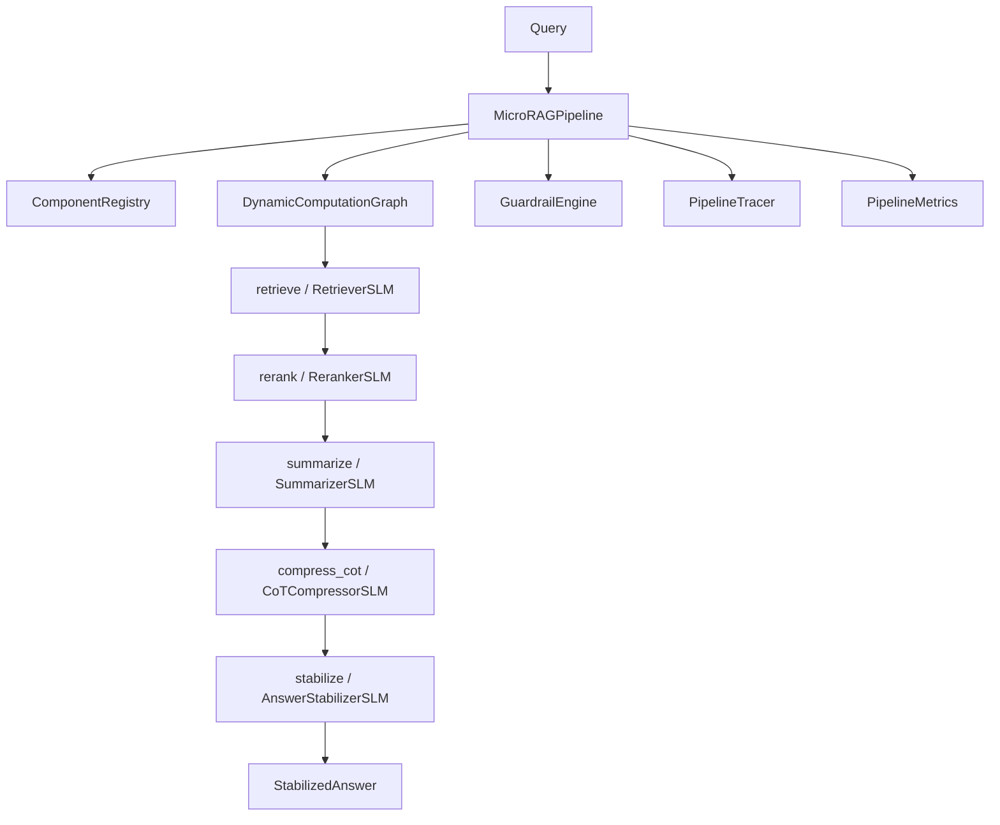

# Micro-Model Orchestrated RAG

A retrieval-augmented generation system where every pipeline stage is powered by a
specialized Small Language Model (SLM), wired together by a dynamic computation graph.
The orchestrator, graph executor, registry, guardrails, tracing, and metrics are all
built from scratch in the `microrag` package; the SLMs themselves wrap Hugging Face
models loaded through `transformers` and `sentence-transformers`.

## Features

- **Specialized SLM pipeline** — seven task-specific models for chunking, embedding,
  retrieval, reranking, summarization, chain-of-thought compression, and answer
  stabilization (`ChunkerSLM`, `EmbedderSLM`, `RetrieverSLM`, `RerankerSLM`,
  `SummarizerSLM`, `CoTCompressorSLM`, `AnswerStabilizerSLM`).
- **Dynamic computation graph** — nodes with declared dependencies executed in
  topological order, with per-node fallback and merge support (`DynamicComputationGraph`,
  `GraphBuilder`).
- **Component registry** — name-based resolution of pipeline components, with an
  SLM-specialized registry that filters by task (`ComponentRegistry`, `SLMRegistry`).
- **Guardrail engine** — pluggable rules applied per stage with pass/warn/block actions
  (`GuardrailEngine`, `RelevanceGuardrail`, `ConfidenceGuardrail`, `HallucinationGuardrail`,
  `LengthGuardrail`).
- **Per-step tracing** — span-based tracing with console, JSON, and in-memory exporters
  (`PipelineTracer`, `InMemoryExporter`, `JSONExporter`).
- **Quality and latency metrics** — running aggregates with mean/std/p50/p95 per stage
  (`PipelineMetrics`, `QualityMetricsCollector`).
- **Model selection** — quality/latency-balanced selection plus fallback chains
  (`ModelSelector`, `FallbackChain`, `PerformanceTracker`).
- **Mock-backed test mode** — every SLM has a `Mock*` variant so the full pipeline runs
  with no model downloads (`use_mock=True`).
- **FAISS dense retrieval** — `RetrieverSLM` builds a `faiss.IndexFlatIP` over normalized
  embeddings for cosine similarity search.

## Architecture



| Component | Module | Responsibility |
|-----------|--------|----------------|
| Pipeline | `microrag.pipeline` | Builds registry and graph, runs query/index, applies guardrails |
| Computation graph | `microrag.orchestrator.graph` | Topological execution, fallback, merge nodes |
| Registry | `microrag.orchestrator.registry` | Name-based component resolution, task filtering |
| Tracing | `microrag.orchestrator.tracing` | Span lifecycle and exporters |
| SLM components | `microrag.slm` | Seven task-specific models plus mocks |
| Guardrails | `microrag.enterprise.guardrails` | Per-stage rule evaluation |
| Metrics | `microrag.enterprise.metrics` | Latency/quality aggregation |
| Selection | `microrag.enterprise.selector` | Model selection and fallback chains |
| Schemas | `microrag.schemas` | Dataclasses shared across the package |

## Quick Start

### Prerequisites

- Python 3.9+
- No external services are needed to run the test suite or the mock pipeline. The real
  SLM pipeline requires the `ml` extras (`torch`, `transformers`, `sentence-transformers`)
  and downloads models from Hugging Face on first use.

### Installation

```bash
# Schemas + orchestrator only (no model dependencies)
pip install -e .

# Add the ML stack to run real SLMs
pip install -e ".[ml]"

# Everything (ML, vector DBs, LLM fallback, observability, dev tools)
pip install -e ".[full]"
```

### Running

```bash
# Optional: start ChromaDB for vector storage
docker-compose up -d   # ChromaDB at http://localhost:8000
```

## Usage

The public entry point is `create_pipeline` / `MicroRAGPipeline`. With `use_mock=True`
the full graph runs without downloading any models.

```python
import asyncio
from microrag import create_pipeline

# Mock pipeline: no model downloads, runs the full computation graph
pipeline = create_pipeline(use_mock=True, use_guardrails=True)


async def main():
    answer = await pipeline.query("What is machine learning and how does it work?")
    print(answer.answer)         # final text
    print(answer.confidence)     # 0.0 - 1.0
    print(answer.consistency)    # cross-sample agreement

    summary = pipeline.get_execution_summary()
    print(summary["mode"])       # "mock"
    print(summary["graph_summary"]["total_latency_ms"])


asyncio.run(main())
```

Indexing a document runs the chunk then embed sub-pipeline:

```python
result = await pipeline.index_document(
    "Machine learning is a subset of AI...\n\nDeep learning uses neural networks...",
    doc_id="doc_1",
)
print(result["num_chunks"], result["embedding_dim"], result["status"])
```

To run the real SLMs (downloads Qwen2, BGE, and cross-encoder weights), drop the flag:

```python
pipeline = create_pipeline(use_mock=False)   # requires the ml extras
```

## What's Real vs Simulated

- **Real:** The orchestration layer is fully implemented — the dynamic computation graph
  (topological sort, dependency wiring, fallback, merge), the component registry, the
  guardrail engine and its four rules, span tracing with three exporters, the metrics
  collector, model selection, and fallback chains. The real SLMs (`ChunkerSLM`,
  `EmbedderSLM`, `RetrieverSLM`, etc.) load genuine Hugging Face models via `transformers`
  and `sentence-transformers`, and `RetrieverSLM` performs real FAISS dense retrieval.
- **Simulated / requires credentials:** The test suite and the `use_mock=True` pipeline
  run `Mock*` SLMs that return deterministic structured data with no model weights. The
  real models download from Hugging Face on first use. The `HallucinationGuardrail` uses a
  keyword heuristic rather than an NLI model. ChromaDB, Redis, and Jaeger in
  `docker-compose.yml` are optional and not wired into the default in-process pipeline;
  LLM-fallback API keys in `.env.example` are unused by the core path. If pipeline
  execution fails, `query()` degrades gracefully to a zero-confidence error answer —
  the underlying exception is logged with a full traceback rather than raised.

## Testing

```bash
pip install -e ".[ml,dev]"
pytest tests/ -v
```

The suite covers the registry, graph execution (topological sort, diamond dependencies,
fallback, merge), tracing and exporters, all four guardrail rules, every mock SLM, and the
end-to-end pipeline (query, indexing, guardrails, lifecycle, concurrency). Tests that
require `torch` are skipped automatically when the ML extras are absent; schema and graph
logic run without it.

## Project Structure

```
27-micro-model-orchestrated-rag/
  README.md                       # This file
  docker-compose.yml              # Optional ChromaDB / Redis / Jaeger
  pyproject.toml                  # Package metadata and extras
  src/microrag/
    schemas.py                    # Shared dataclasses
    pipeline.py                   # MicroRAGPipeline, create_pipeline
    orchestrator/                 # graph, registry, tracing
    slm/                          # 7 SLMs + mocks + base classes
    enterprise/                   # guardrails, metrics, selector
  tests/                          # orchestrator, slm, pipeline suites
  docs/
    BLUEPRINT.md                  # Full architecture and design
    SETUP.md                      # Environment setup
```

## License

MIT — see [LICENSE](../LICENSE)
