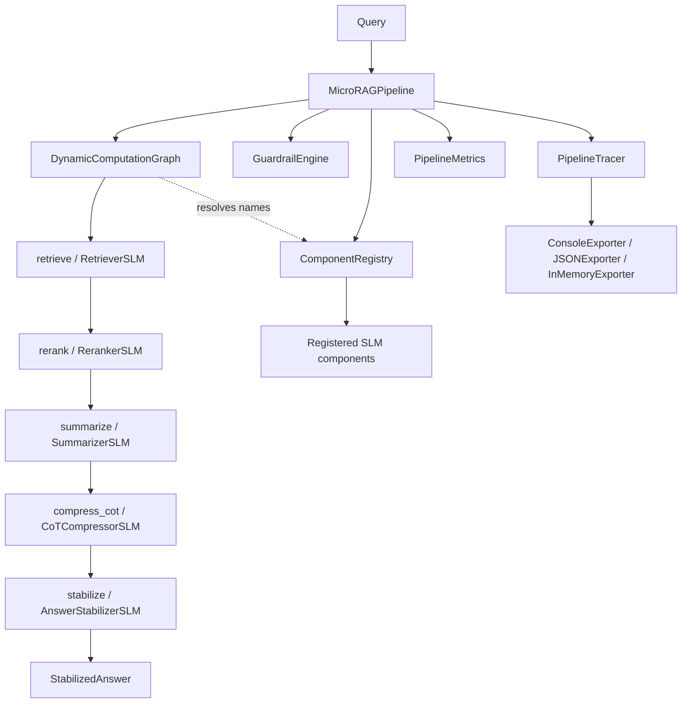

# Micro-Model Orchestrated RAG

## Overview

Micro-Model Orchestrated RAG is a retrieval-augmented generation system that decomposes
the RAG pipeline into seven independent stages, each backed by a specialized Small
Language Model (SLM), and drives those stages through a dynamic computation graph rather
than a hard-coded sequence of calls.

The central idea is task specialization. A single large model asked to chunk, retrieve,
rerank, summarize, and answer is a generalist at every step. Here each step is a small
model chosen for that step: a 0.5B Qwen2 model for query routing, a BGE small model for
embeddings, a cross-encoder for reranking, and 1.5B Qwen2 models for the generative
stages. The orchestration layer — the graph, registry, guardrails, tracing, and metrics —
is the substance of the project and is implemented from scratch in pure Python. The SLMs
themselves are thin wrappers over Hugging Face `transformers` and `sentence-transformers`.

The package teaches several concepts:

- **Graph-structured execution.** A pipeline expressed as nodes with declared
  dependencies, topologically sorted and executed, with per-node fallbacks and merge
  points. This is the same shape as workflow engines and dataflow systems, reduced to its
  essentials.
- **Component indirection through a registry.** Nodes name components; the registry
  resolves names to instances. Swapping a real SLM for a mock is a one-line registry
  change, which is exactly what the test mode does.
- **Cross-cutting concerns as first-class layers.** Guardrails, tracing, and metrics wrap
  execution without the SLMs knowing they exist.
- **Honest degradation.** Every SLM has a deterministic mock twin, so the entire pipeline
  is runnable and testable with no model weights and no network.

Scope: this is an in-process library. The query path runs synchronously inside one Python
process (the SLM `process` methods are `async` so the graph can await them, but there is no
network service in the core path). `docker-compose.yml` ships optional ChromaDB, Redis, and
Jaeger containers, and `RetrieverSLM` integrates FAISS for dense search, but the default
`MicroRAGPipeline` holds state in memory.

A practical consequence of the schema/ML split is graceful import degradation. The
dependencies declared in `pyproject.toml` separate the lightweight core (`numpy`, `pydantic`,
`python-dotenv`, `networkx`) from heavy extras grouped as `ml`, `vectordb`, `llm`, `nlp`,
`observability`, and `guardrails`, with a `full` extra pulling them all in. The top-level
package imports its schemas unconditionally and wraps every torch-bound import in a
`try/except ImportError`, binding the unavailable names to `None`. So `import microrag` works
in a bare environment for anyone who only needs the data model or wants to read the graph and
registry code, and the SLM-dependent surface lights up once the `ml` extras are installed. The
test suite uses the same pattern, skipping torch-dependent cases rather than failing to
collect.

## Architecture



The system is organized in four layers.

**Schemas (`microrag.schemas`).** Plain dataclasses shared by every other module: `Chunk`,
`Document`, `RetrievalResult`, `RerankResult`, `RoutingDecision`, `StabilizedAnswer`,
`GraphNode`, `ExecutionResult`, `Span`, `GuardrailResult`, `ModelInfo`, and the enums
`NodeType` and `QueryIntent`. This module has no torch dependency, so it imports cleanly
even when the ML extras are not installed — the rest of the package gates its torch-bound
imports behind a `try/except ImportError`.

**Orchestrator (`microrag.orchestrator`).** The execution engine: `ComponentRegistry` and
`SLMRegistry` for resolving component names, `DynamicComputationGraph` and `GraphBuilder`
for defining and running graphs, and `PipelineTracer` with its exporters for observability.
Factory functions `build_rag_graph` and `build_indexing_graph` assemble the two standard
graphs.

**SLM components (`microrag.slm`).** The seven specialized models, each subclassing
`BaseSLM`, plus a `Mock*` twin for each and a few higher-level wrappers (`AdaptiveChunker`,
`MultiDomainEmbedder`, `QueryRouterSLM`, `ExplainableReranker`). All real SLMs expose an
`async def process(**kwargs)` method that the graph calls.

**Enterprise concerns (`microrag.enterprise`).** Guardrails (`GuardrailEngine` plus four
rules), metrics (`PipelineMetrics`, `QualityMetricsCollector`), and model selection
(`ModelSelector`, `FallbackChain`, `PerformanceTracker`).

The `MicroRAGPipeline` in `microrag.pipeline` is the façade that wires all four layers
together: it builds a registry (real or mock), constructs the query graph, attaches a
tracer and metrics collector, and optionally installs a guardrail engine.

## Core Components

### MicroRAGPipeline

`MicroRAGPipeline` is the orchestrating façade. Construction does four things:

1. Builds a `ComponentRegistry` populated with either real SLMs or their mocks, selected
   by the `use_mock` flag.
2. Builds the query computation graph via `GraphBuilder`.
3. Resolves a `PipelineTracer` (the process-global tracer by default) and the global
   `PipelineMetrics`.
4. If `use_guardrails` is set, installs a `GuardrailEngine` with a `RelevanceGuardrail`
   (`min_relevance=0.2`) and a `ConfidenceGuardrail` (`min_confidence=0.3`).

The query path is short because the graph carries the logic:

```python
async def query(self, query: str, top_k: int = 10, trace_id: str = None) -> StabilizedAnswer:
    trace_id = trace_id or generate_id()
    start_time = time.time()
    try:
        with self.tracer.trace_step("rag_query", trace_id) as span:
            self.tracer.add_attribute(span, "query", query)
            results = await self.graph.execute({"query": query}, trace_id)

        answer = results.get("stabilize")

        latency = (time.time() - start_time) * 1000
        self.metrics.record_latency("pipeline", latency)
        if hasattr(answer, "confidence"):
            self.metrics.record_quality("pipeline", answer.confidence)
        self.metrics.record_request(success=True)

        if self.guardrails:
            guard_result = await self.guardrails.check("stabilize", query, answer)
            if not guard_result.passed:
                answer.reasoning += f" [Guardrail warning: {guard_result.action}]"
        return answer
    except Exception as e:
        self.metrics.record_request(success=False)
        return StabilizedAnswer(
            answer=f"Error processing query: {str(e)}",
            confidence=0.0, consistency=0.0, num_samples=0,
            reasoning="Pipeline execution failed",
        )
```

Two design points are worth highlighting. First, the whole query is wrapped in a single
top-level trace span, and the graph threads the same `trace_id` through every node, so a
full execution is one trace tree. Second, the method never raises: a failure anywhere in
the graph is caught, recorded as a failed request, and turned into a zero-confidence
`StabilizedAnswer`. This keeps the pipeline a total function over queries, which the error
test (`test_pipeline_handles_component_error`) relies on.

`index_document` runs the chunk then embed sub-pipeline directly against the registry
rather than through the graph, because indexing is a two-step linear flow:

```python
chunker = self.registry.get("chunker_slm")
chunks = await chunker.process(document=document)
embedder = self.registry.get("embedder_slm")
embeddings = await embedder.process(chunk=chunks)
```

`warmup` and `cleanup` iterate the registered components and call `load` / `unload` where
available, allowing model weights to be pre-loaded or freed. `get_execution_summary`
returns the graph summary, the metrics summary, and the mode (`"mock"` or `"production"`).

The module-level `create_pipeline(use_mock, use_guardrails, warmup)` factory configures
logging and constructs the pipeline; with `warmup=True` and real models it schedules an
async warmup task.

### DynamicComputationGraph

The graph is the core abstraction. A graph is a set of `GraphNode`s keyed by id; each node
records its `node_type`, the `component` name to resolve, a `config` dict, a list of
`dependencies`, and an optional `fallback` node id.

Execution proceeds in three steps. First, `_topological_sort` produces an execution order
via depth-first visitation of dependencies:

```python
def _topological_sort(self) -> list[str]:
    visited = set()
    order = []
    def visit(node_id):
        if node_id in visited or node_id not in self.nodes:
            return
        visited.add(node_id)
        for dep in self.nodes[node_id].dependencies:
            visit(dep)
        order.append(node_id)
    for node_id in self.nodes:
        visit(node_id)
    return order
```

Because dependencies are visited before the node is appended, the output is a valid
topological order. Dependencies that are graph inputs rather than nodes (such as `"query"`)
are skipped by the `node_id not in self.nodes` guard. The diamond-dependency test confirms
that a node depending on two parents runs after both.

Second, `execute` seeds a results dict with the graph inputs and walks the order, gathering
each node's dependency outputs and executing it:

```python
results = {**inputs}
for node_id in execution_order:
    node = self.nodes[node_id]
    dep_results = {dep: results[dep] for dep in node.dependencies if dep in results}
    result = await self._execute_node(node, dep_results, trace_id)
    results[node_id] = result.output
    self.execution_history.append(result)
return results
```

The returned dict contains the original inputs plus one entry per node, so the pipeline
reads `results["stabilize"]` to get the final answer. Every execution is recorded in
`execution_history` as an `ExecutionResult` carrying the node id, output, latency, a quality
score, and metadata.

Third, `_execute_node` dispatches on node type. SLM nodes call `component.process(**inputs,
**config)` (falling back to `component(**inputs, **config)` for callables without a
`process` method); merge nodes call `_merge_results`; branch nodes evaluate a condition and
recurse into the selected branch. The node is timed, a quality score is computed, and the
result is packaged:

```python
async def _execute_node(self, node, inputs, trace_id) -> ExecutionResult:
    start_time = time.time()
    try:
        if node.node_type == NodeType.MERGE:
            output = self._merge_results(inputs)
        elif node.node_type == NodeType.SLM:
            component = self.registry.get(node.component)
            if hasattr(component, "process"):
                output = await component.process(**inputs, **node.config)
            else:
                output = await component(**inputs, **node.config)
        elif node.node_type == NodeType.BRANCH:
            component = self.registry.get(node.component)
            output = await self._execute_branch(component, inputs, node.config)
        else:
            component = self.registry.get(node.component)
            output = await component(**inputs)
        latency = (time.time() - start_time) * 1000
        quality = await self._compute_quality(node, output)
        return ExecutionResult(node.id, output, latency, quality, {...})
    except Exception as e:
        if node.fallback:
            return await self._execute_fallback(node, inputs, trace_id, e)
        raise
```

When a node has a declared fallback and raises, `_execute_fallback` runs the fallback node
instead, annotating the result with `fallback_from` and `original_error`. With no fallback,
the exception propagates — the `test_error_without_fallback_raises` test asserts this, and
the pipeline's own try/except converts it to an error answer. `_compute_quality` is a
deliberately simple heuristic: `0.0` for `None` or empty-list output, `0.8` otherwise. It is
a hook for a richer scorer, not a learned metric.

`get_execution_summary` aggregates the history into total latency, average quality, node
count, and a per-node breakdown.

### GraphBuilder and graph factories

`GraphBuilder` is a fluent wrapper that makes graph construction read like the pipeline it
describes. Each method adds a node and returns `self`:

```python
graph = (
    GraphBuilder(registry)
    .slm("retrieve", "retriever_slm", dependencies=["query"])
    .slm("rerank", "reranker_slm", dependencies=["query", "retrieve"])
    .slm("summarize", "summarizer_slm", dependencies=["query", "rerank"])
    .slm("compress_cot", "cot_compressor_slm", dependencies=["query", "summarize"])
    .slm("stabilize", "answer_stabilizer_slm", dependencies=["query", "compress_cot"])
    .build()
)
```

`slm` adds an SLM node (with optional `fallback` and `**config`), `branch` adds a
conditional node carrying a condition and a branch map, and `merge` adds a node that
combines its dependencies. `build` returns the underlying `DynamicComputationGraph`.

Two factory functions encode the standard graphs. `build_rag_graph` is the query graph
above: retrieve to rerank to summarize to CoT-compress to stabilize, each stage also
depending on `query`. `build_indexing_graph` is the two-node ingest graph: chunk then embed.
`MicroRAGPipeline` builds the same query graph internally.

### ComponentRegistry and SLMRegistry

`ComponentRegistry` is a name-to-instance map with optional per-component metadata. `get`
raises a `KeyError` listing the available names when a component is missing, which surfaces
graph wiring mistakes early. `register`, `has`, `list_components`, `get_metadata`,
`unregister`, and `clear` round out the interface.

`SLMRegistry` extends it with task-aware registration. `register_slm(name, slm, task,
base_model, **kwargs)` stores `task` and `base_model` in the metadata, and `get_by_task`
returns every component registered for a given task — the basis for choosing among multiple
candidate models for a stage. Module-level singletons `component_registry` and
`slm_registry` are provided for convenience, and `setup_default_components` registers the
full set of mock SLMs against the SLM registry.

### Tracing

`PipelineTracer` provides span-based tracing through a context manager:

```python
@contextmanager
def trace_step(self, step_name, trace_id, parent_id=None):
    span = Span(trace_id=trace_id, span_id=generate_id(), parent_id=parent_id,
                name=step_name, start_time=time.time(), attributes={})
    self._active_spans[span.span_id] = span
    try:
        yield span
    finally:
        span.end_time = time.time()
        span.duration_ms = (span.end_time - span.start_time) * 1000
        self.exporter.export(span)
        del self._active_spans[span.span_id]
```

Spans share a `trace_id` and can nest via `parent_id`, so a query produces a tree of timed
spans. `add_attribute` attaches key/value context, `record_error` stamps a span with error
type and message, and `get_active_spans` exposes spans currently open. Three exporters
implement the `TraceExporter` interface: `ConsoleExporter` prints each span's duration,
`JSONExporter` accumulates spans and flushes them to a file, and `InMemoryExporter` keeps
them in a list for assertions in tests. `get_tracer` / `set_tracer` manage a process-global
tracer that defaults to an in-memory exporter.

### SLM components

Every specialized model subclasses `BaseSLM` (`microrag.slm.base`), which provides device
selection (CUDA, then Apple MPS, then CPU), lazy `load` / `unload`, an `is_loaded` property,
a `tokenize` helper, and an `async __call__` that loads on demand and delegates to
`process`. Three mixins handle the model families: `EmbeddingModelMixin` loads a
`SentenceTransformer`, `CrossEncoderMixin` loads a `CrossEncoder`, and `GenerativeModelMixin`
loads an `AutoModelForCausalLM`. Each mixin falls back to a smaller default model if the
configured model fails to load, so a missing checkpoint degrades rather than crashes.

The seven stages, with their default models as wired by the pipeline:

- **`ChunkerSLM`** (`Qwen/Qwen2-0.5B-Instruct` + `all-MiniLM-L6-v2`). Splits a document into
  sentences with a regex on sentence-ending punctuation, embeds them, and grows a chunk one
  sentence at a time. The running chunk embedding is maintained as the average of its member
  sentence embeddings; a new sentence starts a new chunk when its cosine similarity to that
  running average drops below `similarity_threshold` (default `0.75`) or when adding it would
  exceed the token budget (`max_chunk_tokens=512`). Each finished chunk is classified (code
  block, table, section, or paragraph) by heuristics first — backticks and `def`/`class`
  prefixes for code, pipe/dash density for tables, leading `#` for sections — with an LLM
  classification fallback for long ambiguous chunks. A semantic-coherence score is computed
  from the mean pairwise similarity of adjacent sentences, normalized into `[0, 1]`.
  `AdaptiveChunker` wraps this with per-document-type strategies (technical, narrative, code,
  legal), auto-detecting the type from code and legal keyword density when not supplied.
- **`EmbedderSLM`** (`BAAI/bge-small-en-v1.5`, 384-dim). Encodes text, chunks, or documents
  to normalized embeddings in configurable batches.
- **`RetrieverSLM`** (`Qwen/Qwen2-0.5B-Instruct` + `bge-small-en-v1.5`). Routes the query to
  a retrieval strategy, then performs dense search. When `use_faiss=True` it builds a
  `faiss.IndexFlatIP` over L2-normalized embeddings, making inner-product search equivalent
  to cosine similarity. `default_top_k` is 100, leaving aggressive pruning to the reranker.
- **`RerankerSLM`** (`BAAI/bge-reranker-base` cross-encoder + `Qwen/Qwen2-1.5B-Instruct`).
  Scores query/document pairs with the cross-encoder, sorts by relevance, and keeps the top
  `k` (default 10), recording original and new ranks. `ExplainableReranker` additionally
  generates a short relevance explanation for the top results.
- **`SummarizerSLM`** (`Qwen/Qwen2-1.5B-Instruct`). Produces an extractive, abstractive, or
  hybrid summary of the reranked documents grounded in the query.
- **`CoTCompressorSLM`** (`Qwen/Qwen2-1.5B-Instruct`). Compresses a reasoning chain toward a
  target `compression_ratio` (default 0.3) while preserving key steps.
- **`AnswerStabilizerSLM`** (`Qwen/Qwen2-1.5B-Instruct` + `all-MiniLM-L6-v2`). Generates
  several answer samples across a temperature range, embeds them, and measures consistency
  by mean pairwise cosine similarity. Above `consistency_threshold` (0.8) it picks the answer
  most similar to the others (majority vote); below it, it synthesizes a refined answer. It
  returns a `StabilizedAnswer` with confidence, consistency, sample count, and reasoning.

Every stage has a `Mock*` twin that returns the same schema types deterministically with no
model weights. `MockChunkerSLM` splits on blank lines; `MockRetrieverSLM` returns scored
`RetrievalResult`s sorted descending; `MockAnswerStabilizerSLM` returns a `StabilizedAnswer`.
The mocks are loaded by `MicroRAGPipeline` when `use_mock=True` and are what the test suite
exercises.

### Graph execution semantics and edge cases

A few properties of the executor are worth stating precisely because the rest of the system
depends on them.

**Inputs flow through unchanged.** `execute` starts its results dict from the inputs, so graph
inputs (like `query`) remain available to every downstream node, not just to nodes that depend
on the first stage. This is why each query-graph stage can declare `query` as a dependency
alongside the previous stage's output — the value is still in the results dict.

**Missing dependencies are silently dropped, not errors.** When gathering a node's inputs,
`{dep: results[dep] for dep in node.dependencies if dep in results}` skips any dependency not
yet in results. Combined with the topological sort skipping ids that are not nodes, this lets a
dependency name refer either to another node or to a graph input without special-casing.

**Merge nodes need no registered component.** `_merge_results` runs directly in the executor and
flattens dependency dicts into one, so a `MERGE` node does not resolve anything from the
registry. The merge test registers no `merge` component yet still combines two branches.

**Fallbacks are per-node and recursive.** A node's `fallback` names another node; on exception
the executor runs that node with the same inputs and stamps `fallback_from` and `original_error`
onto the result. Branch execution also recurses through `_execute_node`, so branches and
fallbacks compose. Without a fallback the exception propagates to `execute` and then, in the
pipeline, to the top-level try/except that produces an error answer.

**History is append-only.** Each executed node appends one `ExecutionResult`; the summary derives
totals from this list, so re-running a graph accumulates history unless a fresh graph is built.

### Guardrails

`GuardrailEngine` holds a list of `GuardrailRule`s and evaluates the applicable ones for a
given stage:

```python
async def check(self, stage, input_data, output_data) -> GuardrailResult:
    violations = []
    for rule in self.rules:
        if rule.applies_to(stage):
            result = await rule.evaluate(input_data, output_data)
            if not result.passed:
                violations.append(result)
    if violations:
        self.violations.extend(violations)
        if any(v.severity == "critical" for v in violations):
            return GuardrailResult(passed=False, action="block", violations=violations)
        if any(v.severity == "warning" for v in violations):
            return GuardrailResult(passed=True, action="warn", violations=violations)
    return GuardrailResult(passed=True, action="pass", violations=[])
```

The action escalates with severity: a critical violation blocks (`passed=False`), a warning
passes but flags, and a clean run passes. Each rule declares which stages it `applies_to` and
implements `async evaluate`:

- **`RelevanceGuardrail`** (retrieval, reranking) fails when there are no results or the max
  score is below `min_relevance`.
- **`ConfidenceGuardrail`** (stabilize, answer generation) fails when a result's `confidence`
  is below `min_confidence`.
- **`HallucinationGuardrail`** (summarization, answer generation, stabilize) flags output
  containing more than two hedging phrases ("I think", "probably", "might be", "I believe").
  This is a deliberate placeholder for a real NLI / fact-verification check.
- **`LengthGuardrail`** (all stages) fails when output length falls outside
  `[min_length, max_length]`.

The pipeline installs relevance and confidence guardrails by default and checks them against
the final answer at the `stabilize` stage, appending a warning note to the answer's reasoning
when a rule trips rather than discarding the answer.

### Metrics

`QualityMetricsCollector` records `(value, timestamp)` points keyed by `component.metric` and
aggregates them into mean, std, min, max, p50, p95, and count. `PipelineMetrics` wraps it with
convenience recorders (`record_latency`, `record_quality`, `record_throughput`,
`record_request`), tracks request and error counts, computes an error rate, and produces a
summary combining request count, error rate, and per-stage aggregates. A process-global
instance is returned by `get_metrics`; the pipeline records pipeline latency and confidence on
every query.

### Model selection

`ModelSelector` chooses among candidate models for a task. `_filter_candidates` keeps models
whose task matches and that satisfy the `SelectionConstraints` (max latency, min quality, max
cost). The default `quality_latency_balance` strategy normalizes each candidate's quality and
latency — preferring historical `PerformanceTracker` stats when available, otherwise the model's
declared `ModelInfo` defaults — and weights them by context (`latency_sensitive` flips the
weighting toward latency). Alternative strategies select purely by lowest latency or highest
quality. `PerformanceTracker` maintains running averages of latency, quality, and error rate per
model. `FallbackChain` executes a task against an ordered list of models, moving to the next on
failure and raising `RuntimeError` only when every model in the chain fails.

## Data Structures

All shared types are dataclasses in `microrag.schemas`. They have no torch dependency, so they
import even without the ML extras installed.

```python
class NodeType(Enum):
    SLM = "slm"; RETRIEVAL = "retrieval"; TRANSFORM = "transform"
    BRANCH = "branch"; MERGE = "merge"

class QueryIntent(Enum):
    FACTUAL = "factual"; COMPARISON = "comparison"; PROCEDURAL = "procedural"
    EXPLORATORY = "exploratory"; CLARIFICATION = "clarification"

@dataclass
class Chunk:
    content: str
    start_idx: int
    end_idx: int
    chunk_type: str            # paragraph, section, code_block, table
    semantic_score: float
    metadata: dict = field(default_factory=dict)

    @property
    def id(self) -> str:
        return f"chunk_{self.start_idx}_{self.end_idx}"

@dataclass
class Document:
    id: str
    content: str
    metadata: dict = field(default_factory=dict)
    embedding: Optional[Any] = None

@dataclass
class RetrievalResult:
    document: Document
    score: float
    retriever_type: str
    rank: int

@dataclass
class RerankResult:
    document: Document
    original_rank: int
    new_rank: int
    relevance_score: float
    features: dict = field(default_factory=dict)

@dataclass
class RoutingDecision:
    retrievers: list[str]
    transformed_query: str
    filters: dict = field(default_factory=dict)
    confidence: float = 1.0

@dataclass
class StabilizedAnswer:
    answer: str
    confidence: float
    consistency: float
    num_samples: int
    reasoning: str = ""
```

The graph and observability types:

```python
@dataclass
class GraphNode:
    id: str
    node_type: NodeType
    component: str
    config: dict = field(default_factory=dict)
    dependencies: list[str] = field(default_factory=list)
    fallback: Optional[str] = None

@dataclass
class ExecutionResult:
    node_id: str
    output: Any
    latency_ms: float
    quality_score: float
    metadata: dict = field(default_factory=dict)

@dataclass
class Span:
    trace_id: str
    span_id: str
    parent_id: Optional[str]
    name: str
    start_time: float
    end_time: Optional[float] = None
    duration_ms: Optional[float] = None
    attributes: dict = field(default_factory=dict)

@dataclass
class GuardrailResult:
    passed: bool
    action: str                # pass, warn, block
    violations: list = field(default_factory=list)

@dataclass
class RuleResult:
    passed: bool
    severity: str = "info"
    message: str = ""
```

The selection and stats types:

```python
@dataclass
class ModelInfo:
    name: str
    task: str
    size_mb: float
    avg_latency_ms: float
    quality_score: float
    cost_per_1k: float = 0.0

@dataclass
class SelectionConstraints:
    max_latency_ms: Optional[float] = None
    min_quality: Optional[float] = None
    max_cost: Optional[float] = None
    preferred_models: list[str] = field(default_factory=list)

@dataclass
class PerformanceStats:
    avg_latency: float = 0.0
    avg_quality: float = 0.0
    error_rate: float = 0.0
    call_count: int = 0
```

`generate_id()` returns a 12-character hex slice of a UUID4 and is used for trace ids, span
ids, and default document ids.

The key contract that holds the pipeline together is the SLM interface: every component exposes
`async def process(**kwargs)` and returns a schema type. Because the graph passes a node's
dependency outputs as keyword arguments, the dependency names declared in the graph must match
the keyword names each `process` method expects. For the query graph this means `retrieve`
takes `query`; `rerank` takes `query` and `retrieve`; `summarize` takes `query` and `rerank`;
`compress_cot` takes `query` and `summarize`; and `stabilize` takes `query` and `compress_cot`.

## API Design

The public surface is re-exported from the top-level `microrag` package. Schema types always
import; the orchestrator, SLM, pipeline, and enterprise symbols are gated behind a
`try/except ImportError` so that importing `microrag` without torch yields the schemas and
`None` placeholders for the torch-bound names.

Primary entry points:

```python
def create_pipeline(
    use_mock: bool = False,
    use_guardrails: bool = True,
    warmup: bool = False,
) -> MicroRAGPipeline: ...

class MicroRAGPipeline:
    def __init__(self, registry=None, use_guardrails=True,
                 use_mock=False, tracer=None): ...
    async def query(self, query: str, top_k: int = 10,
                    trace_id: str = None) -> StabilizedAnswer: ...
    async def index_document(self, document: str, doc_id: str = None,
                             metadata: dict = None) -> dict: ...
    def get_execution_summary(self) -> dict: ...
    async def warmup(self) -> None: ...
    async def cleanup(self) -> None: ...
```

Orchestrator API:

```python
class ComponentRegistry:
    def register(self, name, component, metadata=None): ...
    def get(self, name): ...                  # KeyError lists available names
    def has(self, name) -> bool: ...
    def list_components(self) -> list[str]: ...

class GraphBuilder:
    def slm(self, node_id, component, dependencies=None,
            fallback=None, **config) -> "GraphBuilder": ...
    def branch(self, node_id, condition, branches,
               dependencies=None) -> "GraphBuilder": ...
    def merge(self, node_id, dependencies) -> "GraphBuilder": ...
    def build(self) -> DynamicComputationGraph: ...

class DynamicComputationGraph:
    def add_node(self, node_id, node_type, component,
                 config=None, dependencies=None, fallback=None): ...
    async def execute(self, inputs: dict, trace_id: str = None) -> dict: ...
    def get_execution_summary(self) -> dict: ...

def build_rag_graph(registry) -> DynamicComputationGraph: ...
def build_indexing_graph(registry) -> DynamicComputationGraph: ...
```

SLM API (every real SLM and its mock):

```python
class BaseSLM(ABC):
    async def process(self, **kwargs) -> Any: ...   # abstract
    def load(self) -> None: ...
    def unload(self) -> None: ...
    @property
    def is_loaded(self) -> bool: ...
    async def __call__(self, **kwargs) -> Any: ...   # loads then process
```

Guardrails, metrics, and selection:

```python
class GuardrailEngine:
    def __init__(self, rules: list[GuardrailRule] = None): ...
    def add_rule(self, rule): ...
    async def check(self, stage, input_data, output_data) -> GuardrailResult: ...

class PipelineMetrics:
    def record_latency(self, stage, latency_ms): ...
    def record_quality(self, stage, score): ...
    def record_request(self, success=True): ...
    def get_summary(self) -> dict: ...

class ModelSelector:
    async def select(self, task, context=None, constraints=None) -> str: ...

class FallbackChain:
    async def execute_with_fallback(self, task, executor, *args, **kwargs): ...
```

There is no HTTP server in the core path. The system is consumed as a library; the optional
ChromaDB, Redis, and Jaeger services in `docker-compose.yml` exist for vector storage,
caching, and trace visualization but are not required by the default in-process pipeline.

## Performance

The performance story is structural rather than benchmarked — the repository ships no
benchmark suite, so the numbers below are design parameters drawn from the code, not measured
results.

**Specialization over a monolith.** The premise is that seven small specialized models can
match a single large model's quality at lower latency and cost, because each stage runs the
smallest model that suffices: a 0.5B router and a 384-dim embedder for the cheap stages, 1.5B
generative models only where generation is required, and a cross-encoder for reranking. The
declared defaults reflect this gradient.

**Retrieval funnel.** `RetrieverSLM` returns up to `default_top_k=100` candidates and the
`RerankerSLM` prunes to `default_top_k=10`. Doing cheap dense retrieval wide and expensive
cross-encoder scoring narrow keeps the costly stage's input bounded.

**FAISS for dense search.** Retrieval uses `faiss.IndexFlatIP` over L2-normalized embeddings,
turning cosine-similarity search into exact inner-product search with FAISS's optimized
kernels rather than a Python loop.

**Batching.** The embedder and reranker accept a `batch_size` (default 32), amortizing model
forward passes across many inputs.

**Device awareness.** `BaseSLM._get_device` selects CUDA, then Apple MPS, then CPU, and the
generative mixin loads in `float16` off CPU, halving memory and improving throughput on
accelerators.

**Lazy loading and lifecycle.** Models load on first use (or via `warmup`) and can be freed
with `unload` / `cleanup`, so memory is allocated only for stages actually exercised — relevant
when seven checkpoints would otherwise resident simultaneously.

**Observable hot path.** Every node records `latency_ms` into `execution_history`, and
`get_execution_summary` exposes a per-node latency breakdown, so the slowest stage is always
identifiable without external profiling. `PipelineMetrics` keeps p50/p95 aggregates per stage
across requests.

The mock pipeline removes model inference entirely, so the orchestration overhead — graph
sort, dependency gathering, tracing, guardrail checks — can be measured in isolation by running
queries through `create_pipeline(use_mock=True)`.

## Testing Strategy

The suite lives in `tests/` and is organized by layer, with `conftest.py` providing shared
fixtures (sample documents, chunks, retrieval and rerank results, registries, graphs, tracers,
and guardrail engines).

**torch gating.** Tests that need real model classes guard their imports with
`try/except ImportError` and apply `pytestmark = pytest.mark.skipif(not _HAS_TORCH, ...)`.
Schema-only and pure-graph-logic tests run without the ML extras; SLM and full-pipeline tests
skip cleanly when torch is absent. This keeps the suite runnable in a minimal environment while
still covering the heavy paths when the dependencies are present.

**Orchestrator tests (`test_orchestrator.py`).** Cover the registry (register/get/has/list/
unregister/clear, metadata, missing-key error, SLM task filtering), the graph (node addition,
topological sort for linear and diamond dependency shapes, simple and full RAG execution,
history recording, execution summary, merge-node combination, and the quality heuristic), the
builder (SLM/branch/merge nodes, fluent chaining, fallback wiring), the factory functions, the
tracer (trace-id generation, the step context manager, parent/child nesting, attribute and
error recording, active-span tracking), all three exporters, the `TracingContext`, and fallback
execution — including the assertion that an error without a fallback raises.

**SLM tests (`test_slm.py`).** Exercise every mock SLM against its contract: empty/None inputs,
single and multiple inputs, metadata, sorting, top-k limits, rank assignment, normalization of
embeddings, and a full mock pipeline composed by hand (retrieve to rerank to summarize to
compress to stabilize). Edge cases cover special characters, unicode, very long text, and
single-document reranking. Because the mocks return real schema types, these tests verify the
data contracts that the graph relies on.

**Pipeline tests (`test_pipeline.py`).** End-to-end coverage of `create_pipeline`: it registers
all seven components, builds the five-node query graph, runs queries returning valid
`StabilizedAnswer`s with bounded confidence/consistency, indexes documents, records metrics,
honors custom top-k and trace ids, and handles sequential and concurrent queries. The guardrail
section tests the engine's pass/warn behavior and each rule's `applies_to` and `evaluate`
contract. Error handling is verified by injecting a `FailingRetriever` into the registry and
asserting the pipeline returns an error answer rather than raising. Lifecycle tests cover warmup
and cleanup, and tracing tests confirm a query produces exported spans containing query
information.

The testing philosophy is to verify the orchestration logic exhaustively with deterministic
mocks, and to verify the real SLMs' wiring (load paths, model selection, FAISS integration) only
where torch is available, never asserting on the content of model-generated text.

Run the suite with:

```bash
pip install -e ".[ml,dev]"
pytest tests/ -v
```

## References

- Small Language Models Survey — https://arxiv.org/abs/2402.02315
- Self-Consistency Improves Chain-of-Thought Reasoning — https://arxiv.org/abs/2203.11171
- BGE / FlagEmbedding embedding and reranker models — https://github.com/FlagOpen/FlagEmbedding
- Qwen2 model family — https://github.com/QwenLM/Qwen2
- Sentence-Transformers (bi-encoders and cross-encoders) — https://www.sbert.net/
- FAISS similarity search — https://github.com/facebookresearch/faiss
- Hugging Face Transformers — https://github.com/huggingface/transformers
