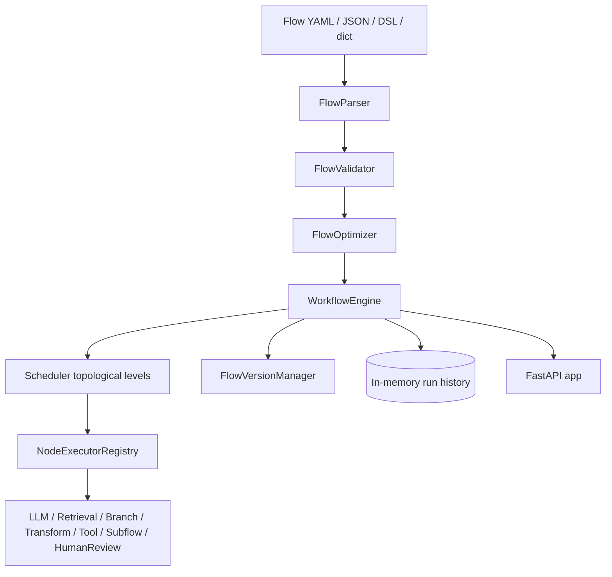

# AI Workflow Engine

A from-scratch workflow orchestration engine for AI/ML pipelines. Flows are declared in YAML, JSON, or a small custom DSL, compiled into a DAG, and executed level-by-level with bounded async parallelism, per-node retry strategies, flow versioning, human-in-the-loop review, and Mermaid/Graphviz visualization. The package is `aiworkflow`.

## Features

- **Multi-format flow definitions** — parse the same workflow from YAML, JSON, a dict, or an indentation-based DSL (`FlowParser` in `compiler/parser.py`).
- **DAG compilation** — build adjacency lists from explicit `edges` and node `dependencies`, detect cycles, and compute topological order and parallel execution levels (`DAGBuilder` in `compiler/dag.py`).
- **Flow optimization** — merge redundant `DATA` nodes, mark parallel groups, flag cacheable nodes, and prune unreachable nodes (`FlowOptimizer`).
- **Validation** — reject empty flows, duplicate node IDs, dangling dependencies/edges, and cycles (`FlowValidator`).
- **Level-parallel scheduler** — run each topological level concurrently under an `asyncio.Semaphore`, resolve `{{node.field}}` input references, and record per-node timing and attempts (`Scheduler` / `AsyncScheduler` in `executor/scheduler.py`).
- **Typed node executors** — built-in executors for `llm`, `retrieval`, `branch`, `transform`, `tool`, `subflow`, and `human_review` node types, plus a custom-executor registry (`nodes/base.py`).
- **Recursive subflows** — run a registered or inline flow as a single node with input mapping and a bounded recursion depth (`SubflowNodeExecutor`).
- **Retry strategies** — exponential/linear/fixed/constant backoff, LLM-output-validation retry, an adaptive strategy, and a circuit breaker (`retry/strategies.py`).
- **Versioning** — content-hash deduplicated flow versions, version diffing, and a migration-path finder (`FlowVersionManager`, `MigrationManager`).
- **Enterprise add-ons** — human-in-the-loop review store, `${secret:NAME}` resolution with masking, and DAG visualization (`enterprise/`).
- **REST API** — FastAPI app exposing flow registration, inline and registered runs, run history, diagrams, and review approval/rejection (`api/app.py`).

## Architecture



| Component | Module | Responsibility |
|-----------|--------|----------------|
| Parser / Validator | `aiworkflow.compiler.parser` | Parse YAML/JSON/DSL/dict into `FlowDefinition`; validate structure |
| DAG / Optimizer | `aiworkflow.compiler.dag` | Build the DAG, topo-sort, compute levels, optimize |
| Scheduler | `aiworkflow.executor.scheduler` | Execute levels concurrently, resolve inputs, retry, collect outputs |
| Node executors | `aiworkflow.nodes.base` | Per-type node execution and the executor registry |
| Engine | `aiworkflow.engine` | Orchestrate register/run/version, run history, checkpoints |
| Retry | `aiworkflow.retry.strategies` | Backoff strategies, circuit breaker, `RetryManager` |
| Versioning | `aiworkflow.versioning.manager` | Version save/diff/migration |
| Enterprise | `aiworkflow.enterprise` | HITL review, secret resolution, visualization |
| API | `aiworkflow.api.app` | FastAPI REST surface |

## Quick Start

### Prerequisites

- Python 3.9+
- `pyyaml` is required for the compiler and engine (the package degrades gracefully without it — schemas still import). FastAPI is needed only for the `api` extra.

### Installation

```bash
pip install -e ".[dev]"      # core + test tooling
pip install -e ".[api,dev]"  # also install FastAPI for the REST API
```

### Running

Run a flow programmatically (see Usage below), or serve the REST API:

```bash
uvicorn aiworkflow.api:app --reload
```

### Security & limits

The REST API ships with opt-in production hardening, all configured via environment variables (stdlib only, no extra deps):

| Env var | Default | Effect |
| --- | --- | --- |
| `API_KEYS` | *(unset)* | Comma-separated valid keys. Unset/empty disables auth (a startup warning is logged). |
| `RATE_LIMIT_PER_MINUTE` | `120` | Per-client request cap (by API key, else client IP). `0` disables. Over-limit returns `429` with `Retry-After`. |
| `REQUEST_TIMEOUT_SECONDS` | `30` | Per-request wall-clock budget. `0` disables. On timeout returns `504`. |

When auth is enabled, send the key as `Authorization: Bearer <key>` or `X-API-Key: <key>`. `/health`, `/`, and the docs (`/docs`, `/redoc`, `/openapi.json`) stay open. There are no streaming/SSE/websocket endpoints, so nothing is exempt from the timeout.

```bash
API_KEYS=mysecret uvicorn aiworkflow.api:app
curl -H "Authorization: Bearer mysecret" http://localhost:8000/flows
```

## Usage

Define a flow with the schema types and run it. LLM and retrieval executors return deterministic mock output (see What's Real vs Simulated):

```python
import asyncio
from aiworkflow import WorkflowEngine, FlowDefinition, Node, NodeType, NodeConfig

flow = FlowDefinition(
    name="qa-flow",
    version="1.0.0",
    nodes=[
        Node(id="retriever", type=NodeType.RETRIEVAL,
             config=NodeConfig(extra={"top_k": 3}),
             inputs={"query": "{{inputs.question}}"}),
        Node(id="generator", type=NodeType.LLM,
             config=NodeConfig(model="gpt-4", prompt_template="Q: {{question}}"),
             dependencies=["retriever"],
             inputs={"question": "{{inputs.question}}"}),
    ],
    outputs={"answer": "generator"},
)

engine = WorkflowEngine(max_parallel=5)

async def main():
    run = await engine.run_flow(flow_definition=flow, inputs={"question": "What is a DAG?"})
    print(run.status, run.outputs)

asyncio.run(main())
```

Register and run a flow from YAML (the package ships an `EXAMPLE_FLOW` string):

```python
from aiworkflow import WorkflowEngine, EXAMPLE_FLOW

engine = WorkflowEngine()
flow = engine.register_flow(EXAMPLE_FLOW)
run = asyncio.run(engine.execute(flow.name, inputs={"question": "Define topological sort"}))
```

Add a custom node executor by registering it on the engine:

```python
from aiworkflow.nodes import BaseNodeExecutor

class DoubleExecutor(BaseNodeExecutor):
    async def execute(self, node, inputs):
        return {"processed": [x * 2 for x in inputs.get("data", [])]}

engine.node_registry.register("doubler", DoubleExecutor())
# reference it from a node via Node(..., executor="doubler")
```

## What's Real vs Simulated

- **Real:** parsing (YAML/JSON/DSL/dict), validation, DAG construction with cycle detection, topological sort and level grouping, the flow optimizer, the level-parallel async scheduler with semaphore-bounded concurrency and `{{...}}` input resolution, retry strategies and the circuit breaker, flow versioning/diff/migration, the human-in-the-loop review store and its `asyncio.Event` wait, secret resolution and masking, Mermaid/Graphviz export, the FastAPI app, and its opt-in API-key auth, in-process rate limiting, and request timeouts (see Security & limits). All of this is exercised by the test suite.
- **Simulated / requires credentials:** the LLM executor returns a templated placeholder string and the retrieval executor returns synthetic documents — no model API is called. The `DataNode`, `ModelNode`, and similar helpers import `pandas`/`sqlalchemy`/`sklearn`/`aiohttp` lazily and need those optional dependencies and real data sources to do anything. Run history, the version store, and the review store are in-memory only (no persistence backend).

## Testing

```bash
pytest                      # run the suite (asyncio_mode = auto)
pytest --cov=aiworkflow     # with coverage
pytest tests/test_engine.py -v
```

The suite has 219 tests across 15 files covering the compiler, DAG edge cases, scheduler under load, node executors, retry strategy scenarios, error propagation, subflows, enterprise features, the API and its hardening layer, and end-to-end integration. No external services are required — LLM/retrieval calls are mocked in-process.

## Project Structure

```
28-ai-workflow-engine/
  README.md                 # this file
  pyproject.toml            # package metadata and extras
  src/aiworkflow/
    schemas.py              # core dataclasses and enums
    engine.py               # WorkflowEngine, create_engine, EXAMPLE_FLOW
    compiler/               # parser, validator, DAG builder, optimizer
    executor/               # Scheduler, AsyncScheduler
    nodes/                  # node executors and the registry
    retry/                  # retry strategies, circuit breaker, RetryManager
    versioning/             # FlowVersionManager, MigrationManager
    enterprise/             # HITL review, secrets, visualization
    api/                    # FastAPI app
  tests/                    # 215 tests across 14 files
  docs/
    BLUEPRINT.md            # full architecture and design
    SETUP.md                # environment setup
```

## License

MIT — see [LICENSE](../LICENSE)
