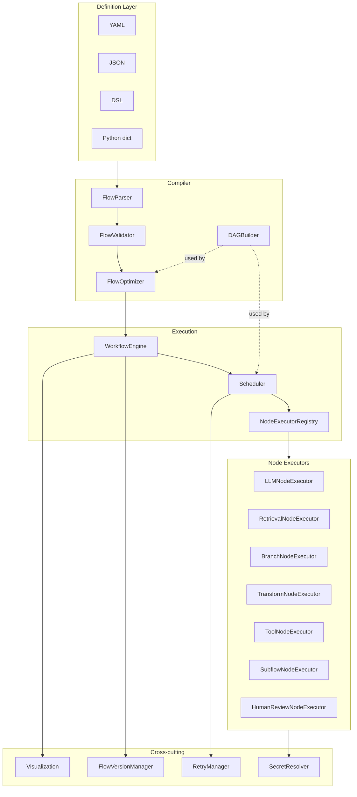

# AI Workflow Engine

## Overview

The AI Workflow Engine (`aiworkflow`) is a from-scratch orchestration engine for AI/ML pipelines. A workflow is a directed acyclic graph (DAG) of typed nodes — LLM calls, retrieval steps, conditional branches, transforms, tool invocations, nested subflows, and human-in-the-loop review gates. The engine parses a flow definition from YAML, JSON, a dict, or a small custom DSL; validates it; compiles it into a DAG; optionally optimizes it; and executes it level-by-level with bounded async parallelism.

The project exists to teach the moving parts of a workflow orchestrator without the weight of a production system like Dagster, Airflow, or Temporal. Concretely, it demonstrates:

- **DAG construction and analysis** — building adjacency and reverse-adjacency maps, detecting cycles with DFS, topological sorting with Kahn's algorithm, and grouping nodes into parallelizable execution levels.
- **Declarative-to-executable compilation** — turning a text/dict flow spec into validated, typed dataclasses and then into an execution plan.
- **Async scheduling** — running independent nodes concurrently under a concurrency cap, threading outputs from upstream nodes into downstream inputs via template references.
- **Retry semantics for non-deterministic work** — pluggable backoff strategies, error classification, and a circuit breaker, which matter when nodes call flaky external services such as LLM APIs.
- **Versioning and lineage** — content-hash deduplicated flow versions, structural diffing, and a migration-path search.
- **Operational concerns** — human approval gates, secret injection, and DAG visualization.

Scope is deliberately bounded. The LLM and retrieval executors are mocks that return deterministic placeholder output, so the orchestration logic can be tested end-to-end without network access or credentials. Run history, the version store, and the review store are in-memory; there is no database or message-queue backend. Everything described below is implemented in `src/aiworkflow/` and exercised by the 215-test suite in `tests/`.

## Architecture



The flow of control is layered:

1. **Definition layer.** A flow is authored as YAML, JSON, a custom DSL, or constructed directly as `FlowDefinition`/`Node` dataclasses.
2. **Compiler.** `FlowParser` normalizes any input format into a `FlowDefinition`. `FlowValidator` checks structural invariants. `DAGBuilder` materializes the graph and computes execution order. `FlowOptimizer` rewrites the flow for efficiency.
3. **Engine.** `WorkflowEngine` ties registration, validation, optimization, versioning, and execution together, and keeps the in-memory run history.
4. **Scheduler.** `Scheduler` walks the DAG level by level, executing each level's nodes concurrently under an `asyncio.Semaphore`, resolving inputs, applying retries, and collecting outputs.
5. **Executors.** The `NodeExecutorRegistry` dispatches each node to a type-specific or named executor.
6. **Cross-cutting support.** Retry strategies, version management, secret resolution, and visualization wrap the core path.

## Core Components

### FlowParser

`FlowParser` (`compiler/parser.py`) accepts four input shapes and produces a single `FlowDefinition`:

- `parse(content)` auto-detects format by trying YAML, then JSON, then the DSL.
- `parse_yaml` / `parse_json` / `parse_dict` handle the structured formats. They route through `_parse_definition`, which requires a `nodes` key and parses each node via `_parse_node`.
- `parse_dsl` interprets an indentation-light, line-oriented DSL with `workflow`, `node`, `config`, and `flow` sections and `a -> b -> c` edge chains.
- `parse_file` dispatches on file extension (`.yaml`/`.yml`, `.json`, `.dsl`).

`_parse_node` builds a typed `NodeConfig` and lifts any unrecognized config keys into `NodeConfig.extra`, so executors can read arbitrary node-specific settings (e.g. `top_k`, `branches`, `tool`) without the schema enumerating them. Parse failures raise `ParseError`.

The `extra` split is the key design move — the schema fixes the common LLM-style fields (`model`, `temperature`, `max_tokens`, `prompt_template`, `timeout_seconds`) and routes everything else into a free-form dict:

```python
config_data = data.get('config', {})
config = NodeConfig(
    model=config_data.get('model'),
    temperature=config_data.get('temperature', 0.7),
    max_tokens=config_data.get('max_tokens', 1000),
    prompt_template=config_data.get('prompt_template', ''),
    timeout_seconds=config_data.get('timeout_seconds', 60),
    extra={k: v for k, v in config_data.items()
           if k not in ['model', 'temperature', 'max_tokens',
                        'prompt_template', 'timeout_seconds']},
)
```

The DSL parser is a small hand-written state machine rather than a grammar. It tracks the current section (`node`, `config`, `flow`), accumulates a node's config into a dict, flushes the in-progress node when a new `node`/`flow` marker appears, and expands `a -> b -> c` chains into pairwise edges:

```python
if current_section == 'flow' and '->' in stripped:
    parts = [p.strip() for p in stripped.split('->')]
    for i in range(len(parts) - 1):
        edges.append({'from': parts[i], 'to': parts[i + 1]})
```

This keeps the DSL trivial to read and to extend, at the cost of not supporting nested config beyond one level — adequate for the teaching scope.

### FlowValidator

`FlowValidator.validate(flow)` returns a boolean and accumulates messages retrievable via `get_errors()`. It checks:

- non-empty node list,
- unique node IDs,
- every dependency references an existing node,
- every edge references existing endpoints,
- no cycles (DFS over a graph built from both dependencies and edges).

The boolean-plus-`get_errors()` contract is load-bearing: the engine treats `validate() == True` as "valid" and raises with the collected errors otherwise. The cycle check builds an adjacency map that unions dependency edges and explicit edges, then runs a recursion-stack DFS:

```python
def has_cycle_util(node_id):
    visited.add(node_id)
    rec_stack.add(node_id)
    for neighbor in graph.get(node_id, []):
        if neighbor not in visited:
            if has_cycle_util(neighbor):
                return True
        elif neighbor in rec_stack:   # back-edge => cycle
            return True
    rec_stack.remove(node_id)
    return False
```

Validation is intentionally structural only; it does not type-check inputs against a node's `input_schema` (that is left to executors via `NodeBase.validate_inputs`).

### DAGBuilder

`DAGBuilder` (`compiler/dag.py`) constructs two maps — `adjacency` (node to dependents) and `reverse_adjacency` (node to dependencies) — from both explicit `edges` and node `dependencies`. Key operations:

- `topological_sort()` — Kahn's algorithm using in-degrees, returning a flat execution order.
- `get_execution_levels()` — groups nodes into levels where each level's nodes have no unsatisfied dependencies; nodes in the same level can run in parallel. Levels are sorted for deterministic ordering.
- `get_dependencies` / `get_dependents` / `get_ancestors` — neighborhood queries; `get_dependencies` returns a `DependencySet` (a `set` subclass that also compares equal to equivalent lists/tuples, easing test assertions).
- `can_execute(node, completed)` — whether all of a node's dependencies are in the completed set.
- `build()` raises `CircularDependencyError` if a cycle is present.

The level computation is the heart of the scheduler's parallelism. It seeds in-degrees from `reverse_adjacency`, then repeatedly peels off the zero-in-degree frontier:

```python
def get_execution_levels(self) -> list[list[str]]:
    levels = []
    remaining = set(node.id for node in self.flow.nodes)
    in_degree = {node.id: len(self.reverse_adjacency.get(node.id, set()))
                 for node in self.flow.nodes}
    while remaining:
        current_level = sorted([
            node_id for node_id in remaining if in_degree[node_id] == 0
        ])
        if not current_level:
            break               # cycle or unsatisfiable dependency
        levels.append(current_level)
        for node_id in current_level:
            remaining.remove(node_id)
            for neighbor in self.adjacency.get(node_id, []):
                in_degree[neighbor] -= 1
    return levels
```

Sorting each level makes execution order deterministic across runs, which matters for reproducible tests. The `break` on an empty frontier means a malformed graph yields a partial (rather than infinite) level list — the scheduler treats any node never reaching a level as unexecuted.

### FlowOptimizer

`FlowOptimizer.optimize(flow)` deep-copies the flow and applies four passes:

1. `_merge_redundant_nodes` — collapses dependency-free `DATA` nodes that share identical config, remapping dependencies and edges to the survivor.
2. `_optimize_parallelism` — records parallel groups in `flow.metadata["parallel_groups"]` and tags each node with its `parallel_level`.
3. `_mark_cacheable` — sets `cache_enabled` metadata on nodes whose `extra` config marks them deterministic and high-cost.
4. `_remove_dead_code` — prunes nodes unreachable from the dependency-free roots, and the edges touching them.

Dead-code elimination is a forward reachability sweep from the roots (nodes with no dependencies), keeping only what is transitively reachable:

```python
reachable = set()
dag = DAGBuilder(flow)
to_visit = [n.id for n in flow.nodes if not dag.get_dependencies(n.id)]
while to_visit:
    node_id = to_visit.pop()
    if node_id not in reachable:
        reachable.add(node_id)
        to_visit.extend(dag.get_dependents(node_id))
flow.nodes = [n for n in flow.nodes if n.id in reachable]
flow.edges = [e for e in flow.edges
              if e.from_node in reachable and e.to_node in reachable]
```

The redundant-node merge is conservative: it only collapses `DATA` nodes that have no dependencies and identical `extra` config, then remaps every surviving dependency and edge to point at the kept node. Limiting the merge to source nodes avoids changing semantics for nodes whose behavior depends on upstream state. All passes operate on a deep copy, so optimization never mutates the caller's `FlowDefinition`.

### WorkflowEngine

`WorkflowEngine` (`engine.py`) is the façade. On construction it wires up a `NodeExecutorRegistry`, binds an engine-aware `SubflowNodeExecutor` (so nested flows actually run), registers a `HumanReviewNodeExecutor` against a shared `HumanReviewStore`, and creates a `Scheduler`, `RetryManager`, parser, validator, optimizer, and (optionally) a `FlowVersionManager`.

Notable methods:

- `register_flow(spec, description)` — parse, validate, optimize, version, and store a flow by name.
- `run_flow(flow_definition, inputs, ...)` — validate/optimize/version an ad-hoc flow and execute it; on failure it returns a `FlowRun` with status `FAILED` rather than raising.
- `execute(flow_name, inputs, version)` — run a previously registered flow by name.
- `execute_batch(flow_name, inputs_list)` — fan out multiple runs with `asyncio.gather`.
- `start_flow` / `interrupt_flow` / `cancel_flow` / `pause_flow` / `resume_flow` — lifecycle control over running tasks.
- `save_state` / `load_state` — serialize a `FlowDefinition` to JSON and back.
- Checkpoint helpers write completed-node lists to `checkpoint_dir` when checkpointing is enabled.
- `get_run_history` / `get_run` — query the in-memory history list.

A design choice worth calling out: `run_flow` is failure-tolerant by contract. A node that throws does not propagate the exception to the caller — the scheduler captures it, marks the run `FAILED`, and the engine appends a populated `FlowRun` to history:

```python
try:
    result = await self.scheduler.execute(flow_definition, inputs, run_id)
    ...
    self._run_history.append(result)
    return result
except Exception as e:
    failed_run = FlowRun(
        run_id=run_id, flow_id=flow_definition.name, flow_version=flow_definition.version,
        status=RunStatus.FAILED, inputs=inputs,
        start_time=datetime.utcnow(), end_time=datetime.utcnow(), error=str(e),
    )
    self._run_history.append(failed_run)
    return failed_run
```

This means callers always receive a `FlowRun` to inspect — checking `run.status` and `run.error` — rather than threading try/except around every call. Tests rely on this to assert failure modes without exception handling.

The registration path also corrects a subtle inversion: `FlowValidator.validate` returns `True` for a valid flow, so the engine checks `if not self.validator.validate(flow)` before raising with `get_errors()`. Treating the truthy "valid" result as "errors present" would reject every valid flow, so the boolean polarity is asserted by the compiler tests.

`create_engine(...)` is a thin constructor helper, and `EXAMPLE_FLOW` is a ready-to-parse YAML Q&A flow used throughout the tests.

### Lifecycle and state control

Beyond a single `run_flow`, the engine exposes asynchronous lifecycle control. `start_flow` schedules a run as an `asyncio.Task` tracked in `_running_tasks` and returns a run ID immediately; `interrupt_flow` cancels that task and, when checkpointing is enabled, writes an "interrupted" checkpoint file. `pause_flow`/`resume_flow`/`cancel_flow` delegate to the scheduler's `_active_runs` status map, and `list_active_flows` returns the run IDs currently in `RUNNING`. `resume_from_checkpoint` re-runs a flow from history with the original inputs under a `-resumed` run ID. These are deliberately simple (status flags and task handles, not a durable execution log), matching the in-memory scope of the rest of the engine.

### Scheduler

`Scheduler` (`executor/scheduler.py`) drives execution. `execute_flow` (aliased as `execute`):

1. builds a `DAGBuilder` and computes execution levels,
2. for each level, skips nodes whose `condition` evaluates false, then launches the remaining nodes as tasks,
3. awaits the level with `asyncio.gather(..., return_exceptions=True)`,
4. on any node exception, records a `FAILED` `NodeExecution`, marks the run failed, and stops,
5. otherwise stores each node's output keyed by node ID and adds it to `completed`,
6. finally collects outputs via `_collect_outputs`.

`_execute_node_task` runs under the shared semaphore. It assembles a node's inputs in three layers — flow inputs, then each upstream dependency's output dict, then explicitly resolved `{{...}}` references — so a downstream node sees its predecessors' results without having to name them:

```python
async with self.semaphore:
    node_inputs = dict(results.get("inputs", {}))
    for dep_id in getattr(node, 'dependencies', []):
        dep_result = results.get(dep_id)
        if isinstance(dep_result, dict):
            node_inputs.update(dep_result)
    resolved = self._resolve_inputs(node.inputs, results)
    node_inputs.update(resolved)
```

It then runs an inline retry loop driven by the node's `retry_config` (distinct from the strategy-based `RetryManager`; this is a simpler per-node loop the scheduler owns directly):

```python
retry_config = getattr(node, 'retry_config', None) or {}
max_retries = retry_config.get('max_retries', 0)
base_delay = retry_config.get('base_delay', 0)
attempts = 0
while True:
    attempts += 1
    try:
        output = await self.node_executor.execute(node, node_inputs)
        break
    except Exception as e:
        if attempts <= max_retries:
            if base_delay:
                await asyncio.sleep(base_delay)
            continue
        raise
```

Each successful node produces a `NodeExecution` record carrying its measured `latency_ms` and `attempts` count.

`_evaluate_condition` flattens results into a namespace and evaluates the condition with a sandboxed `eval` (`__builtins__` stripped), returning `False` on any error:

```python
namespace = {}
for key, value in results.items():
    if key == "inputs" and isinstance(value, dict):
        namespace.update(value)
    elif isinstance(value, dict):
        namespace.update(value)
try:
    return bool(eval(condition, {"__builtins__": {}}, namespace))
except Exception:
    return False
```

Stripping builtins blocks the obvious injection vectors; the conditions are author-controlled flow text, not untrusted user input, so this is a pragmatic rather than hardened sandbox. A node whose condition is false is marked completed with a `None` result and its downstream consumers simply see no contribution from it.

`_collect_outputs` maps the flow's declared `outputs` (each value naming a node) to that node's result; if a flow declares no outputs, it falls back to the last non-`None` node result.

`AsyncScheduler` subclasses `Scheduler` and adds `execute_parallel` for running many input sets against one flow concurrently.

### NodeExecutorRegistry and executors

`NodeExecutorRegistry` (`nodes/base.py`) maps `NodeType` to a default executor and supports string-named custom executors. `execute(node, inputs)` prefers a named executor (`node.executor`) — which may be a `BaseNodeExecutor` or a plain async function — and falls back to the type-based executor, defaulting to `MockNodeExecutor` for unknown types.

Built-in executors:

- **`LLMNodeExecutor`** — renders the prompt template against inputs and returns a mock string `[LLM Response for: ...]`. A real client could be injected via its constructor.
- **`RetrievalNodeExecutor`** — returns `top_k` synthetic documents with descending scores.
- **`BranchNodeExecutor`** — evaluates a `{{ref}}` condition and selects a branch from `branches`/`default`.
- **`TransformNodeExecutor`** — substitutes `inputs.<key>` into a JSON-template expression and parses the result.
- **`ToolNodeExecutor`** — looks up a named tool callable and invokes it with the inputs.
- **`SubflowNodeExecutor`** — runs a nested flow (see below).
- **`HumanReviewNodeExecutor`** — pauses for human approval (see Enterprise Features).

The registry's dispatch order is named-executor-first, then type-based, then the mock default:

```python
async def execute(self, node: Node, inputs: dict) -> Any:
    if getattr(node, 'executor', None):
        executor = self._named_executors.get(node.executor)
        if executor:
            if isinstance(executor, BaseNodeExecutor):
                return await executor.execute(node, inputs)
            return await executor(inputs)          # plain async function
    executor = self.get(node.type)                 # falls back to MockNodeExecutor
    return await executor.execute(node, inputs)
```

This lets a node opt into a named custom executor while still defaulting sensibly when none is set.

There is also a separate `NodeBase` lifecycle base class — distinct from `BaseNodeExecutor` — with concrete `DataNode`, `ProcessNode`, `ModelNode`, `ValidationNode`, and `ConditionalNode` subclasses. `NodeBase` wraps `_execute` with status transitions and timing:

```python
async def execute(self, inputs: dict) -> Any:
    self.status = NodeStatus.RUNNING
    start = time.time()
    try:
        result = await self._execute(inputs)
        self.status = NodeStatus.COMPLETED
        self.execution_time = time.time() - start
        return result
    except Exception as e:
        self.status = NodeStatus.FAILED
        self.error = str(e)
        raise
```

These subclasses lazily import `pandas`/`sqlalchemy`/`sklearn`/`aiohttp` and are usable when those optional dependencies and real data sources are present — for example `DataNode` reads CSV/SQL/HTTP sources and `ModelNode` trains or scores a scikit-learn model. `ConditionalNode` evaluates simple (`field`/`operator`/`value`) and compound (`and`/`or`) conditions. They demonstrate how a richer, side-effecting node tier would plug in alongside the lightweight mock executors used by the orchestration tests.

### Execution walkthrough

Putting the pieces together, a single `await engine.run_flow(flow, inputs)` proceeds as:

1. **Validate** the flow (`FlowValidator.validate`); raise on structural errors.
2. **Optimize** if enabled (`FlowOptimizer.optimize`) — dead-code prune, parallel tagging, redundant-node merge.
3. **Version** if enabled (`FlowVersionManager.save_version`) — dedup by content hash.
4. **Compile** the DAG (`DAGBuilder`) and compute execution levels.
5. **Schedule** each level: skip false-condition nodes, launch the rest as tasks under the semaphore.
6. For each node, **assemble inputs** (flow inputs + dependency outputs + resolved references), **retry** per `retry_config`, **dispatch** through the registry, and **record** a `NodeExecution`.
7. On any node exception, **fail fast** — mark the run `FAILED` and stop scheduling further levels.
8. **Collect outputs** by mapping declared flow outputs to node results.
9. **Append** the `FlowRun` to history and return it.

Steps 5–7 are where parallelism, retry, and failure handling intersect, and they are the most heavily tested part of the system.

### SubflowNodeExecutor

`SubflowNodeExecutor` composes flows. Its config (`node.config.extra`) names either an inline `flow` dict or a registered `flow_name` (with optional `version`), plus an optional `input_mapping` and `output_key`. It runs the nested flow through the same bound engine, so subflows inherit scheduling, retry, and versioning. Recursion is bounded by threading a depth counter (`__subflow_depth__`) through flow inputs and raising once `max_depth` is exceeded; a `__subflow_run_id__` breadcrumb links parent and child runs:

```python
depth = int(inputs.get(self.DEPTH_KEY, 0) or 0)
if depth >= max_depth:
    raise RuntimeError(
        f"Subflow recursion limit ({max_depth}) exceeded at node '{node.id}'"
    )
subflow = self._resolve_subflow(node, extra)
sub_inputs = self._map_inputs(extra.get("input_mapping"), inputs)
sub_inputs[self.DEPTH_KEY] = depth + 1
run = await self.engine.run_flow(flow_definition=subflow, inputs=sub_inputs)
if run.status == RunStatus.FAILED:
    raise RuntimeError(f"Subflow '{subflow.name}' failed in node '{node.id}': {run.error}")
```

Because the scheduler propagates flow-level inputs to every node, the depth counter survives across nesting levels, so a flow that (directly or transitively) invokes itself fails cleanly at the limit instead of recursing forever. The executor is registered unbound in the default registry and re-registered as an engine-bound instance in `WorkflowEngine.__init__`; using the unbound instance raises a clear error rather than silently doing nothing.

### RetryManager and strategies

`retry/strategies.py` provides a `RetryStrategy` ABC with `should_retry(error, attempt)` and `get_delay(attempt)`. Implementations: `ExponentialBackoffRetry` (optional jitter), `LinearBackoffRetry`, `FixedDelayRetry`, `ConstantRetry`, `LLMOutputRetry` (retries JSON/validation/format errors), and `AdaptiveRetry` (classifies errors and delegates to a per-class strategy). `RetryableError`/`NonRetryableError` carry explicit `is_retryable` markers that strategies honor.

`RetryManager.execute_with_retry` wraps an async callable, consulting the chosen strategy each attempt, optionally enforcing a `timeout` via `asyncio.wait_for`, and integrating with an optional `CircuitBreaker` that opens after a failure threshold and recovers after a timeout:

```python
async def _run():
    last_error = None
    for attempt in range(10):           # hard ceiling regardless of strategy
        try:
            result = await func(*args, **kwargs)
            if self.circuit_breaker:
                self.circuit_breaker.record_success()
            return result
        except Exception as e:
            last_error = e
            if not strat.should_retry(e, attempt):
                break
            await asyncio.sleep(strat.get_delay(attempt))
    if self.circuit_breaker and last_error:
        self.circuit_breaker.record_failure()
    if last_error:
        raise last_error
```

The hard ceiling of 10 iterations is a safety net so a misconfigured strategy can never loop unboundedly. The circuit breaker records exactly one failure per call (not per attempt), so its threshold counts failed operations rather than retries. `AdaptiveRetry` classifies an error by name substring — "rate"/"limit", "json"/"validation", "timeout" — and dispatches to a strategy tuned for that class, modeling the reality that LLM rate-limits want long exponential backoff while malformed-output errors want quick re-prompts. The manager can also record per-task metrics (attempt/success/failure counts and average duration) when `collect_metrics` is enabled.

### FlowVersionManager and MigrationManager

`versioning/manager.py` stores versions in memory keyed by flow name. `save_version` computes a content hash (a deterministic JSON projection of nodes/outputs, sorted by node ID) and deduplicates identical content, returning the existing version if the hash already exists rather than creating a duplicate:

```python
flow_hash = self._compute_hash(flow)
for existing_version in self._versions[flow_name].values():
    if existing_version.flow_hash == flow_hash:
        return existing_version
```

Each new version links to the most recent parent (by `created_at`), forming a lineage chain. `compare_versions` diffs two versions into added/removed/modified node sets, where `_nodes_differ` compares type, config, inputs, and dependencies:

```python
nodes_a = {n.id for n in flow_a.nodes}
nodes_b = {n.id for n in flow_b.nodes}
added_nodes   = nodes_b - nodes_a
removed_nodes = nodes_a - nodes_b
modified_nodes = [nid for nid in (nodes_a & nodes_b)
                  if self._nodes_differ(flow_a.node_map[nid], flow_b.node_map[nid])]
```

`MigrationManager` registers `(from, to)` migration functions and finds a migration path via BFS over the registered edges, then applies each step in sequence, stamping the result's version after each hop. If no path connects the versions, it raises rather than silently returning the original flow.

### Enterprise components

- **HITL** (`enterprise/hitl.py`) — `HumanReviewStore` holds `ReviewRequest` records and an `asyncio.Event` per review. `HumanReviewNodeExecutor` creates a request, awaits resolution (with optional timeout and `fail_on_reject`), and returns the decision. The wait is a clean async block on the per-review event:

  ```python
  request = self.store.create_review(node_id=node.id, payload=inputs, prompt=prompt, ...)
  try:
      resolved = await self.store.wait_for(request.id, timeout=timeout)
  except asyncio.TimeoutError as exc:
      raise RuntimeError(f"Human review timed out for node '{node.id}' after {timeout}s") from exc
  approved = resolved.status == "approved"
  if fail_on_reject and not approved:
      raise RuntimeError(f"Human review rejected for node '{node.id}': {resolved.comment}")
  ```

  A separate actor (the REST API or a test) calls `approve`/`reject`, which sets the event and wakes the suspended node. An `auto_approve` mode resolves every review immediately so non-interactive runs never block. Timeout precedence is explicit: an `extra` override, then the `NodeConfig.timeout_seconds` field, then the executor default; a non-positive value means "wait indefinitely".

- **Secrets** (`enterprise/secrets.py`) — `SecretResolver` replaces `${secret:NAME}` references using a pluggable `SecretProvider` (in-memory, environment, or chained). It recurses through dicts/lists/strings, records resolved values so `mask` can redact them from logs, and `references` enumerates referenced names without resolving them. In `strict` mode an unknown secret raises `KeyError`; otherwise the reference is left untouched. The reference pattern is a single compiled regex (`\$\{secret:([A-Za-z0-9_.\-]+)\}`), so adding a provider never changes the parsing.

- **Visualization** (`enterprise/viz.py`) — `to_mermaid` / `to_dot` render a flow as a diagram by collecting edges from both explicit `edges` and node `dependencies`, and `run_to_mermaid` overlays per-node execution status with colored CSS classes (green for completed, red for failed, yellow for running, grey for skipped). These power the `/flows/{name}/diagram` endpoint.

### REST API

`api/app.py` builds a FastAPI app via `create_app(engine=None)`. Endpoints cover health, flow registration/listing/retrieval, Mermaid/DOT diagrams, inline and registered runs, run history, and human-review listing/approval/rejection. Runs are serialized to JSON-safe dicts via `_serialize_run` / `_safe`. FastAPI is an optional (`api` extra) dependency; the core engine imports without it.

## Data Structures

The core dataclasses and enums live in `schemas.py`:

```python
class NodeType(Enum):
    LLM = "llm"
    RETRIEVAL = "retrieval"
    TOOL = "tool"
    BRANCH = "branch"
    TRANSFORM = "transform"
    SUBFLOW = "subflow"
    HUMAN_REVIEW = "human_review"
    DATA = "data"
    PROCESS = "process"
    MODEL = "model"
    CONDITIONAL = "conditional"
    VALIDATION = "validation"


class NodeStatus(Enum):
    PENDING = "pending"
    RUNNING = "running"
    COMPLETED = "completed"
    FAILED = "failed"
    SKIPPED = "skipped"
    RETRYING = "retrying"


class RunStatus(Enum):
    PENDING = "pending"
    RUNNING = "running"
    COMPLETED = "completed"
    FAILED = "failed"
    CANCELLED = "cancelled"
```

```python
@dataclass
class NodeConfig:
    model: Optional[str] = None
    temperature: float = 0.7
    max_tokens: int = 1000
    prompt_template: str = ""
    timeout_seconds: int = 60
    extra: dict = field(default_factory=dict)   # arbitrary node-specific settings


@dataclass
class RetryConfig:
    max_attempts: int = 3
    strategy: str = "exponential"
    base_delay_ms: int = 1000
    max_delay_ms: int = 30000
```

```python
@dataclass
class Node:
    id: str
    type: NodeType
    config: Any = field(default_factory=dict)
    name: Optional[str] = None
    executor: Optional[str] = None          # named custom executor
    inputs: dict = field(default_factory=dict)
    outputs: dict = field(default_factory=dict)
    dependencies: list[str] = field(default_factory=list)
    retry: Optional[RetryConfig] = None
    retry_config: Optional[dict] = None     # consumed by the scheduler retry loop
    condition: Optional[str] = None
    checkpoint: bool = False
    metadata: dict = field(default_factory=dict)
    input_schema: Optional[dict] = None


@dataclass
class Edge:
    from_node: str
    to_node: str
    condition: Optional[str] = None
```

```python
@dataclass
class FlowDefinition:
    name: str
    version: str = "1.0"
    description: str = ""
    config: dict = field(default_factory=dict)
    inputs: dict = field(default_factory=dict)
    outputs: dict = field(default_factory=dict)
    nodes: list[Node] = field(default_factory=list)
    edges: list[Edge] = field(default_factory=list)
    metadata: dict = field(default_factory=dict)

    def __post_init__(self):
        # version coerced to str; edge dicts {"from","to"} normalized to Edge
        ...

    @property
    def node_map(self) -> dict[str, Node]:
        return {node.id: node for node in self.nodes}
```

```python
@dataclass
class NodeExecution:
    node_id: str
    status: NodeStatus
    start_time: datetime
    end_time: Optional[datetime] = None
    inputs: dict = field(default_factory=dict)
    outputs: dict = field(default_factory=dict)
    error: Optional[str] = None
    attempts: int = 1
    latency_ms: float = 0


@dataclass
class FlowRun:
    run_id: str
    flow_id: str
    flow_version: str
    status: RunStatus
    inputs: dict
    outputs: dict = field(default_factory=dict)
    node_executions: list[NodeExecution] = field(default_factory=list)
    start_time: datetime = field(default_factory=datetime.utcnow)
    end_time: Optional[datetime] = None
    error: Optional[str] = None
    metadata: dict = field(default_factory=dict)
```

`schemas.py` also defines `FlowVersion`, `FlowDiff`, and `ExecutionLineage` dataclasses for version/lineage records; the versioning module additionally defines its own `FlowVersion` (with hash/parent/changes) used by `FlowVersionManager`.

### Flow definition formats

YAML is the canonical authoring format. A node names its type, dependencies, inputs (with `{{...}}` references), config, and optional retry block:

```yaml
name: example_qa_flow
version: "1.0.0"
description: Simple Q&A workflow
nodes:
  - id: retriever
    type: retrieval
    inputs:
      query: "{{inputs.question}}"
    config:
      top_k: 5
  - id: generator
    type: llm
    dependencies:
      - retriever
    inputs:
      context: "{{retriever.result}}"
      question: "{{inputs.question}}"
    config:
      prompt_template: "Context: {{context}}\nQuestion: {{question}}\nAnswer:"
      model: gpt-4
      temperature: 0.7
      max_tokens: 500
outputs:
  answer: generator
```

The custom DSL expresses the same shape line by line:

```text
workflow ml_pipeline:
    node data_loader:
        type: data
        config:
            source: "data.csv"
    node trainer:
        type: model
        depends_on: data_loader
    flow:
        data_loader -> trainer
```

## API Design

### Engine API

```python
engine = WorkflowEngine(
    max_parallel=10,
    enable_versioning=True,
    enable_optimization=True,
    enable_checkpointing=False,
    checkpoint_dir=None,
)

flow = engine.register_flow(spec, description="")             # parse+validate+version
run  = await engine.run_flow(flow_definition=flow, inputs={}) # ad-hoc execution
run  = await engine.execute(flow_name, inputs, version=None)  # registered execution
runs = await engine.execute_batch(flow_name, inputs_list)     # fan-out
engine.register_node_executor(node_type_or_name, executor)    # custom executors
history = engine.get_run_history(flow_name=None, limit=100)
```

### REST endpoints

```
GET  /health
POST /flows                      register a flow (201)
GET  /flows                      list registered flows
GET  /flows/{name}               flow detail
GET  /flows/{name}/diagram       mermaid (default) or dot diagram
POST /flows/{name}/run           run a registered flow
POST /runs                       run an inline flow spec
GET  /runs                       run history (optional flow_name, limit)
GET  /runs/{run_id}              single run
GET  /reviews                    pending human reviews
GET  /reviews/{review_id}        review detail
POST /reviews/{review_id}/approve
POST /reviews/{review_id}/reject
```

### Node executor interface

```python
class BaseNodeExecutor(ABC):
    @abstractmethod
    async def execute(self, node: Node, inputs: dict) -> Any: ...
```

A custom executor implements `execute` and is registered either by `NodeType` (replacing a default) or by string name (referenced via `Node.executor`). Plain async functions may also be registered by name.

### Input reference resolution

Inputs use a `{{...}}` mini-syntax resolved by the scheduler:

- `{{inputs.field}}` reads a flow-level input.
- `{{node_id.field}}` reads a field from an upstream node's output (dot paths descend into dicts/attributes via `_get_nested`).
- Non-reference values pass through unchanged.

Before resolution, the scheduler also merges each upstream dependency's output dict into the node inputs, so a downstream node sees its predecessors' results directly.

### Serialization

The REST layer never returns raw dataclasses. `_safe` coerces any value into JSON-serializable form (stringifying unknowns), and `_serialize_run` projects a `FlowRun` into a dict with ISO-formatted timestamps, enum `.value` strings, and a trimmed per-node execution list:

```python
def _serialize_run(run) -> dict:
    return {
        "run_id": run.run_id,
        "status": run.status.value,
        "inputs": _safe(run.inputs),
        "outputs": _safe(run.outputs),
        "error": run.error,
        "start_time": run.start_time.isoformat() if run.start_time else None,
        "node_executions": [
            {"node_id": e.node_id, "status": e.status.value,
             "latency_ms": e.latency_ms, "attempts": e.attempts, "error": e.error}
            for e in run.node_executions
        ],
        ...
    }
```

This keeps node outputs that contain mock objects or non-serializable values (e.g. a trained model) from breaking the API response — they degrade to their string representation rather than raising.

### Error handling and status codes

The API maps domain errors to HTTP status codes: parse/validation failures on registration become `400`, missing flows or runs become `404`, and attempting to resolve an already-decided review becomes `409`. Review resolution funnels through a single helper so approve and reject share the same error mapping:

```python
def _resolve_review(engine, review_id, action, decision):
    method = getattr(engine.review_store, action)
    try:
        review = method(review_id, reviewer=decision.reviewer, ...)
    except KeyError:
        raise HTTPException(status_code=404, detail=f"Review not found: {review_id}")
    except ValueError as exc:           # already resolved
        raise HTTPException(status_code=409, detail=str(exc))
    return review.to_dict()
```

## Performance

The engine is single-process and async; performance characteristics follow from the design rather than from published benchmarks:

- **Parallelism is per-level and capped.** `get_execution_levels` groups independent nodes, and execution within a level is bounded by `asyncio.Semaphore(max_parallel)` (default 10). Throughput scales with available concurrency up to that cap; raising `max_parallel` trades memory and scheduler overhead for more in-flight nodes.
- **Compilation is linear in graph size.** Topological sort and level grouping are O(V + E); cycle detection is a single DFS. Validation is linear in nodes and edges.
- **Optimization is a constant number of linear passes** over the deep-copied flow.
- **Retry is bounded.** The `RetryManager` enforces a hard attempt ceiling, and each strategy caps its delay (`max_delay`); exponential backoff with optional jitter avoids thundering-herd retries against a recovering dependency. A circuit breaker short-circuits calls once a failure threshold is crossed.
- **Versioning deduplicates by content hash**, so re-saving an unchanged flow is a hash comparison rather than a new record.

Because LLM/retrieval executors are mocks, measured run times reflect orchestration overhead, not model latency. The `test_scheduler_load.py` and `test_complex_workflow_patterns.py` suites stress wide and deep graphs to confirm the scheduler stays correct under load.

Two structural properties bound worst-case behavior:

- **No busy-waiting.** The human-review executor blocks on an `asyncio.Event`, and retries use `asyncio.sleep`, so suspended work consumes no CPU. The one exception is the legacy `_wait_for_review` polling pattern, which the event-based store supersedes.
- **Bounded memory.** Run history, versions, and reviews are plain Python collections that grow with usage; `get_run_history` accepts a `limit` to cap returned results. For long-running processes this in-memory growth is the main thing a production port would replace with a database.

The practical tuning knob is `max_parallel`: too low underuses concurrency on wide flows; too high risks overwhelming a downstream dependency (which is exactly what the circuit breaker and backoff strategies exist to dampen).

## Testing Strategy

The suite contains 215 tests across 14 files in `tests/`, runnable with `pytest` (`asyncio_mode = auto`, so async tests need no decorator). No external services are required.

- **Compiler** (`test_compiler.py`) — YAML/JSON/DSL/dict parsing, `NodeConfig.extra` lifting, and validation rules (empty flow, duplicate IDs, dangling deps/edges, cycles).
- **DAG edge cases** (`test_dag_edge_cases.py`) — topological sort, execution levels, ancestors/dependents, cycle detection, and `DependencySet` equality.
- **Scheduler load** (`test_scheduler_load.py`) — wide/deep graphs, concurrency limits, and deterministic level ordering.
- **Nodes** (`test_nodes.py`) — each executor's behavior and the registry's named/typed dispatch and fallback.
- **Retry** (`test_retry.py`, `test_retry_strategy_scenarios.py`) — every strategy's `should_retry`/`get_delay`, the circuit breaker, timeouts, and `RetryManager` orchestration (the largest single file at 37 tests).
- **Error propagation** (`test_error_propagation.py`) — node failures surfacing as failed runs, condition-eval safety, and partial-execution accounting.
- **Subflows** (`test_subflow.py`) — inline and registered subflows, input mapping, output keying, and recursion-depth limits.
- **Enterprise** (`test_enterprise.py`) — HITL approve/reject/timeout, secret resolution/masking, and Mermaid/DOT export.
- **API** (`test_api.py`) — FastAPI endpoints via the test client.
- **Integration** (`test_integration.py`) — end-to-end register-and-run flows combining multiple node types.

The strategy is to verify each component in isolation, then confirm composed behavior through integration and complex-pattern tests, with explicit edge-case files for the graph algorithms and retry logic that are easy to get subtly wrong.

## References

- Dagster — software-defined assets and orchestration: https://dagster.io
- Apache Airflow — DAG-based workflow scheduling: https://airflow.apache.org
- Temporal — durable workflow execution: https://docs.temporal.io
- Kahn, A. B. (1962), "Topological sorting of large networks" — the algorithm behind level scheduling.
- Martin Fowler, "Domain-Specific Languages": https://martinfowler.com/dsl.html
