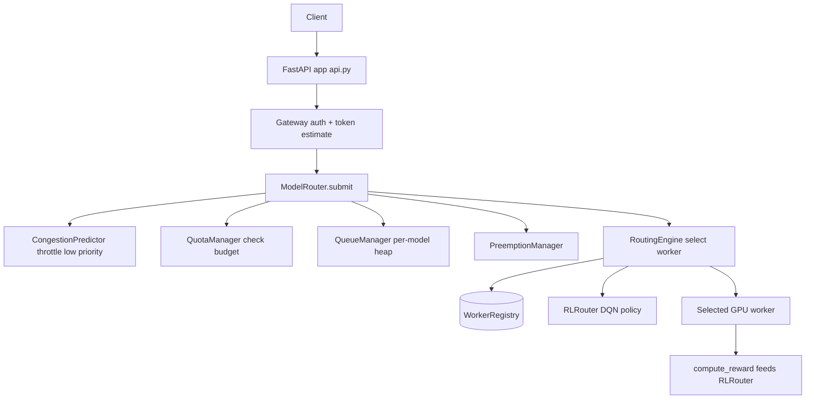

# Model Routing Layer

A capacity-aware scheduling and routing layer for LLM inference clusters, built from
scratch in Python. It accepts inference requests through a FastAPI gateway, places them on
per-model priority queues, and routes each one to the best GPU worker using load, token
budget, SLA, cost, or a learned reinforcement-learning policy. Multi-tenant quotas,
preemption, congestion prediction, and canary traffic splitting are all implemented in
process with NumPy — no external inference backend required.

## Features

- **FastAPI gateway** — authenticates tenants by API key, tags priority and SLA, estimates
  token cost, and submits to the scheduler (`Gateway`, `TenantAuthenticator`, `api.py`).
- **Six routing strategies** — `least_loaded`, `round_robin`, `token_based`, `sla_based`,
  `weighted`, and learned `rl` selection (`RoutingEngine` in `scheduler/router.py`).
- **Per-model priority queues** — heap-ordered by a score that blends priority, request age,
  and SLA urgency (`QueueManager`, `QueuedRequest`).
- **Worker registry** — TTL-based registration with a per-model index, heartbeat tracking,
  and aggregate capacity reporting (`WorkerRegistry`, `CapacityTracker`).
- **Reinforcement-learning router** — a NumPy DQN with an experience replay buffer that
  learns worker selection from observed latency and SLA rewards (`DQNPolicy`, `RLRouter`).
- **Congestion prediction** — a NumPy sigmoid network over arrival/service-rate features
  that throttles low-priority work when it predicts congestion (`CongestionPredictor`).
- **Multi-tenant quotas and rate limiting** — monthly token budgets plus token-bucket
  RPS/TPM limits (`QuotaManager`, `RateLimiter`).
- **Priority preemption** — CRITICAL/HIGH requests can preempt and requeue lower-priority
  in-flight work (`PreemptionManager`).
- **Canary traffic splitting** — consistent-hash routing of a configurable traffic
  percentage to a canary deployment (`TrafficSplitter`).
- **Cost and latency modelling** — dollar cost, GPU-second compute units, and a
  historical-median latency predictor (`CostComputer`, `LatencyPredictor`).

## Architecture



| Component | Module | Responsibility |
|-----------|--------|----------------|
| Gateway | `gateway/gateway.py` | Authenticate tenant, compute priority/SLA, estimate tokens |
| Rate limiter | `gateway/rate_limiter.py` | Token-bucket RPS and TPM enforcement per tenant |
| Token estimator | `gateway/token_estimator.py` | Estimate input + output tokens (pluggable tokenizers) |
| Queue manager | `scheduler/queue.py` | Per-model priority heap with age and SLA boosting |
| Routing engine | `scheduler/router.py` | Worker selection across six strategies |
| Cost computer | `scheduler/cost.py` | Dollar cost, compute units, latency prediction |
| Worker registry | `registry/workers.py` | Registration, model index, capacity aggregation |
| Health checker | `registry/health.py` | Heartbeat staleness checks, GPU metrics |
| RL router | `optimization/rl_router.py` | DQN policy + experience replay for routing |
| Congestion predictor | `optimization/congestion.py` | Predict and throttle congested models |
| Quota manager | `enterprise/quotas.py` | Monthly token-budget enforcement |
| Preemption | `enterprise/preemption.py` | Preempt and requeue lower-priority work |
| Traffic splitter | `enterprise/traffic_split.py` | Consistent-hash canary routing |
| Orchestrator | `router.py` | Wires all components, runs the submit pipeline |

## Quick Start

### Prerequisites

- Python 3.11+
- No external services are required to run the tests or the in-process router. The optional
  `docker-compose.yml` provisions Redis and PostgreSQL for experimentation only.

### Installation

```bash
pip install -e ".[dev]"
```

### Running

```bash
uvicorn modelrouter.api:create_app --factory --host 0.0.0.0 --port 8000
```

```bash
# Register a worker, then submit an inference request
curl -X POST localhost:8000/workers/register \
  -H 'content-type: application/json' \
  -d '{"worker_id":"w1","host":"localhost","port":8080,"models":["gpt-4"]}'

curl -X POST localhost:8000/v1/inference \
  -H 'content-type: application/json' \
  -d '{"model":"gpt-4","prompt":"Hello","priority":"NORMAL"}'
```

## Usage

```python
import asyncio
from modelrouter import create_router, InferenceRequest, Priority, generate_id

async def main():
    router = create_router(routing_strategy="least_loaded")

    await router.register_worker(
        worker_id="worker-1", host="localhost", port=8080,
        models=["gpt-4"], token_budget=100_000,
    )
    router.register_tenant(
        tenant_id="tenant-1", name="Demo", api_key="test-key",
    )

    request = InferenceRequest(
        request_id=generate_id(), tenant_id="tenant-1", model="gpt-4",
        prompt="What is 2 + 2?", max_tokens=50, temperature=0.7,
        priority=Priority.NORMAL, estimated_tokens=65,
    )
    response = await router.submit(request)
    print(response.worker_id, response.tokens_used)

    # Switch to the learned RL policy at runtime
    router.set_routing_strategy("rl")

asyncio.run(main())
```

## What's Real vs Simulated

- **Real:** Gateway authentication, priority/SLA assignment, token-bucket rate limiting,
  per-model priority queueing, all six routing strategies, the DQN RL router and replay
  buffer, the congestion-prediction network, quota enforcement, preemption, canary
  traffic splitting, capacity aggregation, and the cost/latency models. All are pure Python
  + NumPy and fully exercised by the test suite.
- **Simulated / requires credentials:** Worker execution is mocked — `_execute_on_worker`
  sleeps briefly and returns a synthetic `InferenceResponse` rather than calling a real
  inference backend. GPU metrics in `GPUMonitor.collect_metrics` and the worker ping in
  `HealthChecker` return fixed values (production would use `pynvml`/HTTP). The registry,
  rate limiter, and quota stores are in-memory; the Redis/PostgreSQL services in
  `docker-compose.yml` are not wired into the running code.

## Testing

```bash
pytest tests/ -v
```

The suite (182 tests across `test_router.py`, `test_scheduler.py`, `test_gateway.py`,
`test_model_router.py`, `test_optimization.py`, `test_api.py`) covers each routing strategy,
queue ordering, rate limiting, quota and preemption logic, the RL and congestion networks,
and the FastAPI endpoints. No external services are needed.

## Project Structure

```
29-model-routing-layer/
  README.md                     # This file
  src/modelrouter/
    api.py                      # FastAPI app and endpoints
    router.py                   # ModelRouter orchestrator
    schemas.py                  # Dataclasses and enums
    gateway/                    # Auth, rate limiting, token estimation
    scheduler/                  # Queue, cost, routing engine
    registry/                   # Worker registry, health, GPU monitor
    enterprise/                 # Quotas, preemption, traffic splitting
    optimization/               # RL router, congestion prediction
  tests/                        # Pytest suite (182 tests)
  docs/
    BLUEPRINT.md                # Full architecture and design
    SETUP.md                    # Environment setup
```

## License

MIT — see [LICENSE](../LICENSE)
