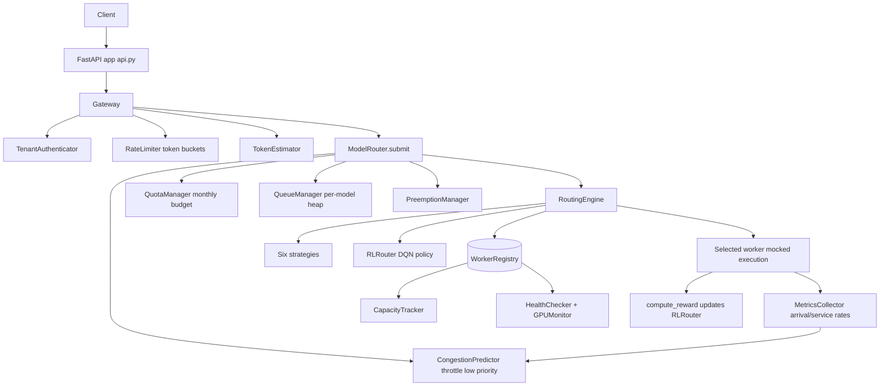

# Model Routing Layer

## Overview

The Model Routing Layer is a capacity-aware scheduling and routing system for LLM inference
clusters. It sits in front of a pool of GPU workers and decides, for every inference
request, which worker should serve it — balancing current load, token budgets, SLA
deadlines, dollar cost, and a learned policy. Everything is implemented from scratch in
Python with NumPy; there is no dependency on an external inference engine or model-serving
framework to run the system or its tests.

The project is a study in the engineering that lives between an API gateway and a fleet of
inference workers:

- **Admission control** — authentication, priority assignment, rate limiting, and quota
  enforcement decide whether a request enters the system at all.
- **Queueing** — admitted requests are placed on per-model priority heaps whose ordering
  blends static priority with request age and SLA urgency.
- **Routing** — a routing engine chooses a worker using one of six strategies, including a
  reinforcement-learning policy that learns from observed latency.
- **Capacity awareness** — a worker registry tracks GPU memory, token budgets, and
  heartbeats, and a congestion predictor throttles low-priority traffic before queues
  blow up.
- **Operational features** — preemption of low-priority work for urgent requests and
  consistent-hash canary traffic splitting.

The concepts it teaches: load balancing, queueing theory, token-bucket rate limiting,
multi-tenant quota accounting, priority preemption, online learning for routing (DQN), and
binary-classification congestion prediction — all wired into a single asyncio pipeline.

## Architecture



The request lifecycle, top to bottom:

1. **Gateway intake.** `Gateway.handle_request` authenticates the tenant by API key,
   derives a `Priority` and SLA deadline, checks the `RateLimiter`, estimates token cost,
   and calls `ModelRouter.submit`. The FastAPI layer (`api.py`) offers a typed
   `/v1/inference` endpoint that performs the same construction directly.
2. **Admission.** `ModelRouter.submit` first asks the `CongestionPredictor` whether the
   target model is congested; for `LOW`/`BATCH` priority it raises `CongestionThrottled`.
   It records an arrival with the `MetricsCollector`, then enforces the tenant quota.
3. **Queueing.** The request is pushed onto the per-model heap in `QueueManager`.
4. **Preemption.** For `CRITICAL`/`HIGH` priority, the `PreemptionManager` may cancel and
   requeue a lower-priority in-flight request on the same model.
5. **Routing.** The `RoutingEngine` pulls healthy workers for the model from the
   `WorkerRegistry` and selects one via the configured strategy.
6. **Execution and feedback.** Execution is mocked; on completion the system records a
   service event, computes a reward from observed latency versus the SLA, updates the
   `RLRouter`, records tenant usage, and appends a metric record.

The orchestration is a single async method, `ModelRouter.submit`, which makes the ordering
of these stages explicit:

```python
async def submit(self, request):
    start_time = time.time()
    if request.priority.value >= Priority.LOW.value:
        if self.congestion_predictor.should_throttle(request.model):
            raise CongestionThrottled(...)
    self.metrics_collector.record_arrival(request.model)
    await self.quota_manager.check_quota(request.tenant_id, request)
    await self.queue_manager.enqueue(request)
    if request.priority.value <= Priority.HIGH.value:
        await self.preemption_manager.maybe_preempt(request, request.model)
    worker = await self.routing_engine.route(request)
    response = await self._execute_on_worker(request, worker)
    self.metrics_collector.record_completion(request.model)
    latency = (time.time() - start_time) * 1000
    reward = RLRouter.compute_reward(latency, request.sla_deadline_ms)
    self.rl_router.update(request.request_id, reward)
    await self.quota_manager.record_usage(request.tenant_id, response.tokens_used)
    self._record_metric(request, response, latency)
    return response
```

The router constructor wires all subsystems together and sizes the RL state vector to
`4 + max_workers*6` dims (`max_workers=16`, so 100 dims) with a matching action dimension.

## Core Components

### Gateway

`gateway/gateway.py` contains `TenantAuthenticator` and `Gateway`. The authenticator keeps a
dict of `Tenant` objects and an `api_key -> tenant_id` index; `authenticate` raises
`AuthenticationError` on a missing or unknown key. `Gateway.handle_request` orchestrates
auth, request construction, rate-limit check, token estimation, and submission, recording a
small metrics list along the way.

Priority and SLA are derived in `_compute_priority` (explicit `priority` field or the
tenant default) and `_compute_sla`, which maps each priority to a default deadline that a
tenant can override:

```python
sla_map = {
    Priority.CRITICAL: 1000,    # 1s
    Priority.HIGH: 3000,        # 3s
    Priority.NORMAL: 10000,     # 10s
    Priority.LOW: 30000,        # 30s
    Priority.BATCH: 300000,     # 5min
}
```

### Rate limiter

`gateway/rate_limiter.py` implements a sliding-window token bucket. `check` enforces two
limits per tenant: requests-per-second (`window=1`) and tokens-per-minute (`window=60`,
`cost=estimated_tokens`). The window logic counts timestamped entries inside the window and
rejects once the cost would exceed the limit:

```python
async def _check_bucket(self, key, limit, window, cost=1):
    now = time.time()
    window_start = now - window
    entries = await self.storage.get_range(key, window_start, now)
    if len(entries) + cost > limit:
        return False
    for _ in range(cost):
        await self.storage.add_entry(key, now, f"{now}:{generate_id()}")
    await self.storage.set_expiry(key, window * 2)
    return True
```

Defaults are 100 RPS and 100 000 TPM; `set_limits` overrides per tenant. `RateLimitExceeded`
is raised on violation. Storage is the in-memory `InMemoryStorage`, which evicts a bucket
once its expiry passes. Because RPS uses `cost=1` and TPM uses `cost=estimated_tokens`, a
single large request can pass the RPS check yet still be throttled by the token budget.

### Token estimator

`gateway/token_estimator.py` estimates total tokens as input + `max_tokens`. If a
model-specific tokenizer is registered it uses `tokenizer.encode`; otherwise it falls back
to a `len(prompt) // 4` heuristic. It also exposes `estimate_input_tokens` and
`estimate_cost` (given a `ModelPricing`). A `MockTokenizer` is provided for tests.

### Queue manager

`scheduler/queue.py` maintains one binary heap of `QueuedRequest` per model, each guarded by
an `asyncio.Lock`. The priority score (lower is served first) is computed by
`_compute_priority_score`:

```python
base = request.priority.value                 # 0 (CRITICAL) .. 4 (BATCH)
age = time.time() - request.created_at
age_bonus = -min(age / 60, 1.0)               # up to -1 after 60s waiting
if request.sla_deadline_ms:
    remaining = request.sla_deadline_ms - (time.time() - request.created_at) * 1000
    urgency = -max(0, 1 - remaining / request.sla_deadline_ms)
else:
    urgency = 0
score = base + age_bonus + urgency
```

`QueuedRequest.__lt__` compares on this score so `heapq` orders correctly. The interesting
property is that the score is computed once at enqueue time but encodes *expected* future
urgency: an old `BATCH` request (base 4) can overtake a fresh `LOW` request (base 3) once
`age_bonus` and `urgency` accumulate, which prevents starvation of low-priority traffic
under sustained high-priority load.

`enqueue`, `dequeue`, `peek`, and `remove` are all async and guarded by a per-model
`asyncio.Lock`. `remove` is O(n): it filters the list and re-heapifies, which is acceptable
because it is only used on the preemption path. `get_queue_stats` reports depth, the age of
the oldest entry in milliseconds, and a per-priority breakdown:

```python
async def get_queue_stats(self, model):
    queue = self.queues.get(model) or []
    if not queue:
        return {"depth": 0, "oldest_ms": 0, "by_priority": {}}
    oldest = min(q.enqueue_time for q in queue)
    return {
        "depth": len(queue),
        "oldest_ms": int((time.time() - oldest) * 1000),
        "by_priority": self._count_by_priority(queue),
    }
```

### Cost computer and latency predictor

`scheduler/cost.py` holds `LatencyPredictor` and `CostComputer`. The predictor keys
historical `(tokens, latency)` samples by `f"{model}:{worker_type}"`, returns the median of
similar samples (within ±20% token count) or a `tokens * 10ms` fallback, then scales by a
load factor (`1 + load*0.5`) and a queue factor (`1 + queue_depth*0.1`). It retains the last
1000 samples per key.

The latency prediction blends history with live worker state:

```python
def predict(self, request, worker):
    historical = self._get_similar(request.model,
                                   (request.estimated_tokens * 0.8,
                                    request.estimated_tokens * 1.2),
                                   worker.worker_type)
    if historical:
        s = sorted(historical); base = s[len(s) // 2]   # median
    else:
        base = request.estimated_tokens * 10            # 10ms/token fallback
    load_factor = 1 + worker.current_load * 0.5
    queue_factor = 1 + worker.queue_depth * 0.1
    return int(base * load_factor * queue_factor)
```

`CostComputer.compute` produces a `RequestCost` with token count, GPU-second compute units
(`tokens * 0.001 / performance_factor`), predicted latency, and a dollar cost. The dollar
cost splits estimated tokens into input (`estimated_tokens - max_tokens`) and output
(`max_tokens`) and applies the per-model `ModelPricing` (default `$0.01`/1k input,
`$0.03`/1k output, plus an optional per-compute-unit term). Pricing is configurable per
model via `set_pricing`.

### Routing engine

`scheduler/router.py` defines `RoutingEngine.route`, which fetches `healthy` workers for the
request's model and dispatches on `self.strategy`. The six strategies:

- **`least_loaded`** — `min(workers, key=current_load)`.
- **`round_robin`** — per-model rotating index.
- **`token_based`** — `max` available token budget (`token_budget - tokens_in_flight`).
- **`sla_based`** — predicts latency per worker, keeps those under 80% of the deadline, and
  among those picks the least loaded; otherwise the fastest predicted.
- **`weighted`** — a normalized weighted sum of load (0.4), latency (0.3), cost (0.2), and
  SLA pressure (0.1); lowest score wins.
- **`rl`** — delegates to `RLRouter` (requires an injected router; raises otherwise).

| Strategy | Selection rule | Best for | Trade-off |
|----------|----------------|----------|-----------|
| `least_loaded` | min `current_load` | General use | Ignores cost and latency |
| `round_robin` | rotating index | Homogeneous fleets | Ignores live load |
| `token_based` | max free token budget | Token-budgeted workers | Ignores latency |
| `sla_based` | viable-by-deadline, then least loaded | Latency-critical | May leave capacity idle |
| `weighted` | weighted load/latency/cost/SLA | Mixed objectives | Weights need tuning |
| `rl` | argmax learned Q-values | Adaptive workloads | Needs reward signal to learn |

The SLA strategy is the most involved: it predicts latency for every candidate, keeps only
those expected to finish within 80% of the deadline (a 20% safety buffer), and among the
viable set returns the least loaded; if none are viable it returns the fastest predicted
worker so the request still gets its best shot:

```python
def _sla_based(self, request, workers):
    if not request.sla_deadline_ms:
        return self._least_loaded(request, workers)
    predictions = [(w, self.cost_computer.latency_predictor.predict(request, w))
                   for w in workers]
    viable = [(w, lat) for w, lat in predictions
              if lat < request.sla_deadline_ms * 0.8]
    if viable:
        return min(viable, key=lambda x: x[0].current_load)[0]
    return min(predictions, key=lambda x: x[1])[0]
```

The weighted strategy normalizes load, latency (to a 10s scale), cost (to a $0.10 scale),
and SLA pressure into a single score with weights `0.4 / 0.3 / 0.2 / 0.1` and picks the
minimum. Routing raises `NoWorkersAvailable` when no healthy worker serves the model.
`LocalityAwareStrategy` is a separate selector that prefers a worker holding a cached context
key (from `request.metadata["context_key"]`), falling back to least loaded — useful for
KV-cache affinity where a follow-up turn should land on the worker holding the conversation.

### Worker registry, capacity, and health

`registry/workers.py` defines `WorkerRegistry` over a pluggable async storage
(`InMemoryStorage` by default). Workers are stored under `worker:{id}` with a 60s TTL
(requiring heartbeats) and indexed by model under `model:{model}:workers`. `get_workers`
filters by model and status; `update_load`/`heartbeat` refresh load and reset the TTL.
`CapacityTracker.get_capacity` aggregates a model's workers into a `CapacityInfo` (total and
healthy workers, total/available token budget, utilization, GPU memory totals).

Capacity aggregation reduces a model's workers to a single snapshot used by the `/capacity`
endpoints and by operators:

```python
total_token_budget = sum(w.token_budget for w in workers)
tokens_in_flight = sum(w.tokens_in_flight for w in workers)
return CapacityInfo(
    total_workers=len(workers),
    healthy_workers=len([w for w in workers if w.status == "healthy"]),
    total_token_budget=total_token_budget,
    available_tokens=total_token_budget - tokens_in_flight,
    utilization=tokens_in_flight / total_token_budget if total_token_budget else 0,
    gpu_memory_total_mb=sum(w.gpu_info.memory_total_mb for w in workers),
    gpu_memory_used_mb=sum(w.gpu_info.memory_used_mb for w in workers),
)
```

`registry/health.py` provides `GPUMonitor` (returns fixed `GPUInfo` — production would call
`pynvml`) and `HealthChecker`, which flags a worker unhealthy after `unhealthy_threshold`
consecutive failures and treats a heartbeat older than 30s as stale:

```python
async def _update_status(self, worker_id, is_healthy):
    if is_healthy:
        self.failure_counts[worker_id] = 0
        await self.registry.update_status(worker_id, "healthy")
    else:
        self.failure_counts[worker_id] = self.failure_counts.get(worker_id, 0) + 1
        if self.failure_counts[worker_id] >= self.unhealthy_threshold:
            await self.registry.update_status(worker_id, "unhealthy")
```

The hysteresis (N consecutive failures, reset on success) avoids flapping a worker in and
out of rotation on a single transient miss. `check_once` runs a single sweep and returns a
per-worker health map; `start` runs the same sweep on a `check_interval` loop.

### RL router

`optimization/rl_router.py` implements an end-to-end DQN routing path in NumPy:

- **`ExperienceBuffer`** — a `deque(maxlen=capacity)` plus a `request_id -> experience`
  index for O(1) reward updates; supports random mini-batch sampling.
- **`DQNPolicy`** — a 2-hidden-layer ReLU network (Xavier init) over a state vector,
  emitting one Q-value per action. `select_action` is epsilon-greedy over the valid action
  count; `update` does a manual forward/backward MSE pass on taken actions.
- **`RLRouter`** — builds the state from request features (priority, tokens, temperature,
  SLA) and up to `max_workers` per-worker feature blocks (load, queue depth, token
  utilization, GPU utilization, memory, performance factor), selects an action, stores an
  experience, and later updates its reward.

The forward pass and epsilon-greedy selection:

```python
def forward(self, state):
    h1 = np.maximum(0, state @ self.W1 + self.b1)   # ReLU
    h2 = np.maximum(0, h1 @ self.W2 + self.b2)       # ReLU
    return h2 @ self.W3 + self.b3                     # Q-values

def select_action(self, state, num_valid_actions=None):
    n = num_valid_actions or self.action_dim
    if np.random.random() < self.epsilon:
        return int(np.random.randint(0, n))
    return int(np.argmax(self.forward(state)[:n]))
```

The reward is shaped to trade raw speed against deadline satisfaction:

```python
@staticmethod
def compute_reward(latency_ms, sla_deadline_ms=None):
    reward = -latency_ms / 1000.0
    if sla_deadline_ms is not None:
        reward += 1.0 if latency_ms <= sla_deadline_ms else -2.0
    return reward
```

Because the buffer is indexed by `request_id`, the asymmetric `+1.0 / -2.0` SLA term can be
applied after the request completes — `update(request_id, reward)` looks up the stored
experience in O(1), sets its reward, and marks it `done`. `train` then samples a mini-batch
of completed experiences and runs one gradient step. The action space is masked to the
number of currently available workers so the policy never picks a non-existent worker.

### Congestion predictor

`optimization/congestion.py` predicts queue blow-ups before they happen:

- **`MetricsCollector`** keeps rolling windows of arrivals, completions, and snapshots per
  model and derives arrival/service rates over a configurable window.
- **`CongestionModel`** is a single-hidden-layer NumPy network (6→16→1) with a numerically
  stable sigmoid output, trained with binary cross-entropy. The backward pass uses the
  clean `prob - label` gradient of BCE-after-sigmoid:

  ```python
  prob = self._sigmoid(h @ self.W2 + self.b2)
  loss = -np.mean(labels * np.log(prob_clipped)
                  + (1 - labels) * np.log(1 - prob_clipped))
  dlogit = (prob - labels) / batch_size      # BCE+sigmoid gradient
  dh = (dlogit @ self.W2.T) * (h > 0)        # ReLU derivative
  ```
- **`CongestionPredictor`** extracts a 6-feature vector (normalized queue depth, queue
  trend slope, arrival rate, service rate, arrival/service ratio, normalized latency),
  returns `0.0` until at least 3 observations exist, and `should_throttle` fires when the
  predicted probability exceeds 0.8.

The queue-trend feature is a small linear-regression slope over the last few snapshots, so
the predictor responds to a *rising* queue before it is actually full — the key reason
throttling is predictive rather than reactive:

```python
if len(metrics) >= 2:
    depths = [m.queue_depth for m in metrics[-5:]]
    x = np.arange(len(depths)); y = np.array(depths, dtype=float)
    denom = np.sum((x - x.mean()) ** 2)
    if denom > 0:
        features[1] = np.sum((x - x.mean()) * (y - y.mean())) / denom / 100.0
features[4] = features[2] / max(features[3], 1e-6)   # arrival / service ratio
```

The `should_throttle` gate is consulted at the very top of `ModelRouter.submit`, and only
for `LOW`/`BATCH` priority — urgent traffic is never throttled. The model can be trained
online via `train_on_observation(model_name, was_congested)`, closing the loop between
predicted and observed congestion.

### Enterprise features

`enterprise/quotas.py` enforces a monthly token budget per tenant. `check_quota` projects
the request's estimated tokens against accumulated usage and raises `QuotaExceeded` when it
would overshoot the budget; `record_usage` accumulates consumption after the response is
produced, and `get_usage_report` returns a `UsageReport` with remaining tokens and
utilization:

```python
async def check_quota(self, tenant_id, request):
    quota = await self._get_quota(tenant_id)
    usage = await self._get_usage(tenant_id)
    if usage.tokens_used + request.estimated_tokens > quota.monthly_token_budget:
        raise QuotaExceeded("Monthly token budget exceeded")
    return True
```

Note the ordering in `submit`: quota is checked *before* enqueue and recorded *after*
execution, so a rejected request never consumes budget, and budget reflects real tokens
served rather than estimates. Defaults: 100 RPS, 100k TPM, 10M monthly tokens. Both the
quota store and rate-limiter store are in-memory; swapping in Redis/PostgreSQL backends
would make the limits cluster-wide.

`enterprise/preemption.py` tracks in-flight requests and, for `CRITICAL`/`HIGH` arrivals,
finds same-model lower-priority in-flight work, cancels the lowest-priority victim, marks it
preempted, and requeues it. The victim selection deliberately targets the *lowest* priority
candidate so the system gives up as little as possible:

```python
async def maybe_preempt(self, high_priority_request, model):
    if high_priority_request.priority.value > Priority.HIGH.value:
        return False
    candidates = await self._find_preemption_candidates(
        model, high_priority_request.priority)
    if not candidates:
        return False
    victim = max(candidates, key=lambda r: r.priority.value)  # lowest priority
    await self._preempt(victim)
    return True
```

A preempted request is tagged with `metadata["preempted"]` and a timestamp, removed from the
in-flight set, and re-enqueued so it is retried rather than dropped. `_cancel_execution` is a
stub in this in-process build; in production it would signal the worker to abort.

`enterprise/traffic_split.py` routes a configurable percentage of a model's traffic to a
canary deployment using consistent hashing of `f"{tenant_id}:{canary_id}"`:

```python
hash_val = int(hashlib.md5(hash_input.encode()).hexdigest(), 16) % 100
return "canary" if hash_val < canary.traffic_percentage else "stable"
```

Hashing on `tenant_id` (not per-request) means a tenant is *stably* assigned to stable or
canary for the lifetime of a rollout, so a user sees consistent behaviour. The splitter
supports `create_canary`, `update_traffic`, `complete_canary` (ramp to 100%), and
`rollback_canary` (deactivate, sending all traffic back to stable).

### Concurrency and consistency

The whole pipeline is `asyncio`-based and single-process. Shared mutable state is protected
where contention matters:

- **Queues** — each per-model heap has its own `asyncio.Lock`, so enqueue/dequeue/remove on
  the same model are serialized while different models proceed independently.
- **Registry TTLs** — worker entries expire after 60s; the in-memory storage lazily evicts
  expired keys on read, so a worker that stops heartbeating disappears from routing without
  an explicit reaper.
- **Bounded state** — the experience buffer (`deque(maxlen=...)`), latency-history windows
  (last 1000 per key), and metrics windows all self-trim, so long-running processes do not
  grow unbounded.
- **Reward attribution** — the experience buffer's `request_id` index lets a reward be
  attached to the exact decision that produced it, even though many requests are in flight
  concurrently and complete out of order.

Because there is no cross-process coordination, rate limits, quotas, and the learned policy
are per-instance. Making them cluster-wide is purely a matter of swapping the in-memory
stores for shared backends; the component interfaces are written against an async storage
protocol precisely so this substitution is local.

## Data Structures

All core types are dataclasses and enums in `schemas.py`:

```python
class Priority(Enum):
    CRITICAL = 0; HIGH = 1; NORMAL = 2; LOW = 3; BATCH = 4

class WorkerStatus(Enum):
    HEALTHY = "healthy"; UNHEALTHY = "unhealthy"
    DRAINING = "draining"; OFFLINE = "offline"

@dataclass
class InferenceRequest:
    request_id: str
    tenant_id: str
    model: str
    prompt: str
    max_tokens: int
    temperature: float
    priority: Priority
    sla_deadline_ms: int = None
    metadata: dict = field(default_factory=dict)
    created_at: float = field(default_factory=time.time)
    estimated_tokens: int = 0

@dataclass
class InferenceResponse:
    request_id: str
    text: str
    tokens_used: int
    latency_ms: int
    worker_id: str
    model: str

@dataclass
class WorkerInfo:
    worker_id: str
    host: str
    port: int
    models: list[str]
    gpu_info: GPUInfo
    current_load: float
    queue_depth: int
    tokens_in_flight: int
    token_budget: int
    status: str
    last_heartbeat: float
    performance_factor: float = 1.0
    worker_type: str = "standard"

@dataclass
class GPUInfo:
    device_name: str
    memory_total_mb: int
    memory_used_mb: int
    utilization_percent: float
    temperature_celsius: int
```

Supporting records:

```python
@dataclass
class Tenant:
    id: str; name: str; api_key: str
    default_priority: Priority = Priority.NORMAL
    sla_overrides: dict = field(default_factory=dict)

@dataclass
class TenantQuota:
    tenant_id: str
    requests_per_second: int
    tokens_per_minute: int
    monthly_token_budget: int
    priority_access: bool = False
    dedicated_workers: list[str] = field(default_factory=list)

@dataclass
class RequestCost:
    tokens: int
    compute_units: float
    estimated_latency_ms: int
    dollar_cost: float

@dataclass
class QueuedRequest:
    request: InferenceRequest
    enqueue_time: float
    priority_score: float
    def __lt__(self, other):
        return self.priority_score < other.priority_score

@dataclass
class RLExperience:
    request_id: str
    state: Any            # numpy array
    action: int
    reward: float = 0.0
    next_state: Any = None
    done: bool = False
    timestamp: float = field(default_factory=time.time)

@dataclass
class CongestionMetrics:
    model: str
    timestamp: float
    queue_depth: int
    arrival_rate: float
    service_rate: float
    avg_latency_ms: float = 0.0
```

The RL **state layout** is fixed at `4 + max_workers*6` dims (100 for `max_workers=16`):

```
index   feature
0       priority / 4
1       estimated_tokens / 1000
2       temperature
3       sla_deadline_ms / 10000
4+i*6   worker i: current_load
5+i*6   worker i: queue_depth / 100
6+i*6   worker i: tokens_in_flight / token_budget
7+i*6   worker i: gpu_utilization / 100
8+i*6   worker i: gpu_mem_used / gpu_mem_total
9+i*6   worker i: performance_factor
```

## API Design

The public Python API is re-exported from `modelrouter/__init__.py`. The orchestrator:

```python
class ModelRouter:
    def __init__(self, routing_strategy="least_loaded", max_queue_depth=1000): ...
    async def submit(self, request: InferenceRequest) -> InferenceResponse: ...
    async def register_worker(self, worker_id, host, port, models, token_budget=100000) -> str: ...
    def register_tenant(self, tenant_id, name, api_key, monthly_budget=10000000) -> None: ...
    async def handle_request(self, raw_request: dict) -> InferenceResponse: ...
    def set_routing_strategy(self, strategy: str) -> None: ...
    async def get_capacity(self, model: str = None) -> dict: ...
    async def get_queue_stats(self) -> dict: ...
    def get_metrics(self, limit: int = 100) -> list[dict]: ...

def create_router(routing_strategy="least_loaded", max_queue_depth=1000) -> ModelRouter: ...
```

The FastAPI app is built by `create_app(router=None)` in `api.py`:

```
GET  /health                      -> {"status": "ok"}
POST /v1/inference                -> submit InferenceSubmitRequest, returns response fields
                                     (503 CongestionThrottled, 422 invalid priority)
POST /workers/register            -> register a worker, returns {"worker_id": ...}
GET  /workers                     -> list registered workers
GET  /capacity/{model}            -> CapacityInfo for one model
GET  /capacity                    -> CapacityInfo for all models
GET  /queue/stats                 -> per-model queue statistics
GET  /metrics?limit=N             -> recent routing metrics
```

`InferenceSubmitRequest` carries `model`, `prompt`, `max_tokens` (100), `temperature`
(0.7), `priority` ("NORMAL"), `tenant_id` ("default"), optional `sla_deadline_ms`, and
`metadata`; the endpoint fills the SLA from the same priority map as the gateway and
estimates tokens as `len(prompt)//4 + max_tokens`.

## Performance

The system targets sub-millisecond routing decisions: every strategy is an O(n) scan over
the healthy workers for a model (`n` is small), the queue is an O(log n) heap push/pop, and
the registry lookups are dict/set operations on in-memory storage. The RL forward pass is
two small dense matmuls (state dim 100, hidden 64), and the congestion forward pass is a
single 6→16→1 network — both negligible relative to real inference latency.

Memory is bounded by design: the experience buffer is a fixed-capacity deque (default
10 000), the latency predictor retains at most 1000 samples per `model:worker_type` key, and
the metrics collector trims arrivals/completions/snapshots outside its rolling window.
Worker entries carry a 60s TTL so dead workers age out without an explicit sweep.

Complexity of the hot paths:

| Operation | Cost | Notes |
|-----------|------|-------|
| Strategy selection | O(w) | `w` = healthy workers for the model |
| Queue enqueue/dequeue | O(log q) | heap operations, `q` = queue depth |
| Queue remove (preempt) | O(q) | filter + re-heapify; preemption path only |
| Registry get-by-model | O(w) | set membership then per-worker dict reads |
| RL forward pass | O(s·h + h·h + h·a) | s=100, h=64, a=16 — fixed-size matmuls |
| Congestion forward pass | O(f·h) | f=6, h=16 |
| Reward update | O(1) | dict lookup by `request_id` |

The design choices that support low routing latency are: keeping per-model worker lists
small and indexed, doing all scoring in plain arithmetic, computing the queue priority score
once at enqueue rather than re-sorting, and sizing both neural networks so a forward pass is
a handful of small dense products. Throughput is bounded in practice by the (real) inference
workers, not the router.

No throughput or latency benchmarks are claimed here because worker execution is mocked;
the meaningful, measured costs are the routing, queueing, and learning operations described
above, all of which the test suite exercises directly. The `latency_ms` field returned in
responses is a synthetic `estimated_tokens * 10` figure, not a measurement, and is treated
as such by the RL reward.

## Testing Strategy

The suite contains 182 tests. Coverage by area:

- **Routing (`test_router.py`, `test_model_router.py`)** — each strategy's selection
  criterion, dynamic strategy switching, `NoWorkersAvailable`, unknown-strategy errors,
  locality-aware selection, model-specific routing, failover to healthy workers, and the
  full `submit`/`handle_request` pipeline.
- **Scheduler (`test_scheduler.py`)** — priority-score ordering, age and SLA boosting,
  enqueue/dequeue/remove, queue stats, cost computation, and latency prediction.
- **Gateway (`test_gateway.py`)** — authentication success/failure, token-bucket RPS and
  TPM limits, token estimation, and priority/SLA derivation.
- **Optimization (`test_optimization.py`)** — experience buffer add/update/sample, DQN
  forward/select/update, reward computation, congestion feature extraction, the sigmoid
  network, and the throttle threshold.
- **API (`test_api.py`)** — the FastAPI endpoints, including the 503 path for congestion
  throttling and the 422 path for invalid priority.

Tests use in-memory storage and mocked execution, so the suite runs without any external
service. Async paths are driven with `asyncio.run` inside synchronous test functions and via
fixtures in `conftest.py`.

## References

- NGINX HTTP load balancing — https://nginx.org/en/docs/http/load_balancing.html
- Queueing theory — https://en.wikipedia.org/wiki/Queueing_theory
- Token bucket algorithm — https://en.wikipedia.org/wiki/Token_bucket
- Mnih et al., "Human-level control through deep reinforcement learning" (DQN), 2015
- Consistent hashing — https://en.wikipedia.org/wiki/Consistent_hashing
