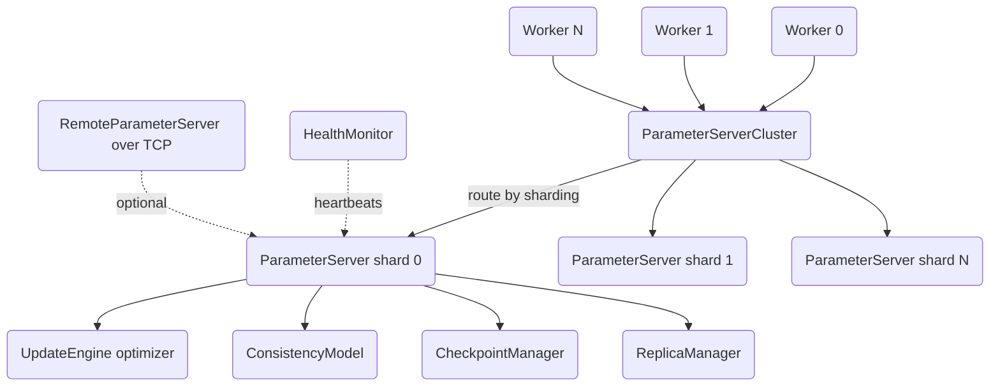

# Large-Scale Parameter Server with Model Sharding

A distributed parameter server for large-scale ML training, built from scratch in
Python on NumPy and `asyncio`. It shards model parameters across servers, applies
gradient updates under pluggable consistency models (Hogwild!, BSP, SSP), and
supports gradient compression, mixed precision, fault-tolerant checkpointing, and a
real TCP/RPC transport for cross-process workers.

## Features

- **Sharded parameter storage** — model parameters are distributed across servers by
  `UniformSharding` (hash), `RoundRobinSharding`, or `SizeBalancedSharding` (greedy
  least-loaded), each implementing the `ShardingStrategy` interface.
- **Push/pull cluster** — `ParameterServerCluster` routes each parameter to its owning
  `ParameterServer` shard and fans pulls/pushes out in parallel with `asyncio.gather`.
- **Three consistency models** — `HogwildConsistency` (apply immediately),
  `BSPConsistency` (barrier across all workers), and `SSPConsistency` (bounded
  staleness), behind a common `ConsistencyModel.can_apply` interface.
- **Gradient buffering** — updates a shard cannot yet apply are buffered per parameter
  and replayed when the consistency model later permits.
- **Optimizers** — `SGDEngine`, `AdamEngine` (with AMSGrad / decoupled weight decay),
  and `LARSEngine` (layer-wise adaptive rate scaling), all sharing the `UpdateEngine` API.
- **LR schedulers** — `StepLR`, `MultiStepLR`, `ExponentialLR`, `CosineAnnealingLR`,
  `WarmupLR`, `CosineWarmupLR`, `PolynomialLR`, and `OneCycleLR`.
- **Gradient compression** — `QuantizationCompressor` (1–8 bit), `TopKCompressor`, and
  `RandomKCompressor`, several with error-feedback accumulation.
- **Mixed precision** — `MixedPrecisionManager` handles FP16/FP32 conversion, loss
  scaling, overflow detection, and dynamic scale adjustment.
- **Fault tolerance** — `CheckpointManager` (rotating pickled checkpoints + JSON
  metadata), `ReplicaManager` (sync/async/quorum replication and failover), and
  `HealthMonitor` (heartbeat-based health tracking with callbacks).
- **Real network transport** — `serve_parameter_server` and `RemoteParameterServer`
  provide an `asyncio` length-prefixed RPC over TCP so a shard can be driven across
  processes or machines.
- **Adaptive staleness** — `StalenessController` and `AdaptiveSSP` track worker clocks
  and tune the staleness threshold toward a target.

## Architecture



| Component | Module | Responsibility |
|-----------|--------|----------------|
| Cluster | `server/cluster.py` | Route pull/push to shards, init sharding, aggregate stats |
| Shard | `server/parameter_server.py` | Store params, apply/buffer updates, track versions |
| Sharding | `server/sharding.py` | Assign parameters to shards (uniform / round-robin / size-balanced) |
| Worker | `worker/worker.py` | Pull params, compute gradients, push updates, run train loop |
| Optimizers | `optimizer/` | SGD, Adam, LARS update engines and LR schedulers |
| Consistency | `consistency/` | Hogwild!, BSP, SSP models and `ConsistencyManager` factory |
| Fault tolerance | `fault_tolerance/` | Checkpointing, replication/failover, health monitoring |
| Enterprise | `enterprise/` | Compression, mixed precision, staleness control, metrics |
| Transport | `transport.py` | Async length-prefixed RPC over TCP, remote shard proxy |
| Schemas | `schemas.py` | Dataclasses for shards, updates, workers, checkpoints |

## Quick Start

### Prerequisites

- Python 3.10+
- NumPy (the only runtime dependency). PyTorch is optional and not required for the
  library or tests.

### Installation

```bash
pip install -e ".[dev]"
```

### Running

This is a library, not a long-running service. Import it and drive a cluster directly,
or run the test suite (below). To run a shard over a real socket, use
`serve_parameter_server`.

## Usage

```python
import asyncio
import numpy as np
from paramserver import (
    ParameterServerCluster, Worker, AdamEngine, HogwildConsistency,
)
from paramserver.server.sharding import UniformSharding


async def main():
    # 4 shards, Adam optimizer, Hogwild! consistency, uniform sharding.
    cluster = ParameterServerCluster.create(
        num_servers=4,
        update_engine_factory=lambda: AdamEngine(lr=0.001),
        consistency_factory=HogwildConsistency,
        sharding_strategy=UniformSharding(),
    )

    params = {
        "layer1.weight": np.random.randn(128, 64).astype(np.float32),
        "layer1.bias": np.zeros(128, dtype=np.float32),
    }
    await cluster.initialize(params)

    # A worker computes gradients via a user-supplied function.
    def compute_gradients(pulled, batch):
        grads = {name: np.random.randn(*v.shape).astype(np.float32) * 0.01
                 for name, v in pulled.items()}
        return grads, 0.5  # (gradients, loss)

    worker = Worker(
        worker_id=0,
        ps_cluster=cluster,
        param_names=list(params.keys()),
        compute_gradients=compute_gradients,
    )

    loss = await worker.train_step(batch=None)
    print("step loss:", loss, "clock:", worker.clock)


asyncio.run(main())
```

Serving a single shard over a real TCP socket:

```python
from paramserver import ParameterServer, SGDEngine, HogwildConsistency
from paramserver.transport import serve_parameter_server, RemoteParameterServer

server = ParameterServer(0, SGDEngine(lr=0.01), HogwildConsistency())
await server.initialize({"w": np.zeros(8, dtype=np.float32)})
rpc = await serve_parameter_server(server, port=0)          # ephemeral port
remote = await RemoteParameterServer("127.0.0.1", rpc.port).connect()
await remote.push({"w": np.ones(8, dtype=np.float32)}, worker_id=1, clock=0)
```

## What's Real vs Simulated

- **Real:** The consistency models (Hogwild!, BSP, SSP), sharding strategies, gradient
  buffering/version tracking, optimizers (SGD, Adam, LARS), LR schedulers, gradient
  compression, mixed precision, checkpoint/replica/health managers, and metrics are all
  fully implemented in NumPy and exercised by the test suite. The `transport.py` RPC
  layer is genuinely networked: tests open real loopback TCP sockets and drive a shard
  end-to-end.
- **Simulated / in-process:** The high-level `ParameterServerCluster` and the consistency
  managers wire shards together with in-process `asyncio` primitives; they are not yet
  moved onto the transport, so the default multi-shard cluster runs in a single process.
  Workers compute gradients via a user-supplied `compute_gradients` function — no real
  model or autograd is included (`MockGradientComputer` and `DataBatchGenerator` produce
  random gradients/batches for testing). The transport uses `pickle` on the wire for
  NumPy payloads and is for trusted internal networks only.

## Testing

```bash
pytest tests/ -v
pytest tests/ --cov=src/paramserver --cov-report=term-missing
```

The suite has 412 test functions across 21 files (~5,800 lines) covering sharding,
push/pull and buffering, every consistency model, all optimizers and schedulers,
compression round-trips, mixed precision, checkpoint save/load/rotation, replication and
failover, health monitoring, metrics, staleness control, and the TCP transport. No
external services are required; transport tests bind to loopback only.

## Project Structure

```
30-parameter-server/
  README.md                     # this file
  pyproject.toml                # package metadata and pytest/coverage config
  src/paramserver/
    __init__.py                 # public exports
    schemas.py                  # ShardInfo, GradientUpdate, WorkerInfo, metadata
    transport.py                # async TCP RPC server/client and remote shard proxy
    server/                     # ParameterServer, ParameterServerCluster, sharding
    worker/                     # Worker, mock gradient/data helpers
    optimizer/                  # SGD, Adam, LARS, LR schedulers
    consistency/                # Hogwild!, BSP, SSP, ConsistencyManager
    fault_tolerance/            # checkpoint, replica, health
    enterprise/                 # compression, mixed precision, staleness, metrics
  tests/                        # 412 tests across 21 files
  docs/BLUEPRINT.md             # full architecture and design
```

## License

MIT — see [LICENSE](../LICENSE)
