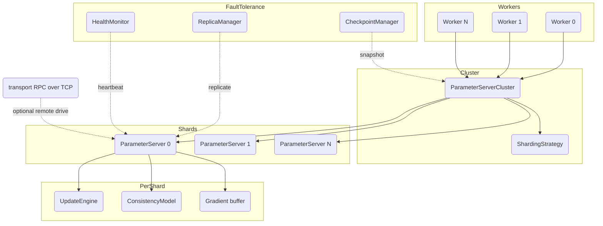

# Large-Scale Parameter Server with Model Sharding

## Overview

This project is a distributed **parameter server** for large-scale machine learning
training, written from scratch in Python on NumPy and the standard-library `asyncio`.
The parameter-server architecture splits a training job into two roles: a set of
*servers* that hold the authoritative model parameters, and a set of *workers* that pull
the current parameters, compute gradients on local data, and push those gradients back.
When a model is too large to fit on one machine, the parameters are **sharded** across
several servers, and each server owns and updates its slice.

The system is built to teach the core ideas of distributed optimization:

- **Sharding** — how to divide a parameter set across servers so memory and load are
  balanced, and how to route a pull/push to the right shard.
- **Consistency models** — the spectrum from fully asynchronous Hogwild!, through
  bounded-staleness SSP, to fully synchronous BSP, and the convergence-versus-throughput
  trade-off each one makes.
- **The update engine** — how SGD, Adam, and LARS apply gradients, and why per-parameter
  optimizer state (momentum, moments) must live on the server.
- **Fault tolerance** — checkpointing with rotation, replication with failover, and
  heartbeat-based health monitoring.
- **Communication efficiency** — gradient compression (quantization, top-K, random-K)
  and mixed-precision storage to reduce the bytes moved per step.
- **Real networking** — a minimal but genuine RPC layer over TCP, so a shard can be
  served on a socket and a worker can talk to it from another process.

Scope and non-scope. The code is a faithful, test-covered implementation of the control
plane and the numerics: sharding, push/pull, buffering, consistency, optimizers,
schedulers, compression, mixed precision, checkpoint/replica/health, metrics, and the
transport. It deliberately does **not** ship a real model or autograd engine — workers
take a user-supplied `compute_gradients` callable, and helper classes generate random
gradients and batches for tests. The high-level cluster wires shards together with
in-process `asyncio` primitives; only the `transport` module crosses a real socket. The
remainder of this document describes the design, the key data structures, the public
interfaces, performance considerations, and the testing strategy.

## Architecture



The pieces fit together in layers:

- **Workers** (`worker/worker.py`) hold no authoritative state. Each owns a logical
  `clock`, a list of parameter names, and a `compute_gradients` function. A training step
  pulls parameters from the cluster, calls the gradient function, and pushes the result.
- **The cluster** (`server/cluster.py`) is the routing layer. Given a sharding strategy
  and a set of `ParameterServer` shards, it computes the shard assignment once at
  `initialize`, then routes each parameter name in a pull/push to its owning shard and
  runs the per-shard calls concurrently with `asyncio.gather`.
- **The shard** (`server/parameter_server.py`) is the unit of authoritative storage. It
  holds the parameter arrays, per-parameter metadata (shape, dtype, version), a per-
  parameter `asyncio.Lock`, and a per-parameter gradient buffer. On push it consults the
  consistency model; if the update can apply it runs the update engine and bumps the
  version, otherwise it buffers the gradient for later replay.
- **The update engine** (`optimizer/`) is the optimizer. It is stateless across params
  except for per-parameter state keyed by a `param_id` string (`"{shard_id}:{name}"`),
  which lets momentum/moments persist correctly under sharding.
- **The consistency model** (`consistency/`) is a tiny strategy object: `can_apply(
  param_version, worker_clock) -> bool`. BSP and SSP additionally track per-worker
  clocks/barriers and expose `async` wait primitives.
- **Fault tolerance** (`fault_tolerance/`) sits beside the cluster: the checkpoint
  manager snapshots all parameters plus optimizer state, the replica manager mirrors
  updates and promotes a backup on failure, and the health monitor watches heartbeats.
- **The transport** (`transport.py`) is optional and orthogonal: it wraps a single shard
  in an RPC server and exposes a client proxy with the same `pull`/`push` surface.

A useful way to read the design is as a set of small, single-responsibility strategy
interfaces that the cluster and shard compose at runtime: `ShardingStrategy` decides
*where* a parameter lives, `ConsistencyModel` decides *when* an update may apply,
`UpdateEngine` decides *how* a gradient changes a parameter, `GradientCompressor` decides
*what* travels over the wire, and `ReplicationStrategy` decides *how durably* an update is
mirrored. None of these know about the others. That separation is the central pedagogical
point: distributed training is not one monolithic algorithm but a product of independent
choices along these axes, and the parameter-server architecture is what lets each choice be
swapped without touching the rest. The control flow that ties them together — pull, compute
on the worker, push, gate, apply or buffer, replicate, checkpoint — is the same regardless
of which concrete strategy occupies each slot.

## Core Components

### ParameterServerCluster

`ParameterServerCluster` (in `server/cluster.py`) is the coordination layer. It holds a
`Dict[int, ParameterServer]` keyed by shard id and a `ShardingStrategy`. The convenience
constructor builds the shards for you:

```python
cluster = ParameterServerCluster.create(
    num_servers=4,
    update_engine_factory=lambda: AdamEngine(lr=0.001),
    consistency_factory=HogwildConsistency,
    sharding_strategy=UniformSharding(),
)
```

`create` constructs one `ParameterServer` per shard, each with its own freshly built
update engine and consistency model (the factories ensure independent optimizer state
per shard). If no factories are passed it defaults to `SGDEngine(lr=0.01)` and
`HogwildConsistency`.

`initialize(model_params)` runs the sharding strategy once, producing a list of
`ShardInfo`, then hands each shard exactly the parameters assigned to it and awaits all
`server.initialize` calls together. After this the cluster is marked initialized and the
shard assignment is fixed.

`pull(param_names, worker_id)` groups the requested names by owning shard, issues one
`server.pull` per shard concurrently, then merges the returned `{name: (value, version)}`
maps down to `{name: value}`. `pull_with_versions` is identical but keeps versions.
`push(gradients, worker_id, clock)` mirrors this: it groups gradients by shard, pushes
each group concurrently, and returns the total number of updates actually applied
(summed across shards). Because routing is purely by name, an unknown parameter is simply
dropped rather than raising.

The routing itself is a group-then-scatter-gather:

```python
server_grads: Dict[int, Dict[str, np.ndarray]] = {}
for name, grad in gradients.items():
    server_grads.setdefault(self.sharding.get_shard_for_param(name), {})[name] = grad
results = await asyncio.gather(*[
    self.servers[sid].push(grads, worker_id, clock)
    for sid, grads in server_grads.items() if sid in self.servers
])
return sum(results)
```

This keeps the cluster oblivious to optimizer and consistency choices — those live
entirely inside each shard — so swapping `AdamEngine` for `LARSEngine`, or Hogwild! for
SSP, never touches routing code. The cluster also aggregates observability:
`get_cluster_stats` sums pulls/pushes across shards and includes each shard's own stats
dict, and `health_check` asks every shard.

#### Concurrency and correctness rationale

Two invariants make the design safe under concurrent workers. First, **isolation by
copy**: every value that leaves a shard (`pull`, snapshots) is `.copy()`-ed and every
value that enters (`initialize`, `push` buffering) is copied too, so no worker can hold a
reference that aliases live server memory. Second, **fine-grained locking**: each
parameter has its own `asyncio.Lock`, so the only serialization is between two updates to
the *same* parameter; updates to different parameters — even within one shard — proceed
concurrently. There is deliberately no global push lock, which is what permits Hogwild!'s
lock-free-style parallelism while still guaranteeing that a single parameter's
read-modify-write is atomic.

### ParameterServer (shard)

A `ParameterServer` (in `server/parameter_server.py`) owns a slice of the model. Its
internal state:

- `_params: Dict[str, np.ndarray]` — the authoritative values.
- `_metadata: Dict[str, ParameterMetadata]` — shape, dtype, monotonically increasing
  `version`, last-updating worker, and update counts.
- `_gradient_buffer: Dict[str, List[GradientUpdate]]` — gradients that could not yet be
  applied under the consistency model.
- `_locks: Dict[str, asyncio.Lock]` plus a `_global_lock` — concurrency control at
  per-parameter granularity, so independent parameters can be updated in parallel.

`initialize(params)` deep-copies each array (so the caller cannot mutate server state),
seeds metadata with `version=0`, and creates a lock and empty buffer per parameter.

`pull(param_names, worker_id, include_versions=True)` returns `{name: (copy, version)}`
under each parameter's lock. Values are always copied so a worker cannot accidentally
alias and mutate server memory.

`push(gradients, worker_id, clock)` is the heart of the shard. For each parameter, under
its lock:

1. Read the current `version`.
2. Ask `consistency.can_apply(version, clock)`. If **false**, wrap the gradient in a
   `GradientUpdate` and append it to that parameter's buffer; continue.
3. If **true**, call `update_engine.apply(params, grad, param_id="{shard_id}:{name}")`,
   replace the stored array, increment the version, and update metadata.
4. After applying, call `_process_buffer(name)` to drain any buffered gradients that the
   advanced version now permits.

The push core, abridged from `parameter_server.py`, makes the decision explicit:

```python
async with self._locks[name]:
    param_version = self._metadata[name].version
    if not self.consistency.can_apply(param_version, clock):
        self._gradient_buffer[name].append(
            GradientUpdate(worker_id, name, grad.copy(), clock)
        )
        continue
    self._params[name] = self.update_engine.apply(
        self._params[name], grad, param_id=f"{self.shard_id}:{name}"
    )
    meta = self._metadata[name]
    meta.version += 1
    meta.last_update_worker = worker_id
    meta.total_updates += 1
    applied += 1
    await self._process_buffer(name)
```

`_process_buffer` iterates the buffer, re-checking `can_apply` against the now-current
version for each buffered update, applying those that qualify and keeping the rest. This
is what gives BSP/SSP their semantics: gradients arrive eagerly but are released in the
order the consistency model allows.

Worked example. Suppose a shard owns `layer1.weight` at version 7 under SSP with
threshold 3, and the worker clocks are `{0: 4, 1: 5, 2: 8}`. A push from worker 2 at
clock 8 sees `min(clocks) == 4`, so staleness is `8 - 4 == 4 > 3` and the gradient is
buffered. Later, worker 0 advances to clock 6 (raising the minimum to 5); the next push
that triggers `_process_buffer` re-evaluates the buffered clock-8 update — `8 - 5 == 3 <=
3` — and now applies it, bumping the version to 8. No gradient is lost; it is simply
delayed until the staleness invariant holds.

Auxiliary methods support checkpointing and direct manipulation: `get_all_params` /
`get_all_metadata` (copying snapshots), `set_param` (used when restoring or when a
replica receives an update), `get_param`, and a `stats` property reporting param counts,
pull/push totals, buffered-update count, and status.

### Sharding strategies

All strategies implement `ShardingStrategy` (in `server/sharding.py`), which has two
required methods — `compute_shards(model_params, num_servers) -> List[ShardInfo]` and
`get_shard_for_param(param_name) -> int` — plus an optional `get_params_for_shard`.

- **`UniformSharding`** assigns each parameter to `hash(name) % num_servers`. It caches
  the name→shard and shard→names maps during `compute_shards`, and can answer
  `get_shard_for_param` for names it has not seen by hashing on demand (so a worker can
  ask about a parameter the cluster has not yet initialized). Distribution is even by
  *count of parameters*, not by size.
- **`RoundRobinSharding`** assigns parameters to `idx % num_servers` in iteration order.
  Unlike uniform, it raises on an unknown parameter, because round-robin has no stable
  hash to fall back on.
- **`SizeBalancedSharding`** sorts parameters largest-first and greedily places each on
  the shard with the fewest total parameters so far. This balances *memory*, which
  matters when parameter sizes vary widely (e.g. a large embedding table next to small
  bias vectors).

Each strategy fills in a `ShardInfo` per shard recording the assigned names, total
parameter count, and byte size (`value.nbytes`). The choice of strategy is a real
trade-off: uniform hashing is stateless and answers routing in O(1) without storing an
assignment for known parameters, but can leave one shard holding a few very large tensors;
size-balanced fixes the memory skew at the cost of an up-front sort and a stored
assignment that must be consulted for every route. Round-robin sits in between — trivial
and order-stable, but blind to size. Because all three satisfy the same interface, the
cluster's behavior is identical regardless of which is chosen; only the resulting balance
differs.

### Worker

`Worker` (in `worker/worker.py`) drives training from the client side. It is configured
with a worker id, the cluster, the parameter names it trains, and a `compute_gradients`
function with signature `(params, batch) -> (gradients, loss)`.

- `pull_params()` sets status to `PULLING`, pulls from the cluster, stores the result
  locally, and updates its heartbeat.
- `push_gradients(gradients)` pushes to the cluster, increments the worker's logical
  `clock`, and updates statistics.
- `train_step(batch)` is pull → compute → push, returning the loss.
- `train_loop(data_iterator, num_steps, log_interval, callback)` repeats `train_step`
  until the step limit or until the iterator is exhausted, accumulating loss and invoking
  an optional callback. It is cancellable via `stop()`.
- `async_train_step(batch)` demonstrates fire-and-forget pushing: it pulls, computes, and
  schedules the push as a background task without awaiting it, modeling the lower
  synchronization of asynchronous training.

The worker carries no authoritative state of its own beyond its logical `clock` and the
most recently pulled parameters, which is what makes it cheap to add or restart a worker:
it simply pulls the current parameters on its next step. The `WorkerInfo` dataclass tracks
its status (`IDLE`/`TRAINING`/`PULLING`/`PUSHING`/`FAILED`), heartbeat, and counters, and
`is_stale(timeout)` lets a health monitor flag a worker that has gone silent. The
`async_train_step` variant is the contrast that motivates the consistency models: by
scheduling the push as a background task and not awaiting it, a worker can race ahead of
the servers, which is precisely the behavior BSP forbids, SSP bounds, and Hogwild! allows.

`MockGradientComputer` and `DataBatchGenerator` are testing helpers that fabricate random
gradients (scaled small) and random feature/label batches; they let the whole pipeline be
exercised without a real model. The decreasing pseudo-loss `1 / (1 + 0.01 * step)` that
`MockGradientComputer` returns gives tests a deterministic, monotone signal to assert on
without any actual optimization happening.

### Optimizers (update engines)

Every optimizer implements `UpdateEngine.apply(params, gradients, param_id) -> ndarray`
plus `get_state` / `load_state` / `reset` for checkpointing. The `param_id` is essential
under sharding: it scopes per-parameter optimizer state so two parameters never share
momentum buffers.

- **`SGDEngine`** — plain SGD with optional momentum, weight decay, dampening, and
  Nesterov momentum. Weight decay is added into the gradient (`g += wd * params`); the
  velocity buffer is keyed per `param_id`; Nesterov requires positive momentum and zero
  dampening (validated at construction). The update is `params - lr * update` where
  `update` is the gradient, the velocity, or the Nesterov-corrected velocity.
- **`AdamEngine`** — maintains first/second moment estimates `m`, `v` and a per-parameter
  timestep `t`, applies bias correction, supports decoupled (AdamW-style) weight decay and
  the AMSGrad variant. It validates every hyperparameter at construction. The per-step
  update is:

  ```python
  self._t[pid] += 1; t = self._t[pid]
  if self.weight_decay != 0:
      params = params - self.lr * self.weight_decay * params      # decoupled
  self._m[pid] = self.beta1 * self._m[pid] + (1 - self.beta1) * gradients
  self._v[pid] = self.beta2 * self._v[pid] + (1 - self.beta2) * gradients ** 2
  m_hat = self._m[pid] / (1 - self.beta1 ** t)
  v_hat = self._v[pid] / (1 - self.beta2 ** t)
  denom = np.sqrt(self._v_max[pid] if self.amsgrad else v_hat) + self.eps
  return params - self.lr * m_hat / denom
  ```

- **`LARSEngine`** — Layer-wise Adaptive Rate Scaling. For each parameter it computes a
  trust ratio `trust_coeff * ||params|| / (||grad + wd*params|| + eps)`, scales the update
  by it, applies weight decay and momentum, and subtracts. When either norm is zero it
  falls back to a local rate of 1.0 to avoid a divide-by-zero. `compute_local_lr` exposes
  the trust ratio for inspection. LARS is what makes very-large-batch training stable,
  because the per-layer rate compensates for layers whose gradient and weight magnitudes
  differ by orders of magnitude.

All three keep optimizer state in plain dicts that `get_state` deep-copies and
`load_state` restores, which is exactly what `CheckpointManager` serializes per shard so a
resumed run continues with identical momentum/moment buffers.

### Learning-rate schedulers

`LRScheduler` (in `optimizer/schedulers.py`) tracks a step count and a base learning
rate; `step()` advances and returns the new rate via `get_lr()`. Implementations:
`StepLR`, `MultiStepLR`, `ExponentialLR`, `CosineAnnealingLR`, `WarmupLR` (linear warmup
that can wrap another scheduler), `CosineWarmupLR`, `PolynomialLR`, and `OneCycleLR`
(linear ramp to a peak, then cosine decay). These are pure functions of the step count,
so they are deterministic and trivially testable. `WarmupLR` and `CosineWarmupLR` show the
composition pattern: during warmup the rate climbs linearly from near-zero to the base
rate, after which `WarmupLR` delegates to an optional wrapped scheduler by temporarily
offsetting that scheduler's step count by `warmup_steps`. Warmup matters at scale because
the very first updates under a large effective batch are the most likely to diverge; a
short linear ramp lets the optimizer state (Adam moments, LARS trust ratios) settle before
the rate reaches full strength. A scheduler is advisory here — it computes a rate that a
training loop would feed into an engine's `set_lr`; the engines themselves do not own a
scheduler, which keeps the two concerns orthogonal.

### Consistency models

The strategy interface is one method: `can_apply(param_version, worker_clock) -> bool`,
returning whether a push at `worker_clock` may be applied to a parameter currently at
`param_version`. The three models live in `consistency/`:

- **`HogwildConsistency`** — always returns `True`. No synchronization, maximum
  parallelism; relies on updates being sparse/commutative enough to converge despite
  races. (See the Hogwild! paper in References.)
- **`BSPConsistency(num_workers)`** — Bulk Synchronous Parallel. It maintains
  `_barriers: Dict[clock, Set[worker_id]]`. `can_apply(_, clock)` is true only when every
  worker has arrived at that `clock`. `worker_arrived(worker_id, clock)` records arrival
  and sets an `asyncio.Event` once the barrier is full; `wait_for_barrier(clock, timeout)`
  lets a worker block until release. Helpers report barrier status, the slowest worker
  (the lowest-id worker missing from the latest incomplete barrier), and can clear old
  barriers (`clear_old_barriers(current_clock)`) so the `_barriers`/`_barrier_events` dicts
  do not accumulate one entry per past iteration. BSP gives the strongest convergence
  guarantee — every worker sees identical parameters each round — but its step time is set
  by the slowest worker, so a single straggler stalls the whole cohort.
- **`SSPConsistency(staleness_threshold)`** — Stale Synchronous Parallel. It tracks each
  worker's clock and allows a push when `worker_clock - min(all clocks) <=
  staleness_threshold`. With no workers registered it permits everything (bootstrap).
  `update_worker_clock` advances a worker monotonically (`max(old, new)`) under a lock and
  wakes any waiters; `wait_for_staleness` blocks a too-fast worker on an `asyncio.Event`,
  looping until the bound holds or a timeout fires. Rich introspection
  (`get_current_staleness`, per-worker staleness, `get_stats`) supports tuning. The core
  decision is one comparison:

  ```python
  def can_apply(self, param_version, worker_clock):
      if not self._worker_clocks:
          return True
      return worker_clock - min(self._worker_clocks.values()) <= self.staleness_threshold
  ```

The three models form a spectrum on one axis — how stale a read may be before an update
is gated. Hogwild! sets the bound to infinity, BSP sets it to zero (everyone must be on
the same clock), and SSP sets it to a finite `staleness_threshold`. Because they share
the `can_apply` contract, the shard's push path is identical for all three; only the
gating predicate and the per-model bookkeeping differ.

`ConsistencyManager` (in `consistency/manager.py`) is a façade and factory. It accepts a
type as string or `ConsistencyType` enum, builds the right model, and provides
`can_apply_gradient`, `on_worker_update` (dispatching to `worker_arrived` /
`update_worker_clock`), `wait_if_needed`, `get_stats`, and `reset`. Static constructors
`create_hogwild` / `create_bsp` / `create_ssp` and a module-level
`create_consistency_model` function are the convenience entry points.

### Fault tolerance

**`CheckpointManager`** (in `fault_tolerance/checkpoint.py`) saves a `Checkpoint`
dataclass — parameters, per-shard optimizer state, worker clocks, step/epoch, metadata —
as a pickle file, alongside a human-readable `_meta.json`. File I/O runs in a thread
executor so it does not block the event loop. It rotates to `max_checkpoints` (deleting
the oldest, including the sidecar JSON), scans existing checkpoints on startup so a fresh
process discovers prior state, exposes `get_latest_checkpoint`, and
`should_checkpoint(global_step)` gates periodic saves on `checkpoint_interval`
(`global_step > 0 and global_step % interval == 0`). A `_lock` serializes save and cleanup
so rotation never races a concurrent save. The split between a pickled blob (full arrays
and optimizer state) and a small JSON sidecar (ids, step, param names, clocks) means an
operator can inspect what a checkpoint contains via `get_checkpoint_info` without paying to
deserialize gigabytes of weights.

**`ReplicaManager`** (in `fault_tolerance/replica.py`) mirrors parameter updates to
backup servers under three `ReplicationStrategy` modes — `SYNC` (await all replicas),
`ASYNC` (fire-and-forget), and `QUORUM` (await a majority, then cancel the rest). It
tracks per-replica health, marks a replica unhealthy if its update raises, and `failover`
promotes the first healthy replica to primary while invoking registered failover
callbacks. The three strategies trade durability for latency: `SYNC` blocks until every
healthy replica acknowledges (strongest, slowest); `ASYNC` schedules replica updates as
background tasks and returns immediately (fastest, but a replica may silently lag);
`QUORUM` waits only for a majority and cancels the stragglers, tolerating one slow replica
without giving up a durable majority. The replica abstraction is duck-typed — a replica is
anything exposing `set_param` or `update_param` — so an in-process `ParameterServer` and a
future remote proxy are interchangeable as backups.

**`HealthMonitor`** (in `fault_tolerance/health.py`) tracks a `HealthRecord` per
component. `record_heartbeat` refreshes a record and fires recovery callbacks when a
component returns from `UNHEALTHY`. `_evaluate_health` derives `HEALTHY` / `DEGRADED` /
`UNHEALTHY` from how many `heartbeat_interval`s have elapsed since the last beat versus
`degraded_threshold` / `failure_threshold`. A background `_monitor_loop` periodically
re-evaluates everyone and fires failure callbacks on transitions to `UNHEALTHY`.
`wait_for_healthy` lets callers block until a component recovers. The three-level status
(`HEALTHY` / `DEGRADED` / `UNHEALTHY`, plus `UNKNOWN` for unregistered components) is what
lets a controller distinguish "briefly behind on heartbeats" from "presumed dead": a
component crossing `degraded_threshold` is worth watching, while crossing
`failure_threshold` triggers recovery. Heartbeats and re-evaluation both run under a lock
so a heartbeat arriving mid-evaluation cannot leave a record in an inconsistent state, and
unknown components that send a heartbeat are auto-registered rather than dropped.

### Enterprise features

**Gradient compression** (`enterprise/compression.py`). All compressors implement
`GradientCompressor.compress(gradient) -> (compressed, metadata)` and the inverse
`decompress`:

- `QuantizationCompressor(bits)` — min/max scale to `2**bits` levels stored as `uint8`,
  with optional error-feedback accumulation of quantization residue.
- `TopKCompressor(k_percent)` — keep the largest-magnitude `k%` of elements as
  index/value pairs, accumulating the dropped values as error feedback.
- `RandomKCompressor(k_percent, seed)` — keep a uniform random `k%`, scaled by `1/k_frac`
  to stay unbiased in expectation.

Both sparsifiers pack the surviving `int32` indices and `float32` values into one `uint8`
buffer via `view`, so the decompressor can split the buffer in half (`compressed.nbytes
// 2`), reinterpret each half, and scatter the values back into a zeroed array of the
original size before reshaping. The error-feedback buffers (`_error_buffer`) carry the
residual — quantization rounding error, or the dropped tail of values — into the next
round's gradient, so that information is not permanently lost and convergence is
preserved over many steps. Edge cases the code handles explicitly: a constant or all-zero
gradient (quantizer returns zeros with min==max metadata) and `k` clamping when the
requested fraction exceeds the array size.

**Mixed precision** (`enterprise/mixed_precision.py`). `MixedPrecisionManager` converts
between FP16 and FP32, scales the loss to keep small gradients representable in FP16,
unscales gradients before applying, detects overflow (`NaN`/`Inf`), and — when dynamic
scaling is on — halves the scale on overflow and doubles it after a clean window. `step`
ties this together: unscale, check, and return `None` to signal "skip this step" on
overflow. The dynamic loss-scale loop is the subtle part: FP16's narrow exponent range
underflows small gradients to zero unless the loss is scaled up before the backward pass
and divided out afterward. Too large a scale overflows; too small loses precision. The
manager halves the scale immediately on any overflow and doubles it only after a clean
window of `scale_window` steps, hunting toward the largest non-overflowing scale — and on
an overflow step it returns `None` so the caller drops that update rather than applying
corrupted gradients.

**Adaptive staleness** (`enterprise/staleness.py`). `StalenessController` tracks worker
clocks and answers `get_staleness`, `is_too_stale`, `can_proceed`, and a tunable
threshold. `AdaptiveSSP` extends it: it records per-step staleness (and optional loss),
and every `check_interval` steps nudges the threshold toward `target_staleness`, also
tightening it when the loss stops improving. The intuition is a feedback loop: if observed
staleness drifts well above the target, the bound is too loose and convergence may suffer,
so the threshold drops; if staleness sits well below target, the workers are over-
synchronized and throughput is being left on the table, so the threshold rises. The
loss-convergence check is a safety valve — if recent loss is not improving relative to
older loss, it tightens the bound regardless, on the theory that excessive staleness is the
likely culprit. This is the same staleness idea as `SSPConsistency` but with the bound made
a controlled variable rather than a fixed constructor argument.

**Metrics** (`enterprise/metrics.py`). `MetricsCollector` records push/pull latencies and
byte counts in a rolling window, and computes throughput (ops/sec), average latencies, and
bandwidth, returning a `PerformanceMetrics` snapshot or a stats dict. Latencies are stored
in bounded lists (`window_size` samples, oldest dropped) so memory stays flat over a long
run, and throughput is total operations divided by wall-clock elapsed since construction
or the last `reset`.

#### How the fault-tolerance pieces compose

These three managers are independent objects, but a recovery flow chains them. The health
monitor's `_monitor_loop` re-evaluates every component each interval; when a shard
transitions to `UNHEALTHY` it fires the registered failure callback. A typical callback
asks the replica manager to `failover(shard_id)`, which promotes the first healthy replica
to primary and returns it so the cluster can swap `cluster.servers[shard_id]`. If no
replica is healthy, the fallback is to restore from the most recent checkpoint: load the
`Checkpoint`, re-`initialize` the shard's parameters, and `load_state` the per-shard
optimizer buffers so momentum/moments resume exactly. This is why the checkpoint payload
carries `optimizer_state` keyed by shard id and the `worker_clocks` — a resume must
restore not just weights but the optimizer and the consistency bookkeeping.

### Transport

`transport.py` adds a real network layer using only `asyncio`. The wire protocol is a
4-byte big-endian length prefix followed by a pickled `dict`; a 256 MiB frame guard
rejects absurd messages. `RpcServer` registers named async handlers and serves them over
`asyncio.start_server`; `RpcClient` issues one in-flight request per connection (guarded
by a lock). `serve_parameter_server(server)` registers `pull` and `push` handlers that
delegate to a `ParameterServer`, and `RemoteParameterServer` is a client proxy exposing
the same `pull`/`push` signatures, so it is a drop-in for the in-process shard from a
worker's perspective. Because the payloads are pickled, the transport is for trusted
internal networks only.

The framing is minimal but complete: `_read_msg` reads the 4-byte length, guards it
against `_MAX_MSG_BYTES` (256 MiB), then reads exactly that many bytes and unpickles;
`_write_msg` does the inverse and `drain`s. The server loop reads requests until the
client closes (an `IncompleteReadError` is treated as a clean disconnect), dispatches to
the registered handler, and returns either `{"ok": True, "result": ...}` or, on a handler
exception, `{"ok": False, "error": str(exc)}` — surfacing server-side errors to the caller
as an `RpcError` rather than hanging the connection. The client serializes calls per
connection with a lock so one socket never interleaves two in-flight requests. This is the
single place the system genuinely crosses a process boundary, which is exactly why the
shard's async `pull`/`push` signatures are kept identical for the in-process and remote
paths — a worker cannot tell which it is talking to.

## Data Structures

The core schemas live in `schemas.py`. Key types:

```python
@dataclass
class ShardInfo:
    shard_id: int
    server_address: str
    param_ranges: List[Tuple[int, int]] = field(default_factory=list)
    param_names: List[str] = field(default_factory=list)
    total_params: int = 0
    memory_bytes: int = 0  # defaults to total_params * 4 (float32) if unset

@dataclass
class GradientUpdate:
    worker_id: int
    param_name: str
    gradient: np.ndarray
    clock: int
    timestamp: float = field(default_factory=time.time)
    compressed: bool = False
    compression_metadata: Optional[Dict[str, Any]] = None

@dataclass
class ParameterMetadata:
    name: str
    shape: Tuple[int, ...]
    dtype: np.dtype = field(default_factory=lambda: np.dtype(np.float32))
    version: int = 0
    last_update_worker: Optional[int] = None
    last_update_time: float = field(default_factory=time.time)
    total_updates: int = 0
    # .size and .memory_bytes are derived properties

@dataclass
class WorkerInfo:
    worker_id: int
    address: str = ""
    status: WorkerStatus = WorkerStatus.IDLE
    clock: int = 0
    last_heartbeat: float = field(default_factory=time.time)
    assigned_data_range: Tuple[int, int] = (0, 0)
    total_updates: int = 0
    total_steps: int = 0
    # update_heartbeat() and is_stale(timeout) helpers
```

Status enums (`WorkerStatus`, `ServerStatus`, `HealthStatus`, `PrecisionMode`,
`CompressionType`, `ReplicationStrategy`, `ConsistencyType`) make state transitions
explicit. Request/response dataclasses (`PullRequest`, `PullResponse`, `PushRequest`) and
`CheckpointMetadata` round out the schema module.

The checkpoint payload itself is its own dataclass in `fault_tolerance/checkpoint.py`:

```python
@dataclass
class Checkpoint:
    checkpoint_id: str
    epoch: int
    global_step: int
    params: Dict[str, np.ndarray]
    optimizer_state: Dict[int, Dict[str, Any]] = field(default_factory=dict)
    worker_clocks: Dict[int, int] = field(default_factory=dict)
    timestamp: float = field(default_factory=time.time)
    metadata: Dict[str, Any] = field(default_factory=dict)
```

The shard's runtime state is the trio `_params` / `_metadata` / `_gradient_buffer`, all
keyed by parameter name, with per-name `asyncio.Lock`s providing fine-grained
concurrency. The `version` field on `ParameterMetadata` is the linchpin of the consistency
machinery — it is the monotonically increasing counter that `can_apply` reads, and the
quantity a buffered gradient is re-checked against when `_process_buffer` runs. Keeping it
on the metadata (rather than as a bare dict) means a checkpoint that captures metadata also
captures the exact version vector, so a resumed run does not re-apply or skip updates at
the boundary. `ShardInfo.__post_init__` defaults `memory_bytes` to `total_params * 4` when
unset, encoding the float32 assumption used throughout the sizing helpers.

## API Design

The public surface is re-exported from `paramserver/__init__.py`. The most-used
interfaces:

```python
# Cluster
ParameterServerCluster.create(num_servers, update_engine_factory=None,
                              consistency_factory=None, sharding_strategy=None)
await cluster.initialize(model_params: Dict[str, np.ndarray]) -> None
await cluster.pull(param_names: List[str], worker_id: int) -> Dict[str, np.ndarray]
await cluster.pull_with_versions(param_names, worker_id) -> Dict[str, tuple]
await cluster.push(gradients: Dict[str, np.ndarray], worker_id, clock) -> int
await cluster.health_check() -> Dict[int, bool]
cluster.get_cluster_stats() -> Dict[str, Any]

# Shard
server = ParameterServer(shard_id, update_engine, consistency)
await server.initialize(params) -> None
await server.pull(param_names, worker_id, include_versions=True)
    -> Dict[str, Tuple[np.ndarray, int]]
await server.push(gradients, worker_id, clock) -> int   # number applied

# Worker
worker = Worker(worker_id, ps_cluster, param_names=None, compute_gradients=None)
await worker.train_step(batch) -> float
await worker.train_loop(data_iterator, num_steps=None, log_interval=100, callback=None)

# Optimizers / schedulers
engine.apply(params, gradients, param_id=None) -> np.ndarray
engine.get_state() / engine.load_state(state)
scheduler.step() -> float; scheduler.get_lr() -> float

# Consistency
model.can_apply(param_version, worker_clock) -> bool
ConsistencyManager(consistency_type, num_workers=1, **kwargs)

# Fault tolerance
await ckpt.save_checkpoint(params, epoch, global_step,
                           optimizer_state=None, worker_clocks=None, metadata=None) -> str
await ckpt.load_checkpoint(checkpoint_path=None) -> Optional[Checkpoint]
await replicas.replicate_update(primary_shard_id, param_name, new_value) -> int
await replicas.failover(failed_shard_id) -> Optional[Any]
await health.record_heartbeat(component_id, metadata=None)

# Compression
compressed, meta = compressor.compress(gradient)
restored = compressor.decompress(compressed, meta)

# Transport (TCP RPC)
rpc = await serve_parameter_server(server, host="127.0.0.1", port=0)  # rpc.port bound
remote = await RemoteParameterServer(host, port).connect()
await remote.pull(param_names, worker_id=-1, include_versions=True)
await remote.push(gradients, worker_id=-1, clock=0) -> int
```

The transport RPC protocol is request `{"method": str, "params": dict}` →
response `{"ok": bool, "result": Any}` or `{"ok": False, "error": str}`; the client
raises `RpcError` on a failed call.

## Performance

The system is a single-machine reference implementation, so the "performance" story is
about design choices that *would* scale, plus the costs the implementation actually pays.

- **Concurrency model.** Pull/push fan out across shards with `asyncio.gather`, so
  per-shard work overlaps. Within a shard, locking is per-parameter, so independent
  parameters update concurrently; only same-parameter updates serialize. There is no
  global push lock, which is what lets Hogwild! achieve high parallelism.
- **Copy discipline.** `initialize`, `pull`, and the snapshot accessors copy arrays so
  workers and the server never alias the same buffer. This trades memory bandwidth for
  safety; it is the right default for correctness and is straightforward to relax for a
  zero-copy fast path later.
- **Communication efficiency.** Compression is the main lever for reducing bytes per
  step. Quantization to `b` bits replaces float32 with `uint8` indices, an ~4× reduction
  at 8 bits and more at fewer bits; top-K and random-K reduce to roughly `k%` of elements
  (plus index overhead). All carry error feedback so accuracy loss is bounded over time.
  Mixed precision halves parameter/gradient storage where FP16 is safe.
- **Consistency trade-off.** BSP gives the cleanest convergence but is bounded by the
  slowest worker each step (straggler-bound). Hogwild! removes synchronization entirely
  at the cost of stale reads. SSP interpolates: throughput rises with the staleness bound
  while convergence degrades gracefully, and `AdaptiveSSP` tunes the bound online.
- **Checkpoint cost.** Checkpoint serialization runs in a thread executor so the event
  loop keeps serving; rotation bounds disk usage to `max_checkpoints`.
- **Transport cost.** The RPC layer pays one pickle encode/decode and one length-prefixed
  frame per call, with at most one in-flight request per connection. It is correct and
  measurable but unoptimized (no batching, no zero-copy); it exists to prove the design
  crosses a real socket, not to set throughput records.

A concrete sizing example illustrates the compression lever. A dense layer of one million
float32 parameters is 4 MB on the wire per push. At 8-bit quantization the same gradient
ships as one million `uint8` values plus a tiny metadata header — roughly 1 MB, a 4×
reduction — while top-K at 1% ships about 10,000 index/value pairs (index plus value, so
on the order of 80 KB before any header), a far larger reduction at the cost of dropping
the small-magnitude tail (which error feedback then folds into the next step). Mixed
precision compounds this by halving the storage of the parameters and gradients that stay
in FP16. These are arithmetic consequences of the data layouts the code actually uses, not
measured benchmarks.

The repository does not ship benchmark numbers; any concrete throughput/latency figure
would have to be measured on target hardware. The `MetricsCollector` is the hook for
collecting those numbers (throughput, push/pull latency, bandwidth), and its rolling
windows keep that measurement cheap and bounded.

## Testing Strategy

Tests live in `tests/` — 412 test functions across 21 files (~5,800 lines), configured
for `pytest` with `asyncio_mode = "auto"` so `async def` tests run directly. No external
services are required; transport tests bind to loopback only.

Coverage by area:

- **Sharding** (`test_sharding.py`) — each strategy's distribution, name→shard routing,
  unknown-parameter behavior (hash-on-demand for uniform, raises for round-robin),
  byte/size accounting, and balance properties.
- **Shard and cluster** (`test_parameter_server.py`, `test_cluster.py`) — init/copy
  isolation, pull/push correctness, version increments, gradient buffering and replay,
  parallel routing across shards, and aggregated stats.
- **Worker** (`test_worker.py`) — pull→compute→push step, train loop with step limits and
  callbacks, clock advancement, async fire-and-forget step, and the mock helpers.
- **Optimizers** (`test_optimizer.py`, `test_adam.py`, `test_lars.py`) — numerical update
  correctness, momentum/moment state per `param_id`, weight decay and AMSGrad, LARS trust
  ratio, hyperparameter validation, and `get_state`/`load_state` round-trips.
- **Schedulers** (`test_schedulers.py`) — the learning-rate curve of every scheduler at
  representative steps, warmup wrapping, and reset.
- **Consistency** (`test_consistency.py`, `test_bsp.py`, `test_ssp.py`,
  `test_consistency_manager.py`) — `can_apply` truth tables, BSP barrier fill and wait,
  SSP staleness bound and waiter wakeups, and the manager façade/factory dispatch.
- **Compression** (`test_compression.py`) — compress→decompress round-trips within
  tolerance, compression-ratio expectations, error-feedback accumulation, and edge cases
  (constant/zero gradients, `k` clamping).
- **Mixed precision** (`test_mixed_precision.py`) — FP16/FP32 conversion, loss
  scale/unscale, overflow detection, and dynamic scale adjustment.
- **Fault tolerance** (`test_checkpoint.py`, `test_replica.py`, `test_health.py`) — save/
  load/rotate and metadata JSON; sync/async/quorum replication and failover promotion;
  heartbeat evaluation, status transitions, and callbacks.
- **Staleness and metrics** (`test_staleness.py`, `test_metrics.py`) — staleness
  computation and adaptive threshold movement; throughput/latency/bandwidth accounting.
- **Transport** (`test_transport.py`) — real loopback TCP: RPC echo round-trips
  (including NumPy payloads), unknown-method errors, and driving a `ParameterServer` shard
  end-to-end through `RemoteParameterServer`.
- **Schemas** (`test_schemas.py`) — dataclass defaults, derived properties, and helpers
  like `WorkerInfo.is_stale` and `ShardInfo` memory defaulting.

The approach is unit-first (each component tested in isolation against its contract),
with integration tests where components compose — the cluster over shards, the worker over
the cluster, and a shard over the real transport. Edge cases (unknown parameters, empty
buffers, constant gradients, overflow, failover with no healthy replica) are tested
explicitly because they define the boundaries of the consistency and fault-tolerance
guarantees.

## References

- Li et al., "Scaling Distributed Machine Learning with the Parameter Server" (OSDI 2014)
  — https://www.cs.cmu.edu/~muli/file/parameter_server_osdi14.pdf
- Recht et al., "Hogwild!: A Lock-Free Approach to Parallelizing Stochastic Gradient
  Descent" (NIPS 2011) — https://arxiv.org/abs/1106.5730
- Ho et al., "More Effective Distributed ML via a Stale Synchronous Parallel Parameter
  Server" (SSP, NIPS 2013) — https://www.cs.cmu.edu/~seunghak/SSPTable_NIPS2013.pdf
- You et al., "Large Batch Training of Convolutional Networks" (LARS) —
  https://arxiv.org/abs/1708.03888
- Lin et al., "Deep Gradient Compression" — https://arxiv.org/abs/1712.01887
- Micikevicius et al., "Mixed Precision Training" — https://arxiv.org/abs/1710.03740
