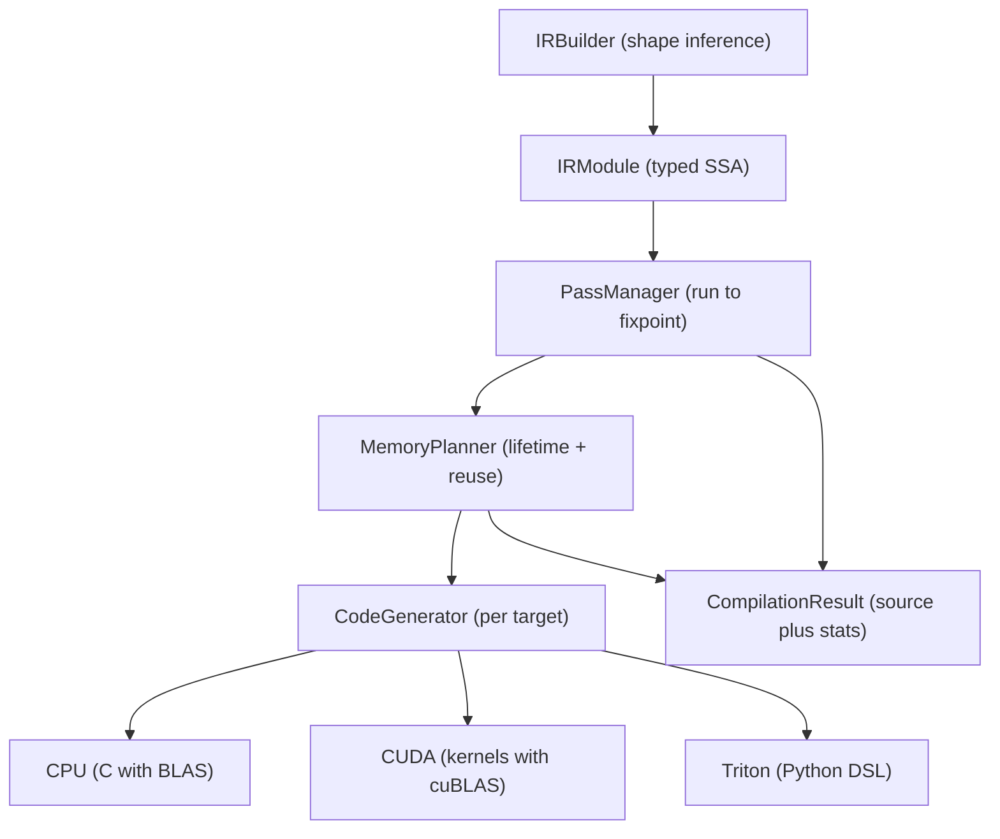

# ML Compiler

A from-scratch ML compiler in the spirit of XLA and TVM. It takes a tensor
computation expressed in a typed SSA intermediate representation, runs a pipeline
of classic optimization passes over it, plans buffer memory with lifetime-based
reuse, and emits target source code for CPU (C with BLAS), CUDA, or Triton. The
whole pipeline is pure Python and NumPy with no external compiler toolchain.

## Features

- **Typed SSA IR** — tensors carry shape and `DType`; operations are SSA `Value`
  nodes grouped into `Block`s and `Function`s (`ir/operations.py`, `ir/module.py`).
- **Builder API** — `IRBuilder` constructs graphs with automatic shape inference
  for matmul, transpose, reductions, conv2d, attention, and elementwise ops
  (`ir/builder.py`).
- **Optimization passes** — constant folding, dead-code elimination, CSE,
  operator fusion, algebraic simplification, strength reduction, and layout
  hints, driven to a fixpoint by a `PassManager` (`optimization/passes.py`).
- **Operator fusion** — fuses elementwise chains, matmul-plus-bias, and the
  Q/K/softmax/V attention pattern into single `FUSED`/`ATTENTION` ops.
- **Memory planning** — lifetime analysis plus greedy, linear-scan, or best-fit
  buffer allocation with reuse tracking (`memory/planner.py`).
- **Three code generators** — `CPUCodeGenerator` (C with `cblas_sgemm`),
  `CUDACodeGenerator` (kernels plus cuBLAS host code), and `TritonCodeGenerator`
  (`@triton.jit` Python), all sharing a base in `codegen/base.py`.
- **Compiler driver** — `MLCompiler` wires passes, planning, and codegen together
  and reports per-stage timing and op-count statistics (`compiler.py`).
- **Configurable optimization levels** — `OptLevel.O0` through `O3` select the
  pass pipeline and iteration budget.

## Architecture



| Component | Module | Responsibility |
|-----------|--------|----------------|
| IR types | `ir/types.py` | `DType`, `TensorType`, `Value`, `Constant`, memory spaces |
| Operations | `ir/operations.py` | `OpCode`, `Operation`, `Block`, `Region`, shape inference |
| Module | `ir/module.py` | `Function`, `FunctionType`, `IRModule`, verification |
| Builder | `ir/builder.py` | `IRBuilder` graph construction helpers |
| Passes | `optimization/passes.py` | optimization passes and `PassManager` |
| Memory | `memory/planner.py` | lifetime analysis, allocation strategies, stats |
| Codegen | `codegen/base.py`, `codegen/cuda.py` | CPU / CUDA / Triton source emission |
| Driver | `compiler.py` | `MLCompiler`, `CompilerConfig`, `create_compiler` |

## Quick Start

### Prerequisites

- Python 3.9+
- NumPy (installed as a dependency); no GPU, CUDA toolkit, or C compiler is
  needed to run the compiler or the tests — codegen produces source as a string.

### Installation

```bash
cd 31-ml-compiler
pip install -e ".[dev]"
```

### Running

The package is a library. Import it and compile a function:

```bash
python -c "from mlcompiler.compiler import example_compilation; example_compilation()"
```

## Usage

Build a function with the `IRBuilder` and compile it to CPU C source:

```python
from mlcompiler import create_compiler, TensorType, DType
from mlcompiler.ir import IRBuilder, Value

compiler = create_compiler(target="cpu", opt_level=2)

input_types = [
    TensorType((128, 512), DType.FLOAT32),   # a
    TensorType((512, 256), DType.FLOAT32),   # b
]
output_types = [TensorType((128, 256), DType.FLOAT32)]

def build(builder: IRBuilder, args: list[Value]):
    a, b = args
    c = builder.matmul(a, b)
    c = builder.relu(c)
    builder.return_op([c])

result = compiler.compile_function("matmul_relu", input_types, output_types, build)

print(result.code.language)            # "c"
print(result.stats["num_ops_before"], "->", result.stats["num_ops_after"])
print("peak bytes:", result.memory_plan.peak_memory)
print(result.code.source)              # generated C source
```

Target CUDA or Triton by changing one argument:

```python
cuda = create_compiler(target="cuda", opt_level=3)
result = cuda.compile_function("matmul_relu", input_types, output_types, build)
print(result.code.source)              # CUDA kernels + cuBLAS host code
```

## What's Real vs Simulated

- **Real:** the IR, shape inference, every optimization pass, the `PassManager`
  fixpoint loop, all three memory allocation strategies with lifetime analysis,
  and the three code generators. The compiler produces correct, readable target
  source and accurate compilation statistics, all exercised by the test suite.
- **Simulated / not included:** the emitted C/CUDA/Triton source is **generated
  as text and never compiled or executed** — there is no runtime, JIT, or
  inference engine. There is **no model frontend** (no ONNX, TensorFlow, PyTorch,
  or JAX import); graphs are built only through `IRBuilder`. The CUDA and Triton
  generators target hardware that is not invoked here. Some operations fall
  through to `// TODO` comments rather than full kernels.

## Testing

```bash
pytest tests/ -v
```

The suite runs with NumPy only — no GPU or external services. The
`_actual` suites plus `test_memory_planning.py` and `test_cuda_codegen.py`
exercise the real API: DType/TensorType behavior, shape inference for every
opcode, each optimization pass, all allocation strategies, and CPU/CUDA/Triton
codegen output. Several older suites (`test_codegen.py`, `test_integration.py`,
`test_ir_builder.py`, `test_ir_operations.py`, `test_optimization_passes.py`)
are guarded with `skipif` against a legacy API that this codebase does not
implement, and skip cleanly.

## Project Structure

```
31-ml-compiler/
  README.md                       # this file
  pyproject.toml                  # package metadata and dev tooling
  src/mlcompiler/
    __init__.py                   # public exports
    compiler.py                   # MLCompiler driver, create_compiler
    ir/                           # types, operations, module, builder
    optimization/passes.py        # passes and PassManager
    memory/planner.py             # lifetime analysis and allocation
    codegen/                      # base (CPU), cuda (CUDA, Triton)
  tests/                          # pytest suites
  docs/BLUEPRINT.md               # full architecture and design
```

## License

MIT — see ../LICENSE
