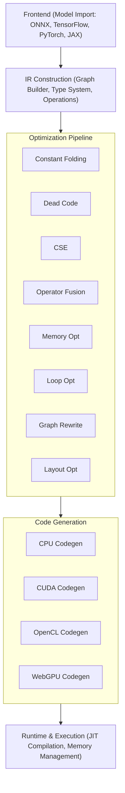

# ML Compiler Architecture

## Overview

The ML Compiler is a high-performance compiler for machine learning models, designed to optimize and compile computational graphs for various hardware targets. It provides similar functionality to XLA (Accelerated Linear Algebra) and TVM, with a focus on deep learning workloads.

## System Architecture



## Core Components

### 1. Intermediate Representation (IR)

The IR is the central representation that all optimizations operate on.

#### IR Module Structure
```python
Module
├── Functions[]
│   ├── Parameters
│   ├── Basic Blocks[]
│   │   └── Operations[]
│   └── Return Values
├── Global Variables
└── Metadata
```

#### Type System
- **Scalar Types**: int8, int16, int32, int64, float16, float32, float64, bool
- **Tensor Types**: Multi-dimensional arrays with shape and dtype
- **Tuple Types**: Heterogeneous collections
- **Function Types**: Input and output type signatures

#### Operations
- **Arithmetic**: add, subtract, multiply, divide, power, mod
- **Logical**: and, or, not, xor, equal, less, greater
- **Neural Network**: conv2d, matmul, batch_norm, layer_norm, softmax, relu
- **Memory**: load, store, alloc, free, copy
- **Control Flow**: if, while, for, call, return
- **Tensor**: reshape, transpose, concat, split, gather, scatter
- **Reduction**: sum, mean, max, min, prod

### 2. Optimization Pipeline

The optimization pipeline consists of multiple passes that transform the IR.

#### Pass Categories

**Analysis Passes**
- Dominance analysis
- Live variable analysis
- Alias analysis
- Shape inference
- Type inference

**Transformation Passes**
- Constant folding
- Dead code elimination
- Common subexpression elimination
- Operator fusion
- Memory optimization
- Loop optimization
- Vectorization
- Graph rewriting

#### Pass Manager
```python
class PassManager:
    def add_pass(pass, dependencies=[])
    def run(module) -> OptimizedModule
    def get_execution_order() -> List[Pass]
```

### 3. Pattern Matching Engine

The pattern matching engine enables graph rewriting optimizations.

#### Pattern Definition
```python
Pattern = Graph {
    nodes: List[NodePattern]
    edges: List[EdgePattern]
    constraints: List[Constraint]
}
```

#### Common Patterns
- Conv + BatchNorm + ReLU → FusedConvBNReLU
- MatMul + BiasAdd → MatMulBias
- Multiple ReLUs → Single ReLU
- Reshape + Transpose → OptimizedReshape

### 4. Code Generation

Code generation translates optimized IR to target-specific code.

#### Target Architectures

**CPU Backend**
- x86-64 with AVX2/AVX512
- ARM with NEON
- RISC-V with vector extensions
- Vectorization and parallelization

**GPU Backend (CUDA)**
- Kernel generation
- Shared memory optimization
- Tensor core utilization
- Stream management

**Other Backends**
- OpenCL for cross-platform GPU
- WebGPU for browser execution
- Metal for Apple devices
- Vulkan compute shaders

#### Code Generation Pipeline
1. **Lowering**: High-level ops to target primitives
2. **Scheduling**: Operation ordering and parallelization
3. **Memory Planning**: Buffer allocation and reuse
4. **Code Emission**: Generate target code
5. **Runtime Linking**: Link with runtime libraries

### 5. Memory Management

Efficient memory management is crucial for performance.

#### Memory Planner
```python
class MemoryPlanner:
    def analyze_lifetimes(graph) -> LifetimeInfo
    def plan_allocation(lifetimes) -> AllocationPlan
    def minimize_memory(plan) -> OptimizedPlan
```

#### Strategies
- **Buffer Reuse**: Reuse memory for non-overlapping tensors
- **In-place Operations**: Modify tensors in-place when safe
- **Memory Pooling**: Pre-allocate memory pools
- **Gradient Checkpointing**: Trade compute for memory

### 6. Runtime System

The runtime system executes compiled models.

#### Components
- **JIT Compiler**: Just-in-time compilation
- **Executor**: Graph execution engine
- **Memory Manager**: Runtime memory allocation
- **Profiler**: Performance profiling
- **Debugger**: Runtime debugging support

## Data Flow

### Compilation Flow

1. **Model Import**
   - Parse model from framework format
   - Convert to internal IR

2. **IR Construction**
   - Build computation graph
   - Perform type inference
   - Validate graph structure

3. **Optimization**
   - Run analysis passes
   - Apply transformations
   - Iterate until convergence

4. **Code Generation**
   - Select target backend
   - Generate optimized code
   - Create executable

5. **Runtime Execution**
   - Load executable
   - Allocate memory
   - Execute operations
   - Return results

### Memory Flow


## Optimization Strategies

### 1. Operator Fusion

Combine multiple operations into single kernels to reduce memory bandwidth.

**Examples:**
- Pointwise operation chains
- Convolution + activation
- Batch normalization fusion

### 2. Layout Optimization

Choose optimal tensor layouts for target hardware.

**Layouts:**
- NCHW (channels first)
- NHWC (channels last)
- Blocked layouts for cache efficiency

### 3. Loop Optimization

Transform loops for better performance.

**Techniques:**
- Loop tiling for cache locality
- Loop unrolling for instruction-level parallelism
- Loop fusion to reduce overhead
- Loop interchange for better access patterns

### 4. Vectorization

Utilize SIMD instructions for data parallelism.

**Strategies:**
- Auto-vectorization
- Explicit vector intrinsics
- Predication for conditional execution

### 5. Parallelization

Exploit multiple levels of parallelism.

**Levels:**
- Thread-level (OpenMP, threading)
- Block-level (GPU blocks)
- Warp-level (GPU warps)
- Instruction-level (pipelining)

## Extension Points

### Custom Operations

Add new operations by implementing the Operation interface:

```python
class CustomOp(Operation):
    def validate(self, inputs) -> bool
    def infer_shape(self, input_shapes) -> Shape
    def lower(self, target) -> LoweredOp
```

### Custom Optimization Passes

Add new optimization passes:

```python
class CustomPass(OptimizationPass):
    def match(self, graph) -> List[Match]
    def transform(self, match) -> Graph
```

### Custom Backends

Add new target backends:

```python
class CustomBackend(CodeGenerator):
    def generate_function(self, func) -> Code
    def generate_operation(self, op) -> Code
    def generate_memory_ops(self) -> Code
```

## Performance Considerations

### Bottlenecks

1. **Memory Bandwidth**: Often the limiting factor
2. **Kernel Launch Overhead**: Minimize kernel calls
3. **Data Movement**: Minimize host-device transfers
4. **Synchronization**: Reduce sync points

### Optimization Guidelines

1. **Profile First**: Identify actual bottlenecks
2. **Fuse Aggressively**: Reduce memory traffic
3. **Reuse Memory**: Minimize allocations
4. **Parallelize**: Exploit all available parallelism
5. **Tune Parameters**: Auto-tune for specific hardware

## Testing Strategy

### Unit Tests
- Individual operation correctness
- Pass correctness
- Code generation validation

### Integration Tests
- End-to-end compilation
- Model correctness
- Performance benchmarks

### Fuzzing
- Random graph generation
- Property-based testing
- Differential testing

