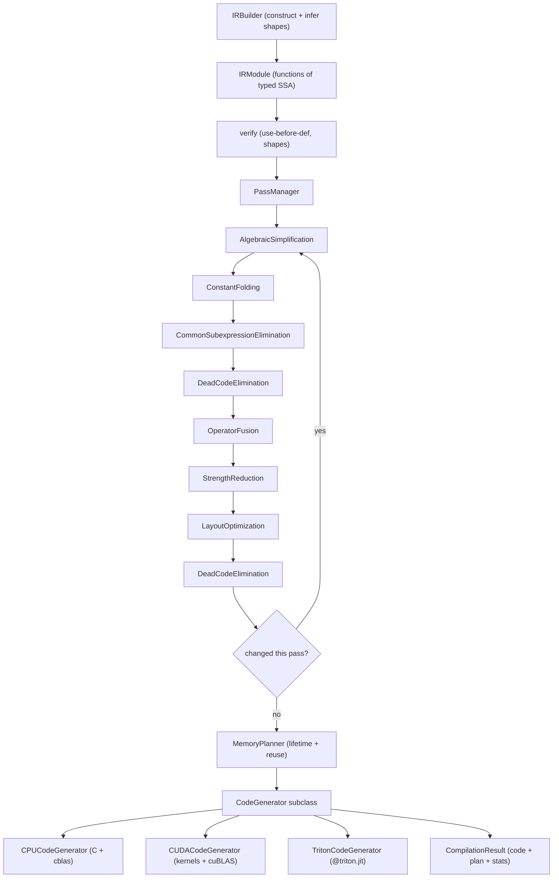

# ML Compiler

## Overview

This project is a compact but complete ML compiler, built in the spirit of XLA
and TVM, that lowers a tensor computation from a high-level graph all the way to
target source code. It is written entirely in Python with NumPy and has no
dependency on LLVM, a CUDA toolkit, or a C compiler. The goal is pedagogical: to
make every classic compiler stage legible in a few hundred lines each, rather
than to chase production performance.

A computation enters the compiler as a typed, SSA-form intermediate
representation (IR). A pipeline of optimization passes rewrites the IR to a
fixpoint — folding constants, deleting dead code, eliminating common
subexpressions, fusing operators, and simplifying algebra. A memory planner then
analyzes value lifetimes and assigns each tensor a byte offset in a single flat
buffer, reusing space wherever lifetimes do not overlap. Finally a code
generator walks the optimized IR and emits source for one of three targets: C
with a BLAS call for matmul, CUDA with hand-written kernels and a cuBLAS host
path, or Triton's Python kernel DSL.

The concepts this teaches map one-to-one onto the parts of a real ML compiler:

- **Typed SSA IR** with explicit shapes, the substrate every pass operates on.
- **Shape inference** that propagates tensor types through operations.
- **Dataflow optimization** — folding, DCE, CSE, algebraic identities.
- **Operator fusion**, the single most important ML-specific optimization, here
  covering elementwise chains, matmul-plus-bias, and attention.
- **Memory planning** as an interval-allocation problem with buffer reuse.
- **Multi-target code generation** behind a shared abstract base class.

Scope is deliberately bounded. The compiler builds and optimizes graphs and
emits source text; it does **not** compile or run that text, and it has **no**
model frontend — graphs are constructed only through the `IRBuilder` API. Those
boundaries are called out throughout this document so the design is never
oversold.

A few principles guided the design:

- **One concept per module.** The IR, the passes, the planner, and the backends
  live in separate packages with narrow interfaces — an `IRModule` flows in and
  out of passes, a `Function` into the planner, a plan plus module into a
  generator. Nothing reaches across these seams, so each stage can be read,
  tested, and modified in isolation.
- **SSA everywhere.** Single static assignment is what makes the passes short.
  Liveness, CSE, and fusion are all a few dozen lines because a value has exactly
  one definition and a maintained list of uses; the same algorithms in a mutable
  IR would need far more bookkeeping.
- **Backends behind one abstraction.** All three generators subclass
  `CodeGenerator` and share its buffer-pointer and indentation machinery, so
  adding a target means implementing `generate` and the per-opcode lowering, not
  reinventing the scaffolding.
- **Honesty over completeness.** Where an operation is not lowered, the backend
  emits an explicit `// TODO`; where a rewrite is unsafe in general, the pass
  declines to fire. The compiler never silently produces wrong output — it either
  handles a case correctly or leaves a visible marker.

## Architecture



The flow is a straight lowering pipeline. `MLCompiler.compile` (in `compiler.py`)
orchestrates it: count ops, run the pass manager, plan memory for each function,
generate code for the selected target, and assemble a `CompilationResult` with
timing and op-count statistics. Each stage is decoupled — passes operate on
`IRModule` in place, the planner consumes a `Function` and returns a `MemoryPlan`,
and the code generator consumes the optimized module plus a plan.

The package layout mirrors the stages:

- `ir/` — the data model and builder.
- `optimization/` — passes and the pass manager.
- `memory/` — lifetime analysis and allocation.
- `codegen/` — the three backends behind a shared base.
- `compiler.py` — the driver that ties them together.

The interfaces between stages are intentionally minimal, which is what lets the
pipeline read as a clean sequence. Optimization is `IRModule -> IRModule`, so a
pass can be inserted, removed, or reordered without touching anything upstream or
down. Planning is `Function -> MemoryPlan`, a pure analysis that produces an
offset map and never mutates the IR. Codegen is `(IRModule, MemoryPlan) ->
GeneratedCode`, consuming both prior outputs. The only shared contract across a
seam is the memory plan's offset map, which the backend reads through
`_get_buffer_ptr`. Because each boundary is a plain data structure rather than a
callback web, the whole compiler can be driven stage-by-stage from a test or a
REPL, and `MLCompiler.compile` is little more than the obvious composition of
these four arrows with timing wrapped around each.

## Core Components

### Intermediate Representation

The IR is SSA: every `Value` is defined exactly once, by exactly one
`Operation`, and carries a `TensorType`. Values are immutable handles; they know
their defining op and accumulate a `uses` list so passes can do def-use
traversal cheaply.

`OpCode` (in `ir/operations.py`) is the full instruction set — arithmetic
(`ADD`, `SUB`, `MUL`, `DIV`, `NEG`, `SQRT`, `EXP`, `LOG`, `POW`, `ABS`),
comparison and logical ops, linear algebra (`MATMUL`, `DOT`, `TRANSPOSE`,
`BROADCAST`), reductions (`REDUCE_SUM/MAX/MIN/MEAN`), neural-network ops
(`CONV2D`, `POOL2D`, `BATCHNORM`, `LAYERNORM`, `SOFTMAX`, `RELU`, `GELU`,
`SIGMOID`, `TANH`, `DROPOUT`), attention (`ATTENTION`, `FLASH_ATTENTION`),
memory and shape ops (`LOAD`, `STORE`, `CONSTANT`, `RESHAPE`, `SLICE`, `CONCAT`,
`PAD`, `GATHER`, `SCATTER`), control flow (`IF`, `WHILE`, `CALL`, `RETURN`), and
the special `FUSED` and `CUSTOM` markers used by fusion.

`Operation` exposes classification properties the passes rely on:

- `is_elementwise` — arithmetic and activation ops whose output shape equals the
  input shape; the unit of elementwise fusion.
- `is_reduction` — the `REDUCE_*` family.
- `is_compute_intensive` — `MATMUL`, `CONV2D`, attention.
- `is_memory_bound` — loads, stores, gathers, scatters, reshape, transpose.

`Operation.compute_output_type` is the shape-inference core. It returns the input
type for elementwise ops; computes `(M, N)` (or batched) shapes for matmul;
permutes the shape for transpose; drops or keeps reduced axes; rewrites for
reshape; and applies the standard `(H + 2P - K) / S + 1` formula for conv2d. The
same logic is mirrored eagerly in the builder so shapes are available at
construction time.

Two design choices in the IR are worth calling out because passes lean on them:

- **Value identity is by `id`, not structural equality.** `Value` overrides
  `__hash__` and `__eq__` to key off its string `id`. This lets passes use values
  as dictionary keys and set members directly — liveness sets, CSE replacement
  maps, and lifetime tables all rely on it — without worrying that two distinct
  tensors of the same type collide.
- **Uses are maintained, defs are single.** `Operation.__post_init__` sets
  `defining_op` on each output and appends itself to each input's `uses` list.
  Because the IR is SSA, the def side is trivial (one op per value) and the
  expensive direction — "who consumes this value?" — is precomputed, so a pass can
  ask `len(value.uses)` to decide, for example, whether fusion is safe.

A subtle correctness consideration runs through every rewriting pass: when an op
is deleted or replaced, its consumers' `inputs` lists must be repointed to the
surviving value, or the IR develops dangling references. The passes that delete
ops (`AlgebraicSimplification`, CSE) do this explicitly by walking the deleted
value's `uses` and substituting in each consumer's `inputs`; `DeadCodeElimination`
sidesteps the issue entirely by only removing ops that are already unreachable
from any `RETURN`.

A `Block` holds an ordered list of operations and supports `add_operation`,
`insert_operation`, and `remove_operation`. A `Region` holds blocks; a `Function`
owns a `Region`, a `FunctionType` (input and output `TensorType`s), and an entry
block whose `arguments` are the function parameters. An `IRModule` is a named
dictionary of functions plus globals and metadata, with `create_function`,
`clone` (deep copy), and `verify`.

`IRModule.verify` returns a list of error strings: it checks that every function
has an entry block, that each operation input is either a function argument or
the output of some defining op (catching use-before-def), and that declared
output shapes match what `compute_output_type` would produce.

### IRBuilder

`IRBuilder` (in `ir/builder.py`) is the only supported way to construct graphs.
It is initialized with a target `Block` and produces fresh SSA values with a
monotonic counter. Every helper creates the output `Value` with the correct
inferred type, wraps inputs and outputs in an `Operation`, appends it to the
current block, and returns the output value so calls chain naturally.

It covers arithmetic (`add`, `sub`, `mul`, `div`, `neg`, `sqrt`, `exp`, `log`),
linear algebra (`matmul` with 2D and batched shape inference, `transpose` with an
optional permutation), reductions (`reduce_sum`, `reduce_max`, `reduce_mean`
with `axis`/`keepdims`), activations and normalization (`relu`, `gelu`,
`sigmoid`, `tanh`, `softmax`, `layernorm`), convolution (`conv2d` computing the
output spatial dims from stride and padding), attention (`attention`,
`flash_attention`), memory and shape ops (`constant` from a NumPy array,
`reshape`, `concat` summing along the concatenation axis, `slice`), and control
flow (`return_op`, `call`).

### Optimization Passes

All passes (in `optimization/passes.py`) derive from the abstract `Pass`, whose
`run(module) -> bool` reports whether it changed anything. Most derive from
`FunctionPass`, which iterates the module's functions and dispatches to
`run_on_function`.

**AlgebraicSimplification** applies identity rewrites: `x + 0 -> x`, `0 + x -> x`,
`x * 1 -> x`, `1 * x -> x`, and `x * 0 -> 0` (replacing the product with a zero
constant). Removed ops have their uses rewired to the surviving value via
`_replace_with_input`.

**ConstantFolding** finds operations whose every input traces back to a
`CONSTANT` op, evaluates them with NumPy (`add`, `sub`, `mul`, `div`, `neg`,
`sqrt`, `exp`, `log`, `matmul`, `transpose`), and replaces the op with a new
`CONSTANT` holding the result. Evaluation is wrapped in a try/except so any op it
cannot fold is simply left in place.

**CommonSubexpressionElimination** hashes each pure operation by
`(opcode, input ids, sorted attributes)`. The first occurrence is recorded; later
matches have their output uses rewired to the original and are deleted. Impure
ops (`LOAD`, `STORE`, `CALL`) are skipped.

**DeadCodeElimination** computes liveness by a backward worklist seeded from
`RETURN` operations, marking every transitively-needed op live, then removes
everything unmarked. It runs twice in the default pipeline — once early and once
as cleanup after fusion and the other rewrites have created dead nodes.

**OperatorFusion** is the ML-specific heart of the pipeline and runs three
sub-passes per block:

- *Elementwise chains* — when an elementwise op's single output feeds exactly one
  elementwise consumer, the two collapse into a `FUSED` op recording the original
  opcodes, eliminating an intermediate buffer round-trip.
- *Matmul plus bias* — a `MATMUL` whose sole consumer is an `ADD` becomes a
  single `FUSED` op carrying `has_bias=True` and the bias operand.
- *Attention* — the canonical `matmul(Q, Kᵀ) -> softmax -> matmul(_, V)` shape is
  detected by finding a `SOFTMAX` fed by a matmul and consumed by a matmul, and
  rewritten to one `ATTENTION` op over `(Q, K, V)`.

The single-use guard is the load-bearing piece of fusion correctness. Every
sub-pass checks `len(output.uses) == 1` before fusing: if an intermediate tensor
is consumed by more than one downstream op, fusing it away would delete a value
some other op still needs. By requiring the producer's output to feed exactly one
consumer, the pass guarantees the fused region has a single live boundary on each
side and can be lowered as one kernel without materializing the intermediate.
This is why fusion is conservative — it fires only on clean linear chains, which
is exactly where eliminating the intermediate buffer is unambiguously safe.

The payoff of fusion is memory traffic, not arithmetic. An unfused
elementwise chain writes each intermediate to memory and reads it back for the
next op; on the memory-bound elementwise ops that dominate ML graphs, those
round-trips, not the FLOPs, set the runtime. Collapsing the chain into one
`FUSED` op lets a backend keep the intermediate in registers. The matmul-plus-bias
and attention fusions capture the two most common ML-specific patterns where a
fused kernel is dramatically better than the sum of its parts. Because the result
is recorded as a `FUSED` (or `ATTENTION`) op carrying the original opcodes in its
attributes, a downstream backend retains enough information to emit the fused
kernel — though in this implementation the generators lower the unfused forms and
treat `FUSED` as a documented extension point.

**StrengthReduction** rewrites `x * 2 -> x + x` when the multiplier is a constant
two (the `x / 2 -> x * 0.5` case is stubbed because it would need to synthesize a
new constant).

**LayoutOptimization** attaches layout hints rather than rewriting data: matmul
ops get `lhs_layout=row_major`, `rhs_layout=column_major`; conv2d ops get
`data_format=NHWC`. These attributes are advisory metadata for a backend that
chooses to honor them.

`PassManager` holds an ordered list of passes and a `max_iterations` budget. Its
`run` loops, applying every pass each iteration and recording whether any fired;
when an iteration produces no change it has reached a fixpoint and stops early.
Each pass is wrapped in try/except so one failing pass logs an error instead of
aborting the compile. `create_default_pipeline` assembles the canonical order:
algebraic simplification, constant folding, CSE, DCE, fusion, strength
reduction, layout, and a final DCE cleanup.

### Memory Planner

`memory/planner.py` turns the optimized IR into a byte-offset assignment in a
single flat buffer. It runs in two phases.

`LifetimeAnalyzer.analyze` assigns each operation a linear index in execution
order, then records the first and last index at which every value (function
arguments included) is defined or used. The result is a `Lifetime` per value with
`start`, `end`, and `size_bytes` (from the tensor type). Two values may share a
buffer iff their `[start, end]` intervals do not overlap — the classic
register-allocation-by-interval insight applied to tensors.

`MemoryPlanner.plan` dispatches on an `AllocationStrategy`:

- **GREEDY** — process values in start-time order; free buffers whose lifetime
  has ended; reuse the best-fitting freed buffer (smallest sufficient size) or
  bump-allocate a new one. Tracks a `reuse_count` and the running peak of
  simultaneously-live bytes.
- **LINEAR_SCAN** — the register-allocator analogue: maintain an active set
  ordered by end time, expire finished intervals back into a free list, and reuse
  the smallest sufficient freed slot before allocating new.
- **BEST_FIT** — sort values largest-first and place each in the tightest
  existing hole, splitting the hole's remainder back into the free list when
  there is leftover space.

Each returns a `MemoryPlan` with the per-value `BufferAllocation` map, the total
buffer size, the peak live memory, and the reuse count. `analyze_memory_usage`
derives a `MemoryStats` record: total allocated bytes, peak memory, a buffer
reuse rate (`reuse_count / allocations`), and an estimated fragmentation ratio.
`InplaceOptimizer` is a separate analysis that flags elementwise ops whose only
input has the same shape and ends its life at that op, so the output can be
written in place over the input.

The three strategies trade off along familiar allocation axes:

- **Greedy** processes in execution order and is the safe default. Sorting by
  start time (ties broken by larger size first) means buffers are freed and reused
  in the order the program actually runs, which keeps the working set tight on the
  common case of mostly-sequential dataflow. It is the strategy `CompilerConfig`
  selects by default.
- **Linear scan** is the register-allocation classic adapted to tensors. Keeping
  the active set ordered by end time makes expiry cheap and gives predictable,
  low-fragmentation packing; it shines when lifetimes are well-nested.
- **Best fit** ignores execution order and packs largest-first into the tightest
  available hole, splitting remainders back into the free list. It minimizes
  wasted space on size-skewed workloads at the cost of more hole-search work and
  potentially more small fragments.

All three share the same underlying insight from `LifetimeAnalyzer`: two tensors
may occupy the same bytes precisely when their `[start, end]` intervals are
disjoint. The difference is only in which free buffer each picks when several
fit. The peak-memory figure each reports is what matters for whether a model fits
on a device, and it is generally far below the naive sum of all tensor sizes
because of this reuse — that gap is what `memory_reduction_pct` quantifies.

### Code Generation

`codegen/base.py` defines `CodeGenerator`, an abstract base with an indentation
helper (`_emit`, `_indent_inc/dec`), a `DType`-to-C-type map, and
`_get_buffer_ptr`, which turns a value into a `(buffer + offset)` expression
using the memory plan (or a named fallback when no plan is present). Its
`generate(module) -> GeneratedCode` is abstract; `GeneratedCode` bundles the
source string, its language, the entry-point name, and metadata.

**CPUCodeGenerator** emits portable C. It writes includes (`math.h`, `string.h`,
`cblas.h`, …), then one C function per IR function whose signature takes input
and output pointers. It declares a single `char buffer[total_size]` arena sized
by the memory plan, then lowers each operation: elementwise binary and unary ops
become simple `for` loops; `MATMUL` becomes a `cblas_sgemm` call;
activations (`RELU`, `SIGMOID`, `SOFTMAX`) and `REDUCE_SUM` and 2D `TRANSPOSE`
get explicit loops; `CONSTANT` emits a small inline initializer with `memcpy`;
and `RETURN` copies the result buffers into the output pointers. Unhandled
opcodes emit a `// TODO` comment.

**CUDACodeGenerator** (in `codegen/cuda.py`) emits a `.cu` file in two parts.
First it generates `__global__` kernels: elementwise kernels with the standard
`blockIdx * blockDim + threadIdx` indexing and bounds guard; a ReLU kernel; a
sigmoid kernel; a three-kernel softmax (block-max reduction, exp-and-atomic-sum,
normalize); and a shared-memory tree-reduction kernel for `REDUCE_SUM`. Then it
emits a host launcher that `cudaMalloc`s the device arena, issues the kernel
launches with a computed grid size and the configured `block_size`, routes
`MATMUL` through a `cublasSgemm` call, copies outputs device-to-device on
`RETURN`, and `cudaFree`s the arena.

**TritonCodeGenerator** emits Python: a single `@triton.jit` kernel per function
with program-id tiling, masked loads, a small set of lowered ops (`ADD`, `MUL`,
`RELU`, `SIGMOID`, `EXP`, `SQRT`), a masked store, and a host wrapper that
allocates the output tensor and launches the kernel over a computed grid.

All three generators produce source as a string. They do not invoke a C
compiler, `nvcc`, or the Triton runtime, and nothing is executed.

The shared `_get_buffer_ptr` is what ties codegen back to the memory planner.
Each value lowered by a backend is addressed as `(buffer + offset)` where the
offset comes from the plan's `BufferAllocation` for that value, so the arena
declared at the top of the generated function (`char buffer[total_size]` for CPU,
a `cudaMalloc`'d region for CUDA) is exactly the size the planner computed, and
two reused tensors resolve to the same offset. When no plan is supplied the helper
falls back to a per-value named buffer, which keeps the generators usable in
isolation for testing but loses the reuse benefit. This is the one place where the
otherwise-decoupled planning and codegen stages must agree on a contract — the
offset map — and they agree by both reading the same `MemoryPlan`.

The division of labor across the three backends reflects how real ML compilers
target each platform. The CPU path leans on a vendor BLAS for the one operation
(matmul) where a naive triple loop would be hopeless, and writes simple portable
loops for everything memory-bound. The CUDA path hand-writes kernels for the
elementwise and reduction ops where launch configuration and shared-memory
reductions matter, and defers matmul to cuBLAS. The Triton path expresses the
whole thing as a single tiled Python kernel, the model Triton is designed for.
Each backend therefore demonstrates a different lowering philosophy against the
same IR.

### Compiler Driver

`MLCompiler` (in `compiler.py`) holds a `CompilerConfig` (target, opt level,
memory strategy, profiling and debug flags, GPU block size). `_setup_passes`
selects an empty pass manager for `O0` or the default pipeline otherwise,
raising the iteration budget at `O3`. `compile` counts ops before and after,
times the optimize / plan / codegen stages, computes a memory-reduction
percentage from the plan's reuse rate, and returns a `CompilationResult` holding
the generated code, the first function's memory plan, and a stats dictionary.
`compile_function` is the convenience entry point: it creates a module and
function from the given name and type signatures, hands a builder and the
argument values to a user callback, and compiles the result. `create_compiler`
is a string-keyed factory (`"cpu"/"cuda"/"triton"`, opt level `0`-`3`).

### Worked Lowering Example

Tracing a tiny graph through the pipeline shows how the stages compose. Consider
a linear layer with a ReLU on a `(128, 512)` input and a `(512, 256)` weight:

```python
def build(b: IRBuilder, args):
    x, w = args
    h = b.matmul(x, w)      # %h : (128, 256)
    y = b.relu(h)           # %y : (128, 256)
    b.return_op([y])
```

**Construction.** `matmul` infers `(128, 256)` from the two operand shapes and
records `%h`'s defining op; `relu` copies that type to `%y`; `return_op` marks
`%y` live. After building, the function holds three operations and `%h.uses`
contains exactly the ReLU.

**Optimization.** With `OptLevel.O2` the default pipeline runs. Algebraic
simplification, constant folding, and CSE find nothing to do (no constants, no
duplicates). `OperatorFusion` inspects the matmul, sees its sole consumer is not
an `ADD` (so no matmul-plus-bias fusion) and the ReLU is elementwise but its
producer is a matmul (so no elementwise-chain fusion either) — this particular
graph fuses nothing, and the op count stays at three. DCE finds every op
reachable from the return. The pass manager detects no change on the second
iteration and stops at the fixpoint. Had the graph instead been
`add(matmul(x, w), bias)`, fusion would have collapsed the matmul and add into one
`FUSED` op with `has_bias=True`, dropping the op count.

**Memory planning.** Lifetime analysis indexes the ops `0..2`. `%x` and `%w` are
arguments (live from index 0); `%h` is defined at the matmul and dies at the ReLU;
`%y` is defined at the ReLU and lives to the return. The greedy allocator places
each tensor at a byte offset in the arena; because `%h` and `%y` do not overlap
with most other tensors, the plan's `peak_memory` reflects only the
simultaneously-live set rather than the sum of all four buffers.

**Code generation.** For the CPU target, `CPUCodeGenerator` emits a C function
taking `float* arg0, float* arg1, float* out0`, declares the arena, lowers the
matmul to a `cblas_sgemm` call with `M=128, N=256, K=512`, lowers the ReLU to a
`for` loop with a ternary max, and copies `%y` into `out0` on return. Switching
the config to `Target.CUDA` instead emits a cuBLAS `cublasSgemm` for the matmul,
a `kernel_relu_*` launch with a grid of `ceil(128*256 / block_size)`, and the
device-to-device output copy.

This is the whole compiler in miniature: shapes flow forward at construction,
passes rewrite to a fixpoint, lifetimes drive buffer reuse, and a backend turns
the result into target source.

## Data Structures

```python
class DType(Enum):
    FLOAT16 = "float16"; FLOAT32 = "float32"; FLOAT64 = "float64"
    INT8 = "int8"; INT16 = "int16"; INT32 = "int32"; INT64 = "int64"
    UINT8 = "uint8"; BOOL = "bool"

    @property
    def numpy_dtype(self): ...    # maps to the matching np dtype
    @property
    def size_bytes(self) -> int:  # 4 for FLOAT32, 1 for INT8, ...
        ...


@dataclass
class TensorType:
    shape: tuple[int, ...]            # shape comes first
    dtype: DType = DType.FLOAT32

    @property
    def num_elements(self) -> int: ...   # product of positive dims
    @property
    def size_bytes(self) -> int:         # num_elements * dtype.size_bytes
        ...
    @property
    def rank(self) -> int: ...


@dataclass
class Value:
    id: str
    type: TensorType
    name: str = ""
    defining_op: Any = None
    uses: list = field(default_factory=list)
    # hashed/compared by id so values work as dict keys and set members
```

A constant wraps a NumPy array and its type, with constructors from a scalar or
an existing array:

```python
@dataclass
class Constant:
    value: np.ndarray
    type: TensorType

    @classmethod
    def from_scalar(cls, value: float, dtype: DType = DType.FLOAT32): ...
    @classmethod
    def from_array(cls, arr: np.ndarray): ...
```

Operations, blocks, and regions:

```python
@dataclass
class Operation:
    opcode: OpCode
    inputs: list[Value]
    outputs: list[Value]
    attributes: dict[str, Any] = field(default_factory=dict)
    name: str = ""
    id: str = field(default_factory=lambda: str(uuid.uuid4())[:8])

    def get_attr(self, name, default=None): ...
    def set_attr(self, name, value): ...
    @property
    def is_elementwise(self) -> bool: ...
    @property
    def is_reduction(self) -> bool: ...
    @property
    def is_compute_intensive(self) -> bool: ...
    @property
    def is_memory_bound(self) -> bool: ...
    def compute_output_type(self) -> TensorType: ...


@dataclass
class Block:
    id: str
    operations: list[Operation] = field(default_factory=list)
    arguments: list[Value] = field(default_factory=list)
    def add_operation(self, op): ...
    def insert_operation(self, index, op): ...
    def remove_operation(self, op): ...


@dataclass
class Function:
    name: str
    func_type: FunctionType            # input_types -> output_types
    body: Region = field(default_factory=Region)
    @property
    def entry_block(self) -> Block: ...
    @property
    def arguments(self) -> list[Value]: ...
    def get_operations(self) -> list[Operation]: ...
```

Memory-planning records:

```python
@dataclass
class Lifetime:
    value_id: str
    start: int           # first op index touching the value
    end: int             # last op index touching the value
    size_bytes: int
    @property
    def duration(self) -> int:  # end - start
        ...


@dataclass
class BufferAllocation:
    value_id: str
    offset: int
    size: int
    memory_space: str = "global"


@dataclass
class MemoryPlan:
    allocations: dict[str, BufferAllocation]
    total_size: int
    peak_memory: int
    reuse_count: int = 0
```

Compiler configuration and result:

```python
class Target(Enum):
    CPU = "cpu"; CUDA = "cuda"; TRITON = "triton"

class OptLevel(Enum):
    O0 = 0; O1 = 1; O2 = 2; O3 = 3

@dataclass
class CompilerConfig:
    target: Target = Target.CPU
    opt_level: OptLevel = OptLevel.O2
    memory_strategy: AllocationStrategy = AllocationStrategy.GREEDY
    enable_profiling: bool = False
    debug_ir: bool = False
    block_size: int = 256

@dataclass
class CompilationResult:
    code: GeneratedCode
    memory_plan: MemoryPlan
    stats: dict[str, Any]
```

## API Design

The public surface is re-exported from `mlcompiler/__init__.py`.

Build and inspect IR:

```python
TensorType(shape: tuple[int, ...], dtype: DType = DType.FLOAT32)

IRBuilder(block: Block | None = None)
  .matmul(a, b)            -> Value     # 2D and batched shape inference
  .add(a, b) / .mul(a, b)  -> Value
  .relu(x) / .gelu(x) / .sigmoid(x) / .tanh(x) / .softmax(x, axis=-1)
  .reduce_sum(x, axis=None, keepdims=False)        # and max / mean
  .transpose(x, perm=None) / .reshape(x, shape) / .concat(values, axis=0)
  .conv2d(x, weight, stride=(1,1), padding=(0,0))
  .attention(q, k, v, mask=None, scale=None) / .flash_attention(q, k, v)
  .constant(np_array) / .return_op(values)

IRModule().create_function(name, input_types, output_types) -> Function
IRModule().verify() -> list[str]
```

Optimize:

```python
pm = create_default_pipeline()          # PassManager with the canonical order
pm.run(module) -> IRModule              # in place, to fixpoint
# individual passes: ConstantFolding, DeadCodeElimination,
# CommonSubexpressionElimination, OperatorFusion, plus the others
```

Plan memory:

```python
planner = MemoryPlanner(AllocationStrategy.GREEDY)   # or LINEAR_SCAN / BEST_FIT
plan = planner.plan(func) -> MemoryPlan
stats = analyze_memory_usage(plan) -> MemoryStats
```

Generate code:

```python
gen = CPUCodeGenerator(memory_plan)      # or CUDACodeGenerator(plan, block_size)
code = gen.generate(module) -> GeneratedCode   # .source, .language, .entry_point
```

Drive the whole pipeline:

```python
compiler = create_compiler(target="cpu", opt_level=2)   # -> MLCompiler
result = compiler.compile(module) -> CompilationResult
result = compiler.compile_function(name, input_types, output_types, build_fn)
```

A full example, using the convenience driver:

```python
from mlcompiler import create_compiler, TensorType, DType
from mlcompiler.ir import IRBuilder, Value

compiler = create_compiler(target="cuda", opt_level=3)

input_types  = [TensorType((128, 512), DType.FLOAT32),
                TensorType((512, 256), DType.FLOAT32)]
output_types = [TensorType((128, 256), DType.FLOAT32)]

def build(b: IRBuilder, args: list[Value]):
    a, w = args
    y = b.relu(b.matmul(a, w))
    b.return_op([y])

result = compiler.compile_function("layer", input_types, output_types, build)
print(result.code.language)              # "cuda"
print(result.stats["total_time_ms"])
print(result.code.source)
```

## Performance

This compiler optimizes for clarity of the compilation pipeline, not for the
runtime speed of generated code — and it never runs that code, so there are no
execution benchmarks to report. The meaningful, measurable quantities are the
ones the compiler computes about its own work, surfaced in
`CompilationResult.stats`:

- **Op-count reduction** — `num_ops_before` versus `num_ops_after`. Constant
  folding, CSE, DCE, and fusion all shrink the operation count; fusion in
  particular collapses multiple ops into one `FUSED`/`ATTENTION` node.
- **Memory reuse** — the planner's `reuse_count` and the derived
  `buffer_reuse_rate`, reported as `memory_reduction_pct`. Lifetime-based reuse
  lets non-overlapping tensors share buffers, so `peak_memory` can be far below
  the sum of all tensor sizes.
- **Stage timing** — `optimize_time_ms`, `memory_plan_time_ms`,
  `codegen_time_ms`, and `total_time_ms`, captured with `time.time()` around each
  stage.

Algorithmic notes that shape these numbers: the `PassManager` runs to a fixpoint
(default 10 iterations, 20 at `O3`), so cascading simplifications are caught in
later sweeps; the greedy and linear-scan allocators are roughly linearithmic in
the number of values because of their initial sort plus near-linear scans; and
the best-fit allocator trades extra hole-search work for tighter packing on
size-skewed workloads. The generated CPU code routes matmul through BLAS
(`cblas_sgemm`) and the CUDA code through cuBLAS, so were the source actually
compiled it would inherit those libraries' performance — but that compilation
step is out of scope here.

The fixpoint loop is what makes the optimizations compound rather than fire once.
A single pass over the IR can expose new opportunities for an earlier pass: folding
a constant can make an `add` an `x + 0` that algebraic simplification then deletes;
deleting that op can leave its producer dead for the next DCE sweep. Running every
pass each iteration and stopping only when an entire iteration changes nothing means
these chains resolve completely, at the cost of re-scanning the IR a few times. The
iteration cap (10, or 20 at `O3`) bounds the work in the rare case of a rewrite that
keeps reporting `modified` without converging.

Two compile-time costs dominate in practice. The pass manager's cost is the number
of fixpoint iterations times the per-iteration pass work, which is linear in op
count for the dataflow passes and linear-with-use-list-walks for the rewriting
passes. The planner's cost is the lifetime scan (linear) plus the strategy's
allocation loop (linearithmic from the sort). Codegen is a single linear walk of the
optimized IR. For the small-to-medium graphs this compiler targets, all of these are
negligible next to what compiling the emitted source would cost — which is precisely
why a real compiler caches compiled artifacts, a natural extension this design
leaves room for at the `CompilationResult` boundary.

## Testing Strategy

The suite under `tests/` runs with NumPy alone — no GPU, compiler toolchain, or
network. It splits into suites that exercise the real implemented API and older
suites that guard against a legacy API this codebase does not provide.

**IR and shape inference** (`test_ir_operations_actual.py`) covers `DType`
properties and byte sizes, `TensorType` element counts and sizes, `Value`
identity semantics, `Constant` construction from scalars and arrays, every
`OpCode`, the `Operation` classification properties, and `compute_output_type`
for matmul, transpose, reductions, reshape, softmax, and conv2d — including
batched matmul and keepdims behavior. Block and region manipulation are tested
directly.

**Optimization passes** (`test_optimization_passes_actual.py`) builds small
graphs and asserts the post-pass op counts and structure: constants are folded
away, dead ops vanish after DCE, duplicate subexpressions collapse under CSE,
fusable chains and matmul-plus-bias and attention patterns turn into `FUSED`/
`ATTENTION` nodes, algebraic identities fire, and the `PassManager` converges.

**Memory planning** (`test_memory_planning.py`) checks lifetime analysis indices,
each allocation strategy (greedy, linear-scan, best-fit), buffer reuse for
non-overlapping lifetimes, peak-memory tracking, the in-place optimizer, and the
`analyze_memory_usage` statistics.

**Code generation** (`test_cuda_codegen.py`) inspects the emitted CUDA and Triton
source for the expected kernel names, launch configuration, cuBLAS calls, and
host structure. Its module docstring documents a known bug — the
`Function.arguments` path interacts badly with empty-block truthiness — and marks
the affected cases `xfail` so they record expected behavior without breaking the
run.

**Legacy suites** (`test_codegen.py`, `test_integration.py`, `test_ir_builder.py`,
`test_ir_operations.py`, `test_optimization_passes.py`) are written against an
older, different API (`begin_block`, `Shape`, `OptimizationLevel`, a
`CodeGenerator(target=...)` constructor) that this implementation does not
expose. Each is guarded with a `pytest.mark.skipif` that detects the missing API
at import time and skips cleanly, so they neither fail nor give false coverage.

The edge cases the suites emphasize are the ones most likely to break a compiler:
zero-sized and dynamic dimensions in shape inference, single-use versus
multi-use values during fusion (fusion must not fire when an intermediate has
other consumers), non-overlapping versus overlapping lifetimes in allocation, and
the fixpoint termination of the pass manager.

The testing strategy is layered to match the pipeline's decoupling. Each stage is
tested in isolation against the data structure it consumes — passes against hand-built
`IRModule`s, the planner against `Function`s with known lifetimes, generators against
modules with predictable opcodes — so a failure localizes to one stage rather than
implicating the whole compile. Because the stages are pure transformations
(`IRModule -> IRModule`, `Function -> MemoryPlan`, `module + plan -> GeneratedCode`),
the tests can assert on exact outputs: post-pass op counts, specific buffer offsets,
substrings of generated source. There is no need for golden-file fuzzing or
execution harnesses, which keeps the suite fast and deterministic.

The `verify` method is the project's lightweight invariant checker, exercised
indirectly throughout. It catches the two classes of bug that rewriting passes are
most prone to introduce: a use-before-def, where a pass repoints an input to a value
that no longer dominates the use, and a shape mismatch, where an output's declared
type drifts from what `compute_output_type` recomputes. Running `verify` after a
sequence of passes is the cheapest way to confirm the IR is still well-formed before
handing it to the planner and backend, and it is the recommended guard when extending
the pass set with new rewrites.

## References

- XLA: TensorFlow's domain-specific compiler for linear algebra.
- TVM: an automated end-to-end optimizing compiler for deep learning.
- MLIR: a compiler infrastructure for multi-level intermediate representations,
  the source of the region/block/operation structure used here.
- Triton: a language and compiler for tiled neural-network kernels.
- Poletto and Sarkar, "Linear Scan Register Allocation," the basis for the
  linear-scan memory strategy.
