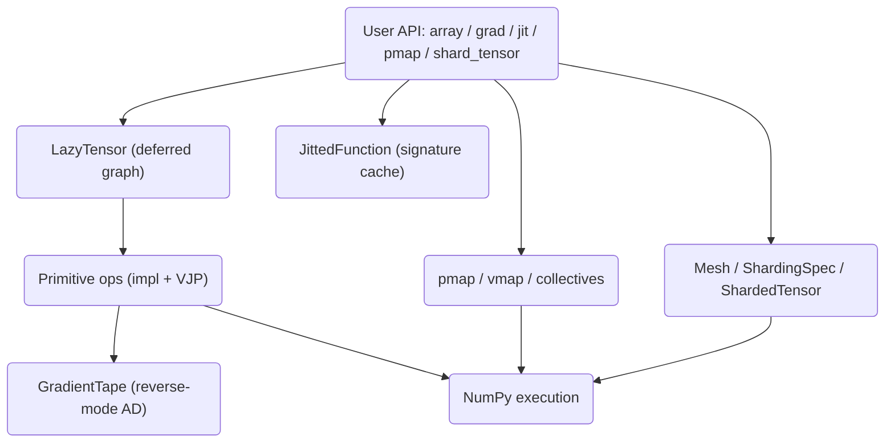

# Distributed Tensor Algebra

A JAX-style tensor algebra library built from scratch on NumPy. It provides lazy
computation graphs, reverse-mode automatic differentiation, signature-cached JIT
tracing, and a logical device mesh with tensor sharding — all running in a single
Python process.

## Features

- **Lazy tensors** — every operation defers evaluation, building a producer graph that
  is only run when `.numpy()` / `.materialize()` is called (`LazyTensor`, `core/tensor.py`).
- **Primitive op set** — arithmetic, transcendental (`exp`, `log`, `sin`, `tanh`), reductions
  (`reduce_sum`, `reduce_mean`, `reduce_max`), shape ops, and `matmul`, each carrying its own
  VJP rule (`Primitive`, `core/primitives.py`).
- **Reverse-mode autodiff** — `grad`, `value_and_grad`, and `vjp` over a recorded
  `GradientTape` with gradient accumulation and broadcast reduction (`autodiff/tape.py`).
- **Neural-net helpers** — `relu`, `sigmoid`, and numerically stable `softmax` composed from
  primitives.
- **JIT tracing** — `jit` decorator with a shape/dtype + static-arg cache key and
  `cache_info` statistics (`JittedFunction`, `jit/compiler.py`).
- **Function transforms** — `pmap`, `vmap`, `scan`, and `checkpoint` over a logical device
  axis (`parallel/primitives.py`).
- **Collectives** — `psum`, `pmean`, `pmax`, `all_gather`, `broadcast` with a named-axis
  context for cross-shard reductions.
- **Device mesh + sharding** — N-dimensional `Mesh`, `PartitionSpec` (`P`), `ShardingSpec`,
  and `shard_tensor` / `unshard_tensor` round trips (`sharding/mesh.py`).
- **Distribution utilities** — `replicate`, `SPMDPartitioner`, and `DeviceFailover` shard
  redistribution.

## Architecture



| Component | Module | Responsibility |
|-----------|--------|----------------|
| Lazy tensor | `core/tensor.py` | Deferred values, operator overloads, materialization |
| Primitives | `core/primitives.py` | Op `impl`, `abstract_eval` shape inference, VJP rules |
| Autodiff | `autodiff/tape.py` | Tape recording, reverse traversal, `grad` / `vjp` |
| JIT | `jit/compiler.py` | Trace context and signature-keyed compilation cache |
| Parallel | `parallel/primitives.py` | `pmap` / `vmap` / `scan` and collective ops |
| Sharding | `sharding/mesh.py` | Device mesh, partition specs, sharded tensors |

## Quick Start

### Prerequisites

- Python 3.9+
- NumPy 1.24+ (the only runtime dependency; no GPU or external services required)

### Installation

```bash
pip install -e ".[dev]"
```

### Running

There is no server or CLI; import the library and use it directly:

```bash
python -c "from tensorlib import array, grad; print(grad(lambda x: (x*x).sum())(array([1.,2.,3.])).numpy())"
```

## Usage

Gradients, JIT, and sharding against the real public API:

```python
import numpy as np
from tensorlib import array, grad, value_and_grad, jit, matmul
from tensorlib import create_device_mesh, ShardingSpec, P, shard_tensor, unshard_tensor

# Reverse-mode gradient of sum(x^2) -> 2x
x = array([1.0, 2.0, 3.0])
print(grad(lambda v: (v * v).sum())(x).numpy())   # [2. 4. 6.]

# A linear layer: value and gradients w.r.t. weights
def loss(w, xb):
    return matmul(xb, w).sum()

w = array(np.random.randn(4, 5).astype(np.float32))
xb = array(np.random.randn(8, 4).astype(np.float32))
value, gw = value_and_grad(loss)(w, xb)
print(value.numpy(), gw.shape)                    # scalar, (4, 5)

# JIT caches by argument signature
fast_loss = jit(loss)
print(fast_loss(w, xb).numpy())
print(fast_loss.cache_info)                        # {'hits': ..., 'misses': 1, 'size': 1}

# Shard a tensor over a logical 4-device mesh, then gather it back
mesh = create_device_mesh((4,), ("data",))
sharding = ShardingSpec(mesh, P("data", None))
sharded = shard_tensor(array(np.arange(16).reshape(4, 4).astype(np.float32)), sharding)
print(sharded.local_shape)                         # (1, 4)
print(unshard_tensor(sharded).numpy().shape)       # (4, 4)
```

## What's Real vs Simulated

- **Real:** lazy graph construction and materialization; all primitive `impl` and shape
  inference; reverse-mode autodiff (`grad`, `value_and_grad`, `vjp`) verified against
  analytical and finite-difference gradients; the JIT signature cache and its statistics;
  `pmap` / `vmap` / `scan` executed as single-process loops over array splits; mesh
  construction, `shard_tensor` / `unshard_tensor` round trips, `replicate`, and
  `DeviceFailover` redistribution.
- **Simulated / single-process:** there is **no multi-device or multi-host execution**.
  The device mesh is logical and shards live in an in-process dict keyed by `Device`.
  Collectives `psum`, `pmax`, `all_gather`, and `broadcast` are identity placeholders (only
  `pmean` performs a real division by the axis size). `JittedFunction._compile` builds tracers
  but returns the original Python function — there is no IR lowering or fusion. Forward-mode
  `jvp` raises `NotImplementedError`; `jacobian` / `hessian` fall back to finite differences.

## Testing

```bash
pytest tests/ -v
```

The suite has 178 tests (4 Jacobian/Hessian cases are skipped) covering lazy tensors and
factory functions, arithmetic/transcendental/reduction/shape ops, autodiff correctness
against numerical gradients, JIT caching behavior, and mesh/sharding validation. No external
services are needed.

## Project Structure

```
32-distributed-tensor-algebra/
  README.md                      # This file
  pyproject.toml                 # Package metadata and dev deps
  src/tensorlib/
    __init__.py                  # Public API exports
    core/tensor.py               # LazyTensor, Tracer, factory functions
    core/primitives.py           # Primitive ops, VJP rules, nn helpers
    autodiff/tape.py             # GradientTape, grad, value_and_grad, vjp
    jit/compiler.py              # JittedFunction, jit, trace
    parallel/primitives.py       # pmap, vmap, scan, collectives
    sharding/mesh.py             # Mesh, ShardingSpec, ShardedTensor
  tests/                         # pytest suite (autodiff, jit, lazy, sharding)
  docs/BLUEPRINT.md              # Full architecture and design
```

## License

MIT — see [LICENSE](../LICENSE)
