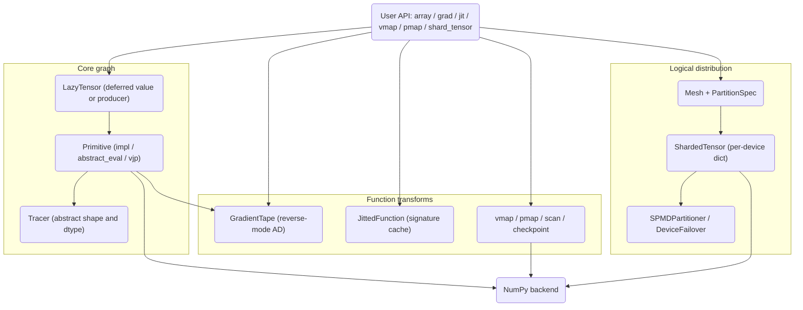

# Distributed Tensor Algebra

## Overview

This project is a JAX-style tensor algebra engine implemented from scratch on top of NumPy.
It demonstrates the core machinery behind modern array frameworks — lazy computation graphs,
composable function transformations (`grad`, `jit`, `vmap`, `pmap`), and SPMD-style tensor
sharding over a device mesh — without depending on XLA, CUDA, or a multi-process runtime.

The engine is organized around four ideas:

1. **Lazy evaluation.** A `LazyTensor` never holds a result until it is forced. Each operation
   records the `Primitive` that produced it and the inputs it consumed, forming a directed
   acyclic graph that is walked on demand. This separation of *graph construction* from
   *execution* is what makes tracing, differentiation, and compilation possible.
2. **Primitives with rules.** Every operation is a `Primitive` carrying a concrete `impl`, an
   `abstract_eval` shape/dtype rule, and a `vjp` (vector-Jacobian product) rule. Adding a new
   differentiable op means writing one class.
3. **Reverse-mode autodiff.** A `GradientTape` records the forward computation and replays it
   in reverse, threading cotangents through each primitive's VJP and accumulating gradients at
   shared nodes.
4. **Logical distribution.** A `Mesh` describes an N-dimensional grid of logical `Device`s. A
   `PartitionSpec` maps tensor axes onto mesh axes, and `shard_tensor` splits a concrete array
   into per-device shards. Everything runs in one process, so this models the *programming
   model* of SPMD distribution rather than real cross-device communication.

The concepts this engine makes concrete are the ones that recur across every array framework:

- **Define-by-run tracing.** The same Python function can be executed eagerly, recorded for
  differentiation, or fed abstract `Tracer` inputs for compilation — because operations build a
  graph instead of computing immediately.
- **Abstract evaluation.** Shapes and dtypes propagate through `abstract_eval` rules without
  touching data, so errors surface at graph-build time and a compiler could reason about the
  program statically.
- **The VJP as the unit of differentiation.** Reverse-mode AD reduces to giving each primitive a
  rule for pulling a cotangent backward, plus a tape that replays those rules and accumulates at
  fan-out nodes.
- **Composable transforms.** `grad`, `jit`, `vmap`, and `pmap` are higher-order functions that
  take a function and return a function, which is what lets them stack (`jit(grad(f))`).
- **The SPMD programming model.** A partition spec over a device mesh describes *how* data is
  laid out; sharding and collectives describe *how* computation follows the data.

Scope: the library targets correctness and clarity of the array-programming model. It is not a
performance engine — execution is plain NumPy, the JIT cache does not lower to an optimized IR,
and collectives are mostly placeholders. The "What's Simulated" notes throughout are explicit
about these boundaries.

## Architecture



The flow is layered. The **core graph** builds and types deferred computations. **Function
transforms** consume that graph: autodiff records it on a tape, JIT keys it by argument
signature, and the batching transforms re-drive the user function over slices of an axis. The
**distribution layer** sits beside the core, partitioning concrete arrays across a logical mesh
and reassembling them. Every layer ultimately calls into NumPy for the actual arithmetic.

### Layer responsibilities

- **`core/tensor.py`** — `LazyTensor`, `Tracer`, `Device`, `TensorSpec`, `ShapeSpec`, and the
  factory functions (`array`, `zeros`, `randn`, `eye`, ...). Owns operator overloading and the
  materialize-on-demand logic.
- **`core/primitives.py`** — the `Primitive` base class, ~25 registered primitives with their
  VJP rules, broadcast-gradient reduction, the public op functions, and the neural-net helpers.
- **`autodiff/tape.py`** — `GradientTape`, `AutoDiffContext`, and the `grad` / `value_and_grad`
  / `vjp` transforms, plus finite-difference `jacobian` / `hessian`.
- **`jit/compiler.py`** — `JittedFunction`, the `jit` decorator, and the `trace` / `TracingContext`
  scaffolding.
- **`parallel/primitives.py`** — `pmap`, `vmap`, `scan`, `checkpoint`, the collective ops, and
  the named-axis context.
- **`sharding/mesh.py`** — `Mesh`, `PartitionSpec` / `P`, `ShardingSpec`, `ShardedTensor`,
  `shard_tensor` / `unshard_tensor`, `replicate`, `SPMDPartitioner`, and `DeviceFailover`.

## Core Components

### Lazy tensor and materialization

A `LazyTensor` holds *either* a concrete `value` (already materialized) *or* a `tracer` plus a
`producer` primitive that knows how to compute it. Shape and dtype are always available without
running the graph, because they are taken from the value or from the tracer's abstract spec.

```python
class LazyTensor:
    def __init__(self, value=None, tracer=None, producer=None):
        self._value = value
        self._tracer = tracer
        self._producer = producer
        self._materialized = value is not None
        if value is not None:
            self._shape, self._dtype = value.shape, value.dtype
        elif tracer is not None:
            self._shape, self._dtype = tracer.shape, tracer.dtype
        else:
            raise ValueError("Must provide either value or tracer")

    def materialize(self):
        if self._materialized:
            return self._value
        if self._producer:
            self._value = self._producer.evaluate()
            self._materialized = True
            return self._value
        raise RuntimeError("Cannot materialize tensor without value or producer")
```

`materialize()` is the single evaluation entry point. A producer's `evaluate()` recursively
materializes its own inputs and calls `impl`, so forcing one node pulls the whole upstream
subgraph. Operator overloads (`__add__`, `__matmul__`, `sum`, `reshape`, `T`, ...) all create
new lazy nodes rather than computing eagerly, which is what lets the same user code be traced
for differentiation or compilation. Caching is per node: once materialized, the value is stored
and reused, so a shared subexpression is not recomputed within a single forced graph.

### Primitives and shape inference

Every operation derives from `Primitive` and registers itself by name:

```python
class Primitive(ABC):
    name = "primitive"

    @abstractmethod
    def impl(self, *args, **kwargs): ...          # concrete NumPy computation

    @abstractmethod
    def abstract_eval(self, *avals, **kwargs): ... # output TensorSpec from input specs

    def vjp(self, primals, tangents, g):           # reverse-mode rule
        raise NotImplementedError(f"VJP not implemented for {self.name}")

    def evaluate(self):
        concrete = [inp.materialize() for inp in self.inputs]
        return self.impl(*concrete, **self.params)
```

`abstract_eval` runs during graph construction (inside `_create_primitive_op`) so output shapes
are known before any data is touched. For example, `AddPrimitive` uses `np.broadcast_shapes`,
and `MatMulPrimitive` handles both the 2-D case and batched matmul via broadcasting of the
leading dimensions:

```python
def abstract_eval(self, x_spec, y_spec):
    x_shape, y_shape = x_spec.shape.dims, y_spec.shape.dims
    if len(x_shape) == 2 and len(y_shape) == 2:
        out_shape = (x_shape[0], y_shape[1])
    else:
        batch = np.broadcast_shapes(x_shape[:-2], y_shape[:-2])
        out_shape = batch + (x_shape[-2], y_shape[-1])
    return TensorSpec(ShapeSpec(out_shape), x_spec.dtype)
```

The registered primitives are: arithmetic (`add`, `sub`, `mul`, `div`, `neg`, `power`,
`matmul`), transcendental (`exp`, `log`, `sqrt`, `sin`, `cos`, `tanh`), reductions
(`reduce_sum`, `reduce_mean`, `reduce_max`, `reduce_min`), and shape ops (`reshape`,
`transpose`, `broadcast_to`, `expand_dims`, `squeeze`). The `reduce_max` / `reduce_min`
primitives implement `impl` and `abstract_eval` but no VJP — they participate in forward
computation only.

Each VJP encodes a standard calculus rule, expressed in terms of other primitives so the
backward graph is itself differentiable in principle and lazy in practice:

| Primitive | Forward | VJP w.r.t. inputs (given cotangent `g`) |
|-----------|---------|------------------------------------------|
| `mul` | `x * y` | `g * y`, `g * x` (each broadcast-reduced) |
| `div` | `x / y` | `g / y`, `-g * x / y²` |
| `power` | `x ** y` | `g * y * x^(y-1)`, `g * x^y * log(x)` |
| `matmul` | `x @ y` | `g @ yᵀ`, `xᵀ @ g` |
| `exp` | `exp(x)` | `g * exp(x)` |
| `log` | `log(x)` | `g / x` |
| `sqrt` | `sqrt(x)` | `g / (2 * sqrt(x))` |
| `tanh` | `tanh(x)` | `g * (1 - tanh(x)²)` |
| `transpose` | `xᵀ` | `transpose(g, inverse_axes)` |
| `reshape` | `reshape(x, s)` | `reshape(g, x.shape)` |

The `matmul` rule deserves note: for `Z = X @ Y`, the reverse rule is `dX = g @ Yᵀ` and
`dY = Xᵀ @ g`, which the code expresses directly with `matmul` and `transpose`, so matmul
gradients flow through the same primitive machinery as the forward pass.

#### Neural-net helpers

`relu`, `sigmoid`, and `softmax` are *composed* from primitives rather than being primitives of
their own, so they inherit autodiff for free where their constituents have VJPs:

```python
def sigmoid(x):
    return div(array(1.0), add(array(1.0), exp(neg(x))))

def softmax(x, axis=-1):
    x_max = reduce_max(x, axis=axis, keepdims=True)   # subtract max for stability
    e_x = exp(sub(x, x_max))
    return div(e_x, reduce_sum(e_x, axis=axis, keepdims=True))
```

`relu` is the one exception: it materializes `x` to build a 0/1 mask, so it is *not* lazy and not
differentiable through the mask. `softmax` subtracts the per-axis max before exponentiating,
which is what keeps `softmax([1000, 1001, 1002])` from overflowing — a property the tests assert
explicitly.

### Op creation and tape recording

`_create_primitive_op` is the single chokepoint that builds a lazy op. It instantiates the
primitive, runs `abstract_eval` to get the output spec, wraps the result in a `LazyTensor` with
a `Tracer`, and — if a gradient tape is active — records the operation:

```python
def _create_primitive_op(prim_class, *inputs, **params):
    prim = prim_class()
    prim.inputs = list(inputs)
    prim.params = params
    input_specs = [TensorSpec(ShapeSpec(inp.shape), inp.dtype) for inp in inputs]
    output_spec = prim.abstract_eval(*input_specs, **params)
    output = LazyTensor(tracer=Tracer(output_spec), producer=prim)
    prim.outputs = [output]

    tape = AutoDiffContext.get_current_tape()
    if tape:
        tape.record(prim, list(inputs), [output])
    return output
```

Because recording is centralized here, *any* primitive automatically participates in autodiff
without special-casing in the tape.

### Reverse-mode autodiff

`GradientTape` stores a flat list of `(primitive, inputs, outputs)` triples in execution order.
`gradient(target, sources)` seeds the target's cotangent with ones, then walks the trace in
reverse, calling each primitive's `vjp` and accumulating gradients where a tensor feeds multiple
consumers:

```python
def gradient(self, target, sources):
    grad_map = {id(target): ones(target.shape, target.dtype)}
    for prim, inputs, outputs in reversed(self.trace):
        out_grads = [grad_map.get(id(o)) for o in outputs]
        if all(g is None for g in out_grads):
            continue
        if len(outputs) == 1 and out_grads[0] is not None:
            try:
                input_grads = prim.vjp(inputs, None, out_grads[0], **prim.params)
                for inp, g in zip(inputs, input_grads):
                    if g is not None:
                        grad_map[id(inp)] = (grad_map[id(inp)] + g
                                             if id(inp) in grad_map else g)
            except NotImplementedError:
                pass
    return [grad_map.get(id(s)) for s in sources]
```

Primitives missing a VJP (e.g. `reduce_max`) are skipped via the `NotImplementedError` guard
rather than aborting the backward pass. Gradients themselves are built from primitives, so the
backward graph is also lazy and is materialized only when the caller asks for `.numpy()`.

Two details matter for correctness:

- **Broadcast reduction.** When an input was broadcast in the forward pass, its gradient must be
  summed back down to the original shape. `_reduce_broadcast` first sums away extra leading axes,
  then sums (keepdims) over axes that were size-1 in the target. `add`, `sub`, `mul`, `div`, and
  `power` all route their gradients through it.

  ```python
  def _reduce_broadcast(g, target_shape):
      target_rank, g_rank = len(target_shape), len(g.shape)
      if g_rank > target_rank:                      # undo rank-raising broadcast
          g = reduce_sum(g, axis=tuple(range(g_rank - target_rank)))
      reduce_axes = [i for i, (gd, td) in enumerate(zip(g.shape, target_shape))
                     if td == 1 and gd > 1]          # undo size-1 broadcast
      if reduce_axes:
          g = reduce_sum(g, axis=tuple(reduce_axes), keepdims=True)
      return g
  ```

- **Reduction VJPs.** `reduce_sum` re-expands the cotangent with `expand_dims` along the reduced
  axes and broadcasts back; `reduce_mean` does the same and divides by the number of reduced
  elements. The VJP receives the same `params` (`axis`, `keepdims`) that were passed to the
  forward op, so it can reconstruct exactly which axes to re-expand:

  ```python
  def vjp(self, primals, tangents, g, axis=None, keepdims=False):   # ReduceSum
      x, = primals
      if not keepdims and axis is not None:
          for ax in sorted((axis,) if isinstance(axis, int) else axis):
              g = expand_dims(g, ax)
      return (broadcast_to(g, x.shape),)
  ```

#### Worked example: gradient of `sum(x * x)`

To see the pieces compose, trace `grad(lambda v: (v * v).sum())(x)` for `x = [1, 2, 3]`:

1. Under the active tape, `v * v` creates a `MulPrimitive` node recorded with inputs `(v, v)`.
2. `.sum()` creates a `ReduceSumPrimitive` node over the product, recorded next.
3. `gradient` seeds the scalar output with `ones(())` and walks the two ops in reverse.
4. The `reduce_sum` VJP broadcasts the seed back to shape `(3,)` — a vector of ones.
5. The `mul` VJP returns `g * y` and `g * x`; since both inputs are the *same* tensor `v`, the
   tape accumulates `1*v + 1*v = 2v` into `grad_map[id(v)]`, yielding `[2, 4, 6]`.

The accumulation step is exactly why the `grad_map[id(inp)] + g` branch exists: a tensor reused
as several inputs receives the sum of its incoming cotangents, which is the multivariable chain
rule for fan-out.

### Transforms: grad, value_and_grad, vjp

The user-facing transforms wrap `GradientTape` in an `AutoDiffContext` so that op creation is
recorded automatically:

```python
def grad(fun, argnums=0):
    if isinstance(argnums, int):
        argnums = (argnums,)
    def grad_fun(*args, **kwargs):
        with AutoDiffContext() as tape:
            for i in argnums:
                tape.watch(args[i])
            result = fun(*args, **kwargs)
            grads = tape.gradient(result, [args[i] for i in argnums])
            return grads[0] if len(grads) == 1 else grads
    return grad_fun
```

`value_and_grad` is identical but also returns the forward result. `vjp(fun, *primals)` runs the
forward pass under a tape, then returns a `vjp_fun(g)` closure that replays the recorded trace
with `g` as the seed cotangent — letting the caller supply an arbitrary output-space vector.

Forward-mode AD is intentionally absent: `Primitive.jvp` raises `NotImplementedError`, and
`jacobian` therefore falls back to finite differences (`hessian = jacobian(grad(f))`). The
Jacobian/Hessian tests are marked skipped for this reason.

### JIT compilation

`JittedFunction` is a memoizing wrapper. On each call it builds a cache key from argument
signatures — shape and dtype for tensors, the literal value for static args, plus kwargs — and
hashes it:

```python
def _make_cache_key(self, args, kwargs):
    parts = []
    for i, arg in enumerate(args):
        if i in self.static_argnums:
            parts.append(f"static_{i}_{arg}")
        elif isinstance(arg, LazyTensor):
            parts.append(f"tensor_{arg.shape}_{arg.dtype}")
        else:
            parts.append(f"other_{type(arg).__name__}")
    for k, v in sorted(kwargs.items()):
        parts.append(f"{k}_{v.shape}_{v.dtype}" if isinstance(v, LazyTensor)
                     else f"{k}_{v}")
    return hashlib.sha256("_".join(parts).encode()).hexdigest()
```

A cache miss calls `_compile`, which creates `Tracer`s for the tensor arguments and *returns the
original function* — the place where IR lowering and fusion would go is stubbed. The cache still
behaves correctly: same signature reuses the compiled entry, different shape/dtype/static value
forces a recompile, and `cache_info` reports hits, misses, and size. The `jit` decorator
supports bare (`@jit`), parameterized (`@jit(static_argnums=(1,))`), and direct-call forms.

`cache_info` derives its numbers from a call counter and the cache size:

```python
@property
def cache_info(self):
    return {
        "hits": self._call_count - len(self._cache),   # calls beyond unique signatures
        "misses": len(self._cache),                    # one compile per signature
        "size": len(self._cache),
    }
```

The `static_argnums` mechanism is what lets a Python-level integer (e.g. a loop count or a
boolean flag) take part in the cache key by *value* rather than by shape — two different static
values produce two cache entries, mirroring how real JIT systems specialize on compile-time
constants. Tensor args, by contrast, are keyed only by `(shape, dtype)`, so the same compiled
entry serves all inputs of matching signature.

`trace(fun, *example_args)` is a separate facility that runs the function on `Tracer` inputs
inside a `TracingContext`, capturing inputs and outputs:

```python
def trace(fun, *example_args):
    with TracingContext() as ctx:
        tracers = []
        for i, arg in enumerate(example_args):
            if isinstance(arg, LazyTensor):
                tracer = Tracer(TensorSpec(ShapeSpec(arg.shape), arg.dtype), f"input_{i}")
                tracers.append(tracer); ctx.inputs.append(tracer)
            else:
                tracers.append(arg)
        result = fun(*tracers)
        if isinstance(result, LazyTensor):
            ctx.outputs.append(result)
        elif isinstance(result, tuple):
            ctx.outputs.extend(result)
    return ctx
```

It is the scaffold an IR-building compiler would extend: today it records the input/output
boundary of the function under tracing, but the `Tracer` objects do not yet implement arithmetic,
so only the call boundary (not the op sequence) is captured. The tests verify the tracing
infrastructure with identity functions for this reason.

### Function transforms: vmap, pmap, scan, checkpoint

These re-drive the user function over an axis:

- **`vmap`** infers the batch size from `in_axes`, slices each batched argument along that axis,
  calls the function per element, and stacks the results along `out_axes`. It is correct via a
  Python loop over the batch, not a batched-primitive rewrite.
- **`pmap`** splits inputs across a logical device axis with `np.array_split` (device count from
  `devices`, the split-axis length, or a default of 8), runs the function under an
  `_axis_name_context` so collectives can resolve the named axis, and concatenates outputs. An
  `in_axis` of `None` replicates an argument across all shards instead of splitting it, which is
  how non-batched parameters are passed alongside batched data.
- **`scan`** is a sequential fold returning stacked intermediates. It threads a carry through a
  function `(carry, x) -> (carry, y)` over the leading axis of `xs`, collecting every `y`:

  ```python
  def scan(fun, init, xs, length=None):
      length = length or xs.shape[0]
      carry, ys = init, []
      for i in range(length):
          carry, y = fun(carry, array(xs.numpy()[i]))
          ys.append(y)
      return carry, array(np.stack([y.numpy() for y in ys], axis=0))
  ```

- **`checkpoint`** is a pass-through placeholder for gradient checkpointing; the real transform
  would discard intermediates on the forward pass and recompute them during the backward pass to
  trade compute for memory.

Because `vmap` and `pmap` differ only in *intent* (batching vs device parallelism) but share the
loop-over-an-axis implementation here, they make the symmetry between auto-vectorization and
single-program-multiple-data explicit: both take an axis, drive the function over its slices, and
reassemble — the difference in a real system is whether the slices live on one device or many.

### Collectives and the named axis

`psum`, `pmean`, `pmax`, `all_gather`, and `broadcast` take a tensor and an `axis_name`. Because
execution is single-process, `psum`, `pmax`, `all_gather`, and `broadcast` are identity
placeholders; only `pmean` does real work, dividing by the axis size resolved from the
`_axis_name_stack`:

```python
def pmean(x, axis_name):
    size = get_axis_size(axis_name)
    return psum(x, axis_name) / array(float(size))
```

`get_axis_size` / `get_axis_index` search the stack pushed by `pmap`, mirroring how JAX resolves
named axes inside a parallel region:

```python
_axis_name_stack: List[Tuple[str, int, int]] = []   # (name, index, size) per region

def get_axis_size(axis_name):
    for name, idx, size in reversed(_axis_name_stack):
        if name == axis_name:
            return size
    raise ValueError(f"Unknown axis name: {axis_name}")
```

`pmap` enters an `_axis_name_context(axis_name, device_idx, n_devices)` around each per-device
call, so while the user function runs for "device 3 of 8", a `pmean(x, "batch")` inside it can
look up that it should divide by 8. The stack is searched innermost-first, which lets nested
parallel regions shadow an outer axis of the same name — the lexical-scoping discipline real
named-axis systems rely on.

### Device mesh and sharding

A `Mesh` wraps an N-dimensional NumPy array of logical `Device`s with names for each axis. A
`PartitionSpec` (`P`) maps each tensor dimension to a mesh axis name or `None` (replicated). A
`ShardingSpec` joins them and computes the local shard shape, validating divisibility:

```python
def get_shard_shape(self, global_shape):
    shard = list(global_shape)
    for i, axis_name in enumerate(self.partition_spec.partitions):
        if axis_name is not None and i < len(shard):
            mesh_dim = self.mesh[axis_name]
            if shard[i] % mesh_dim != 0:
                raise ValueError(f"Dimension {i} ... not divisible by {axis_name}")
            shard[i] //= mesh_dim
    return tuple(shard)
```

`shard_tensor` materializes the tensor and, for every device in the mesh, computes the slice it
owns (from the device's mesh coordinates) and stores a copy in the `ShardedTensor._shards` dict:

```python
def shard_tensor(tensor, sharding):
    data = tensor.numpy()
    sharded = ShardedTensor(data.shape, data.dtype, sharding)
    mesh, pspec = sharding.mesh, sharding.partition_spec
    for device in mesh.devices.flat:
        device_idx = np.where(mesh.devices == device)        # mesh coordinates
        slices = []
        for i, axis_name in enumerate(pspec.partitions):
            if axis_name is None or i >= len(data.shape):
                slices.append(slice(None))                   # this dim replicated
            else:
                mesh_axis = mesh.axis_names.index(axis_name)
                mesh_idx = device_idx[mesh_axis][0]
                chunk = data.shape[i] // mesh[axis_name]
                slices.append(slice(mesh_idx * chunk, (mesh_idx + 1) * chunk))
        sharded.set_shard(device, data[tuple(slices)].copy())
    return sharded
```

`unshard_tensor` / `to_global` reverse the process by writing each shard back into its slice.
`replicate` builds a fully-replicated sharded tensor; `with_sharding_constraint` is a metadata
hint that currently returns its input unchanged.

#### Worked example: 2-D sharding

Consider a `(4, 4)` matrix sharded over a `(2, 2)` mesh with axes `('row', 'col')` and
`P('row', 'col')`. The local shard shape is `(4//2, 4//2) = (2, 2)`, and the four devices own
disjoint quadrants:

```
mesh coords -> global slice               device 0  device 1
(0,0) -> rows 0:2, cols 0:2               +--------+--------+
(0,1) -> rows 0:2, cols 2:4               |  d0    |  d1    |  rows 0:2
(1,0) -> rows 2:4, cols 0:2               +--------+--------+
(1,1) -> rows 2:4, cols 2:4               |  d2    |  d3    |  rows 2:4
                                          +--------+--------+
                                           cols 0:2  cols 2:4
```

A 1-D mesh with `P('data', None)` instead splits only the first axis, giving each device a full
row-block (`(1, 4)` shards for four devices over a `(4, 4)` tensor). `P(None, None)` replicates
the whole tensor on every device. These three cases — fully sharded, partially sharded, and
replicated — are exactly what the sharding tests cover, including the non-divisible error path.

`SPMDPartitioner.partition_function` shards the inputs, runs the function once per device on its
local shard, and returns a per-device result dict — the single-process analogue of SPMD
execution. `DeviceFailover` tracks healthy vs failed devices and can reassign a failed device's
shard to a healthy one:

```python
def redistribute_shards(self, tensor):
    new_shards = {}
    for device, shard in tensor._shards.items():
        if device in self.failed_devices:
            replacement = self.get_replacement(device)
            if replacement:
                new_shards[replacement] = shard          # move shard off failed device
        else:
            new_shards[device] = shard
    tensor._shards = new_shards
    return tensor
```

## Data Structures

Core types from `core/tensor.py`:

```python
class DeviceType(Enum):
    CPU = "cpu"; GPU = "gpu"; TPU = "tpu"

@dataclass
class Device:
    device_type: DeviceType
    device_id: int
    memory_bytes: int = 16 * 1024**3
    def __hash__(self):                 # hashable so it can key shard dicts
        return hash((self.device_type, self.device_id))

@dataclass
class ShapeSpec:
    dims: Tuple[int, ...]
    @property
    def rank(self): return len(self.dims)
    @property
    def numel(self):                    # -1 if any dim is dynamic (< 0)
        result = 1
        for d in self.dims:
            if d < 0: return -1
            result *= d
        return result

@dataclass
class TensorSpec:
    shape: ShapeSpec
    dtype: np.dtype
    device: Optional[Device] = None
    sharding: Optional[Any] = None

class Tracer:                            # abstract value: shape + dtype, no data
    _counter = 0
    def __init__(self, spec, name=None):
        self.spec = spec
        self.name = name or f"tracer_{Tracer._counter}"
        Tracer._counter += 1
```

Distribution types from `sharding/mesh.py`:

```python
@dataclass
class Mesh:
    devices: np.ndarray               # N-D array of Device
    axis_names: Tuple[str, ...]
    @property
    def shape(self):                  # {axis_name: size}
        return {n: self.devices.shape[i] for i, n in enumerate(self.axis_names)}

class PartitionSpec(NamedTuple):
    partitions: Tuple[Optional[str], ...]   # axis name or None per tensor dim
    @staticmethod
    def create(*args): return PartitionSpec(args)
P = PartitionSpec.create

@dataclass
class ShardingSpec:
    mesh: Mesh
    partition_spec: PartitionSpec

class ShardedTensor:
    def __init__(self, global_shape, dtype, sharding):
        self.global_shape = global_shape
        self.dtype = dtype
        self.sharding = sharding
        self.local_shape = sharding.get_shard_shape(global_shape)
        self._shards: Dict[Device, np.ndarray] = {}
```

The gradient tape is a flat execution log:

```python
class GradientTape:
    def __init__(self):
        self.trace: List[Tuple[Any, List[LazyTensor], List[LazyTensor]]] = []
        self._watching: Set[int] = set()   # id()s of watched tensors
```

## API Design

Public surface re-exported from `tensorlib/__init__.py`.

**Tensor creation**

```python
array(data, dtype=None) -> LazyTensor
zeros(shape, dtype=np.float32);  ones(shape, dtype=np.float32)
randn(*shape);  rand(*shape);  arange(start, stop=None, step=1)
linspace(start, stop, num);  eye(n, m=None);  full(shape, fill_value)
```

**Operations** (also available as `LazyTensor` methods / operators)

```python
add sub mul div neg power matmul                  # arithmetic  (+ - * / @ **)
exp log sqrt sin cos tanh                          # transcendental
reduce_sum reduce_mean reduce_max reduce_min       # reductions  (.sum .mean .max .min)
reshape transpose broadcast_to expand_dims squeeze # shape       (.reshape .T ...)
relu sigmoid softmax                               # neural-net helpers
```

**Autodiff**

```python
grad(fun, argnums=0) -> Callable
value_and_grad(fun, argnums=0) -> Callable          # returns (value, grad)
vjp(fun, *primals) -> (output, vjp_fun)
jacobian(fun, argnums=0);  hessian(fun, argnums=0)  # finite-difference fallback
GradientTape()                                       # low-level recording
```

**JIT and transforms**

```python
jit(fun=None, static_argnums=()) -> Callable        # decorator, memoizing
trace(fun, *example_args) -> TracingContext
vmap(fun, in_axes=0, out_axes=0)
pmap(fun, axis_name="batch", in_axes=0, out_axes=0, devices=None)
scan(fun, init, xs, length=None) -> (carry, stacked)
checkpoint(fun) -> Callable
```

**Collectives and sharding**

```python
psum pmean pmax all_gather broadcast               # take (x, axis_name)
create_device_mesh(shape, axis_names, device_type=DeviceType.GPU) -> Mesh
PartitionSpec / P;  ShardingSpec(mesh, partition_spec)
shard_tensor(tensor, sharding) -> ShardedTensor
unshard_tensor(sharded) -> LazyTensor
```

Typical end-to-end use:

```python
def loss(w, x):
    return matmul(x, w).sum()

value, gw = value_and_grad(loss)(w, x)   # forward value + dL/dw
fast = jit(loss)                          # cached by (shape, dtype) signature
mesh = create_device_mesh((4,), ("data",))
sharded = shard_tensor(x, ShardingSpec(mesh, P("data", None)))
```

## Performance

This is a correctness-and-clarity reference, not an optimized runtime, so no benchmark numbers
are claimed. The relevant performance characteristics follow from the design:

- **Backend.** All `impl`s call NumPy; throughput is whatever the host BLAS / NumPy build
  delivers. There is no fusion, no GPU offload, and no parallel thread pool beyond NumPy's own.
- **Lazy graph cost.** Graph construction allocates a `Primitive` and `LazyTensor` per op.
  Materialization is a single post-order walk; a node materialized once is cached on `_value`,
  so a shared subexpression is computed once per forced graph.
- **JIT cache.** Cache hits are an O(key-length) SHA-256 plus a dict lookup; the compiled entry
  is the original function, so the win is avoiding re-tracing, not faster execution. Misses are
  triggered by any change in tensor shape/dtype, static-arg value, or kwargs.
- **Autodiff cost.** Reverse mode does one forward pass plus one reverse walk of the trace.
  Gradient accumulation at a shared node is a lazy `add`; memory scales with the number of
  recorded ops since the tape retains all intermediates (no checkpointing in effect).
- **vmap / pmap.** Both are Python loops over the mapped axis, so cost scales linearly with the
  axis length with per-iteration Python overhead — fine for tests and small batches, not for
  production throughput.
- **Sharding.** `shard_tensor` copies each shard out of the global array, so peak memory is
  roughly 2x the tensor during sharding; shards are dict-stored in the same process.

## Testing Strategy

The suite (178 tests across four files, 4 skipped) validates the array-programming model end to
end. `pytest tests/ -v`.

- **`test_lazy_tensor.py` (72).** Factory functions and dtypes; lazy-vs-materialized state and
  on-demand materialization; arithmetic and reverse operators including scalar broadcasting;
  matmul (2-D, batched, shape inference); transcendental ops; reductions with `axis`/`keepdims`;
  shape ops; `relu` / `sigmoid` / `softmax` (including numerical-stability with large inputs);
  broadcasting; operation chaining; and a full MLP forward pass whose softmax rows sum to 1.

- **`test_autodiff.py` (42, 4 skipped).** Tape creation/watch/record and nested
  `AutoDiffContext`; `grad` on polynomials and compositions; `value_and_grad` with single and
  multiple args; `vjp` with unit and weighted cotangents; per-op gradient checks for arithmetic,
  transcendental, matmul (shape), reductions, reshape/transpose, and broadcasting; composite
  cases (MSE loss, tanh layer); and analytical-vs-expected verification. A
  `numerical_gradient` central-difference helper anchors the expected values. Jacobian/Hessian
  cases are skipped because forward-mode AD is unimplemented.

- **`test_jit.py` (33).** `JittedFunction` construction and call; the `jit` decorator in bare,
  parameterized, and parenthesized forms; cache hits, misses on differing shape/dtype, clearing,
  and `cache_info`; cache-key generation for tensor signatures, static args, and kwargs;
  `TracingContext` nesting; `trace` producing input tracers; and JIT over matmul, an MLP layer,
  softmax-like graphs, scalars, empty tensors, and high-dimensional inputs.

- **`test_sharding.py` (31).** 1-D/2-D/3-D mesh creation and indexing; axis-name/dimension
  mismatch errors; partition specs with and without `None`; shard-shape computation including
  partial, replicated, and non-divisible cases; `ShardedTensor` set/get/validate and `to_global`;
  `shard_tensor` / `unshard_tensor` round trips (1-D, 2-D, 3-D, single-device); `replicate`;
  `DeviceFailover` mark/replace/redistribute; and `SPMDPartitioner` returning per-device results.

Edge cases are exercised throughout: empty and high-dimensional tensors in JIT, non-divisible
shard dimensions, single- and large-mesh sharding, and softmax overflow guarding.

## References

- JAX — composable transforms (`grad`, `jit`, `vmap`, `pmap`) and tracing over abstract values.
- Autograd — define-by-run reverse-mode automatic differentiation via a tape of VJP rules.
- XLA — the compilation/lowering model that `jit` and `trace` here sketch but do not implement.
- Mesh TensorFlow / GSPMD — device meshes, partition specs, and SPMD tensor sharding.
- PyTorch `autograd` and `torch.distributed` — gradient tape and collective-op vocabulary.
