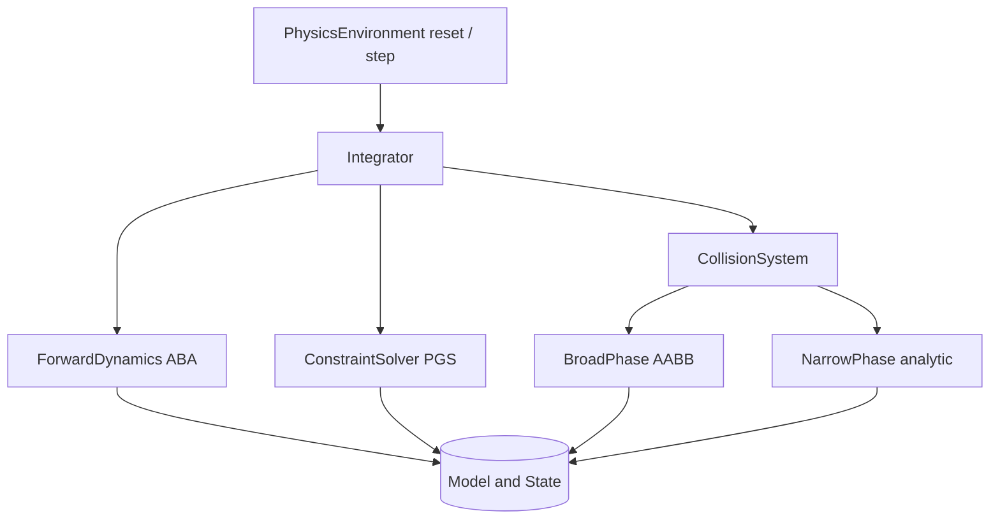

# RL Physics Engine

A MuJoCo-lite rigid body physics engine for reinforcement learning, written from scratch
in pure Python on top of NumPy. It models articulated bodies with joints and actuators,
detects collisions between primitive shapes, resolves contacts with a projected
Gauss-Seidel constraint solver, and exposes a Gym-style `reset`/`step` environment API.

The package is `physicsrl`. Everything — quaternion math, the Articulated Body Algorithm,
collision narrow phase, the LCP-style contact solver, and the integrators — is implemented
locally with no external physics or autodiff dependency.

## Features

- **Articulated body model** — bodies, joints, actuators, and inertia assembled into a
  kinematic tree with generalized coordinates `qpos`/`qvel` (`Model`, `Body`, `State`).
- **Five joint types** — `FREE` (6 DOF), `BALL` (3 DOF), `HINGE`, `SLIDE` (1 DOF each), and
  `FIXED` (0 DOF), each with its own motion subspace (`JointType`, `Joint`).
- **Inertia builders** — closed-form inertia tensors for box, sphere, capsule, and cylinder
  geometries (`Inertia.from_box`, `from_sphere`, `from_capsule`, `from_cylinder`).
- **Forward dynamics** — Articulated Body Algorithm computing joint accelerations from
  applied torques, with gravity bias and per-joint damping (`ForwardDynamics`).
- **Two-phase collision detection** — AABB broad phase plus analytic narrow-phase tests for
  sphere/box/plane/capsule pairs (`BroadPhase`, `NarrowPhase`, `CollisionSystem`).
- **Contact solver** — projected Gauss-Seidel LCP solver with Baumgarte stabilization,
  restitution, friction cone clamping, and impulse warm-starting (`ConstraintSolver`).
- **Three integrators** — explicit Euler, semi-implicit (symplectic) Euler, and RK4, with
  quaternion normalization and joint-limit handling (`Integrator`).
- **Gym-style environments** — `reset`/`step` returning the 5-tuple
  `(obs, reward, terminated, truncated, info)`, with domain randomization
  (`PhysicsEnvironment`), batched rollouts (`BatchedEnvironment`), and ready-made
  `InvertedPendulumEnv`, `CartPoleEnv`, and `HopperEnv` tasks.

## Architecture



| Component | Module | Responsibility |
|-----------|--------|----------------|
| Core types | `core/bodies.py` | `Model`, `Body`, `Joint`, `Geom`, `Actuator`, `Inertia`, `State`, `Contact`, quaternion utilities |
| Forward dynamics | `dynamics/forward.py` | Articulated Body Algorithm, forward kinematics, spatial inertia |
| Collision | `collision/detection.py` | AABB broad phase and analytic narrow-phase contact generation |
| Constraint solver | `solver/constraints.py` | Projected Gauss-Seidel contact/friction impulse resolution |
| Integration | `integration/integrator.py` | Euler / semi-implicit / RK4 time stepping, quaternion + limit handling |
| Environment | `environment/gym_env.py` | Gym-style `reset`/`step`, batching, example RL tasks |

## Quick Start

### Prerequisites

- Python 3.9+
- NumPy (the only runtime dependency); no external services or GPU required.

### Installation

```bash
pip install -e ".[dev]"
```

### Running

The engine is a library — drive it by building a `Model`, creating an `Integrator`, and
stepping, or by wrapping a model in a `PhysicsEnvironment`.

## Usage

A free-falling sphere under gravity, stepped with the semi-implicit integrator:

```python
import numpy as np
from physicsrl import (
    Model, Body, Joint, Geom, Inertia, State,
    GeomType, JointType, Integrator,
)

model = Model()
model.timestep = 0.002
model.integrator = "semi_implicit"

sphere = Body(
    name="ball",
    inertia=Inertia.from_sphere(mass=1.0, radius=0.5),
    parent=-1,
    geoms=[Geom(GeomType.SPHERE, np.array([0.5]))],
    pos=np.array([0.0, 0.0, 10.0]),
)
model.add_body(sphere)
model.add_joint(Joint(joint_type=JointType.FREE, parent_body=-1, child_body=0))

state = State.create(model)
state.qpos[:3] = sphere.pos        # initial position into the free joint's qpos
integrator = Integrator(model)

for _ in range(500):
    state = integrator.step(state, np.zeros(model.nu))

print("height:", state.qpos[2])    # has fallen under gravity
```

Driving an RL task through the Gym-style API:

```python
import numpy as np
from physicsrl.environment.gym_env import CartPoleEnv
# build cart_pole_model (see tests/conftest.py) then:
env = CartPoleEnv(cart_pole_model)
obs = env.reset(seed=0)
for _ in range(200):
    action = np.zeros(env.action_dim)
    obs, reward, terminated, truncated, info = env.step(action)
    if terminated or truncated:
        obs = env.reset()
```

## What's Real vs Simulated

- **Real:** Quaternion algebra; inertia tensor construction; the ABA forward-dynamics pass
  with gravity bias and joint damping; AABB broad phase; analytic narrow-phase contacts for
  sphere-sphere, sphere-plane, sphere-box, capsule-plane, capsule-capsule, and box-plane
  (with commutative dispatch); the projected Gauss-Seidel contact solver with Baumgarte
  stabilization, restitution, friction clamping, and warm-start; Euler / semi-implicit / RK4
  integration; and the Gym-style environment, batching, and example tasks. All of this is
  exercised by the 143-test suite.
- **Simplified / not implemented:** GJK/EPA general-convex collision (`_gjk_epa`) is a
  placeholder returning `None`; the Coriolis/centrifugal velocity-product term is zeroed; the
  constraint solver uses a diagonal inverse-mass approximation rather than the full mass
  matrix. There is **no** differentiable physics, GPU acceleration, Numba JIT, or `numpy-quaternion`
  dependency — the engine is pure NumPy and CPU-only.

## Testing

```bash
pytest tests/ -v
```

The suite has 143 tests across four files: `test_bodies.py` (data structures, inertia, DOF
bookkeeping), `test_collision.py` (broad/narrow phase, dispatch commutativity, contact
properties), `test_dynamics.py` (forward dynamics and kinematics), and `test_integration.py`
(the three integrators and full stepping). No external services are required.

## Project Structure

```
33-rl-physics-engine/
  README.md
  pyproject.toml
  src/physicsrl/
    core/bodies.py            # Model, Body, Joint, Geom, Inertia, State, Contact, quaternions
    dynamics/forward.py       # ForwardDynamics (Articulated Body Algorithm)
    collision/detection.py    # BroadPhase, NarrowPhase, CollisionSystem
    solver/constraints.py     # ConstraintSolver (projected Gauss-Seidel)
    integration/integrator.py # Integrator (Euler / semi-implicit / RK4)
    environment/gym_env.py     # PhysicsEnvironment, BatchedEnvironment, example tasks
  tests/                       # 143 tests + shared fixtures (conftest.py)
  docs/BLUEPRINT.md            # Full architecture and design
```

## License

MIT — see ../LICENSE
