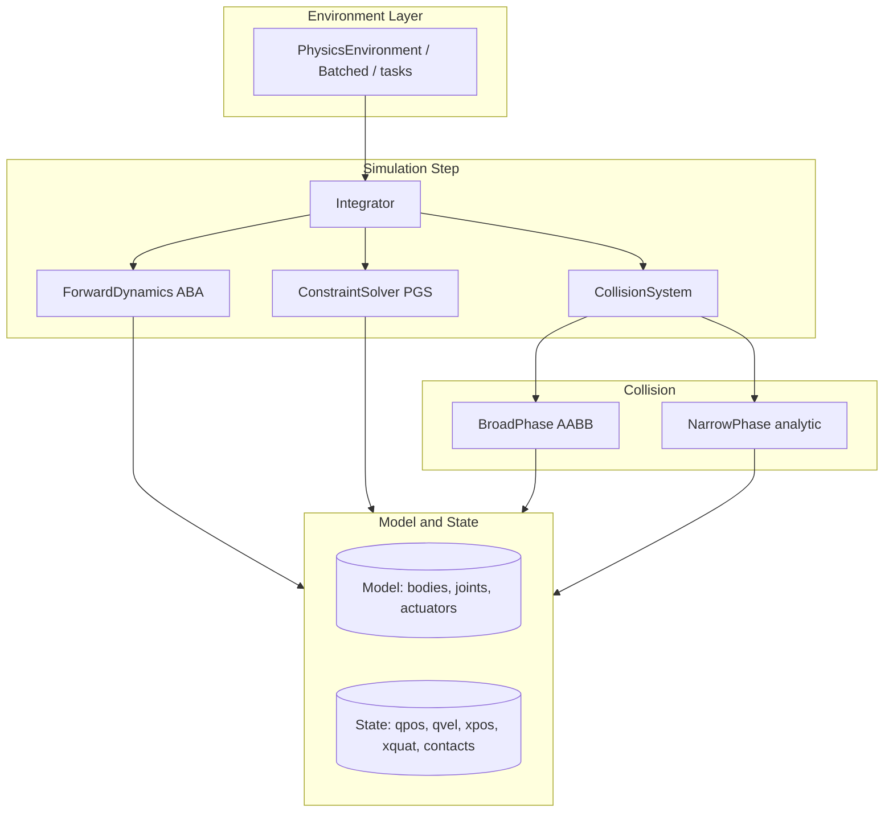

# RL Physics Engine

## Overview

`physicsrl` is a rigid body physics engine designed for reinforcement learning, built from
scratch in pure Python on top of NumPy. It follows the structure of MuJoCo: a *model* holds
the static description of an articulated mechanism (bodies, joints, actuators, geometries,
gravity, timestep), and a *state* holds the time-varying generalized coordinates that the
engine advances. The headline goal is a clean, inspectable implementation of the full
simulation loop — forward dynamics, collision detection, contact resolution, and numerical
integration — wrapped in a Gym-style environment that RL code can step.

The engine teaches the core ideas behind a model-based physics simulator:

- **Generalized coordinates and the kinematic tree.** Each joint contributes a fixed number
  of position (`nq`) and velocity (`nv`) degrees of freedom. The model lays these out into
  flat `qpos`/`qvel` arrays and resolves world-frame body transforms by walking the tree
  from root to leaf.
- **The Articulated Body Algorithm (ABA).** Forward dynamics maps applied joint torques to
  joint accelerations using spatial (6D) inertia, motion subspaces, and a backward/forward
  pass over the body tree.
- **Two-phase collision detection.** A cheap axis-aligned bounding box (AABB) broad phase
  prunes candidate pairs; analytic narrow-phase routines compute exact contact points,
  normals, and penetration depths for primitive shape pairs.
- **Contact resolution as an LCP.** Contacts impose unilateral (non-penetration) and friction
  constraints. The solver casts these as a Linear Complementarity Problem and solves it with
  projected Gauss-Seidel, using Baumgarte stabilization to push out penetration and a friction
  cone to bound tangential impulses.
- **Numerical integration trade-offs.** Explicit Euler, semi-implicit (symplectic) Euler, and
  RK4 are all implemented so their stability and energy behavior can be compared.

Scope is deliberately bounded. The engine is CPU-only and pure NumPy; there is no GPU
backend, JIT, or automatic differentiation. General convex-convex collision (GJK/EPA) is left
as a placeholder, the velocity-product (Coriolis) term in dynamics is dropped, and the
constraint solver uses a diagonal inverse-mass approximation. These simplifications are called
out explicitly in the relevant sections rather than hidden. What *is* implemented is fully
tested by a 155-test suite.

## Architecture



The pieces fit together as a layered pipeline:

- **Data layer (`core/bodies.py`).** Defines the immutable-ish description (`Model`) and the
  mutable per-frame `State`, plus the shared math: quaternion multiply/rotate/conjugate,
  axis-angle conversion, and quaternion-to-matrix. Every other module imports its types and
  helpers from here, so there is a single source of truth for the data model.
- **Dynamics layer (`dynamics/forward.py`).** Given a state and a torque vector, produces
  joint accelerations. Also owns forward kinematics: turning `qpos` into world-frame body
  positions/orientations (`xpos`/`xquat`) and the 6×6 spatial transforms between frames.
- **Collision layer (`collision/detection.py`).** `BroadPhase` finds overlapping AABB pairs;
  `NarrowPhase` runs the analytic shape tests; `CollisionSystem` glues them together and tags
  each `Contact` with its originating geom and body indices.
- **Solver layer (`solver/constraints.py`).** Builds the contact Jacobian, assembles the
  effective-mass system, and runs projected Gauss-Seidel to produce a velocity correction.
- **Integration layer (`integration/integrator.py`).** Orchestrates one timestep: actuator
  forces → forward dynamics → integrate → detect contacts → solve constraints → advance time.
- **Environment layer (`environment/gym_env.py`).** Wraps a model and integrator in a
  Gym-style API and provides batching and ready-made tasks.

## Core Components

### Model and State (`core/bodies.py`)

`Model` is a mutable container that you populate by calling `add_body`, `add_joint`, and
`add_actuator`. The crucial bookkeeping happens in `add_joint`, which assigns each joint its
slice of the generalized coordinate arrays based on its type:

```python
def add_joint(self, joint: Joint) -> int:
    if joint.joint_type == JointType.FREE:
        joint.n_qpos, joint.n_qvel = 7, 6   # position (3) + quaternion (4); lin+ang vel
    elif joint.joint_type == JointType.BALL:
        joint.n_qpos, joint.n_qvel = 4, 3   # quaternion; angular velocity
    elif joint.joint_type in {JointType.HINGE, JointType.SLIDE}:
        joint.n_qpos, joint.n_qvel = 1, 1
    else:  # FIXED
        joint.n_qpos, joint.n_qvel = 0, 0

    joint.qpos_idx = self.nq
    joint.qvel_idx = self.nv
    self.nq += joint.n_qpos
    self.nv += joint.n_qvel
    ...
```

Note that `nq` and `nv` differ for rotational joints: a free joint stores orientation as a
4-component quaternion (`nq += 7`) but its angular velocity is a 3-vector (`nv += 6`). This
mismatch is why quaternions must be normalized after integration and why velocity-space and
position-space indices are tracked separately on every joint.

`State.create(model)` allocates zeroed `qpos`, `qvel`, `qacc`, and `ctrl` of the right
dimensions, plus per-body world buffers `xpos` (nbody×3), `xquat` (nbody×4, initialized to
identity), and `xvel` (nbody×6), then seeds the body transforms from the model's initial
poses. `State` is a dataclass; the integrator produces a fresh `State` each step rather than
mutating in place, which keeps the RK4 sub-evaluations clean.

The model defaults to gravity `[0, 0, -9.81]`, `timestep = 0.002`, and the `"euler"`
integrator. The `compile()` method is a stub — the engine does not currently precompute a
flattened kinematic tree, so the dynamics and solver re-discover parent/child relationships by
scanning the joint list each step.

### Inertia (`Inertia`)

`Inertia` bundles `mass`, center of mass `com`, and the 3×3 `inertia` tensor. Four static
constructors produce closed-form tensors for the supported primitives:

```python
@staticmethod
def from_box(mass, half_extents):
    x, y, z = half_extents * 2          # full dimensions
    ixx = mass * (y*y + z*z) / 12
    iyy = mass * (x*x + z*z) / 12
    izz = mass * (x*x + y*y) / 12
    return Inertia(mass, np.zeros(3), np.diag([ixx, iyy, izz]))

@staticmethod
def from_sphere(mass, radius):
    i = 2 * mass * radius * radius / 5  # solid sphere: (2/5) m r^2
    return Inertia(mass, np.zeros(3), np.eye(3) * i)
```

`from_capsule` splits the mass between a central cylinder and two hemispherical caps and sums
their contributions; `from_cylinder` uses the standard solid-cylinder moments. All four place
the COM at the body origin and return a diagonal (principal-axis) tensor.

### Geometry and AABBs (`Geom`)

A `Geom` attaches a collision shape to a body via a `GeomType` and a `size` array whose meaning
is shape-specific (sphere: `[radius]`; box: half-extents; capsule/cylinder: `[radius,
half_length]`). It also carries a local pose (`pos`, `quat`) and contact material properties
(`friction`, `restitution`).

`get_aabb(body_pos, body_quat)` returns world-frame min/max corners. For a sphere it is a
simple ±radius box; for a box it rotates all eight corners by the composed body·local
quaternion and takes the extents; capsule and cylinder rotate the two segment endpoints and
inflate by the radius; a plane returns a large fixed bound (it is treated as effectively
infinite). These AABBs feed the broad phase.

### Joints and Actuators

`Joint` records its `joint_type`, `parent_body`/`child_body` indices (-1 means world), a joint
frame (`pos`, `axis`), optional position limits and `damping`/`stiffness`, and the DOF
bookkeeping filled in by `add_joint`. `Actuator` maps a control channel onto a joint: it has a
`gear` ratio, a `ctrl_range` for clamping the raw command, and a `forcerange` for clamping the
resulting torque.

### Forward Dynamics (`dynamics/forward.py`)

`ForwardDynamics.compute(state, tau)` implements the Articulated Body Algorithm in three
passes and returns `qacc` of length `nv`.

**Pass 1 — forward kinematics.** `_forward_kinematics` resolves each body's world pose from
`qpos`. Root bodies with a free joint read their pose directly out of `qpos` (and re-normalize
the quaternion); child bodies compute their transform from the parent pose and the joint:

```python
if joint.joint_type == JointType.HINGE:
    angle = state.qpos[joint.qpos_idx]
    q = axis_angle_to_quat(joint.axis, angle)
    state.xquat[i] = quat_mul(parent_quat, q)
    state.xpos[i]  = parent_pos + quat_rotate(parent_quat, joint.pos)
elif joint.joint_type == JointType.SLIDE:
    offset = joint.axis * state.qpos[joint.qpos_idx]
    state.xquat[i] = parent_quat.copy()
    state.xpos[i]  = parent_pos + quat_rotate(parent_quat, joint.pos + offset)
```

Ball joints read their stored quaternion out of `qpos`, renormalize it, and compose it onto
the parent orientation; fixed joints simply inherit the parent orientation. In every
non-free case the child position is the parent position plus the joint offset rotated into
the world frame, so the joint frame travels rigidly with its parent.

It also fills `spatial_transform[i]`, the 6×6 transform `X` from parent to child frame.
`_compute_spatial_transform` builds it from the relative rotation `R = R₂ᵀR₁` and the relative
translation `p = R₂ᵀ(pos₁ - pos₂)`, placing `R` on both diagonal blocks and the skew of `p`
composed with `R` in the lower-left:

```python
def _compute_spatial_transform(self, pos1, quat1, pos2, quat2):
    R1, R2 = self._quat_to_rot(quat1), self._quat_to_rot(quat2)
    R = R2.T @ R1
    p = R2.T @ (pos1 - pos2)
    X = np.zeros((6, 6))
    X[:3, :3] = R
    X[3:, 3:] = R
    X[3:, :3] = self._skew(p) @ R
    return X
```

This is the spatial-algebra transform used to move children's articulated inertias into a
parent's frame during the backward pass via `_transform_inertia(I, X) = Xᵀ I X`.

**Pass 2 — backward articulated inertia.** Iterating bodies in reverse, each body starts from
its own spatial inertia and accumulates its children's spatial inertias, transformed into its
frame. A per-body bias force (gravity, expressed in the body frame) is computed alongside.

```python
for i in reversed(range(model.nbody)):
    self.spatial_inertia[i] = self._body_spatial_inertia(body)
    self.bias_force[i]      = self._compute_bias_force(state, i)
    for j in range(model.nbody):
        if model.bodies[j].parent == i:
            self.spatial_inertia[i] += self._transform_inertia(
                self.spatial_inertia[j], self.spatial_transform[j])
```

The 6×6 spatial inertia for a single body places the rotational inertia (adjusted for COM
offset) in the top-left block and `m·I₃` in the bottom-right:

```python
def _body_spatial_inertia(self, body):
    m, I, c = body.inertia.mass, body.inertia.inertia, body.inertia.com
    c_cross = self._skew(c)
    spatial = np.zeros((6, 6))
    spatial[:3, :3] = I - m * c_cross @ c_cross
    spatial[:3, 3:] = m * c_cross
    spatial[3:, :3] = m * c_cross.T
    spatial[3:, 3:] = m * np.eye(3)
    return spatial
```

**Pass 3 — forward acceleration.** Walking root-to-leaf, each joint projects its articulated
inertia onto its motion subspace `S`, forms the joint-space inertia `H = Sᵀ M S` and bias
`h = Sᵀ (M·a_parent + bias)`, applies optional damping, and solves `H·qacc_joint = tau - h`:

```python
H = S.T @ self.spatial_inertia[i] @ S
h = S.T @ (self.spatial_inertia[i] @ a_parent + self.bias_force[i])
joint_tau = tau[joint.qvel_idx:joint.qvel_idx + joint.n_qvel]
if joint.damping > 0:
    joint_tau = joint_tau - joint.damping * state.qvel[joint.qvel_idx:...]
if H.size == 1:
    joint_qacc = (joint_tau - h) / (H + 1e-8)
else:
    joint_qacc = np.linalg.solve(H + np.eye(H.shape[0]) * 1e-8, joint_tau - h)
```

The motion subspace `S` encodes which spatial directions a joint permits, as a 6×`n_qvel`
matrix mapping joint velocities into spatial velocities:

```python
def _joint_motion_subspace(self, joint):
    if joint.joint_type == JointType.HINGE:   # rotate about axis
        S = np.zeros((6, 1)); S[:3, 0] = joint.axis; return S
    if joint.joint_type == JointType.SLIDE:   # translate along axis
        S = np.zeros((6, 1)); S[3:, 0] = joint.axis; return S
    if joint.joint_type == JointType.BALL:    # 3 rotational DOF
        return np.vstack([np.eye(3), np.zeros((3, 3))])
    if joint.joint_type == JointType.FREE:    # full 6 DOF
        return np.eye(6)
    return np.zeros((6, 0))                    # FIXED: no DOF
```

The same subspace appears in three places — the dynamics acceleration pass, the constraint
solver's body Jacobian, and (implicitly) the forward-kinematics transform — which is why it is
factored into a single helper. The convention that the first three spatial rows are angular and
the last three linear is shared across the spatial inertia, the spatial transform, and these
subspaces, so the 6D blocks compose consistently.

**Known simplification.** `_velocity_product` (the Coriolis/centrifugal term) returns zero, so
velocity-coupled accelerations between bodies are not modeled. This keeps the implementation
readable and is adequate for the slow-motion RL tasks in the test suite, but it is not a fully
general multibody dynamics solver.

### Collision Detection (`collision/detection.py`)

**Broad phase.** `BroadPhase.find_overlapping_pairs` collects every geom's world AABB, then
does an O(n²) all-pairs overlap test (skipping geoms on the same body). `_aabb_overlap` is the
standard separating-axis check on the three coordinate axes. The class is structured so a BVH
could replace the inner loop later, but the current implementation is brute force.

**Narrow phase.** `NarrowPhase.check_collision` dispatches on the ordered pair of `GeomType`s.
It handles the common pairs analytically and, importantly, registers the *commutative*
variants explicitly — e.g. `(PLANE, SPHERE)` calls the `(SPHERE, PLANE)` routine and flips the
normal — so contact direction is consistent regardless of argument order:

```python
elif type_pair == (GeomType.PLANE, GeomType.SPHERE):
    contact = self._sphere_plane(geom2, pos2, geom1, pos1, quat1)
    if contact:
        contact.normal = -contact.normal
    return contact
```

The implemented analytic tests:

- **sphere-sphere** — distance between centers vs. sum of radii; contact at the midpoint of
  the overlap.
- **sphere-plane** — signed distance of the center along the plane normal (the plane's +Z axis
  rotated into world frame) vs. radius.
- **sphere-box** — transform the sphere center into the box's local frame, clamp to the box
  extents to find the closest point, and compare; handles the center-inside-box case by
  picking the nearest face.
- **capsule-plane** — test both segment endpoints against the plane and return the deeper
  contact.
- **capsule-capsule** — `_closest_points_segments` finds the nearest points between the two
  capsule axes (clamped to the segments), then applies the sphere-sphere test at those points.
- **box-plane** — project all eight box corners onto the plane normal and return the deepest
  penetrating corner.

Each test produces a `Contact` with world position, normal (oriented from geom1 toward geom2),
penetration depth, combined `friction` (min of the two) and `restitution` (max of the two).

The dispatch table, including which orderings are registered and which fall through to the
unimplemented GJK/EPA path:

| geom1 | geom2 | Handler | Notes |
|-------|-------|---------|-------|
| sphere | sphere | `_sphere_sphere` | midpoint contact |
| sphere | plane | `_sphere_plane` | both orderings (normal flipped) |
| sphere | box | `_sphere_box` | both orderings (normal flipped) |
| capsule | plane | `_capsule_plane` | both orderings; deeper endpoint wins |
| capsule | capsule | `_capsule_capsule` | closest segment points then sphere-sphere |
| box | plane | `_box_plane` | both orderings; deepest corner |
| anything else | | `_gjk_epa` | placeholder, returns `None` |

So box-box, capsule-box, sphere-cylinder, and any mesh pair currently produce no contacts; the
table is the authoritative list of what the narrow phase resolves.

**Known limitation (not a silent no-op).** `_gjk_epa`, the fallback for arbitrary convex pairs
(e.g. box-box, capsule-box), is a placeholder returning `None`, and only the pairs enumerated
above generate contacts. To keep this from being a silent physics-correctness surprise, the
dispatch fall-through calls `NarrowPhase._warn_unsupported_pair`, which logs a `WARNING` (via
the `physicsrl.collision.detection` logger) the first time each unsupported pair type is seen.
The warning is emitted once per pair type — the set of already-warned pairs is tracked on the
`NarrowPhase` instance, and pairs are keyed symmetrically so `(box, capsule)` and
`(capsule, box)` count as one. This makes the missing contacts visible in logs without spamming
one message per simulation step.

`CollisionSystem.detect_contacts` runs the broad phase, builds a geom-index→(body, local-geom)
map, runs the narrow phase on each candidate pair, and stamps the resulting contacts with their
geom and body indices before returning them.

### Constraint Solver (`solver/constraints.py`)

`ConstraintSolver.solve(state, contacts, dt)` turns detected contacts into a velocity
correction `joint_impulse` of length `nv`. It frames contact resolution as an LCP and solves
it with projected Gauss-Seidel (PGS).

For each contact it builds three constraint rows — one normal and two tangential (friction) —
via `_contact_jacobian`, which maps generalized velocities to the relative velocity at the
contact point. The contact frame uses the contact normal plus two orthonormal tangents from
`_perpendicular` (which normalizes the normal, picks a non-parallel seed axis, and crosses to
get the first tangent; the second tangent is `n × t1`). For each generalized DOF `k`, the
point velocity contributed by a body is the column's linear part plus its angular part crossed
with the contact lever arm `r = contact.pos - body.xpos`, projected onto the three frame axes:

```python
for k in range(nv):
    v_point = body1_J[:3, k] + np.cross(body1_J[3:, k], r1)
    J_n[k]  += np.dot(n,  v_point)
    J_t1[k] += np.dot(t1, v_point)
    J_t2[k] += np.dot(t2, v_point)
```

Body 2's contributions are subtracted because the constraint acts on *relative* velocity. The
per-body Jacobian comes from `_body_jacobian`, which walks the kinematic chain from the body up
to the root, adding each ancestor joint's motion subspace `S` into the joint's velocity-index
columns — so a body's velocity is the sum of all the joint motions above it in the tree.

The effective-mass system is `A = J M⁻¹ Jᵀ`, regularized with `+1e-6·I`. The right-hand side
combines Baumgarte penetration stabilization and restitution:

```python
beta = 0.2
bias[i*3] = beta * contact.penetration / dt          # push out overlap
v_rel = J_n @ state.qvel
if v_rel < -0.5:                                      # bounce only above a threshold
    bias[i*3] += contact.restitution * v_rel
b = bias - J @ state.qvel
```

PGS then sweeps the constraints `iterations` (default 50) times. The projection enforces the
LCP complementarity conditions: the normal impulse is clamped non-negative, and each friction
impulse is clamped into the cone `[-μ·λ_n, μ·λ_n]` set by that contact's current normal
impulse:

```python
if i % 3 == 0:                       # normal row: unilateral, non-negative
    lambda_new = max(0, lambda_new)
else:                                # friction row: bounded by Coulomb cone
    normal_impulse = lambda_[contact_idx * 3]
    max_friction = contacts[contact_idx].friction * normal_impulse
    lambda_new = np.clip(lambda_new, -max_friction, max_friction)
```

Converged normal impulses are cached by body-pair key and reused as the next frame's starting
guess (warm starting), which accelerates convergence for resting contacts. Finally
`joint_impulse = M⁻¹ Jᵀ λ` maps the solved impulses back into velocity space.

**Known simplification.** `_inverse_mass_matrix` uses a diagonal approximation: identity scaled
by inverse body mass per joint DOF, not the true generalized mass matrix from the dynamics
pass. This makes the solver cheap and stable for the supported scenes at the cost of physical
exactness on coupled multibody contacts.

### Integration (`integration/integrator.py`)

`Integrator.step(state, ctrl)` runs one full timestep:

```python
tau = self._compute_actuator_forces(state)          # control -> joint torques
new_state = {                                        # integrate dynamics
    "euler": self._euler_step,
    "rk4": self._rk4_step,
    "semi_implicit": self._semi_implicit_step,
}[self.model.integrator](state, tau, dt)
contacts = self.collision.detect_contacts(new_state)
new_state.contacts = contacts
if contacts:
    new_state.qvel += self.constraint.solve(new_state, contacts, dt)
new_state.time = state.time + dt
```

`_compute_actuator_forces` clamps each control to its `ctrl_range`, multiplies by `gear`,
clamps to `forcerange`, and scatters into the torque vector at the joint's velocity index.

The three integrators differ in how they order the velocity and position updates:

- **Euler** — `v' = v + a·dt`, then `q' = q + v·dt` (position uses the *old* velocity).
- **Semi-implicit (symplectic)** — `v' = v + a·dt`, then `q' = q + v'·dt` (position uses the
  *new* velocity); also applies joint damping decay and joint limits. This is the default for
  the contact-rich fixtures because it is more stable.
- **RK4** — four derivative evaluations of `(v, a)` combined with the classic weights; higher
  order accuracy for smooth (contact-free) dynamics.

After integration, `_normalize_quaternions` renormalizes the quaternion components of free and
ball joints, and `_apply_joint_limits` (semi-implicit path) clamps hinge/slide positions to
their bounds and zeroes the offending velocity component.

### Environment API (`environment/gym_env.py`)

`PhysicsEnvironment` wraps a model and integrator behind the modern Gymnasium five-tuple
contract:

```python
def step(self, action):
    action = np.clip(action, -1.0, 1.0)
    self.state = self.integrator.step(self.state, action)
    self._step_count += 1
    obs = self._get_observation()                    # concat(qpos, qvel) as float32
    reward = self._compute_reward(action)            # override in subclass
    terminated = self._check_termination()           # override in subclass
    truncated = self._step_count >= self.max_episode_steps
    info = {"time": ..., "n_contacts": ..., "step_count": ...}
    return obs, reward, terminated, truncated, info
```

Each `PhysicsEnvironment` owns a private `numpy.random.Generator` (`self.rng`, built from
`np.random.default_rng(seed)` at construction). All environment randomness — domain
randomization and reset seeding — is routed through this generator rather than the
process-global NumPy RNG. Consequently seeding one environment never perturbs another, and a
rollout is reproducible regardless of what other environments (or the surrounding process) do
with `numpy.random`. `reset(seed)` rebuilds the state and, when a seed is given, reseeds *only*
this environment's generator (`self.rng = np.random.default_rng(seed)`) before applying domain
randomization: per-body mass scaling (and matching inertia scaling) within `mass_range`, and
per-geom friction scaling within `friction_range`. The default reward penalizes control effort;
subclasses override `_compute_reward`/`_check_termination`.

`BatchedEnvironment` holds `num_envs` independent `PhysicsEnvironment` copies and steps them in
a Python loop, stacking observations/rewards and auto-resetting any environment that terminates
or truncates. Its `__init__(model, num_envs, seed=None)` derives a distinct per-env seed
(`seed + i`) so each sub-environment starts with its own independent generator even before the
first `reset`. It is a convenience wrapper for vectorized rollouts, not a parallelized or
SIMD-batched simulator — each sub-environment is stepped sequentially.

Three example tasks ship as subclasses: `InvertedPendulumEnv` (reward `cos(angle)` minus
angular-velocity and control penalties; terminates past ±π/2), `CartPoleEnv` (upright pole plus
centered cart; terminates if the cart leaves ±2.4 or the pole exceeds ±π/4), and `HopperEnv`
(forward velocity reward with a healthy bonus; terminates when height drops below 0.7).

### End-to-end step walkthrough

Tracing a single semi-implicit step of a sphere resting on a ground plane makes the data flow
concrete:

1. **Control to torque.** `Integrator._compute_actuator_forces` runs first. With no actuator on
   the free-floating sphere it returns a zero torque vector `tau` of length `nv`.
2. **Integrate dynamics.** `_semi_implicit_step` calls `ForwardDynamics.compute(state, tau)`.
   That runs forward kinematics to refresh `xpos`/`xquat`, builds spatial inertias and gravity
   bias in the backward pass, and produces `qacc` — for the free body this is essentially the
   gravity acceleration in its DOFs. Velocities update first (`qvel += qacc·dt`), joint damping
   decays them, then positions update with the *new* velocity (`qpos += qvel·dt`).
3. **Refresh kinematics and quaternions.** Joint limits are applied (none here), quaternions on
   the free joint are renormalized, and `_forward_kinematics` recomputes the body's world pose
   so collision sees the post-integration configuration.
4. **Detect contacts.** `CollisionSystem.detect_contacts` runs the AABB broad phase over the
   sphere and plane geoms, then the `(SPHERE, PLANE)` narrow test. Once the sphere has fallen
   far enough, this yields a single `Contact` with an upward normal and a positive penetration,
   tagged with the sphere's and ground's body indices.
5. **Solve constraints.** `ConstraintSolver.solve` builds the 3-row Jacobian (normal + two
   friction) for that contact, forms `A = J M⁻¹ Jᵀ`, seeds the normal impulse from the warm-start
   cache, and runs projected Gauss-Seidel — clamping the normal impulse non-negative and the
   friction impulses into the Coulomb cone — until the relative normal velocity is driven to the
   Baumgarte-stabilized target. The resulting `joint_impulse` is added to `qvel`.
6. **Advance time.** `new_state.time = state.time + dt`, and the fresh `State` is returned. On
   the next frame the cached normal impulse warm-starts the same resting contact, so PGS
   converges in fewer iterations.

Across an episode this loop turns a static scene description into a trajectory, and the
`PhysicsEnvironment` layer reads `qpos`/`qvel` out of each returned state to assemble the
observation passed back to the RL agent.

## Data Structures

```python
class GeomType(Enum):
    SPHERE = "sphere"; BOX = "box"; CAPSULE = "capsule"
    CYLINDER = "cylinder"; PLANE = "plane"; MESH = "mesh"

class JointType(Enum):
    FREE = "free"      # 6 DOF
    BALL = "ball"      # 3 DOF (rotation)
    HINGE = "hinge"    # 1 DOF (rotation)
    SLIDE = "slide"    # 1 DOF (translation)
    FIXED = "fixed"    # 0 DOF

@dataclass
class Inertia:
    mass: float
    com: np.ndarray        # (3,) center of mass in body frame
    inertia: np.ndarray    # (3, 3) inertia tensor

@dataclass
class Geom:
    geom_type: GeomType
    size: np.ndarray                      # shape-specific size parameters
    pos: np.ndarray = zeros(3)            # local position
    quat: np.ndarray = [1, 0, 0, 0]       # local orientation
    friction: float = 1.0
    restitution: float = 0.0
    vertices: Optional[np.ndarray] = None # mesh data (unused by analytic tests)
    faces: Optional[np.ndarray] = None

@dataclass
class Joint:
    joint_type: JointType
    parent_body: int                      # -1 for world
    child_body: int
    pos: np.ndarray = zeros(3)            # joint frame in parent
    axis: np.ndarray = [0, 0, 1]
    limit_lower: float = -inf
    limit_upper: float = inf
    damping: float = 0.0
    stiffness: float = 0.0
    qpos_idx: int = 0; qvel_idx: int = 0  # slice into qpos / qvel
    n_qpos: int = 1; n_qvel: int = 1      # DOF, set by Model.add_joint

@dataclass
class Actuator:
    joint_idx: int
    gear: float = 1.0
    ctrl_range: Tuple[float, float] = (-1.0, 1.0)
    forcerange: Tuple[float, float] = (-inf, inf)
    damping: float = 0.0

@dataclass
class Body:
    name: str
    inertia: Inertia
    parent: int = -1                      # parent body index (-1 = root)
    geoms: List[Geom] = []
    pos: np.ndarray = zeros(3)            # initial world position
    quat: np.ndarray = [1, 0, 0, 0]       # initial world orientation

@dataclass
class Contact:
    pos: np.ndarray          # world-frame contact point
    normal: np.ndarray       # from geom1 toward geom2
    penetration: float       # positive => overlap
    geom1_idx: int; geom2_idx: int
    body1_idx: int; body2_idx: int
    friction: float = 1.0
    restitution: float = 0.0

@dataclass
class State:
    time: float = 0.0
    qpos: np.ndarray = None   # generalized positions (nq,)
    qvel: np.ndarray = None   # generalized velocities (nv,)
    qacc: np.ndarray = None   # generalized accelerations (nv,)
    ctrl: np.ndarray = None   # control inputs (nu,)
    xpos: np.ndarray = None   # body positions (nbody, 3)
    xquat: np.ndarray = None  # body orientations (nbody, 4)
    xvel: np.ndarray = None   # body spatial velocities (nbody, 6)
    contacts: List[Contact] = []
```

`Model` is a plain class holding `bodies`, `joints`, `actuators` lists; the running dimension
counters `nq`, `nv`, `nu`, `nbody`; and the simulation parameters `gravity`, `timestep`,
`integrator`.

### Quaternion convention

Quaternions are stored `[w, x, y, z]` (scalar-first). The shared helpers in `core/bodies.py`
are:

```python
def quat_mul(q1, q2): ...        # Hamilton product
def quat_rotate(q, v): ...       # rotate vector v by quaternion q
def quat_conj(q): ...            # conjugate (inverse for unit quaternions)
def axis_angle_to_quat(axis, angle): ...
def quat_to_mat(q): ...          # 3x3 rotation matrix
```

## API Design

The public surface re-exported from `physicsrl/__init__.py`:

```python
# Core types
GeomType, JointType, Inertia, Geom, Joint, Actuator, Body, Model, State, Contact
# Dynamics
ForwardDynamics
# Collision
BroadPhase, NarrowPhase, CollisionSystem
# Solver
ConstraintSolver
# Integration
Integrator
# Environment
PhysicsEnvironment, BatchedEnvironment
```

Example task subclasses (`InvertedPendulumEnv`, `CartPoleEnv`, `HopperEnv`) live in
`physicsrl.environment.gym_env`.

Key method signatures:

```python
# Build a model
Model.add_body(body: Body) -> int
Model.add_joint(joint: Joint) -> int          # assigns qpos/qvel slices by joint type
Model.add_actuator(actuator: Actuator) -> int

# State
State.create(model: Model) -> State

# Inertia constructors
Inertia.from_box(mass, half_extents) -> Inertia
Inertia.from_sphere(mass, radius) -> Inertia
Inertia.from_capsule(mass, radius, half_length) -> Inertia
Inertia.from_cylinder(mass, radius, half_length) -> Inertia

# Dynamics / collision / solver
ForwardDynamics(model).compute(state, tau) -> qacc            # (nv,)
CollisionSystem(model).detect_contacts(state) -> List[Contact]
ConstraintSolver(model, iterations=50).solve(state, contacts, dt) -> impulse  # (nv,)

# Integration
Integrator(model).step(state, ctrl) -> State

# Environment (Gymnasium 5-tuple)
PhysicsEnvironment(model).reset(seed=None) -> obs
PhysicsEnvironment(model).step(action) -> (obs, reward, terminated, truncated, info)
BatchedEnvironment(model, num_envs).reset(seed=None) -> obs          # (num_envs, obs_dim)
BatchedEnvironment(model, num_envs).step(actions) -> (obs, rewards, terminated, truncated, infos)
```

Constructing a pendulum and stepping it:

```python
model = Model()
model.timestep = 0.002
model.integrator = "semi_implicit"

base = Body("base", Inertia(0.0, np.zeros(3), np.zeros((3, 3))), parent=-1,
            pos=np.array([0.0, 0.0, 2.0]))
model.add_body(base)
arm = Body("arm", Inertia.from_box(1.0, np.array([0.1, 0.1, 0.5])), parent=0,
           geoms=[Geom(GeomType.BOX, np.array([0.1, 0.1, 0.5]))])
model.add_body(arm)
model.add_joint(Joint(JointType.HINGE, parent_body=0, child_body=1,
                      axis=np.array([1.0, 0.0, 0.0]), damping=0.1))
model.add_actuator(Actuator(joint_idx=0, gear=1.0, ctrl_range=(-1.0, 1.0)))

state = State.create(model)
state.qpos[0] = np.pi / 2          # start horizontal
integ = Integrator(model)
for _ in range(1000):
    state = integ.step(state, np.array([0.0]))
```

## Performance

The engine is pure NumPy and CPU-only; there is no GPU backend, Numba JIT, or vectorized batch
kernel, so absolute throughput is modest and no benchmark numbers are claimed here. The design
choices that bound cost in practice:

- **Broad phase is O(n²).** Every geom pair is AABB-tested each step. This is fine for the
  small scenes the engine targets (a handful of bodies) but is the first thing to replace with
  a BVH for larger worlds. The `BroadPhase` class is structured to accommodate that swap.
- **Diagonal inverse-mass approximation.** The constraint solver avoids assembling and
  factoring the full generalized mass matrix, trading exactness for a cheap, stable PGS sweep.
- **Warm starting.** Cached normal impulses seed the next frame's PGS, cutting the iterations
  needed for resting contacts to converge.
- **Fresh-state-per-step.** Each integrator step allocates a new `State`. This keeps RK4's
  intermediate evaluations side-effect free and the code easy to reason about, at the cost of
  per-step allocation — acceptable for the engine's scale and a clear target if profiling ever
  demanded in-place updates.
- **Integrator choice is a stability/cost knob.** Euler is cheapest; semi-implicit Euler adds
  symplectic stability at no extra force evaluation; RK4 costs four dynamics evaluations per
  step for higher accuracy on smooth motion.
- **Batching is sequential.** `BatchedEnvironment` steps its sub-environments in a Python loop,
  so wall-clock scales linearly with `num_envs`; it provides a vectorized *interface*, not
  parallel execution.

## Testing Strategy

The suite has **155 tests** across five files, all runnable with `pytest tests/ -v` and
requiring no external services. A rich `conftest.py` supplies fixtures for inertias, geoms,
bodies, and complete models (single free body, falling sphere over ground, pendulum, two-sphere,
cart-pole, simple hinge), plus integrator instances and assertion helpers.

**`test_bodies.py` (47 tests).** Data-structure and bookkeeping correctness: inertia
constructors produce valid tensors (e.g. the box principal moments), geom creation and AABB
computation for sphere/box/capsule, body defaults and zero-mass ground bodies, and — critically
— the DOF accounting in `add_joint` for every joint type (free → nq 7 / nv 6, ball → 4 / 3,
hinge & slide → 1 / 1, fixed → 0 / 0). Model-level tests verify `nbody`, `nq`/`nv`, and `nu`
counters update correctly and gravity defaults to `[0, 0, -9.81]`.

**`test_collision.py` (38 tests).** Broad-phase AABB overlap (overlapping, disjoint, touching,
single-axis), overlapping-pair discovery on the two-sphere model, and every analytic narrow
test: sphere-sphere (hit, miss, touching, normal direction), sphere-box, sphere-plane
(including penetration depth), capsule-plane, capsule-capsule, box-plane, and the
closest-points-between-segments helper. Dispatch tests confirm commutativity
(`sphere-plane == plane-sphere`, `sphere-box == box-sphere`), contact material combination
(min friction, max restitution), end-to-end `CollisionSystem.detect_contacts`, and that the
unimplemented GJK/EPA path returns `None` — and that unsupported pairs (box-box, capsule-box)
emit exactly one `WARNING` per pair type, symmetric orderings sharing a single warning.

**`test_dynamics.py` (30 tests).** Forward kinematics for free and hinge joints (including
quaternion-norm preservation); the compute pass — free-fall acceleration ≈ gravity, zero-torque
vs. applied-torque pendulum behavior, acceleration proportional to torque; spatial inertia
shape/symmetry/positive-definiteness; bias force includes gravity; motion subspaces for each
joint type; skew-symmetric matrix properties and its equivalence to the cross product;
quaternion-to-rotation orthogonality and unit determinant; multibody cart-pole dynamics; and
that damping reduces velocity.

**`test_integration.py` (33 tests).** Integrator construction wires up dynamics/collision/
constraint sub-objects; each integrator (Euler, semi-implicit, RK4) returns a valid state,
advances time, and shows the expected gravity effect; the semi-implicit integrator's symplectic
energy property and RK4's higher-order accuracy are checked against finer references;
quaternion normalization after stepping; hinge and slide joint-limit enforcement; and actuator
behavior — forces applied, control clipping, and gear-ratio scaling.

**`test_environment.py` (7 tests).** Reproducibility of the Gym-style wrapper: identical seeds
produce identical trajectories; different seeds produce different domain-randomization draws;
seeding/sampling a third environment does not perturb a separately seeded environment;
`reset(seed=)` leaves the process-global NumPy RNG untouched; each environment exposes a private
`numpy.random.Generator`; and `BatchedEnvironment` builds reproducible, mutually independent
sub-environments.

Together these cover unit correctness of the math primitives, per-component behavior of
dynamics/collision/solver/integration, and integration-level scenarios (free fall, pendulum,
cart-pole) that exercise the full step pipeline.

### Edge cases and numerical safeguards

Several edge cases are designed for and exercised by the tests rather than left to chance:

- **Singular and near-singular solves.** The dynamics joint-space solve regularizes `H` with
  `+1e-8·I` before `np.linalg.solve`, and the 1-DOF path divides by `H + 1e-8`. The constraint
  solver regularizes the effective-mass matrix `A` with `+1e-6·I` and every Gauss-Seidel
  division adds `1e-8` to the diagonal, so degenerate contact configurations do not blow up.
- **Zero-length normals.** `_sphere_sphere` and `_capsule_capsule` add `1e-8` before dividing
  by distance, and `_perpendicular` guards both its input normalization and its output, so
  coincident centers or zero-length tangents degrade gracefully instead of producing `nan`.
- **Sphere center inside a box.** `_sphere_box` detects the `dist < 1e-8` case and falls back to
  the nearest-face normal rather than a meaningless direction.
- **Quaternion drift.** Integration accumulates error in quaternion components; the integrator
  renormalizes free- and ball-joint quaternions every step and resets to identity if the norm
  collapses below `1e-8`. A dedicated test asserts quaternion norm is preserved through
  stepping.
- **Joint limits.** Hinge and slide positions are clamped to `[limit_lower, limit_upper]` and
  the offending velocity component is zeroed in the appropriate direction, so a joint pushed
  past its stop stays put instead of tunneling through.
- **Fixed joints.** A fixed joint has an empty motion subspace; the dynamics pass detects
  `S.shape[1] == 0` and propagates the parent acceleration without attempting a solve.

These safeguards reflect the engine's bias toward stability over physical exactness for the
small, slow RL scenes it targets.

## References

- R. Featherstone, *Rigid Body Dynamics Algorithms* — the Articulated Body Algorithm, spatial
  inertia, and motion subspaces used in the dynamics layer.
- E. Todorov, T. Erez, Y. Tassa, *MuJoCo: A physics engine for model-based control* (IROS
  2012) — the model/state separation and generalized-coordinate API this engine mirrors.
- D. Baraff, *Fast Contact Force Computation for Nonpenetrating Rigid Bodies* — LCP formulation
  of contact constraints.
- E. Catto, *Iterative Dynamics with Temporal Coherence* (Box2D) — projected Gauss-Seidel
  contact solving, Baumgarte stabilization, and impulse warm starting.
- C. Ericson, *Real-Time Collision Detection* — AABB overlap tests and closest-points-between-
  segments used in the collision layer.
