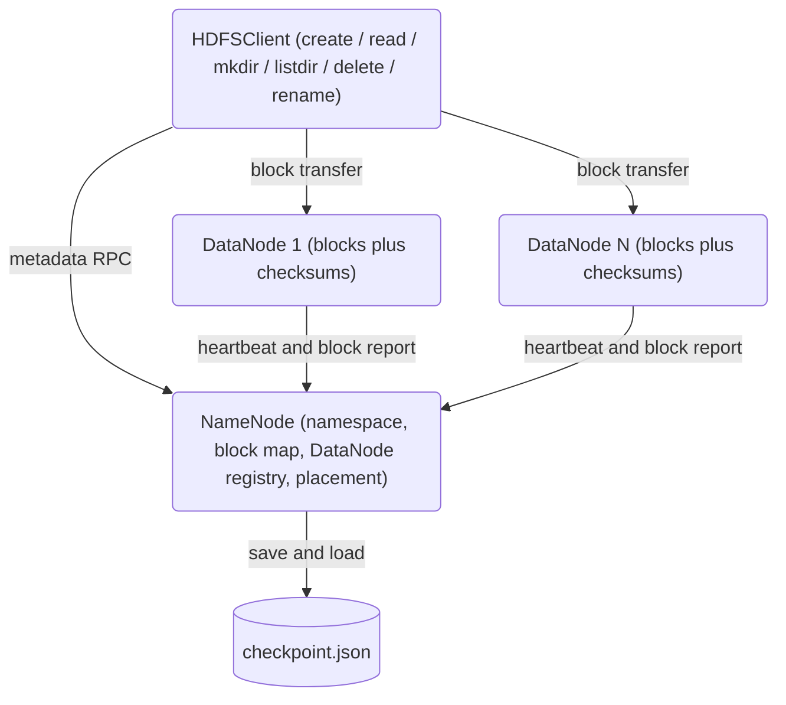

# HDFS-Lite Distributed File System

An HDFS-style distributed file system built from scratch in Python with `asyncio`. It follows the classic Hadoop architecture: a single **NameNode** that owns all filesystem metadata and the block-to-node map, plus a fleet of **DataNodes** that store blocks and serve bulk data transfer. Clients ask the NameNode where each block lives, then move bytes to and from DataNodes directly.

## Features

- **Centralized metadata** — the `NameNode` owns the namespace (`_files` / `_directories`), the forward and reverse block map, and the DataNode registry; clients never touch metadata directly (`namenode/namenode.py`).
- **Block-based storage** — files split into 128 MiB blocks; each `DataNode` stores blocks as plain files under `<data_dir>/blocks/` named by block ID (`datanode/datanode.py`).
- **Configurable replication** — per-file replication factor (default 3) with rack-aware, load-balanced replica placement (`_select_datanodes_for_block`).
- **Heartbeats and block reports** — DataNodes heartbeat every 3 s and send periodic block reports; the NameNode piggybacks delete/replicate/re-register commands on heartbeat replies.
- **Dead-node detection** — any node silent for more than 30 s is evicted and its blocks dropped from the location map.
- **Self-healing re-replication** — a background monitor detects under-replicated blocks (dead node, or live replicas below the target factor), picks a live source holding the block and a live target lacking it, and drives a real byte-for-byte copy over the DataNode `COPY_BLOCK` protocol (pull model) until the replication factor is restored.
- **Safe mode** — on startup the NameNode refuses block allocation until at least 99.9% of known blocks have a reporting replica.
- **Durable namespace checkpoints** — a background task persists the full namespace and block map to a JSON checkpoint every `checkpoint_interval` (written atomically), and the NameNode loads it on startup, so a restarted NameNode recovers its files and block locations. `save_checkpoint` / `load_checkpoint` remain available for manual use.
- **Async client API** — `HDFSClient` exposes file, directory, bulk-I/O, and streaming operations over a length-prefixed JSON wire protocol.
- **Streaming I/O** — `HDFSOutputStream` and `HDFSInputStream` write and read block-at-a-time without buffering whole files; `stream_read` yields chunks.
- **Checksums** — each DataNode computes and caches an MD5 per block and can verify or scan for corruption.

## Architecture



| Component | Module | Responsibility |
|-----------|--------|----------------|
| NameNode | `namenode/namenode.py` | In-memory metadata service: namespace, block map, DN registry, placement, safe mode |
| NameNodeServer | `namenode/namenode.py` | Async TCP front-end adapting `MessageType` requests to `NameNode` calls |
| DataNode | `datanode/datanode.py` | File-backed block store: read/write/delete/verify, heartbeats, block reports |
| DataNodeServer | `datanode/datanode.py` | Async TCP server for client block transfer plus background loops |
| HDFSClient | `client/client.py` | User-facing async API plus `HDFSOutputStream` / `HDFSInputStream` |
| Wire protocol | `common/protocol.py` | `Message` / `MessageType`, length-prefixed JSON framing, typed errors |
| Core types | `common/types.py` | `Block`, `BlockLocation`, `FileInfo`, `DirectoryInfo`, `DataNodeInfo` |

## Quick Start

### Prerequisites

- Python 3.9+
- No external services are required to run the test suite (clusters run in-process).

### Installation

```bash
pip install -e ".[dev]"
```

### Running

There is no CLI; the NameNode and DataNode servers are started programmatically. A minimal single-node cluster:

```python
import asyncio
from hdfs import NameNode, NameNodeServer, DataNode, DataNodeServer

async def main():
    nn = NameNodeServer(NameNode(), host="0.0.0.0", port=9000)
    await nn.start()

    dn = DataNodeServer(DataNode(
        node_id="datanode1",
        data_dir="/tmp/hdfs/datanode1",
        host="localhost", port=50010,
        namenode_host="localhost", namenode_port=9000,
    ))
    await dn.start()

    await asyncio.Event().wait()   # serve forever

asyncio.run(main())
```

## Usage

```python
import asyncio
from hdfs import HDFSClient

async def main():
    client = HDFSClient(namenode_host="localhost", namenode_port=9000)

    # Write and read a file (write() is an alias for create())
    await client.write("/hello.txt", b"Hello, HDFS!")
    data = await client.read("/hello.txt")
    print(data.decode())                       # -> Hello, HDFS!

    # Directories
    await client.mkdir("/data", create_parents=True)
    entries = await client.listdir("/data")
    print(entries)

    # Metadata, rename, delete
    info = await client.get_file_info("/hello.txt")
    print(info["size"], info["replication"])
    await client.rename("/hello.txt", "/data/hello.txt")
    await client.delete("/data/hello.txt")

asyncio.run(main())
```

Streaming a large file block-at-a-time:

```python
async with await client.open_for_write("/big.bin") as f:
    await f.write(payload)

async for chunk in client.stream_read("/big.bin", chunk_size=1 << 20):
    process(chunk)
```

## What's Real vs Simulated

- **Real:** namespace operations, block allocation and placement, the rack-aware load-balanced selection algorithm, heartbeats, block reports, dead-node detection, safe mode, **self-healing re-replication that copies real block bytes between DataNodes**, **periodic namespace checkpointing driven by `checkpoint_interval` with load-on-startup recovery**, the full client API, streaming I/O, and per-block MD5 checksums. All of this is exercised by the test suite, including the replication and durability integration tests that stand up real in-process servers on ephemeral ports.
- **Simulated / not wired:** client writes fan out to each replica in a star, not the HDFS write pipeline; `store_block_pipeline` only forwards to in-process objects. Block bodies travel as hex-encoded strings inside JSON (~2x wire size). `ReplicationPolicy.ERASURE_CODING` is an enum value with no implementation.
- **Honestly out of scope:** NameNode HA / failover, an edit log / write-ahead log (so namespace changes since the last checkpoint are lost on a NameNode crash), auth/TLS on the wire, and rack-awareness beyond the existing single-hint placement. These are stated deliberately rather than faked. See [docs/BLUEPRINT.md](docs/BLUEPRINT.md) for the full list.

## Testing

```bash
pytest                                    # full suite
pytest --cov=hdfs --cov-report=term       # with coverage
pytest tests/test_replication.py -v       # placement and recovery
```

Tests run entirely in-process (no live NameNode/DataNode processes needed). Coverage spans namespace ops, block read/write/verify, the client API and cache, end-to-end integration, and replica placement / failure recovery.

## Project Structure

```
34-distributed-file-system/
  README.md                  # this file
  pyproject.toml             # package metadata and tooling config
  src/hdfs/
    common/                  # types.py (core types), protocol.py (wire protocol)
    namenode/                # NameNode plus NameNodeServer
    datanode/                # DataNode plus DataNodeServer
    client/                  # HDFSClient plus streams
  tests/                     # namenode, datanode, client, integration, replication
  docs/
    BLUEPRINT.md             # full architecture and design
    ARCHITECTURE.md          # deeper architecture notes
    API.md                   # full API reference
    CONTRIBUTING.md          # contribution guide
```

## Configuration

The NameNode, DataNode, and client take constructor keyword arguments rather than config files: replication factor, block size, heartbeat interval, capacity, cache TTL, and checksum verification. See [docs/API.md](docs/API.md) for the full set.

## License

MIT — see [LICENSE](../LICENSE)
