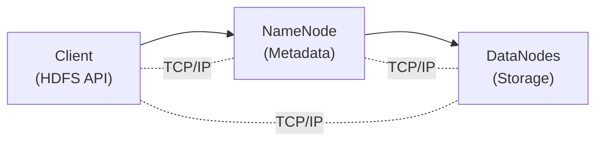
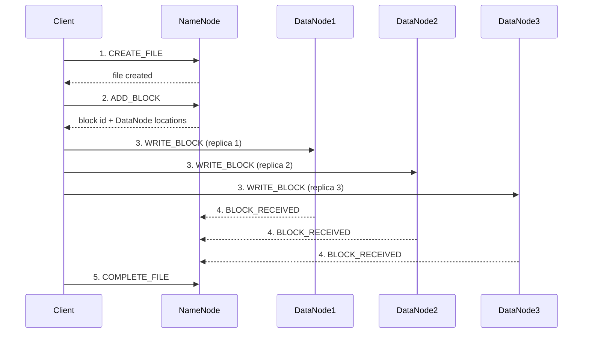
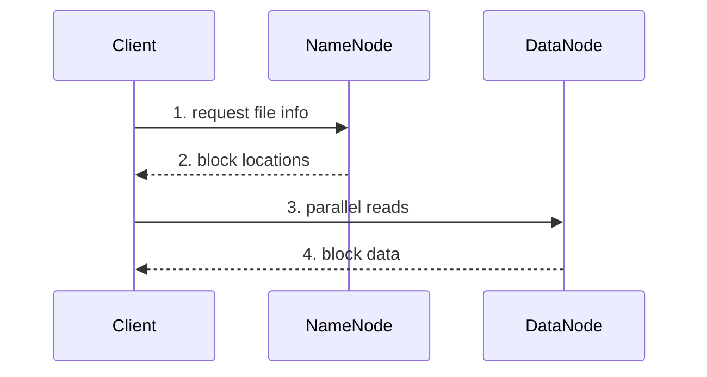
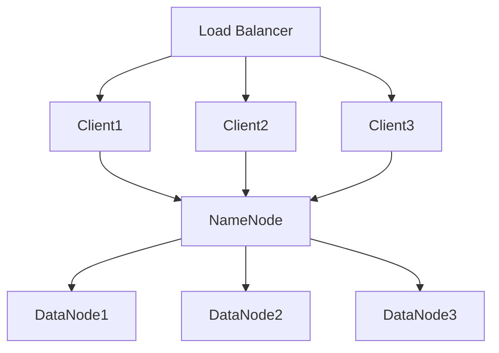

# HDFS-Like Distributed File System Architecture

## Overview

This project implements a distributed file system inspired by the Hadoop Distributed File System (HDFS). It provides reliable, scalable storage for large files across a cluster of commodity hardware.

## System Architecture

### High-Level Design



### Core Components

#### 1. NameNode (Master)

The NameNode is the centerpiece of the HDFS architecture:

- **Namespace Management**: Maintains the filesystem tree and metadata for all files and directories
- **Block Management**: Maps files to blocks and blocks to DataNodes
- **Replication Management**: Ensures blocks meet their target replication factor
- **DataNode Coordination**: Handles registration, heartbeats, and block reports from DataNodes

**Key Data Structures:**
- `_files`: Dictionary mapping file paths to FileInfo objects
- `_directories`: Dictionary mapping directory paths to DirectoryInfo objects
- `_blocks`: Dictionary mapping block IDs to Block objects
- `_block_to_nodes`: Dictionary mapping block IDs to sets of DataNode IDs
- `_datanodes`: Dictionary of registered DataNode information

**Critical Operations:**
- File creation/deletion
- Block allocation
- Replication monitoring
- Safe mode management
- Checkpointing

#### 2. DataNode (Worker)

DataNodes provide actual storage:

- **Block Storage**: Stores and retrieves data blocks on local filesystem
- **Block Reporting**: Periodically sends list of blocks to NameNode
- **Heartbeat**: Sends regular heartbeats to indicate aliveness
- **Peer Re-replication**: On a NameNode `replicate` command, pulls a block's bytes from a source DataNode over `COPY_BLOCK` and stores it locally (self-healing). Client-side write pipelining is out of scope.

**Key Features:**
- Local filesystem-based storage
- Block corruption detection
- Background block scanning
- Bandwidth throttling support

#### 3. Client

The client library provides the user-facing API:

- **File Operations**: Create, read, write, delete files
- **Directory Operations**: Create, list, delete directories
- **Stream Processing**: Supports streaming reads/writes for large files
- **Retry Logic**: Automatic retry on DataNode failures

**Key Features:**
- Transparent block management
- Location-aware reads
- Parallel block operations
- Client-side caching (optional)

## Data Flow

### Write Operation

The client drives replication directly: for each block it fans the block data out
to every target DataNode itself. There is no client-driven DataNode-to-DataNode
write pipeline (that is out of scope). DataNode-to-DataNode transfer only happens
later during self-healing re-replication, when the NameNode issues a `replicate`
command and a DataNode pulls the block from a peer via `COPY_BLOCK`.

1. **Client** sends `CREATE_FILE` to the **NameNode**, which creates the file
   metadata.
2. For each block, the **Client** sends `ADD_BLOCK`; the **NameNode** allocates a
   block id and selects target DataNodes, returning the block id and their
   locations.
3. **Client** sends `WRITE_BLOCK` to each target DataNode directly (one request
   per replica), writing the same block data to all of them.
4. Each **DataNode** stores the block and reports `BLOCK_RECEIVED` to the
   **NameNode**.
5. After all blocks are written, the **Client** sends `COMPLETE_FILE` to finalize
   the file.



### Read Operation

1. **Client** requests file info from **NameNode**
2. **NameNode** returns block locations
3. **Client** reads blocks directly from **DataNodes**
4. **Client** assembles blocks into complete file



## Fault Tolerance

### NameNode Persistence

- **Periodic Checkpointing**: A background task persists the namespace and block map to a JSON checkpoint every `checkpoint_interval` (written atomically via temp-file + rename). The NameNode loads the checkpoint on startup, so a restarted NameNode recovers its files, blocks, and block-to-node locations. `save_checkpoint(path)` / `load_checkpoint(path)` are also callable manually.
- **No Edit Log (out of scope)**: There is deliberately no write-ahead log; namespace changes made between checkpoints are lost on a NameNode crash. A full edit-log/WAL is out of scope for this project.
- **NameNode HA / failover (out of scope)**: Single process, single point of failure. No standby NameNode.

### DataNode Failure Handling

- **Heartbeat Monitoring**: Detect failed nodes via missing heartbeats (silence > 30 s → eviction).
- **Self-Healing Block Re-replication**: When a block falls below its replication factor (a dead node was removed, or live replicas dropped), the NameNode's replication monitor picks a live *source* that holds the block and a live *target* that lacks it, then hands the target a `replicate` command carrying the source's address. The target pulls the block bytes from the source over the `COPY_BLOCK` DataNode operation and reports the new replica, so the replication factor is actually restored with byte-identical content.
- **Rack Awareness**: Single placement hint only; deeper rack topology is out of scope.

### Data Integrity

- **Block Checksums**: (Optional) Verify data integrity on read
- **Block Scanner**: Background process to detect corruption
- **Corruption Reporting**: Report corrupted blocks to NameNode

## Replication Strategy

### Default Policy

- **Replication Factor**: Default is 3 replicas per block
- **Placement Strategy**:
  1. First replica on local node (if applicable)
  2. Second replica on different node
  3. Third replica on another different node

### Under-Replication Handling

1. A background replication monitor (and dead-node removal) detects under-replicated blocks — a DataNode was declared dead, or a block's live replica count is below the file's replication factor
2. For each such block, the NameNode picks a live source that holds a healthy replica and a live target that lacks it
3. The `(block, source, target)` triple is appended to a pending-replication queue; scheduling is idempotent (it counts in-flight copies, so a re-scan will not double-schedule)
4. On its next heartbeat the *target* DataNode receives a `replicate` command carrying the source address, then pulls the block bytes from the source via `COPY_BLOCK` and reports `BLOCK_RECEIVED`, restoring the replication factor

## Network Protocol

### Message Types

All communication uses a custom protocol with these message types:

- **Control Messages**:
  - `REGISTER_DATANODE`: DataNode registration
  - `HEARTBEAT`: Liveness check
  - `BLOCK_REPORT`: List of stored blocks

- **File Operations**:
  - `CREATE_FILE`: Create new file
  - `DELETE_FILE`: Remove file
  - `GET_FILE_INFO`: Retrieve metadata

- **Block Operations**:
  - `ALLOCATE_BLOCKS`: Request new blocks
  - `GET_BLOCK_LOCATIONS`: Find block replicas
  - `REPORT_BAD_BLOCKS`: Report corruption

### Serialization

- JSON-based message serialization
- Length-prefixed messages (4-byte header)
- TCP sockets for all communication

## Performance Optimizations

### Client-Side

- **Parallel Block Operations**: Read/write multiple blocks concurrently
- **Location-Aware Reads**: Prefer local replicas when available
- **Client Caching**: Optional metadata caching to reduce NameNode load
- **Streaming API**: Process large files without loading into memory

### NameNode

- **In-Memory Metadata**: All namespace kept in RAM for fast access
- **Batch Processing**: Group operations where possible
- **Lazy Deletion**: Mark for deletion, clean up asynchronously

### DataNode

- **Direct I/O**: Bypass system cache for large transfers
- **Pipeline Writes**: Overlap network and disk I/O
- **Background Tasks**: Non-blocking corruption scanning

## Scalability Considerations

### Horizontal Scaling

- **DataNodes**: Add nodes to increase storage capacity
- **Blocks**: Fixed-size blocks enable easy distribution
- **Parallel Operations**: Multiple clients can operate simultaneously

### Limitations

- **Single NameNode**: Current bottleneck for metadata operations
- **Memory Constraints**: NameNode memory limits total files/blocks
- **Network Bandwidth**: Replication can consume significant bandwidth

## Security Model

### Current Implementation

- **Basic Authentication**: Node ID-based identification
- **Network Isolation**: Assumes trusted network environment

## Configuration Parameters

### NameNode Configuration

```python
default_replication = 3          # Target replication factor
default_block_size = 128MB       # Default block size
heartbeat_interval = 3s          # Expected heartbeat frequency
checkpoint_interval = 3600s      # Checkpoint frequency
safe_mode_threshold = 0.999      # Block report threshold
```

### DataNode Configuration

```python
data_dir = "/var/hdfs/data"     # Local storage directory
heartbeat_interval = 3s         # Heartbeat frequency
block_report_interval = 3600s   # Full block report frequency
max_bandwidth = None            # Bandwidth limit (bytes/sec)
```

### Client Configuration

```python
block_size = 128MB              # Block size for new files
replication = 3                 # Replication factor
retry_count = 3                 # Number of retry attempts
cache_ttl = 60s                # Metadata cache timeout
```

## Monitoring and Metrics

### Key Metrics

- **System Health**:
  - Number of live/dead DataNodes
  - Total/used/remaining capacity
  - Under-replicated blocks

- **Performance**:
  - Read/write throughput
  - Operation latency
  - Queue depths

- **Operations**:
  - Files/directories created/deleted
  - Blocks allocated/deleted
  - Replication operations

### Health Checks

1. **NameNode Health**: Check responsiveness and memory usage
2. **DataNode Health**: Monitor disk space and corruption rate
3. **Network Health**: Track connection failures and latency

## Deployment Architecture

### Recommended Setup



### Hardware Requirements

**NameNode:**
- CPU: 4+ cores
- RAM: 8GB minimum (1GB per million files)
- Disk: SSD preferred for checkpoint files
- Network: 1Gbps minimum

**DataNode:**
- CPU: 2+ cores
- RAM: 4GB minimum
- Disk: Large capacity HDDs
- Network: 1Gbps minimum

## Testing Architecture

### Unit Testing
- Component isolation with mocks
- Data structure validation
- Protocol testing

### Integration Testing
- Multi-node cluster setup
- End-to-end scenarios
- Failure injection

### Performance Testing
- Throughput benchmarks
- Scalability tests
- Stress testing