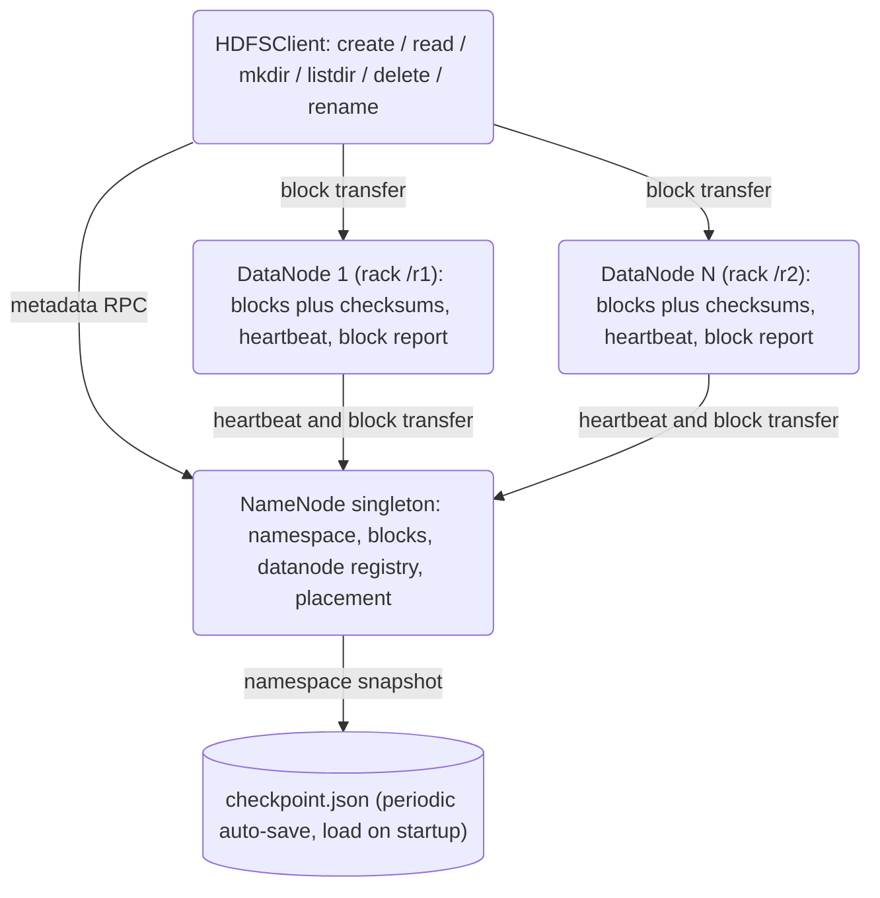

# Distributed File System (HDFS-lite) — Technical Blueprint

## Overview

This project is an HDFS-style distributed file system implemented in Python with
`asyncio`. It follows the classic Hadoop architecture: a single **NameNode**
that owns all filesystem metadata and block-to-node mapping, plus a fleet of
**DataNodes** that own block storage and serve bulk data transfer. Clients talk
to the NameNode to look up which DataNodes hold each block, then talk to
DataNodes directly to move bytes.

The system targets the same workload HDFS targets — large, mostly-append files
read sequentially — and reuses HDFS's coarse-grained design choices: 128 MiB
default block size, configurable per-file replication factor (default 3),
rack-aware replica placement, periodic heartbeats and block reports, a startup
**safe mode**, and JSON checkpoint snapshots of the namespace for persistence.

It is deliberately *not* a Ceph clone: there is no CRUSH algorithm, no
placement groups, no decentralized object placement, and no monitor quorum.
Metadata is centralized in the NameNode, just like HDFS, and the placement
algorithm is a simple rack-aware load-balanced score (40% remaining space, 60%
inverse block count, with a first-pass pick-one-per-rack rule).

The concepts this codebase teaches are the load-bearing ideas of a centralized
distributed file system: the metadata/data split, the block abstraction,
replica placement under rack constraints, liveness via heartbeats, self-healing
re-replication that copies real block bytes between DataNodes, durability via
periodic checkpoints, and the safe-mode bootstrap. It documents the system **as
built** in `src/hdfs/`. Where the code takes a shortcut compared to production
HDFS, the shortcut is called out explicitly rather than papered over (see
[Known Gaps and Simplifications](#known-gaps-and-simplifications)).

### Scope

In scope: a working single-NameNode cluster with multiple DataNodes, the full
client API (namespace, bulk I/O, streaming), rack-aware placement, dead-node
detection, self-healing re-replication (real byte copies over the `COPY_BLOCK`
DataNode op), safe mode, and durable periodic checkpointing with load-on-start
recovery. Out of scope: NameNode HA/failover, an edit log/WAL, pipelined
writes, erasure coding, authentication, encryption, and on-the-wire binary
block frames. These are enumerated honestly rather than implied.

---

## Architecture

### High-Level Architecture



Two flows dominate. Metadata RPC (client to NameNode) resolves paths to block
locations and mutates the namespace. Block transfer (client to and from
DataNodes) moves the actual bytes. The control plane (heartbeat from DN to NN
every ~3 s, with piggy-backed commands NN to DN) keeps the cluster's liveness
and replication state up to date.

### Roles

| Component   | Process     | State                                        | Talks to        |
|-------------|-------------|----------------------------------------------|-----------------|
| NameNode    | `NameNodeServer` (`asyncio`)  | Namespace, block map, DN registry            | Clients, DNs    |
| DataNode    | `DataNodeServer` (`asyncio`)  | Local block files plus checksums             | NameNode, Clients |
| Client      | `HDFSClient` library         | Optional per-path metadata cache (TTL)       | NameNode, DNs   |

The NameNode is **a single process**. There is no Secondary NameNode, no
NameNode HA, no Federation. Recovery is by reloading a JSON checkpoint.

### Layering

- **`common/`** — the shared vocabulary. `types.py` defines the data model;
  `protocol.py` defines the message envelope, message types, and the typed
  error hierarchy. Both NameNode and DataNode and Client depend on these and
  on nothing higher.
- **`namenode/`** — the metadata authority. A pure-Python `NameNode` core (no
  asyncio, fully unit-testable in isolation) wrapped by a `NameNodeServer`
  asyncio adapter.
- **`datanode/`** — the storage engine. A synchronous, file-backed `DataNode`
  core wrapped by a `DataNodeServer` asyncio adapter that also runs the
  heartbeat and block-report loops.
- **`client/`** — the user-facing library. `HDFSClient` plus the two stream
  classes. It depends on `common/` for the protocol but knows nothing about the
  internals of the NameNode or DataNode beyond the wire messages.

This separation — sync cores wrapped by async servers — is the single most
important structural decision. It lets the metadata and storage logic be tested
without standing up a socket, and keeps the asyncio surface thin.

---

## Core Components

### NameNode

Implemented in `src/hdfs/namenode/namenode.py` (~1080 LOC). Two classes:

- `NameNode`: the in-memory metadata service. Pure Python, no asyncio.
- `NameNodeServer`: the asyncio TCP front-end that adapts `MessageType`
  requests to `NameNode` method calls.

#### In-Memory State

```python
class NameNode:
    # tunables
    default_replication:    int                 # 3
    default_block_size:     int                 # 128 MiB
    heartbeat_interval:     float               # 3.0 s
    checkpoint_interval:    float               # 3600 s (drives periodic auto-checkpoint)

    # namespace
    _files:        Dict[path, FileInfo]                  # canonical file map
    _directories:  Dict[path, DirectoryInfo]            # incl. "/" pre-created

    # block map (forward + reverse)
    _blocks:          Dict[BlockID, Block]
    _block_to_nodes:  Dict[BlockID, Set[NodeID]]        # reverse index

    # datanode registry
    _datanodes: Dict[NodeID, DataNodeInfo]

    # work queues to dispatch via heartbeat responses
    _pending_replications:    List[(BlockID, srcNodeID, tgtNodeID)]  # pull-model copy tasks
    _replications_in_flight:  Dict[BlockID, Set[NodeID]]             # dedup guard
    _pending_deletions:       Dict[NodeID, List[BlockID]]           # per-DN trash bin

    # durability
    _checkpoint_path:     Optional[str]                 # where the auto-checkpoint lands

    # startup gate
    _safe_mode:           bool                          # starts True
    _safe_mode_threshold: float                         # 0.999
```

All live state is in memory. Durability is provided by a background
`checkpoint_loop` that serializes the dicts above to a JSON checkpoint every
`checkpoint_interval` (written atomically via temp-file + `os.replace`), plus
load-on-startup recovery via `configure_checkpointing(path)`.
`save_checkpoint(path)` / `load_checkpoint(path)` remain available for manual
use. There is deliberately **no edit log / write-ahead log**, so namespace
changes since the last checkpoint are lost on a crash (out of scope).
`_directories` is pre-seeded with the root `"/"` so that the namespace is never
empty.

#### Namespace operations

`create_file`, `delete_file`, `rename`, `mkdir`, `delete_directory`,
`list_directory`, `list_directory_detailed`, `get_file_info`,
`get_file_info_dict` — all of these manipulate `_files` / `_directories`
under no locks (single-threaded asyncio model). Parents must exist unless
`mkdir(..., create_parents=True)` is used.

`rename(src, dst)` does the obvious move-and-update-children walk; for a
directory rename it calls `_update_subtree_paths(old_prefix, new_prefix)`
which rewrites every descendant key in both `_files` and `_directories`. This
is O(N) in the subtree size because there is no inode indirection — the path
string *is* the key.

#### Block allocation (`add_block`)

```python
def add_block(self, path) -> (Block, List[BlockLocation]):
    if self._safe_mode:
        raise HDFSError("NameNode is in safe mode. Cannot allocate blocks.")
    if path not in self._files:
        raise FileNotFoundError(...)

    targets = self._select_datanodes_for_block(replication)   # see placement
    if not targets:
        raise NoDataNodeError(...)

    block = Block(block_id=generate_block_id())
    self._blocks[block.block_id] = block
    self._files[path].blocks.append(block.block_id)
    return block, [BlockLocation(... for each target ...)]
```

The NameNode **does not yet record** which DataNodes were *intended* to hold
the new block — `_block_to_nodes[block_id]` stays empty until DataNodes
explicitly call `block_received` (via `BLOCK_RECEIVED`) or include the block
in a `BLOCK_REPORT`. This is HDFS-faithful: the NameNode trusts only what
DataNodes report, never what it merely intended.

#### `complete_file(path, size)`

Sets `FileInfo.size`, runs `_check_quota_for_write` to enforce any inherited
space quota on ancestor directories (each ancestor `DirectoryInfo` can carry
an optional `space_quota` attribute set via `set_quota`), and stamps
`modification_time`.

#### Block locations

```python
def get_block_locations(self, path_or_block_id):
    if path_or_block_id.startswith("blk_"):
        return self.get_block_locations_by_id(...)      # List[BlockLocation]
    return self.get_block_locations_for_file(...)       # List[List[BlockLocation]]
```

Per-file lookup returns a list-of-lists in block order, which is what the
client iterates when reading the file end-to-end.
`get_block_locations_by_id` filters out DataNodes whose `is_alive` is false
(no heartbeat in the last 30 s).

#### Heartbeats and block reports

```python
def heartbeat(node_id, used, remaining) -> HeartbeatResponse:
    if node_id not in self._datanodes:
        return HeartbeatResponse(commands=[{"type": "re-register"}])

    self._datanodes[node_id].last_heartbeat = time.time()
    # update usage ...

    # 1. age out any DataNode that hasn't checked in for >30 s
    self.check_and_remove_dead_nodes()

    # 2. drain pending work for this node
    commands = []
    if node_id in self._pending_deletions:
        commands.append({"type": "delete", "block_ids": [...]})
    for (block, source, target) in pending_replications:
        if target == node_id and source is alive:
            # pull model: tell the target to copy the block from the source
            commands.append({"type": "replicate", "block_id": block,
                             "source": {host, port}})

    return HeartbeatResponse(commands=commands)
```

Every heartbeat is also when liveness is **enforced**: the NameNode walks its
DataNode registry and removes any node whose `last_heartbeat` is more than
30 s old, and (via the same path used by the background replication monitor)
schedules re-replication of its now under-replicated blocks. The re-replication
here is **real**: the target DataNode pulls the block bytes from a live source
over the `COPY_BLOCK` op and reports the new replica (see the DataNode section
and [Under-replication / self-healing](#under-replication--self-healing)).

`block_report(BlockReport)` is processed by clearing this node's membership
from every entry in `_block_to_nodes` and then re-adding it for the blocks
the DN reports. Unknown blocks (no `Block` object in `_blocks`) are ignored.

`block_received(node_id, block_id, size)` is the fast path called when a
client write finishes a single block; it updates the size on `Block`, adds
the node to the reverse index, and adds the block to the DN's recorded set.

#### Statistics, quotas, checkpointing

- `get_statistics()` returns file count, dir count, block count, DN count,
  total/used/remaining capacity, and safe-mode status.
- `set_quota(path, namespace_quota, space_quota)` attaches optional
  attributes to a `DirectoryInfo`. `_check_quota_for_write(path, size)`
  walks ancestors and rejects writes that would push consumed space over a
  space quota.
- `save_checkpoint(path)` serializes `_files`, `_directories`, `_blocks`,
  `_datanodes`, and `_block_to_nodes` to a JSON file; `load_checkpoint(path)`
  reads it back. DN `last_heartbeat` is reset to `now()` on load to avoid
  immediate eviction, which means a checkpoint reload doesn't preserve "this DN
  is actually dead" — every DN starts as "alive" until 30 s pass without a real
  heartbeat.
- **Durability is live, not manual.** `configure_checkpointing(path)` loads any
  existing checkpoint on startup and records where to persist. A background
  `checkpoint_loop` then writes an atomic checkpoint (temp file + `os.replace`)
  every `checkpoint_interval`; `NameNodeServer.start()` wires this up and
  `stop()` writes a final checkpoint. So a restarted NameNode over the same
  checkpoint directory recovers its files, blocks, and block-to-node map. What
  it does **not** recover is writes since the last checkpoint — that would need
  an edit log/WAL, which is out of scope.

##### Under-replication / self-healing

`scan_and_schedule_replication()` is the heart of self-healing. It walks every
under-replicated block, and for each one:

1. Collects the block's **live holders** (candidate sources). If none are live,
   the block is genuinely lost and is logged, not scheduled.
2. Counts copies already queued or in flight so it never double-schedules the
   same target (idempotent — safe to call every monitor tick).
3. Picks live **targets** that lack the block and enqueues
   `(block, source, target)` triples.

Each target is handed a `replicate` command on its next heartbeat carrying the
source's address, and the DataNode pulls the bytes via `COPY_BLOCK`. This runs
both from `_remove_datanode` (immediately on eviction) and from the background
`replication_monitor_loop`, which also ages out dead nodes each tick. The net
effect: a DataNode dying permanently no longer loses replicas — the bytes are
copied to a healthy node and the replication factor is restored.

### DataNode

Implemented in `src/hdfs/datanode/datanode.py` (~540 LOC). Two classes:

- `DataNode`: the storage engine (sync, file-backed).
- `DataNodeServer`: the asyncio server for client block transfer.

#### On-Disk Layout

```
<data_dir>/
  └── blocks/
        ├── blk_3a7f9c1d8e2b4a90
        ├── blk_3a7f9c1d8e2b4a90.crc      (logical — checksum is in memory)
        ├── blk_8c1e0d2f7b3a9c45
        └── ...
```

Each block file's name **is** the block ID. On startup, `_scan_blocks()`
walks `blocks/` and for each `blk_*` file records:

- `_blocks: Dict[BlockID, int]` — block id → on-disk size
- `_block_checksums: Dict[BlockID, str]` — block id → MD5 of bytes (computed
  on scan)

`used_space` is `sum(self._blocks.values())`; `remaining_space` is
`capacity - used_space`.

#### Block operations

```python
def write_block(block_id, data) -> int:
    open(blocks/block_id, 'wb').write(data)
    _blocks[block_id] = len(data)
    _block_checksums[block_id] = md5(data).hexdigest()
    return len(data)

def read_block(block_id, offset=0, length=-1) -> bytes:
    if block_id not in _blocks: raise BlockNotFoundError
    f = open(blocks/block_id, 'rb'); f.seek(offset); return f.read(length)

def delete_block(block_id) -> bool: ...
def verify_block(block_id) -> bool:        # recompute md5, compare
def scan_blocks() -> List[BlockID]:        # return all corrupted ids
```

Pipeline replication exists on the DataNode in stub form:

```python
def store_block_pipeline(block_id, data, downstream_nodes=None) -> int:
    size = self.write_block(block_id, data)
    if downstream_nodes:
        for node in downstream_nodes:
            if hasattr(node, 'store_block'):
                node.store_block(block_id, data)
    return size
```

This forwards by *calling Python methods on a passed-in DataNode object*,
which works in unit tests but is not actually used by the live client (see
[Known Gaps](#known-gaps-and-simplifications)).

#### NameNode communication

The DataNode talks to the NameNode over the same `Message` protocol:

- `register_with_namenode()` — `REGISTER_DATANODE` on startup, sending
  `(node_id, host, port, capacity)`. The default rack `/default-rack` is used
  unless the NameNode is told otherwise on the NN-side `register_datanode`
  call.
- `send_heartbeat()` — `HEARTBEAT` every 3 s with `used` and `remaining`.
  Returns any commands the NameNode has queued for us.
- `send_block_report()` — `BLOCK_REPORT` with the full list of block IDs.
  Sent at startup and on a long interval (3600 s default).
- `report_block_received(block_id, size)` — `BLOCK_RECEIVED` after a
  successful write.

#### Command execution

When the heartbeat reply carries commands:

```python
async def execute_command(self, command):
    if cmd_type == "delete":
        for block_id in command["block_ids"]:
            self.delete_block(block_id)
    elif cmd_type == "replicate":
        # pull the block bytes from the source peer, then report the replica
        await self.copy_block_from_peer(command["block_id"],
                                        command["source"]["host"],
                                        command["source"]["port"])
    elif cmd_type == "re-register":
        await self.register_with_namenode()
```

`copy_block_from_peer(block_id, host, port)` opens a timeout-bounded connection
to the source DataNode, issues a `COPY_BLOCK` request, receives the block's
bytes, writes them to local storage, and reports `BLOCK_RECEIVED` to the
NameNode. This is the mechanism that makes re-replication real self-healing
rather than a log line.

#### Background tasks

`DataNodeServer.start()` kicks off three things:

1. The asyncio TCP server on `(self.host, self.port)`.
2. A `heartbeat_loop()` task (3 s cadence).
3. A `block_report_loop()` task (3600 s cadence).

The data-transfer server handles `READ_BLOCK`, `WRITE_BLOCK`, `COPY_BLOCK`, and
`DELETE_BLOCK`. `WRITE_BLOCK` writes locally and then fires
`report_block_received` back to the NameNode. `COPY_BLOCK` serves a block's raw
bytes to a peer DataNode performing re-replication (the pull side of
`copy_block_from_peer`).

### Client

Implemented in `src/hdfs/client/client.py` (~770 LOC). Three classes:

- `HDFSClient` — the main API.
- `HDFSOutputStream` — buffered streaming writer.
- `HDFSInputStream` — block-at-a-time streaming reader.

#### Write path

`HDFSClient.create(path, data, replication, block_size, overwrite)`:

```
1. CREATE_FILE  → NN  (sets up FileInfo, registers under parent dir)
2. for each block-sized slice of `data`:
       ADD_BLOCK         → NN  → returns (block_id, locations[3])
       for loc in locations:
           WRITE_BLOCK   → DataNode(loc.host, loc.port)
3. COMPLETE_FILE → NN  (records final size)
```

Key choice: the client **fans the WRITE_BLOCK out to every replica itself**.
This is a star topology, not the pipelined fan-out used by real HDFS. It is
simpler and shorter-latency for small blocks; for full-sized 128 MiB blocks
it costs the client a 3x upstream bandwidth. The DataNode's
`store_block_pipeline()` stub exists for unit tests that pass live DataNode
objects but is not invoked from the wire path. `write()` is a thin alias for
`create()`; `put()`/`get()` wrap a local file copy.

#### Read path

`HDFSClient.read(path)`:

```
1. GET_BLOCK_LOCATIONS → NN → returns [[loc, loc, loc], [loc, loc, loc], ...]
2. for each block's locations:
       try locations in order until one returns SUCCESS:
           READ_BLOCK → DataNode
3. concatenate.
```

The client iterates the replica list in the order the NameNode returned it
(which itself is iteration order of a `set`). There is no preference for
"closest" replica. `_read_block_with_retry` is what falls through to the next
replica when one read fails.

#### Streaming

`HDFSOutputStream` buffers writes in a `BytesIO` and flushes a new block
each time the buffer hits `block_size`. On `close()` it flushes whatever is
left and issues `COMPLETE_FILE`.

`HDFSInputStream` keeps a current-block buffer and an offset and loads the
next block on demand. `stream_read()` is a convenience generator over the
same machinery, yielding bytes in roughly `chunk_size` chunks (rounded up
to whole blocks). Both stream classes support `async with` via
`__aenter__`/`__aexit__`.

There is an optional in-memory metadata cache (`enable_cache=True`,
`cache_ttl=60s`) and a `verify_checksum` flag. The cache is keyed by path and
holds the raw response payload.

---

## Data Structures

Defined in `src/hdfs/common/types.py`.

```python
BlockID = str          # "blk_" + 16-char hex, e.g. "blk_3a7f9c1d8e2b4a90"
NodeID  = str          # "node_" + 12-char hex, e.g. "node_7c3e9a1b8d2f"

class ReplicationPolicy(Enum):
    DEFAULT         = "default"   # standard 3x replication (only one wired)
    ERASURE_CODING  = "ec"        # placeholder, not implemented
    SINGLE          = "single"    # no replication

@dataclass
class Block:
    block_id: BlockID
    size: int = 0
    generation_stamp: int = 0    # ms-since-epoch when allocated

@dataclass
class BlockLocation:
    block_id: BlockID
    node_id: NodeID
    host: str
    port: int
    rack: str = "/default-rack"

@dataclass
class DataNodeInfo:
    node_id: NodeID
    host: str
    port: int
    rack: str = "/default-rack"
    capacity: int = 0          # total bytes
    used: int = 0
    remaining: int = 0
    last_heartbeat: float = 0.0
    blocks: Set[BlockID] = set()

    @property
    def is_alive(self) -> bool:
        return time.time() - self.last_heartbeat < 30.0

@dataclass
class FileInfo:
    path: str
    size: int = 0
    block_size: int = 128 * 1024 * 1024   # 128 MiB
    replication: int = 3
    blocks: List[BlockID] = []
    modification_time: float
    access_time: float
    owner: str = "hdfs"
    group: str = "supergroup"
    permission: int = 0o644

@dataclass
class DirectoryInfo:
    path: str
    children: Set[str] = set()     # base names of immediate children only
    modification_time: float
    owner: str = "hdfs"
    group: str = "supergroup"
    permission: int = 0o755
```

A few things worth noting about how these are used:

- **Block IDs are strings** that start with `"blk_"`. The NameNode actually
  pattern-matches on this prefix in `get_block_locations()` to disambiguate
  "did the caller pass me a path or a block ID?" — a deliberate shortcut for
  protocol simplicity.
- A `DirectoryInfo` stores only immediate child *names*, not paths. Full
  paths are reconstructed by concatenation, and rename re-walks the subtree
  to update `_files`/`_directories` keys.
- There is **no inode number**. The flat dict `_files: Dict[path, FileInfo]`
  is the source of truth; `_directories: Dict[path, DirectoryInfo]` is the
  parallel structure for dirs. This means `rename` has to update every
  descendant entry. It is O(N) in the subtree size.
- `DataNodeInfo.is_alive` encodes the 30 s liveness window as a property, so
  every consumer (placement, location filtering, eviction) reads the same
  definition of "alive".

### Replica Placement Algorithm

Implemented in `NameNode._select_datanodes_for_block(replication)`.

```python
def _select_datanodes_for_block(self, replication):
    # 1. Filter: alive DNs with at least one block's worth of space.
    available = [(nid, dn) for nid, dn in self._datanodes.items()
                 if dn.is_alive and dn.remaining > self.default_block_size]
    if len(available) < replication:
        return [nid for nid, _ in available]

    # 2. Score each candidate.
    #    block_count(nid) = how many blocks in _block_to_nodes contain nid
    block_counts = {nid: count_blocks_held(nid) for nid, _ in available}
    max_rem      = max(dn.remaining for _, dn in available) or 1
    max_blocks   = max(block_counts.values()) + 1

    def load_score(nid, dn):
        return 0.6 * block_counts[nid] / max_blocks \
             + 0.4 * (1 - dn.remaining / max_rem)

    available.sort(key=lambda x: load_score(*x))   # lowest score first

    # 3. Two-pass rack-aware fill.
    selected, racks_used = [], set()
    for nid, dn in available:                       # pass 1: one per rack
        if len(selected) >= replication: break
        if dn.rack not in racks_used:
            selected.append(nid); racks_used.add(dn.rack)
    for nid, dn in available:                       # pass 2: fill the rest
        if len(selected) >= replication: break
        if nid not in selected:
            selected.append(nid)
    return selected
```

Properties:

- **Rack diversity is best-effort.** With three replicas and three or more
  distinct racks among the lowest-load candidates, all three picks land on
  different racks. With fewer racks, the second pass fills remaining slots
  from any rack.
- **Load is a weighted sum, not a hard constraint.** 60% goes to "how many
  blocks does this DN already hold", 40% to "how full is it (as fraction of
  the fullest peer)". Both are normalized only against the *currently
  alive* set.
- **No graph / pseudo-random hashing.** This is not CRUSH; the placement is
  recomputed from scratch on every `add_block`. Locality is therefore *not*
  stable as the cluster scales or as DNs come and go — but on the flip side,
  there are no placement-group invariants to keep consistent.

This is a deliberate simplification: real HDFS picks one local replica, one
on a remote rack, one on the same remote rack as the second, in that fixed
order. The score-based version is easier to reason about and tests well; it
loses the "first replica is local to the writer" optimization (the client
has no concept of locality in this codebase anyway).

---

## API Design

### Wire protocol

Defined in `src/hdfs/common/protocol.py` (~135 LOC). All RPC — client to
NameNode, client to DataNode, DataNode to NameNode — uses the same framing: a
4-byte big-endian length prefix, followed by a JSON-encoded `Message` payload
of the shape `{type, payload, ...}`.

The transport is plain TCP via `asyncio.open_connection` /
`asyncio.start_server`. There is no TLS, no auth, no compression. Binary block
data is transported as **hex-encoded strings inside the JSON payload**, which
is the single most expensive shortcut in the system (2x the wire size for
block bodies). The system is therefore appropriate for correctness testing and
small workloads but not for production throughput.

#### Message types

```python
class MessageType(Enum):
    # Namespace ops (client → NameNode)
    CREATE_FILE          = "create_file"
    OPEN_FILE            = "open_file"
    DELETE_FILE          = "delete_file"
    RENAME_FILE          = "rename_file"
    MKDIR                = "mkdir"
    DELETE_DIR           = "delete_dir"
    LIST_DIR             = "list_dir"
    GET_FILE_INFO        = "get_file_info"

    # Block lifecycle (client → NameNode)
    ADD_BLOCK            = "add_block"
    COMPLETE_FILE        = "complete_file"
    GET_BLOCK_LOCATIONS  = "get_block_locations"
    REPORT_BAD_BLOCKS    = "report_bad_blocks"

    # DataNode registration & health (DataNode → NameNode)
    REGISTER_DATANODE    = "register_datanode"
    HEARTBEAT            = "heartbeat"
    BLOCK_REPORT         = "block_report"
    BLOCK_RECEIVED       = "block_received"

    # Data transfer (client ↔ DataNode)
    READ_BLOCK           = "read_block"
    WRITE_BLOCK          = "write_block"
    COPY_BLOCK           = "copy_block"
    DELETE_BLOCK         = "delete_block"

    # Generic responses
    SUCCESS              = "success"
    ERROR                = "error"
```

Every reply is itself a `Message` (`SUCCESS` with payload, or `ERROR` with an
`"error"` string). Errors raised by the NameNode core that are typed —
`FileNotFoundError`, `FileExistsError`, `DirectoryNotEmptyError`,
`NoDataNodeError`, `BlockNotFoundError`, `ReplicationError`, `HDFSError` — are
caught at the dispatcher boundary in `NameNodeServer._process_message` and
flattened into `ERROR` payloads.

### Client API surface

`HDFSClient` (constructed with `namenode_host`, `namenode_port`, `block_size`,
`replication`, `enable_cache`, `cache_ttl`, `verify_checksum`):

```python
# Namespace
await client.mkdir(path, create_parents=False)
await client.listdir(path)                 # List[Dict]
await client.exists(path)
await client.get_file_info(path)           # or get_file_status(path)
await client.rename(src, dst)
await client.delete(path)
await client.rmdir(path, recursive=False)

# Bulk I/O
await client.create(path, data=b"", replication=None, block_size=None, overwrite=False)
await client.write(path, data)             # alias for create
await client.read(path)                     # -> bytes
await client.append(path, data)
await client.put(local_path, hdfs_path)
await client.get(hdfs_path, local_path)

# Streaming
async with await client.open_for_write(path) as f: await f.write(data)
async with await client.open_for_read(path)  as f: chunk = await f.read(n)
async for chunk in client.stream_read(path, chunk_size=1 << 20): ...
```

### NameNode core API (selected)

```python
nn = NameNode(default_replication=3, default_block_size=128 << 20)

nn.create_file(path, replication, block_size, overwrite)
nn.delete_file(path)
nn.rename(src, dst)
nn.mkdir(path, create_parents=False)
nn.add_block(path)                          # -> (Block, [BlockLocation])
nn.complete_file(path, size)
nn.get_block_locations(path_or_block_id)
nn.register_datanode(node_id, host, port, capacity, rack="/default-rack")
nn.heartbeat(node_id, used, remaining)      # -> HeartbeatResponse(commands)
nn.handle_block_report(node_id, block_ids)
nn.check_and_remove_dead_nodes(timeout=30.0)
nn.get_statistics()
nn.set_quota(path, namespace_quota=None, space_quota=None)
nn.save_checkpoint(path); nn.load_checkpoint(path)
```

### Server entry points

There is no CLI module. Servers are constructed and started in process:

```python
server = NameNodeServer(NameNode(), host="0.0.0.0", port=9000)
await server.start()

dn = DataNodeServer(DataNode(node_id="dn1", data_dir="/tmp/hdfs/dn1",
                             host="localhost", port=50010,
                             namenode_host="localhost", namenode_port=9000))
await dn.start()
```

`DataNodeServer.start()` binds the TCP server, registers with the NameNode,
sends an initial block report, and launches the heartbeat and block-report
loops.

---

## Performance

The system has not been formally benchmarked; no measured throughput or
latency numbers exist in the repository, so none are claimed here. The known
performance ceilings are imposed by the design choices above, in roughly this
order of severity:

1. **JSON-encoded block transfer.** Block bodies are hex-encoded inside JSON,
   doubling the wire size and adding parse cost. This is the dominant cap on
   per-stream throughput and the first thing a length-prefixed binary frame
   would fix.
2. **Single-threaded NameNode.** asyncio plus the Python GIL means all
   metadata ops are serialized. Adequate for thousands of files; it would
   saturate well below HDFS's millions.
3. **Star-topology writes from the client.** With replication factor 3, the
   client's upstream bandwidth is the write bottleneck, because it sends each
   block to all three replicas itself rather than pipelining.
4. **No batching of heartbeats / block reports.** Each is a fresh TCP
   connection, so control-plane overhead grows linearly with the DataNode
   count.

Design choices that *help* within those limits: 128 MiB blocks keep the
metadata-to-data ratio low and favor large sequential I/O; the metadata path
is pure in-memory dict access; and reads try replicas in order so a single
slow or dead replica does not stall the whole read. Improving any of the four
ceilings above is a localized change, not a redesign — but doing so was out of
scope.

---

## Testing Strategy

The suite is organized per component plus an integration and a replication
layer (~2600 LOC of tests against ~2680 LOC of production code).

| Test file              | What it exercises                                                                                       |
|------------------------|---------------------------------------------------------------------------------------------------------|
| `test_namenode.py`     | Namespace ops, block allocation, DN registry, heartbeats, safe mode, checkpoint round-trip, quotas      |
| `test_datanode.py`     | Block read/write/delete, checksum verify, block scan/recover, pipeline (in-process), throttling         |
| `test_client.py`       | Client API surface, error mapping, metadata cache TTL, streaming reads/writes                           |
| `test_integration.py`  | End-to-end create / read / list / rename / delete against an in-process cluster                          |
| `test_replication.py`  | 40 tests: rack-aware placement, replication-factor enforcement, failure recovery, under/over-replication detection, data consistency, safe-mode behavior, async heartbeats |

The sync-core-plus-async-server split is what makes this tractable: most of
the NameNode and DataNode logic is tested by calling pure methods directly,
with no socket in the loop. A representative integration shape:

```python
async def test_create_read_round_trip():
    nn = NameNode()
    dns = [DataNode(node_id=f"node_{i}", data_dir=f"/tmp/dn{i}",
                    host="localhost", port=50010+i, rack=f"/rack{i%2}")
           for i in range(3)]
    for dn in dns:
        nn.register_datanode(dn.node_id, dn.host, dn.port,
                             capacity=10*1024**3, rack=dn.rack)
        nn.handle_block_report(dn.node_id, [])     # exit safe mode

    # ... create file, push blocks through write_block, complete_file ...
    # ... read back via get_block_locations + read_block ...
    assert read_data == written_data
```

Coverage emphasis:

- **Placement**: that three replicas land on distinct racks when racks allow,
  and that the load score steers blocks toward emptier, less-loaded nodes.
- **Liveness and recovery**: that a node silent past 30 s is evicted and its
  blocks removed from the location map.
- **Self-healing re-replication**: `TestSelfHealingReplication` stands up a
  real in-process cluster on ephemeral ports, writes a file at R=3, kills a
  holder, drives the heartbeat/replication cycle, and asserts the block is
  copied to a fresh live node with byte-identical content and the live replica
  count restored to R. A companion test asserts scheduling is idempotent while
  a copy is in flight.
- **Namespace durability**: `TestNamespaceDurability` proves the periodic
  `checkpoint_loop` actually writes on its interval, and that a fresh NameNode
  over the same checkpoint directory recovers files, block locations, and the
  directory tree.
- **Safe mode**: that a fresh cluster exits immediately and a reloaded
  checkpoint holds until reports arrive.
- **Edge cases**: missing-file errors, non-empty-directory deletes, quota
  rejection, cache TTL expiry, and reading through a failed replica to the
  next one in the list.

`pytest-asyncio` runs in `asyncio_mode = "auto"`. The integration/durability
tests use real in-process NameNode/DataNode servers on ephemeral ports; the
unit tests run with no live sockets.

---

## Known Gaps and Simplifications

The implementation is honest about being HDFS-*lite*. The following are known
shortcuts that would need work to claim full HDFS parity:

1. **No edit log / WAL (out of scope).** Durability is via periodic JSON
   checkpoints only. Namespace changes made *since the last checkpoint* are
   lost on a NameNode crash. Closing this gap would require an edit log/WAL,
   which is deliberately not implemented.
2. **No NameNode HA / failover (out of scope).** Single process, single point
   of failure. There is no Secondary NameNode, no JournalNodes, no
   Active/Standby pair.
3. **No pipelined client writes.** The client writes to all replicas itself
   in sequence; real HDFS pipelines client to DN1 to DN2 to DN3 with acks
   streamed back. `store_block_pipeline` forwards only to in-process objects.
   (Note: re-replication *between* DataNodes is real — see below — this gap is
   only about the client-side write path.)
4. **Block bodies are hex-encoded inside JSON.** A 128 MiB block becomes
   256 MiB on the wire. Acceptable for testing, unacceptable for throughput.
5. **No authentication, no encryption, no quotas-on-the-wire (out of scope).**
   It is a single-tenant testbed. `owner`/`group`/`permission` exist but aren't
   enforced. Auth/TLS on the wire is deliberately out of scope.
6. **No locality.** The client picks the first replica returned by the
   NameNode, and the NameNode returns replicas in `set` iteration order.
7. **No append at the block level.** `append(path, data)` reads the whole
   existing file, concatenates, deletes, and rewrites.
8. **Erasure coding is enum-only.** `ReplicationPolicy.ERASURE_CODING` exists;
   nothing produces or decodes EC stripes.
9. **Rack-awareness is a single placement hint (out of scope beyond that).**
   The placement score prefers distinct racks on the first pass, but there is
   no deeper topology, no cross-rack pipeline ordering, and re-replication
   targets are not rack-optimized.
10. **Safe-mode reporting only counts blocks the NameNode already knows
    about.** A fresh NameNode with no `_blocks` exits safe mode immediately.
11. **`rename` of a large subtree is O(N).** Every descendant key in `_files`
    and `_directories` is rewritten.
12. **Pending-replication consumption is heartbeat-driven.** A
    `_pending_replications` entry is delivered when the *target* DataNode
    heartbeats; entries queued but not yet delivered are not persisted across a
    NameNode restart. The background replication monitor simply re-derives and
    re-schedules them from the recovered block map, so nothing is permanently
    lost — it just re-detects the under-replication after restart.

---

## File Layout

```
34-distributed-file-system/
├── README.md
├── pyproject.toml
├── docs/
│   ├── BLUEPRINT.md                   ← this document
│   ├── API.md
│   ├── ARCHITECTURE.md
│   └── CONTRIBUTING.md
├── src/
│   └── hdfs/
│       ├── __init__.py                (re-exports the public surface)
│       ├── common/
│       │   ├── types.py               (~150 LOC: BlockID, FileInfo, etc.)
│       │   └── protocol.py            (~135 LOC: Message, MessageType, errors)
│       ├── namenode/
│       │   └── namenode.py            (~1080 LOC: NameNode + NameNodeServer)
│       ├── datanode/
│       │   └── datanode.py            (~540 LOC: DataNode + DataNodeServer)
│       └── client/
│           └── client.py              (~770 LOC: HDFSClient + streams)
└── tests/
    ├── conftest.py / fixtures.py
    ├── test_namenode.py
    ├── test_datanode.py
    ├── test_client.py
    ├── test_integration.py
    └── test_replication.py            (40 dedicated replication tests)
```

Approximate breakdown: ~2680 LOC of production code, ~2600 LOC of tests.

---

## References

- *The Hadoop Distributed File System*, Shvachko, Kuang, Radia, Chansler
  (MSST 2010) — the architectural blueprint this project most closely
  follows.
- *The Google File System*, Ghemawat, Gobioff, Leung (SOSP 2003) — the prior
  art for primary/secondary chunk replication. The system here has no leases
  or primary chunk server because the client writes directly to every replica.
- Apache Hadoop HDFS source tree — referenced for the heartbeat / block-report
  cadences and the safe-mode threshold.
