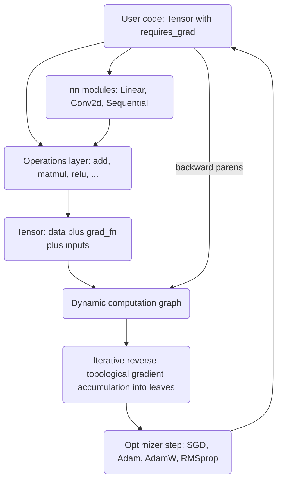

# Differentiable Programming

A PyTorch-style automatic differentiation framework built from scratch on NumPy. It
provides a `Tensor` type with reverse-mode autodiff, a library of differentiable
operations, neural-network modules, and optimizers — all in pure Python with NumPy as the
only runtime dependency.

## Features

- **Reverse-mode autodiff** — every operation records a closure-based backward function and
  its inputs; `Tensor.backward()` walks the graph in reverse-topological order (iterative,
  non-recursive) so arbitrarily deep graphs work and each node is processed exactly once,
  accumulating gradients into leaf tensors (`Tensor` / `core/tensor.py`).
- **Gradient-tracking tensor** — `requires_grad`, gradient accumulation, `detach()`,
  `zero_grad()`, `item()`, `numpy()`, and shape metadata (`shape`, `ndim`, `dtype`, `size`).
- **Operator overloading** — `+`, `-`, `*`, `/`, unary `-`, `**`, `@`, and indexing all
  build graph nodes, so ordinary Python arithmetic is differentiable.
- **Operation library** — arithmetic, `matmul`, `exp`/`log`/`sqrt`/`sin`/`cos`, activations
  (`relu`, `sigmoid`, `tanh`, `softmax`), reductions (`sum`, `mean`, `max`), and shape ops
  (`reshape`, `transpose`, `concat`) with hand-written gradients (`ops/operations.py`).
- **Broadcasting-aware gradients** — `add`/`sub`/`mul`/`div` reduce upstream gradients back
  to each operand's shape so broadcasting differentiates correctly.
- **Neural-network modules** — `Linear`, `Conv2d` (trainable: full im2col forward and
  col2im backward for input, weight, and bias gradients), `BatchNorm1d`, `LayerNorm`,
  `Dropout`, activation modules, and a `Sequential` container, all subclassing `Module`
  (`nn/modules.py`).
- **Loss functions** — `MSELoss` and `CrossEntropyLoss` (fused softmax + cross-entropy) with
  analytic backward passes.
- **Optimizers** — `SGD` (momentum, weight decay), `Adam`, `AdamW`, and `RMSprop`
  (`nn/optim.py`).
- **Functional gradients** — `grad(func)` and `value_and_grad(func)` in the JAX style return
  gradients of a scalar-valued function with respect to its inputs.
- **Gradient context** — `no_grad()` and `enable_grad()` context managers toggle a global
  flag that suppresses graph construction.

## Architecture



| Component | Module | Responsibility |
|-----------|--------|----------------|
| Tensor | `core/tensor.py` | Data wrapper, autograd graph node, `backward()`, factory methods |
| Functional autodiff | `core/tensor.py` | `grad`, `value_and_grad`, `no_grad`, `enable_grad` |
| Operations | `ops/operations.py` | Differentiable ops with closure-based backward functions |
| Modules | `nn/modules.py` | `Module` base, layers, activations, `Sequential`, losses |
| Optimizers | `nn/optim.py` | `SGD`, `Adam`, `AdamW`, `RMSprop` |

## Quick Start

### Prerequisites

- Python 3.9+
- NumPy (installed automatically). No other services are needed to run the tests.

### Installation

```bash
pip install -e ".[dev]"
```

### Running

This is a library, not a service. Import it and build a model:

```python
from autograd import Tensor, Linear, ReLU, Sequential, MSELoss, SGD
```

## Usage

A minimal training step against the real public API:

```python
import numpy as np
from autograd import Tensor, Sequential, Linear, ReLU, MSELoss, SGD

model = Sequential(
    Linear(4, 8),
    ReLU(),
    Linear(8, 1),
)
loss_fn = MSELoss()
optimizer = SGD(model.parameters(), lr=0.01, momentum=0.9)

x = Tensor(np.random.randn(16, 4), requires_grad=True)
y = Tensor(np.random.randn(16, 1))

for _ in range(100):
    optimizer.zero_grad()
    pred = model(x)
    loss = loss_fn(pred, y)
    loss.backward()
    optimizer.step()

print(loss.item())
```

Scalar gradient and the functional `grad` transform:

```python
from autograd import Tensor, grad

# Direct backward: dy/dx for y = x^2 + 3x + 1 at x = 2  -> 2x + 3 = 7
x = Tensor([2.0], requires_grad=True)
y = x ** 2 + 3 * x + 1
y.backward()
print(x.grad)            # [7.]

# Functional gradient of a scalar-valued function
def f(x):
    return (x ** 2).sum()

df = grad(f)
print(df(Tensor([2.0, 3.0])))   # [4. 6.]
```

## What's Real vs Simulated

- **Real:** the `Tensor` autograd engine (iterative reverse-topological backward with
  gradient accumulation, so deep graphs are supported and each node is processed once);
  all operations in `ops/operations.py` with hand-derived, numerically verified gradients;
  `Linear`, `Conv2d`, `BatchNorm1d`, `LayerNorm`, and `Dropout` forward and backward passes
  (`Conv2d` is fully trainable — its col2im backward computes input, weight, and bias
  gradients, checked against finite differences); `MSELoss` and `CrossEntropyLoss`; the
  `SGD`, `Adam`, `AdamW`, and `RMSprop` optimizers; `grad` / `value_and_grad`; and the
  `no_grad` / `enable_grad` context managers. All of these are exercised by the 149-test
  suite, including numerical gradient checks.
- **Simulated / incomplete:** everything runs in float32 on CPU, single-threaded. There is
  no operator fusion, no GPU backend, no gradient checkpointing, and no mixed-precision.
  `grad` computes first-order gradients only; higher-order derivatives are not supported.

## Testing

```bash
pytest tests/ -v
```

The suite contains 149 tests across operations, modules, and optimizers. Operation tests
include central-difference numerical gradient checks (`tests/test_operations.py`); module
tests cover layers, losses, and a small deep network; optimizer tests cover convergence and
edge cases. No external services are required.

## Project Structure

```
35-differentiable-programming/
  README.md                     # This file
  pyproject.toml                # Package metadata and dev dependencies
  src/autograd/
    core/tensor.py              # Tensor, autograd graph, grad / value_and_grad
    ops/operations.py           # Differentiable operations and their gradients
    nn/modules.py               # Module base, layers, activations, losses
    nn/optim.py                 # SGD, Adam, AdamW, RMSprop
  tests/                        # 149 tests: operations, modules, optimizers
  docs/BLUEPRINT.md             # Full architecture and design
```

## License

MIT — see [LICENSE](../LICENSE)
