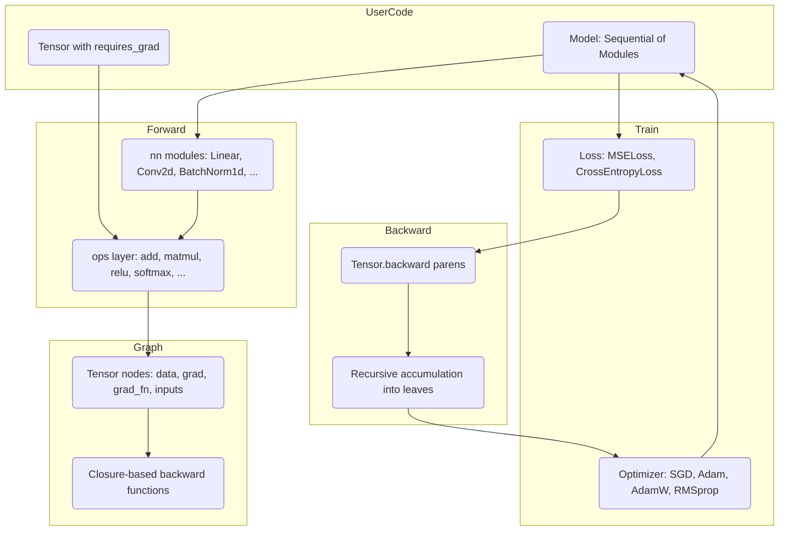

# Differentiable Programming

## Overview

This project is a small, self-contained automatic differentiation framework written in
pure Python on top of NumPy. It reproduces the core programming model of frameworks like
PyTorch and JAX — a tensor that tracks gradients, operations that build a dynamic
computation graph, and a `backward()` call that runs reverse-mode autodiff — without any
external machine-learning dependency.

The goal is to make the mechanics of differentiable programming legible. Every gradient in
the system is hand-derived and lives next to the forward computation it differentiates, so
the chain rule is visible rather than hidden inside a compiled kernel. The framework is
organized into four layers that mirror a real deep-learning stack:

- **`core`** — the `Tensor` type, the autograd graph, and the functional `grad` /
  `value_and_grad` transforms.
- **`ops`** — a library of differentiable operations (arithmetic, linear algebra, math
  functions, activations, reductions, shape manipulation), each pairing a forward pass with
  a closure that computes the corresponding vector-Jacobian product.
- **`nn`** — neural-network modules (`Linear`, `Conv2d`, normalization, `Dropout`,
  activations, `Sequential`) and loss functions (`MSELoss`, `CrossEntropyLoss`).
- **`optim`** — first-order optimizers (`SGD`, `Adam`, `AdamW`, `RMSprop`) that consume the
  gradients autodiff produces.

The concepts this teaches are: how a dynamic (define-by-run) computation graph is recorded,
how reverse-mode accumulation distributes a scalar loss's gradient back to every leaf
parameter, how broadcasting interacts with differentiation, why numerical gradient checking
is the standard correctness test for an autodiff system, and how optimizers turn gradients
into parameter updates.

Scope is deliberately narrow. The framework targets dense (fully connected) networks and
the operations needed to train them. It uses Python recursion for graph traversal, keeps
everything in float32 NumPy arrays, and runs single-threaded. It is not a production engine:
there is no operator fusion, no GPU backend, no gradient checkpointing, and convolution is
forward-only. Those boundaries are stated explicitly in the relevant sections.

## Architecture



The system is **define-by-run**: there is no separate graph-construction phase. Calling an
operation immediately computes the forward result and, if any input requires gradients,
attaches a backward closure and the list of input tensors to the output tensor. The "graph"
is therefore just the network of `Tensor` objects linked through their `_grad_fn` and
`_inputs` fields. When `backward()` is called on a scalar loss, it recursively visits this
linked structure in reverse, calling each node's backward closure and threading the upstream
gradient through.

### Layering

1. **Operations build the graph.** Functions in `ops/operations.py` and the operator
   overloads on `Tensor` are the only things that create non-leaf tensors. Each constructs
   the forward data with NumPy, decides `requires_grad` from its operands, and — only when
   gradients are needed — registers a `grad_fn` closure that captures whatever it needs for
   the backward pass.

2. **Modules compose operations.** Each `Module` in `nn/modules.py` holds parameter tensors
   (created with `requires_grad=True`) and implements `forward` in terms of the ops layer
   or direct NumPy with a custom backward closure. `Sequential` chains modules; `Module`
   collects parameters recursively for the optimizer.

3. **The optimizer closes the loop.** After `loss.backward()` populates `param.grad` for
   every parameter, the optimizer reads those gradients and mutates `param.data` in place.
   `zero_grad()` clears gradients between steps so they do not accumulate across iterations.

## Core Components

### Tensor

`Tensor` (in `core/tensor.py`) is the central type. It wraps a NumPy array and carries the
state needed for autodiff:

```python
class Tensor:
    def __init__(self, data, requires_grad=False, dtype=np.float32):
        if isinstance(data, np.ndarray):
            self.data = data.astype(dtype)
        elif isinstance(data, (list, tuple)):
            self.data = np.array(data, dtype=dtype)
        else:
            self.data = np.array([data], dtype=dtype)

        self.requires_grad = requires_grad and _grad_enabled
        self.grad: Optional[np.ndarray] = None

        # Computational graph links
        self._grad_fn: Optional[Callable] = None
        self._inputs: List['Tensor'] = []
        self._is_leaf = True
```

Key fields:

- **`data`** — the underlying float32 NumPy array.
- **`requires_grad`** — whether this tensor participates in autodiff. It is ANDed with the
  global `_grad_enabled` flag at construction time, which is how `no_grad()` works.
- **`grad`** — accumulated gradient, initialized lazily to `None` and filled during
  `backward()`.
- **`_grad_fn`** — for non-leaf tensors, a closure that maps an upstream gradient to the
  gradients of this tensor's inputs.
- **`_inputs`** — the operand tensors that produced this one, used to recurse.
- **`_is_leaf`** — `True` for user-created tensors; set to `False` once a `grad_fn` is
  attached.

A leaf tensor created directly by the user has `_grad_fn is None`. An output of an operation
has a `grad_fn` and a non-empty `_inputs` list, established through `_set_grad_fn`:

```python
def _set_grad_fn(self, grad_fn, inputs):
    self._grad_fn = grad_fn
    self._inputs = inputs
    self._is_leaf = False
```

`Tensor` also exposes shape metadata (`shape`, `ndim`, `dtype`, `size`), conversions
(`numpy()`, `item()`, `detach()`), and static factory methods (`zeros`, `ones`, `randn`,
`rand`, `eye`, `arange`). `detach()` returns a gradient-free copy so values can be read out
of the graph without polluting it.

### The backward pass

The heart of the system is `Tensor.backward`:

```python
def backward(self, grad=None):
    if not self.requires_grad:
        return

    if grad is None:
        grad = np.ones_like(self.data)

    # Accumulate gradient on this tensor
    if self.grad is None:
        self.grad = grad.copy()
    else:
        self.grad += grad

    # Propagate to inputs
    if self._grad_fn is not None:
        input_grads = self._grad_fn(grad)
        if not isinstance(input_grads, (list, tuple)):
            input_grads = [input_grads]

        for inp, g in zip(self._inputs, input_grads):
            if inp.requires_grad and g is not None:
                inp.backward(g)
```

This is reverse-mode automatic differentiation implemented as a depth-first recursion:

1. If the tensor does not require gradients, stop.
2. If no upstream gradient is supplied (the usual case for a scalar loss), seed it with
   ones — `d(loss)/d(loss) = 1`.
3. Accumulate the incoming gradient into `self.grad`. Accumulation (rather than assignment)
   is what makes gradients correct when a tensor is used in more than one place.
4. If this tensor has a `grad_fn`, call it with the upstream gradient to get the gradient
   with respect to each input, then recurse into each input that requires gradients.

Because traversal is plain Python recursion over `_inputs`, the graph is walked once per
edge from the root. Every operation's backward closure implements the local vector-Jacobian
product; chaining them through the recursion realizes the chain rule. The design is simple
and direct; its cost is that very deep graphs can exceed Python's recursion limit, and a
node reachable by many paths is visited multiple times.

### Gradient context managers

Graph construction is gated by a module-level flag, toggled by two context managers:

```python
_grad_enabled = True

@contextmanager
def no_grad():
    global _grad_enabled
    prev = _grad_enabled
    _grad_enabled = False
    try:
        yield
    finally:
        _grad_enabled = prev
```

`enable_grad()` is the symmetric counterpart. Because `Tensor.__init__` computes
`requires_grad and _grad_enabled`, any tensor constructed inside a `no_grad()` block is a
non-tracking leaf, and operations on it do not register backward closures. This is the same
mechanism used for inference in mature frameworks: it avoids building a graph that will
never be differentiated. The two managers nest correctly because each saves and restores the
previous flag value.

### Functional transforms: grad and value_and_grad

In addition to the imperative `backward()` API, the framework offers JAX-style functional
differentiation:

```python
def grad(func, argnums=0):
    if isinstance(argnums, int):
        argnums = (argnums,)

    def grad_func(*args, **kwargs):
        new_args = list(args)
        for i in argnums:
            if isinstance(args[i], Tensor):
                new_args[i] = Tensor(args[i].data, requires_grad=True)
            else:
                new_args[i] = Tensor(args[i], requires_grad=True)

        result = func(*new_args, **kwargs)
        if isinstance(result, Tensor):
            result.backward()

        grads = [new_args[i].grad for i in argnums]
        return grads[0] if len(grads) == 1 else tuple(grads)

    return grad_func
```

`grad(func)` wraps a scalar-valued function: it rebuilds the selected arguments as
gradient-tracking tensors, runs the function, calls `backward()` on the result, and returns
the gradients. `value_and_grad(func)` additionally returns the forward value. `argnums`
selects which positional arguments to differentiate with respect to. This transform computes
first-order gradients; it does not build a graph over the gradient itself, so higher-order
derivatives are out of scope.

### Operations

`ops/operations.py` defines the differentiable primitives. They follow one consistent
pattern: compute the forward value, decide whether the result requires gradients, and — only
in that case — define a backward closure and attach it. `mul` is representative:

```python
def mul(a, b):
    a = _ensure_tensor(a)
    b = _ensure_tensor(b)

    result = Tensor(a.data * b.data,
                    requires_grad=a.requires_grad or b.requires_grad)

    if result.requires_grad:
        def grad_fn(g):
            ga = g * b.data
            gb = g * a.data
            while ga.ndim > a.ndim:
                ga = ga.sum(axis=0)
            while gb.ndim > b.ndim:
                gb = gb.sum(axis=0)
            return ga, gb
        result._set_grad_fn(grad_fn, [a, b])

    return result
```

The closure captures `a` and `b` so it can compute `d(a*b)/da = b` and `d(a*b)/db = a` at
backward time. The trailing `while` loops implement **broadcast reduction**: when NumPy
broadcasts operands of different ranks, the upstream gradient has the broadcasted (larger)
shape and must be summed back down to each operand's original shape. `add`, `sub`, and `div`
follow the same structure with their respective derivatives.

#### Broadcasting and gradient reduction

Broadcasting is one of the subtler parts of a correct autodiff system, because the forward
pass silently expands a smaller operand and the backward pass must undo that expansion. The
rule is: a dimension that was broadcast in the forward pass corresponds to a *sum* in the
backward pass, because the same input value contributed to many outputs and its gradient is
the total of all those contributions. `add` handles both rank mismatch and size-1 dimensions:

```python
def grad_fn(g):
    ga = g
    gb = g
    while ga.ndim > a.ndim:        # extra leading axes -> sum them away
        ga = ga.sum(axis=0)
    while gb.ndim > b.ndim:
        gb = gb.sum(axis=0)
    for i, (sa, sb) in enumerate(zip(a.shape, b.shape)):
        if sa == 1 and sb != 1:    # a was stretched along axis i
            ga = ga.sum(axis=i, keepdims=True)
        if sb == 1 and sa != 1:
            gb = gb.sum(axis=i, keepdims=True)
    return ga, gb
```

The first stage collapses any extra leading axes that broadcasting added; the second stage
re-collapses axes where one operand had size 1 (so it was stretched), preserving the
dimension with `keepdims=True` so the result matches the operand's original shape exactly.
This is exactly the behavior the test `test_add_broadcasting` checks: adding a `(2, 2)`
matrix and a length-2 vector yields a gradient of `[2, 2]` for the vector, because each of
its two elements participated in two output rows.

#### Matrix multiplication gradients

`matmul` is the workhorse of the framework and the only op with rank-dependent backward
logic. The mathematical identities are `d(A @ B)/dA = G @ B^T` and `d(A @ B)/dB = A^T @ G`,
but the exact form depends on operand ranks:

```python
def grad_fn(g):
    if a.ndim == 1 and b.ndim == 1:        # dot product
        ga = g * b.data
        gb = g * a.data
    elif a.ndim == 1:                       # vector @ matrix
        ga = g @ b.data.T
        gb = np.outer(a.data, g)
    elif b.ndim == 1:                       # matrix @ vector
        ga = np.outer(g, b.data)
        gb = a.data.T @ g
    else:                                   # matrix / batched matrix
        ga = g @ np.swapaxes(b.data, -2, -1)
        gb = np.swapaxes(a.data, -2, -1) @ g
    return ga, gb
```

The general 2D and batched case uses `np.swapaxes(..., -2, -1)` rather than `.T` so it works
for higher-rank batched tensors, where transposing only the last two axes is correct. The
vector cases reduce to outer products. `test_matmul_gradient` verifies all of this against
finite differences for a `(3, 4) @ (4, 5)` product.

Operation families:

- **Arithmetic** — `add`, `sub`, `mul`, `div`, `neg`, all broadcasting-aware.
- **Linear algebra** — `matmul`, with separate gradient formulas for vector-vector,
  matrix-vector, vector-matrix, and batched cases.
- **Math functions** — `exp`, `log`, `sqrt`, `sin`, `cos`, `tanh`. Several capture the
  forward output (e.g. `exp`, `tanh`, `sqrt`) so the backward pass reuses it rather than
  recomputing.
- **Activations** — `relu` (mask by `a.data > 0`), `sigmoid` (`s * (1 - s)`), `tanh`,
  and `softmax`. `softmax` subtracts the row max for numerical stability and implements the
  Jacobian-vector product `s * (g - sum(g*s))` directly:

```python
def softmax(a, axis=-1):
    shifted = a.data - np.max(a.data, axis=axis, keepdims=True)
    exp_data = np.exp(shifted)
    result_data = exp_data / np.sum(exp_data, axis=axis, keepdims=True)
    result = Tensor(result_data, requires_grad=a.requires_grad)
    if a.requires_grad:
        def grad_fn(g):
            s = result_data
            return s * (g - np.sum(g * s, axis=axis, keepdims=True))
        result._set_grad_fn(grad_fn, [a])
    return result
```

- **Reductions** — `sum`, `mean`, `max`. `sum`'s backward broadcasts the upstream gradient
  back to the input shape; `mean` additionally divides by the number of reduced elements;
  `max` routes the gradient only to the maximizing elements (splitting it on ties).
- **Shape** — `reshape`, `transpose` (which inverts the permutation in backward), and
  `concat` (which slices the upstream gradient back to each input along the concat axis).

Operator overloads on `Tensor` (`__add__`, `__mul__`, `__matmul__`, `__pow__`,
`__getitem__`, etc.) delegate to these functions, so Python syntax such as `a @ b + c` and
slicing `a[0, :]` produce differentiable graphs. `__pow__` and `__getitem__` define their
backward closures inline on the `Tensor` class itself.

### Neural-network modules

`nn/modules.py` builds layers on top of the ops layer. `Module` is the abstract base:

```python
class Module(ABC):
    def __init__(self):
        self._parameters: List[Tensor] = []
        self._modules: List['Module'] = []
        self._training = True

    def __call__(self, *args, **kwargs):
        return self.forward(*args, **kwargs)

    def parameters(self):
        for p in self._parameters:
            yield p
        for m in self._modules:
            yield from m.parameters()
```

A module registers its own parameter tensors and any submodules, and `parameters()` walks
that tree recursively — exactly what the optimizer needs. `train(mode)` / `eval()` propagate
a training flag (used by `Dropout` and `BatchNorm1d`), and `zero_grad()` clears gradients on
all parameters.

- **`Linear`** computes `x @ weight (+ bias)` via the ops layer, so its gradients come
  entirely from `matmul` and `add`. Weights use Xavier initialization
  (`std = sqrt(2 / (in + out))`); bias starts at zero.
- **`Conv2d`** implements a real im2col forward pass for `(N, C, H, W)` inputs with
  configurable stride and padding. The input is optionally zero-padded, then unfolded into a
  column matrix where each row is one receptive field flattened across `(C, K, K)`; a single
  matrix multiply with the reshaped weight produces all output positions at once, and the
  result is reshaped back to `(N, out_channels, H_out, W_out)`. Output spatial size follows
  `(H + 2*padding - K) / stride + 1`. Its backward closure currently returns a zero gradient,
  so the layer is usable for forward inference but not trainable.
- **`BatchNorm1d`** normalizes across the batch using batch statistics during training and
  running statistics during evaluation. Running mean and variance are updated with momentum
  during training so they can stand in for batch statistics at inference time. It implements
  the full batch-norm backward formula and writes the `gamma`/`beta` gradients directly into
  the parameter tensors inside its closure:

```python
def grad_fn(g):
    N = x.data.shape[0]
    std = np.sqrt(var + self.eps)
    x_hat = (x.data - mean) / std
    dgamma = (g * x_hat).sum(axis=0)
    dbeta = g.sum(axis=0)
    dx_hat = g * self.gamma.data
    dx = (1 / (N * std)) * (N * dx_hat - dx_hat.sum(axis=0)
                            - x_hat * (dx_hat * x_hat).sum(axis=0))
    self.gamma.grad = dgamma if self.gamma.grad is None else self.gamma.grad + dgamma
    self.beta.grad = dbeta if self.beta.grad is None else self.beta.grad + dbeta
    return dx
```

  This is a layer that manages part of its own backward bookkeeping: because the affine
  parameters are not produced by a tracked op, the closure accumulates their gradients by
  hand (respecting the same `None`-or-accumulate convention the autograd engine uses) and
  returns only the gradient with respect to its input, which the engine then propagates.
- **`LayerNorm`** normalizes across the feature axis with a simplified backward.
- **`Dropout`** applies an inverted dropout mask during training and is a no-op in eval
  mode; its backward simply reapplies the mask.
- **Activation modules** (`ReLU`, `Sigmoid`, `Tanh`, `Softmax`) wrap the corresponding ops.
- **`Sequential`** registers a list of modules and chains their `forward` calls.

### Loss functions

Two losses live in the same module:

- **`MSELoss`** computes `mean((pred - target)^2)` and a backward of `2 * (pred - target) / n`.
- **`CrossEntropyLoss`** fuses a numerically stabilized softmax with the negative
  log-likelihood. It accepts either integer class indices or one-hot targets and uses the
  well-known simplified gradient `(softmax(pred) - onehot(target)) / n`, which avoids
  differentiating through the log and softmax separately:

```python
def grad_fn(g):
    grad = probs.copy()
    if target.ndim == 1:
        grad[np.arange(n), target.data.astype(int)] -= 1
    else:
        grad -= target.data
    return (grad / n) * g
```

### Optimizers

`nn/optim.py` defines an `Optimizer` base that stores the parameter list and learning rate
and provides `zero_grad()`. Concrete optimizers override `step()` to mutate `param.data` in
place from `param.grad`:

- **`SGD`** — optional momentum (velocity buffer per parameter) and L2 weight decay.
- **`Adam`** — first and second moment estimates with bias correction.
- **`AdamW`** — Adam with decoupled weight decay applied directly to the parameters.
- **`RMSprop`** — running average of squared gradients.

`Adam`'s update is the canonical formulation:

```python
def step(self):
    self._t += 1
    for i, p in enumerate(self.parameters):
        if p.grad is None:
            continue
        grad = p.grad
        if self.weight_decay > 0:
            grad = grad + self.weight_decay * p.data
        self._m[i] = self.beta1 * self._m[i] + (1 - self.beta1) * grad
        self._v[i] = self.beta2 * self._v[i] + (1 - self.beta2) * (grad ** 2)
        m_hat = self._m[i] / (1 - self.beta1 ** self._t)
        v_hat = self._v[i] / (1 - self.beta2 ** self._t)
        p.data -= self.lr * m_hat / (np.sqrt(v_hat) + self.eps)
```

Each optimizer skips parameters whose `grad` is `None`, so partially-used models update only
the parameters that received gradients.

### Worked example: one gradient through the graph

Consider `y = x ** 2 + 3 * x + 1` with `x = Tensor([2.0], requires_grad=True)`. Evaluating
the expression builds a small graph: `__pow__` produces `x2 = x**2` (with a closure for
`2*x`), `__rmul__`/`mul` produces `3x` (closure `3`), the two `add` nodes combine them with
the constant. Each intermediate tensor records its `grad_fn` and `_inputs`.

Calling `y.backward()` seeds the root with `1.0` and recurses:

1. The outer `add` distributes `1.0` to both of its inputs unchanged (its derivative is the
   identity for each operand).
2. The `x**2` node receives `1.0`, multiplies by its captured derivative `2*x = 4.0`, and
   recurses into `x`, accumulating `4.0` into `x.grad`.
3. The `3*x` node receives `1.0`, multiplies by `3`, and recurses into `x`, accumulating
   `3.0` — so `x.grad` becomes `4.0 + 3.0 = 7.0`.

The result `x.grad == [7.0]` matches the analytic derivative `2x + 3 = 7`. The crucial detail
is step 3: `x` is reached along two distinct paths, and because `backward()` *accumulates*
into `self.grad` rather than overwriting it, both contributions are summed correctly. This is
why gradient accumulation, not assignment, is the right default, and it is checked directly by
`test_multiple_paths`.

## Data Structures

The framework has one primary data structure — the `Tensor` graph node — plus the per-module
parameter lists and per-optimizer state buffers.

### Tensor node

```python
class Tensor:
    data: np.ndarray                  # float32 values
    requires_grad: bool               # participates in autodiff
    grad: Optional[np.ndarray]        # accumulated gradient
    _grad_fn: Optional[Callable]      # upstream-grad -> input-grads
    _inputs: List['Tensor']           # operands that produced this tensor
    _is_leaf: bool                    # user-created vs operation output
```

The graph is implicit: there is no separate `Node` or `Edge` type. Edges are the references
held in `_inputs`, and each node's `_grad_fn` is the local derivative along its incoming
edges. A complete forward computation produces a directed acyclic graph whose sinks are
losses and whose sources are the leaf parameters and inputs.

### Module parameter tree

```python
class Module:
    _parameters: List[Tensor]   # this module's own parameters
    _modules: List[Module]      # registered submodules
    _training: bool             # toggles Dropout / BatchNorm behavior
```

`parameters()` performs a pre-order traversal of this tree, yielding a flat iterator that the
optimizer materializes into a list.

### Optimizer state

Each optimizer keeps NumPy buffers shaped like the parameters it owns:

```python
# SGD
_velocity: List[np.ndarray]            # momentum buffers

# Adam / AdamW
_m: List[np.ndarray]                   # first moment
_v: List[np.ndarray]                   # second moment
_t: int                                # timestep for bias correction

# RMSprop
_v: List[np.ndarray]                   # running mean of squared grads
```

These are allocated once at construction (`np.zeros_like(p.data)`) and updated in place each
step, so optimizer memory is proportional to the model size and constant across iterations.

## API Design

The public surface is re-exported from the top-level `autograd` package:

```python
# Core
Tensor                          # gradient-tracking tensor
no_grad(), enable_grad()        # gradient-context managers
grad(func, argnums=0)           # functional gradient transform
value_and_grad(func, argnums=0) # value plus gradient

# Operations (also available as Tensor operators / methods)
add, sub, mul, div, neg, matmul
exp, log, sqrt, sin, cos, tanh, sigmoid, relu, softmax
sum, mean, max
reshape, transpose, concat

# Neural-network modules
Module
Linear, Conv2d, BatchNorm1d, LayerNorm, Dropout
ReLU, Sigmoid, Tanh, Softmax
Sequential
MSELoss, CrossEntropyLoss

# Optimizers
SGD, Adam            # exported via autograd.nn
# AdamW, RMSprop available from autograd.nn.optim
```

### Tensor interface

```python
Tensor(data, requires_grad=False, dtype=np.float32)

# Properties
t.shape, t.ndim, t.dtype, t.size

# Autograd
t.backward(grad=None)     # run reverse-mode autodiff from this tensor
t.zero_grad()             # clear t.grad
t.detach()                # gradient-free copy
t.requires_grad, t.grad

# Conversions
t.numpy(), t.item()

# Factories (static)
Tensor.zeros(shape), Tensor.ones(shape), Tensor.randn(shape)
Tensor.rand(shape), Tensor.eye(n), Tensor.arange(start, stop, step)

# Differentiable methods
t.sum(axis, keepdims), t.mean(...), t.max(...)
t.reshape(shape), t.transpose(axes), t.T, t.flatten()
t.squeeze(axis), t.unsqueeze(axis)

# Operators: + - * / unary- ** @ and indexing t[idx]
```

### Module and optimizer interface

```python
class Module:
    def forward(self, x) -> Tensor      # implemented by subclasses
    def __call__(self, *a, **k)         # alias for forward
    def parameters(self) -> Iterator[Tensor]
    def train(mode=True); def eval()
    def zero_grad()

class Optimizer:
    def __init__(self, parameters, lr)
    def zero_grad()
    def step()                          # implemented by subclasses
```

### Typical training loop

```python
optimizer.zero_grad()
pred = model(x)
loss = loss_fn(pred, target)
loss.backward()
optimizer.step()
```

This four-line idiom is the contract the whole API is built around: modules produce a graph,
the loss is its scalar sink, `backward()` fills every parameter's `grad`, and the optimizer
consumes those gradients.

## Performance

The framework is built for clarity over speed, but several deliberate choices keep it
practical:

- **NumPy-vectorized kernels.** Every forward and backward operation is expressed as NumPy
  array operations, so the per-element work runs in compiled C, not Python loops. The only
  significant Python-level loop in a hot path is the im2col construction in `Conv2d`.
- **Lazy gradient allocation.** A tensor's `grad` stays `None` until a gradient actually
  reaches it, and optimizers skip parameters with `None` gradients, so no work or memory is
  spent on unused branches.
- **Output reuse in backward.** Operations like `exp`, `tanh`, `sqrt`, and `sigmoid` capture
  their forward result and reuse it during backward instead of recomputing, halving the
  transcendental work for those ops.
- **In-place optimizer state.** Optimizer buffers are allocated once and updated in place;
  memory is `O(parameters)` and constant across steps.

Costs and limits are equally explicit. Graph traversal is recursive Python, so memory and
call-stack depth grow with graph depth, and a node reachable along several paths is revisited
once per path rather than processed once in topological order. Everything runs in float32 on
CPU, single-threaded. There is no operator fusion, no GPU backend, and no gradient
checkpointing. No throughput or latency benchmarks are claimed; the project ships no
benchmark suite, so any specific numbers would be invented.

### Design rationale and trade-offs

The recursive backward pass is the most consequential design choice. A production engine
builds an explicit topological order and processes each node exactly once, which both bounds
stack depth and avoids redundant work on diamond-shaped graphs. This framework instead
recurses directly over `_inputs`, which keeps the engine to a few lines and makes the chain
rule transparent — the recursion *is* the chain rule — at the cost of revisiting shared nodes
and risking a `RecursionError` on very deep graphs. For the dense networks and test workloads
this project targets, neither cost bites in practice, and the clarity is worth it.

Two further choices follow the same "clarity over generality" principle. Closures capture
exactly the values each backward pass needs (an operand, a forward output, a mask) rather
than a generic tape of saved tensors, so each gradient reads like its textbook formula.
And modules whose parameters are not produced by a tracked op — `BatchNorm1d`, `LayerNorm` —
write those parameters' gradients by hand inside their closures, which keeps the layer
self-contained at the price of duplicating the engine's accumulate-or-initialize convention.
The `Conv2d` backward stub is the one place this honesty cuts against the user: the forward
pass is genuine im2col, but because the backward returns zeros, the layer must be treated as
inference-only until a real gradient is implemented.

## Testing Strategy

Correctness is verified by a 138-test pytest suite spanning three files, with numerical
gradient checking as the backbone for the autodiff layer.

### Numerical gradient checking

The cornerstone technique compares each analytic gradient against a central-difference
finite-difference estimate. `tests/test_operations.py` defines a helper that perturbs each
input element by `±eps` (in float64 for precision), measures the change in the summed output,
and forms the estimate `(f(x+eps) - f(x-eps)) / (2*eps)`:

```python
def numerical_gradient_for_scalar_func(f, x_data, eps=1e-5):
    x_flat = x_data.astype(np.float64).flatten().copy()
    grad_flat = np.zeros_like(x_flat)
    for i in range(len(x_flat)):
        orig = x_flat[i]
        x_flat[i] = orig + eps
        f_plus = float(f(Tensor(x_flat.reshape(x_data.shape).astype(np.float32)))
                       .data.astype(np.float64).sum())
        x_flat[i] = orig - eps
        f_minus = float(f(Tensor(x_flat.reshape(x_data.shape).astype(np.float32)))
                        .data.astype(np.float64).sum())
        x_flat[i] = orig
        grad_flat[i] = (f_plus - f_minus) / (2 * eps)
    return grad_flat.reshape(x_data.shape).astype(x_data.dtype)
```

Analytic and numerical gradients are then compared with `np.testing.assert_allclose` at a
tolerance (`rtol=0.05, atol=0.01`) appropriate for float32 finite differences. This check is
applied to `mul`, `div`, `matmul`, `exp`, `log`, `sqrt`, `sin`, `cos`, `tanh`, `sigmoid`,
`relu`, `softmax`, `mean`, and `transpose`.

### Operation tests

`tests/test_operations.py` (70 tests) covers each operation in two ways: a forward-value
check against a hand-computed expected array, and a gradient check (analytic, numerical, or
both). It also tests broadcasting gradients, axis-wise reductions, the `max` gradient routing
to the argmax, tensor slicing and `squeeze`/`unsqueeze`/`flatten` gradients, the `no_grad` /
`enable_grad` context managers (including nesting), and the factory methods.

### Module tests

`tests/test_modules.py` (42 tests) exercises every layer and loss: `Linear`, `Conv2d`,
`BatchNorm1d`, `LayerNorm`, `Dropout`, the activation modules, `Sequential`, `MSELoss`,
`CrossEntropyLoss`, the `Module` base (parameter collection, train/eval, zero_grad), and a
small multi-layer "deep network" that checks end-to-end forward and backward through stacked
layers.

### Optimizer tests

`tests/test_optimizers.py` (26 tests) covers `SGD`, `Adam`, `AdamW`, and `RMSprop`
individually, optimizer behavior when driving an actual model, comparisons across optimizers,
and edge cases such as very small learning rates, large gradients, and empty parameter lists.

### Edge cases and invariants

Beyond the happy-path gradient checks, the suite pins down several invariants that are easy
to get wrong in an autodiff engine:

- **Gradient accumulation across paths.** `test_multiple_paths` confirms that a tensor used
  in several places sums its incoming gradients rather than keeping only the last one.
- **Broadcast correctness.** `test_add_broadcasting` and the numerical checks confirm that
  gradients are reduced back to each operand's original shape.
- **Sparse routing.** `test_max_gradient` and `test_tensor_slicing` confirm that `max` and
  indexing route gradients only to the elements that actually contributed, leaving the rest
  at zero.
- **Context-manager semantics.** `test_no_grad_disables_gradient` and `test_no_grad_nested`
  confirm that `no_grad()` suppresses tracking and that `enable_grad()` re-enables it even
  when nested inside `no_grad()`.
- **Optimizer robustness.** The optimizer edge-case tests confirm graceful behavior with
  empty parameter lists, tiny learning rates, and large gradients.

These tests double as executable documentation: each one states, in code, exactly what an
operation's gradient or a module's behavior is expected to be.

### Running

```bash
pytest tests/ -v          # full suite, 138 tests
pytest tests/test_operations.py -v
```

No external services or fixtures beyond NumPy are required; the suite is fully deterministic
where it seeds NumPy's RNG.

## References

- Baydin, Pearlmutter, Radul, Siskind — *Automatic Differentiation in Machine Learning: a
  Survey* (2018).
- PyTorch Autograd — the define-by-run reverse-mode model this framework mirrors.
- JAX — source of the `grad` / `value_and_grad` functional-transform API.
- Karpathy — *micrograd*, a minimal scalar autograd engine that inspires this approach.
- Goodfellow, Bengio, Courville — *Deep Learning* (2016), chapter 6 for backpropagation and
  chapter 8 for the optimizers implemented here.
