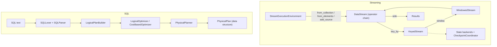

# Distributed Streaming Analytics

A Flink-inspired stream processing framework written from scratch in Python, paired with a
self-contained SQL query compiler and cost-based optimizer. The streaming side offers a fluent
`DataStream` API with windowing, keyed state, and checkpointing; the SQL side is a hand-written
lexer, parser, logical/physical planner, and dynamic-programming join optimizer. Both run in a
single process — the focus is the design and correctness of the building blocks, not cluster
execution.

## Features

- **DataStream API** — immutable, fluent transformations (`map`, `filter`, `flat_map`, `key_by`,
  `union`, `sink`) executed by an asyncio loop (`DataStream`, `StreamExecutionEnvironment`).
- **Keyed streams** — `reduce`, `sum`, `count`, `process`, and `window(...)` with per-key state
  (`KeyedStream`).
- **Windowing** — tumbling, sliding, session, and global window assigners with event-time,
  processing-time, and count triggers (`TumblingWindowAssigner`, `SlidingWindowAssigner`,
  `SessionWindowAssigner`, `windowing/windows.py`).
- **Keyed state** — `ValueState`, `ListState`, `MapState`, `ReducingState`, `AggregatingState`
  with key-context switching (`state/backend.py`).
- **State backends** — in-process `MemoryStateBackend` and a file-backed `RocksDBStateBackend`
  (pickle-per-descriptor; see What's Real vs Simulated).
- **Checkpointing** — `Checkpoint` dataclass, `FileCheckpointStorage`, and a
  `CheckpointCoordinator` that snapshots backends and prunes history.
- **SQL parser** — hand-written `SQLLexer` plus recursive-descent `SQLParser` covering
  SELECT/FROM/JOIN/WHERE/GROUP BY/HAVING/ORDER BY/LIMIT/UNION, plus IN, BETWEEN, LIKE, IS NULL,
  CASE, CAST, EXISTS, and scalar subqueries (`sql/parser.py`, `sql/ast.py`).
- **Logical optimizer** — predicate pushdown, projection pruning, heuristic join reordering,
  constant folding, and common-subexpression detection (`sql/optimizer.py`).
- **Physical planner** — hash / broadcast / merge join selection, two-phase aggregation, and
  exchange (shuffle) insertion (`sql/planner.py`).
- **Cost-based optimization** — CPU/IO/network/memory cost model, statistics-driven selectivity
  estimation, and classical DP join enumeration (`sql/cost_model.py`).

## Architecture



| Component | Module | Responsibility |
|-----------|--------|----------------|
| Execution environment | `core/stream.py` | Build sources, run the asyncio execution loop |
| DataStream / KeyedStream | `core/stream.py` | Fluent transformations, per-key reduce/aggregate |
| Operators | `operators/operators.py` | Standalone `Operator` hierarchy (Map/Filter/FlatMap/...) |
| Windowing | `windowing/windows.py` | Window assigners, triggers, window functions |
| State | `state/backend.py` | Keyed state types, state backends, checkpoint subsystem |
| SQL frontend | `sql/parser.py`, `sql/ast.py` | Tokenize and parse SQL into an AST |
| Logical plan | `sql/logical.py` | AST to logical tree; logical plan nodes |
| Optimizer | `sql/optimizer.py` | Rule-based logical optimization |
| Physical planner | `sql/planner.py` | Strategy selection, exchange insertion |
| Cost model | `sql/cost_model.py` | Statistics, cost estimation, DP join enumeration |

## Quick Start

### Prerequisites

- Python 3.9+
- `numpy` (declared dependency); no external services are needed to run the tests.

### Installation

```bash
pip install -e ".[dev]"
```

### Running

This is a library; there is no server or CLI. Import the package and build a pipeline (see
Usage), or run the test suite to exercise every subsystem.

## Usage

Streaming: a keyed, windowed aggregation executed in-process.

```python
from streamanalytics import StreamExecutionEnvironment
from streamanalytics.windowing import TumblingWindowAssigner

env = StreamExecutionEnvironment.get_execution_environment()
results = (
    env.from_collection([{"user": "a", "amt": 1}, {"user": "b", "amt": 2}])
       .key_by(lambda e: e["user"])
       .window(TumblingWindowAssigner(size_ms=60_000))
       .reduce(lambda x, y: {"user": x["user"], "amt": x["amt"] + y["amt"]})
       .execute_sync()
)
```

SQL: parse, optimize, and plan a query (the plan is emitted, not executed).

```python
from streamanalytics.sql import (
    SQLParser, LogicalPlanBuilder, CostBasedOptimizer,
    PhysicalPlanner, TableStatistics,
)

stmt = SQLParser("SELECT u, COUNT(*) FROM orders WHERE total > 0 GROUP BY u").parse()
logical = LogicalPlanBuilder().build(stmt)

cbo = CostBasedOptimizer()
cbo.register_table_stats("orders", TableStatistics(row_count=1_000_000))
optimized = cbo.optimize(logical)

physical = PhysicalPlanner().plan(optimized)
print(physical.to_string())
```

## What's Real vs Simulated

- **Real:** The DataStream API and asyncio execution loop; keyed reduce/aggregate/count; all four
  window assigners and three triggers; the full keyed-state hierarchy and both state backends;
  checkpoint serialization, file storage, and the coordinator's snapshot/restore and retention
  pruning; the complete SQL lexer, recursive-descent parser, AST round-trip, logical plan builder,
  every rule-based optimization pass, the physical planner's strategy selection and exchange
  insertion, the cost model, and DP join enumeration. All of this is exercised by the test suite.
- **Simulated / not built:** There is no distributed runtime — streams run single-threaded;
  `set_parallelism(...)` is recorded but ignored. There is no physical-plan executor: physical
  nodes are data structures the planner emits and tests inspect, never run against rows. Watermarks
  are non-functional (`Event.watermark` exists but is never advanced; windows fire on-element).
  `RocksDBStateBackend` is pickle-to-files, not RocksDB. `CommonSubexpressionElimination` detects
  but does not eliminate. `AsyncMapOperator` runs synchronously. Sources are in-process iterators —
  there are no Kafka/file/socket connectors — and the SQL and streaming subsystems are independent.

## Testing

```bash
pytest tests/ -v
```

302 tests across six modules cover DataStream transformations, windowing (assigners, triggers,
window functions), each state type and backend, checkpoint round-trip and coordinator behavior,
the full SQL pipeline (lexer through physical planner), and the cost model and DP join optimizer.
No external services are required.

## Project Structure

```
36-distributed-streaming-analytics/
  README.md                       # this file
  pyproject.toml
  src/streamanalytics/
    __init__.py                   # top-level public API re-exports
    core/stream.py                # Event, DataStream, KeyedStream, environment
    operators/operators.py        # standalone Operator hierarchy
    windowing/windows.py          # windows, assigners, triggers, window functions
    state/backend.py              # keyed state, backends, checkpoint subsystem
    sql/
      parser.py                   # lexer + recursive-descent parser
      ast.py                      # expression and statement AST nodes
      logical.py                  # logical plan nodes + builder
      optimizer.py                # rule-based optimizer
      planner.py                  # physical planner + physical operators
      cost_model.py               # cost model, statistics, DP join optimizer
  tests/                          # 302 tests across six modules
  docs/BLUEPRINT.md               # full architecture and design
```

## License

MIT — see ../LICENSE
