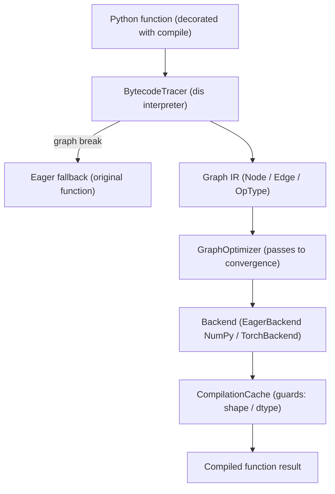

# Dynamic Graph Execution Runtime

A Python-native dynamic graph execution runtime, built from scratch, inspired by PyTorch's TorchDynamo and TorchFX. It captures straight-line Python tensor code by interpreting CPython bytecode, builds a computation graph, runs optimization passes over it, and lowers it to a NumPy or PyTorch backend behind a `torch.compile()`-style decorator with a guarded compilation cache.

## Features

- **Bytecode tracing** — walks a function's CPython bytecode with `dis` and symbolically executes the supported opcode families (loads, stores, stack manipulation, `BINARY_OP`, unary negation, returns) into a graph, recording a *graph break* on anything unsupported (`BytecodeTracer` / `tracer/bytecode_tracer.py`).
- **Computation graph IR** — typed nodes and edges with rich `NodeMetadata`, a 30+-member `OpType` enum (arithmetic, NN ops, shape ops, reductions, boundary markers), Kahn topological sort with memoization, cycle detection, subgraph extraction, and dict (de)serialization (`Graph` / `Node` / `OpType` / `core/graph.py`).
- **Symbolic tensors** — operator overloads (`+ - * / @`, negation, and reflected forms so `2 * x` works) that infer NumPy-style broadcast and matmul output shapes, promote dtypes via `np.promote_types`, and propagate `requires_grad` as a logical OR (`SymbolicTensor` / `core/tensor.py`).
- **Optimization passes** — shape inference, constant folding, algebraic simplification (`x + 0 → x`, `x * 1 → x`, `x * 0 → 0`, `relu(relu(x)) → relu(x)`), dead-code elimination, common-subexpression elimination, operator fusion (`matmul + add → LINEAR`, `conv → bn → relu`), and layout optimization, all run to a fixed point (`GraphOptimizer` / `optimizer/passes.py`).
- **Inference/training modes** — `optimize_for_inference` splices out `DROPOUT` nodes; `optimize_for_training` clamps to a conservative level ≤ 1, mirroring the `model.eval()`/`model.train()` split.
- **Pluggable backends** — a class-level registry with a NumPy eager backend (always available, covering arithmetic, activations, shape ops, reductions, `LINEAR`, a naive `CONV2D`, and `BATCHNORM`) and an optional PyTorch CPU/CUDA backend registered only if `torch` imports (`Backend` / `BackendRegistry` / `EagerBackend` / `TorchBackend` / `codegen/backend.py`).
- **Compilation cache with guards** — caches compiled functions keyed by the code object (`filename:firstlineno:name`), storing a list of shape/dtype-specialized entries per key, with hit-count-with-decay eviction and hit/miss statistics (`CompilationCache` / `ShapeGuard` / `DtypeGuard`).
- **Guarded specialization** — a call with new shapes or dtypes misses its guards and re-traces, so the cache accumulates multiple specializations of the same function, exactly as a guarded JIT does.
- **`torch.compile`-style API** — `DynamicCompiler` and a `compile` decorator with `optimization_level`, cache toggle, backend selection, and automatic fallback to eager Python on any tracing/compilation failure.
- **Context management** — a thread-aware `GlobalContext` singleton plus `no_grad` / `enable_grad` context managers and a `CompilationContext.should_compile` policy (`core/context.py`).
- **Introspection** — `trace()` returns the captured graph and `explain()` reports original vs. optimized node/edge counts and per-pass change counts.

## Architecture



| Component | Module | Responsibility |
|-----------|--------|----------------|
| Graph IR | `core/graph.py` | `Node` / `Edge` / `OpType`, Kahn topological sort with memoization, cycle detection, `subgraph` / `clone`, `validate`, dict round-trip |
| Symbolic tensor | `core/tensor.py` | Shape/dtype inference via operator overloads; broadcast and matmul rules; `TensorFactory` constructors |
| Context | `core/context.py` | `CompilationContext.should_compile` policy, `ExecutionContext` graph stack, thread-aware `GlobalContext`, `no_grad` / `enable_grad` |
| Tracer | `tracer/bytecode_tracer.py` | Bytecode interpretation over `dis.get_instructions`, value stack, INPUT binding, graph capture, `_GraphBreak` recording |
| Frame guard | `tracer/frame_guard.py` | Tracing-time `GuardCondition` scaffolding and `GuardFailure` reporting |
| Optimizer | `optimizer/graph_optimizer.py`, `optimizer/passes.py` | Fixed-point pass pipeline, per-pass telemetry, inference/training entry points |
| Backends | `codegen/backend.py` | `EagerBackend` (NumPy) and optional `TorchBackend`; `BackendRegistry` with default fallback |
| Compiler | `codegen/compiler.py` | `DynamicCompiler` decorator, `CompilationCache`, shape/dtype `Guard`s, `compile` / `trace` / `explain` |

## Quick Start

### Prerequisites

- Python 3.9+
- NumPy. PyTorch is optional and only needed for the Torch/CUDA backend; the tests run without it.

### Installation

There is no packaging file; the package lives under `src/`. Add it to the path:

```bash
cd 37-dynamic-graph-runtime
export PYTHONPATH="$PWD/src:$PYTHONPATH"
```

### Running

The runtime is a library used from Python:

```python
import dynamicgraph
print(dynamicgraph.__version__)
```

## Usage

Compile a function with the decorator (defaults to the NumPy `eager_numpy` backend):

```python
import numpy as np
from dynamicgraph import compile

@compile(optimization_level=2)
def f(x, y):
    return x * y + x

x = np.ones((4, 4), dtype=np.float32)
y = np.full((4, 4), 2.0, dtype=np.float32)
print(f(x, y))   # traced, optimized, executed; falls back to eager on a graph break
```

Trace and inspect a graph without executing it:

```python
from dynamicgraph import trace, explain

g = trace(f, x, y)
print(g)                  # Graph(name=f, nodes=..., edges=...)
print(explain(f, x, y))   # node counts and per-pass change summary
```

Build a graph by hand and run optimization passes:

```python
from dynamicgraph import Graph, Node, OpType, GraphOptimizer

g = Graph(name="manual")
inp = g.add_node(Node(op_type=OpType.INPUT, name="x"))
relu = g.add_node(Node(op_type=OpType.RELU, name="act"))
out = g.add_node(Node(op_type=OpType.OUTPUT, name="y"))
g.add_edge(inp, relu)
g.add_edge(relu, out)

assert g.validate() == []          # validate() returns a list of issues (empty == valid)
optimized, stats = GraphOptimizer(optimization_level=2).optimize(g)
```

Observe guarded specialization and cache statistics. Each new shape re-traces and adds a
separate cache entry keyed under the same code object:

```python
from dynamicgraph import DynamicCompiler
import numpy as np

compiler = DynamicCompiler(optimization_level=2)

@compiler
def g(a, b):
    return a @ b + a

g(np.ones((4, 4), dtype=np.float32), np.ones((4, 4), dtype=np.float32))   # miss: trace + compile
g(np.ones((4, 4), dtype=np.float32), np.ones((4, 4), dtype=np.float32))   # hit: guards pass
g(np.ones((8, 8), dtype=np.float32), np.ones((8, 8), dtype=np.float32))   # miss: shape guards fail

print(compiler.get_stats())   # hits, misses, hit rate, compile time
```

Optimize a hand-built graph for inference, which additionally splices out `DROPOUT` nodes:

```python
from dynamicgraph import GraphOptimizer, Graph, Node, OpType

optimizer = GraphOptimizer(optimization_level=2)
optimized, stats = optimizer.optimize_for_inference(some_graph)
# optimized has no DROPOUT nodes; stats.pass_results reports per-pass changes
```

## What's Real vs Simulated

- **Real:** the graph IR, topological sort and validation, symbolic-tensor shape/dtype inference, every optimization pass, the NumPy eager backend, the compilation cache with shape/dtype guards, and the `compile` / `trace` / `explain` API. The bytecode tracer genuinely interprets CPython bytecode (including the 3.11+ `BINARY_OP` and 3.13/3.14 `LOAD_FAST_BORROW` forms) and records real graph breaks.
- **Simulated / requires credentials:** the tracer covers only straight-line tensor math — any call, branch, loop, or jump triggers a graph break and an eager fallback (no partial-subgraph stitching). The PyTorch/CUDA backend (`TorchBackend`) is registered only if `torch` is importable; without it the runtime is NumPy-only. There is no GPU code generation, and `ExecutionContext.compute_gradients` is a placeholder — no autodiff is implemented.

## Testing

```bash
cd 37-dynamic-graph-runtime
PYTHONPATH="$PWD/src" python -m pytest tests/ -v
```

The `unittest`-based suite covers the graph IR, symbolic tensors, the tracer, each optimizer pass, the backends, and end-to-end integration. No external services are required; the PyTorch paths only run when `torch` happens to be importable.

## Project Structure

```
37-dynamic-graph-runtime/
  README.md                       # This file
  src/dynamicgraph/
    core/        # graph.py, tensor.py, context.py
    tracer/      # bytecode_tracer.py, frame_guard.py
    optimizer/   # graph_optimizer.py, passes.py
    codegen/     # backend.py, compiler.py
  tests/                          # unittest suite per component
  docs/BLUEPRINT.md               # Full architecture and design
```

## License

MIT — see ../LICENSE
