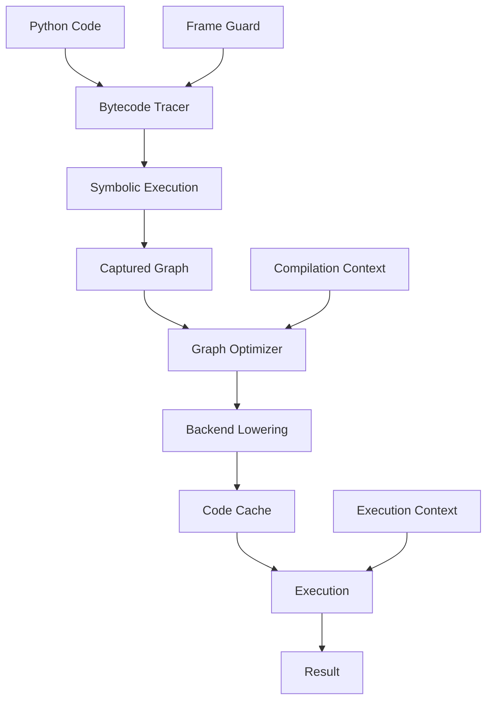

# Dynamic Graph Execution Runtime - Architecture

## Overview

The Dynamic Graph Execution Runtime is a Python-native system for capturing, optimizing, and executing computational graphs dynamically. Inspired by PyTorch's TorchDynamo and TorchFX, it provides just-in-time compilation while maintaining Python semantics.

## System Components

### 1. Core Layer (`dynamicgraph/core/`)

#### Graph Module
- **Graph**: Main graph container with nodes and edges
- **Node**: Represents operations with metadata and connections
- **Edge**: Directed connections between nodes
- **OpType**: Enumeration of supported operations

#### Tensor Module
- **SymbolicTensor**: Symbolic representation of tensors during tracing
- **TensorMetadata**: Shape, dtype, device information
- **TensorFactory**: Factory methods for creating tensors

#### Context Module
- **ExecutionContext**: Runtime state management
- **CompilationContext**: Compilation settings and statistics
- **GlobalContext**: Thread-safe context management

### 2. Tracing Layer (`dynamicgraph/tracer/`)

#### Bytecode Tracer
- Interprets Python bytecode with symbolic values
- Captures operations into IR graph
- Handles graph breaks for unsupported operations

#### Frame Guard
- Guards compiled functions for recompilation
- Tracks assumptions about inputs
- Validates guard conditions

### 3. Optimizer Layer (`dynamicgraph/optimizer/`)

#### Graph Optimizer
- Orchestrates optimization passes
- Pass scheduling
- Optimization levels

#### Optimization Passes
- **ConstantFolding**: Evaluate constant expressions
- **OperatorFusion**: Fuse compatible operations
- **DeadCodeElimination**: Remove unreachable code
- **CommonSubexpressionElimination**: Eliminate redundant computations

### 4. Code Generation Layer (`dynamicgraph/codegen/`)

#### Backend Registry
- Manages available backends
- Backend selection logic
- Capability queries

#### Compiler
- Lowers IR to backend code
- Manages compilation cache
- Handles fallbacks

## Data Flow



## Compilation Pipeline

1. **Function Decoration/Wrapping**
   - User decorates function with `@compile`
   - Or uses explicit compilation API

2. **Bytecode Tracing**
   - Disassemble the function's bytecode with `dis`
   - Symbolically interpret it in `BytecodeTracer` (no eval-frame hooks or code-object patching)

3. **Symbolic Tracing**
   - Execute with symbolic tensors
   - Record operations in graph
   - Handle graph breaks

4. **Graph Construction**
   - The captured `Graph` serves as the intermediate representation
   - Preserve semantic information
   - Add metadata

5. **Optimization**
   - Apply graph transformations
   - Respect optimization level
   - Maintain correctness

6. **Backend Lowering**
   - Select appropriate backend
   - Generate target code
   - Handle unsupported ops

7. **Caching**
   - Cache compiled functions
   - Key by guard conditions
   - Manage cache size

8. **Execution**
   - Execute compiled code
   - Fall back on guard failure
   - Collect profiling data

## Key Design Decisions

### Dynamic vs Static Compilation
- **Dynamic**: Compile during execution based on actual inputs
- **Advantages**: Better specialization, handles Python dynamism
- **Trade-offs**: Compilation overhead, guard checking cost

### Graph Break Handling
- **Strategy**: Partial compilation with fallbacks
- **Triggers**: Unsupported operations, side effects, dynamic control flow
- **Recovery**: Resume tracing after graph break

### Memory Management
- **Tensor Lifecycle**: Reference counting with cycle detection
- **Graph Memory**: Automatic cleanup on context destruction
- **Cache Management**: LRU eviction with size limits

### Thread Safety
- **Global State**: Thread-local contexts
- **Compilation**: Context registry guarded by a lock
- **Execution**: Independent per-thread execution

## Extension Points

### Backend Integration
```python
class CustomBackend(Backend):
    def name(self) -> str:
        return "custom"

    def is_available(self) -> bool:
        return True

    def compile(self, graph) -> CompiledFunction:
        # Backend-specific compilation
        ...

BackendRegistry.register(CustomBackend())
```

### Optimization Passes
```python
class CustomPass(OptimizationPass):
    def run(self, graph) -> PassResult:
        # Graph transformation logic
        ...
```

## Performance Considerations

### Compilation Overhead
- Amortized over multiple executions
- Guard checking cost
- Cache hit rates

### Memory Usage
- Graph representation overhead
- Compiled code storage
- Tensor metadata tracking

### Optimization Trade-offs
- Compilation time vs execution speedup
- Graph size vs optimization depth
- Specialization vs generalization

