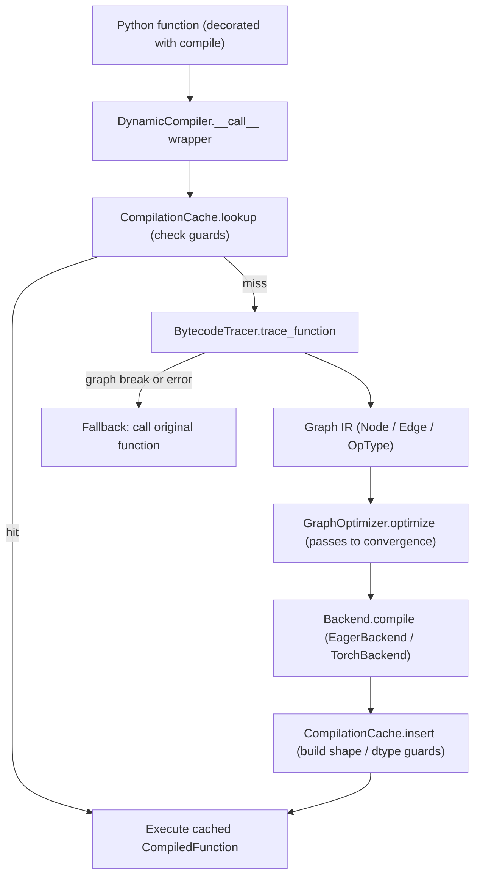

# Dynamic Graph Execution Runtime

## Overview

This project is a from-scratch, Python-native dynamic graph execution runtime in the
spirit of PyTorch's TorchDynamo and TorchFX. It takes an ordinary Python function that
performs tensor math, captures it into an explicit computation graph by interpreting the
function's CPython bytecode, runs a sequence of optimization passes over that graph, and
lowers the result to an execution backend — all behind a `torch.compile()`-style
decorator with a guarded compilation cache.

The goal is pedagogical fidelity to how a modern just-in-time graph compiler is
structured, not coverage or performance parity with PyTorch. Concretely it teaches:

- **Program capture by bytecode interpretation** — how a tracer can symbolically execute
  the straight-line subset of CPython bytecode and degrade gracefully (a *graph break*)
  when it meets a construct it cannot represent.
- **A small but real compiler IR** — a directed graph of typed operation nodes with
  shape/dtype metadata, topological scheduling, and validation.
- **Classic graph optimizations** — shape inference, constant folding, algebraic
  simplification, dead-code elimination, common-subexpression elimination, operator
  fusion, and layout choices, driven to a fixed point.
- **Guarded caching** — caching compiled functions keyed by the code object and a set of
  shape/dtype *guards*, so a recompile happens only when an assumption changes.
- **Backend lowering through a registry** — a pluggable backend abstraction with a NumPy
  reference implementation and an optional PyTorch backend.

Scope boundaries are explicit. The tracer handles loads, stores, stack manipulation, the
fused `BINARY_OP`, unary negation, and returns; everything else ends the traceable region
and falls back to running the original Python function eagerly. Storage is NumPy on CPU;
the only GPU path is the optional PyTorch backend, and there is no custom kernel codegen.
Gradient computation is not implemented — the runtime is a forward-only graph compiler.

The design mirrors the real division of labor in a deep-learning compiler stack: a
*frontend* that captures programs (the tracer), a *middle-end* IR and optimizer (the
graph and passes), and a *backend* that emits or interprets executable code. Each layer is
a self-contained subpackage with a narrow interface to its neighbors, so a reader can
study one stage — say, how a graph break ends tracing, or how operator fusion rewrites a
matmul-plus-add into a single linear node — without holding the entire system in mind.

## Architecture



The pipeline has four layers, each in its own subpackage:

1. **Core (`core/`)** — the data model: the `Graph` IR (`graph.py`), the `SymbolicTensor`
   used to infer shapes during tracing (`tensor.py`), and the compilation/execution
   context with `no_grad`/`enable_grad` (`context.py`).
2. **Tracer (`tracer/`)** — `BytecodeTracer` turns a function into a `Graph` by walking
   its instructions; `FrameGuard` holds the guard-condition machinery used while tracing.
3. **Optimizer (`optimizer/`)** — `GraphOptimizer` orchestrates a list of
   `OptimizationPass` objects (`passes.py`) and runs them to a fixed point, collecting
   statistics.
4. **Codegen (`codegen/`)** — `Backend`/`BackendRegistry` and the concrete `EagerBackend`
   (NumPy) and `TorchBackend` (`backend.py`); `DynamicCompiler`, the cache, and the
   `compile`/`trace`/`explain` entry points (`compiler.py`).

The top-level package re-exports the public surface from `dynamicgraph/__init__.py`, so
`from dynamicgraph import compile, trace, Graph, Node, OpType, GraphOptimizer` works
directly.

### Control flow of a single call

When a decorated function is called, `DynamicCompiler.__call__` has wrapped it in
`compiled_func`. On each invocation that wrapper:

1. **Consults the cache** (if enabled). The cache key is derived purely from the function's
   code object, so all invocations of the same function share a key; the per-call guards
   distinguish entries within that key. A guard match returns the stored
   `CompiledFunction` immediately.
2. **On a miss, traces** the function with `BytecodeTracer.trace_function(func, *args)`,
   binding the positional arguments to `INPUT` nodes and symbolically executing the
   bytecode.
3. **Optimizes** the captured graph with `GraphOptimizer.optimize`, which clones the graph
   and runs passes to convergence.
4. **Compiles** the optimized graph with the configured backend, producing a closure that
   interprets the graph at call time.
5. **Builds guards** from the call's arguments (one `ShapeGuard` and one `DtypeGuard` per
   array-like argument) and inserts the compiled function into the cache.
6. **Executes** the compiled function and returns its result.

Any exception in steps 2–5 — most commonly a `_GraphBreak` raised by the tracer on an
unsupported opcode — is caught, and if `fallback_to_eager` is set the wrapper simply calls
the original Python function. This is the same graceful-degradation contract a production
tracer offers: an un-traceable function still runs, just without compilation.

### Worked example: tracing and recompilation

Consider `f(x, y): return x * y + x`, compiled at `optimization_level=2` and first called
with two `(4, 4)` float32 arrays. The cache is empty, so the wrapper traces. The tracer
binds `x` and `y` to two `INPUT` nodes, then walks the bytecode: a fused
`LOAD_FAST_LOAD_FAST` pushes `x` and `y`, `BINARY_OP *` pops both and records a `MUL` node
wired to the two inputs, a `LOAD_FAST` pushes `x` again, `BINARY_OP +` records an `ADD`
node wired to the `MUL` result and the `x` input, and `RETURN_VALUE` records an `OUTPUT`
node fed by the `ADD`. The captured graph has six nodes (two inputs, mul, add, output, and
no constants because both operands are symbolic).

The optimizer clones the graph and runs the level-2 pipeline. With distinct inputs there is
nothing to fold, simplify, or fuse here, so the optimized graph matches the traced one;
`explain` would report zero changes. The eager backend then compiles the graph into a
closure that, on each call, maps `args[0]`/`args[1]` to the inputs and evaluates
`np.multiply` then `np.add` in topological order. Finally, the compiler records two
`ShapeGuard`s and two `DtypeGuard`s — `arg[0].shape == (4, 4)`, `arg[0].dtype == "float32"`,
and the same for `arg[1]` — and inserts the entry under the code-object key.

A second call with `(4, 4)` float32 arrays now hits: `lookup` finds the key, all four
guards pass, and the stored closure runs without re-tracing. A call with `(8, 8)` arrays
*misses* — the shape guards fail — so the function re-traces and inserts a *second* entry
under the same key, and the cache now holds two specializations of `f`. A call with
`int64` arrays misses on the dtype guards and produces a third. This is exactly the
shape/dtype specialization a guarded JIT performs, and it is why the cache stores a *list*
of entries per code object rather than a single compiled function.

If `f` instead contained an unsupported construct — say a Python `if` (which compiles to a
`POP_JUMP_IF_*` opcode the interpreter does not handle) — the tracer would raise
`_GraphBreak("Unsupported opcode: POP_JUMP_IF_FALSE")`, the reason would be appended to
`graph_break_reasons`, and `trace_function` would return the partial graph captured up to
that point. The compiler's backend would then fail to produce a sensible result (or the
break would surface as an exception), and the `fallback_to_eager` path would run the
original `f`. No partial subgraph is executed and stitched back to Python — the entire call
falls back, which keeps the model simple and matches the "graph break ends the region"
contract described in the tracer section.

## Core Components

### Graph IR (`core/graph.py`)

The IR is a mutable directed graph. An `OpType` enum enumerates the supported operations:
arithmetic (`ADD`, `SUB`, `MUL`, `DIV`, `MATMUL`), neural-network ops (`LINEAR`, `CONV2D`,
`RELU`, `SIGMOID`, `SOFTMAX`, `BATCHNORM`, `DROPOUT`), shape ops (`RESHAPE`, `TRANSPOSE`,
`PERMUTE`, `SQUEEZE`, `UNSQUEEZE`), reductions (`SUM`, `MEAN`, `MAX`, `MIN`), control-flow
placeholders (`IF_THEN_ELSE`, `WHILE_LOOP`, `FOR_LOOP`), memory ops (`COPY`, `CLONE`,
`DETACH`), the graph boundary markers (`INPUT`, `OUTPUT`, `CONSTANT`, `PARAMETER`,
`BUFFER`), and `CUSTOM`.

Each `Node` carries an id (defaulting to `node_<uuid8>`), an `op_type`, an optional name,
input/output node-id lists, an attribute dict, and `NodeMetadata` (dtype, shape, device,
`requires_grad`, parameter/buffer flags, source location, original name, compile hints).
`Node` exposes `add_input`/`add_output`/`remove_input`/`remove_output` helpers that keep
the adjacency lists de-duplicated. `Edge` records a source, target, the input index at the
target, and an attribute dict.

`Graph` maintains the node table (`nodes: Dict[str, Node]`), the edge list, and the
`input_nodes`/`output_nodes` lists, which are updated automatically when `INPUT`/`OUTPUT`
nodes are added in `add_node`. Adding an edge wires both endpoints' adjacency lists
(`source.outputs`, `target.inputs`) and invalidates the cached topological order; removing
a node strips its edges, unlinks neighbors, and drops it from the boundary lists. The
scheduler is Kahn's algorithm with a memoized result:

```python
def topological_sort(self) -> List[str]:
    if self._topological_order is not None:
        return self._topological_order

    in_degree = {node_id: len(self.nodes[node_id].inputs) for node_id in self.nodes}
    queue = [node_id for node_id, degree in in_degree.items() if degree == 0]
    result = []
    while queue:
        node_id = queue.pop(0)
        result.append(node_id)
        for successor in self.nodes[node_id].outputs:
            in_degree[successor] -= 1
            if in_degree[successor] == 0:
                queue.append(successor)

    if len(result) != len(self.nodes):
        raise ValueError("Graph contains cycles")
    self._topological_order = result
    return result
```

`has_cycle()` is layered on top of this — it runs the sort and catches the cycle
`ValueError`. `subgraph(node_ids)` copies the selected nodes and the edges fully inside the
set (so dangling edges are dropped), and `clone()` is `subgraph` over all node keys, used
by the optimizer to avoid mutating the caller's graph. `validate()` returns a list of
human-readable issues — cycles, dangling edge endpoints, and inconsistent adjacency — so an
empty list means the graph is valid; callers must not treat the return value as a boolean.
`to_dict` / `from_dict` round-trip the graph (op types by name, the core metadata fields,
edges with index) for serialization. The `__str__` pretty-printer summarizes node/edge
counts, inputs/outputs, and the first few nodes.

A design note worth flagging: the cached `_topological_order` is invalidated on every
structural edit (`add_node`, `remove_node`, `add_edge`). Optimization passes that mutate
the graph therefore implicitly pay for a re-sort the next time order is requested, but
read-only consumers (the backend's `compile`) sort once and reuse the cache.

### Symbolic tensor (`core/tensor.py`)

`SymbolicTensor` is the value type the tracer threads through bytecode to perform shape and
dtype inference. It holds an optional `node_id` (default `tensor_<uuid8>`), optional
`TensorMetadata` (dtype, shape, device defaulting to `"cpu"`, `requires_grad`,
parameter/buffer flags, name), an optional concrete NumPy value, and a `source` label such
as `"arg_0"` or `"matmul(...)"`. The `dtype`/`shape`/`device`/`requires_grad` properties
read from metadata first and fall back to the concrete value's attributes, so a symbolic
tensor with a bound array reports real shape and dtype.

Operator overloads build *result* symbolic tensors with inferred metadata rather than
computing values. Element-wise ops route through `_create_binop_result`, which broadcasts
shapes and promotes dtypes; matmul has its own rule:

```python
def __matmul__(self, other: 'SymbolicTensor') -> 'SymbolicTensor':
    s1, s2 = self.shape, other.shape
    if len(s1) >= 2 and len(s2) >= 2:
        if s1[-1] != s2[-2]:
            raise ValueError(f"Matrix dimensions don't match: {s1} @ {s2}")
        result_shape = s1[:-1] + (s2[-1],)
    elif len(s1) == 1 and len(s2) == 2:
        result_shape = (s2[-1],)
    elif len(s1) == 2 and len(s2) == 1:
        result_shape = (s1[-2],)
    else:
        result_shape = ()
    dtype = self._promote_dtypes(self.dtype, other.dtype)
    requires_grad = self.requires_grad or other.requires_grad
    return SymbolicTensor(metadata=TensorMetadata(dtype=dtype, shape=result_shape,
                                                  device=self.device,
                                                  requires_grad=requires_grad))
```

The full operator set is `+`, `-`, `*`, `/` (with their reflected `__radd__`/`__rsub__`/
`__rmul__`/`__rtruediv__` forms so `2 * x` works), `@`, and unary negation. Element-wise
ops broadcast with NumPy-style rules via `_broadcast_shapes` — it pads the shorter shape
with leading 1s and resolves each axis (equal, or one side is 1), raising on an
incompatible pair — and dtypes promote via `np.promote_types` in `_promote_dtypes`.
`requires_grad` propagates as the logical OR of the operands.

Beyond arithmetic, `detach`/`clone`/`to(device)` produce new metadata-consistent tensors
(detach clears `requires_grad` and the parameter flag), and helpers like `numel`, `ndim`,
and `size(dim)` mirror the PyTorch tensor surface, with `size` honoring negative
dimensions and raising `IndexError` out of range. The `grad` property enforces that only
tensors with `requires_grad` may have a gradient set. `TensorFactory` provides `zeros`,
`ones`, `randn`, and `from_numpy` constructors that attach a concrete value and a source
label, used by tests and by callers building inputs.

### Context (`core/context.py`)

The context module holds `CompilationContext`, `ExecutionContext`, and a process-wide
`GlobalContext` singleton, plus `get_current_context`/`set_current_context` and the
`no_grad` / `enable_grad` context managers.

`CompilationContext` is a dataclass of compilation knobs: `optimization_level`, `backend`,
`device`, profiling/debugging flags, `cache_compiled`, and `min_graph_size`/`max_graph_size`
thresholds. Its `should_compile(graph)` encodes a real policy decision — compile only when
optimization is on, the node count is within `[min_graph_size, max_graph_size]`, and the
graph is acyclic — modeling how a runtime decides a graph is worth compiling rather than
running eagerly.

`ExecutionContext` carries the runtime state: a tensor cache, parameter/buffer value maps,
a gradient map, an `is_training`/`is_grad_enabled` pair, and a graph stack with
`push_graph`/`pop_graph` for nested compilation regions. `compute_gradients` and
`zero_gradients` are present as the autodiff seam but `compute_gradients` is a documented
placeholder that returns an empty dict — there is no backward pass.

`GlobalContext` is a thread-aware singleton keyed by `threading.get_ident()`, so each
thread gets its own `ExecutionContext`. `no_grad`/`enable_grad` are stack-disciplined
context managers that save and restore `is_grad_enabled` on the *current* context, and
nest correctly (an `enable_grad` inside a `no_grad` re-enables, then restores to disabled
on exit).

### Bytecode tracer (`tracer/bytecode_tracer.py`)

`BytecodeTracer.trace_function(func, *args, **kwargs)` is the capture entry point. It binds
each positional argument to a symbolic `INPUT` node (using the function's argument names
from `code.co_varnames[:code.co_argcount]`), then symbolically executes the bytecode with a
single linear pass over `dis.get_instructions(func)`:

```python
def trace_function(self, func, *args, **kwargs) -> Graph:
    self.reset()
    self.mode = TracingMode.SYMBOLIC
    self.graph = Graph(name=getattr(func, "__name__", "traced"))

    code = func.__code__
    argnames = code.co_varnames[: code.co_argcount]
    local_vars = {}
    for i, arg in enumerate(args):
        sym = self._make_symbolic(arg, f"arg_{i}")
        self.graph.add_node(Node(id=sym.node_id, op_type=OpType.INPUT,
                                 name=sym.source, metadata=self._node_metadata(sym)))
        if i < len(argnames):
            local_vars[argnames[i]] = sym

    try:
        self._interpret(func, local_vars)
    except _GraphBreak as brk:
        self.record_graph_break(str(brk))
    self.mode = TracingMode.NONE
    return self.graph
```

`_make_symbolic` turns each argument into a `SymbolicTensor`: NumPy arrays and Python
scalars get a concrete value attached; anything with `.shape` and `.dtype` (e.g. a
duck-typed tensor) gets symbolic metadata; everything else becomes a bare symbolic tensor.

The interpreter maintains an explicit value stack. It handles bookkeeping opcodes
(`RESUME`, `RESUME_CHECK`, `NOP`, `PRECALL`, `NOT_TAKEN`, `MAKE_CELL`, `COPY_FREE_VARS`) as
no-ops and pushes `None` for `PUSH_NULL`. The supported opcode families are:

- **Loads** — `LOAD_FAST`, `LOAD_FAST_BORROW`, `LOAD_FAST_CHECK`, `LOAD_DEREF`, the fused
  `LOAD_FAST_LOAD_FAST` and `LOAD_FAST_BORROW_LOAD_FAST_BORROW` (3.13/3.14 forms), and
  `LOAD_CONST`.
- **Stores** — `STORE_FAST`, the fused `STORE_FAST_LOAD_FAST`, and `STORE_FAST_STORE_FAST`.
- **Stack manipulation** — `POP_TOP`, `COPY` (push the n-th-from-top), and `SWAP`.
- **Arithmetic** — `BINARY_OP` and `UNARY_NEGATIVE`.
- **Returns** — `RETURN_VALUE` and `RETURN_CONST`.

Any other opcode raises the internal `_GraphBreak`, which propagates out of `_interpret`,
is caught in `trace_function`, recorded in `graph_break_reasons`, and ends tracing with
whatever partial graph was captured. This is exactly how the runtime models a graph break:
no partial-subgraph stitching, no resumption — the un-traceable region is handed back to
eager Python by the compiler.

`BINARY_OP` maps the operator symbol (`instr.argrepr`, with a trailing `=` stripped so
in-place ops like `+=` collapse onto their pure form) through `_BINOP_OPS`: `+`/`-`/`*`/`/`/`@`
become `ADD`/`SUB`/`MUL`/`DIV`/`MATMUL`, and anything else is recorded as a `CUSTOM` node
tagged with the operator in its attributes. Each recorded op creates a result node and
wires an edge from every operand's node, materializing literals as `CONSTANT` nodes:

```python
def _record_op(self, op_type, operands, name=None, attributes=None) -> SymbolicTensor:
    result = SymbolicTensor(source=(name or op_type.name.lower()))
    result.metadata.shape = self._infer_shape(op_type, operands)
    node = Node(id=result.node_id, op_type=op_type, name=name or op_type.name.lower(),
                attributes=attributes or {}, metadata=self._node_metadata(result))
    self.graph.add_node(node)
    for index, operand in enumerate(operands):
        src_id = self._operand_node_id(operand)
        if src_id is not None and src_id in self.graph.nodes:
            self.graph.add_edge(src_id, result.node_id, index=index)
    return result
```

`_operand_node_id` returns the node id of a `SymbolicTensor` operand directly and
materializes any other literal as a fresh `CONSTANT` node with the value in its attributes,
so a `x + 1` produces an `ADD` node wired to the input node and to a constant. `_record_output`
creates the terminal `OUTPUT` node and wires it to the returned value's node.
`_infer_shape` does best-effort output-shape inference (broadcast for element-wise ops,
pass-through for matmul/unary, `None` when shapes are unknown), and `should_trace` skips
frames whose filename starts with `<`, lives in `site-packages`, or is in the standard
library — the policy a real tracer uses to avoid tracing into library code. `reset` clears
the graph, frames, symbolic values, break reasons, and mode between traces.

### Frame guard (`tracer/frame_guard.py`)

`FrameGuard` collects `(GuardCondition, check)` pairs via `add_condition`, evaluates them
all in `check()`, and reports `GuardFailure`s. The `GuardCondition` enum names the kinds of
checks (`TYPE_MATCH`, `SHAPE_MATCH`, `VALUE_MATCH`, `ATTRIBUTE_MATCH`), and `GuardFailure`
carries the condition plus expected/actual values for a readable message. This is the
tracing-time guard scaffolding; the *runtime* guards that gate the cache are a separate
hierarchy in the compiler (below).

### Optimizer (`optimizer/graph_optimizer.py`, `optimizer/passes.py`)

`GraphOptimizer` is configured by `optimization_level`. `_configure_passes` builds the pass
list: level 0 is a no-op, level 1 runs `ShapeInference`, `ConstantFolding`,
`AlgebraicSimplification`, and `DeadCodeElimination` (in that order), and level 2 adds
`CommonSubexpressionElimination`, `OperatorFusion`, and `LayoutOptimization`. `optimize`
clones the input graph (so the original is untouched) and runs the enabled passes
repeatedly until an iteration makes no change or `max_iterations` (default 10) is reached,
collecting `OptimizationStats`:

```python
def optimize(self, graph: Graph) -> Tuple[Graph, OptimizationStats]:
    stats = OptimizationStats()
    if self.optimization_level == 0:
        return graph, stats
    optimized = graph.clone()
    for iteration in range(self.max_iterations):
        changed_this_iteration = False
        for pass_ in self.passes:
            if not pass_.enabled:
                continue
            result = pass_.run(optimized)
            stats.total_passes += 1
            stats.pass_results.setdefault(pass_.name, []).append(result)
            if result.changed:
                changed_this_iteration = True
                stats.total_changes += 1
                stats.nodes_removed += result.nodes_removed
                stats.nodes_added += result.nodes_added
        if not changed_this_iteration:
            break
    stats.optimization_time_ms = (time.time() - start_time) * 1000
    return optimized, stats
```

The optimizer also supports `add_pass`/`remove_pass`/`enable_pass`/`disable_pass` for
shaping the pipeline, `get_pass_stats`/`reset_stats` for per-pass telemetry, and two
specialized entry points: `optimize_for_inference` runs the standard pipeline then removes
`DROPOUT` nodes (identity at inference, so they are spliced out and their input rewired),
and `optimize_for_training` clamps to level ≤ 1 for a conservative, gradient-preserving
pass before restoring the configured level. The `optimize_graph(graph, level, mode)`
convenience function wraps all three modes.

Each pass subclasses `OptimizationPass`, implements `run(graph) -> PassResult`, and tracks
its own run/change counters. A `PassResult(changed, nodes_removed, nodes_added,
nodes_modified, message)` is the uniform return type. The passes:

- **`ShapeInference`** — forward-propagates shapes in topological order, filling
  `node.metadata.shape` for nodes that lack one. It broadcasts for element-wise ops,
  preserves shape for unary activations, applies the matmul rule, reads target shapes from
  `RESHAPE`/`TRANSPOSE`/reduction attributes, and bails cleanly if the graph has cycles.
- **`ConstantFolding`** — finds nodes whose inputs are all `CONSTANT` nodes (or already
  folded), evaluates them with NumPy in `_evaluate_op` (arithmetic, matmul, relu,
  sigmoid), and rewrites the node in place to a `CONSTANT` carrying the computed value,
  caching results in `_constant_cache`. Any evaluation exception is swallowed so an
  un-foldable op is simply left alone.
- **`AlgebraicSimplification`** — applies identities: `x + 0 → x`, `x * 1 → x`,
  `x * 0 → 0`, `x - x → 0`, `x / x → 1`, and idempotent `relu(relu(x)) → relu(x)`. It
  recognizes zero/one constants via `_is_zero`/`_is_one` (NumPy element-wise comparison)
  and rewrites uses with `_replace_with`.
- **`DeadCodeElimination`** — marks every node reachable backward from the outputs (and all
  `OUTPUT` nodes) as live, then removes the rest. Dead branches produced by simplification
  or fusion are collected here.
- **`CommonSubexpressionElimination`** — computes a hashable signature per node
  `(op_type, sorted(inputs), frozen(attributes))`, keeps the first occurrence, and rewrites
  later duplicates to reference it before removing them.
- **`OperatorFusion`** — runs three pattern matchers to a local fixed point:
  `_fuse_matmul_bias` rewrites `matmul → add` into a single `LINEAR` (only when the matmul
  has exactly one user), `_fuse_conv_bn_relu` collapses `conv2d → batchnorm → relu` into a
  `CUSTOM` `fused_conv_bn_relu` node (folding the bn/conv attributes in, again gated on
  single users), and `_fuse_pointwise_chain` is a stub returning 0.
- **`LayoutOptimization`** — annotates `CONV2D` nodes with a `memory_format` and `MATMUL`
  nodes with `ensure_contiguous`, modeling the layout-assignment stage of a real compiler.

Because passes run to convergence, an interaction chain works automatically: constant
folding can expose an `x * 0` for algebraic simplification, which produces a dead node that
DCE then removes, all within the iteration loop. The fixed-point loop is what lets a single
configuration of independent passes compose into a non-trivial rewrite without an explicit
schedule — each pass is written to be idempotent once it has nothing left to do, and the
loop stops the iteration after the first pass over all passes that produces no change.

The telemetry is first-class. `OptimizationStats.pass_results` accumulates a `PassResult`
per pass per iteration, and `explain` summarizes it into a report of original vs. optimized
node and edge counts plus a per-pass change count, e.g.:

```
Function: f

Original graph:
  Nodes: 6
  Edges: 5

Optimized graph:
  Nodes: 6
  Edges: 5

Optimization passes: 7
Changes made: 0
Nodes removed: 0
Time: 0.41ms

Pass results:
  shape_inference: 0 changes
  constant_folding: 0 changes
  ...
```

This makes the optimizer observable in the same way `torch.compile`'s `explain` surfaces
graph breaks and recompiles — a reader can see precisely which pass fired and how much it
changed, rather than treating optimization as a black box.

The two specialized entry points encode realistic mode distinctions.
`optimize_for_inference` is allowed to be more aggressive because gradients are irrelevant:
after the standard pipeline it splices out every `DROPOUT` node (which is identity at
inference), rewiring each dropout's single input into its consumers and the output list.
`optimize_for_training` is deliberately conservative — it clamps the level to at most 1 so
that fusion and layout rewrites, which can complicate a (hypothetical) backward pass, are
skipped, then restores the configured level afterward. These mirror the
`model.eval()`/`model.train()` split in a real framework, where the legal set of graph
rewrites depends on whether gradients will be taken.

### Backends (`codegen/backend.py`)

A `Backend` ABC declares `name()`, `compile(graph) -> CompiledFunction`, `is_available()`,
and a default `supports_op`. `CompiledFunction` is a dataclass wrapping the generated
`execute_fn` plus the graph, backend name, and input/output names; it is itself callable
via `__call__`.

`EagerBackend` (`name() == "eager_numpy"`, always available) compiles a graph into a
closure that interprets it at call time. `compile` topologically sorts the graph and
captures the input/output names, then returns an `execute` closure that, on each call,
binds positional/keyword arguments to `INPUT` nodes, walks the nodes in topological order,
and dispatches each `OpType` through an op map of NumPy implementations:

```python
def execute(*args, **kwargs):
    values = {}
    input_idx = 0
    for node_id in exec_order:
        node = graph.nodes[node_id]
        if node.op_type == OpType.INPUT:
            values[node_id] = args[input_idx] if input_idx < len(args) else kwargs[node.name]
            input_idx += 1
    for node_id in exec_order:
        node = graph.nodes[node_id]
        # INPUT / OUTPUT / CONSTANT / PARAMETER / BUFFER handled specially ...
        op_fn = op_map.get(node.op_type)
        values[node_id] = op_fn([values.get(i) for i in node.inputs], node.attributes)
    # gather outputs: single output unwrapped, multiple returned as a tuple
```

The op map (`_build_op_map`) covers arithmetic (`np.add`/`subtract`/`multiply`/`divide`/
`matmul`), activations (`RELU` as `np.maximum(x, 0)`, `SIGMOID`, a numerically-stable
`SOFTMAX` that subtracts the per-axis max), shape ops (`RESHAPE`, `TRANSPOSE`, `PERMUTE`,
`SQUEEZE`, `UNSQUEEZE`), reductions (`SUM`/`MEAN`/`MAX`/`MIN` honoring `dim`/`keepdim`),
memory ops (`COPY`/`CLONE`/`DETACH`), a `LINEAR` (`x @ Wᵀ + b`), a naive direct-convolution
`CONV2D` (nested `h_out`/`w_out` loops with `np.tensordot`, padding, and stride), a
`BATCHNORM` (running-stat inference path or batch-stat training path), and a `CUSTOM`
handler that understands the fused `conv_bn_relu`. `OUTPUT` nodes pass their input through;
`CONSTANT`/`PARAMETER`/`BUFFER` read their value from attributes. Per-op execution errors
are wrapped in a `RuntimeError` naming the failing op and node.

`TorchBackend` mirrors the structure with PyTorch ops and a device (`name() == "torch_cpu"`
or `"torch_cuda"`); its op map covers arithmetic, relu, sigmoid, and softmax, and it
converts inputs to tensors on the target device. `is_available()` checks that `torch`
imports (and for CUDA that `torch.cuda.is_available()`).

`BackendRegistry` is a class-level registry with `register`/`get`/`get_default`/`set_default`/
`list_backends`/`list_available`. At import time the eager backend is registered as default,
and the Torch CPU and (if usable) CUDA backends are registered only if available — wrapped
in a `try/except` so a missing or broken `torch` never affects import. This is why a stock
NumPy environment is fully functional with `eager_numpy` as the default.

### Compiler, cache, and guards (`codegen/compiler.py`)

`DynamicCompiler` is the orchestrator. Its constructor wires up a `GraphOptimizer` at the
requested `optimization_level`, a `CompilationCache`, a `BytecodeTracer`, and a backend
looked up from the registry (`"eager_numpy"` by default; if the named backend is missing it
falls back to the first available one, or raises if none exist). Calling the compiler on a
function returns a `@wraps`-preserving wrapper that, on each call, checks the cache, and on
a miss traces → optimizes → compiles → caches → executes, with a guarded fallback to eager
(shown in the *Control flow of a single call* section above). The wrapper exposes
`_compiled`, `_compiler`, and `_original` attributes for introspection.

Guards are generated from the call's arguments in `_create_guards`: every argument with a
`shape` produces a `ShapeGuard` and every one with a `dtype` produces a `DtypeGuard`. A
`Guard` wraps a `check_fn` that returns `False` on any exception (so a mismatched or
absent argument simply misses the cache rather than crashing). `ShapeGuard._check` compares
`tuple(arg.shape)` to the recorded shape; `DtypeGuard._check` compares `str(arg.dtype)`.

`CompilationCache` keys entries by the function's code object
(`filename:firstlineno:name`), stores a list of `CacheEntry` objects per key, and on
`lookup` returns the first entry whose guards all pass (incrementing that entry's hit
count) — counting a miss otherwise. `insert` appends a new `CacheEntry` and triggers
eviction when `total_entries` exceeds `max_entries` (default 1000). Eviction (`_evict`)
scores each entry by `hit_count - age/3600` and drops the lowest — a hit-count-with-decay
heuristic that favors frequently used, recent entries. `get_stats` reports hits, misses,
hit rate, and total/average compile time; `clear` resets the cache.

The module-level helpers are the public ergonomic API: `compile(func=None, *, backend,
optimization_level, **kwargs)` constructs a `DynamicCompiler` and either decorates the
function directly (bare `@compile`) or returns the compiler to be used as a parameterized
decorator (`@compile(optimization_level=2)`); `optimize` is `compile` with defaults;
`trace(func, *args)` returns the captured `Graph`; and `explain(func, *args)` traces,
optimizes at level 2, and returns a human-readable report of original vs. optimized
node/edge counts and per-pass change counts.

## Data Structures

The IR core types (`core/graph.py`):

```python
class OpType(Enum):
    ADD = auto(); SUB = auto(); MUL = auto(); DIV = auto(); MATMUL = auto()
    LINEAR = auto(); CONV2D = auto(); RELU = auto(); SIGMOID = auto()
    SOFTMAX = auto(); BATCHNORM = auto(); DROPOUT = auto()
    RESHAPE = auto(); TRANSPOSE = auto(); PERMUTE = auto()
    SQUEEZE = auto(); UNSQUEEZE = auto()
    SUM = auto(); MEAN = auto(); MAX = auto(); MIN = auto()
    IF_THEN_ELSE = auto(); WHILE_LOOP = auto(); FOR_LOOP = auto()
    COPY = auto(); CLONE = auto(); DETACH = auto()
    INPUT = auto(); OUTPUT = auto(); CONSTANT = auto()
    PARAMETER = auto(); BUFFER = auto(); CUSTOM = auto()

@dataclass
class NodeMetadata:
    dtype: Optional[str] = None
    shape: Optional[Tuple[int, ...]] = None
    device: Optional[str] = None
    requires_grad: bool = False
    is_parameter: bool = False
    is_buffer: bool = False
    source_location: Optional[str] = None
    original_name: Optional[str] = None
    compile_hints: Dict[str, Any] = field(default_factory=dict)

@dataclass
class Node:
    id: str = field(default_factory=lambda: f"node_{uuid.uuid4().hex[:8]}")
    op_type: OpType = OpType.CUSTOM
    name: Optional[str] = None
    inputs: List[str] = field(default_factory=list)   # node ids
    outputs: List[str] = field(default_factory=list)  # node ids
    attributes: Dict[str, Any] = field(default_factory=dict)
    metadata: NodeMetadata = field(default_factory=NodeMetadata)

@dataclass
class Edge:
    source: str
    target: str
    index: int = 0                # input index at the target
    attributes: Dict[str, Any] = field(default_factory=dict)
```

The symbolic-tensor metadata (`core/tensor.py`):

```python
@dataclass
class TensorMetadata:
    dtype: Optional[np.dtype] = None
    shape: Optional[Tuple[int, ...]] = None
    device: str = "cpu"
    requires_grad: bool = False
    is_parameter: bool = False
    is_buffer: bool = False
    name: Optional[str] = None
```

The compiled-function and cache types (`codegen/backend.py`, `codegen/compiler.py`):

```python
@dataclass
class CompiledFunction:
    execute_fn: Callable
    graph: Graph
    backend_name: str
    input_names: List[str]
    output_names: List[str]
    metadata: Dict[str, Any] = field(default_factory=dict)
    def __call__(self, *args, **kwargs): return self.execute_fn(*args, **kwargs)

@dataclass
class CacheEntry:
    compiled_fn: CompiledFunction
    guards: List[Guard]
    graph: Graph
    hit_count: int = 0
    compile_time_ms: float = 0.0
    created_at: float = field(default_factory=time.time)
    def check_guards(self, *args, **kwargs) -> bool:
        return all(g.check(*args, **kwargs) for g in self.guards)
```

The optimizer telemetry (`optimizer/graph_optimizer.py`, `optimizer/passes.py`):

```python
@dataclass
class PassResult:
    changed: bool
    nodes_removed: int = 0
    nodes_added: int = 0
    nodes_modified: int = 0
    message: str = ""

@dataclass
class OptimizationStats:
    total_passes: int = 0
    total_changes: int = 0
    nodes_removed: int = 0
    nodes_added: int = 0
    optimization_time_ms: float = 0.0
    pass_results: Dict[str, List[PassResult]] = field(default_factory=dict)
```

`OptimizationStats` and `PassResult` carry the telemetry surfaced by `explain` and
`get_pass_stats`.

## API Design

Public surface re-exported from `dynamicgraph/__init__.py`:

```
# Core graph
Graph, Node, Edge, OpType, NodeMetadata
SymbolicTensor, TensorMetadata, TensorFactory
CompilationContext, ExecutionContext, GlobalContext
get_current_context, set_current_context, no_grad, enable_grad

# Tracing
BytecodeTracer, TracingMode, TraceFrame
FrameGuard, GuardFailure, GuardCondition

# Optimization
GraphOptimizer, optimize_graph
OptimizationPass, ConstantFolding, DeadCodeElimination,
CommonSubexpressionElimination, AlgebraicSimplification, OperatorFusion

# Backends
Backend, BackendRegistry, EagerBackend, CompiledFunction

# Compiler
DynamicCompiler, CompilationCache, Guard, ShapeGuard, DtypeGuard, CacheEntry
compile, optimize, trace, explain
```

Key signatures:

```python
# Decorator / entry points
compile(func=None, *, backend="eager_numpy", optimization_level=1, **kwargs) -> Callable
optimize(func) -> Callable                         # compile with defaults
trace(func, *args, **kwargs) -> Graph
explain(func, *args, **kwargs) -> str

# Compiler
DynamicCompiler(backend="eager_numpy", optimization_level=1,
                cache_enabled=True, fallback_to_eager=True, verbose=False)
DynamicCompiler.__call__(func) -> Callable
DynamicCompiler.get_stats() -> dict
DynamicCompiler.reset_stats() -> None

# Graph
Graph.add_node(node) -> str
Graph.remove_node(node_id) -> None
Graph.add_edge(source, target, index=0, attributes=None) -> Edge
Graph.topological_sort() -> List[str]
Graph.has_cycle() -> bool
Graph.subgraph(node_ids) -> Graph
Graph.clone() -> Graph
Graph.validate() -> List[str]                       # empty list == valid
Graph.to_dict() -> dict / Graph.from_dict(data) -> Graph

# Symbolic tensor
SymbolicTensor + - * / @  (and reflected forms), - (neg)
SymbolicTensor.detach() / clone() / to(device)
SymbolicTensor.numel() / ndim() / size(dim=None)
TensorFactory.zeros/ones/randn(shape, dtype, device, requires_grad)
TensorFactory.from_numpy(array, device, requires_grad)

# Optimizer
GraphOptimizer(optimization_level=1, max_iterations=10, verbose=False)
GraphOptimizer.optimize(graph) -> (Graph, OptimizationStats)
GraphOptimizer.optimize_for_inference(graph) -> (Graph, OptimizationStats)
GraphOptimizer.optimize_for_training(graph) -> (Graph, OptimizationStats)
optimize_graph(graph, level=1, mode="default"|"inference"|"training") -> Graph

# Backends
BackendRegistry.register(backend, set_default=False)
BackendRegistry.get(name) -> Optional[Backend]
BackendRegistry.list_available() -> List[str]
EagerBackend().compile(graph) -> CompiledFunction

# Cache
CompilationCache(max_entries=1000)
CompilationCache.lookup(func, *args, **kwargs) -> Optional[CompiledFunction]
CompilationCache.insert(func, compiled_fn, graph, guards, compile_time_ms)
CompilationCache.get_stats() -> dict
```

## Performance

This is a reference runtime, so it ships no benchmark numbers; the design choices that
shape its cost profile are:

- **Cache-first dispatch.** A guarded cache hit skips tracing, optimization, and backend
  compilation entirely, executing the stored `CompiledFunction` directly. Guards short-out
  on the first mismatch, so a hit is a small number of shape/dtype comparisons followed by
  a `dict` lookup keyed on the code object.
- **Single-pass tracing.** Capture is one linear walk over `dis.get_instructions` with O(1)
  stack operations per opcode, so tracing cost is proportional to bytecode length. There is
  no recursion into called functions — a call is a graph break.
- **Bounded optimization.** Passes run to a fixed point capped at `max_iterations` (default
  10); each pass is at most a few linear scans of the node table, and the topological order
  is cached and invalidated only on structural edits. CSE pays an extra sort per node to
  build its signature; fusion re-scans the graph per pattern until no more matches occur.
- **Interpreted execution.** Both backends interpret the graph node-by-node rather than
  generating fused machine code, so per-op overhead is a Python `dict` dispatch plus a
  NumPy (or Torch) call. The eager NumPy `CONV2D` is a naive nested-loop reference, not an
  optimized kernel, and is the slowest path by a wide margin.
- **Memory.** Optimization clones the graph once (`graph.clone()`), so peak memory is
  roughly two copies of the IR plus the value map built during execution, which holds one
  array per live node in topological order.

The honest performance posture: the value is in *capture, IR, and optimization* mechanics,
not in beating eager execution. The optimizer can genuinely shrink a graph (folding, CSE,
fusion, dead-code removal) and `explain` quantifies the reduction, but the executors do not
emit fused kernels, so a compiled function will not generally outrun hand-written NumPy.

## Testing Strategy

The `unittest` suite under `tests/` covers each layer independently and end-to-end:

- **`test_graph.py`** — node/edge construction, topological sort, cycle detection,
  `subgraph`/`clone`, `validate`, and dict round-tripping.
- **`test_tensor.py`** — `SymbolicTensor` operator overloads, broadcast and matmul shape
  inference, dtype promotion, and the `TensorFactory` constructors.
- **`test_tracer.py`** — bytecode capture of straight-line functions, input-node and
  symbolic-value creation, graph-break recording, and tracer reset.
- **`test_optimizer.py`** — individual passes (constant folding, algebraic simplification,
  DCE, CSE, fusion) and convergence of the full pipeline.
- **`test_backend.py`** — the eager backend's per-op numerics and compiled-function output
  for multi-op graphs.
- **`test_integration.py`** — end-to-end construction of model-shaped graphs (a linear
  layer; a `Conv2D → BatchNorm → ReLU` block), the execution-context/graph-stack and
  gradient-context-manager behavior, the `CompilationContext.should_compile` policy, and
  the trace → build path.

The edge cases the suite exercises are the ones that distinguish a real implementation:
graphs with cycles (rejected by `should_compile` and surfaced by `validate`/`has_cycle`),
graph breaks on unsupported opcodes, nested `no_grad`/`enable_grad`, and the difference
between an empty `validate()` list (valid) and a non-empty one. Run them with
`PYTHONPATH=src python -m pytest tests/ -v`. No external services are needed; the
PyTorch-specific paths are only exercised when `torch` happens to be importable.

## References

- TorchDynamo: capturing PyTorch programs by symbolically evaluating CPython bytecode.
- TorchFX: practical program capture and transformation over a small graph IR.
- The CPython `dis` module and bytecode reference (opcode semantics, `BINARY_OP`,
  `LOAD_FAST_BORROW` and the fused load/store variants).
- Kahn's algorithm for topological sorting of a directed acyclic graph.
- Classic compiler optimizations: constant folding, common-subexpression elimination,
  dead-code elimination, operator fusion, and peephole/algebraic simplification.
