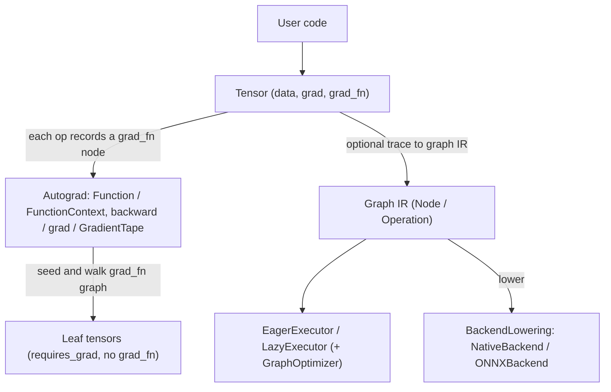

# Dynamic Graph Execution (DynaGraph)

A from-scratch, PyTorch-style framework for eager (define-by-run) tensor computation with
reverse-mode automatic differentiation, built on NumPy. The computation graph is
constructed implicitly as operations run, so native Python control flow participates in
differentiation, and a secondary path lowers a traced graph to pluggable backends.

## Features

- **Eager tensors with autograd** — a NumPy-backed `Tensor` (`float32`) with `requires_grad`,
  operator overloads (`+ - * / @ ** -`, indexing), and reductions (`sum`, `mean`, `max`,
  `min`) that record `grad_fn` nodes (`core/tensor.py`).
- **Reverse-mode backpropagation** — `Tensor.backward()` seeds a gradient, accumulates into
  `.grad`, and walks the `grad_fn` graph to the leaves, with correct broadcast un-reduction.
- **Custom differentiable ops** — a `Function` base class with `forward(ctx, …)` /
  `backward(ctx, …)` and a `FunctionContext` for saved values; built-ins `Add`, `Mul`,
  `MatMul`, `ReLU`, `Sigmoid`, `Tanh`, `Softmax` (`autograd/autograd.py`).
- **Gradient entry points** — module-level `backward(...)` and `grad(outputs, inputs, …)`,
  plus a TensorFlow-style `GradientTape` (`watch`, `gradient`, `jacobian`, `batch_jacobian`).
- **Jacobian and Hessian** — `jacobian` via per-output one-hot backward passes; `hessian`
  via central finite differences of the reverse-mode gradient (requires a recompute `func`).
- **Explicit graph IR + executors** — a separate `Graph` of `Node`/`Operation` objects with
  `EagerExecutor`/`LazyExecutor` and a `GraphOptimizer` (`FusionPass`, `DeadCodePass`).
- **Backends** — a `BackendLowering` interface with a `NativeBackend` (NumPy) and an
  `ONNXBackend` export scaffold (`backend/`).
- **JIT tracing** — `jit_trace` / `trace_graph` capture a function's ops with input-shape
  caching (`autograd/autograd.py`).

## Architecture



| Component | Module | Responsibility |
|-----------|--------|----------------|
| Tensor | `core/tensor.py` | NumPy storage, operator overloads, `grad_fn` tape, `backward` |
| Autograd | `autograd/autograd.py` | `Function`/`FunctionContext`, `backward`/`grad`, `GradientTape`, `jacobian`/`hessian`, built-in ops, JIT tracing |
| Graph IR | `graph/graph.py` | Explicit `Node`/`Operation`/`Graph` for the trace path |
| Executor | `executor/executor.py` | `EagerExecutor`/`LazyExecutor`, `GraphOptimizer` passes |
| Backend | `backend/` | `BackendLowering`, `NativeBackend`, `ONNXBackend`, `LoweredGraph` |

## Quick Start

### Prerequisites

- Python 3.9+
- NumPy (the only runtime dependency)

### Installation

```bash
cd 38-dynamic-graph-execution
pip install -e ".[dev]"
```

### Running

DynaGraph is a library; import it and build tensors:

```python
from dynagraph import Tensor
```

## Usage

Build a computation eagerly and backpropagate:

```python
from dynagraph import Tensor

x = Tensor([[1.0, 2.0], [3.0, 4.0]], requires_grad=True)
w = Tensor([[0.1, 0.2], [0.3, 0.4]], requires_grad=True)

y = x @ w
z = y.sum()
z.backward()        # walks the grad_fn graph back to the leaves

print(x.grad)       # gradients as NumPy arrays
print(w.grad)
```

Apply a built-in differentiable op (activations are `Function` classes, not tensor methods):

```python
from dynagraph import Tensor
from dynagraph.autograd import ReLU

x = Tensor([-1.0, 0.5, 2.0], requires_grad=True)
y = ReLU.apply(x)
y.sum().backward()
print(x.grad)       # 0 where x <= 0, 1 where x > 0
```

Use the `grad` entry point and a `GradientTape`:

```python
from dynagraph import Tensor, grad, GradientTape

x = Tensor([3.0], requires_grad=True)
y = (x * x).sum()
print(grad(y, x))                 # dy/dx = 2x = 6

with GradientTape() as tape:
    tape.watch(x)
    y = (x * x).sum()
print(tape.gradient(y, x))        # same result via the tape API
```

## What's Real vs Simulated

- **Real:** the eager `Tensor`, the full reverse-mode autograd engine (operator overloads,
  reductions, broadcast un-reduction, `grad_fn` graph traversal), the `Function`/`Context`
  extension point and all built-in op gradients, `backward`/`grad`/`GradientTape`,
  `jacobian` (one-hot backward passes), `hessian` (finite differences of the gradient), the
  explicit `Graph` IR, the eager executor, optimization passes, and the `NativeBackend`.
  Correctness is checked numerically against finite differences in the test suite.
- **Simulated / requires credentials:** there is no higher-order autodiff — gradients are
  returned as NumPy arrays, so `hessian` must be given a `func` that recomputes the scalar
  output and is approximated by finite differences (≈1e-3–1e-4 accuracy with `float32`).
  Storage is `float32` on CPU only; there is no GPU path. `MatMul.backward` assumes ≥2-D
  operands. `ONNXBackend.execute()` raises `NotImplementedError` — export scaffolding exists
  but the ONNX inference path is incomplete. The `jit_trace` "compiled" path currently wraps
  the original function rather than emitting an optimized kernel.

## Testing

```bash
cd 38-dynamic-graph-execution
pip install -e ".[dev]"
pytest tests/ -v        # 171 tests
```

The suite spans `test_autograd.py` (reverse-mode correctness, Jacobian/Hessian, tape API),
`test_dynamic_shapes.py`, `test_graph_optimization.py`, `test_jit_trace.py`,
`test_backend.py`, and `test_memory_optimization.py`. No external services are required.

## Project Structure

```
38-dynamic-graph-execution/
  README.md                       # This file
  pyproject.toml                  # Package metadata (numpy; dev extras)
  src/dynagraph/
    core/        # tensor.py (Tensor, grad_fn nodes, ops)
    autograd/    # autograd.py (Function, backward/grad, tape, jacobian/hessian, JIT)
    graph/       # graph.py (Node, Operation, Graph IR)
    executor/    # executor.py (executors + GraphOptimizer)
    backend/     # lowering.py, native.py, onnx_backend.py, passes.py
  tests/                          # pytest suite
  docs/BLUEPRINT.md               # Full architecture and design
```

## License

MIT — see [LICENSE](../LICENSE)
