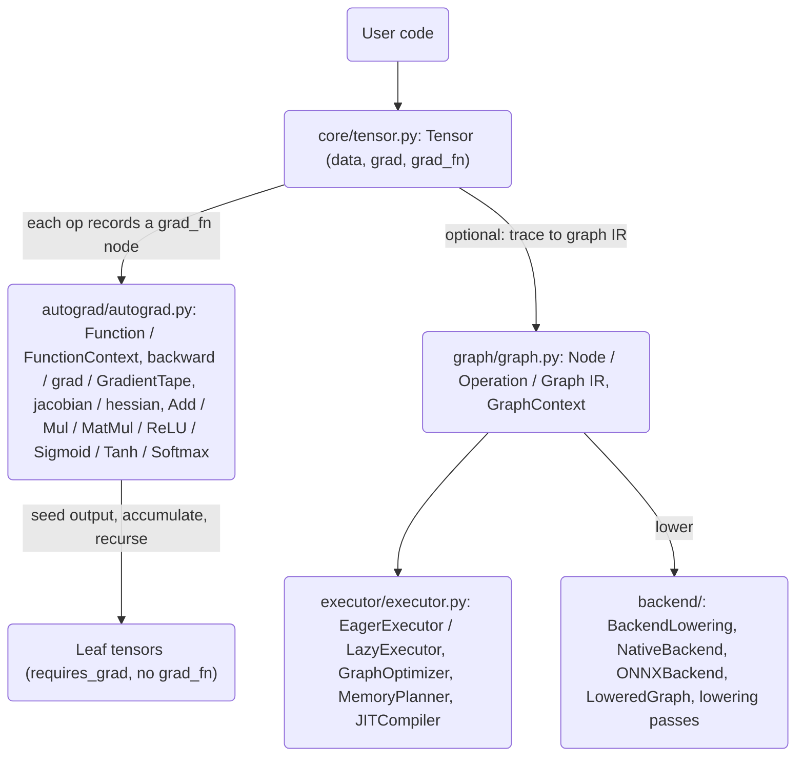

# Dynamic Graph Execution (DynaGraph)

## Overview

DynaGraph is a from-scratch, PyTorch-style framework for **eager (define-by-run) execution
with reverse-mode automatic differentiation**, built on NumPy. The computation graph is
constructed implicitly as operations run: every tensor operation eagerly produces a result
tensor and attaches a `grad_fn` node describing how to push gradients back to its inputs.
Because the graph is built as ordinary Python executes, native control flow (loops,
branches, early returns) participates in differentiation without a separate
graph-definition step. A secondary path lowers a traced graph to an explicit intermediate
representation (IR) with executors, optimization passes, and pluggable backends for
optimization and export.

The goal is pedagogical fidelity to how modern eager autograd engines work — `Tensor`,
`Function`, the tape-free graph of `grad_fn` nodes, and a TensorFlow-style `GradientTape` —
not to compete with PyTorch on performance or operator coverage. The system is deliberately
built around two distinct graph representations that never touch each other's internals,
which makes it a clean teaching vehicle for the contrast between eager and traced execution.

The concepts DynaGraph teaches:

- **Define-by-run autograd.** Each tensor op eagerly computes a NumPy result and links the
  output tensor to a `grad_fn` that remembers the operands. There is no separate tape
  object; the "tape" is just the graph of `grad_fn` links between live tensors, walked in
  reverse from the output during `backward()`.
- **Custom differentiable operators.** A `Function` base class with static
  `forward(ctx, …)` / `backward(ctx, …)` methods and a `FunctionContext` for saving
  intermediates is the standard extension point for adding a new differentiable primitive.
  Built-in activations (`ReLU`, `Sigmoid`, `Tanh`, `Softmax`) and a few ops (`Add`, `Mul`,
  `MatMul`) are implemented this way.
- **Broadcasting-correct gradients.** A backward pass must *un-broadcast* a gradient back
  to the original operand shape by summing over the axes that broadcasting expanded. Getting
  this right is the subtle heart of a correct autograd engine and is factored into a shared
  `_unbroadcast` helper.
- **Gradient accumulation.** `.grad` accumulates across every path that reaches a tensor, so
  a value reused across loop iterations or shared between subexpressions sums its incoming
  gradients — exactly what reverse mode requires.
- **Two execution models.** Eager execution for debuggability and dynamic control flow,
  plus an explicit graph IR with topological execution, optimization passes (dead-code
  elimination, constant folding, common-subexpression elimination, fusion), memory planning,
  and backend lowering to native NumPy and an ONNX export scaffold.

### Goals and non-goals

**Goals**

- An eager `Tensor` backed by NumPy `float32`, with `requires_grad`, operator overloading
  (`+ - * / @ **`, unary `-`, indexing) plus reductions (`sum`, `mean`, `max`, `min`) and
  shape ops (`view`/`reshape`, `transpose`, `.T`).
- Correct reverse-mode autodiff through dynamic Python control flow.
- A `Function` base class for custom differentiable ops (static `forward`/`backward` plus a
  `FunctionContext` that saves operand data and named values).
- Module-level gradient entry points (`backward`, `grad`) and a `GradientTape`, plus
  `jacobian` (one-hot backward passes) and `hessian` (finite differences of the gradient).
- A separate graph/executor/backend layer: an explicit `Node`/`Operation`/`Graph` IR,
  eager and lazy executors, a `GraphOptimizer` with several passes, a memory planner, a
  JIT compiler that emits Python source, and a `BackendLowering` interface with a native
  NumPy backend and an ONNX export backend.

**Non-goals**

- Higher-order automatic differentiation (double backprop). Gradients are returned as NumPy
  arrays, not as re-traced tensors, so second derivatives come from finite-differencing the
  first-order gradient rather than differentiating the backward graph (see *Autograd design
  notes* below and the `hessian` discussion).
- GPU execution. Storage is NumPy `float32` on the CPU; there is no device abstraction on
  the eager path.
- Full ONNX operator coverage or an in-process ONNX runtime. The ONNX backend builds a graph
  representation and can export to a `.onnx` file (given the `onnx` package), but its
  `execute()` raises `NotImplementedError`.

## Architecture



There are two graphs in the system, kept deliberately separate:

1. **The implicit eager graph.** As tensor operations run, each result tensor stores a
   `_grad_fn` pointing at a `GradFunction` (for built-in tensor ops) or a `FunctionGradient`
   (for custom `Function` ops) that knows the operand tensors and how to compute their
   gradients. This graph exists only as the `_grad_fn` links between live tensors; there is
   no separate tape object and no explicit node table. `Tensor.backward()` traverses it by
   recursion. This is the path exercised by the public `Tensor`, `backward`, `grad`,
   `GradientTape`, `jacobian`, and `hessian` APIs.
2. **The explicit graph IR.** `graph/graph.py` defines `Node`/`Operation`/`Graph` for the
   trace, optimize, and export path. `GraphContext` records operations into a `Graph` while
   a function runs; `Executor`s (`executor/executor.py`) run a graph in topological order;
   and backends (`backend/`) lower a graph to a `LoweredGraph` of `TensorSpec`s and
   `LoweredNode`s, then emit executable code (native) or a portable format (ONNX).

The package re-exports the public surface from `dynagraph/__init__.py`, so
`from dynagraph import Tensor, grad, backward, GradientTape, Function` works directly. The
built-in ops (`ReLU`, `Sigmoid`, `Tanh`, `Softmax`, `Add`, `Mul`, `MatMul`) and the
differentiation helpers (`jacobian`, `hessian`, `FunctionContext`) live under
`dynagraph.autograd`.

### Layer responsibilities

| Layer | Module | Responsibility |
|-------|--------|----------------|
| Tensor | `core/tensor.py` | NumPy `float32` storage, operator overloads, reductions/shape ops, the `_grad_fn` tape, `backward`, gradient-mode context managers, built-in `GradFunction` backward nodes, `_unbroadcast` |
| Autograd | `autograd/autograd.py` | `Function`/`FunctionContext`/`FunctionGradient`, `backward`/`grad`, `GradientTape`, `jacobian`/`hessian`, built-in `Function` ops, JIT tracing |
| Graph IR | `graph/graph.py` | `Node`/`InputNode`/`OutputNode`/`OperationNode`, `Operation`, `Graph` (topo sort, subgraph, cycle check), `GraphContext` recorder, `trace_graph` |
| Executor | `executor/executor.py` | `Executor` ABC, `EagerExecutor`, `LazyExecutor`, `GraphOptimizer` + passes, `MemoryPlanner`, `JITCompiler` |
| Backend | `backend/lowering.py`, `native.py`, `onnx_backend.py`, `passes.py` | `BackendLowering` ABC, `DataType`/`MemoryLayout`/`TensorSpec`/`LoweredNode`/`LoweredGraph`/`LoweringContext`, `NativeBackend`, `ONNXBackend`, lowering passes |

### Why two graphs

The separation is a deliberate teaching device. The eager graph is optimized for *writing
and debugging* models: it is built implicitly by ordinary Python, so a `for` loop over a
variable number of steps, an `if` that selects one of two subexpressions, or an early
`return` all produce exactly the graph that ran, and differentiating that graph
differentiates through the control flow that actually executed. Nothing needs to be declared
ahead of time, and a value can be inspected (`print`, `.numpy()`) at any point because it is
a concrete NumPy array.

The explicit IR is optimized for *transforming and shipping* a computation: once a function
has been traced into a `Graph`, it becomes data that passes can rewrite (dead-code
elimination, constant folding, CSE, fusion), that a planner can allocate memory for, that a
`JITCompiler` can emit source for, and that a backend can lower to native NumPy source or an
ONNX proto. Nothing on this path calls back into the eager tensor engine; the two graphs
share concepts (nodes, ops, topological order) but not code, which keeps each one small and
independently testable.

## Core Components

### Tensor (`core/tensor.py`)

`Tensor` wraps a NumPy array cast to `float32` (unless an explicit `dtype` is supplied). It
carries:

- `data` — the NumPy array (the storage).
- `requires_grad` — whether this tensor participates in autodiff; the constructor ANDs the
  requested flag with the current global grad-enabled state, so a tensor created inside
  `no_grad()` never tracks gradients.
- `grad` — an optional NumPy array (not a tensor), initially `None`, holding the accumulated
  gradient. Because it is a plain array, there is no higher-order autodiff.
- `_grad_fn` — the backward node that produced this tensor (`None` for leaves).
- `_is_leaf` — flipped to `False` when a `grad_fn` is attached.

Gradient tracking is gated by a **thread-local** flag (`_grad_state`) toggled through
`no_grad()` / `enable_grad()` / `set_grad_enabled(mode)` / `is_grad_enabled()`. Using
thread-local state means concurrent threads can independently enable or disable tracking.

Operator overloads delegate to module-level functions (`add`, `sub`, `mul`, `div`, `neg`,
`pow`, `matmul`) that compute the NumPy result, set `requires_grad` on the output when any
operand requires grad *and* grad is enabled, and attach the appropriate `GradFunction`. The
reflected operators (`__radd__`, `__rmul__`, etc.) let a tensor sit on either side of an
operation with a scalar or array. `__getitem__` records a `GetItemBackward` so slicing is
differentiable. Reductions (`sum`, `mean`, `max`, `min`) and shape ops (`view`, `reshape`,
`transpose`, `.T`, `clone`, `contiguous`) each attach their own backward node.

`backward` is the reverse-mode driver:

```python
def backward(self, grad_output: Optional[np.ndarray] = None):
    if not self.requires_grad:
        return
    if grad_output is None:
        if self.size != 1:
            raise RuntimeError("grad_output required for non-scalar tensors")
        grad_output = np.ones_like(self.data)

    # Accumulate gradient into this tensor
    if self.grad is None:
        self.grad = grad_output.copy()
    else:
        self.grad = self.grad + grad_output

    # Propagate to inputs
    if self._grad_fn is not None:
        self._grad_fn.backward(grad_output)
```

Two properties are load-bearing. First, a scalar output can be seeded with an implicit
gradient of ones, while a non-scalar output *must* be given an explicit `grad_output` (the
vector for the vector-Jacobian product) or `backward` raises. Second, gradients
**accumulate**: a node reached along several paths sums its incoming gradients, which is
exactly what reverse mode requires for shared subexpressions and for control flow that
reuses a tensor across iterations. The corollary is that callers must `zero_grad()` between
independent backward passes; the `grad()` helper does this for its inputs automatically.

Utility methods: `detach` (returns a grad-free copy), `numpy` (refuses on a grad-tracking
tensor, directing the caller to `detach()`), `item`, `zero_grad` (sets `grad = None`),
`clone`/`contiguous` (differentiable copies via `CloneBackward`), and the shape ops.
`Parameter` is a `Tensor` subclass whose constructor defaults `requires_grad=True`, for
model weights.

**Dynamic control flow.** Because the graph is built as Python runs, a construct like
`acc = Tensor(0.0, requires_grad=False); for xi in xs: acc = acc + xi * w` records a chain of
`AddBackward`/`MulBackward` nodes whose *length depends on the runtime data*. When `w` is
used in every iteration, each iteration's `MulBackward` propagates a gradient into the same
`w` tensor, and the accumulation rule in `backward` sums them — yielding the correct total
gradient for a weight shared across a data-dependent number of steps. Branches work the same
way: only the taken branch's ops are recorded, so only they are differentiated. This is the
behavior exercised by `test_dynamic_shapes.py` (autograd through loops, branches, and varying
input sizes).

### Gradient functions (`core/tensor.py`)

Each built-in tensor op has a `GradFunction` subclass implementing `backward(grad_output)`,
which computes operand gradients and recursively calls each operand's `.backward(grad)`. The
base class stores `inputs` (the operand tensors) and offers `save_for_backward(*tensors)`,
which stores operand *data* (for ops whose gradient depends on operand values, e.g. `mul`,
`div`, `matmul`, `pow`). Representative cases:

```python
class MatMulBackward(GradFunction):
    def backward(self, grad_output):
        a, b = self.saved_tensors
        if self.inputs[0].requires_grad:
            self.inputs[0].backward(grad_output @ np.swapaxes(b, -2, -1))
        if self.inputs[1].requires_grad:
            self.inputs[1].backward(np.swapaxes(a, -2, -1) @ grad_output)

class SumBackward(GradFunction):
    def backward(self, grad_output):
        if not self.keepdims and self.axis is not None:
            grad_output = np.expand_dims(grad_output, self.axis)
        grad = np.broadcast_to(grad_output, self.original_shape)
        self.inputs[0].backward(grad)
```

The element-wise binary backward passes (`AddBackward`, `SubBackward`, `MulBackward`,
`DivBackward`) each call `_unbroadcast` to reduce a gradient back to the operand's
pre-broadcast shape. The un-broadcast logic first sums away leading axes that broadcasting
added, then collapses any size-1 axes that broadcasting stretched:

```python
def _unbroadcast(grad: np.ndarray, shape: Tuple[int, ...]) -> np.ndarray:
    if grad.shape == shape:
        return grad
    ndim_diff = grad.ndim - len(shape)
    if ndim_diff > 0:
        grad = grad.sum(axis=tuple(range(ndim_diff)))       # drop leading broadcast axes
    for i, (g, s) in enumerate(zip(grad.shape, shape)):
        if s == 1 and g > 1:
            grad = grad.sum(axis=i, keepdims=True)           # collapse stretched size-1 axes
    return grad
```

Other backward nodes:

- `MulBackward` / `DivBackward` use saved operand data: `d(a*b)/da = grad·b`,
  `d(a/b)/da = grad/b`, `d(a/b)/db = -grad·a/b²`.
- `NegBackward` negates the incoming gradient.
- `PowBackward` applies the power rule `n·xⁿ⁻¹` using the saved base.
- `MeanBackward` divides the broadcast gradient by the number of averaged elements.
- `MaxBackward` / `MinBackward` build a mask selecting the extremal elements and split the
  gradient evenly on ties (`mask / mask.sum(...)`), routing gradient only to the arg-extremal
  positions.
- `ViewBackward` / `TransposeBackward` / `TransposeTBackward` invert the shape transform.
- `GetItemBackward` scatters the gradient into a zero array at the indexed positions so
  slicing is differentiable.
- `CloneBackward` passes the gradient through a copy.

### Function, FunctionContext, FunctionGradient (`autograd/autograd.py`)

`Function` is the extension point for custom differentiable ops. A subclass implements static
`forward(ctx, *args)` and `backward(ctx, *grad_outputs)`. `Function.apply` runs the forward,
then — if grad is enabled and any input tensor requires grad — wires a `FunctionGradient`
onto the output(s):

```python
class Function:
    @classmethod
    def apply(cls, *args, **kwargs):
        ctx = FunctionContext()
        outputs = cls.forward(ctx, *args, **kwargs)
        if is_grad_enabled():
            tensors = [a for a in args if isinstance(a, Tensor) and a.requires_grad]
            if tensors:
                grad_fn = FunctionGradient(cls, ctx, tensors)
                if isinstance(outputs, tuple):
                    for out in outputs:
                        if isinstance(out, Tensor):
                            out._set_grad_fn(grad_fn)
                elif isinstance(outputs, Tensor):
                    outputs._set_grad_fn(grad_fn)
        return outputs
```

`FunctionContext` carries:

- `save_for_backward(*tensors)` — stores operand *data* (unwrapping `Tensor` to `.data`).
- `save_value(name, value)` / `get_value(name)` — arbitrary named values, used by
  activations to cache their forward output for reuse in backward.
- `needs_input_grad` — a per-input flag list.

`FunctionGradient.backward(grad_output)` calls the subclass's static `backward`, normalizes
the result to a tuple, and propagates each returned gradient into the matching input tensor
(skipping `None` gradients and inputs that don't require grad).

Built-in `Function`s and their backward math:

- `Add` — returns the incoming gradient to both operands, each `_unbroadcast`-ed.
- `Mul` — `grad·b` and `grad·a` from saved operand data, un-broadcast.
- `MatMul` — the matrix chain rule via `np.swapaxes(..., -2, -1)`.
- `ReLU` — saves the input, returns `grad·(x > 0)`.
- `Sigmoid` — saves the output `s`, returns `grad·s·(1 − s)`.
- `Tanh` — saves the output `t`, returns `grad·(1 − t²)`.
- `Softmax` — saves the output `p` and axis, returns
  `p·(grad − (grad·p).sum(axis, keepdims=True))`.

Activations are invoked as `ReLU.apply(x)`, not as tensor methods — they are `Function`
classes, so the standard call pattern is `apply`.

### Gradient entry points (`autograd/autograd.py`)

- **`backward(tensors, grad_tensors=None, retain_graph=False, create_graph=False)`** seeds
  and runs backward for one or more output tensors. When `grad_tensors` is `None`, each seed
  defaults to `np.ones_like(t.data)`. It normalizes both single-tensor and list inputs.
- **`grad(outputs, inputs, grad_outputs=None, …, allow_unused=False)`** zeroes each input's
  grad, runs `backward`, then collects `inp.grad` for each input. If an input has no gradient
  (was unused), it raises `RuntimeError` unless `allow_unused=True`, in which case it returns
  a zero array. Returns a single array for a single input, else a list.
- **`GradientTape`** is a TensorFlow-style context manager. `watch(t)` marks a tensor for
  differentiation (adds its id to the watched set and sets `requires_grad = True`);
  `gradient(target, sources, output_gradients=None)` defers to `grad`, passing
  `retain_graph=self.persistent`; `jacobian` / `batch_jacobian` defer to the module-level
  functions (`batch_jacobian` loops over the batch dimension and stacks per-sample
  Jacobians). A non-persistent tape clears its recorded tape on `__exit__`.

### Jacobian and Hessian (`autograd/autograd.py`)

`jacobian(output, input)` builds the full Jacobian `dy/dx` by seeding a one-hot gradient at
each scalar component of the output and running a backward pass, reading one row of the
Jacobian per pass. It reuses the existing computation graph rather than recomputing the
forward pass:

```python
def jacobian(output, input):
    n_out = output.data.size
    input_size = input.data.size
    jac = np.zeros((n_out, input_size))
    for i in range(n_out):
        grad_output = np.zeros_like(output.data)
        grad_output.flat[i] = 1.0        # one-hot selects the i-th output component
        input.zero_grad()                # clear so we read a clean row
        output.backward(grad_output)
        if input.grad is not None:
            jac[i, :] = np.asarray(input.grad).reshape(-1)
    return jac.reshape(*output.shape, *input.shape)
```

Its cost is `O(output.size)` backward passes, and the returned array is reshaped to
`(*output.shape, *input.shape)`.

`hessian(output, input, func)` cannot read a second derivative from a static graph, because
this eager engine has no double backprop (gradients are plain arrays, not tensors). It
therefore *requires* a `func` callable that recomputes the scalar output from a fresh input
tensor, and forms the Hessian by central finite differences of the reverse-mode gradient:

```
H[:, j] ≈ (∇f(x + eps·e_j) − ∇f(x − eps·e_j)) / (2·eps)
```

The step size is `eps = 1e-2`, chosen to balance truncation error against `float32`
round-off (a smaller step gets quantized away by `float32`), giving ≈1e-3–1e-4 accuracy. The
result is symmetrized (`0.5·(H + Hᵀ)`) to cancel finite-difference asymmetry and reshaped to
`(*input.shape, *input.shape)`. Calling `hessian` with `func=None` raises
`NotImplementedError` with a usage hint rather than returning a misleading zero matrix; a
non-scalar `output` raises `ValueError`.

### JIT tracing (`autograd/autograd.py`)

`jit_trace` is a decorator (usable bare or with `sample_inputs=...`) that returns a
`TracedFunction` or a `LazyTracedFunction`. `JITTracer.trace(func, *sample_inputs)` clones
the sample inputs into fresh traced tensors, runs `func` to capture outputs, and builds a
`traced_graph` dict `{'inputs': n, 'outputs': m, 'ops': [...]}`. `TracedFunction` caches by a
key derived from input shapes and dtypes (`_make_cache_key`), so a call with a new input
configuration compiles a fresh entry. `trace_graph(func, *args)` returns just the traced
graph dict, which the backends can lower. In the current implementation the "compiled"
function produced by `JITTracer._compile` wraps the original function rather than emitting an
optimized kernel — the tracing and shape-caching machinery is real, the optimized codegen on
this path is not.

### Graph IR (`graph/graph.py`)

The explicit IR is the substrate for the trace/optimize/export path, distinct from the
implicit eager graph. `Node` is a dataclass with an integer `id`, a `name`, `inputs`/
`outputs` node lists, and an `attrs` dict; it hashes and compares by `id`.
`InputNode`/`OutputNode`/`OperationNode` specialize it — the input node adds `shape`/`dtype`,
and the operation node adds an `op_type` string plus optional `compute_fn` and `grad_fn`
callables. `Operation` is a lightweight op descriptor.

`Graph` holds a node table keyed by id, the input/output lists, and a thread-safe id
counter. It supports:

- `add_input` / `add_output` / `add_operation` — build the graph, wiring `inputs`/`outputs`
  cross-links between nodes.
- `topological_sort` — Kahn's algorithm over in-degrees; raises `RuntimeError("Graph
  contains cycles")` if not all nodes are ordered.
- `reverse_topological_sort` — the reverse order, for backward passes.
- `subgraph(output_nodes)` — extracts the sub-DAG reachable from the given outputs.
- `num_nodes` / `num_operations`.

`GraphContext` is a thread-safe, stack-based context manager that records operations into a
`Graph` while a function runs. It maps live tensor object ids to graph nodes
(`_tensor_to_node`), so `add_operation` can resolve each operand tensor to its producing
node (creating an input node for any unregistered tensor). The module-level `trace_graph`
helper registers arguments as inputs, runs the function inside a `GraphContext`, registers
the result(s) as outputs, and returns `(graph, outputs)`.

### Executors and optimizer (`executor/executor.py`)

`Executor` is an ABC with `execute(inputs: Dict[str, np.ndarray]) -> Dict[str, np.ndarray]`.

`EagerExecutor` runs the graph in topological order, caching each node's value by id. It
binds `InputNode`s from the input dict (raising `ValueError` on a missing input), dispatches
`OperationNode`s through their `compute_fn` if present, or otherwise through an
`_execute_builtin` dispatch that implements: `add`, `sub`, `mul`, `div`, `matmul`, `relu`,
`sigmoid`, `tanh`, `softmax`, `sum`, `mean`, `reshape`, `transpose`, `concat`, `split`,
`gather`, and `identity` (raising `NotImplementedError` on an unknown op). `OutputNode`s pass
their input value through.

`LazyExecutor` first `compile`s: it optionally runs the `GraphOptimizer` over the graph,
then builds a flat execution plan (the operation nodes in topological order), and finally
executes by delegating to an `EagerExecutor` over the compiled graph. It also exposes a
`benchmark(inputs, iterations)` that warms up and reports mean/std/min/max milliseconds.

`GraphOptimizer` applies a pipeline of passes, each wrapped in a try/except so a failing
pass logs a warning and is skipped rather than aborting compilation:

- **`DeadCodePass`** — keeps only nodes reachable backward from the outputs.
- **`ConstantFoldingPass`** — evaluates operation nodes whose inputs are all known constants
  at compile time (via their `compute_fn`) and replaces them with constant input nodes.
- **`CommonSubexpressionPass`** — deduplicates operation nodes with the same
  `(op_type, input_ids, attrs)` key, reusing the first occurrence.
- **`FusionPass`** — fuses adjacent op pairs against a pattern table
  (`matmul→add ⇒ matmul_bias`, `matmul→relu ⇒ matmul_relu`, `add→relu ⇒ add_relu`,
  `conv→bn ⇒ conv_bn`, `conv→relu ⇒ conv_relu`).

Two more executor-layer utilities exist: `MemoryPlanner` (a simple linear allocator that
assigns byte offsets to node outputs and reports total memory) and `JITCompiler` (generates
Python source for a graph, `exec`s it, and caches the compiled function by a structural graph
hash) — the latter demonstrates source-emitting compilation for a subset of ops
(`add`, `mul`, `matmul`, `relu`, plus a pass-through fallback).

### Backends (`backend/`)

`backend/lowering.py` defines the lowering framework:

- `DataType` — an enum over `FLOAT32/64/16`, `BFLOAT16`, `INT8/16/32/64`, `UINT8`, `BOOL`,
  with `from_numpy`/`to_numpy` conversions.
- `MemoryLayout` — `ROW_MAJOR`, `COLUMN_MAJOR`, `BLOCKED`, `CHANNELS_LAST`.
- `TensorSpec` — name, shape, dtype, layout, device, constant flag/value, plus `size` and
  `nbytes` properties.
- `OpMapping` / `LoweredNode` / `LoweredGraph` — the lowered IR. `LoweredGraph` supports
  `add_input`/`add_output`/`add_node`/`add_constant`, `topological_sort` (over tensor-name
  dependencies), and `to_dict`.
- `LoweringContext` — carries the graph under construction, a tensor map, unique-name
  generators, and target dtype/layout/optimization level.
- `LoweringPass` (ABC) and `BackendLowering` (ABC). `BackendLowering.lower(graph)` runs an
  initial lowering then applies registered passes; `validate` checks that every op and dtype
  is supported.

`NativeBackend` registers NumPy code-generating lowerings for a broad op set — element-wise
(`add`, `sub`, `mul`, `div`, `neg`, `pow`, `sqrt`, `exp`, `log`, `abs`), activations (`relu`,
`sigmoid`, `tanh`, `softmax`, `gelu`), reductions (`sum`, `mean`, `max`, `min`), matrix ops
(`matmul`, `transpose`, `reshape`), and comparisons (`equal`, `greater`, `less`). Each
lowering returns a Python source line; `CompiledNativeGraph` assembles these into an
`execute(inputs)` function, `exec`s it, and runs it directly (with a `benchmark` helper).

`ONNXBackend` maps DynaGraph op types to ONNX op names (`add ⇒ Add`, `matmul ⇒ MatMul`,
`sum ⇒ ReduceSum`, …) and builds an `ONNXGraph` of `ONNXNode`s with converted attributes.
`export_onnx(graph, filepath)` builds a real ONNX proto via the `onnx` helper API and saves
it (requires the `onnx` package); `to_onnx_dict` returns an inspectable dict without `onnx`.
Its `execute()` raises `NotImplementedError` — the in-process ONNX inference path is
incomplete by design; export-then-run-with-onnxruntime is the intended flow.

`backend/passes.py` provides `LoweringPass` implementations over the `LoweredGraph`:
`DtypeCastPass` (insert casts for a target dtype), `MemoryLayoutPass` (insert layout
transforms), `OpFusionPass` (fuse `matmul+add ⇒ gemm`, `matmul+relu`, `add+relu`,
`conv+bn+relu`), `ConstantPropagationPass` (fold ops with all-constant inputs), and
`DeadNodeEliminationPass` (drop nodes whose outputs are unused).

The native lowering flow, end to end: `BackendLowering.lower(graph)` builds a
`LoweringContext`, calls `_initial_lowering` (which handles both the traced-graph dict from
`jit_trace` and a `Graph` object with `.nodes`, producing a `LoweredGraph` of `LoweredNode`s
and `TensorSpec`s), then runs any registered `LoweringPass`es. `NativeBackend.compile`
wraps the result in a `CompiledNativeGraph`, whose `_generate_code` walks the lowered graph
in topological order, unpacks the named inputs, emits one NumPy source line per node from the
registered lowering functions (e.g. `_lower_matmul` emits `out = np.matmul(a, b)`), and packs
the named outputs into a dict. That source is `exec`ed once into an `execute(inputs)`
closure; `run(inputs)` then invokes it directly. The `_lower_softmax` lowering shows the
numerically stable form (subtract the row max before `exp`), matching the eager `Softmax`
forward. Because lowerings are keyed by op type in an `op_registry`, adding a backend op is a
matter of registering one more `_lower_*` function; unknown ops fall back to a commented
placeholder line rather than crashing codegen.

## Data Structures

### Core tensor and gradient types (`core/tensor.py`)

```python
class Tensor:
    data: np.ndarray            # float32 storage
    requires_grad: bool         # ANDed with global grad-enabled at construction
    grad: Optional[np.ndarray]  # accumulated gradient as a NumPy array (no double backprop)
    _grad_fn: Optional[GradFunction]
    _is_leaf: bool

    def backward(self, grad_output: Optional[np.ndarray] = None) -> None: ...
    def sum(self, axis=None, keepdims=False) -> "Tensor": ...   # also mean / max / min
    def view(self, *shape) -> "Tensor": ...                     # also reshape / transpose / .T
    def zero_grad(self) -> None: ...
    def detach(self) -> "Tensor": ...

class Parameter(Tensor):        # constructor defaults requires_grad=True
    ...

class GradFunction:             # base for built-in backward nodes
    inputs: List[Tensor]
    saved_tensors: List[np.ndarray]
    def save_for_backward(self, *tensors) -> None: ...
    def backward(self, grad_output: np.ndarray) -> None: ...    # propagates to self.inputs
```

### Custom-function context (`autograd/autograd.py`)

```python
class FunctionContext:
    saved_tensors: List[np.ndarray]     # operand data saved via save_for_backward
    saved_values: Dict[str, Any]        # named values (e.g. activation outputs)
    needs_input_grad: List[bool]

class FunctionGradient:
    func_cls: type                      # the Function subclass
    ctx: FunctionContext
    inputs: List[Tensor]                # tensors that require grad
```

### Explicit graph IR (`graph/graph.py`)

```python
@dataclass
class Node:
    id: int
    name: str
    inputs: List["Node"]
    outputs: List["Node"]
    attrs: Dict[str, Any]

@dataclass
class InputNode(Node):
    shape: Tuple[int, ...] = ()
    dtype: str = "float32"

@dataclass
class OperationNode(Node):
    op_type: str = "unknown"
    compute_fn: Optional[Callable] = None
    grad_fn: Optional[Callable] = None
```

### Lowering types (`backend/lowering.py`)

```python
class DataType(Enum):
    FLOAT32; FLOAT64; FLOAT16; BFLOAT16; INT8; INT16; INT32; INT64; UINT8; BOOL

class MemoryLayout(Enum):
    ROW_MAJOR; COLUMN_MAJOR; BLOCKED; CHANNELS_LAST

@dataclass
class TensorSpec:
    name: str
    shape: Tuple[int, ...]
    dtype: DataType = DataType.FLOAT32
    layout: MemoryLayout = MemoryLayout.ROW_MAJOR
    device: str = "cpu"
    is_constant: bool = False
    constant_value: Optional[np.ndarray] = None
    # size and nbytes are computed properties

@dataclass
class LoweredNode:
    name: str
    op_type: str
    inputs: List[str]
    outputs: List[str]
    attributes: Dict[str, Any]

@dataclass
class LoweredGraph:
    name: str = "graph"
    inputs: List[TensorSpec]
    outputs: List[TensorSpec]
    nodes: List[LoweredNode]
    constants: Dict[str, np.ndarray]
    metadata: Dict[str, Any]
```

## API Design

Public surface re-exported from `dynagraph/__init__.py`:

```
# Core
Tensor, Parameter, no_grad, enable_grad, set_grad_enabled, is_grad_enabled
# Graph
Node, Operation, Graph, GraphContext
# Autograd
Function, backward, grad, GradientTape, jit_trace, trace_graph
# Executor
Executor, EagerExecutor, LazyExecutor, GraphOptimizer, FusionPass, DeadCodePass
# Backend
BackendLowering, NativeBackend, ONNXBackend, LoweredGraph, TensorSpec
```

Built-in ops and differentiation helpers live under `dynagraph.autograd`:

```
Function, backward, grad, GradientTape, jacobian, hessian,
jit_trace, trace_graph, is_tracing, TracedFunction, LazyTracedFunction
```

The activation `Function`s (`ReLU`, `Sigmoid`, `Tanh`, `Softmax`) and op `Function`s
(`Add`, `Mul`, `MatMul`) plus `FunctionContext` are importable from
`dynagraph.autograd.autograd`.

### Key signatures

```python
# --- Tensor ---
Tensor(data, requires_grad=False, dtype=None)
Tensor.backward(grad_output=None) -> None            # scalar seeds ones; non-scalar requires grad_output
Tensor.sum(axis=None, keepdims=False) -> Tensor      # also mean / max / min
Tensor.view(*shape) -> Tensor                        # also reshape / transpose(d0, d1) / .T
Tensor.detach() -> Tensor
Tensor.zero_grad() -> None

# --- Gradient mode ---
no_grad()             # context manager
enable_grad()         # context manager
set_grad_enabled(mode) -> bool                       # returns previous state
is_grad_enabled() -> bool

# --- Custom ops ---
Function.apply(*args, **kwargs)                      # e.g. ReLU.apply(x)

# --- Entry points ---
backward(tensors, grad_tensors=None, retain_graph=False, create_graph=False)
grad(outputs, inputs, grad_outputs=None, retain_graph=False,
     create_graph=False, allow_unused=False) -> ndarray | list

GradientTape(persistent=False, watch_accessed_variables=True)
  .watch(tensor)
  .gradient(target, sources, output_gradients=None) -> ndarray | list
  .jacobian(target, sources) -> ndarray
  .batch_jacobian(target, sources) -> ndarray

jacobian(output, input) -> ndarray                   # shape (*output.shape, *input.shape)
hessian(output, input, func) -> ndarray              # central finite differences; func required

# --- Tracing / IR / backends ---
jit_trace(func=None, *, sample_inputs=None)          # decorator / lazy tracer
trace_graph(func, *args) -> dict                     # traced-graph dict
Graph(name="graph"); Graph.topological_sort() -> List[Node]
EagerExecutor(graph).execute(inputs) -> dict
LazyExecutor(graph, optimize=True).execute(inputs) -> dict
NativeBackend().lower(graph) -> LoweredGraph
NativeBackend().compile(lowered).run(inputs) -> dict
ONNXBackend().export_onnx(lowered, filepath)         # requires the onnx package
```

### Usage patterns

Eager forward + backward:

```python
from dynagraph import Tensor

x = Tensor([[1.0, 2.0], [3.0, 4.0]], requires_grad=True)
w = Tensor([[0.1, 0.2], [0.3, 0.4]], requires_grad=True)
z = (x @ w).sum()
z.backward()                      # walks the grad_fn graph to the leaves
print(x.grad, w.grad)             # NumPy arrays
```

Custom / built-in `Function`:

```python
from dynagraph import Tensor
from dynagraph.autograd import ReLU

x = Tensor([-1.0, 0.5, 2.0], requires_grad=True)
ReLU.apply(x).sum().backward()
print(x.grad)                     # 0 where x <= 0, 1 where x > 0
```

`grad` and `GradientTape`:

```python
from dynagraph import Tensor, grad, GradientTape

x = Tensor([3.0], requires_grad=True)
print(grad((x * x).sum(), x))     # dy/dx = 2x = 6

with GradientTape() as tape:
    tape.watch(x)
    y = (x * x).sum()
print(tape.gradient(y, x))        # same result via the tape API
```

## Performance

DynaGraph optimizes for clarity over speed, so it ships no committed benchmark numbers; the
relevant cost characteristics follow directly from the design:

- **Reverse mode is one pass.** A single `backward()` costs roughly one forward pass and
  yields the gradient with respect to all inputs of a scalar output (or a seeded
  vector-Jacobian product for a non-scalar output).
- **Gradient accumulation.** Because `.grad` accumulates, callers must `zero_grad()` between
  independent backward passes; `grad()` zeroes its inputs automatically. This is also what
  makes control flow that reuses a tensor differentiate correctly.
- **Jacobian cost.** `jacobian` runs `output.size` backward passes, reusing the existing
  graph each time — no forward recomputation. Cost scales with the number of output
  components, which is why reverse mode is efficient for few-output/many-input functions and
  the per-output loop is acceptable only for small outputs.
- **Hessian cost.** `hessian` runs `2 · input.size` forward+backward evaluations of `func`
  (central differences), and is accurate to ≈1e-3–1e-4 in `float32` with `eps = 1e-2`.
- **No fused kernels on the eager path.** Both the eager engine and the `EagerExecutor`
  dispatch op-by-op to NumPy; there is no runtime kernel fusion on the eager path (the
  `FusionPass`/`OpFusionPass` operate on the explicit IR / `LoweredGraph`, not the eager
  tensor graph) and no GPU offload.
- **Recursion depth.** The eager backward pass is recursive (`grad_fn.backward` calls each
  operand's `backward`), so extremely deep graphs are bounded by Python's recursion limit
  rather than an explicit worklist.
- **Lazy path optimization.** `LazyExecutor` runs `DeadCodePass`, `ConstantFoldingPass`,
  `CommonSubexpressionPass`, and `FusionPass` before executing, so redundant and dead
  computation is removed from the compiled graph; its `benchmark` helper reports
  mean/std/min/max latency across timed iterations after a warmup.

## Testing Strategy

The **171-test** `pytest` suite under `tests/` (with shared fixtures in `conftest.py`) is
the correctness contract. It requires only NumPy — no external services — and is grouped by
subsystem:

- **`test_autograd.py`** (54 tests) — the largest suite, covering reverse-mode correctness
  for every op and built-in `Function` (`TestBasicGradients`, `TestMatrixGradients`,
  `TestReductionGradients`, `TestActivationGradients`), broadcast un-reduction
  (`TestBroadcastingGradients`), the chain rule (`TestChainRule`), the `GradientTape` API
  (`TestGradientTape`), the grad-enabled context managers (`TestGradientContext`), the
  `GradFunction` base and custom `Function` extension (`TestGradFunction`,
  `TestCustomFunction`), edge cases (`TestEdgeCases`), and `TestJacobian` / `TestHessian`.
  Gradients are checked numerically against finite differences.
- **`test_dynamic_shapes.py`** (39 tests) — autograd through dynamic control flow and
  varying input shapes, dynamic graph construction, broadcasting, executor behavior on
  dynamic shapes, dynamic-shape gradients, varying input sizes, and shape-error paths.
- **`test_graph_optimization.py`** (25 tests) — the explicit-IR optimization passes:
  dead-code elimination, common-subexpression elimination, the fusion pass and its pattern
  table, the `GraphOptimizer` pipeline, and `LazyExecutor` optimization — verifying each
  preserves semantics.
- **`test_backend.py`** (28 tests) — `DataType` conversions, `TensorSpec`, `LoweredGraph`,
  `LoweringContext`, the `NativeBackend` lowering/compilation/execution, the `ONNXBackend`
  op-mapping and export scaffold (including its unimplemented `execute()`), the lowering
  passes, and `OpMapping`.
- **`test_jit_trace.py`** (10 tests) — `jit_trace` / `trace_graph` capture, `TracedFunction`
  and its input-shape/dtype cache key, and `LazyTracedFunction` first-call tracing.
- **`test_memory_optimization.py`** (15 tests) — `MemoryPlanner` allocation, memory reuse
  and efficiency, in-place operations, and planner integration.

Notable edge cases under test: non-scalar `backward` requires an explicit `grad_output` (and
raises otherwise), scalar reductions, broadcasting in every binary op, the `hessian`-without-
`func` `NotImplementedError` path, unused-input handling in `grad` (`allow_unused`), and
cycle detection in the graph topological sort.

Run the suite with:

```bash
cd 38-dynamic-graph-execution
pip install -e ".[dev]"
pytest tests/ -v
```

## References

- Automatic differentiation in machine learning: reverse-mode (backpropagation) as the
  vector-Jacobian product, and the accumulation rule for shared subexpressions.
- PyTorch autograd: `Tensor`, `Function`/`Context`, the `grad_fn` graph, and
  `torch.autograd.grad`, which this design mirrors closely.
- TensorFlow `GradientTape`: the `watch` / `gradient` / `jacobian` / `batch_jacobian` tape
  API.
- Finite-difference approximation of derivatives: central differences and step-size choice
  under floating-point round-off (motivating the `float32` Hessian step of `1e-2`).
- Graph-level compiler optimizations: dead-code elimination, constant folding, common
  subexpression elimination, and operator fusion (e.g. matmul+bias GEMM,
  conv+batchnorm+relu).
- ONNX: the Open Neural Network Exchange graph format, op set, and the `onnx` Python helper
  API used for export.
