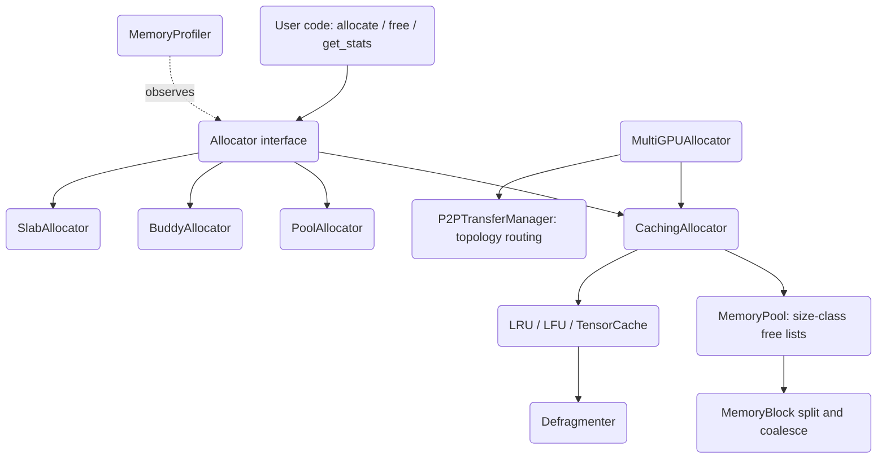

# GPU Memory Manager

A CUDA-style GPU memory management library built from scratch in pure Python. It implements
caching, pooling, buddy, and slab allocators, an LRU/LFU memory cache with defragmentation,
an allocation profiler, and multi-GPU distribution with topology-aware routing. Device memory
is **simulated** with integer addresses, so the whole system runs and is fully tested on CPU
without a GPU.

## Features

- **Four allocator strategies** — caching, pool, buddy, and slab allocators behind a common
  `Allocator` interface (`gpumem.allocator.allocator`).
- **CUDA-style caching allocator** — caches freed blocks for reuse, splits and coalesces
  blocks, isolates allocations per stream, and flushes the cache on OOM (`CachingAllocator`).
- **Memory pool with bucketing** — size-class free lists, block splitting, neighbor
  coalescing, and trimming (`MemoryPool` / `MemoryBlock` in `gpumem.core.memory`).
- **Buddy and slab allocators** — power-of-2 buddy allocation with XOR-buddy coalescing
  (`BuddyAllocator`) and fixed-size object slabs (`SlabAllocator`).
- **Memory caches** — `LRUCache` and `LFUCache` with TTL support, plus a shape/dtype-keyed
  `TensorCache` (`gpumem.cache.cache`).
- **Defragmentation** — compact, best-fit, and incremental strategies with a fragmentation
  ratio metric (`Defragmenter` / `DefragmentStrategy`).
- **Profiler** — allocation traces, size histograms, per-tag and per-device summaries, leak
  detection, snapshots, and a JSON-exportable event timeline (`MemoryProfiler`).
- **Multi-GPU distribution** — load-balanced allocation across simulated GPUs with P2P
  transfer routing, distributed tensors, and ring all-reduce gradient sync
  (`MultiGPUAllocator`, `DistributedTensorManager`, `GradientSynchronizer`).

## Architecture



| Component | Module | Responsibility |
|-----------|--------|----------------|
| Core primitives | `gpumem.core.memory` | `MemoryBlock`, `MemoryPool`, `MemoryConfig`, `MemoryStats`, `DeviceType` |
| Allocators | `gpumem.allocator.allocator` | `CachingAllocator`, `PoolAllocator`, `BuddyAllocator`, `SlabAllocator` |
| Caching | `gpumem.cache.cache` | `LRUCache`, `LFUCache`, `TensorCache`, `Defragmenter` |
| Profiling | `gpumem.profiler.profiler` | `MemoryProfiler`, `AllocationTrace`, `MemorySnapshot`, `MemoryTimeline` |
| Multi-GPU | `gpumem.allocator.advanced` | `MultiGPUAllocator`, `DistributedTensorManager`, `GradientSynchronizer` |

## Quick Start

### Prerequisites

- Python 3.9+
- `numpy` (the only runtime dependency). No GPU or CUDA toolkit is required — device memory
  is simulated, so everything runs on CPU.

### Installation

```bash
pip install -e ".[dev]"
```

### Running

This is a library, not a service. Import it and allocate:

```bash
python -c "from gpumem import CachingAllocator; a = CachingAllocator(); print(a.allocate(1024))"
```

## Usage

Allocators return a `MemoryBlock` (with a simulated `ptr` and `size`), not a raw pointer.

```python
from gpumem import CachingAllocator, MemoryConfig, DeviceType

config = MemoryConfig(device_type=DeviceType.CUDA, device_id=0, max_memory=4 * 1024**3)
allocator = CachingAllocator(config)

block = allocator.allocate(1024 * 1024)        # 1MB; returns a MemoryBlock
print(block.ptr, block.size)

allocator.free(block)                           # freed block is cached for reuse

stats = allocator.get_stats()                   # MemoryStats dataclass
print(stats.num_allocs, stats.peak_allocated)
```

Profiling an allocation workload:

```python
from gpumem import CachingAllocator, MemoryProfiler

allocator = CachingAllocator()
profiler = MemoryProfiler()
profiler.enable()

block = allocator.allocate(10 * 1024 * 1024)
block.tag = "activations"
profiler.record_alloc(block)
profiler.record_free(block)

profiler.print_summary()                        # totals + size histogram
profiler.take_snapshot(tag="after-step")
```

Multi-GPU allocation with load balancing:

```python
from gpumem import MultiGPUAllocator, LoadBalanceStrategy

mgpu = MultiGPUAllocator(num_gpus=4, strategy=LoadBalanceStrategy.LEAST_UTILIZED)
block = mgpu.allocate(64 * 1024 * 1024)         # device chosen automatically
moved = mgpu.transfer(block, target_device=1)   # P2P transfer (simulated)
print(mgpu.get_statistics()["devices"])
```

## What's Real vs Simulated

- **Real:** All allocator logic, data structures, and algorithms execute for real on CPU —
  size-class bucketing, block splitting and coalescing, buddy XOR coalescing, slab management,
  LRU/LFU eviction with TTL, defragmentation, fragmentation-ratio computation, profiler
  tracking and histograms, load-balancing device selection, and Dijkstra-based topology path
  computation. The test suite exercises all of this without a GPU.
- **Simulated / requires no GPU:** Device memory is modeled with monotonically increasing
  integer addresses, not real `cudaMalloc`. There is no CUDA backend — P2P transfers, prefetch,
  stream synchronization, and CPU offload update bookkeeping and sleep for an estimated
  duration rather than moving bytes. Bandwidth and latency figures in the topology model are
  representative constants, not measured.

## Testing

```bash
pytest tests/ -v
```

The suite has 230 tests across allocators, core pool/block mechanics, caching and
defragmentation, profiling, multi-GPU distribution, and thread-safety under concurrent
access. No external services or GPU are required.

## Project Structure

```
39-gpu-memory-manager/
  README.md                       # this file
  pyproject.toml                  # package metadata and dev deps
  src/gpumem/
    core/memory.py                # MemoryBlock, MemoryPool, config, stats
    allocator/allocator.py        # caching, pool, buddy, slab, unified allocators
    allocator/advanced.py         # multi-GPU, P2P, prefetch, offload, distributed tensors
    cache/cache.py                # LRU/LFU/tensor caches, defragmenter
    profiler/profiler.py          # allocation tracing and reporting
  tests/                          # pytest suite (230 tests)
  docs/
    BLUEPRINT.md                  # full architecture and design
    ARCHITECTURE.md               # deeper architecture notes
```

## License

MIT — see [LICENSE](../LICENSE)
