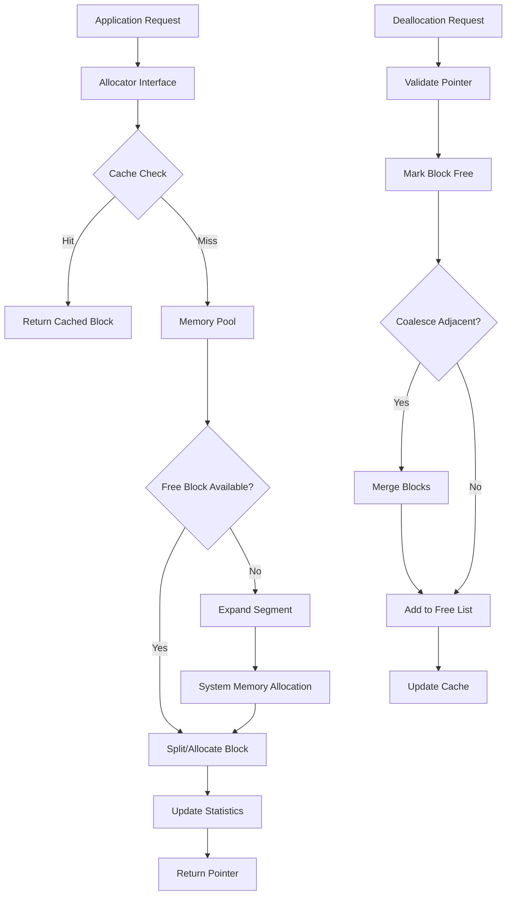

# GPU Memory Manager - Architecture

## Overview

The GPU Memory Manager is a sophisticated memory allocation system designed for efficient GPU memory management. It provides pooling, caching, and stream-ordered allocation with minimal fragmentation and high performance.

## System Components

### 1. Core Memory Layer (`gpumem/core/`)

#### Memory Primitives
- **MemoryBlock**: Basic allocation unit with metadata
- **MemorySegment**: Large contiguous memory regions
- **MemoryPool**: Pre-allocated memory pool management
- **DeviceMemory**: Hardware abstraction layer

#### Configuration
- **MemoryConfig**: System configuration parameters
- **DeviceType**: Enumeration of supported devices (CUDA, ROCm, etc.)
- **MemoryStats**: Runtime statistics tracking

### 2. Allocator Layer (`gpumem/allocator/`)

#### Allocation Strategies
- **PoolAllocator**: Basic pooled allocation
- **BestFitAllocator**: Minimum fragmentation strategy
- **FirstFitAllocator**: Fast allocation strategy
- **CachingAllocator**: LRU cache for freed blocks

#### Stream Management
- **StreamOrderedAllocator**: CUDA stream-aware allocation
- **StreamPool**: Per-stream memory pools
- **EventPool**: Stream event management

### 3. Cache Layer (`gpumem/cache/`)

#### Caching Mechanisms
- **BlockCache**: Recently freed block cache
- **SizeCache**: Size-based caching buckets
- **StreamCache**: Stream-specific caches

### 4. Profiler Layer (`gpumem/profiler/`)

#### Profiling Tools
- **MemoryProfiler**: Allocation profiling
- **FragmentationAnalyzer**: Fragmentation metrics
- **PerformanceMonitor**: Throughput monitoring

## Data Flow Architecture



## Memory Layout

```
GPU Memory Space
├── Segment 0 (256MB)
│   ├── Block 0: [Allocated, 10MB, Stream 1]
│   ├── Block 1: [Free, 50MB]
│   ├── Block 2: [Allocated, 30MB, Stream 2]
│   └── Block 3: [Free, 166MB]
├── Segment 1 (512MB)
│   ├── Block 0: [Allocated, 200MB, Stream 1]
│   ├── Block 1: [Allocated, 150MB, Stream 3]
│   └── Block 2: [Free, 162MB]
└── Segment 2 (1GB)
    └── Block 0: [Free, 1GB]
```

## Allocation Algorithm

### Best-Fit Strategy

```python
def allocate_best_fit(size):
    # 1. Round size to alignment
    aligned_size = round_up(size, alignment)

    # 2. Search cache
    if cached_block = cache.find(aligned_size):
        return cached_block

    # 3. Search free list
    best_block = None
    min_waste = MAX_INT

    for block in free_blocks:
        if block.size >= aligned_size:
            waste = block.size - aligned_size
            if waste < min_waste:
                best_block = block
                min_waste = waste

    # 4. Split if necessary
    if best_block:
        if best_block.size > aligned_size + min_split_size:
            split_block(best_block, aligned_size)
        return best_block

    # 5. Expand pool
    return expand_and_allocate(aligned_size)
```

## Stream Ordering

### Stream-Aware Allocation

```
Stream 0: [Block A] -> [Block C] -> [Block E]
Stream 1: [Block B] -> [Block D]
Stream 2: [Block F]

Timeline:
T0: Stream 0 allocates Block A
T1: Stream 1 allocates Block B
T2: Stream 0 frees Block A (available for Stream 0)
T3: Stream 2 requests memory
    -> Cannot use Block A (different stream)
    -> Allocates new Block F
T4: Stream 0 requests memory
    -> Can reuse Block A (same stream)
```

## Memory Pooling Strategy

### Segment Expansion

```python
class SegmentExpansion:
    def expand(current_size, requested):
        # Exponential growth with cap
        if current_size == 0:
            return max(INITIAL_SEGMENT_SIZE, requested * 2)

        growth_factor = 1.5
        new_size = current_size * growth_factor

        # Apply limits
        new_size = min(new_size, MAX_SEGMENT_SIZE)
        new_size = max(new_size, requested)

        return round_up_power2(new_size)
```

## Fragmentation Management

### Coalescing Algorithm

```python
def coalesce_free_blocks():
    for block in free_blocks:
        # Check adjacent blocks
        if block.next and not block.next.allocated:
            merge(block, block.next)

        if block.prev and not block.prev.allocated:
            merge(block.prev, block)
```

### Defragmentation

```python
def defragment():
    # 1. Identify moveable allocations
    moveable = find_moveable_blocks()

    # 2. Compact allocations
    for block in moveable:
        target = find_better_location(block)
        if target:
            move_block(block, target)

    # 3. Coalesce freed space
    coalesce_free_blocks()
```

## Caching Architecture

### Multi-Level Cache

```
Level 1: Size-exact cache (O(1) lookup)
├── 1KB: [Block1, Block2, ...]
├── 4KB: [Block3, Block4, ...]
└── 16KB: [Block5, Block6, ...]

Level 2: Size-range cache (O(log n) lookup)
├── 1KB-8KB: TreeSet<Block>
├── 8KB-64KB: TreeSet<Block>
└── 64KB+: TreeSet<Block>

Level 3: Stream-specific cache
├── Stream 0: LRU<Block>
├── Stream 1: LRU<Block>
└── Stream 2: LRU<Block>
```

## Performance Optimizations

### Lock-Free Operations

```python
class LockFreeAllocator:
    def allocate(size):
        while True:
            # Atomic read
            free_list = atomic_load(self.free_list)

            # Find suitable block
            block = find_block(free_list, size)
            if not block:
                return expand_pool(size)

            # Atomic compare-and-swap
            if atomic_cas(self.free_list, free_list,
                         remove_block(free_list, block)):
                return block.ptr
            # Retry on conflict
```

### Memory Prefetching

```python
def prefetch_patterns():
    # Analyze allocation patterns
    patterns = analyze_history()

    # Predictive prefetching
    for pattern in patterns:
        if pattern.confidence > THRESHOLD:
            prefetch_size = predict_next_size(pattern)
            preallocate(prefetch_size)
```

## Integration Points

### CUDA Integration

```cpp
// Custom CUDA memory allocator
cudaError_t customMalloc(void** ptr, size_t size) {
    // Call our allocator
    *ptr = allocator->allocate(size);
    return (*ptr != nullptr) ? cudaSuccess : cudaErrorMemoryAllocation;
}

// Register with CUDA
cudaDeviceSetMemPool(device, custom_pool);
```

### PyTorch Integration

```python
class CustomAllocator(torch.cuda.memory.Allocator):
    def malloc(self, size, stream):
        return self.allocator.allocate(size, stream)

    def free(self, ptr):
        self.allocator.deallocate(ptr)

# Set as PyTorch allocator
torch.cuda.memory.set_allocator(CustomAllocator())
```

## Monitoring and Metrics

### Key Performance Indicators

- **Allocation Latency**: Time to allocate memory
- **Fragmentation Ratio**: Free memory / Total free blocks
- **Cache Hit Rate**: Cache hits / Total allocations
- **Memory Utilization**: Allocated / Reserved
- **Peak Memory**: Maximum allocated at any point

### Health Checks

```python
def health_check():
    metrics = {
        'fragmentation': calculate_fragmentation(),
        'largest_free': find_largest_free_block(),
        'allocation_rate': get_allocation_rate(),
        'oom_risk': estimate_oom_probability()
    }

    if metrics['fragmentation'] > 0.5:
        trigger_defragmentation()

    if metrics['oom_risk'] > 0.8:
        trigger_memory_cleanup()

    return metrics
```

## Future Enhancements

1. **Unified Memory Management**: Support for CPU-GPU unified memory
2. **Multi-GPU Pools**: Coordinated allocation across multiple GPUs
3. **Persistent Memory**: Support for persistent memory devices
4. **Machine Learning Optimization**: ML-based allocation prediction
5. **Hardware Offload**: Offload allocation logic to dedicated hardware