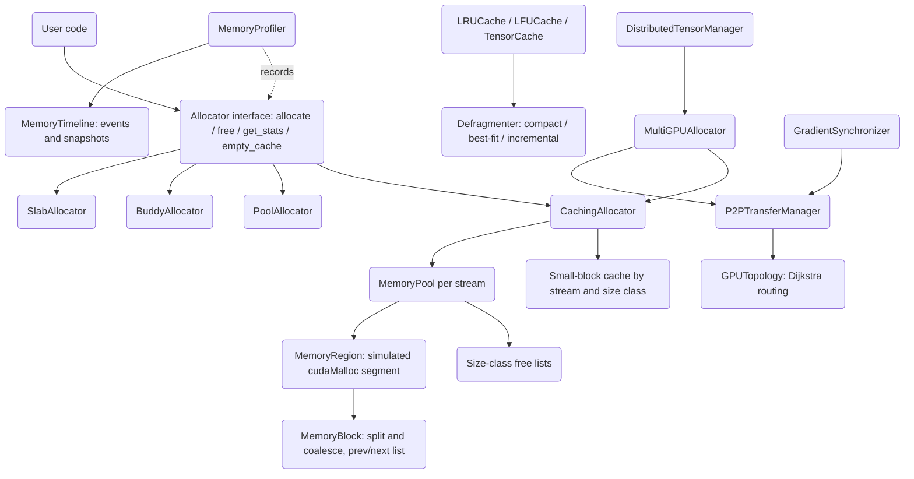

# GPU Memory Manager

## Overview

The GPU Memory Manager is a from-scratch implementation of the data structures and algorithms
that sit between application code and a GPU's device memory. It is written in pure Python and
models device memory with simulated integer addresses, so the entire system — allocation,
caching, defragmentation, profiling, and multi-GPU distribution — runs and is fully tested on
a CPU with no CUDA toolkit installed.

The design teaches the core problems a real GPU allocator (such as PyTorch's
`CUDACachingAllocator`) must solve:

- **Allocation latency.** Real `cudaMalloc`/`cudaFree` calls are expensive and synchronize the
  device. A practical allocator never frees eagerly; it caches freed blocks and reuses them.
  This project reproduces that with a caching allocator over size-class free lists.
- **Fragmentation.** Repeated allocation and freeing of mixed sizes leaves memory full of
  unusable gaps. The manager splits oversized blocks, coalesces adjacent free blocks, and
  offers compacting and incremental defragmentation, plus a fragmentation-ratio metric.
- **Allocation strategy trade-offs.** Different workloads favor different allocators. The
  project implements four — caching, pool, buddy, and slab — behind one interface so they can
  be compared directly.
- **Stream ordering.** GPU work runs on concurrent streams; memory freed on one stream must
  not be reused by another before synchronization. The pool tracks a per-block stream and
  keeps per-stream pools.
- **Multi-GPU systems.** Large models span several devices. The manager adds load-balanced
  allocation across simulated GPUs, topology-aware peer-to-peer transfer routing, distributed
  tensors, and ring all-reduce gradient synchronization.

Scope is deliberately bounded to the *management* layer. There is no real device backend: no
bytes are moved, no kernels run. Pointers are integers handed out by a monotonic counter, and
transfer/prefetch operations update bookkeeping and (optionally) sleep for an estimated
duration. Everything above that line — the allocator logic itself — is real, deterministic,
and exercised by the test suite.

The public surface is re-exported from the top-level `gpumem` package (`src/gpumem/__init__.py`):
the core primitives, the four allocators, the cache and defragmentation types, the profiler,
and the multi-GPU distribution types.

### Design principles

Five principles drive the implementation, each mapped to concrete code:

1. **Lazy deallocation.** `free` never releases the underlying segment; it caches the block.
   Release only happens explicitly via `empty_cache` or `trim`. In the simulation this saves
   nothing measurable, but it is the structural choice that makes a real allocator fast.
2. **Stream isolation.** Blocks carry a `stream`; pools are keyed by stream; `can_merge_with`
   refuses cross-stream merges. This prevents the use-after-free that cross-stream reuse would
   cause on real hardware.
3. **Size bucketing.** Both `MemoryPool` and the small-block cache classify requests into size
   classes so the common case is a list pop rather than a search.
4. **Coalescing.** Adjacent free blocks merge (linked-list neighbors in the pool, XOR buddies in
   the buddy allocator) so external fragmentation does not accumulate.
5. **Graceful pressure handling.** OOM triggers a cache flush and retry rather than an immediate
   failure, and the offloader can spill to host memory when the device fills.

These are the same invariants a production GPU allocator maintains; isolating them in pure
Python makes them inspectable and testable without GPU hardware in the loop.

## Architecture



The system is organized in four layers:

1. **Core primitives** (`gpumem.core.memory`) define the units everything else manipulates:
   `MemoryBlock` (a contiguous span with split/merge/coalesce logic), `MemoryRegion` (a
   simulated `cudaMalloc` segment), `MemoryPool` (size-class free lists plus coalescing),
   and the value types `MemoryConfig`, `MemoryStats`, `DeviceType`, `AllocationRequest`.

2. **Allocators** (`gpumem.allocator.allocator`) implement the `Allocator` abstract base
   class. `CachingAllocator` is the centerpiece and builds on `MemoryPool`; `PoolAllocator`,
   `BuddyAllocator`, and `SlabAllocator` are independent strategies; `UnifiedMemoryAllocator`
   composes two caching allocators to model CPU/GPU unified memory.

3. **Cross-cutting services** add caching (`gpumem.cache.cache`) and profiling
   (`gpumem.profiler.profiler`). These observe or wrap allocations rather than owning the
   address space.

4. **Multi-GPU distribution** (`gpumem.allocator.advanced`) composes per-device caching
   allocators into `MultiGPUAllocator`, adds a `P2PTransferManager` with a Dijkstra-routed
   `GPUTopology`, and layers `DistributedTensorManager` and `GradientSynchronizer` on top for
   distributed-training patterns.

All stateful objects guard their internals with a `threading.Lock` or `RLock`, so allocators
are safe under concurrent allocation and freeing — a property the test suite verifies directly.

## Core Components

### MemoryBlock

`MemoryBlock` is the fundamental unit of allocation. It is a dataclass holding a simulated
`ptr`, a `size`, the owning `device`/`device_id`, an `allocated` flag, a `stream`, a
`timestamp`, doubly linked `prev`/`next` pointers within its region, and metadata (`tag`,
`stacktrace`). Equality and hashing are by `ptr`, so blocks can be used as dict keys and set
members.

Three methods carry the block-level logic:

- `split(size)` divides a block: it shrinks the current block to `size` and returns a new
  block for the remainder, wiring the remainder into the doubly linked list between this block
  and its successor. Returns `None` if `size >= self.size`.
- `merge(other)` absorbs an adjacent successor block (must satisfy `other.ptr == self.ptr +
  self.size`), growing `self.size` and unlinking `other`.
- `can_merge_with(other)` gates coalescing: the neighbor must be free, on the same stream, and
  physically adjacent.

```python
def split(self, size: int) -> Optional['MemoryBlock']:
    if size >= self.size:
        return None
    remaining = MemoryBlock(
        ptr=self.ptr + size, size=self.size - size,
        device=self.device, device_id=self.device_id,
        allocated=False, stream=self.stream, pool=self.pool,
    )
    self.size = size
    remaining.next, remaining.prev = self.next, self
    if self.next:
        self.next.prev = remaining
    self.next = remaining
    return remaining
```

The block also carries a `pool` back-reference and the `prev`/`next` links that knit blocks
within a region into a doubly linked list ordered by address. This ordering is what makes
coalescing O(1): a freed block's physical neighbors are exactly its list neighbors, so the
pool can test adjacency and merge without scanning. Equality-by-`ptr` lets the pool store live
blocks in a `ptr -> block` dictionary and look them up in constant time on `free`.

A subtle correctness point lives in `can_merge_with`: two free, adjacent blocks may still be
*un*-mergeable if they belong to different streams. In a real GPU allocator, merging across
streams could let one stream reuse memory another stream is still reading. The check
`other.stream == self.stream` preserves that invariant even though no real kernels run here.

### MemoryPool

`MemoryPool` owns the simulated address space and the free lists. It maintains:

- `_regions`: the list of `MemoryRegion` segments obtained from simulated `cudaMalloc`.
- `_free_blocks`: a `dict` mapping size class to a list of free `MemoryBlock`s.
- `_allocated_blocks`: a `dict` mapping `ptr` to the live block.
- `_size_classes`: powers of two from 512 B (`2**9`) to 1 GB (`2**30`).
- `_next_ptr`: a monotonic counter starting at `0x100000` that hands out simulated addresses.

**Allocation** (`allocate(request)`) rounds the request up to the configured alignment, picks a
size class, and searches the free lists. If no free block fits, it carves a new region (at
least 2 MB). When the found block is larger than the request plus `min_split_size`, it is split
and the remainder returned to the free lists. The block is marked allocated, tagged, recorded
in `_allocated_blocks`, and statistics are updated. Memory limits are enforced in
`_allocate_new_region`: if `reserved + size` would exceed `config.max_memory`, allocation fails
and the caller records an OOM.

**Freeing** (`free(block)`) removes the block from `_allocated_blocks`, coalesces it with free
neighbors, and returns it to the free lists.

**Coalescing** (`_coalesce`) merges a freed block with its successor (if `can_merge_with`
holds) and with its predecessor (if the predecessor is free and adjacent), removing merged
neighbors from their free lists first so they are not double-counted.

**Free-block search** (`_find_free_block`) checks the exact size class first, then walks larger
size classes, honoring stream affinity (`block.stream == stream or stream == 0`).

The pool also supports `empty_cache()` (drop all cached free blocks), `trim(target_size)`
(release the largest free blocks until inactive memory falls to a target), `get_stats()`, and
`reset_stats()`.

Worked example of the allocate path for a 1500-byte request with default config (alignment
512, `min_split_size` 512):

1. `_round_size(1500)` rounds up to the next multiple of 512 → 2048.
2. `_get_size_class(2048)` returns 2048 (the first power-of-two class ≥ 2048).
3. `_find_free_block(2048, stream)` scans the 2048 list, then larger classes. Suppose it finds
   a 1 MB free block left over from an earlier allocation.
4. Since `1 MB >= 2048 + 512`, the block is split: a 2048-byte block is carved off the front and
   the ~1 MB remainder is returned to the free lists via `_add_free_block`.
5. The 2048-byte block is marked allocated, tagged, timestamped, recorded in
   `_allocated_blocks`, and `_update_stats_alloc(2048)` bumps `allocated`, `active`,
   `num_allocs`, and `peak_allocated`.

The matching free path coalesces. If the just-freed block's successor is also free and on the
same stream, `_coalesce` removes the successor from its free list and `merge`s it in; it then
checks the predecessor symmetrically. Only after coalescing is the (possibly larger) block
added back to the free lists, so the free lists never contain two adjacent same-stream free
blocks — the structural invariant that keeps fragmentation bounded.

The split/coalesce pair is the heart of the pool. Splitting keeps internal fragmentation low
(callers get close to what they asked for); coalescing keeps external fragmentation low (free
memory re-merges into large reusable blocks). The `min_split_size` knob trades these off: a
larger value leaves more slack inside allocations but produces fewer, larger free blocks.

### CachingAllocator

`CachingAllocator` is the CUDA-style allocator and the default recommendation. It splits
allocations into a small path and a large path:

- **Small allocations** (≤ 1 MB) go through a per-`(stream, size_class)` cache
  (`_small_pools`). Size classes are 512, 1024, 2048, then rounded up to the next 4 KB. A freed
  small block is pushed back onto its cache list; the next same-class request on the same
  stream pops it — an O(1) reuse path with no pool traversal.
- **Large allocations** go to a per-stream `MemoryPool` (`_get_pool(stream)`), inheriting its
  splitting and coalescing.

The split into small and large paths mirrors production allocators, which special-case small
allocations because they are by far the most frequent and most latency-sensitive. A model that
allocates thousands of tiny descriptor or bias tensors per step should never pay a free-list
scan for each one; the small cache turns that into a list pop. Large allocations are rarer and
benefit more from the pool's splitting and coalescing, so they take the slower, smarter path.

On out-of-memory, the allocator logs, calls `empty_cache()` to flush every pool and the small
caches, and retries the pool allocation once. `get_stats()` aggregates statistics across all
per-stream pools and the default pool, taking the max of the peak figures.

The OOM-then-retry pattern is the in-process analog of how a real caching allocator survives
pressure: rather than failing immediately, it first releases everything it was holding for
reuse (which a real allocator would return to the driver with `cudaFree`) and tries again. Only
if the second attempt also fails does `allocate` return `None`.

```python
def allocate(self, size, stream=0):
    with self._lock:
        request = AllocationRequest(size=size, device=self.config.device_type,
                                    device_id=self.config.device_id, stream=stream)
        if size <= self._small_threshold:
            block = self._allocate_small(size, stream)
            if block:
                return block
        pool = self._get_pool(stream)
        block = pool.allocate(request)
        if block is None:                 # OOM: flush cache and retry once
            self.empty_cache()
            block = pool.allocate(request)
        return block
```

### PoolAllocator

`PoolAllocator` is a simpler strategy: a fixed ladder of size classes from 256 B to 1 MB, each
with its own free list. `_get_size_class` rounds a request up to the smallest class that fits
(requests larger than 1 MB round up to a multiple of 1 MB). Allocation pops a cached block of
that class or mints a new one from `_next_ptr` (`0x200000`); freeing returns the block to its
class list. There is no splitting or coalescing — every block in a class is exactly the class
size, so reuse is trivial but internal fragmentation can be higher. The tests assert that a
300-byte request yields a 512-byte block and a 1000-byte request yields a 1024-byte block.

### BuddyAllocator

`BuddyAllocator` implements the classic buddy system over a fixed total size (default 1 GB).
Block sizes are powers of two between order 9 (512 B) and order 30 (1 GB). Free lists are kept
per order. `_get_order` rounds a request up to the smallest power of two. `_find_block` returns
an exact-order block if available, otherwise splits the smallest larger block down to the
target order (`_split_block`), pushing each generated buddy onto its order's free list.

The distinctive piece is **buddy coalescing** on free: the buddy of a block at address `ptr`
and order `o` is `ptr XOR 2**o`. `_coalesce` repeatedly looks for the buddy in the same-order
free list; if found, it removes the buddy, takes the lower address, promotes to order `o+1`,
and repeats. This gives fast, address-arithmetic-based merging without scanning neighbors.
OOM (no block of sufficient order) returns `None` and increments `num_ooms`. There is no
caching layer, so `empty_cache()` is a no-op.

Worked buddy example over a 4096-byte arena: allocate two 1 KB blocks. The first request takes
order 10 (1024). No order-10 block exists, so `_split_block` takes the order-12 (4096) block,
splits it into two 2 KB buddies (pushing the high 2 KB buddy onto the order-11 list), then
splits the low 2 KB into two 1 KB buddies (pushing the high 1 KB onto the order-10 list) and
returns the low 1 KB at address 0. The second 1 KB request pops the order-10 buddy at address
1024. Now free both. Freeing address 1024 computes its buddy `1024 XOR 1024 = 0`, which is not
yet free, so it just lands on the order-10 list. Freeing address 0 computes buddy `0 XOR 1024 =
1024`, finds it free, removes it, promotes to order 11 at address 0, then computes its order-11
buddy `0 XOR 2048 = 2048`, finds it free, removes it, and promotes to order 12 — fully
reconstituting the original 4 KB block. A subsequent 2 KB request now succeeds. This exact
sequence is asserted in `test_buddy_coalescing`.

### SlabAllocator

`SlabAllocator` allocates many fixed-size objects efficiently. It carves 64 KB slabs, each
subdivided into `slab_size // object_size` object slots. Slabs are tracked as partial or full;
allocation pops a slot from the first partial slab (creating a new slab if none exist) and
moves the slab to the full list when it empties. Freeing returns the slot and moves a full slab
back to partial. This is ideal for pools of identically sized tensors or descriptors.

Each slab is a Python list of free object pointers laid out contiguously from `_next_ptr`
(`0x300000`) in `object_size` strides; `_objects_per_slab` is `slab_size // object_size`. The
partial/full split means allocation never scans for a free slot — it pops from the first
partial slab in O(1) — and freeing never searches for the owning slab because every live
pointer maps to its slab index in `_allocated`. The test suite checks that exhausting one
slab's capacity transparently allocates a second slab (`reserved` grows past 2 × 64 KB) and
that freeing slots returns a full slab to the partial pool for reuse.

### UnifiedMemoryAllocator

`UnifiedMemoryAllocator` models CUDA unified memory by composing two `CachingAllocator`s, one
for `DeviceType.CPU` and one for `DeviceType.CUDA`. Each `allocate` reserves a block on both
and stores a mapping from the unified pointer (the CPU pointer) to the per-device pointers;
`get_device_ptr` resolves a unified pointer to a specific device. Freeing releases both
backing blocks.

### Memory Caches and Defragmentation

`gpumem.cache.cache` adds reuse caches independent of the allocators:

- `LRUCache` uses an `OrderedDict` for O(1) get/put, evicts least-recently-used entries when
  the size budget is exceeded, and supports per-entry TTL plus a `cleanup_expired()` sweep.
- `LFUCache` tracks an access-frequency map and a running minimum frequency, evicting the
  least-frequently-used entry on overflow.
- `TensorCache` keys cached blocks by `(shape, dtype)`, computes byte sizes from a dtype table,
  and can satisfy a request from a larger compatible cached tensor.
- `Defragmenter` implements `COMPACT` (slide all allocated blocks to the low end and create one
  trailing free block), `BEST_FIT` (currently compacts), and `INCREMENTAL` (move a single block
  per call). `get_fragmentation_ratio` returns `1 - largest_free / total_free`, the same metric
  used throughout the system.

`COMPACT` is the workhorse: it partitions blocks into allocated and free, sorts the allocated
ones by address, and slides each down to the running `current_ptr`, invoking an optional
`copy_fn(src, dst, size)` whenever a block actually moves (in a real port this would be a
device-to-device `memcpy`). All freed space collapses into a single trailing `MemoryBlock`. The
`INCREMENTAL` strategy is gentler — it scans for the first free-then-allocated adjacency and
slides just that one allocated block down, returning after a single move so a caller can amortize
compaction across many small steps instead of stalling on one large pass. The fragmentation
ratio gives the policy something to threshold on: 0.0 means all free memory is already one
contiguous block (nothing to gain), while values near 1.0 mean free memory is shattered into
many small gaps and a compaction pass would pay off.

### MemoryProfiler

`MemoryProfiler` (`gpumem.profiler.profiler`) is an opt-in observer. When enabled, `record_alloc`
creates an `AllocationTrace` (ptr, size, device, timestamp, optional stacktrace, tag), appends
an `ALLOC` event to a `MemoryTimeline`, and updates aggregate counters, a size histogram, a
per-tag table, and a per-device table. `record_free` stamps `freed_at` on the matching trace
and removes it from the active set. Beyond raw recording the profiler offers `take_snapshot`,
`find_leaks(min_lifetime)` (active allocations older than a threshold), `get_top_allocations`,
`get_size_histogram`, `print_summary`, and `export_report`/`MemoryTimeline.export_json` for
JSON output.

### Multi-GPU Distribution

`gpumem.allocator.advanced` composes the single-device pieces into a distributed system:

- **`GPUTopology`** models interconnects (linear PCIe, ring NVLink, full NVLink mesh, hybrid)
  as a weighted graph of `GPULink`s with bandwidth, latency, and link type, plus a NUMA
  mapping. `compute_optimal_path` runs Dijkstra minimizing latency while tracking the
  bandwidth-limiting link; `get_transfer_cost` turns a path into an estimated millisecond cost
  including a NUMA-crossing penalty.
- **`P2PTransferManager`** derives a P2P-access matrix and bandwidth matrix from the topology,
  precomputes optimal paths, and exposes `transfer`, multi-hop `transfer_with_routing`,
  `get_optimal_path`, `get_hop_count`, and `get_transfer_cost`. Transfers are simulated: they
  estimate a duration from size and bandwidth and optionally sleep.
- **`MultiGPUAllocator`** owns one `CachingAllocator` per simulated GPU and a `GPUDeviceState`
  per device. `allocate` selects a device by `LoadBalanceStrategy` (round-robin, least-utilized,
  memory-pressure, locality-aware, or manual), falling back to another GPU if the chosen one
  lacks memory. `transfer` and `replicate` move/copy blocks across devices via the P2P manager.

  Device selection (`_select_device`) is where the strategies differ. `ROUND_ROBIN` advances an
  index modulo the device count — simple and fair but blind to load. `LEAST_UTILIZED` picks the
  device with the smallest `utilization` (`allocated_memory / total_memory`), which keeps headroom
  balanced. `MEMORY_PRESSURE` filters to devices that both have enough free memory and sit below
  0.9 pressure, choosing the least-pressured among them, and falls back to a utilization sort if
  none qualify. After choosing, `allocate` re-checks `free_memory >= size`; if the chosen device
  is short, `_find_device_with_memory` searches the remaining devices (most-free first) before
  giving up and recording an `allocation_failures` stat. Each successful allocation updates the
  device's `allocated_memory`, `num_allocations`, and recomputed `memory_pressure`, so later
  decisions see current state.
- **`DistributedTensorManager`** shards a logical tensor across devices (`create_distributed`),
  and provides simulated `gather`, `scatter`, and `all_reduce`.
- **`GradientSynchronizer`** runs a ring all-reduce pattern over registered gradient buffers,
  optionally modeling 4× gradient compression.
- **`PrefetchManager`**, **`StreamSynchronizer`**, and **`CPUOffloader`** round out the
  advanced layer with a priority prefetch queue, event/barrier stream synchronization, and
  LRU-based automatic CPU offload under memory pressure. `AdvancedMemoryManager` bundles them.

The `CPUOffloader` deserves a closer look because it models the memory-pressure escape hatch
that lets training jobs exceed device capacity. It tracks every registered block in `_on_gpu`
with an `_access_order` LRU list and a `_gpu_used` byte counter. Each `register` (and each
`reload`) calls `_maybe_offload`, which fires when `_gpu_used` exceeds
`gpu_limit * offload_threshold` (default 80%): it evicts least-recently-used blocks to a
simulated CPU address space until usage drops to 80% of that target, incrementing
`automatic_offloads`. `access(block)` records a hit, refreshes the LRU position, and — if the
block was offloaded and `prefetch_on_access` is set — transparently `_reload`s it back to the
GPU, which may in turn trigger another offload. The net effect is a working-set cache: hot
blocks stay resident, cold blocks spill to host, all driven by access recency.

The `StreamSynchronizer` models CUDA event semantics: `record_event` stamps an event on a
stream, `wait_event` records a cross-stream dependency, and `synchronize_stream` marks a
stream's events complete and clears its dependency set. `create_barrier` records events on a
set of streams and makes each wait on the others, giving an N-way rendezvous. These are
bookkeeping abstractions — no GPU work blocks — but they reproduce the dependency graph a real
scheduler would maintain.

## Data Structures

The configuration and value types from `gpumem.core.memory`:

```python
class DeviceType(Enum):
    CPU = auto(); CUDA = auto(); ROCM = auto(); METAL = auto(); VULKAN = auto()


@dataclass
class MemoryConfig:
    device_type: DeviceType = DeviceType.CPU
    device_id: int = 0
    max_memory: int = 0                 # 0 = unlimited
    min_split_size: int = 512           # minimum remainder worth splitting off
    max_split_size: int = 200 * 1024 * 1024
    garbage_collection_threshold: float = 0.8
    expandable_segments: bool = True
    release_threshold: float = 0.95
    alignment: int = 512                # allocation alignment in bytes
    round_up_power2: bool = True


@dataclass
class MemoryStats:
    allocated: int = 0; reserved: int = 0; active: int = 0
    inactive: int = 0; freed: int = 0
    num_allocs: int = 0; num_frees: int = 0; num_ooms: int = 0
    peak_allocated: int = 0; peak_reserved: int = 0
```

The block and region types:

```python
@dataclass
class MemoryBlock:
    ptr: int                            # simulated address
    size: int
    device: DeviceType
    device_id: int
    allocated: bool = True
    stream: int = 0
    timestamp: float = field(default_factory=time.time)
    prev: Optional['MemoryBlock'] = None
    next: Optional['MemoryBlock'] = None
    pool: Optional['MemoryPool'] = None
    tag: str = ""
    stacktrace: str = ""


@dataclass
class MemoryRegion:
    start: int
    size: int
    device: DeviceType
    device_id: int
    blocks: List[MemoryBlock] = field(default_factory=list)
    free_size: int = 0


@dataclass
class AllocationRequest:
    size: int
    device: DeviceType = DeviceType.CPU
    device_id: int = 0
    stream: int = 0
    tag: str = ""
    alignment: int = 512
    zero_init: bool = False
    persistent: bool = False            # do not cache on free
```

The size-class layout used by `MemoryPool`:

```
size class = smallest power of two >= rounded request size
free lists: { 512: [...], 1024: [...], 2048: [...], ... , 1 GB: [...] }
            (powers of two, 2**9 .. 2**30)
allocation: round to alignment -> pick size class -> search this class,
            then larger classes -> split remainder if > request + min_split_size
```

Profiler and cache types:

```python
@dataclass
class AllocationTrace:
    ptr: int; size: int; device: DeviceType; device_id: int
    timestamp: float; freed_at: Optional[float] = None
    stacktrace: str = ""; tag: str = ""
    # lifetime and is_active are computed properties


@dataclass
class CacheEntry:
    key: Any; block: MemoryBlock; size: int
    access_count: int = 0; last_access: float = 0
    created_at: float = 0; ttl: float = 0    # 0 = no expiration


class CachePolicy(Enum):   LRU = auto(); LFU = auto(); FIFO = auto(); TTL = auto()
class DefragmentStrategy(Enum): NONE = auto(); COMPACT = auto(); BEST_FIT = auto(); INCREMENTAL = auto()
```

Multi-GPU types:

```python
class LoadBalanceStrategy(Enum):
    ROUND_ROBIN = auto(); LEAST_UTILIZED = auto(); LOCALITY_AWARE = auto()
    MEMORY_PRESSURE = auto(); MANUAL = auto()


@dataclass
class GPUDeviceState:
    device_id: int
    total_memory: int
    allocated_memory: int = 0
    reserved_memory: int = 0
    num_allocations: int = 0
    is_available: bool = True
    memory_pressure: float = 0.0
    # free_memory and utilization are computed properties


@dataclass
class GPULink:
    src: int; dst: int
    bandwidth_gbps: float; latency_us: float
    link_type: str                      # "nvlink" | "pcie" | "nvswitch"
    bidirectional: bool = True


@dataclass
class DistributedTensor:
    name: str
    shape: Tuple[int, ...]
    dtype: str
    shards: Dict[int, MemoryBlock]      # device_id -> block
    total_size: int
    shard_dim: int = 0
```

## API Design

All allocators implement the `Allocator` abstract base class, so they are interchangeable:

```python
class Allocator(ABC):
    def allocate(self, size: int, stream: int = 0) -> Optional[MemoryBlock]: ...
    def free(self, block: MemoryBlock) -> None: ...
    def get_stats(self) -> MemoryStats: ...
    def empty_cache(self) -> None: ...
```

Note that `allocate` returns a `MemoryBlock`, not a raw pointer, and `free` takes that block
back. `allocate` returns `None` on OOM rather than raising.

Concrete allocator construction:

```python
CachingAllocator(config: MemoryConfig = None)
PoolAllocator(config: MemoryConfig = None)
BuddyAllocator(config: MemoryConfig = None, total_size: int = 1024**3)
SlabAllocator(config: MemoryConfig = None, object_size: int = 64)
UnifiedMemoryAllocator(config: MemoryConfig = None)
```

`MemoryPool` (the layer beneath `CachingAllocator`) takes an `AllocationRequest`:

```python
pool = MemoryPool(config)
block = pool.allocate(AllocationRequest(size=4096, stream=0, tag="weights"))
pool.free(block)
pool.trim(target_size=0)         # release largest free blocks
pool.empty_cache()
stats = pool.get_stats()
```

Profiler interface:

```python
profiler = MemoryProfiler(record_stacktraces=False)
profiler.enable()
profiler.record_alloc(block); profiler.record_free(block)
profiler.record_oom(size, device, device_id)
snapshot = profiler.take_snapshot(tag="step-1")
leaks   = profiler.find_leaks(min_lifetime=60.0)
top     = profiler.get_top_allocations(n=10)
profiler.export_report("report.json")
```

Multi-GPU interface:

```python
mgpu = MultiGPUAllocator(num_gpus=4, memory_per_gpu=8 * 1024**3,
                         strategy=LoadBalanceStrategy.LEAST_UTILIZED, enable_p2p=True)
block   = mgpu.allocate(size, device_id=None)     # None -> strategy chooses
moved   = mgpu.transfer(block, target_device=1)
copies  = mgpu.replicate(block, target_devices=[1, 2, 3])
state   = mgpu.get_device_state(0)
stats   = mgpu.get_statistics()

dtm     = DistributedTensorManager(mgpu)
tensor  = dtm.create_distributed("w", shape=(1024, 1024), dtype="float32")
dtm.all_reduce(tensor, operation="sum")

sync    = GradientSynchronizer(mgpu, num_gpus=4)
sync.register_gradients(device_id=0, gradient_blocks=[...])
sync.synchronize(use_compression=True)
```

Cache interface:

```python
lru = LRUCache(max_size=1024**3)
lru.put(key, block, ttl=0); lru.get(key); lru.remove(key); lru.clear()
lru.cleanup_expired()                 # sweep TTL-expired entries

tcache = TensorCache(max_size=1024**3, policy=CachePolicy.LRU)
tcache.put_tensor(shape=(64, 64), dtype="float32", block=block)
tcache.get_tensor(shape=(64, 64), dtype="float32")

defrag = Defragmenter(strategy=DefragmentStrategy.COMPACT)
new_blocks = defrag.defragment(blocks, copy_fn=None)
ratio = defrag.get_fragmentation_ratio(blocks)
```

Topology and transfer interface (`gpumem.allocator.advanced`):

```python
topo = GPUTopology(num_devices=8, topology_type=TopologyType.FULL_MESH)
path, bandwidth_gbps, latency_us = topo.compute_optimal_path(0, 7)
cost_ms = topo.get_transfer_cost(0, 7, size_bytes=256 * 1024 * 1024)

p2p = P2PTransferManager(num_devices=8, topology_type=TopologyType.HYBRID)
event = p2p.transfer(src_ptr, dst_ptr, size, src_device=0, dst_device=1)
events = p2p.transfer_with_routing(src_ptr, dst_ptr, size, 0, 7, use_multi_hop=True)
hops = p2p.get_hop_count(0, 7)
```

Design notes on the interfaces:

- **Blocks, not pointers.** Returning a `MemoryBlock` (rather than a bare address) keeps size,
  device, stream, and tag with the allocation, so `free` is unambiguous and the profiler can
  attribute usage without a side table.
- **`None` instead of exceptions.** Allocators signal OOM by returning `None`. This keeps the
  hot path branch-light and lets callers implement their own pressure responses (retry, offload,
  shrink batch) without exception handling.
- **Uniform `get_stats`.** Every allocator and the multi-GPU layer return a `MemoryStats`, so a
  monitoring caller can treat them identically regardless of strategy.

## Performance

Because device memory is simulated, the project's performance story is about *algorithmic*
behavior, not measured GPU throughput. The design choices and their cost characteristics:

| Path | Data structure | Cost |
|------|----------------|------|
| Small-block alloc/free (`CachingAllocator`) | per-`(stream, size class)` list | O(1) push/pop |
| Large-block alloc (`MemoryPool`) | size-class free lists, scan within/above class | O(blocks in class) |
| Coalesce on free (`MemoryPool`) | doubly linked block list | O(1) neighbor merges |
| Buddy alloc/coalesce (`BuddyAllocator`) | per-order free lists, XOR buddy | O(orders) split, O(orders) merge |
| Slab alloc/free (`SlabAllocator`) | partial/full slab lists | O(1) slot pop/push |
| LRU get/put (`LRUCache`) | `OrderedDict` | O(1) |
| Topology path (`GPUTopology`) | Dijkstra over link graph | O(E log V) per pair |

Design considerations that matter for a real port:

- **Lazy free.** Neither the caching allocator nor the pools call a real `cudaFree` on every
  `free`; blocks are cached for reuse and only released via `empty_cache`/`trim`. This is the
  single most important latency optimization in a production allocator.
- **Splitting threshold.** `min_split_size` prevents creating uselessly small free remainders;
  blocks are only split when the leftover exceeds it.
- **Stream isolation.** Per-stream pools and stream-tagged blocks avoid cross-stream reuse,
  which in a real system would be a use-after-free hazard.
- **Fragmentation metric.** `1 - largest_free / total_free` gives a single number to drive
  defragmentation decisions; it is 0 when all free memory is in one block and approaches 1 as
  free memory scatters.

The simulated bandwidth/latency constants in `GPUTopology` (NVLink 200 GB/s, PCIe Gen4
32 GB/s, NVSwitch 400 GB/s, and the corresponding microsecond latencies) are representative
nominal figures used to drive routing decisions, not benchmarks of any specific machine.

### Choosing an allocator

The four strategies are not interchangeable in practice; each is tuned for a workload shape:

| Allocator | Best for | Strength | Weakness |
|-----------|----------|----------|----------|
| `CachingAllocator` | general training/inference | fast small-block reuse, OOM resilience | most complex, per-stream state |
| `PoolAllocator` | bounded set of sizes | trivial O(1) class reuse | internal fragmentation, no coalescing |
| `BuddyAllocator` | power-of-two sizes | fast XOR coalescing into large blocks | rounds non-power-of-two requests up |
| `SlabAllocator` | many equal-size objects | O(1) slot reuse, dense packing | one fixed object size per instance |

`CachingAllocator` is the default because real ML workloads mix a few large persistent tensors
(weights, optimizer state) with a churn of small short-lived ones (activations, temporaries) —
exactly the small/large split it is built around. `BuddyAllocator` shines when sizes are
already powers of two and the priority is reclaiming large contiguous regions, since its
coalescing is purely address arithmetic. `SlabAllocator` is the choice for homogeneous object
pools where the per-allocation overhead of a general allocator is pure waste.

### Memory-pressure handling

The system has three escalating responses to pressure, mirroring a production allocator:

1. **Cache flush.** On a failed pool allocation, `CachingAllocator.empty_cache()` drops every
   cached free block (the in-process stand-in for returning segments to the driver) and retries.
2. **Trimming.** `MemoryPool.trim(target_size)` proactively releases the largest free blocks
   until inactive memory falls to a target, freeing reserved bytes without waiting for OOM.
3. **CPU offload.** `CPUOffloader` spills cold blocks to host memory when GPU usage crosses the
   offload threshold, then transparently reloads them on access — letting a job's footprint
   exceed device capacity at the cost of host-device traffic.

These layers are independent and composable: a deployment can rely on caching alone, add
periodic trimming, and enable offload only for the largest models.

## Testing Strategy

The suite (`tests/`, 230 tests) runs entirely on CPU with no GPU and is organized by component.

**Unit tests** cover the smallest pieces in isolation:

- *Core* (`test_memory.py`) — `MemoryBlock` split/merge/`can_merge_with`, `MemoryPool`
  allocation, coalescing, size-class selection, alignment rounding, stats updates, and trim.
- *Allocators* (`test_allocator.py`) — each allocator's creation, allocation, free/reuse, and
  stats. Specific invariants are asserted: `PoolAllocator` rounds 300 B to 512 B and 1000 B to
  1024 B; `BuddyAllocator` rounds 1000 B to 1024 B and coalesces buddies so two freed 1 KB
  blocks allow a later 2 KB allocation; `SlabAllocator` creates multiple 64 KB slabs as objects
  exceed one slab's capacity.
- *Fragmentation* (`test_fragmentation.py`) — the `Defragmenter` strategies and the
  fragmentation-ratio computation.

**Integration tests** exercise components together:

- *Multi-GPU* (`test_multi_gpu.py`) — load-balanced allocation across devices, cross-device
  transfer and replication, P2P routing, distributed tensor sharding/gather/scatter/all-reduce,
  gradient synchronization, and a memory-pressure scenario.
- *Advanced* (`test_advanced.py`) — topology construction and Dijkstra routing, P2P transfer
  bookkeeping, prefetch priority queue, stream synchronization and barriers, and CPU offload
  with automatic LRU eviction.

**Edge cases and stress** are covered throughout:

- *OOM* — `BuddyAllocator` returns `None` and increments `num_ooms` when memory is exhausted;
  `CachingAllocator` flushes its cache and retries.
- *Reuse correctness* — freed blocks reappear from the cache/pool on the next matching request.
- *Thread safety* — `test_allocator.py` spins up multiple worker threads that allocate and free
  concurrently against shared `CachingAllocator` and `PoolAllocator` instances and asserts no
  errors and the expected total allocation count, validating the `Lock`/`RLock` guarding.

Run the full suite with:

```bash
pytest tests/ -v
```

No fixtures require a GPU, CUDA toolkit, or network — the simulated address space makes every
test deterministic and hardware-independent.

**Cross-allocator property tests.** `TestAllocatorPatterns` parametrizes a fixture over
`CachingAllocator`, `PoolAllocator`, and a sized `BuddyAllocator`, then runs the same
alloc/free cycle, multiple-allocation, and grow-then-shrink patterns against each. Because all
three satisfy the `Allocator` interface, one test body validates behavior that should hold
regardless of strategy — a direct payoff of the shared abstract base class.

**What the assertions actually pin down.** The tests are written to lock in the algorithmic
invariants, not just smoke-test the API:

- Size-class rounding is exact (`PoolAllocator` 300 → 512, 1000 → 1024; `BuddyAllocator`
  1000 → 1024), so a refactor that changed the bucketing would fail immediately.
- Coalescing actually reclaims contiguity: after freeing two adjacent buddies, a larger
  allocation must succeed, which can only happen if the merge logic ran.
- Statistics are conserved: `num_allocs`, `num_frees`, `allocated`, and `reserved` move in the
  expected direction and the concurrent test asserts the *total* allocation count across all
  threads equals the expected sum, catching any lost-update race in the locking.
- OOM is reported, not hidden: exhausting a `BuddyAllocator` returns `None` and bumps
  `num_ooms`, confirming the failure path rather than a silent wrap-around.

This combination of per-component unit tests, cross-allocator property tests, and concurrency
tests gives confidence that the data-structure logic — the part that would carry over to a real
CUDA backend — is correct independent of any device.

## References

- PyTorch `CUDACachingAllocator` — the caching, size-class, splitting, coalescing, and
  stream-tracking design this project models.
- NVIDIA CUDA C++ Best Practices Guide — memory management, streams, and peer-to-peer access.
- D. Knuth, *The Art of Computer Programming, Vol. 1* — the buddy system allocation algorithm.
- J. Bonwick, "The Slab Allocator: An Object-Caching Kernel Memory Allocator" (USENIX 1994).
- J. Evans, "A Scalable Concurrent malloc(3) Implementation for FreeBSD" (jemalloc) — size
  classes and fragmentation avoidance in general-purpose allocators.
</content>
