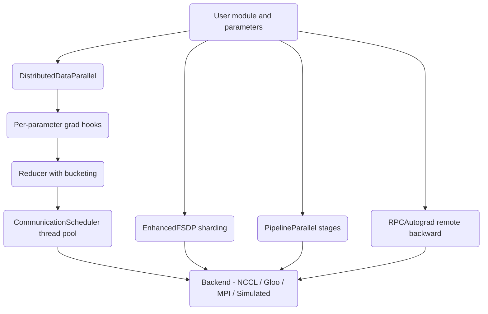

# Distributed Autograd System

A PyTorch-inspired distributed training framework built from scratch in pure Python and NumPy. It implements data-parallel training (DDP), fully-sharded data parallelism (FSDP), pipeline parallelism, RPC-based autograd, gradient bucketing with communication/computation overlap, gradient compression, and fault tolerance — all as an in-process simulation so the mechanics are inspectable without a GPU cluster.

## Features

- **Distributed Data Parallel** — wraps a module, registers per-parameter gradient hooks, and reduces gradients in size-capped buckets (`DistributedDataParallel`, `Reducer` / `distributed/ddp.py`).
- **Gradient bucketing** — groups parameters into reverse-order buckets so reduction can overlap with the backward pass; flatten/unflatten into a contiguous buffer (`GradientBucket`).
- **Communication scheduler** — a thread pool that runs AllReduce off the critical path and records overlap, bandwidth, and per-bucket timing (`CommunicationScheduler`, `CommunicationStats`).
- **Fully Sharded Data Parallel** — flattens and shards parameters across ranks, all-gathers for forward, reduce-scatters gradients, with CPU-offload and mixed-precision policies (`EnhancedFSDP`, `FSDPConfig`).
- **Pipeline parallelism** — splits a model into stages and runs GPipe fill-drain or 1F1B interleaved micro-batch schedules (`PipelineParallel`, `PipelineSchedule`).
- **RPC autograd** — tracks send/recv functions across simulated worker boundaries and runs a distributed backward pass (`RPCAutograd`, `DistAutogradContext`, `rpc_sync` / `rpc_async`).
- **Gradient compression** — Top-K sparsification, int8 quantization, error feedback, and PowerSGD low-rank approximation (`TopKCompressor`, `QuantizedCompressor`, `PowerSGDCompressor`).
- **Pluggable backends** — NCCL, Gloo, MPI, and Simulated backends behind a common interface plus a registry (`AbstractBackend`, `BackendRegistry`, `create_backend`).
- **Fault tolerance** — heartbeat-based health monitoring, atomic checkpointing with rotation, recovery, and elastic membership changes (`HealthMonitor`, `Checkpointer`, `RecoveryManager`, `ElasticTrainer`).
- **Adaptive communication** — picks Ring / Tree / recursive-halving based on a cost model over estimated bandwidth and latency (`AdaptiveCommunicator`).
- **Device mesh** — an N-dimensional grid of device IDs with row-major flattening and submesh extraction for higher-dimensional parallelism layouts (`DeviceMesh`).

## Architecture



| Component | Module | Responsibility |
|-----------|--------|----------------|
| Distributed context | `core/context.py` | Process groups, device mesh, distributed tensors, collective stubs |
| Data parallel | `distributed/ddp.py` | DDP wrapper, reducer, bucketing, scheduler, backends, compression, fault tolerance |
| Pipeline | `pipeline/pipeline.py` | Stage split and GPipe / 1F1B micro-batch schedules |
| RPC autograd | `rpc/autograd.py` | Remote references, RPC calls, distributed backward |

## Quick Start

### Prerequisites

- Python 3.9+
- NumPy (the only hard dependency); `pytest` for the test suite. No GPU or cluster needed.

### Installation

```bash
pip install -e ".[dev]"
```

### Running

This is a library, not a service. Import the package and drive it from Python (see Usage), or run the test suite to exercise every component.

## Usage

A minimal end-to-end DDP flow: wrap a module, run forward, populate gradients, and reduce them. Any object exposing `parameters()` and `__call__`/`forward` counts as a module, and any object with `.data`, `.grad`, and `register_hook` counts as a parameter — the framework is duck-typed rather than tied to a base class.

```python
import numpy as np
from distautograd import DistributedDataParallel, GradReducer
from distautograd.core import ProcessGroup
from distautograd.core.context import Backend

# A minimal module: anything with parameters() and __call__/forward.
class Linear:
    def __init__(self):
        self._params = [_Param((64, 64)), _Param((64,))]
    def parameters(self):
        return iter(self._params)
    def __call__(self, x):
        return x

class _Param:
    def __init__(self, shape):
        self.data = np.random.randn(*shape).astype(np.float32)
        self.grad = None
        self.requires_grad = True
        self._hooks = []
    def register_hook(self, hook):
        self._hooks.append(hook)

group = ProcessGroup(ranks=[0, 1, 2, 3], backend=Backend.GLOO)
model = DistributedDataParallel(Linear(), process_group=group, bucket_cap_mb=25.0)

# Forward (prepares the reducer for the next backward).
out = model(np.random.randn(32, 64).astype(np.float32))

# Simulate a backward by populating gradients, then reduce them.
for p in model.parameters():
    p.grad = np.ones_like(p.data)

reducer = GradReducer(model.parameters(), group)
reducer.reduce_gradients()   # averages each bucket by world size (4)
```

Gradient compression is a standalone round-trip — compress a tensor to a compact payload plus metadata, then reconstruct it:

```python
from distautograd.distributed.ddp import TopKCompressor

compressor = TopKCompressor(compression_ratio=0.01)   # keep the top 1% of elements
payload, meta = compressor.compress(np.random.randn(1000).astype(np.float32))
restored = compressor.decompress(payload, meta)        # scattered back into a zero tensor
```

Pipeline schedules can be planned without running any modules — the planners emit the op order as data, which is handy for visualization or assertions:

```python
from distautograd.pipeline.pipeline import GPipeSchedule

schedule = GPipeSchedule(num_stages=4, num_microbatches=8)
ops = schedule.get_schedule()   # list of (stage, microbatch, 'F'|'B') tuples
```

## Configuration

Behavior is set through constructor arguments and small config dataclasses rather than a config file:

- `bucket_cap_mb` (default 25.0) — the size cap that determines how parameters pack into buckets; the same knob PyTorch DDP exposes.
- `FSDPConfig(sharding_strategy=..., cpu_offload=..., mixed_precision=...)` — selects `FULL_SHARD` / `SHARD_GRAD_OP` / `NO_SHARD` / `HYBRID_SHARD` and the offload / precision policies.
- `PipelineSchedule.GPIPE` vs `PipelineSchedule.INTERLEAVED` — fill-drain versus 1F1B micro-batch scheduling.
- Compressor knobs — `TopKCompressor(compression_ratio=...)`, `QuantizedCompressor(bits=...)`, `PowerSGDCompressor(rank=..., num_iters=...)`.

See [docs/BLUEPRINT.md](docs/BLUEPRINT.md) for the full design and the semantics of each option.

## What's Real vs Simulated

- **Real:** Bucket construction and reverse ordering, flatten/unflatten, gradient averaging by world size, the thread-pool `CommunicationScheduler` with overlap/bandwidth stats, all gradient compressors (Top-K, quantization, error feedback, PowerSGD) including encode/decode round-trips, FSDP flatten/shard/all-gather/reduce-scatter math, pipeline schedule generation, atomic checkpoint write with rotation, heartbeat staleness detection, and the adaptive cost model. These run fully in-process and are covered by the tests.
- **Simulated / requires credentials:** The collectives themselves. AllReduce/AllGather/Broadcast/ReduceScatter return the local tensor (or copies) rather than exchanging data over a network — there is a single process. The NCCL, Gloo, and MPI backends log their operations but do not call into the real libraries; `BackendRegistry` marks NCCL and MPI as unavailable. RPC executes the target function locally instead of over the wire.

## Testing

```bash
pytest tests/ -v
```

390 tests across eight files cover AllReduce strategies, gradient bucketing, the communication scheduler, communication primitives, DDP, FSDP, fault tolerance, and the enterprise features (backends, compression, adaptive communication, elastic training). The suite is pure CPU and needs no external services; the full run completes in well under a second.

Because correctness here means "produces the value the real collective would," the tests assert on the local arithmetic — for example, a bucket of all-fours gradients averaged over world size 4 yields all-ones, and reducing without a process group performs no averaging.

## Project Structure

```
40-distributed-autograd/
  README.md
  pyproject.toml
  src/distautograd/
    core/context.py           # process groups, device mesh, tensors, collectives
    distributed/ddp.py         # DDP, reducer, scheduler, FSDP, backends, compression, fault tolerance
    pipeline/pipeline.py       # pipeline stages and schedules
    rpc/autograd.py            # RPC and distributed autograd
  tests/                       # 390 pytest tests across eight files
  docs/
    BLUEPRINT.md               # full design document
    ARCHITECTURE.md            # architecture notes and diagrams
```

## License

MIT — see ../LICENSE
