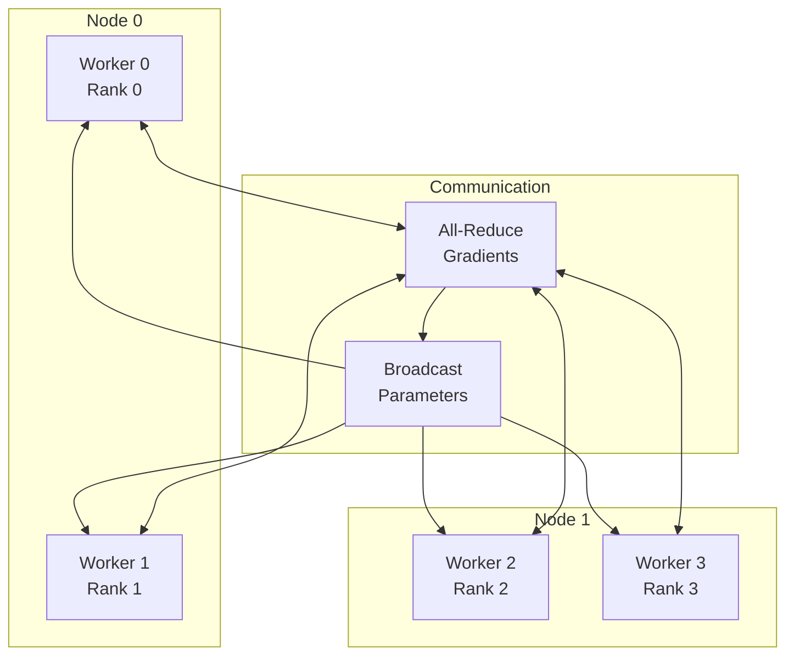
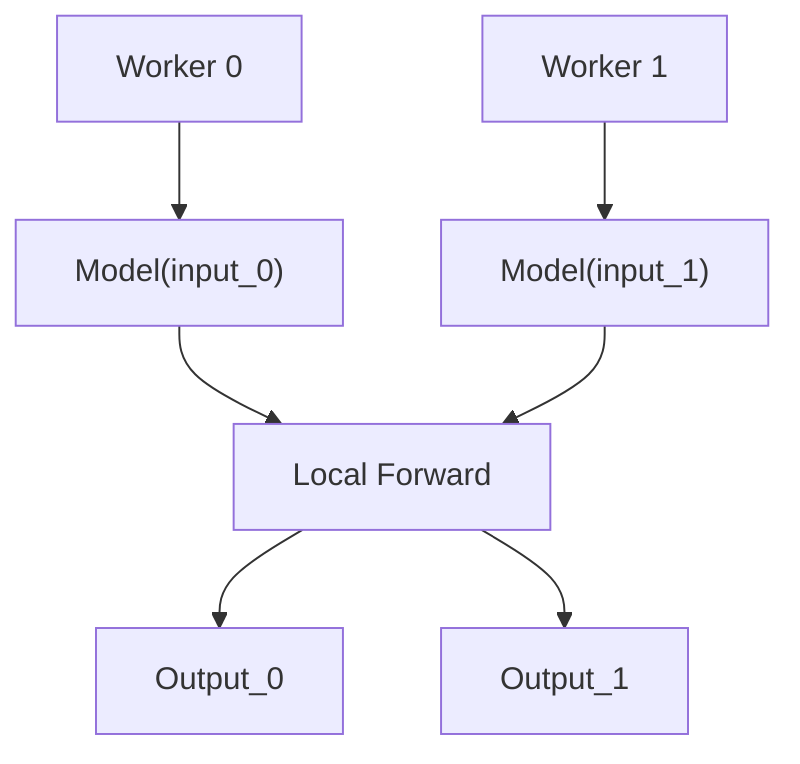
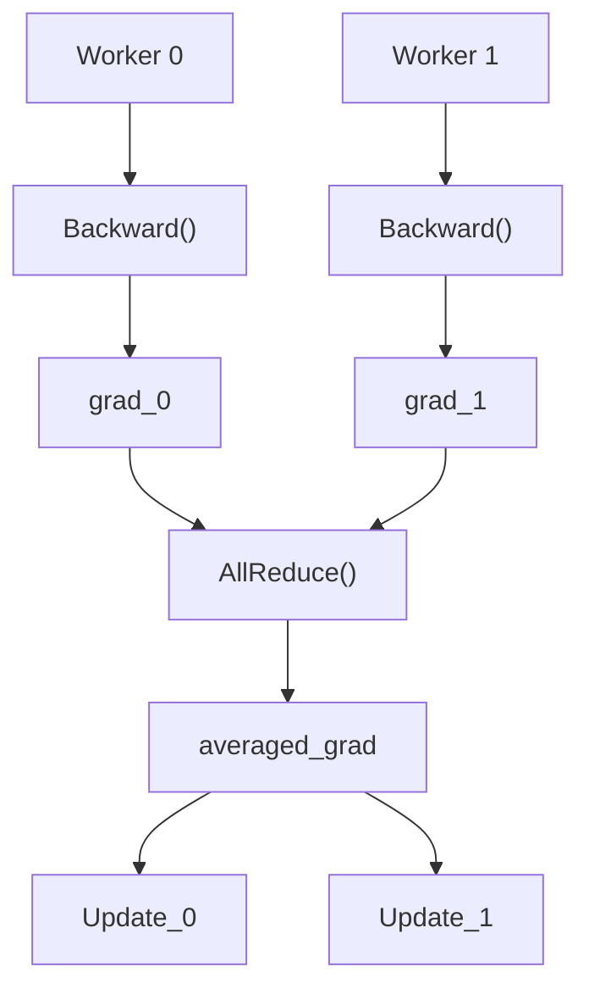
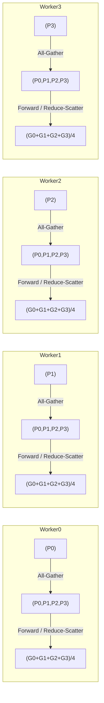
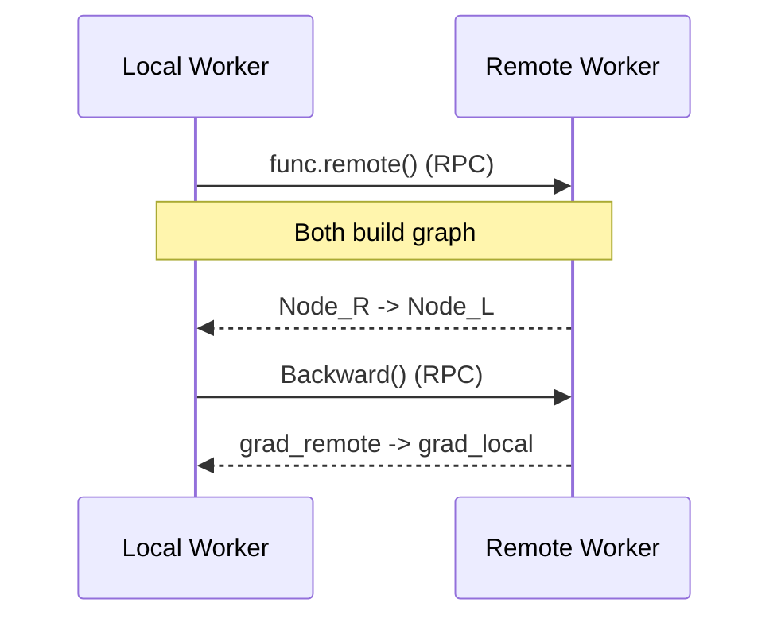
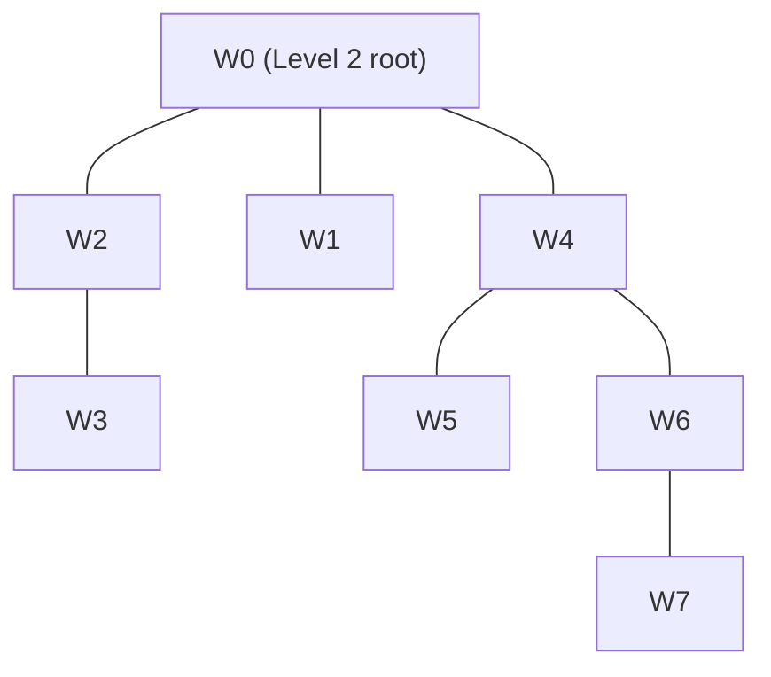

# Distributed Autograd System - Architecture

## Overview

The Distributed Autograd System provides automatic differentiation across distributed computing environments, supporting data parallelism (DDP), model parallelism (FSDP), and RPC-based autograd for distributed deep learning.

## System Components

### 1. Core Layer (`distautograd/core/`)

#### Context Management
- **DistributedContext**: Global distributed state
- **WorkerInfo**: Worker identification and topology
- **ProcessGroup**: Communication group abstraction
- **GradBucket**: Gradient bucketing/aggregation logic

#### Tensor Abstractions
- **DistributedTensor**: Tensor with distributed semantics (sharded or replicated placement)
- **DeviceMesh**: Multi-dimensional worker topology for placement

### 2. Distributed Layer (`distautograd/distributed/`)

#### Data Parallel
- **DistributedDataParallel (DDP)**: Synchronized data parallelism
- **GradientBucket**: Gradient bucketing for efficiency
- **AllReduceStrategy**: Communication strategies

#### Model Parallel
- **FullyShardedDataParallel (FSDP)**: Memory-efficient model parallelism
- **ShardingStrategy**: Model sharding strategies
- **CPUOffloadPolicy**: CPU memory offloading

### 3. RPC Layer (`distautograd/rpc/`)

#### Remote Execution
- **RPCAutograd**: Automatic differentiation over RPC
- **RRef / RemoteModule**: References to remote values and modules
- **rpc_sync / rpc_async / remote**: Remote function invocation primitives

### 4. Pipeline Layer (`distautograd/pipeline/`)

#### Pipeline Parallelism
- **PipelineParallel**: Pipeline execution engine
- **MicroBatch**: Micro-batch scheduling
- **PipelineSchedule**: 1F1B, GPipe schedules

## Distributed Training Architecture



## DDP Architecture

### Forward Pass


### Backward Pass with Gradient Synchronization


## FSDP Architecture

### Model Sharding
```
Original Model (8GB)
├── Layer 1 (2GB) → Worker 0
├── Layer 2 (2GB) → Worker 1
├── Layer 3 (2GB) → Worker 2
└── Layer 4 (2GB) → Worker 3

Each Worker:
- Owns 2GB parameters (sharded)
- Gathers 8GB for forward (all-gather)
- Computes on full model
- Reduces gradients (reduce-scatter)
```

### FSDP Communication Pattern


## RPC Autograd Architecture

### Remote Function Graph


### Distributed Computation Graph
```python
# Computation spans multiple workers
@rpc.remote
def remote_matmul(x, w):
    return x @ w

# Local graph
x = tensor(...)  # Local
w = parameter(...)  # Remote

# Creates distributed graph edges
y = remote_matmul.remote("worker1", x, w)
loss = criterion(y, target)

# Backward traverses distributed graph
loss.backward()  # Triggers remote backward
```

## Communication Backends

### Backend Comparison

| Backend | Use Case | Latency | Bandwidth | GPU Support |
|---------|----------|---------|-----------|-------------|
| NCCL    | GPU-GPU  | Low     | High      | Yes         |
| Gloo    | CPU-CPU  | Medium  | Medium    | No          |
| MPI     | General  | Low     | High      | Optional    |

### Communication Patterns

#### Ring All-Reduce
```
Step 1: Scatter-Reduce
Worker 0: [A0, B0, C0, D0] -> send A0 to W3, recv D3
Worker 1: [A1, B1, C1, D1] -> send B1 to W0, recv A0
Worker 2: [A2, B2, C2, D2] -> send C2 to W1, recv B1
Worker 3: [A3, B3, C3, D3] -> send D3 to W2, recv C2

Step 2-3: Continue ring...

Step 4: All-Gather
All workers have: [ΣA, ΣB, ΣC, ΣD]
```

#### Tree All-Reduce


## Gradient Synchronization

### Gradient Bucketing
```python
class GradientBucket:
    def __init__(self, size_limit):
        self.size_limit = size_limit
        self.gradients = []
        self.current_size = 0

    def add(self, grad):
        self.gradients.append(grad)
        self.current_size += grad.numel() * grad.element_size()

        if self.current_size >= self.size_limit:
            return self.flush()

    def flush(self):
        # Concatenate gradients
        flat = torch.cat([g.view(-1) for g in self.gradients])

        # All-reduce
        dist.all_reduce(flat)

        # Unpack
        self.unpack_gradients(flat)
```

### Overlapped Communication
```
Computation:  [Layer1] [Layer2] [Layer3] [Layer4]
                 ↓        ↓        ↓        ↓
Communication:   |   AR1  |  AR2  |  AR3  | AR4
                 └────────┴───────┴───────┘
Timeline:     ────────────────────────────────>
```

## Pipeline Parallelism

### 1F1B Schedule (One Forward, One Backward)
```
Worker 0: F0 F1 F2 F3 B0 F4 B1 F5 B2 F6 B3 B4 B5 B6
Worker 1:    F0 F1 F2 F3 B0 F4 B1 F5 B2 B6 B3 B4 B5
Worker 2:       F0 F1 F2 F3 B0 F4 B1 F5 B2 B3 B4 B5
Worker 3:          F0 F1 F2 F3 B0 B1 B2 B3 B4 B5 B6

F = Forward micro-batch
B = Backward micro-batch
```

### Memory-Efficient Pipeline
```python
class Pipeline:
    def forward_backward(self, batches):
        # Split into micro-batches
        micro_batches = split(batches, self.num_micro)

        # Forward pass
        activations = []
        for mb in micro_batches:
            act = self.forward(mb)
            activations.append(act)

            # Start backward early (1F1B)
            if len(activations) >= self.pipeline_depth:
                grad = self.backward(activations.pop(0))
                self.accumulate_gradients(grad)

        # Finish remaining backwards
        for act in activations:
            grad = self.backward(act)
            self.accumulate_gradients(grad)
```

## Fault Tolerance

### Checkpointing
```python
class CheckpointManager:
    def save_checkpoint(self, epoch):
        state = {
            'model': model.state_dict(),
            'optimizer': optimizer.state_dict(),
            'epoch': epoch,
            'rng_state': torch.get_rng_state(),
            'cuda_rng_state': torch.cuda.get_rng_state_all()
        }

        # Save to distributed store
        if dist.get_rank() == 0:
            torch.save(state, f'checkpoint_{epoch}.pt')

        dist.barrier()

    def restore_checkpoint(self, path):
        # Load from any worker
        state = torch.load(path, map_location='cpu')

        model.load_state_dict(state['model'])
        optimizer.load_state_dict(state['optimizer'])

        # Restore RNG for reproducibility
        torch.set_rng_state(state['rng_state'])
        torch.cuda.set_rng_state_all(state['cuda_rng_state'])
```

### Elastic Training
```python
class ElasticTrainer:
    def handle_worker_failure(self, failed_rank):
        # Remove failed worker from group
        self.remove_worker(failed_rank)

        # Redistribute work
        self.rebalance_data()

        # Continue training
        self.resume_training()

    def handle_worker_addition(self, new_rank):
        # Add new worker
        self.add_worker(new_rank)

        # Redistribute work
        self.rebalance_data()

        # Sync state
        self.broadcast_state(new_rank)
```

## Performance Optimizations

### Gradient Compression
```python
class GradientCompressor:
    def compress(self, gradient):
        # Top-K sparsification
        k = int(gradient.numel() * self.compression_ratio)
        values, indices = torch.topk(gradient.abs().view(-1), k)

        # Quantization
        quantized = self.quantize(values)

        return {
            'values': quantized,
            'indices': indices,
            'shape': gradient.shape
        }

    def decompress(self, compressed):
        # Reconstruct sparse tensor
        gradient = torch.zeros(compressed['shape'])
        gradient.view(-1)[compressed['indices']] = compressed['values']
        return gradient
```

### Mixed Precision Training
```python
class MixedPrecisionDDP:
    def __init__(self, model):
        self.model = model
        self.scaler = GradScaler()

    def forward_backward(self, input, target):
        with autocast():
            # FP16 forward
            output = self.model(input)
            loss = self.criterion(output, target)

        # FP32 gradients
        self.scaler.scale(loss).backward()

        # Unscale before all-reduce
        self.scaler.unscale_(self.optimizer)

        # All-reduce FP32 gradients
        self.all_reduce_gradients()

        # Update with scaled gradients
        self.scaler.step(self.optimizer)
        self.scaler.update()
```

## Monitoring and Debugging

### Performance Profiling
```python
class DistributedProfiler:
    def profile_communication(self):
        metrics = {
            'all_reduce_time': [],
            'broadcast_time': [],
            'p2p_time': [],
            'data_transfer_bytes': 0
        }

        # Hook into communication ops
        dist.all_reduce = self.wrap_timing(dist.all_reduce,
                                           metrics['all_reduce_time'])

        return metrics

    def profile_computation(self):
        return {
            'forward_time': self.measure_forward(),
            'backward_time': self.measure_backward(),
            'optimizer_time': self.measure_optimizer()
        }
```

### Debugging Tools
```python
class DistributedDebugger:
    def check_gradient_sync(self):
        # Verify gradients are synchronized
        for param in model.parameters():
            if param.grad is not None:
                tensor = param.grad.clone()
                dist.all_reduce(tensor)
                tensor /= dist.get_world_size()

                if not torch.allclose(param.grad, tensor):
                    raise RuntimeError(f"Gradient not synchronized: {param}")

    def detect_hanging_workers(self):
        # Heartbeat mechanism
        while training:
            dist.all_reduce(heartbeat_tensor,
                          timeout=timedelta(seconds=30))
            time.sleep(10)
```

