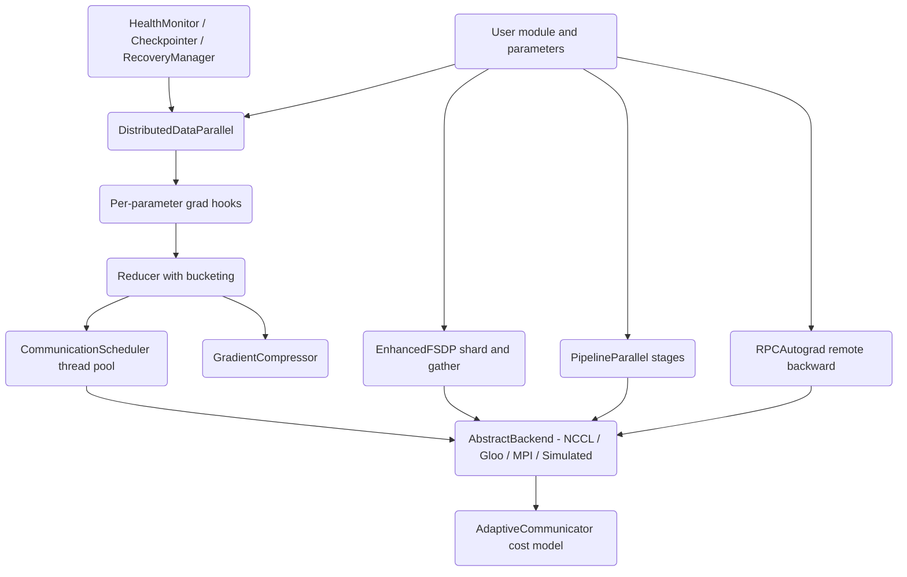

# Distributed Autograd System

## Overview

This project is a from-scratch, PyTorch-inspired distributed training framework written in pure Python and NumPy. It reproduces the mechanics that production frameworks (PyTorch DDP/FSDP, Horovod, DeepSpeed) use to train a single model across many workers — gradient bucketing, communication/computation overlap, parameter sharding, pipeline scheduling, RPC-based autograd, gradient compression, and fault tolerance — but runs entirely **in a single process**. The collective operations are simulated: instead of moving bytes over NCCL or a network, the code performs the local arithmetic that the collective would produce (for example, averaging a bucket by the world size) and exercises the surrounding control flow.

The goal is pedagogical clarity. Every data-parallel concept that is normally hidden behind a C++ extension is here as readable Python: how a reducer turns per-parameter backward hooks into a small number of fused AllReduce calls, why buckets are built in reverse parameter order, how FSDP flattens and shards a parameter set, how a 1F1B pipeline schedule interleaves forward and backward micro-batches, and how a heartbeat monitor decides a worker has failed.

The system implements:

- **Data parallelism (DDP):** replicate the model, split the batch, average gradients so every replica stays in sync.
- **Gradient bucketing and overlap:** fuse many small gradient tensors into contiguous buffers and start reducing them while the backward pass is still computing earlier layers.
- **Fully sharded data parallelism (FSDP):** shard parameters, gradients, and optimizer state across ranks; all-gather for forward, reduce-scatter for backward.
- **Pipeline parallelism:** split a deep model into stages and keep all stages busy with micro-batches under GPipe or 1F1B schedules.
- **RPC autograd:** build an autograd graph that spans worker boundaries and run backward across it.
- **Communication strategies:** Ring, Tree, and recursive halving-doubling, selected by a bandwidth/latency cost model.
- **Gradient compression:** Top-K sparsification, quantization, error feedback, and PowerSGD low-rank approximation.
- **Fault tolerance and elasticity:** heartbeats, checkpointing, recovery, and dynamic membership.

Scope and non-goals: there is no real network transport, no CUDA, and no real NCCL/Gloo/MPI. The package depends only on NumPy. Anywhere a real collective would run, the code documents the substitution in a comment and a log line, and the corresponding `BackendRegistry` entry records availability.

### Why simulate?

Real distributed training is hard to study because the interesting logic — the reducer, the bucket state machine, the overlap scheduling — lives behind a process boundary and a C++ extension. Reproducing only the control flow in a single process makes the whole machine observable: you can set a breakpoint inside `mark_grad_ready`, inspect every bucket's `pending` count, and assert on the exact tensor a reduction produces. The cost is that you cannot measure real wall-clock scaling, which is why this document and the README are explicit about what is real arithmetic versus a placeholder for a network operation.

The substitution is consistent throughout: a collective's *semantics* are implemented (an AllReduce that averages, a reduce-scatter that keeps the local slice), but its *transport* is a no-op. Because there is exactly one process, an averaging AllReduce over a single replica's gradient returns that gradient divided by the world size — which is the correct value the collective would yield if every replica held the same gradient. Tests assert exactly this kind of identity.

This design choice has a name in the code's discipline: **simulate transport, implement semantics.** Every numeric operation a collective performs is real NumPy arithmetic; only the byte movement is elided. That line is drawn deliberately and marked consistently — a comment plus a log line at each elision, and a `BackendRegistry` availability flag per backend — so a reader is never in doubt about which side of the line a given call sits on.

### How a training step flows

A single DDP step exercises most of the system at once:

1. `DistributedDataParallel.forward` calls `reducer.prepare_for_backward()`, resetting every bucket's `pending` counter to its parameter count, then runs the wrapped module.
2. The (simulated) backward populates each parameter's `grad`. In real PyTorch this fires the registered hooks; here the same hooks route into the reducer.
3. Each ready gradient calls `mark_grad_ready(param_idx)`, decrementing the owning bucket's `pending`. The bucket whose count reaches zero is reduced — synchronously, or scheduled onto the `CommunicationScheduler` thread pool when async.
4. Reduction flattens the bucket's gradients into one buffer, divides by the world size, and unflattens back into the parameters.
5. `finalize()` waits for all buckets and (in async mode) drains the scheduler before the optimizer step.

Every arrow in that flow corresponds to a method with a test. The value of the single-process design is that a test can stop the flow at any point — after step 2 to inspect which buckets are ready, after step 3 to check a `pending` counter, after step 4 to assert the exact reduced tensor — without any of the timing nondeterminism a real cluster would introduce.

The `GradReducer` convenience path collapses that same flow into a single call for tests and examples that do not need the fine-grained state machine. `reduce_gradients()` calls `prepare_for_backward()`, then iterates every parameter and calls `mark_grad_ready(i)` for each one whose `grad` is not `None`, then `finalize()` — driving the identical bucket lifecycle but with every gradient declared ready at once rather than trickling in over a real backward. This is why the DDP integration test can populate gradients by hand and reduce them in one line: the two-tier design (`Reducer` for the hook-driven lifecycle, `GradReducer` for the one-shot reduction) means a test chooses the granularity that matches what it is checking.

## Architecture



The system is organized into four packages under `src/distautograd/`:

- **`core/`** — `context.py` holds the shared vocabulary: `Backend` enum, `WorkerInfo`, `ProcessGroup` (with a counting barrier), `DeviceMesh` (an N-dimensional grid of device IDs with submesh extraction), `DistributedTensor`, `GradBucket`, the `DistributedContext` singleton, `AutogradContext`, and free-function collective stubs (`all_reduce`, `broadcast`, `all_gather`, `reduce_scatter`).
- **`distributed/`** — `ddp.py` is the largest module (~3,000 lines). It contains the data-parallel stack (reducer, scheduler, DDP wrapper), FSDP, the backend abstraction, the compression algorithms, the adaptive communicator, and the fault-tolerance and elastic-training machinery.
- **`pipeline/`** — `pipeline.py` implements stage splitting and the GPipe and interleaved (1F1B) schedules.
- **`rpc/`** — `autograd.py` implements remote references, RPC call primitives, remote modules, and the distributed autograd engine.

The package `__init__.py` re-exports the primary public types (`DistributedTensor`, `DistributedContext`, `GradBucket`, `ProcessGroup`, `DeviceMesh`, `DistributedDataParallel`, `GradReducer`, `AllReduceStrategy`, `Reducer`, the pipeline types, and the RPC types). Note that some classes used in the tests (FSDP, the backends, compressors, fault-tolerance classes) live in `distributed/ddp.py` and are imported directly from there rather than from the top-level package.

The dependency direction is strictly inward toward `core`. `distributed`, `pipeline`, and `rpc` all import from `core.context` (for `ProcessGroup`, `DistributedContext`, `AutogradContext`) and never from each other, so the three parallelism strategies are independent and could be used in isolation. `core` imports nothing from the framework. This acyclic layering is what lets a reader pick up any one strategy — say, just pipeline parallelism — without having to understand the rest.

The layers compose the way production frameworks compose them. Data parallelism replicates a model and splits the batch; FSDP shards a model that does not fit; pipeline parallelism splits a deep model across stages; RPC autograd lets an autograd graph cross worker boundaries. In a real large-scale job these combine — for example, FSDP within a node, pipeline across nodes, data parallelism across replicas of the whole pipeline — and `DeviceMesh` is the structure that names the axes of such a layout. This project implements each axis cleanly rather than the full combinatorial product, which is sufficient to teach how each one works.

A reader can follow any single axis top to bottom without the others:

- **Data-parallel axis:** `DistributedDataParallel` → `Reducer` → `CommunicationScheduler` → a backend. The gradient flows from per-parameter hooks through reverse-ordered buckets into an averaging AllReduce.
- **Sharding axis:** `EnhancedFSDP` (via `FSDPConfig`) flattens, shards, all-gathers for forward, and reduce-scatters for backward, with `MixedPrecisionPolicy` and `CPUOffloadPolicy` as optional layers.
- **Pipeline axis:** `PipelineParallel` splits a model list into `PipelineStage` objects and drives them with a GPipe or 1F1B schedule, while `GPipeSchedule`/`InterleavedSchedule` emit the op order as inspectable data.
- **RPC axis:** `rpc_sync`/`rpc_async`/`remote` and `RemoteModule` cross the worker boundary, and `RPCAutograd` replays the recorded send/recv functions to run backward across it.

Each axis touches `core` for its process group and context and nothing else, which is the concrete meaning of the inward-only dependency rule.

## Core Components

### Distributed context (`core/context.py`)

`ProcessGroup` is a dataclass of `ranks`, a `Backend`, and a name. Its `barrier()` uses a lock-guarded counter per named barrier: each caller increments the counter and spins until it reaches the group size, then the counter resets for reuse. This models a rendezvous without real inter-process synchronization (in a single process, the count reaches the group size only when called that many times).

`DeviceMesh` represents devices as an N-dimensional grid. It validates that `len(device_ids)` equals the product of `shape`, maps coordinates to a flat index in row-major order via `get_device(*indices)`, and supports `get_submesh(dim, index)` to slice out a lower-dimensional mesh — the building block for 2D/3D parallelism layouts.

`DistributedContext` is a thread-safe singleton (`get_instance`, `init`) that owns the process groups (a `"default"` group spanning all ranks is created on construction), gradient buckets, and a registry of `AutogradContext` objects keyed by an incrementing id. `new_group`, `get_group`, `new_autograd_context`, and `barrier` are the main entry points.

`DistributedTensor` wraps a NumPy array with `device`, `requires_grad`, an optional `process_group`, a `grad` buffer, and sharding metadata. `shard(dim, num_shards)` uses `np.array_split` to produce child tensors tagged with `{dim, index, total}`. `backward(grad)` accumulates into `self.grad` and chains to `_grad_fn` if present. `all_gather` and `reduce_scatter` are simulated (return `self`).

The free-function collectives (`all_reduce`, `broadcast`, `all_gather`, `reduce_scatter`) are stubs that return the input or pass — the single-process substitution for a real network operation. They exist so that higher layers can be written against a collective API that matches the real one; the actual numeric work that a collective implies is done by the callers (the reducer averages, FSDP slices) rather than buried inside the stub.

The counting `barrier` deserves a closer look because it is a microcosm of the simulation philosophy. A real barrier blocks every participating process until all have arrived. Here, a single thread increments a shared counter and spins until the counter equals the group size:

```python
def barrier(self, name="default"):
    with self._lock:
        self._barriers[name] = self._barriers.get(name, 0) + 1
        while self._barriers[name] < len(self.ranks):
            time.sleep(0.001)
        if self._barriers[name] >= len(self.ranks):
            self._barriers[name] = 0   # reset for reuse
```

In a multi-threaded test the counter genuinely synchronizes the threads; in a single-threaded caller the barrier completes only when invoked `len(ranks)` times, which is the documented modelling assumption. Either way the *interface* — call `barrier()` and proceed only once everyone has — is faithful.

`DeviceMesh` is the structural backbone for higher-dimensional parallelism. A 2×4 mesh, for instance, might name dimension 0 "data" and dimension 1 "model"; `get_submesh(0, i)` then extracts the four devices that share data-parallel rank `i` for a model-parallel collective. The row-major flattening in `get_device` (`flat_idx += indices[k] * multiplier`, multiplier accumulated over trailing dimensions) is the same indexing PyTorch's `DeviceMesh` uses, and the constructor's product check catches mismatched device lists early. Submesh extraction is what makes composed parallelism expressible: with a mesh in hand, a caller can address "all the model-parallel peers of my data-parallel rank" without hard-coding rank arithmetic, which is precisely the addressing a 2D or 3D layout needs.

`AutogradContext` (registered through `DistributedContext.new_autograd_context`) is the single-node analogue of the distributed context in `rpc/autograd.py`: it holds an id and accumulates per-tensor gradients for one backward pass. Keying contexts by an incrementing id, rather than by a thread-local, means several backward passes can coexist and be inspected independently — a property the tests rely on when they run more than one context in a single test. `GradBucket` in `core/context.py` is the context-layer bucket type (distinct from `distributed/ddp.py`'s `GradientBucket`): it is the shared vocabulary term that `DistributedContext` tracks, while the reducer's `GradientBucket` is the richer working structure with a `pending` counter and flat-tensor cache. Keeping the two separate is what preserves the inward-only dependency rule — `core` never needs to know about the reducer's bucket state machine.

The core `GradBucket` carries its own small state machine: `add_gradient(tensor, grad)` appends to parallel `tensors` and `gradients` lists and accumulates `size += grad.nbytes`; `flatten()` concatenates the gradient list into one buffer; `unflatten(flat_grad)` walks the recorded shapes and writes each slice back in place; `clear()` resets everything including the `ready` flag. This is the vocabulary-level analogue that the reducer's richer bucket specializes. `DistributedTensor` fills out the same layer: `shard(dim, num_shards)` calls `np.array_split(self.data, num_shards, axis=dim)` and tags each child with `_sharding_spec = {"dim", "index", "total"}` while round-robining the child's `device` over eight notional devices (`i % 8`), and `backward(grad)` defaults an absent gradient to `np.ones_like(self.data)`, accumulates into `self.grad`, and chains to `_grad_fn` if one is set — the minimal autograd node the RPC engine's `backward` invokes on its roots. `DistributedContext` itself is the singleton that ties this together: `get_instance` lazily constructs it, `init(rank, world_size, backend)` rebuilds it for a given topology, and on construction it always creates a `"default"` `ProcessGroup` spanning `range(world_size)` so a caller always has a group to reduce over. `new_group` auto-names groups `group_{n}` when no name is given, and `new_autograd_context` mints the incrementing ids that `AutogradContext` instances are keyed by.

### Gradient bucketing and the reducer (`distributed/ddp.py`)

`GradientBucket` is a dataclass holding an `index`, its `params`, a running `size_bytes`, a `pending` counter, and an optional `flat_tensor`. `flatten()` concatenates each parameter's `grad` (or zeros if absent) into one contiguous array; `unflatten()` reshapes the flat buffer back into each parameter's `grad`.

`Reducer` is the heart of DDP. On construction it calls `_rebuild_buckets()`, which walks the parameters in **reverse** order (so the parameters whose gradients are produced first in the backward pass — the last layers — land in the earliest buckets) and packs them into buckets capped at `bucket_cap_mb`. It records a `_param_to_bucket` map.

During a step:

1. `prepare_for_backward()` clears each bucket's gradients, sets `pending` to the bucket's parameter count, and resets the flat tensor and future.
2. As each gradient becomes ready, `mark_grad_ready(param_idx)` decrements the owning bucket's `pending`. When `pending` hits zero the whole bucket is ready and is reduced — synchronously via `_reduce_bucket`, or asynchronously via `_async_reduce_bucket` when `use_async` is set.
3. `_reduce_bucket` flattens the gradients, divides by the world size (the simulated AllReduce average) when a process group is present, unflattens, and fires bucket-complete callbacks.
4. `finalize()` waits for the completion event and drains the scheduler when async.

The reduce-outside-the-lock pattern (compute which bucket to reduce inside the lock, then reduce after releasing it) avoids deadlock between the reducer lock and callback code.

The reverse-ordering decision is the single most important design choice in the reducer, and it follows directly from how autograd runs. The backward pass produces gradients in roughly reverse layer order: the last layer's gradient is ready first, the first layer's gradient last. If buckets were built in forward order, the earliest bucket would only fill after the *entire* backward had completed, leaving no time to overlap its reduction with computation. By iterating `reversed(self.parameters)` when building buckets, the parameters that become ready first land in the lowest-indexed bucket, so that bucket can begin reducing while later layers are still computing. This is the same rationale PyTorch's DDP uses, and `test_ddp.py::test_bucket_reverse_order` checks the mapping.

A worked example of the bucket state machine. Suppose three parameters `p0, p1, p2` (sizes 40 KB, 40 KB, 40 KB) with a `bucket_cap_mb` small enough to force two buckets. Reverse iteration visits `p2, p1, p0`; the cap splits them so bucket 0 holds `{p2, p1}` and bucket 1 holds `{p0}`. After `prepare_for_backward`, bucket 0 has `pending = 2` and bucket 1 has `pending = 1`. The backward readies `p2` (bucket 0 → `pending 1`), then `p1` (bucket 0 → `pending 0`, reduce now), then `p0` (bucket 1 → `pending 0`, reduce now). Bucket 0's reduction can run concurrently with the computation that produces `p0`'s gradient.

`_reduce_bucket` performs the simulated AllReduce:

```python
flat_grads = [p.grad.flatten() if p.grad is not None else np.zeros(p.data.size)
              for p in bucket.params]
flat_tensor = np.concatenate(flat_grads)
if self.process_group:                 # average over the (simulated) replicas
    flat_tensor /= self.process_group.size()
# unflatten back into each parameter's grad ...
```

The division by `process_group.size()` is exactly the averaging an AllReduce-sum-then-divide would produce, which is why `test_reduce_bucket_averages_gradients` can assert that an all-fours gradient over world size 4 becomes all-ones, while `test_reduce_bucket_without_process_group` asserts no averaging happens when no group is set.

`GradReducer` is a thinner convenience wrapper around `Reducer` that exposes `reduce_gradients()` (prepare → mark every parameter ready → finalize) and `compress_gradients(ratio)` for in-place Top-K sparsification of each parameter's gradient. Its `strategy` field (`AllReduceStrategy.BUCKET` by default) selects the conceptual algorithm; the bucketed path is the one implemented end to end. The two-tier design — a full `Reducer` that models the hook-driven lifecycle and a `GradReducer` that reduces everything at once — lets a test drive either the fine-grained state machine or a one-call reduction, whichever the scenario needs.

The `find_unused` / `find_unused_parameters` flag exists for the same reason PyTorch's does: if a parameter never receives a gradient in a given backward (a branch of the model was not exercised), its bucket's `pending` count would never reach zero and `finalize` would hang. When the flag is set, the reducer treats never-marked parameters as ready so the bucket can still complete. This is the standard escape hatch for models with data-dependent control flow, and it is why the flag threads through both `DistributedDataParallel` and `Reducer` constructors. The `size_bytes` running total on each bucket is what the cap check consults: as `_rebuild_buckets` walks parameters in reverse, it accumulates `param.data.nbytes` and starts a fresh bucket once adding the next parameter would exceed `bucket_cap_mb * 1024 * 1024`, so the cap is enforced in bytes even though it is specified in megabytes.

Two subtleties in `_rebuild_buckets` are worth pinning down against the code. First, the cap check is `current_bucket.size_bytes + param_size > bucket_cap_bytes and current_bucket.params` — the `and current_bucket.params` clause means a single parameter larger than the whole cap still lands in its own bucket rather than being dropped, because a fresh (empty) bucket never triggers the split. Second, the `_param_to_bucket` map is keyed by the *original* parameter index, not the reversed iteration index: the loop recovers it as `param_idx = len(parameters) - 1 - i`, so when a hook later calls `mark_grad_ready(param_idx)` with the natural forward index, it lands in the right bucket. The last bucket appended is tagged `is_last = True`, a marker a real reducer uses to know when the final reduction has been kicked off. `prepare_for_backward` resets this whole structure atomically under the lock — clearing each bucket's grads, setting `pending = len(params)`, nulling `flat_tensor` and `future`, and clearing the completion event — so a second backward pass starts from a clean slate even if the previous one left buckets partially reduced.

`mark_grad_ready` embodies the reduce-outside-the-lock discipline in a few lines: it looks up the owning bucket, decrements `pending` *inside* the lock, records the bucket to reduce only if `pending` hit zero, releases the lock, and *then* dispatches to `_reduce_bucket` (sync) or `_async_reduce_bucket` (async). If the reduction ran under the lock, a bucket-complete callback that touched the reducer would deadlock; deferring it to after the release is what makes the callback path safe. An unknown `param_idx` (one not in `_param_to_bucket`) is silently ignored, which is the benign behavior when `find_unused` reasoning has already accounted for a parameter that will never fire.

### Communication scheduler (`distributed/ddp.py`)

`CommunicationScheduler` runs AllReduce work off the critical path on a `ThreadPoolExecutor`. `schedule_allreduce(bucket, allreduce_fn, callback, priority)` submits a `WorkItem`; `_execute_work` measures the queue-wait time (counted as overlap), runs the reduction, updates `CommunicationStats`, and invokes per-work and global callbacks. `mark_backward_start` / `mark_backward_end` bracket the backward pass so compute time can be compared against communication time.

`CommunicationStats` derives `overlap_ratio` (overlapped time / total comm time), effective `bandwidth_gbps` (bytes transferred over comm time), and `avg_bucket_time_ms`. `PipelineScheduler` layers a fixed number of pipeline stages on top of the scheduler to bound the number of in-flight buckets and to track per-bucket bandwidth samples.

The overlap measurement is worth unpacking, because it is the metric that justifies the whole bucketing design. When `schedule_allreduce` submits a `WorkItem` it stamps `start_time`. When `_execute_work` finally runs that item (possibly after sitting in the pool's queue while the backward continued), it computes `queue_wait_time = perf_counter() - start_time` and counts that as overlap. The intuition: time a reduction spent waiting in the queue is time during which the main thread was free to keep computing, so it was successfully hidden. Two threads is the default pool size — enough to keep a reduction in flight while the next bucket fills, without oversubscribing. The scheduler is a context manager (`__enter__`/`__exit__` call `start`/`stop`), and `stop` drains pending work via `wait_all` before shutting the executor down so no reduction is lost.

`_execute_work` also carries a fallback that is easy to miss: if the bucket already has a cached `flat_tensor`, it reduces that buffer directly and writes the result back; otherwise it flattens the parameters' grads (zero-filling any missing grad), reduces, and unflattens in place. This dual path is why the async reducer pre-flattens. `Reducer._async_reduce_bucket` calls `bucket.flatten()` first, defines an `allreduce_fn` that divides by `process_group.size()` (or returns the tensor unchanged when there is no group), and schedules it with an `on_complete` callback that calls `bucket.unflatten()` and then `_on_bucket_complete`. So the flatten happens on the calling thread and the divide-plus-unflatten happens on the pool thread — the split that lets the reduction overlap. `_on_bucket_complete` increments `_buckets_reduced` under the reducer lock and sets `_completion_event` once every bucket has reported, which is precisely the event `finalize` blocks on with its optional timeout. The statistics update inside `_execute_work` is guarded by a dedicated `_stats_lock` (separate from the reducer's lock), and `get_stats` returns a *copy* of the `CommunicationStats` (with copied `bucket_times_ms`/`bucket_sizes_bytes` lists) so a caller inspecting stats never races the pool threads still mutating them.

`PipelineScheduler` composes on top: it holds a fixed-length `_active_stages` list, finds a free slot with `_find_available_stage`, and if none is free calls `_wait_for_stage` to block on an in-flight future before scheduling the next bucket. Each scheduled bucket's completion callback (`_stage_complete`) frees its stage slot and, when the bucket carried bytes, samples effective bandwidth as `(size_bytes * 8) / (last_time / 1000) / 1e9` from the most recent `bucket_times_ms` entry. `get_bandwidth_utilization` averages those samples against a settable `_target_bandwidth_gbps` (default 10 Gbps) and clamps to 1.0 — a ratio, not an absolute, consistent with the rest of the instrumentation.

### DDP wrapper (`distributed/ddp.py`)

`DistributedDataParallel` wraps any module exposing `parameters()` and `__call__`/`forward`. It collects the parameters, builds a `Reducer`, registers a backward hook on each parameter (`register_hook`) that routes into `mark_grad_ready`, and synchronizes initial parameters (a simulated broadcast). `forward` calls `prepare_for_backward` and then the wrapped module. The wrapper is deliberately duck-typed: a "module" is anything with `parameters()` returning an iterator and a `__call__` or `forward`; a "parameter" is anything with `.data`, `.grad`, and `register_hook`. This is what lets the tests drive the whole stack with a tiny `MockParameter`/`MockModule` instead of a real network.

The hook wiring is the bridge from autograd to the reducer. For parameter index `i`, the wrapper registers a closure `lambda grad, idx=i: self._grad_hook(idx, grad)`; `_grad_hook` calls `self._reducer.mark_grad_ready(idx)` and returns `grad` unchanged (a hook must return the gradient so the graph continues). The `idx=i` default-argument capture is essential — without it every closure would capture the loop variable by reference and all hooks would fire for the last parameter. This is a classic Python late-binding trap, and the fact that the code sidesteps it deliberately is worth noting: it is the kind of bug that would silently corrupt gradient routing.

`no_sync()` returns a context manager that swaps in a `_DummyReducer` (whose `prepare_for_backward`, `mark_grad_ready`, and `finalize` are no-ops) so gradients accumulate locally across several micro-steps without reduction — the standard gradient-accumulation idiom. The context restores the real reducer on exit, and because it saves and restores the *previous* reducer rather than a flag, nesting works correctly: an inner `no_sync` inside an outer one still leaves a dummy in place until the outermost context exits (`test_no_sync_nested`). The typical pattern is `with ddp.no_sync():` for the first N−1 micro-batches and a plain step for the Nth, so reduction happens once over the accumulated gradient.

At construction the wrapper also performs an initial parameter broadcast — in real DDP this ensures every replica starts from identical weights (the source of truth being rank 0), and here it is the simulated `broadcast` free function. This is a correctness prerequisite, not an optimization: if replicas began with different weights, averaging their gradients would still leave the *parameters* divergent, and the training would be silently wrong. The wrapper also surfaces `parameters()` and a state-dict view so it composes with the rest of the stack; the tests check that wrapping a module does not lose or reorder its parameters, since the parameter order is exactly what the reducer's `_param_to_bucket` map is keyed on.

The wrapper's remaining methods are thin by design. `forward` dispatches to `module.__call__` if present, else `module.forward`, and raises `RuntimeError("Module has no forward method")` when neither exists — a clear failure rather than an `AttributeError` deep in the call. `__call__` simply forwards to `forward`. `state_dict` / `load_state_dict` delegate to the wrapped module when it exposes them and return an empty dict otherwise, so a module without persistence still composes. `join()` is a placeholder for the uneven-input protocol PyTorch's DDP exposes; here it is a no-op because the single-process simulation has no straggler to join. Keeping these methods minimal is what makes the wrapper's real content — the hook wiring and the reducer — easy to isolate and read.

### Fully Sharded Data Parallel (`distributed/ddp.py`)

`EnhancedFSDP` (configured by `FSDPConfig`) flattens all parameters into one vector, computes a per-rank shard size of `ceil(total / world_size)`, and keeps only this rank's slice. `forward` all-gathers the shards back into the full parameter vector, optionally casts via `MixedPrecisionPolicy`, runs the module, and — under `FULL_SHARD` — frees the gathered buffer afterward to reclaim memory. `_reduce_scatter_grads` reduces the gradient vector and keeps only the local shard. `CPUOffloadPolicy` moves shards to a pinned-buffer dictionary and prefetches them back. `ShardingStrategy` enumerates `FULL_SHARD`, `SHARD_GRAD_OP`, `NO_SHARD`, and `HYBRID_SHARD`. A simpler `FullyShardedDataParallel` is also present for the basic sharding case.

The key insight FSDP encodes is a memory-versus-communication trade. DDP replicates the full model on every rank (parameter memory is `O(P)` per rank, communication is one AllReduce of size `P`). FSDP instead stores only `P / world_size` parameters per rank and pays an all-gather before each forward (and a reduce-scatter for gradients) to temporarily materialize the full set. The lifecycle in `EnhancedFSDP` is:

```
_init_params:      flatten all params -> one vector of length P
                   shard_size = ceil(P / world_size)
                   keep local_shard = flat[rank*shard_size : ...]
forward:           _all_gather_params -> reassemble full vector
                   (optional) mixed_precision.cast_for_compute
                   run module
                   if FULL_SHARD: _free_gathered_params -> drop the full vector
backward (sketch): _reduce_scatter_grads -> keep only the local gradient shard
```

The four sharding strategies span the memory/communication spectrum:

```
strategy        params   grads    opt state  behaves like
--------------  -------  -------  ---------  --------------------------------
FULL_SHARD      sharded  sharded  sharded    maximum memory saving (ZeRO-3)
SHARD_GRAD_OP   full     sharded  sharded    less comm, more memory (ZeRO-2)
NO_SHARD        full     full     full       plain DDP
HYBRID_SHARD    sharded  sharded  sharded    shard within node, replicate across
```

`SHARD_GRAD_OP` keeps parameters replicated but shards gradients and optimizer state (less communication, more memory than full shard); `NO_SHARD` degenerates to DDP behavior; `HYBRID_SHARD` shards within a node and replicates across nodes. `FSDPConfig` also carries `forward_prefetch`, `limit_all_gathers`, and `use_orig_params` flags — the same knobs PyTorch's FSDP exposes for overlapping the next layer's all-gather with the current compute and for bounding concurrent all-gathers — kept as configuration fields the strategy dispatch can read. `MixedPrecisionPolicy` carries three dtypes — `param_dtype`, `reduce_dtype`, `buffer_dtype` — mapped to NumPy types (note: NumPy has no bfloat16, so `bfloat16` maps to float32). The common configuration computes in float16 but reduces gradients in a wider type to preserve small updates.

The reduce-in-a-wider-type detail is not cosmetic. Gradients are small numbers, and summing many of them in float16 loses the least-significant bits — the classic reason naive mixed-precision training stalls. Keeping `reduce_dtype` wider than `param_dtype` means the AllReduce accumulates with enough mantissa to preserve small updates, and only the stored parameters live in the narrow type. That the policy exposes three independent dtypes (params, reduce, buffers) rather than one global precision is what makes this expressible. The three `cast_*` methods map cleanly onto the lifecycle: `cast_for_compute` uses `param_dtype` before the forward, `cast_for_reduce` uses `reduce_dtype` before the gradient reduce-scatter, and `cast_for_storage` uses `buffer_dtype` when writing a value back — and `_reduce_scatter_grads` applies exactly this reduce-then-store pair (`cast_for_reduce` on the way in, `cast_for_storage` on the local shard on the way out) when mixed precision is enabled.

The `_init_params` shard math is precise and worth reading against the code. It flattens every parameter into `_flat_params`, records each parameter's `shape` and `numel` (so the flat vector can later be un-flattened back into per-parameter tensors), computes `_shard_size = ceil(total_numel / world_size)` via `(total_numel + world_size - 1) // world_size`, and keeps `_local_shard = _flat_params[rank*shard_size : min(...)].copy()`. The `min` on the end index is what handles a non-divisible total — the last rank's shard is simply shorter. `_all_gather_params` concatenates `world_size` copies of the local shard and then *trims to `len(_flat_params)`*, undoing the padding the ceiling division introduced; `_is_gathered` guards against gathering twice. `state_dict` force-gathers first and returns the full flat vector plus the recorded shapes and a compact config summary, so a checkpoint is always the unsharded view; `load_state_dict` restores the flat vector and *re-shards* for the current world size, which is exactly what makes an FSDP checkpoint portable across a change in the number of ranks. `CPUOffloadPolicy` keeps a `_pinned_buffers` dict keyed by a tensor id; `offload_to_cpu` stores a copy and returns it, `prefetch_to_gpu` looks it up, and `EnhancedFSDP` prefetches the shard back at the top of `_all_gather_params` when offload is enabled — the in-process analogue of staging a shard through pinned host memory. The simpler `FullyShardedDataParallel` handles only the basic case: it shards each parameter's flattened data by `size // world_size`, stashes the original on `param._full_data`, and restores it wholesale in `_all_gather_params` — a stepping stone to the `EnhancedFSDP` machinery rather than a competitor to it.

### Pipeline parallelism (`pipeline/pipeline.py`)

A model is given as a list of stage modules. `PipelineParallel` wraps each in a `PipelineStage` (with input/output/grad queues) and splits an input batch into `num_microbatches` `MicroBatch` objects via `np.array_split`. Two schedules are implemented:

- **GPipe** (`_gpipe_schedule`): fill-drain — every micro-batch passes through every stage forward, then backward runs in reverse.
- **Interleaved 1F1B** (`_interleaved_schedule`): a warmup of `num_stages - 1` micro-batches, then a steady state that issues one forward and retires one in-flight micro-batch per step, then a drain.

`GPipeSchedule` and `InterleavedSchedule` are standalone planners whose `get_schedule()` emits the schedule as a list of `(stage, microbatch, 'F'|'B')` tuples — useful for visualization and testing without running the modules. `GPipeSchedule.get_schedule` is the clearest possible statement of fill-drain: a double loop over `(microbatch, stage)` appends every forward, then a reversed double loop appends every backward, so all forwards precede all backwards. `InterleavedSchedule.get_schedule` computes `num_warmup = min(num_stages - 1, num_microbatches)` and issues that many forwards before the steady-state 1F1B alternation, making the warmup/steady/drain structure literal in the code.

The reason 1F1B exists is activation memory. Under GPipe's fill-drain, every micro-batch is pushed all the way forward through all stages before any backward starts, so the activations of *all* in-flight micro-batches must be retained simultaneously — peak activation memory grows with the number of micro-batches. 1F1B instead interleaves: after a short warmup of `num_stages - 1` forwards, each step does one forward and retires (backward) the oldest in-flight micro-batch, bounding the number of live activation sets to roughly the pipeline depth. The throughput is similar; the memory profile is dramatically flatter, which is what makes deep pipelines feasible. The separation of *planner* (`GPipeSchedule`/`InterleavedSchedule`, which only emit the op order) from *executor* (`PipelineParallel`, which runs the ops) means the schedule can be unit-tested as data — a test can assert the exact `(stage, mb, 'F'/'B')` sequence without instantiating any modules.

The "pipeline bubble" is the concept both schedules trade against. At the start of a pipeline the later stages have no work (they are waiting for the first micro-batch to reach them), and at the end the earlier stages have gone idle — this idle time is the bubble, and its fraction shrinks as the number of micro-batches grows relative to the number of stages. The schedule planners make the bubble visible: reading the emitted op list, the warmup and drain regions where some stages have no op are exactly the bubble, and the steady state in the middle is where every stage is busy.

The executor and the planner diverge on one detail worth naming precisely, because it is the kind of thing a reader should not assume symmetry about. `InterleavedSchedule.get_schedule` emits three explicit regions — a warmup of `num_warmup = min(num_stages - 1, num_microbatches)` pure forwards, a steady state where each micro-batch's forwards are immediately followed by a *reversed* sweep of backwards for the micro-batch `num_warmup` steps behind it (`schedule.append((stage, mb - num_warmup, 'B'))`), and a cooldown that drains the remaining backwards in reverse stage order. The *executor* `PipelineParallel._interleaved_schedule`, by contrast, runs the forwards for real and models the 1F1B retirement by popping the oldest in-flight micro-batch (`results.append(in_flight.pop(0))`) rather than invoking a stage backward inline — the code comment "Could do backward here for oldest in-flight" marks the exact point where a real backward would run. So the planner is the faithful statement of the 1F1B op ordering (the artifact a test asserts on), and the executor is the simplified driver that exercises the forward path and the retirement bookkeeping. Keeping the two in the same module, adjacent, is what lets a reader compare the idealized schedule against the running approximation side by side.

Each `PipelineStage` carries three `Queue` objects — `input_queue`, `output_queue`, `grad_queue` — and its `device` is assigned `i % 8` (round-robin over eight notional devices) when `PipelineParallel` constructs the stages. `PipelineStage.forward` pushes the incoming `micro_batch.data` onto `micro_batch.activations` before overwriting `data` with the module's output, which is precisely the activation-stashing that a real backward needs: `PipelineStage.backward` pops that activation (`micro_batch.activations.pop()`) and inserts the incoming gradient at the front of `micro_batch.gradients` (`insert(0, grad)`) so the gradient list ends up in forward-stage order. `PipelineParallel.backward` walks `reversed(micro_batches)` and, for each, `reversed(self.stages)`, seeding the loss gradient as `np.ones_like(mb.data)` (optionally after computing `mb.loss` via a supplied `loss_fn`). The activation stash growing on the forward and shrinking on the backward is the concrete mechanism behind the memory argument above: under GPipe every micro-batch's stash is live at once; under 1F1B a stash is popped as soon as its micro-batch retires.

### RPC autograd (`rpc/autograd.py`)

`RRef` is a remote reference (owner rank, local id, type name). Its `to_here()` and `local_value()` methods return `None` in the simulation — placeholders for the real fetch-to-local and owner-side dereference operations — so the type documents the RRef contract even though no bytes move. `rpc_sync` and `rpc_async` are the call primitives — in this single-process simulation `rpc_sync` calls the target function directly and `rpc_async` runs it on a background thread, returning a `Future`. `remote` runs the call and wraps the result in an `RRef`. `RemoteModule` exposes a module for remote forward.

`DistAutogradContext` tracks `send`/`recv` functions registered during the forward pass and accumulates gradients per tensor id; contexts are created and looked up by id through class methods. `RPCAutograd.backward(context_id, roots)` seeds root gradients, then plays back the recorded recv functions (gradients arriving from other workers) and send functions (gradients leaving to other workers). This mirrors PyTorch's `torch.distributed.autograd`, where send/recv graph nodes stitch the per-worker autograd graphs into one.

The mental model: when a forward pass crosses a worker boundary (worker A sends a tensor to worker B, B computes on it), the framework implicitly inserts a `send` node on A and a matching `recv` node on B. During backward, B's local backward reaches the `recv` node and must ship the gradient back across the boundary to A's `send` node, which resumes A's local backward. The per-context `send_funcs`/`recv_funcs` dictionaries record exactly these boundary handlers, keyed by sequence id, so `RPCAutograd.backward` can replay them in the right order. In this simulation the "ship across the boundary" step is a local function call, but the bookkeeping — one context per distributed backward, send/recv pairing, gradient accumulation by tensor id — is the real structure.

`RemoteGradient` (owner `RRef`, gradient array, `context_id`) is the payload that would travel back across the boundary; keeping it as an explicit dataclass rather than a bare array is what lets the context match an arriving gradient to the send node that is waiting for it.

The call primitives are deliberately minimal so the boundary structure stays legible. `rpc_sync(to, func, args, kwargs)` simply returns `func(*args, **kwargs)` — the single-process substitution for a synchronous remote call. `rpc_async` constructs a bare `Future`, spawns a `threading.Thread` whose target calls the function and does `future.set_result` / `future.set_exception`, and returns the future immediately — real asynchrony against a real `Future`, only without a network hop. `remote(to, func, ...)` runs the call through `rpc_sync` and wraps the result in an `RRef(owner=to, local_id=id(result), type_name=type(result).__name__)`; using Python's `id()` as the `local_id` is the in-process stand-in for a globally unique remote object handle. `RemoteModule` closes over a local module and exposes `forward` as `remote(self.owner, _forward, ...)`, so calling a remote module returns an `RRef` to its output rather than the output itself — exactly the ownership indirection PyTorch's `RemoteModule` provides. `init_rpc(name, rank, world_size, backend="tensorpipe")` and `shutdown_rpc()` bracket a session and set a module-level `_worker_id`; the default backend name `"tensorpipe"` matches PyTorch's real RPC transport, kept as documentation even though no transport runs.

Two distinct context types coexist by design and are worth distinguishing. `core/context.py`'s `AutogradContext` (created via `DistributedContext.new_autograd_context`, keyed by an incrementing id on the singleton) is the single-node vocabulary type: it holds `send_functions`, `recv_functions`, and a `_grad_to_send` accumulator, and its `accumulate_grad(seq_id, grad)` sums repeated contributions for the same sequence id. `rpc/autograd.py`'s `DistAutogradContext` is the RPC-engine's own context, with its own class-level `_contexts` registry, `_next_id`, and lock, plus `add_send_function` / `add_recv_function` and an `accumulate_gradient(tensor_id, grad)` that sums by tensor id. `RPCAutograd.backward` retrieves the context by id (raising `RuntimeError` on an unknown id), calls `.backward()` on any root that exposes it, then replays every registered `recv_func` followed by every registered `send_func`. The recv-before-send ordering is the crux: a worker must first receive the gradients flowing back into it before it can compute and send the gradients leaving it, which is the topological order a real distributed backward follows across the send/recv graph nodes.

### Communication backends (`distributed/ddp.py`)

`AbstractBackend` defines the collective interface (`all_reduce`, `all_gather`, `broadcast`, `reduce_scatter`, `barrier`, `sync_stream`). `NCCLBackend`, `GlooBackend`, `MPIBackend`, and `SimulatedBackend` implement it; each documents the real library call it would make and then performs the local simulation (returning the tensor, or copies for all-gather). `BackendRegistry` records a `BackendConfig` per backend — NCCL and MPI are marked unavailable (no CUDA / no MPI), Gloo and Simulated available. `create_backend(name, rank, world_size)` is the factory.

The backend abstraction exists so the rest of the system never hard-codes a transport. A `BackendConfig` carries capability flags — `supports_gpu`, `supports_cpu`, `is_available`, `max_message_size` (default `2**30`, one gigabyte), `requires_init` — so callers can query what a backend can do before using it. The four implementations map onto the real ecosystem: NCCL is GPU-only and the fastest for GPU-GPU collectives (flagged unavailable here since there is no CUDA); Gloo handles CPU and GPU and is the portable default; MPI is the HPC option (unavailable without an MPI runtime); and Simulated is the always-available in-process stand-in that needs no initialization. Each real backend's method body contains the precise call it *would* make as a comment — for example `NCCLBackend.all_reduce` notes `nccl.all_reduce(tensor, op=nccl.sum, comm=self._comm_handle)`, `GlooBackend.initialize` notes the `pygloo` TCPStore rendezvous, and `MPIBackend.initialize` notes `from mpi4py import MPI; self._comm = MPI.COMM_WORLD` — so the simulation doubles as documentation of the real API. The uninitialized-backend guard (`raise RuntimeError if not self._initialized`) models the real requirement that a communicator be set up before use; `SimulatedBackend` sets `_initialized = True` in its constructor precisely because its config declares `requires_init=False`.

The collective *semantics* differ per operation even in simulation, and the differences are the instructive part. The table below is the contract each backend method honors — the value it returns, and the real library call the source comments document behind it:

```
operation       simulated result                      real call it stands for
--------------  ------------------------------------  ------------------------------
all_reduce      tensor unchanged (single-replica sum) nccl/gloo/mpi all_reduce(sum)
all_gather      world_size copies of the tensor       all_gather into a list
broadcast       a copy of the tensor                  broadcast from src rank
reduce_scatter  this rank's 1/world_size slice        reduce then scatter chunks
barrier         no-op (log line)                      collective barrier
sync_stream     no-op (log line)                      cuda stream synchronize
```

 `all_reduce` returns the tensor unchanged (a single-replica sum is the identity). `all_gather` returns `world_size` copies of the tensor — the shape a real all-gather would produce if every rank held the same data. `reduce_scatter` returns only this rank's slice: `NCCLBackend` computes `chunk_size = len(tensor.flatten()) // world_size` and slices `[rank*chunk : rank*chunk + chunk]`, while `SimulatedBackend` guards against a zero chunk with `max(1, ...)` and clamps the end with `min(...)` so a tensor smaller than the world size still yields a valid (possibly empty-avoiding) slice. `create_backend(name, rank, world_size)` is the factory: it lowercases the name, dispatches to the matching class, and raises `ValueError` on an unknown name — the same fail-fast discipline the reducer and RPC engine use for bad ids. `BackendRegistry` is a class-level dictionary with `get_backend`, `list_available` (filters on `is_available`), and `register_backend`, so a caller can enumerate what will actually run in the current environment (`gloo` and `simulated`) versus what is present only as documentation (`nccl`, `mpi`).

### Pipeline scheduler vs communication scheduler

It is easy to conflate the two schedulers, but they operate at different levels. The `CommunicationScheduler` is about *gradient* communication in data parallelism — it runs AllReduce work for buckets off the critical path. The `PipelineScheduler` (also in `ddp.py`) sits on top of it and bounds how many buckets are in flight at once by modelling a fixed number of pipeline *stages*; when all stages are occupied it waits for one to drain before scheduling the next, and it samples per-bucket bandwidth as stages complete. The `PipelineParallel` class in `pipeline/pipeline.py` is unrelated to both — it schedules *model* stages and micro-batches, not gradient buckets. The shared word "pipeline" refers to the general idea of overlapping stages, applied to two different resources.

### Gradient compression (`distributed/ddp.py`)

All compressors subclass `GradientCompressor` and track `CompressionStats` (ratio, space savings, timing):

- **`TopKCompressor`** keeps the `k = ratio * numel` largest-magnitude elements (`np.argpartition`) and packs `(indices, values)`; decompress scatters them back into a zero tensor.
- **`QuantizedCompressor`** scales by `abs_max / (2^(bits-1) - 1)`, rounds to int8, and stores the scale for dequantization.
- **`ErrorFeedbackCompressor`** adds the previous step's compression residual to the gradient before compressing, then stores the new residual — this preserves convergence under lossy compression.
- **`PowerSGDCompressor`** reshapes the gradient to a matrix and uses power iteration with a persisted basis `Q` to produce a rank-`r` factorization `(P, Q)`; decompress reconstructs `P @ Qᵀ`.

Two design points are worth calling out. First, error feedback is what keeps lossy compression from breaking convergence. A Top-K or quantized gradient throws away information every step; without correction those errors accumulate and the model drifts. `ErrorFeedbackCompressor` adds the previous step's residual `error = tensor - decompress(compress(tensor))` back into the next gradient before compressing, so dropped signal is not lost but merely deferred — over many steps the full gradient is eventually communicated. Second, PowerSGD's economy comes from low rank: a dense `m × n` gradient costs `m·n` numbers, while its rank-`r` factors `(P: m×r, Q: n×r)` cost `(m + n)·r`, a large saving when `r ≪ min(m, n)`. Persisting `Q` across steps (warm-starting the power iteration from the previous basis) lets a single iteration track the dominant subspace cheaply, which is why `num_iters` defaults to 1.

`np.argpartition` in the Top-K path is chosen over a full sort deliberately: it finds the `k` largest magnitudes in `O(numel)` rather than `O(numel log numel)`, which matters when the compressor is invoked on every gradient of every step. The correctness of the round-trip does not depend on the selected elements being *sorted*, only on their being *the largest k* — exactly what `argpartition` guarantees. Note the deliberate asymmetry with `GradReducer.compress_gradients`, which does the same Top-K sparsification *in place on each parameter's grad* but uses `np.argsort(np.abs(grad))[-k:]` — a full sort. The difference is intentional context: `GradReducer.compress_gradients` is a convenience path that mutates gradients directly (it is not a `GradientCompressor` and produces no metadata for a round trip), while `TopKCompressor` is the reusable, metadata-producing scheme on the hot path where the `argpartition` complexity win matters.

The four schemes trade compression, loss, and cost differently, and the metadata each carries is exactly what its `decompress` needs:

```
compressor          payload                      metadata keys                     lossy?
------------------  ---------------------------  --------------------------------  ------
TopKCompressor      2 x k float64 (idx, values)  original_shape, original_numel, k  yes
QuantizedCompressor int8 array + scale           scale, original_dtype, shape       yes
ErrorFeedback       (wraps a base compressor)    (delegates to base)                yes*
PowerSGDCompressor  P and Q flattened+concat     matrix_shape, rank, p_shape, q_shape yes
```

The `*` on error feedback marks its distinguishing property: it is lossy per step but *asymptotically lossless*, because the residual it carries forward guarantees every bit of dropped signal is eventually communicated. It is also the only compressor built by composition — `ErrorFeedbackCompressor(base_compressor)` wraps any of the others and re-exposes the base's `stats`, so `TopK + error feedback` and `Quantized + error feedback` are both expressible without new classes.

The packed Top-K payload is a single `2 × k` float64 array: `np.stack([indices.astype(np.float64), values])`. Storing indices as float64 in the same array as the values is what keeps the compressed object a plain NumPy array (so it can flow through the same paths a dense gradient would); `decompress` recovers them with `compressed[0].astype(np.int64)` and scatters `values` into a zero vector of length `metadata["original_numel"]` before reshaping to `original_shape`. Quantization's payload is even tighter — an `int8` array plus a scalar `scale` in the metadata — giving the roughly 4x reduction over float32 that the Performance section cites. PowerSGD's reshape rule handles three ranks explicitly: a 1-D gradient becomes a column vector (`reshape(-1, 1)`), a 2-D gradient is used as-is, and anything higher is collapsed to `(shape[0], -1)`; the effective rank is `r = min(self.matrix_rank, m, n)`, so a small gradient cannot request a rank larger than its own dimensions. The persisted basis `self._q` is re-initialized (a random Gaussian re-orthonormalized with `np.linalg.qr`) only when its shape no longer matches `(n, r)`, which is exactly when the gradient's shape changes; otherwise it warm-starts from the previous step.

### Adaptive communication (`distributed/ddp.py`)

`AdaptiveCommunicator` keeps `NetworkMetrics` (windowed bandwidth and latency estimates) and `select_strategy(message_size_bytes)` chooses among Ring, Tree, and recursive halving-doubling by an analytic cost model: ring time is `2(n-1)(latency + size/bandwidth/n)`, tree time is `2 log2(n)(latency + size/bandwidth)`, and recursive halving-doubling is `log2(n)(latency + size/bandwidth)` but only for power-of-two world sizes (otherwise infinite). Small messages favor tree/latency-bound algorithms; large messages favor ring/bandwidth-bound ones.

The cost models are first-order analytic approximations, expressed in microseconds and parameterized by `bandwidth_gbps` and `latency_us`:

- **Ring:** `2(n-1)(latency + size/bandwidth/n)`. Each of the `n` participants sends and receives `(n-1)/n` of the data across the reduce-scatter and all-gather phases, so per-link bytes are independent of `n` — ring is bandwidth-optimal for large messages, paying `2(n-1)` latency hops.
- **Tree:** `2 log2(n)(latency + size/bandwidth)`. Reduce up a binary tree, broadcast down — `O(log n)` latency, but each level moves the full message, so it is latency-optimal (good for small messages) rather than bandwidth-optimal.
- **Recursive halving-doubling:** `log2(n)(latency + size/bandwidth)`, returned as infinity for non-power-of-two `n` so it is never selected there. For power-of-two sizes it combines low latency with good bandwidth.

`select_strategy` evaluates all three and returns the minimum, then records the choice in `_strategy_usage`. `NetworkMetrics` keeps windowed histories so estimates adapt: each completed transfer feeds `update_bandwidth`/`update_latency`, which average over the last `window_size` samples. The crossover behavior is the expected one — below roughly the 1 MB threshold (`_small_message_threshold = 1024 * 1024`) the tree/RHD latency term dominates and a log-depth algorithm wins; above it the ring's bandwidth optimality wins. The windowing matters because real link characteristics drift under contention; averaging over a bounded window lets the estimate track recent conditions without being dragged by stale samples.

`AdaptiveCommunicator.all_reduce` closes the loop between the model and the estimator. It reads `tensor.nbytes`, calls `select_strategy` to pick and record an algorithm, times a (simulated, copy-only) reduction, and feeds the elapsed time back through `estimate_bandwidth(size_bytes, elapsed_s)` so the *next* selection is informed by the *last* transfer's measured throughput. `estimate_bandwidth` guards against a zero interval, converting bytes and seconds into Gbps before updating the windowed history. `get_strategy_stats` returns a copy of the `_strategy_usage` counter, so a test can drive a sequence of message sizes and assert that small messages accumulated tree/RHD selections and large ones accumulated ring selections — an ordering assertion, not a brittle absolute-time one. The `NetworkMetrics` dataclass also carries `jitter_us` and `packet_loss_rate` fields that the cost model does not currently consume; they are present as the natural extension points a richer model would read, and the tests treat them as plain constructed fields.

### Fault tolerance and elasticity (`distributed/ddp.py`)

- **`HealthMonitor`** runs a background loop that sends a `Heartbeat` and checks others for staleness. After `max_missed_heartbeats` it marks a rank failed, raises a `FailureEvent`, and notifies callbacks. Recovery is detected when a fresh heartbeat arrives from a previously failed rank.
- **`Checkpointer`** writes state with `pickle` to a temp file then atomically `os.replace`s it, maintains a `latest.txt` pointer, rotates to keep the last N, and can save asynchronously on a single-thread executor. Only the main rank writes; others hit a barrier.
- **`RecoveryManager`** ties a checkpointer and health monitor together: `save_state`/`restore_state` capture and reload model/optimizer/iteration and re-broadcast parameters after recovery. `FaultTolerantTrainer` is the high-level wrapper that wires DDP, the monitor, the checkpointer, and recovery behind `start`/`step`/`resume`/`stop`.
- **`ElasticTrainer`** maintains the current worker set within `[min_workers, max_workers]`, queues join/leave requests, handles failures, rebalances data shards (`get_data_shard`), and records a `MembershipEvent` history.

The fault-detection logic is a missed-heartbeat counter rather than a single timeout, which avoids declaring a worker dead on one transient hiccup. `_check_heartbeats` runs every interval: for each peer it either resets the missed count (a fresh, non-stale heartbeat arrived) or increments it. Only after `max_missed_heartbeats` consecutive misses does `_handle_failure` fire, append the rank to `_failed_workers`, and raise a `FailureEvent`. Callbacks are copied out and invoked *outside* the lock, the same deadlock-avoidance discipline the reducer uses. Recovery is symmetric: a later heartbeat from a failed rank removes it from `_failed_workers` and triggers the recovery callbacks.

The monitor's public surface is small and query-oriented, which is what lets a training loop poll health cheaply:

- `start` / `stop` bracket the daemon `_monitor_loop`, which alternates `_send_heartbeat` and `_check_heartbeats` on the `heartbeat_interval` cadence; `stop` flips `_running` and joins with a bounded timeout of `heartbeat_interval * 2`.
- `receive_heartbeat(hb)` records a peer's heartbeat, resets that peer's missed count, and — if the peer was in `_failed_workers` — removes it and fires the recovery callbacks, so recovery is detected the instant a fresh heartbeat lands.
- `get_healthy_workers` / `get_failed_workers` / `is_healthy(rank)` / `all_healthy` are lock-guarded reads that a step loop can call each iteration to decide whether to proceed, reshard, or checkpoint.
- `mark_iteration(n)` stamps the iteration into outgoing heartbeats, so a peer can see not just that a worker is alive but how far along it is — the signal a straggler detector would use.

`Heartbeat.is_stale(timeout)` compares `perf_counter() - timestamp` against the timeout, so staleness is measured in monotonic time (immune to wall-clock adjustments), and the `Heartbeat` also carries `state` (a `WorkerState`) and `memory_used_mb`, giving a failure event enough context to decide whether a failure is recoverable. `FailureEvent.recoverable` defaults to `True`, and `RecoveryManager._on_failure` only initiates recovery when both `recoverable` and its own `auto_recover` are set — the two-gate check that keeps an unrecoverable failure from triggering a futile restart loop.

The checkpoint write is crash-safe by construction. `_save_sync` pickles into `filepath + ".tmp"` and then `os.replace`s it onto the final name — an atomic rename on POSIX — so a crash mid-write leaves either the old checkpoint or the new one, never a truncated file. A `latest.txt` pointer records the newest checkpoint, and `_cleanup_old_checkpoints` keeps only the last N by sorted filename (the zero-padded `checkpoint_{iteration:08d}.pt` format sorts chronologically). Async saves run on a one-thread executor so training is not blocked on disk; `wait_pending` joins them at shutdown.

The save path also encodes the distributed coordination that a real checkpoint needs. `should_save(iteration)` gates on `iteration > 0 and iteration % save_interval == 0`, so only interval boundaries write unless `force=True`. Only the main rank (`rank == 0`) actually writes; every other rank falls through to `_barrier()` and returns `None`, which is the rendezvous that keeps non-writing ranks from racing ahead of the checkpoint. Before writing, `save` stamps a `_checkpoint_meta` dict (iteration, wall-clock timestamp, rank) into a *copy* of the state so the caller's dict is not mutated. `load` resolves `latest.txt` when no path is given, falling back to the lexically-last `checkpoint_*.pt` if the pointer is missing — the same chronological-sort trick used for cleanup. Because the format is `pickle`, the checkpoint can hold arbitrary Python state (model dict, optimizer dict, iteration, world size), which is what lets `RecoveryManager.save_state` bundle everything a resume needs into one atomic file.

`ElasticTrainer`'s `get_data_shard` is what makes membership changes meaningful: when the world size changes, the dataset must be re-partitioned so every remaining worker gets a disjoint, roughly equal slice. It computes `samples_per_worker = total_samples // world_size`, gives this rank `[rank*samples_per_worker, ...]`, and hands the *last* rank all remaining samples (`end = total_samples`) so no data is dropped when the count does not divide evenly. Recording each change as a `MembershipEvent` (with the new world size and a timestamp) gives an auditable history of how the job's membership evolved — the kind of log a real elastic scheduler keeps to reason about churn.

The membership lifecycle is a request-then-commit two-phase design. `request_join` and `request_leave` only queue a rank onto `_pending_joins` / `_pending_leaves` after checking the bounds — a join is refused once `world_size >= max_workers` or the rank is already present, a leave is refused once `world_size <= min_workers` or the rank is absent — and both return a boolean so the caller learns whether the request was admitted. `commit_membership_changes` then applies the queued changes under the lock, appending a `MembershipEvent` and firing the join/leave callbacks per rank, before clearing the queues and triggering a rebalance. `handle_failure` is the immediate path: it removes the failed rank, decrements `world_size`, records a `FAILURE` event, and rebalances at once, because a failure cannot wait for a commit cycle. `_rebalance_data` sets `_rebalance_in_progress` in a `try/finally` (so the flag is cleared even if a callback raises), sorts `_current_workers` to keep ranks contiguous, and invokes the rebalance callbacks with the new world size. `should_restart_epoch` returns true when a rebalance happened within the last second — a simple heuristic for "membership just changed, restart the epoch to reshard cleanly."

`FaultTolerantTrainer` is the assembly that wires these pieces into one object. Its constructor builds a `DistributedDataParallel` around the model, a `HealthMonitor` (only when a process group is present), a `Checkpointer`, and a `RecoveryManager`, so `start` launches the monitor, `step` advances the iteration, marks it on the monitor, and calls `recovery_manager.save_state` (which checkpoints on the configured interval), and `resume` restores from the latest checkpoint and returns the iteration to continue from. `RecoveryManager.save_state` captures the model state dict (reaching through a `.module` attribute if the model is wrapped), the optimizer state, the iteration, the world size, and the recovery count; `restore_state` reloads them, bumps `_recovery_count`, and calls `_broadcast_parameters` so every rank resumes from identical weights. The `try/finally` and callback-copy-outside-lock disciplines recur here exactly as in the reducer and scheduler, which is what keeps the fault-tolerance paths from deadlocking when a recovery callback re-enters the trainer.

### Concurrency model

Even though the simulation is single-process, real concurrency is used wherever the production system would be asynchronous, and the threading discipline is consistent across the codebase:

- **Locks guard shared mutable state, never callbacks.** The reducer, the scheduler, the health monitor, and the elastic trainer each hold a `threading.Lock` only long enough to mutate counters and lists, then release it before invoking user callbacks. The reducer computes *which* bucket to reduce under the lock and reduces after releasing it; the health monitor copies the callback list under the lock and calls outside it. This is the single most important rule for avoiding deadlock when callbacks can re-enter the object that called them.
- **Thread pools model async transport.** The `CommunicationScheduler` uses a `ThreadPoolExecutor` so a reduction can proceed while the main thread keeps computing — the mechanism by which overlap is real and measurable. The `Checkpointer` uses a one-thread executor so disk writes do not block training. `rpc_async` spawns a thread and returns a `Future`.
- **Events signal completion.** The reducer uses a `threading.Event` (`_completion_event`) set when the last bucket finishes, so `finalize` can block on it with a timeout rather than busy-waiting.
- **Background loops are daemon threads.** The health monitor's `_monitor_loop` runs as a daemon so it cannot keep the process alive after the main work is done; `stop` flips a flag and joins with a bounded timeout.
- **Ownership of thread pools is explicit.** The `Reducer` records `_owns_scheduler` when it had to create a `CommunicationScheduler` itself (rather than being handed one), so `shutdown` stops only a pool it owns and never tears down a scheduler shared with another reducer. The `Checkpointer` and `RPCAutograd` each own their own executor and shut it down at the end of their lifecycle. This ownership bookkeeping is the small discipline that prevents a shared pool from being closed out from under another user.

The single-process nature does not make the threading vestigial. Every place the production system would be asynchronous is asynchronous here too — the reduction pool, the checkpoint writer, the RPC async thread, the health-monitor loop — so the same race conditions that a real implementation must handle are present and exercised by the tests. What is elided is only the *network*; the concurrency is real, which is why the lock-outside-callback and pool-ownership rules are load-bearing rather than decorative.

## Data Structures

```python
# core/context.py

class Backend(Enum):
    GLOO = auto(); NCCL = auto(); MPI = auto()

@dataclass
class WorkerInfo:
    rank: int
    world_size: int
    local_rank: int
    hostname: str = "localhost"
    port: int = 29500

@dataclass
class ProcessGroup:
    ranks: List[int]
    backend: Backend = Backend.GLOO
    name: str = "default"
    def size(self) -> int: ...
    def barrier(self, name: str = "default"): ...   # lock-guarded counting barrier

@dataclass
class DeviceMesh:
    shape: Tuple[int, ...]
    device_ids: List[int]
    mesh_dim_names: List[str] = field(default_factory=list)
    def get_device(self, *indices) -> int: ...
    def get_submesh(self, dim: int, index: int) -> "DeviceMesh": ...

class DistributedTensor:
    data: np.ndarray
    device: int
    requires_grad: bool
    grad: Optional[np.ndarray]
    def shard(self, dim: int, num_shards: int) -> List["DistributedTensor"]: ...
    def backward(self, grad: np.ndarray = None): ...
```

```python
# distributed/ddp.py

class AllReduceStrategy(Enum):
    RING = auto(); TREE = auto(); RECURSIVE_HALVING = auto(); BUCKET = auto()

@dataclass
class GradientBucket:
    index: int
    params: List[Any] = field(default_factory=list)
    grads: List[np.ndarray] = field(default_factory=list)
    size_bytes: int = 0
    pending: int = 0
    flat_tensor: Optional[np.ndarray] = None
    is_last: bool = False
    def flatten(self) -> np.ndarray: ...
    def unflatten(self): ...

@dataclass
class CommunicationStats:
    total_comm_time_ms: float = 0.0
    total_overlap_time_ms: float = 0.0
    total_bytes_transferred: int = 0
    @property
    def overlap_ratio(self) -> float: ...
    @property
    def bandwidth_gbps(self) -> float: ...

@dataclass
class FSDPConfig:
    sharding_strategy: ShardingStrategy = ShardingStrategy.FULL_SHARD
    cpu_offload: bool = False
    mixed_precision: bool = False
    backward_prefetch: str = "BACKWARD_PRE"
```

```python
# distributed/ddp.py — fault tolerance

class WorkerState(Enum):
    INITIALIZING = auto(); RUNNING = auto(); SUSPENDED = auto()
    FAILED = auto(); TERMINATED = auto()

@dataclass
class Heartbeat:
    rank: int
    timestamp: float
    state: WorkerState
    iteration: int = 0
    def is_stale(self, timeout_seconds: float) -> bool: ...

@dataclass
class FailureEvent:
    failed_rank: int
    detected_at: float
    last_heartbeat: Optional[Heartbeat]
    reason: str
    recoverable: bool = True
```

```python
# pipeline/pipeline.py

class PipelineSchedule(Enum):
    GPIPE = auto(); INTERLEAVED = auto(); ASYNC = auto()

@dataclass
class MicroBatch:
    index: int
    data: Any
    target: Any = None
    loss: float = 0.0
    activations: List[np.ndarray] = field(default_factory=list)
    gradients: List[np.ndarray] = field(default_factory=list)
```

```python
# rpc/autograd.py

@dataclass
class RRef:
    owner: int
    local_id: int
    type_name: str = ""

@dataclass
class RemoteGradient:
    rref: RRef
    grad: np.ndarray
    context_id: int
```

```python
# distributed/ddp.py — backends and compression

class CommunicationBackend(Enum):
    NCCL = "nccl"; GLOO = "gloo"; MPI = "mpi"; SIMULATED = "simulated"

@dataclass
class BackendConfig:
    backend_type: CommunicationBackend
    is_available: bool = True
    supports_gpu: bool = False
    supports_cpu: bool = True
    max_message_size: int = 2**30
    requires_init: bool = True

@dataclass
class CompressionStats:
    original_size_bytes: int = 0
    compressed_size_bytes: int = 0
    num_compressions: int = 0
    @property
    def compression_ratio(self) -> float: ...   # compressed / original
    @property
    def space_savings(self) -> float: ...        # 1 - ratio
```

The compressor `metadata` dict is the contract that lets `decompress` invert `compress` without any out-of-band state. Each scheme stores exactly what reconstruction needs: Top-K stores `original_shape`, `original_numel`, and `k`; quantization stores the `scale` and `original_dtype`; PowerSGD stores `p_shape`, `q_shape`, and the original shape. Because the metadata travels with the compressed payload, the receiver of a compressed gradient can reconstruct it standalone — which is exactly what a real distributed compressor must do when the payload crosses the wire.

```python
# distributed/ddp.py — elastic training

class MembershipChange(Enum):
    JOIN = auto(); LEAVE = auto(); FAILURE = auto()

@dataclass
class MembershipEvent:
    change_type: MembershipChange
    rank: int
    timestamp: float
    new_world_size: int
    metadata: Dict[str, Any] = field(default_factory=dict)
```

A few more types round out the picture. The FSDP policies are plain classes rather than dataclasses because they carry behavior, not just fields:

```python
# distributed/ddp.py — FSDP policies and network metrics

class ShardingStrategy(Enum):
    FULL_SHARD = auto(); SHARD_GRAD_OP = auto()
    NO_SHARD = auto(); HYBRID_SHARD = auto()

class MixedPrecisionPolicy:
    param_dtype: str = "float32"
    reduce_dtype: str = "float16"
    buffer_dtype: str = "float32"
    def cast_for_compute(self, tensor): ...   # -> param_dtype
    def cast_for_reduce(self, tensor): ...     # -> reduce_dtype
    def cast_for_storage(self, tensor): ...    # -> buffer_dtype

@dataclass
class NetworkMetrics:
    bandwidth_gbps: float = 10.0
    latency_us: float = 1.0
    jitter_us: float = 0.1
    packet_loss_rate: float = 0.0
    bandwidth_history: List[float] = field(default_factory=list)
    latency_history: List[float] = field(default_factory=list)
    def update_bandwidth(self, value, window_size=10): ...  # windowed mean
    def update_latency(self, value, window_size=10): ...
```

```python
# pipeline/pipeline.py — stage with its queues

@dataclass
class PipelineStage:
    stage_id: int
    module: Any
    device: int = 0
    input_queue: Queue = field(default_factory=Queue)
    output_queue: Queue = field(default_factory=Queue)
    grad_queue: Queue = field(default_factory=Queue)
    def forward(self, micro_batch: MicroBatch) -> MicroBatch: ...   # stashes activation
    def backward(self, micro_batch: MicroBatch, grad) -> np.ndarray: ...
```

```python
# rpc/autograd.py — the RPC-engine context

class DistAutogradContext:
    _contexts: Dict[int, "DistAutogradContext"] = {}   # class-level registry
    _next_id = 0
    context_id: int
    _send_funcs: Dict[int, Callable]
    _recv_funcs: Dict[int, Callable]
    _gradients: Dict[int, np.ndarray]
    def accumulate_gradient(self, tensor_id, grad): ...  # sum by tensor id
```

The dataclass-heavy style is intentional. Nearly every unit of state — a bucket, a heartbeat, a membership event, a backend config — is a dataclass with typed fields and sensible defaults, so a test can construct one in a line and assert on its fields directly. The `field(default_factory=list)` idiom appears throughout to avoid the shared-mutable-default trap; `test_gradient_bucketing.py` explicitly checks that two freshly constructed buckets have independent `params` lists. The `CommunicationStats` dataclass carries more than the three headline counters shown earlier — it also tracks `total_compute_time_ms`, `num_operations`, and parallel `bucket_times_ms` / `bucket_sizes_bytes` lists, and exposes `reset()` and `to_dict()` so a test can snapshot it — and `CompressionStats` mirrors that shape with `total_compression_time_ms`, `total_decompression_time_ms`, `compression_errors`, and an `avg_compression_time_ms` property.

## API Design

Top-level package (`distautograd/__init__.py`):

```python
from distautograd import (
    DistributedTensor, DistributedContext, GradBucket, ProcessGroup, DeviceMesh,
    DistributedDataParallel, GradReducer, AllReduceStrategy, Reducer,
    PipelineParallel, PipelineStage, MicroBatch, PipelineSchedule,
    RPCAutograd, RemoteGradient, DistAutogradContext, rpc_sync, rpc_async,
)
```

FSDP, the backends, the compressors, and the fault-tolerance classes are imported from their module:

```python
from distautograd.distributed.ddp import (
    EnhancedFSDP, FSDPConfig, ShardingStrategy,
    CommunicationScheduler, CommunicationStats,
    TopKCompressor, QuantizedCompressor, ErrorFeedbackCompressor, PowerSGDCompressor,
    AbstractBackend, BackendRegistry, create_backend,
    HealthMonitor, Checkpointer, RecoveryManager, FaultTolerantTrainer, ElasticTrainer,
    AdaptiveCommunicator,
)
```

Key signatures:

```python
# Data parallel
DistributedDataParallel(module, device_ids=None, output_device=None,
                        process_group=None, bucket_cap_mb=25.0,
                        find_unused_parameters=False, gradient_as_bucket_view=False)
ddp(*inputs, **kwargs)          # forward; also prepares the reducer
ddp.no_sync()                   # context manager for gradient accumulation

Reducer(parameters, process_group=None, bucket_cap_mb=25.0,
        find_unused=False, use_async=False, comm_scheduler=None)
reducer.prepare_for_backward()
reducer.mark_grad_ready(param_idx)
reducer.finalize(timeout=None)

GradReducer(parameters, process_group=None, strategy=AllReduceStrategy.BUCKET)
grad_reducer.reduce_gradients()
grad_reducer.compress_gradients(ratio=0.1)

# Scheduler
scheduler = CommunicationScheduler(num_threads=2)
future = scheduler.schedule_allreduce(bucket, allreduce_fn, callback=None, priority=0)
stats = scheduler.get_stats()    # CommunicationStats

# FSDP
EnhancedFSDP(module, process_group=None, config=FSDPConfig())

# Pipeline
PipelineParallel(modules, num_microbatches=1, schedule=PipelineSchedule.GPIPE,
                 process_group=None, checkpoint_activations=False)
micro_batches = pipe.forward(batch_data, batch_target)
pipe.backward(micro_batches, loss_fn=None)

# RPC
rpc_sync(to, func, args=(), kwargs=None)
fut = rpc_async(to, func, args=(), kwargs=None)
RPCAutograd().backward(context_id, roots, retain_graph=False)

# Compression
TopKCompressor(compression_ratio=0.01)
QuantizedCompressor(bits=8)
PowerSGDCompressor(rank=4, num_iters=1)
compressed, meta = compressor.compress(tensor)
restored = compressor.decompress(compressed, meta)

# Backends
backend = create_backend("simulated", rank=0, world_size=4)
backend.initialize()
backend.all_reduce(tensor, op="sum")
```

Additional public surfaces used by the tests:

```python
# Pipeline planners (schedule as data, no modules needed)
GPipeSchedule(num_stages, num_microbatches).get_schedule()        # -> [(stage, mb, 'F'|'B'), ...]
InterleavedSchedule(num_stages, num_microbatches).get_schedule()  # 1F1B warmup/steady/cooldown

# RPC
remote(to, func, args=(), kwargs=None)          # -> RRef
RemoteModule(module, owner=0)(*args, **kwargs)  # -> RRef to the remote output
init_rpc(name, rank, world_size, backend="tensorpipe")
shutdown_rpc()
DistAutogradContext.new_context()               # -> context with a fresh id
DistAutogradContext.get_context(context_id)

# Adaptive communication
comm = AdaptiveCommunicator(process_group=None,
                            initial_bandwidth_gbps=10.0, initial_latency_us=1.0)
strategy = comm.select_strategy(message_size_bytes)   # -> AllReduceStrategy
comm.get_strategy_stats()                             # -> {"ring": n, "tree": n, ...}

# Backends registry
BackendRegistry.get_backend("gloo")     # -> BackendConfig
BackendRegistry.list_available()        # -> ["gloo", "simulated"]

# Elastic training
et = ElasticTrainer(min_workers=1, max_workers=64)
et.initialize(rank, world_size)
et.request_join(new_rank); et.request_leave(rank); et.commit_membership_changes()
et.handle_failure(rank)
start, end = et.get_data_shard(total_samples)
et.get_membership_history()             # -> List[MembershipEvent]

# Fault-tolerant training
trainer = FaultTolerantTrainer(model, process_group=None,
                               checkpoint_dir="./checkpoints", checkpoint_interval=1000)
trainer.set_optimizer(opt); trainer.start(); trainer.step(); trainer.resume(); trainer.stop()
```

The API mirrors PyTorch's names deliberately. `DistributedDataParallel(module, ..., bucket_cap_mb=25.0)`, `no_sync()`, `FSDPConfig(sharding_strategy=...)`, and `rpc_sync`/`rpc_async` all match their upstream counterparts, so the code doubles as a readable annotation of the real framework's surface. Where behavior is simulated, the signature is still faithful — a caller who learns the shape here has learned the shape that transfers to production PyTorch. The one intentional divergence from the top-level PyTorch layout is the import path: FSDP, the backends, the compressors, and the fault-tolerance and elastic classes are reached from `distautograd.distributed.ddp` rather than the package root, because they live in the single large `ddp.py` module and the package `__init__` re-exports only the headline data-parallel, pipeline, and RPC types.

## Performance

There are no benchmark numbers in this repository, and the simulated collectives do not measure real network performance — so this section describes the design intent and the instrumentation that exists, not measured throughput.

- **Overlap.** Bucketing in reverse parameter order means the first-ready gradients (last layers) are reduced while earlier layers are still computing their backward. The `CommunicationScheduler` records `total_overlap_time_ms` (queue-wait before a reduction runs) and exposes `overlap_ratio = overlap / total_comm`. Higher is better; the design target is that most communication is hidden behind compute.
- **Bucket size.** `bucket_cap_mb` (default 25 MB) trades latency against the number of launches: larger buckets amortize per-call overhead but delay the first launch; smaller buckets start sooner but issue more calls. This is the same knob as PyTorch DDP's `bucket_cap_mb`.
- **Effective bandwidth.** `CommunicationStats.bandwidth_gbps` computes bytes transferred over comm time, and `PipelineScheduler` samples per-bucket bandwidth.
- **Compression.** `CompressionStats.compression_ratio` and `space_savings` quantify how much each compressor shrinks a gradient. Top-K at ratio 0.01 keeps 1% of elements; int8 quantization gives roughly 4x over float32; PowerSGD's footprint is `(m + n) * r` versus `m * n`.
- **Memory (FSDP).** Sharding the flat parameter vector across `world_size` ranks reduces per-rank parameter memory to roughly `1/world_size`, at the cost of an all-gather before each forward. `FULL_SHARD` frees the gathered buffer immediately after forward.
- **Algorithm selection.** `AdaptiveCommunicator` uses the standard cost models: ring is bandwidth-optimal at `2(n-1)/n` efficiency for large messages; tree and recursive halving-doubling are `O(log n)` latency for small messages.

### What scaling would look like

In a real deployment of these algorithms, the headline metric is *scaling efficiency*: throughput on `n` workers divided by `n × single-worker throughput`. Perfect linear scaling is 1.0; the gap from 1.0 is the fraction of time lost to communication that could not be hidden behind computation. The whole bucketing-plus-overlap machine exists to push that fraction toward zero. The levers the code exposes map directly onto the terms in that efficiency:

- A larger `bucket_cap_mb` reduces the number of launches (fewer fixed latency costs) but delays the first launch (less overlap) — there is an optimum that depends on layer sizes and link latency.
- Compression reduces the `size/bandwidth` term at the cost of compute (compress/decompress) and, for lossy schemes, convergence — hence error feedback.
- FSDP trades the `O(P)` per-rank memory of DDP for extra all-gather traffic, enabling models that would not otherwise fit.

Because the collectives here are simulated, none of these can be measured as wall-clock speedup in this repository; the instrumentation (`CommunicationStats`, `CompressionStats`) reports the *ratios* the design optimizes, and the tests assert the arithmetic is correct.

### The cost model in numbers

The `AdaptiveCommunicator` cost model is concrete enough to trace by hand, which is how the tests verify it. It converts `bandwidth_gbps` to bytes-per-microsecond once (`bandwidth_gbps * 1e9 / 8 / 1e6`) and plugs the message size into three closed forms, all in microseconds:

- `_estimate_ring_time`: `2 * (n - 1) * (latency_us + size / bw_per_us / n)`.
- `_estimate_tree_time`: `2 * log2(max(n, 2)) * (latency_us + size / bw_per_us)`.
- `_estimate_rhd_time`: `log2(max(n, 2)) * (latency_us + size / bw_per_us)`, but `float('inf')` when `n & (n - 1) != 0` (non-power-of-two).

`select_strategy` builds a dict of the three, returns `min(times, key=times.get)`, and increments `_strategy_usage[name]`. The `size / bw_per_us / n` term in the ring formula (versus `size / bw_per_us` in tree and RHD) is the whole story: ring splits the message into `n` chunks so each link only moves `1/n` of it per hop, which is why the ring wins once `size` is large enough that the bandwidth term dominates the `2(n-1)` latency hops. The `max(n, 2)` guard keeps `log2` defined for a degenerate world size of one, and the RHD infinity guard means a non-power-of-two size silently falls back to ring or tree — never selecting an algorithm that only works for power-of-two groups. `NetworkMetrics.update_bandwidth` / `update_latency` maintain the windowed history (default window 10) whose running mean feeds the next `select_strategy`, so the choice adapts to recent link conditions.

The stats derivations are equally traceable. `CommunicationStats.overlap_ratio = total_overlap_time_ms / total_comm_time_ms` (0 when no comm has run), `bandwidth_gbps = total_bytes_transferred / (total_comm_time_ms / 1000) * 8 / 1e9`, and `avg_bucket_time_ms = mean(bucket_times_ms)`. `CompressionStats.compression_ratio = compressed_size_bytes / original_size_bytes` (1.0 when nothing has been compressed) and `space_savings = 1 - compression_ratio`. Because each is a pure function of the accumulated counters, a test can drive a known workload and assert the exact ratio, which is precisely what the enterprise-features suite does.

## Testing Strategy

The suite is pure-CPU pytest (`pytest tests/ -v`), 390 tests across eight files, and needs no external services.

- **`test_gradient_bucketing.py`** — bucket construction, size capping into multiple buckets, reverse ordering, flatten/unflatten round-trips, parameter-to-bucket mapping.
- **`test_allreduce.py`** — the AllReduce strategy enum, reducer averaging by world size, and the core context collectives.
- **`test_communication_scheduler.py`** — scheduling work onto the thread pool, callbacks, `wait_all`, and that `CommunicationStats` accumulate (overlap, bandwidth, per-bucket timing).
- **`test_communication_primitives.py`** — `ProcessGroup`, `DeviceMesh` (coordinate mapping, submesh extraction, size validation), `DistributedTensor` sharding, `AutogradContext`, and the free-function collectives.
- **`test_ddp.py`** — the DDP wrapper end to end: initialization, forward, parameters/state-dict, hook registration, `no_sync` (including nesting and the dummy reducer), and a full simulated training step.
- **`test_fsdp.py`** — parameter flattening and sharding, all-gather/reduce-scatter math, and config options.
- **`test_fault_tolerance.py`** — heartbeat staleness and failure detection, checkpoint save/rotate/load with atomic replace, and recovery flow.
- **`test_enterprise_features.py`** — the backends and registry, every compressor's compress/decompress round-trip and stats, the adaptive cost model and strategy selection, and elastic membership changes. This is the largest file (99 tests).

Edge cases covered include empty buckets and parameter lists, modules without a `parameters()` method, gradients left as `None`, reduction with and without a process group, and non-power-of-two world sizes in the adaptive cost model. Because correctness here means "produces the value the real collective would," tests assert the local arithmetic (for example, a bucket of all-fours averaged over world size 4 yields all-ones).

The testing approach has three layers. *Unit tests* pin the behavior of a single dataclass or method — that a `GradientBucket`'s default factories produce independent lists, that `flatten`/`unflatten` round-trip, that `DeviceMesh.get_device` maps coordinates correctly. *Component tests* drive one subsystem through its lifecycle — a `Reducer` from `prepare_for_backward` through `mark_grad_ready` to `finalize`, a `Checkpointer` through save/rotate/load. *Integration tests* wire several pieces together: `test_full_training_step` runs a DDP forward, populates gradients, reduces them through a `GradReducer`, and asserts every gradient survives; `test_gradient_accumulation_with_no_sync` exercises the dummy-reducer swap across four micro-steps.

The mock-based design is deliberate. `MockModule`/`MockParameter` implement exactly the duck-typed surface the production classes require (`parameters()`, `.data`, `.grad`, `register_hook`), which means the tests exercise the real reducer, scheduler, FSDP, and compression code paths — only the "module" and the "network" are stand-ins. This keeps the suite fast (the full 390 tests run in well under a second) and free of any GPU or cluster dependency, while still covering the logic that matters.

Round-trip identities are the workhorse assertion. Wherever a component encodes and decodes — flatten/unflatten a bucket, compress/decompress a gradient, shard/gather a parameter vector — the test constructs a known tensor, applies the pair, and asserts the result matches (exactly for lossless paths, within a tolerance for lossy ones like quantization and PowerSGD). This style catches the largest class of bugs (an index off by one in scatter, a shape not restored) with minimal fixture setup, and it is why the compressor `metadata` contract is tested by simply asserting `decompress(*compress(x)) ≈ x` for each scheme.

A second recurring assertion pattern is the *invariant on a derived quantity*. The stats objects (`CommunicationStats`, `CompressionStats`) expose ratios computed from raw counters, and the tests pin those ratios rather than the counters: after scheduling several reductions, `overlap_ratio` must lie in `[0, 1]`; after compressing, `compression_ratio` must equal `compressed / original` and `space_savings` its complement. Because the ratio is what the design optimizes, asserting on it directly is both the most meaningful check and the most robust to incidental changes in how the counters are accumulated. The adaptive cost model is tested the same way: rather than asserting an absolute microsecond figure, the tests assert *ordering* — that a small message selects a latency-bound strategy and a large one selects the bandwidth-bound ring — and that a non-power-of-two world size never selects recursive halving-doubling (its cost is infinite there).

The concurrency paths get their own tests. The `CommunicationScheduler` is exercised through its context-manager lifecycle so that `stop`'s drain-then-shutdown is covered, and `wait_all` is asserted to block until every scheduled `WorkItem` has run its callback. The fault-tolerance tests drive the heartbeat counter deterministically — feeding stale and fresh heartbeats in sequence and asserting a `FailureEvent` fires only after `max_missed_heartbeats` consecutive misses, then that a later fresh heartbeat clears the failed state — which verifies the missed-count logic without depending on wall-clock timing.

The primitive layer is tested exhaustively because everything above it depends on it. `test_communication_primitives.py` alone covers the `Backend` enum (`test_backend_types`, `test_backend_comparison`, `test_backend_iteration`), `WorkerInfo` defaults and edge cases, the `ProcessGroup` counting barrier including `test_multiple_barriers`, and the full `DeviceMesh` surface: `test_device_mesh_validation` checks the product-mismatch `ValueError`, `test_get_device` and `test_get_device_invalid_indices` pin the row-major flattening and its arity check, and `test_get_submesh` and `test_3d_mesh` exercise submesh extraction on higher-dimensional grids. `DistributedTensor` gets `test_tensor_shard`, `test_tensor_shard_multiple_dimensions`, and `test_tensor_backward_accumulates` (the accumulate-into-`self.grad` path). The RPC layer is checked end to end in the same file: `test_rpc_async_with_exception` confirms the background thread propagates a raised exception through the `Future`, `test_remote` and `test_remote_module_forward` confirm the `RRef`-wrapping, and `test_backward_with_invalid_context` confirms the unknown-context `RuntimeError`. The FSDP suite mirrors this with `test_backend_types` and friends plus flatten/shard/gather round-trips, so every layer — primitives, backends, RPC, FSDP — has a test that fails loudly if the arithmetic or the fail-fast guards regress.

The DDP suite verifies the wrapper contracts that the rest of the stack leans on. It checks that wrapping a `MockModule` preserves the parameter list and order (the reducer's `_param_to_bucket` keying depends on it), that a backward hook is registered per parameter and routes into `mark_grad_ready`, and that the `no_sync` swap installs a `_DummyReducer` whose no-op `mark_grad_ready` lets gradients accumulate untouched. The nesting test is the sharp one: an inner `no_sync` inside an outer one must still leave a dummy in place until the *outermost* context exits, which works only because `_NoSyncContext` saves and restores the *previous* reducer object rather than toggling a boolean — a boolean would flip back on the inner exit and re-enable reduction one step too early. The full-training-step test then wires forward, hand-populated gradients, and a `GradReducer.reduce_gradients` together and asserts every gradient survives the round trip.

The pipeline tests treat the planners as pure data, which is the payoff of separating `GPipeSchedule`/`InterleavedSchedule` from `PipelineParallel`. A test can construct a planner with a given stage and micro-batch count and assert the exact `(stage, mb, 'F'|'B')` list — that GPipe emits all forwards before any backward, and that the interleaved planner produces the warmup/steady/cooldown regions with `num_warmup = min(num_stages - 1, num_microbatches)` — without instantiating a single module. The enterprise-features suite (99 tests, the largest) closes the loop on the remaining subsystems: every compressor's `decompress(*compress(x))` round trip (exact for Top-K, within tolerance for quantization and PowerSGD), the adaptive cost model's ordering and its non-power-of-two RHD guard, the backend registry's availability filtering, and the elastic trainer's request-commit lifecycle including the bounds refusals and the `get_data_shard` partitioning.

## Design Decisions

A few choices shape the whole codebase and are worth stating explicitly.

**Simulate transport, implement semantics.** The decision not to use real NCCL/MPI is what makes the project a teaching artifact rather than a deployment. The discipline that keeps it honest: every collective's numeric meaning is implemented (averaging, slicing, gathering), and every place a network call is elided is marked with a comment and a log line plus a `BackendRegistry` availability flag. The README's "What's Real vs Simulated" section is the contract.

**Duck typing over a hard PyTorch dependency.** Modules and parameters are defined by the methods they expose, not by a base class. This removes the heavyweight dependency, lets the tests use trivial mocks, and keeps the focus on the distributed *control flow*. The cost is no real autograd — gradients are populated by hand in examples and tests — but autograd is not what this project is teaching.

**Reverse-order bucketing as the central mechanism.** Building buckets over `reversed(parameters)` is the one design choice that makes overlap possible at all, and it is repeated as a theme: the system is organized so that work which becomes ready first can be communicated first.

**Callbacks outside locks, everywhere.** The reducer, scheduler, health monitor, and elastic trainer all follow the same rule, which is the reason the concurrent paths do not deadlock when callbacks re-enter.

**One large `ddp.py`.** The data-parallel module, FSDP, backends, compression, adaptive communication, and fault tolerance all live in a single file. This trades module hygiene for locality — the entire data-parallel story can be read top to bottom — and the package `__init__` re-exports the headline types so callers are not exposed to the file layout.

**Fail fast on bad handles, ignore benign misses.** The codebase is consistent about the difference. A genuinely invalid handle — an unknown RPC context id (`RPCAutograd.backward`), an unknown backend name (`create_backend`), a device-count/mesh mismatch (`DeviceMesh.__post_init__`), a mesh index arity mismatch (`get_device`) — raises immediately with a descriptive `RuntimeError` or `ValueError`, because continuing would corrupt state silently. A benign miss — a `mark_grad_ready` for a parameter not in any bucket, a `state_dict` on a module without one, a `RRef.to_here` in the simulation — returns quietly. Drawing that line deliberately is what keeps the simulation forgiving where it must be (duck-typed mocks, unused parameters) while still catching the mistakes that would produce wrong gradients.

**Ratios over absolutes in every metric.** No part of the instrumentation reports a wall-clock number as a headline result; `overlap_ratio`, `compression_ratio`, `space_savings`, and `get_bandwidth_utilization` are all dimensionless ratios derived from raw counters. This is a direct consequence of the simulate-transport decision — absolute timings would be meaningless without a real network — and it shapes the tests, which assert on ratios and orderings rather than microsecond figures.

## References

- Sergeev and Del Balso, "Horovod: Fast and Easy Distributed Deep Learning in TensorFlow."
- Li et al., "PyTorch Distributed: Experiences on Accelerating Data Parallel Training" (the DDP reducer and bucketing design).
- Zhao et al., "PyTorch FSDP: Experiences on Scaling Fully Sharded Data Parallel."
- Huang et al., "GPipe: Efficient Training of Giant Neural Networks using Pipeline Parallelism."
- Narayanan et al., "PipeDream / Memory-Efficient Pipeline-Parallel DNN Training" (the 1F1B schedule).
- Goyal et al., "Accurate, Large Minibatch SGD: Training ImageNet in 1 Hour."
- Lin et al., "Deep Gradient Compression."
- Vogels et al., "PowerSGD: Practical Low-Rank Gradient Compression for Distributed Optimization."
- Thakur et al., "Optimization of Collective Communication Operations in MPICH" (ring and recursive halving-doubling cost models).
