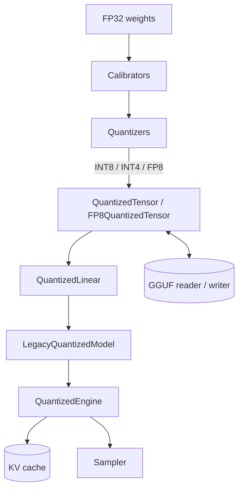

# Vector Quantized LLM

A from-scratch, NumPy-only quantization library for large language models. It implements
weight quantization (INT8, INT4, FP8 E4M3/E5M2), the GPTQ and AWQ/SmoothQuant algorithms,
post-training calibration, a GGUF reader/writer, and a small autoregressive inference engine
with a KV cache — all without PyTorch or external quantization kernels.

## Features

- **INT8 / INT4 weight quantization** — per-tensor, per-channel, and per-group scaling, with
  symmetric and asymmetric modes (`INT8Quantizer`, `INT4Quantizer`, `quantize_int8`,
  `quantize_int4` in `core/types.py`).
- **INT4 bit packing** — two 4-bit values packed per byte, with signed/unsigned unpacking
  (`pack_int4` / `unpack_int4`).
- **FP8 quantization** — full E4M3 and E5M2 encode/decode implemented by hand at the bit level
  (`FP8Quantizer`, `float_to_fp8_e4m3`, `fp8_e5m2_to_float`, `FP8QuantizedTensor`).
- **GPTQ** — Hessian-damped, activation-ordered, column-by-column quantization with error
  feedback (`GPTQQuantizer`).
- **AWQ** — activation-aware scale search that protects salient weight channels
  (`AWQQuantizer`).
- **SmoothQuant** — migrates quantization difficulty between activations and weights via a
  per-channel smoothing factor (`SmoothQuantQuantizer`).
- **Calibration** — MinMax, percentile, and MSE grid-search calibrators plus a Hessian
  collector for GPTQ and an activation collector for AWQ (`calibration/calibrate.py`).
- **Inference engine** — a quantized transformer with INT-quantized linear layers, a
  pre-allocated KV cache, and temperature / top-k / top-p sampling (`inference/engine.py`).
- **GGUF I/O** — a from-scratch reader and writer for the llama.cpp GGUF v3 container, with
  metadata key/value parsing and tensor type tables (`formats/gguf.py`).

## Architecture



| Component | Module | Responsibility |
|-----------|--------|----------------|
| Core types | `core/types.py` | `QuantConfig`, `QuantizedTensor`, `FP8QuantizedTensor`, `QuantizedLinear`, pack/unpack and FP8 kernels |
| Quantizers | `quantize/quantizers.py` | INT8/INT4/FP8 quantizers plus GPTQ, AWQ, SmoothQuant |
| Calibration | `calibration/calibrate.py` | MinMax/percentile/MSE calibrators, Hessian and activation collectors |
| Inference | `inference/engine.py` | `QuantizedEngine`, `KVCache`, batching, sampling, benchmarking |
| GGUF format | `formats/gguf.py` | `GGUFReader`, `GGUFWriter`, `GGUFMetadata`, type tables |

## Quick Start

### Prerequisites

- Python 3.9+
- NumPy 1.24+ (the only runtime dependency). No GPU or external services are needed.

### Installation

```bash
cd 41-vector-quantized-llm
pip install -e ".[dev]"
```

### Running

This is a library; exercise it from Python or run the test suite:

```bash
pytest tests/ -v
```

## Usage

Quantize a weight matrix to INT4 with per-group scales and measure the compression ratio:

```python
import numpy as np
from vqllm import INT4Quantizer, QuantConfig, ScaleType

weight = np.random.randn(256, 512).astype(np.float32)

config = QuantConfig(bits=4, scale_type=ScaleType.PER_GROUP, group_size=128, symmetric=True)
quantizer = INT4Quantizer(config)
qtensor = quantizer.quantize_weight(weight, name="mlp.down_proj")

recovered = qtensor.dequantize()
print("compression:", weight.nbytes / qtensor.nbytes)
print("max abs error:", np.abs(weight - recovered.reshape(weight.shape)).max())
```

GPTQ quantization with a Hessian and FP8 encoding:

```python
import numpy as np
from vqllm import GPTQQuantizer, FP8Quantizer, QuantConfig, ScaleType

w = np.random.randn(128, 256).astype(np.float32)

# GPTQ: Hessian-aware INT4
gptq = GPTQQuantizer(QuantConfig(bits=4, scale_type=ScaleType.PER_GROUP, group_size=128))
hessian = np.eye(256, dtype=np.float32)
q = gptq.quantize_weight(w, name="attn.q_proj", hessian=hessian)

# FP8 E4M3
fp8 = FP8Quantizer(format="e4m3")
qf = fp8.quantize_weight(w)
print("fp8 bytes:", qf.nbytes, "format:", qf.format)
```

Run autoregressive generation through the quantized engine:

```python
import numpy as np
from vqllm import QuantConfig
from vqllm.inference.engine import LegacyQuantizedModel, QuantizedEngine, GenerationConfig

model = LegacyQuantizedModel(QuantConfig(bits=8), num_layers=2, hidden_size=128, num_heads=4)
engine = QuantizedEngine(model, max_batch_size=1)

prompt = np.array([[1, 5, 9, 12]])
out = engine.generate(prompt, GenerationConfig(max_length=16, do_sample=False))
print(out.shape)
```

Round-trip tensors through GGUF:

```python
import numpy as np
from vqllm import GGUFWriter, GGUFReader, GGUFMetadata

writer = GGUFWriter("model.gguf", GGUFMetadata(name="demo", block_count=2))
writer.add_tensor("blk.0.weight", np.random.randn(64, 64).astype(np.float16))
writer.write()

with GGUFReader("model.gguf") as reader:
    print(reader.list_tensors())
    w = reader.get_tensor("blk.0.weight")
```

## What's Real vs Simulated

- **Real:** All quantization math is fully implemented in NumPy — INT8/INT4 scaling and
  packing, FP8 E4M3/E5M2 bit encode/decode, the GPTQ column-update loop with error feedback,
  AWQ scale search, and SmoothQuant smoothing. The MinMax/percentile/MSE calibrators, the KV
  cache, the sampler, and the GGUF v3 reader/writer all run end to end and are covered by
  tests.
- **Simulated / illustrative:** The inference model (`LegacyQuantizedModel`) uses
  randomly-initialized weights and a character-level tokenizer in the calibration helpers —
  there are no pretrained weights, so generated tokens are not meaningful text. `QuantizedLinear`
  dequantizes weights before a plain NumPy matmul rather than using a fused low-bit kernel.
  There is no GPU, distributed, or CUDA path; everything is single-process CPU NumPy.

## Testing

```bash
pytest tests/ -v
```

The suite (`tests/`) covers the quantizers (`test_quantizers.py`), GGUF round-trips
(`test_gguf.py`), calibration (`test_calibration.py`), the inference engine and KV cache
(`test_inference.py`), and an end-to-end quantize-then-generate flow (`test_integration.py`).
No external services or hardware are required.

## Project Structure

```
41-vector-quantized-llm/
  README.md
  src/vqllm/
    core/types.py            # QuantConfig, QuantizedTensor, FP8, pack/unpack
    quantize/quantizers.py   # INT8/INT4/FP8, GPTQ, AWQ, SmoothQuant
    calibration/calibrate.py # MinMax/percentile/MSE, Hessian, activation
    inference/engine.py       # QuantizedEngine, KVCache, sampling
    formats/gguf.py          # GGUF reader/writer
  tests/                     # quantizer, GGUF, calibration, inference, integration
  docs/
    BLUEPRINT.md             # full architecture and design
    ARCHITECTURE.md          # deeper architecture notes
    API.md                   # API reference
    DEPLOYMENT.md            # deployment notes
```

## License

MIT — see ../LICENSE.
