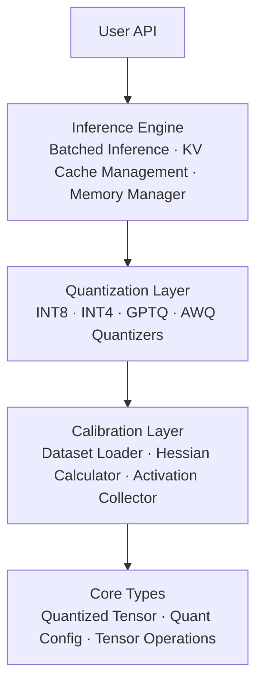
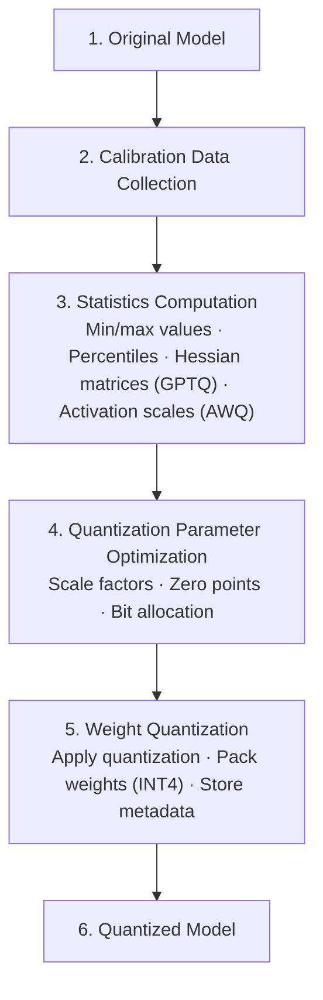
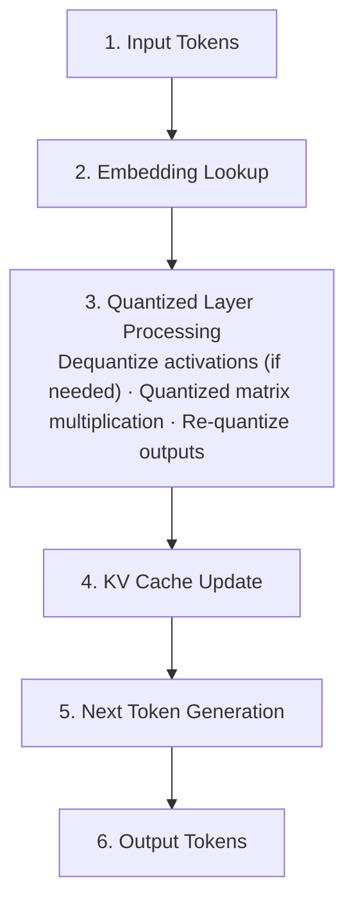

# Vector Quantized LLM - Architecture

## Overview

The Vector Quantized LLM project provides a high-performance quantization framework for Large Language Models (LLMs), supporting multiple quantization methods including INT8, INT4, GPTQ, and AWQ. This system enables efficient deployment of LLMs with reduced memory footprint and improved inference speed while maintaining model quality.

## System Architecture



## Core Components

### 1. Quantization Engine

The quantization engine is the heart of the system, providing multiple quantization strategies:

#### INT8 Quantizer
- **Purpose**: 8-bit integer quantization for balanced performance and accuracy
- **Method**: Symmetric or asymmetric quantization with per-channel or per-tensor scaling
- **Key Features**:
  - Dynamic range calibration
  - Zero-point optimization
  - Outlier handling

#### INT4 Quantizer
- **Purpose**: 4-bit integer quantization for maximum compression
- **Method**: Packed 4-bit representation with group-wise scaling
- **Key Features**:
  - Bit packing (2 INT4 values per byte)
  - Block-wise quantization
  - Adaptive scaling

#### GPTQ Quantizer
- **Purpose**: Gradient-based Post-Training Quantization
- **Method**: Layer-wise optimal quantization using Hessian information
- **Key Features**:
  - Hessian-based error minimization
  - Optimal column ordering
  - Block-wise processing
  - Dampening for numerical stability

#### AWQ Quantizer
- **Purpose**: Activation-aware Weight Quantization
- **Method**: Weight scaling based on activation importance
- **Key Features**:
  - Channel-wise importance scoring
  - Activation-aware scaling
  - Group-wise quantization
  - Smooth scaling transitions

### 2. Calibration System

The calibration system collects statistics for optimal quantization:

```python
Calibration Pipeline:
1. Data Collection → Load calibration dataset
2. Statistics Gathering → Collect activation/weight statistics
3. Optimization → Compute optimal scales and zero-points
4. Validation → Verify quantization quality
```

#### Components:

**CalibrationDataset**
- Manages calibration data loading and batching
- Supports text, token, and activation inputs
- Provides shuffling and sampling capabilities

**HessianCalibrator**
- Computes Hessian matrices for GPTQ quantization
- Implements incremental updates for memory efficiency
- Applies dampening for numerical stability

**ActivationCalibrator**
- Collects activation statistics for AWQ
- Computes channel-wise importance scores
- Implements smoothing algorithms

### 3. Inference Engine

The inference engine provides optimized execution for quantized models:

#### Key Features:

**Batched Inference**
- Dynamic batching for throughput optimization
- Continuous batching with variable sequence lengths
- Priority-based request scheduling

**KV Cache Management**
- Efficient key-value caching for autoregressive generation
- Memory-mapped cache for large models
- Cache reuse across batches

**Memory Management**
- Memory pool allocation
- Tensor aliasing for reduced memory usage
- Automatic garbage collection

### 4. Optimization Techniques

#### Kernel Fusion
Combines multiple operations into single kernels:
```
Quantize → MatMul → Dequantize → Add
          ↓
    Fused_Quant_MatMul_Add
```

#### Graph Optimization
Removes redundant operations:
```
Before: Dequantize → Quantize → Operation
After:  Operation (direct on quantized tensors)
```

#### Weight Packing
Efficient storage for INT4 weights:
```
Original: [4, 7, -3, 2] (4 bytes as INT8)
Packed:   [0x47, 0xD2] (2 bytes, 2 INT4s per byte)
```

## Data Flow

### Quantization Flow



### Inference Flow



## Memory Layout

### Quantized Tensor Structure

```
QuantizedTensor:
├── data: Quantized values (INT8/INT4)
├── scale: Scaling factors (FP32)
├── zero_point: Zero points (INT8)
├── shape: Original tensor shape
├── config: Quantization configuration
└── metadata: Additional information
```

### Memory Optimization

**INT8 Layout:**
```
[Original FP32: 4 bytes] → [INT8: 1 byte + scale: 4 bytes/group]
Compression: ~3.5-4x
```

**INT4 Layout:**
```
[Original FP32: 4 bytes] → [INT4: 0.5 bytes + scale: 4 bytes/group]
Compression: ~7-8x
```

## Performance Characteristics

### Latency Breakdown

| Component | Typical Latency | Percentage |
|-----------|----------------|------------|
| Quantized MatMul | 3-5ms | 40% |
| Dequantization | 1-2ms | 15% |
| KV Cache Access | 1-2ms | 15% |
| Activation Quant | 1ms | 10% |
| Other Operations | 2-3ms | 20% |

### Memory Usage

| Model Size | FP32 | INT8 | INT4 | GPTQ-4bit | AWQ-4bit |
|------------|------|------|------|-----------|----------|
| 7B params | 28GB | 7GB | 3.5GB | 4GB | 4GB |
| 13B params | 52GB | 13GB | 6.5GB | 7.5GB | 7.5GB |
| 70B params | 280GB | 70GB | 35GB | 40GB | 40GB |

## Extensibility

### Adding New Quantization Methods

1. Implement the `Quantizer` base class:
```python
class NewQuantizer(Quantizer):
    def quantize_weight(self, weight, name):
        # Implementation
        pass
```

2. Add calibration support if needed
3. Implement optimized kernels
4. Register in the quantizer factory

### Custom Optimization Passes

The system supports custom optimization passes:
```python
def custom_optimization(graph):
    # Modify computation graph
    return optimized_graph

engine.register_optimization(custom_optimization)
```

## Configuration

### Quantization Configuration

```python
config = QuantConfig(
    quant_type=QuantType.GPTQ,
    bits=4,
    group_size=128,
    block_size=128,
    dampening=0.01,
    scale_type=ScaleType.PER_GROUP,
    zero_point=True,
    symmetric=False
)
```

### Inference Configuration

```python
inference_config = {
    "batch_size": 8,
    "max_seq_length": 2048,
    "use_kv_cache": True,
    "memory_pool_size": "16GB",
    "optimization_level": 2,
    "device": "cuda"
}
```

## Best Practices

1. **Calibration Data Selection**
   - Use representative data from target domain
   - Include diverse examples
   - Minimum 100-500 samples recommended

2. **Quantization Method Selection**
   - INT8: Good balance of speed and quality
   - INT4: Maximum compression, slight quality loss
   - GPTQ: Best quality for low-bit quantization
   - AWQ: Optimized for specific activation patterns

3. **Performance Tuning**
   - Adjust batch size for throughput vs latency
   - Enable KV cache for long sequences
   - Use memory pooling for large models
   - Profile and optimize hot paths

## Monitoring and Debugging

### Metrics Collection

The system provides comprehensive metrics:
- Quantization error rates
- Inference latency percentiles
- Memory usage statistics
- Cache hit rates
- Throughput measurements

### Debug Mode

Enable detailed logging:
```python
import logging
logging.basicConfig(level=logging.DEBUG)
```

### Profiling Support

Built-in profiling capabilities:
```python
with profiler.profile() as prof:
    output = engine.forward(input)
prof.print_stats()
```