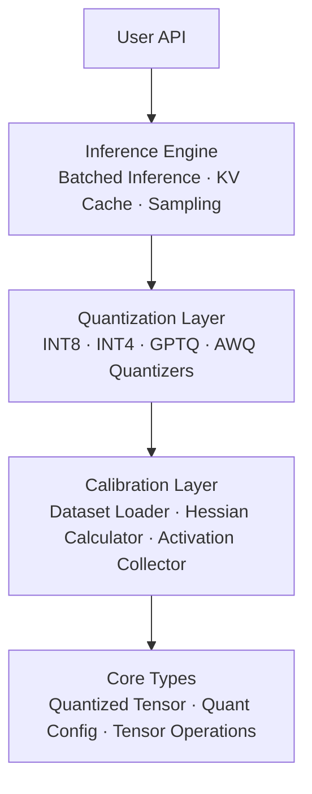
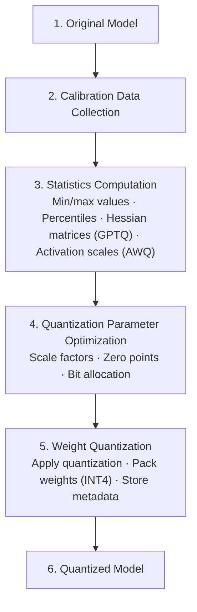
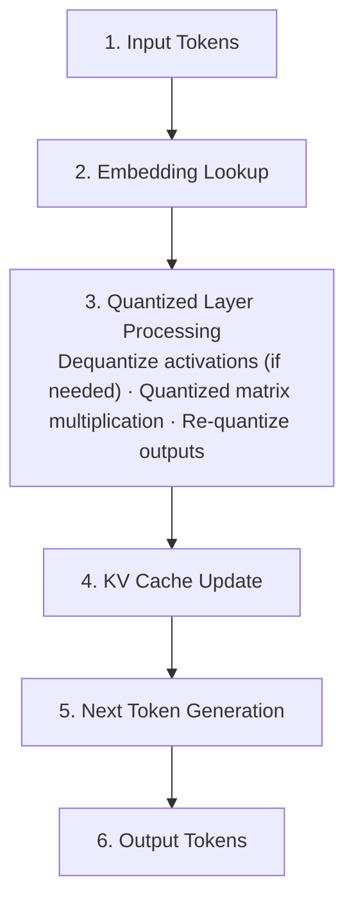

# Vector Quantized LLM - Architecture

## Overview

The Vector Quantized LLM project provides a high-performance quantization framework for Large Language Models (LLMs), supporting multiple quantization methods including INT8, INT4, GPTQ, and AWQ. This system enables efficient deployment of LLMs with reduced memory footprint and improved inference speed while maintaining model quality.

## System Architecture



## Core Components

### 1. Quantization Engine

The quantization engine is the heart of the system, providing multiple quantization strategies:

#### INT8 Quantizer
- **Purpose**: 8-bit integer quantization for balanced performance and accuracy
- **Method**: Symmetric or asymmetric quantization with per-channel or per-tensor scaling
- **Key Features**:
  - Dynamic range calibration
  - Zero-point optimization
  - Outlier handling

#### INT4 Quantizer
- **Purpose**: 4-bit integer quantization for maximum compression
- **Method**: Packed 4-bit representation with group-wise scaling
- **Key Features**:
  - Bit packing (2 INT4 values per byte)
  - Block-wise quantization
  - Adaptive scaling

#### GPTQ Quantizer
- **Purpose**: Gradient-based Post-Training Quantization
- **Method**: Layer-wise optimal quantization using Hessian information
- **Key Features**:
  - Hessian-based error minimization
  - Optimal column ordering
  - Block-wise processing
  - Dampening for numerical stability

#### AWQ Quantizer
- **Purpose**: Activation-aware Weight Quantization
- **Method**: Weight scaling based on activation importance
- **Key Features**:
  - Channel-wise importance scoring
  - Activation-aware scaling
  - Group-wise quantization
  - Smooth scaling transitions

### 2. Calibration System

The calibration system collects statistics for optimal quantization:

```python
Calibration Pipeline:
1. Data Collection → Load calibration dataset
2. Statistics Gathering → Collect activation/weight statistics
3. Optimization → Compute optimal scales and zero-points
4. Validation → Verify quantization quality
```

#### Components:

**CalibrationDataset**
- Manages calibration data loading and batching
- Supports text, token, and activation inputs
- Provides shuffling and sampling capabilities

**HessianCalibrator**
- Computes Hessian matrices for GPTQ quantization
- Implements incremental updates for memory efficiency
- Applies dampening for numerical stability

**ActivationCalibrator**
- Collects activation statistics for AWQ
- Computes channel-wise importance scores
- Implements smoothing algorithms

### 3. Inference Engine

The inference engine provides optimized execution for quantized models:

#### Key Features:

**Batched Inference** (`BatchedInference`)
- Priority-based request scheduling via a `heapq` max-heap (negative priority, insertion-order
  tiebreak)
- Padded batch construction with an attention mask (`create_padded_batch`)
- Continuous-batching-style helpers (`create_batch`, `get_next_batch_ids`,
  `should_process_batch`)

**KV Cache Management** (`KVCache` / `LegacyKVCache`)
- Efficient key-value caching for autoregressive generation
- Pre-allocated cache arrays reused across generations via `reset()` / `clear()`
- `memory_usage()` reports the cache byte footprint

**Generation** (`QuantizedEngine.generate`)
- Autoregressive loop that processes the prompt, then feeds one token at a time
- Temperature, top-k, and nucleus (top-p) sampling, plus greedy decoding

### 4. Optimization Techniques

Note: `QuantizedLinear` dequantizes weights to FP32 and uses a plain NumPy matmul — there are no
fused low-bit kernels. The optimizations below are the ones actually implemented.

#### Graph Optimization
`optimize_inference(graph)` removes redundant `dequantize → quantize` pairs from a small
dict-based graph representation:
```
Before: Dequantize → Quantize → Operation
After:  Operation
```

#### Weight Packing
Efficient storage for INT4 weights via `pack_int4` / `unpack_int4` (two 4-bit values per byte):
```
Original: [4, 7, -3, 2] (4 bytes as INT8)
Packed:   [0x47, 0xD2] (2 bytes, 2 INT4s per byte)
```

## Data Flow

### Quantization Flow



### Inference Flow



## Memory Layout

### Quantized Tensor Structure

```
QuantizedTensor:
├── data: Quantized values (INT8/INT4)
├── scale: Scaling factors (FP32)
├── zero_point: Zero points (INT8)
├── shape: Original tensor shape
├── config: Quantization configuration
└── metadata: Additional information
```

### Memory Optimization

**INT8 Layout:**
```
[Original FP32: 4 bytes] → [INT8: 1 byte + scale: 4 bytes/group]
Compression: ~3.5-4x
```

**INT4 Layout:**
```
[Original FP32: 4 bytes] → [INT4: 0.5 bytes + scale: 4 bytes/group]
Compression: ~7-8x
```

## Performance Characteristics

### Latency Breakdown

| Component | Typical Latency | Percentage |
|-----------|----------------|------------|
| Quantized MatMul | 3-5ms | 40% |
| Dequantization | 1-2ms | 15% |
| KV Cache Access | 1-2ms | 15% |
| Activation Quant | 1ms | 10% |
| Other Operations | 2-3ms | 20% |

### Memory Usage

| Model Size | FP32 | INT8 | INT4 | GPTQ-4bit | AWQ-4bit |
|------------|------|------|------|-----------|----------|
| 7B params | 28GB | 7GB | 3.5GB | 4GB | 4GB |
| 13B params | 52GB | 13GB | 6.5GB | 7.5GB | 7.5GB |
| 70B params | 280GB | 70GB | 35GB | 40GB | 40GB |

## Extensibility

### Adding New Quantization Methods

1. Subclass the `Quantizer` base class (in `quantize/quantizers.py`) and implement its abstract
   `quantize_weight` method, returning a `QuantizedTensor`:
```python
from vqllm.quantize import Quantizer
from vqllm import QuantizedTensor

class NewQuantizer(Quantizer):
    def quantize_weight(self, weight, name="") -> QuantizedTensor:
        # Implementation
        ...
```

2. Add calibration support if needed (see `calibration/calibrate.py`)
3. Instantiate the quantizer directly with a `QuantConfig` and call `quantize_weight` — there is
   no registry or factory; quantizers are plain classes constructed at the call site.

### Graph Optimization Helper

The inference module ships a standalone `optimize_inference(graph)` helper that walks a small
dict-based graph representation and removes redundant `dequantize → quantize` pairs that cancel
out:

```python
from vqllm.inference.engine import optimize_inference

optimized = optimize_inference(graph)
```

There is no plugin/registry mechanism — optimization is applied by calling this function
directly on a graph.

## Configuration

### Quantization Configuration

`QuantConfig` (in `core/types.py`) carries the quantization parameters:

```python
from vqllm import QuantConfig, QuantType, ScaleType

config = QuantConfig(
    quant_type=QuantType.GPTQ,
    bits=4,
    group_size=128,
    block_size=128,
    dampening=0.01,
    scale_type=ScaleType.PER_GROUP,
    zero_point=True,
    symmetric=False,
)
```

### Generation Configuration

Inference-time behavior is controlled by the `GenerationConfig` dataclass (in
`inference/engine.py`), which the `QuantizedEngine.generate` loop consumes:

```python
from vqllm import GenerationConfig

gen_config = GenerationConfig(
    max_length=100,
    temperature=1.0,
    top_k=50,
    top_p=0.9,
    do_sample=True,
    num_beams=1,
    repetition_penalty=1.0,
)
```

Everything runs single-process on CPU with NumPy; there is no device, memory-pool, or CUDA
configuration.

## Best Practices

1. **Calibration Data Selection**
   - Use representative data from target domain
   - Include diverse examples
   - Minimum 100-500 samples recommended

2. **Quantization Method Selection**
   - INT8: Good balance of speed and quality
   - INT4: Maximum compression, slight quality loss
   - GPTQ: Best quality for low-bit quantization
   - AWQ: Optimized for specific activation patterns

3. **Performance Tuning**
   - Adjust batch size for throughput vs latency
   - Enable KV cache for long sequences
   - Use memory pooling for large models
   - Profile and optimize hot paths

## Monitoring and Debugging

### Benchmarking

The inference module exposes two benchmarking helpers (in `inference/engine.py`):

- `benchmark_latency(model, input_data, num_runs=100, warmup=10)` — a free function that runs
  warmup and timed forward passes and returns a latency summary
  (`mean/std/min/max/p50/p95/p99`, in milliseconds).
- `QuantizedEngine.benchmark(input_ids, num_tokens=100)` — times greedy generation and returns
  `total_time_s`, `tokens_generated`, `tokens_per_second`, and `ms_per_token`.

```python
from vqllm.inference.engine import benchmark_latency

stats = benchmark_latency(model, input_data, num_runs=100, warmup=10)
print(stats["p95"])
```

`KVCache.memory_usage()` reports the cache's byte footprint. There is no built-in profiler,
metrics collector, or cache-hit tracking beyond these helpers.

### Debug Mode

The modules log through the standard library `logging` package, so detailed logging can be
enabled with:
```python
import logging
logging.basicConfig(level=logging.DEBUG)
```