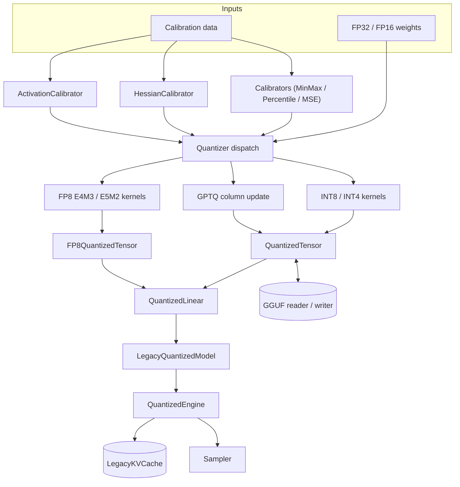

# Vector Quantized LLM

## Overview

Vector Quantized LLM (`vqllm`) is a from-scratch quantization library for large language
models, implemented entirely in NumPy. It exists to make the mechanics of low-bit LLM
quantization legible: how floating-point weights are mapped to INT8, INT4, and FP8
representations; how scales and zero-points are chosen; how advanced post-training algorithms
(GPTQ, AWQ, SmoothQuant) reduce the accuracy cost of aggressive quantization; and how the
resulting tensors are stored, loaded, and run through a small autoregressive engine.

The project deliberately avoids PyTorch, CUDA, and third-party quantization kernels. Every
numeric step — rounding, clamping, bit packing, FP8 exponent/mantissa encoding, the GPTQ
Hessian update — is written out in plain array operations so the algorithm *is* the code rather
than a call into an opaque library. NumPy 1.24+ is the only runtime dependency, and everything
runs single-process on CPU. This makes it a teaching artifact for the following concepts:

- **Uniform affine quantization.** Mapping a real range to an integer grid via a scale and an
  optional zero-point, at per-tensor, per-channel, and per-group granularity.
- **Sub-byte packing.** Storing two INT4 values per byte and recovering signed values on
  unpack.
- **Floating-point microformats.** Encoding numbers into 8-bit E4M3 and E5M2 formats, including
  denormals, clamping, and the inf/NaN handling that distinguishes the two.
- **Error-aware post-training quantization.** GPTQ's Hessian-weighted column updates, AWQ's
  activation-aware scale search, and SmoothQuant's difficulty migration.
- **Calibration.** Choosing quantization parameters from representative data using MinMax,
  percentile, and MSE objectives, plus Hessian and activation-scale collection.
- **Inference plumbing.** A KV cache, batched request handling, and temperature/top-k/top-p
  sampling.
- **Model serialization.** A working reader and writer for the GGUF v3 container used by
  llama.cpp.

Scope is intentionally bounded. The inference model uses randomly-initialized weights, so it
demonstrates the data flow of quantized inference rather than producing meaningful text. There
is no GPU path and no distributed execution; the value is in the correctness and clarity of the
quantization primitives, which are exercised by a substantial test suite (`tests/`). The design
goal throughout is *readability first*: where a fused low-bit kernel would be faster, the code
instead dequantizes to FP32 and uses a plain matmul, because the point is to show the numeric
transformation, not to compete with production runtimes.

The public API is re-exported flat from `vqllm/__init__.py`, so the common types
(`QuantConfig`, `QuantizedTensor`, `INT4Quantizer`, `GPTQQuantizer`, `GGUFReader`, and so on)
are importable directly as `from vqllm import ...`. The five internal packages
(`core`, `quantize`, `calibration`, `inference`, `formats`) can also be imported directly for
the lower-level free functions.

## Architecture



The system is organized into five packages under `src/vqllm/`, each a separable layer:

- **`core`** (`core/types.py`) holds the data types and the primitive quantize/dequantize
  kernels. Everything else depends on it; it depends on nothing but NumPy. This is where the
  INT8/INT4 grid math, INT4 packing, and the hand-rolled FP8 bit encoders live.
- **`quantize`** (`quantize/quantizers.py`) wraps the core kernels in a `Quantizer` class
  hierarchy and adds the three advanced algorithms (GPTQ, AWQ, SmoothQuant). Each algorithm is
  a subclass overriding `quantize_weight`.
- **`calibration`** (`calibration/calibrate.py`) collects statistics from representative data
  and turns them into scales or Hessians the quantizers consume.
- **`inference`** (`inference/engine.py`) assembles quantized linear layers into a toy
  transformer and runs autoregressive generation over a KV cache, with batching and sampling
  helpers.
- **`formats`** (`formats/gguf.py`) serializes tensors and metadata to and from the GGUF
  container.

Data flows left to right: weights and calibration data enter, calibrators produce statistics,
quantizers produce `QuantizedTensor` / `FP8QuantizedTensor` objects, those feed
`QuantizedLinear` layers inside the model, and the engine generates tokens. The GGUF layer sits
to the side as an alternative persistence path — it is not on the inference hot path but shares
the tensor arrays with the rest of the system.

Dependency direction is strictly downward: `inference` depends on `core`; `quantize` depends on
`core`; `calibration` depends only on `core` types (`QuantConfig`, `QuantType`); `formats`
depends on nothing inside the package (only `struct` and NumPy). This keeps each layer testable
in isolation and mirrors the test-file split.

### Design principles

A few decisions recur across the codebase and are worth stating explicitly, because they
explain choices that would otherwise look like omissions:

- **The algorithm is the code.** No step is delegated to a library that would hide it. The GPTQ
  update, the FP8 exponent math, and the INT4 packing are all spelled out in array operations.
  This is why, for example, the FP8 encoders loop in Python instead of calling a vectorized
  cast — the loop is the pedagogically important part.
- **Scales are always guarded.** Every kernel replaces a zero scale with `1.0` before dividing.
  Rather than special-casing dead channels downstream, the invariant "a scale is never zero" is
  established at the point of computation, so `dequantize` and every consumer can divide/multiply
  freely.
- **Graceful degradation over exceptions on shape mismatch.** The per-group dequant path falls
  back to per-channel when the input is too small to form a group, instead of raising. This
  keeps small test tensors and toy models working without special configuration.
- **Compatibility aliases at the boundary.** `QuantizedTensor` accepts both `scales`/`scale`
  and `zeros`/`zero_point`, and AWQ accepts both `act_scales`/`activation_scale`. This is a
  deliberate ergonomic choice so callers coming from different quantization vocabularies can use
  the names they expect; `__post_init__` reconciles the pair so downstream code reads one
  canonical name.
- **Legacy and modern variants coexist.** The inference layer ships both a modern `KVCache`
  (`[batch, seq, hidden]`) and a `LegacyKVCache` (`[layers, batch, heads, seq, head_dim]`), and
  both `QuantizedModel` and `LegacyQuantizedModel`. The engine wires the legacy pair because its
  attention reshapes into explicit head dimensions; the modern types exist for callers who want
  the flatter layout.

### The two-tensor split

A recurring architectural decision is the split between integer and floating-point quantized
tensors. Integer quantization (INT8, INT4, and the INT4-producing GPTQ/AWQ) produces a
`QuantizedTensor`: an integer grid plus per-tensor/per-channel/per-group `scales` and optional
`zeros`. Floating-point quantization (FP8) produces an `FP8QuantizedTensor`: `uint8`-encoded
FP8 bytes plus scales and a `format` string. They are separate dataclasses because their
dequantization paths differ fundamentally — integer dequant is `(q - zero) * scale`, while FP8
dequant decodes each byte through the E4M3/E5M2 bit format and then applies a scale. Keeping
them distinct avoids a single overloaded `dequantize` with mode flags.

## Core Components

### Core types and kernels (`core/types.py`)

This module is the foundation, at ~710 lines the largest single file. It defines the
configuration and tensor types and the primitive quantization functions.

**`QuantType`** enumerates supported representations: `INT8`, `INT4`, `INT2`, `FP16`, `FP8`,
`FP8_E4M3`, `FP8_E5M2`, `NF4`, `GPTQ`, `AWQ`. Note that several members intentionally share
underlying values (e.g. `INT8` and `FP8` are both `8`; `INT4` and `NF4` are both `4`) — the
enum doubles as a bit-width hint for the integer types and a named tag for the algorithmic
types. **`ScaleType`** enumerates granularity: `PER_TENSOR`, `PER_CHANNEL`, `PER_GROUP`,
`PER_TOKEN`.

**`QuantConfig`** is the central dataclass and the contract passed between every layer. It
carries the bit width, quant type, scale type, group size, symmetry flag, and zero-point flag,
plus calibration knobs (`num_calibration_samples`, `calibration_method`), advanced flags
(`use_double_quant`, `fp16_logits`, `model_seqlen`), and GPTQ-specific fields (`block_size`,
`dampening`). Defaults are 8-bit, per-channel, symmetric, group size 128.

**`QuantizedTensor`** stores the quantized `data` array alongside `scales` and optional `zeros`
(zero-points), the bit width, the scale type, the group size, and the `original_shape`. It
supports alternate attribute names `scale`/`zero_point` for compatibility — reconciled in
`__post_init__`, which copies whichever of the pair was supplied into the other so both are
always populated. It also holds an optional `config` back-reference and an `activation_scale`
field used by AWQ for inspection. Its core method is `dequantize()`, which branches on
`scale_type`:

```python
def dequantize(self) -> np.ndarray:
    if self.bits == 4:
        data = unpack_int4(self.data)   # signed [-8, 7]
    else:
        data = self.data.astype(np.float32)

    if self.scale_type == ScaleType.PER_TENSOR:
        if self.zeros is not None:
            data = data - self.zeros
        return data * self.scales
    elif self.scale_type == ScaleType.PER_CHANNEL:
        if self.zeros is not None:
            data = data - self.zeros.reshape(-1, 1)
        return data * self.scales.reshape(-1, 1)
    elif self.scale_type == ScaleType.PER_GROUP:
        num_groups = data.shape[1] // self.group_size
        if num_groups == 0:
            # Fallback to per-channel when there are too few columns for a group
            ...
        data = data.reshape(data.shape[0], num_groups, self.group_size)
        scales = self.scales.reshape(data.shape[0], num_groups, 1)
        ...
        return (data * scales).reshape(self.original_shape)
```

The per-group branch has an explicit fallback: if `num_groups == 0` (the input dimension is
smaller than `group_size`), it degrades gracefully to per-channel dequantization rather than
raising. This is an intentional edge-case handling that the tests exercise.

It also exposes `nbytes` / `memory_usage()` (data + scales + zeros), `shape` (returns
`original_shape` when set, else the raw data shape), `dtype`, `is_quantized`, and `save`/`load`
to and from `.npz` via `np.savez`. The `packed_data` property is an alias for `data` used when
callers want to be explicit about the INT4-packed representation.

**Integer quantization kernels.** `quantize_int8` and `quantize_int4` are the workhorses. Each
branches on `ScaleType` and on `symmetric`. Symmetric INT8 per-channel quantization, for
example, divides by the absolute per-row maximum scaled to the 127 grid:

```python
scales = np.abs(tensor).max(axis=1) / 127.0
scales = np.where(scales == 0, 1, scales)     # avoid divide-by-zero on all-zero rows
qtensor = np.clip(np.round(tensor / scales.reshape(-1, 1)), -128, 127).astype(np.int8)
```

Asymmetric mode instead spans `[min, max]` onto `[0, 255]` and stores a per-row zero-point
`round(-min / scale)`, returning a `uint8` grid. Per-group mode reshapes `[out, in]` into
`[out, num_groups, group_size]` and computes a scale per group. INT4 uses the same structure
with a `[-8, 7]` (symmetric, dividing by `7.0`) or `[0, 15]` (asymmetric, dividing by `15.0`)
grid and then packs the result. In every branch the `np.where(scales == 0, 1, scales)` guard
ensures an all-zero channel or group never produces a NaN — a small but load-bearing detail
that keeps the round-trip total for degenerate inputs.

**Bit packing.** `pack_int4` flattens the array, pads to an even length with a trailing zero,
and packs pairs into bytes: `(low & 0xF) | ((high & 0xF) << 4)`, reshaping to
`[rows, -1]`. `unpack_int4` reverses this, extracting the low nibble (`x & 0xF`) and high nibble
(`(x >> 4) & 0xF`), and, when `signed=True`, remaps values `>= 8` to their negative
two's-complement equivalent (`x - 16`) so the `[-8, 7]` range is recovered correctly. Unpacked
values are returned as `float32` and interleaved back to the original width. Because packing
halves storage, INT4's data array is exactly half the byte count of the equivalent INT8 grid.

**FP8 microformats.** The module implements the two OCP FP8 formats from first principles, at
the bit level. E4M3 uses a 4-bit exponent (bias 7), a 3-bit mantissa, a `[-448, 448]` range,
and no inf/NaN; E5M2 uses a 5-bit exponent (bias 15), a 2-bit mantissa, a `[-57344, 57344]`
range, and does support inf/NaN. `float_to_fp8_e4m3` handles zero, splits off the sign, clamps
to the representable range, handles denormals below `2**-6` (mantissa = `round(value / 2**-9)`),
computes a biased exponent via `floor(log2(value)) + 7`, rounds a 3-bit mantissa from
`(value / 2**exp) - 1`, clamps the biased exponent to `[0, 15]`, and assembles the byte
`(sign << 7) | (exp_biased << 3) | mantissa`. The maximum finite value `448` is encoded
specially as exponent 15, mantissa 6. `fp8_e4m3_to_float` inverts it: exponent 0 decodes as a
denormal (`mantissa * 2**-9`), otherwise as `(1 + mantissa/8) * 2**(exp - 7)`.

The E5M2 pair mirrors this with a 2-bit mantissa (`round(... * 4)`, bias 15) and adds the
special-value encodings: `float_to_fp8_e5m2` returns `0x7F` for NaN and `(sign << 7) | 0x7C`
for infinity; `fp8_e5m2_to_float` decodes exponent 31 with mantissa 0 as `±inf` and with a
non-zero mantissa as `NaN`.

On top of the scalar encoders, `quantize_fp8_e4m3` / `quantize_fp8_e5m2` add per-tensor or
per-channel scaling: they compute a scale that maps the tensor's absolute max onto the format's
max (`abs_max / FP8_E4M3_MAX`), divide, then encode each element. The encode loop is a Python
`for` loop over elements — the clearest expression of the bit math, and acceptable for the
test-sized tensors used here. `FP8QuantizedTensor` wraps the encoded `uint8` bytes, the scales,
and the format string, and its `dequantize()` dispatches to `dequantize_fp8_e4m3` /
`dequantize_fp8_e5m2`, decoding each byte and re-applying the scale.

**`QuantizedLinear`** is a layer that owns a `QuantizedTensor` weight and an optional bias.
`quantize_weight` calls the INT8 or INT4 kernel per its config (raising on any other bit width);
`forward` dequantizes the weight and computes `x @ weight.T` (plus optional bias). It is
callable (`__call__` delegates to `forward`). This is the deliberately simple, unfused path:
each forward pass reconstructs FP32 weights and does a standard matmul, trading speed for a
transparent data flow.

### Quantizers (`quantize/quantizers.py`)

`Quantizer` is an abstract base with an abstract `quantize_weight(weight, name)` method,
calibration-stat storage (`set_calibration_stats` / `get_calibration_stats`), and a generic
`quantize_model` that walks `named_parameters` and replaces each 2-D `*.weight` with its
quantized form. The concrete subclasses are:

- **`INT8Quantizer` / `INT4Quantizer`** — thin wrappers that default their config to the right
  bit width and quant type, call the corresponding core kernel, and box the result in a
  `QuantizedTensor` (carrying `original_shape` and a `config` back-reference).

- **`FP8Quantizer`** — selects E4M3 or E5M2 by a `format` argument, validating it in
  `__init__` (raising `ValueError` on anything but `"e4m3"`/`"e5m2"`), and returns an
  `FP8QuantizedTensor`. It documents the intended use of each format (E4M3 for forward
  weights/activations, E5M2 for gradients) and overrides `quantize_model` for mixed-precision
  application.

- **`GPTQQuantizer`** — implements GPTQ. Its constructor takes `actorder` (default `True`) and
  `percdamp` (default `0.01`) and defaults the config to 4-bit per-group. `quantize_weight`
  first copies the weight (the algorithm mutates it), builds a Hessian (an identity if none is
  supplied), dampens the diagonal (`H + percdamp * mean(diag(H)) * I`), and — when `actorder` is
  on — reorders columns by descending Hessian diagonal so the most salient inputs are quantized
  first. It then quantizes group by group and, within each group, column by column with error
  feedback into the not-yet-quantized columns:

  ```python
  for col in range(start, end):
      w = W[:, col]
      if self.config.symmetric:
          q = np.clip(np.round(w / scales[:, g]), -8, 7)
      else:
          q = np.clip(np.round(w / scales[:, g]) + zeros[:, g], 0, 15)
      Q[:, col] = q
      err = w - (q - (zeros[:, g] if not self.config.symmetric else 0)) * scales[:, g]
      if col < in_features - 1:
          W[:, col + 1:] -= np.outer(err, H[col, col + 1:]) / H[col, col]
  ```

  The rank-1 update `np.outer(err, H[col, col+1:]) / H[col, col]` is the heart of GPTQ: it
  pushes the quantization error of the current column into the remaining columns weighted by
  their Hessian correlation, so later columns compensate. After processing all groups it restores
  the original column order via the inverse permutation, packs to INT4, and returns a per-group
  `QuantizedTensor` (with `zeros` only in the asymmetric case). `_compute_optimal_order`
  exposes the activation-order computation (`argsort(diag(H))[::-1]`) separately.

- **`AWQQuantizer`** — Activation-aware Weight Quantization. Its constructor takes `w_bit`
  (default 4) and `auto_scale` (default `True`). It searches for a per-channel scale vector `s`
  that protects salient channels. `_search_optimal_scales` grid-searches an exponent `alpha`
  over `[0.5, 0.6, 0.7, 0.8, 0.9, 1.0]`, forms `s = act_scales**alpha` normalized to unit mean,
  scales the weight, quantizes to INT4, dequantizes, and keeps the `s` that minimizes
  reconstruction error. `quantize_weight` applies the chosen `s`, quantizes the scaled weight,
  and stores `act_scales` on the returned tensor's `activation_scale` field for inspection.
  It accepts both `act_scales` and the alias `activation_scale`. `_compute_activation_scale`
  derives per-channel scales (`abs(acts).max(axis=0)`) from a list of calibration activations.

- **`SmoothQuantQuantizer`** — migrates difficulty between activations and weights. Given a
  per-channel activation scale, it computes a smoothing factor
  `s = act_scales**alpha / w_scales**(1 - alpha)` (with `w_scales = abs(weight).max(axis=0)`),
  guards against NaN/inf (`np.where(isnan | isinf, 1.0, s)`), divides the weight by `s` (the
  activation would be multiplied by `s` at runtime), and quantizes the smoothed weight to INT8.
  `alpha` defaults to 0.5, the balanced midpoint between shifting all difficulty onto the
  weights versus the activations.

### Calibration (`calibration/calibrate.py`)

Calibration turns representative data into the statistics quantizers need.

- **`CalibrationDataset`** wraps a list of sample dicts with optional deterministic shuffling
  (seeded `RandomState`), indexing/iteration, batching (`get_batch` stacks per-key arrays),
  `save`/`load` to `.npz`, and a `from_texts` classmethod that does character-level
  tokenization (`ord(c) % 1000`, padded to `max_length`). This tokenizer is illustrative — it
  produces integer sequences of the right shape, not linguistically meaningful tokens.

- **`Calibrator`** is the base class. `collect_statistics` runs the model over the data and
  records min/max/mean/std plus a percentile table over `abs(concat)`;
  `compute_scale_factors` turns min/max into scales (`abs_max / 127.0`); `calibrate` returns a
  `(scale, zero)` pair from the data range using `abs_max / (2**(bits-1) - 1)`. A static
  `create(config)` factory picks the right subclass from the config's quant type
  (`GPTQ → HessianCalibrator`, `AWQ → ActivationCalibrator`, else base `Calibrator`).

- **`HessianCalibrator`** (for GPTQ) accumulates `H = H + X^T X` via `update_hessian`,
  initializes per-layer Hessians in `collect_layer_hessians` (identity scaled by `dampening`),
  and offers a `distributed_calibrate` shim that simply calls the single-process path (there is
  no real multi-GPU backend). The free function `compute_hessian` accumulates
  `sum(X^T X)` over a list of activation arrays, averages by the number of inputs, and adds
  `dampening * I`.

- **`ActivationCalibrator`** (for AWQ) computes per-channel activation scales
  (`compute_activation_scales` → `abs(stacked).max(axis=0)`), per-channel statistics
  (`compute_channel_statistics` → mean/std/max/min), scale smoothing
  (`smooth_scales` → `alpha*scales + (1-alpha)*mean_scale`), and cache save/load to `.npz`.

- **`MinMaxCalibrator`**, **`PercentileCalibrator`**, **`MSECalibrator`** implement the three
  objective functions over a flat concatenation of the data. MinMax uses the raw
  `abs_max`; Percentile clips to a configurable percentile (default 99.99) before computing the
  scale; MSE grid-searches a scale factor over `linspace(0.5, 1.0, 20)` and keeps the one
  minimizing reconstruction MSE:

  ```python
  for factor in np.linspace(0.5, 1.0, 20):
      scale = abs_max * factor / qmax
      quantized = np.clip(np.round(all_data / scale), -qmax - 1, qmax)
      mse = np.mean((all_data - quantized * scale) ** 2)
      if mse < best_mse:
          best_mse, best_scale = mse, scale
  ```

  The MSE search is the reason a percentile or MSE calibrator can beat naive min/max: by
  shrinking the scale below the extreme, it clips a few outliers but reduces the rounding error
  on the bulk of the distribution, lowering total reconstruction error.

- Module-level helpers `collect_activations` (aggregate mean/std/max across a list) and
  `collect_calibration_data` / `calibrate_model` provide the glue for running a model over a
  dataloader and mapping per-layer activations to `(scale, zero)` pairs.

### Inference (`inference/engine.py`)

This package assembles quantized layers into a runnable model and drives generation. It carries
both a "modern" and a "legacy" cache/model pair; the engine wires the legacy model to the
legacy cache.

- **`KVCache`** pre-allocates per-layer key and value buffers of shape
  `[max_batch, max_seq_len, hidden]`. `update(layer_idx, keys, values, seq_position)` writes
  into the buffer at the current position and returns the populated prefix; `get_keys` /
  `get_values`, `memory_usage`, `clear`/`reset`, and `increment` round out the interface. It
  tracks a running `seq_len` that advances as positions are written.

- **`LegacyKVCache`** uses the alternative layout
  `[layers, batch, heads, seq, head_dim]` and a `float16` default dtype, matching the shape the
  legacy model's attention expects. `update` writes a single position and returns the prefix;
  `memory_usage` is a property here (versus a method on `KVCache`).

- **`LegacyQuantizedModel`** is a small decoder-only transformer built from `QuantizedLinear`
  projections (`q/k/v/o_proj`, `gate/up/down_proj`) plus a random `float16` embedding table and
  a quantized LM head. Its `forward` embeds tokens, runs each layer's self-attention (with
  optional KV-cache update, scaled-dot-product softmax attention over reshaped heads) and a
  SiLU-gated FFN (`gate * sigmoid(gate) * up`, then `down_proj`) with residual connections, and
  projects to logits. Weights are random — this exercises the quantized data path, not a
  trained model, so generated tokens are not meaningful text.

- **`QuantizedModel`** and **`InferenceEngine`** are the more generic wrappers: `QuantizedModel`
  applies a precision map across a model's layers (dict or list) and delegates forward calls;
  `InferenceEngine` holds a model and offers `stream_generate`, an iterator that yields tokens
  one at a time.

- **`QuantizedEngine`** owns a `LegacyQuantizedModel` and a pre-allocated `LegacyKVCache`.
  `generate` runs the autoregressive loop: it resets the cache, processes the full prompt on
  step 0, then feeds one token at a time (`output_ids[:, -1:]`), advancing the cache with
  `increment()` and sampling each step. It stops early if every sequence emits token 0 (the
  padding/EOS id). `_sample` applies temperature scaling, top-k masking (keeps the top-k logits,
  sets the rest to `-inf`), a numerically-stable softmax (`exp(logits - max)`), and nucleus
  (top-p) truncation (zero out the tail beyond cumulative probability `top_p`, renormalize),
  then draws with `np.random.choice`. `benchmark` times greedy generation and reports
  `tokens_per_second` and `ms_per_token`.

- **`BatchedInference`** maintains a priority queue of requests via `heapq` (keyed on negative
  priority for max-heap behavior, with an insertion counter as a tiebreaker). `add_request`,
  `create_batch`, `create_padded_batch` (pads to the longest sequence and returns an attention
  mask), `get_next_batch_ids` (peek without consuming), and `should_process_batch` support
  continuous-batching-style scheduling decisions.

- Free helpers: `optimize_inference` walks a small graph representation and removes redundant
  `dequantize → quantize` pairs that cancel out; `benchmark_latency` runs warmup + timed forward
  passes and reports a percentile summary (`mean/std/min/max/p50/p95/p99`).

### GGUF format (`formats/gguf.py`)

A complete reader and writer for GGUF v3, the llama.cpp container, written directly against
`struct` with no external GGUF library.

- **`GGUFQuantType`** (an `IntEnum`) enumerates the GGUF tensor types (F32, F16, the Q4/Q5/Q8
  block formats, the K-quants, the IQ formats, integer widths I8–I64, F64, and BF16).
  **`GGUFValueType`** enumerates the metadata value types (the integer widths, float32/64, bool,
  string, and array). Two helpers, `_get_block_size` and `_get_type_size`, encode the block
  layout and bytes-per-element for the quantized block formats (e.g. Q4_0 is `0.5 + 2/32` bytes
  per element: 4 bits plus a scale per 32-element block).

- **`GGUFMetadata`** models the standard `general.*`, architecture (`llama.*`), and
  `tokenizer.ggml.*` key namespaces as typed dataclass fields, plus an `extra` dict for
  arbitrary keys. `to_dict` flattens the dataclass into the dotted-key form GGUF stores on disk
  (interpolating the architecture name into the arch-specific keys), and `from_dict` reverses
  it with per-key defaults.

- **`GGUFReader`** opens a file, validates the magic (`0x46554747`, "GGUF" little-endian) and
  version (warning if newer than 3), reads the tensor and key/value counts, parses every
  metadata value (`_read_value` handles all scalar types plus nested arrays via
  `_read_array_value`), reads tensor infos (`_read_tensor_info`), and computes the aligned data
  offset from `general.alignment` (default 32). `get_tensor(name)` seeks to
  `data_offset + info.offset` and decodes by type — direct `np.frombuffer` for F32/F16/int
  widths, a bit-shift reconstruction for BF16 (`raw << 16` viewed as `float32`), and raw bytes
  for the block-quantized types. It also exposes `get_metadata()` and `list_tensors()` and works
  as a context manager (`__enter__`/`__exit__`).

- **`GGUFWriter`** accepts metadata and tensors (`add_metadata`, `add_tensor` — inferring the
  GGUF type from the NumPy dtype, defaulting to F32 for unknown dtypes), encodes typed values
  (`_encode_value` picks the narrowest integer type that fits, and recursively encodes array
  elements), computes aligned tensor offsets, and writes the header, KV section, tensor-info
  section, alignment padding, and aligned tensor-data section (each tensor padded up to the
  alignment boundary). The free helpers `convert_to_gguf` and `load_from_gguf` wrap a full
  weights-dict round-trip.

## Data Structures

The configuration and tensor types are the contract between layers:

```python
@dataclass
class QuantConfig:
    bits: int = 8
    quant_type: QuantType = QuantType.INT8
    scale_type: ScaleType = ScaleType.PER_CHANNEL
    group_size: int = 128
    symmetric: bool = True
    desc_act: bool = False
    zero_point: bool = False
    # Calibration
    num_calibration_samples: int = 128
    calibration_method: str = "minmax"
    # Advanced
    use_double_quant: bool = False
    fp16_logits: bool = True
    model_seqlen: int = 2048
    # GPTQ specific
    block_size: int = 128
    dampening: float = 0.01
    use_multi_gpu: bool = False

@dataclass
class QuantizedTensor:
    data: np.ndarray                       # int8 grid, or packed uint8 for INT4
    scales: np.ndarray = None              # per-tensor / per-channel / per-group
    zeros: Optional[np.ndarray] = None     # zero-points (asymmetric only)
    bits: int = 8
    scale_type: ScaleType = ScaleType.PER_CHANNEL
    group_size: int = 128
    original_shape: Tuple[int, ...] = ()
    # Compatibility aliases (reconciled in __post_init__)
    scale: np.ndarray = None
    zero_point: np.ndarray = None
    config: 'QuantConfig' = None
    activation_scale: np.ndarray = None    # AWQ activation scales, for inspection

@dataclass
class FP8QuantizedTensor:
    data: np.ndarray            # uint8-encoded FP8
    scales: np.ndarray
    format: str                 # "e4m3" or "e5m2"
    scale_type: ScaleType = ScaleType.PER_TENSOR
    original_shape: Tuple[int, ...] = ()
```

The FP8 format constants pin the representable ranges the encoders clamp against:

```python
FP8_E4M3_MAX = 448.0      # 4-bit exp (bias 7), 3-bit mantissa, no inf/nan
FP8_E4M3_MIN = -448.0
FP8_E5M2_MAX = 57344.0    # 5-bit exp (bias 15), 2-bit mantissa, has inf/nan
FP8_E5M2_MIN = -57344.0
```

The GGUF tensor descriptor and metadata mirror the on-disk layout:

```python
@dataclass
class GGUFTensorInfo:
    name: str
    n_dims: int
    dims: Tuple[int, ...]
    type: GGUFQuantType
    offset: int                 # relative to the aligned data section

@dataclass
class GGUFMetadata:
    architecture: str = "llama"
    quantization_version: int = 2
    alignment: int = 32
    name: str = ""
    # ... general.* fields ...
    context_length: int = 2048
    embedding_length: int = 4096
    block_count: int = 32
    attention_head_count: int = 32
    # ... tokenizer.ggml.* fields ...
    vocab_size: int = 32000
    bos_token_id: int = 1
    eos_token_id: int = 2
    file_type: int = 0
    extra: Dict[str, Any] = field(default_factory=dict)
```

The GGUF file layout the reader and writer agree on is a plain byte map, not a diagram:

```
+---------------------------+
| magic  "GGUF"  (u32)      |
| version = 3    (u32)      |
| n_tensors      (u64)      |
| n_kv           (u64)      |
+---------------------------+
| KV pairs:                 |
|   key   (len u64 + bytes) |
|   type  (u32)             |
|   value (typed)           |
+---------------------------+
| Tensor infos:             |
|   name, n_dims, dims[],   |
|   type (u32), offset (u64)|
+---------------------------+
| padding to alignment      |
+---------------------------+
| Tensor data (aligned)     |
+---------------------------+
```

The INT4 packing layout is likewise a byte map: each output byte holds two 4-bit values, the
low nibble first, the high nibble in the upper four bits:

```
byte i:   [ high nibble (val 2i+1) | low nibble (val 2i) ]
           bits 7..4                 bits 3..0
```

### Per-group scale layout

Per-group quantization is the most intricate of the three granularities, so its shape contract
is worth pinning down. For an `[out, in]` weight with `group_size = g` and
`num_groups = in // g`:

- `data` is the integer grid, shaped `[out, in]` (packed to `[out, in/2]` for INT4).
- `scales` is shaped `[out, num_groups]` — one scale per output row per input group.
- `zeros`, when present (asymmetric only), matches `scales` at `[out, num_groups]`.

On dequant, `data` is reshaped to `[out, num_groups, g]`, `scales` is broadcast as
`[out, num_groups, 1]`, the multiply happens in that 3-D view, and the result is reshaped back
to `original_shape`. This is why `original_shape` must be stored on the tensor: after packing
and grouping, the flat integer array alone no longer records the logical matrix shape.

### Worked round-trip

A concrete INT8 per-channel round-trip makes the contract tangible. Given one row
`[3.0, -1.5, 0.75]`, symmetric per-channel quantization computes
`scale = max(|3.0|, |1.5|, |0.75|) / 127 = 3.0 / 127 ≈ 0.02362`, then
`round([3.0, -1.5, 0.75] / scale) = [127, -64, 32]`. Dequantizing gives
`[127, -64, 32] * 0.02362 ≈ [3.0, -1.512, 0.756]`. The error is bounded by half a scale step
(`scale / 2 ≈ 0.0118`) per element, which is exactly the bound the reconstruction-accuracy tests
assert. The INT4 path is identical in structure but divides by `7.0` and clips to `[-8, 7]`,
giving a coarser grid and correspondingly larger per-element error — the trade the whole library
is built to illustrate.

## API Design

The public surface is re-exported from `vqllm/__init__.py`:

```python
# Core
QuantConfig, QuantType, QuantizedTensor, QuantizedLinear, ScaleType, FP8QuantizedTensor
# Quantizers
Quantizer, INT8Quantizer, INT4Quantizer, FP8Quantizer,
GPTQQuantizer, AWQQuantizer, SmoothQuantQuantizer
# Inference
QuantizedModel, QuantizedEngine, KVCache
# Calibration
Calibrator, MinMaxCalibrator, PercentileCalibrator, MSECalibrator
# Formats
GGUFReader, GGUFWriter, GGUFMetadata, GGUFQuantType
```

Key signatures:

```python
# Quantizers
INT8Quantizer(config: QuantConfig = None)
INT4Quantizer(config: QuantConfig = None)
FP8Quantizer(config: QuantConfig = None, format: str = "e4m3")   # "e4m3" | "e5m2"
GPTQQuantizer(config: QuantConfig = None, actorder: bool = True, percdamp: float = 0.01)
AWQQuantizer(config: QuantConfig = None, w_bit: int = 4, auto_scale: bool = True)
SmoothQuantQuantizer(config: QuantConfig = None, alpha: float = 0.5)

Quantizer.quantize_weight(weight: np.ndarray, name: str = "") -> QuantizedTensor
GPTQQuantizer.quantize_weight(weight, name="", hessian: np.ndarray = None) -> QuantizedTensor
AWQQuantizer.quantize_weight(weight, name="", act_scales: np.ndarray = None) -> QuantizedTensor
SmoothQuantQuantizer.quantize_weight(weight, name="", act_scales: np.ndarray = None)
FP8Quantizer.quantize_weight(weight, name="") -> FP8QuantizedTensor

# Core kernels
quantize_int8(tensor, scale_type, group_size=128, symmetric=True) -> (q, scales, zeros)
quantize_int4(tensor, scale_type, group_size=128, symmetric=True) -> (q, scales, zeros)
pack_int4(tensor) -> np.ndarray
unpack_int4(packed, signed=True) -> np.ndarray
float_to_fp8_e4m3(value: float) -> int
fp8_e4m3_to_float(fp8: int) -> float
float_to_fp8_e5m2(value: float) -> int
fp8_e5m2_to_float(fp8: int) -> float
quantize_fp8_e4m3(tensor, scale_type=ScaleType.PER_TENSOR) -> (q, scales)
quantize_fp8_e5m2(tensor, scale_type=ScaleType.PER_TENSOR) -> (q, scales)

# Calibration
Calibrator.create(config: QuantConfig) -> Calibrator
MinMaxCalibrator(config).calibrate(data: List[np.ndarray]) -> (scale, zero)
PercentileCalibrator(config, percentile=99.99).calibrate(data) -> (scale, zero)
MSECalibrator(config, num_bins=2048).calibrate(data) -> (scale, zero)
compute_hessian(inputs: List[np.ndarray], dampening=0.01) -> np.ndarray

# Inference
KVCache(num_layers, max_batch_size=1, max_seq_length=2048, hidden_size=768, num_heads=12)
QuantizedEngine(model: LegacyQuantizedModel, max_batch_size: int = 8)
QuantizedEngine.generate(input_ids: np.ndarray, config: GenerationConfig = None) -> np.ndarray
QuantizedEngine.benchmark(input_ids, num_tokens=100) -> Dict[str, float]
GenerationConfig(max_length=100, temperature=1.0, top_k=50, top_p=0.9, do_sample=True)

# GGUF
GGUFReader(path: str)                       # context manager
GGUFReader.get_tensor(name: str) -> np.ndarray
GGUFReader.get_metadata() -> GGUFMetadata
GGUFReader.list_tensors() -> List[str]
GGUFWriter(path: str, metadata: GGUFMetadata = None)
GGUFWriter.add_tensor(name: str, data: np.ndarray, qtype: GGUFQuantType = None)
GGUFWriter.add_metadata(key: str, value: Any)
GGUFWriter.write() -> None
convert_to_gguf(weights: Dict[str, np.ndarray], output_path, metadata=None, qtype=F16)
load_from_gguf(path: str) -> (Dict[str, np.ndarray], GGUFMetadata)
```

The API is consistent across quantizers: every `Quantizer` subclass exposes the same
`quantize_weight(weight, name)` core signature, with algorithm-specific keyword arguments
(`hessian`, `act_scales`) added where an algorithm needs external statistics. Callers that do
not supply those statistics get a sensible default (an identity Hessian, unit activation
scales), so every quantizer is usable with a single positional argument for quick
experimentation.

## Performance

The library targets correctness and clarity, not throughput; all numbers below are structural
properties of the formats, not measured kernel benchmarks. Where the code does measure time
(`QuantizedEngine.benchmark`, `benchmark_latency`), it reports wall-clock numbers that are a
function of the host CPU, not a claimed figure.

- **Compression ratios** follow directly from the bit width and are observable from
  `QuantizedTensor.nbytes` / `FP8QuantizedTensor.nbytes` in the usage examples:
  - INT8 yields ~4x over FP32 (scales add a small per-channel/per-group overhead — one
    `float32` scale per channel or per group).
  - INT4 yields ~8x over FP32 because two values share a byte (`pack_int4` halves the data
    array); per-group scales at `group_size=128` add roughly one extra byte per 64 weights.
  - FP8 yields ~4x over FP32 (one byte per element plus per-tensor/per-channel scales).
- **The all-zero guard is free correctness.** Every kernel replaces a zero scale with 1
  (`np.where(scales == 0, 1, scales)`), so a dead channel round-trips to zero rather than
  producing NaN. This costs one vectorized comparison and pays for itself on sparse weights.
- **GPTQ cost** is dominated by the column-update loop: for an `out x in` weight it is
  `O(in^2)` in the worst case from the error-feedback rank-1 updates
  (`W[:, col+1:] -= outer(err, H[col, col+1:]) / H[col, col]`), which is why the algorithm is
  reserved for post-training and never runs on the inference path. Activation ordering adds one
  `argsort` and two gather/permute operations per weight.
- **Inference** dequantizes weights to FP32 before each matmul rather than fusing dequant into a
  low-bit GEMM, so it trades speed for simplicity. The KV cache avoids recomputing past
  attention by pre-allocating per-layer buffers and writing new positions in place; its
  `memory_usage` reports the full pre-allocated footprint
  (`2 * num_layers * batch * seq * hidden * dtype_bytes`), which is why the legacy cache
  defaults to `float16` to halve that number.
- **FP8 encode/decode** is currently scalar (a Python loop over elements in `quantize_fp8_*` and
  the dequant helpers), which is the clearest expression of the bit math but the slowest part of
  the library; it is fine for the test-sized tensors used here and would be the first candidate
  for vectorization if throughput mattered.
- **GGUF I/O** is streaming and alignment-aware: the writer pads every tensor to the 32-byte
  alignment boundary so the reader can `mmap`-style seek directly to `data_offset + offset`
  without scanning. Reads use `np.frombuffer` for zero-copy interpretation of the raw bytes for
  the directly-typed formats.

## Testing Strategy

The suite under `tests/` (~3,000 lines across five files plus shared `fixtures.py`) verifies
each layer independently and then end to end:

- **`test_quantizers.py`** — round-trips INT8/INT4 at per-tensor, per-channel, and per-group
  granularity and checks reconstruction error stays bounded (`test_quantize_weight_*`,
  `test_dequantization_accuracy`, `test_group_wise_quantization`, `test_block_wise_quantization`);
  verifies INT4 packing halves storage and that `pack_int4`/`unpack_int4` invert each other for
  signed values (`test_packing_efficiency`, `test_quantization_memory_efficiency`); checks the
  FP8 E4M3/E5M2 encode/decode helpers against known values, ranges, zero, negatives, clamping,
  and inf/NaN (`test_fp8_e4m3_*`, `test_fp8_e5m2_*`); and exercises GPTQ (activation ordering,
  Hessian regularization), AWQ (activation-aware scaling), and SmoothQuant on random weights.
- **`test_calibration.py`** — checks that MinMax, percentile, and MSE calibrators return
  sensible scales, that the MSE search reduces reconstruction error versus a naive min/max scale
  (`test_error_minimization`), and that the Hessian collector (`test_compute_hessian`,
  `test_batch_hessian_update`, `test_layer_wise_hessian`) and activation collector
  (`test_compute_activation_scale`, `test_channel_wise_statistics`) accumulate correctly. Edge
  cases include empty calibration data and dataset shuffle/batch/save-load round-trips.
- **`test_gguf.py`** — writes tensors and metadata, reads them back, and asserts the recovered
  arrays, dtypes, shapes, and metadata key/values match (`test_roundtrip_multiple_tensors`,
  `test_roundtrip_mixed_dtypes`, `test_roundtrip_large_tensor`); validates magic/version handling
  (`test_magic_number`, `test_read_header`), per-type reads (`test_read_tensor_f32/f16/int8`),
  and the `convert_to_gguf` / `load_from_gguf` helpers.
- **`test_inference.py`** — exercises the KV cache init/update/clear semantics and memory
  accounting (`test_cache_*`, `test_cache_memory_efficiency`), the engine init and quantized
  forward pass (`test_engine_init`, `test_quantized_forward`), sampling and batching
  (`test_batch_inference`, `test_continuous_batching`, `test_dynamic_batching`,
  `test_request_scheduling`), graph optimization (`test_graph_optimization`,
  `test_kernel_fusion`), and latency benchmarking (`test_latency_benchmark`).
- **`test_integration.py`** — quantizes small models end to end through each pipeline
  (`test_int8_quantization_pipeline`, `test_gptq_quantization_pipeline`,
  `test_awq_quantization_pipeline`, `test_mixed_precision_pipeline`) and generates tokens through
  the engine, confirming the data path from quantizer to engine is consistent and shapes are
  preserved.

Edge cases covered across the suite include zero-valued tensors (scale falls back to 1 to avoid
division by zero), odd-length INT4 arrays (padded before packing), group sizes that do not evenly
divide the input dimension (per-group dequant falls back to per-channel), FP8 values outside the
representable range (clamped to the format max), and invalid FP8 format strings (raise
`ValueError`). Shared array constructors and reference models live in `tests/fixtures.py` so the
per-module tests stay focused on behavior.

The overall testing philosophy is layered to match the architecture:

- **Kernel-level property tests.** The lowest layer — `quantize_int8`, `quantize_int4`,
  `pack_int4`/`unpack_int4`, and the FP8 byte encoders — is tested for the properties that must
  hold regardless of input: round-trip error is bounded by roughly half a scale step, packing
  exactly halves storage, unpack inverts pack for signed values, and the format encoders respect
  their documented ranges and special values.
- **Algorithm-level behavior tests.** GPTQ, AWQ, and SmoothQuant are checked for the behavior
  that justifies their existence — activation ordering changes the column sequence, Hessian
  dampening regularizes a rank-deficient Hessian, and the AWQ scale search reduces reconstruction
  error on salient channels — rather than for exact numeric output, which depends on random
  weights.
- **Serialization round-trips.** GGUF tests assert that whatever goes in comes back bit-identical
  for the directly-typed formats, across single tensors, multiple tensors, mixed dtypes, and
  large tensors, plus header/alignment validation.
- **End-to-end pipelines.** The integration tests wire a full quantizer → model → engine path and
  assert only structural invariants (shapes, termination, no exceptions), because the model is
  untrained and its token output is not expected to be meaningful.

Because there is no external service, GPU, or network dependency, the entire suite runs
deterministically on CPU with seeded randomness where randomness is used, so failures are
reproducible from a clean checkout.

## References

- Frantar et al., "GPTQ: Accurate Post-Training Quantization for Generative Pre-trained
  Transformers" (2022).
- Lin et al., "AWQ: Activation-aware Weight Quantization for LLM Compression and Acceleration"
  (2023).
- Xiao et al., "SmoothQuant: Accurate and Efficient Post-Training Quantization for Large
  Language Models" (2022).
- Micikevicius et al., "FP8 Formats for Deep Learning" (NVIDIA/Arm/Intel, 2022).
- Dettmers et al., "LLM.int8(): 8-bit Matrix Multiplication for Transformers at Scale" (2022).
- OCP Microscaling Formats (MX) Specification — 8-bit floating-point (E4M3, E5M2) definitions.
- GGML/GGUF format specification — https://github.com/ggerganov/ggml/blob/master/docs/gguf.md
