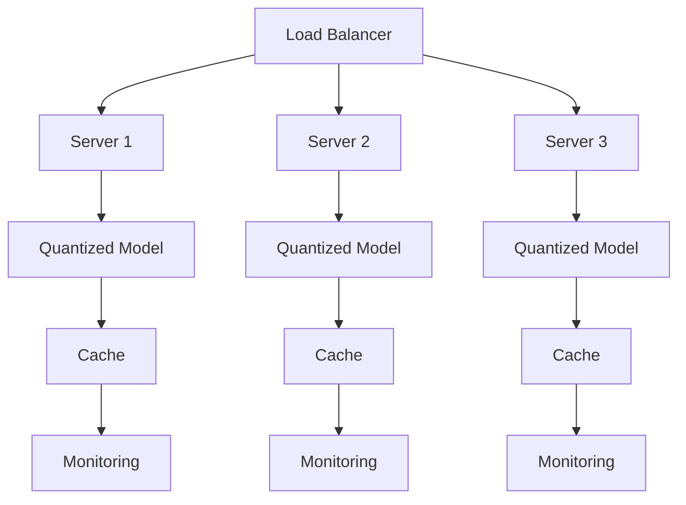

# Vector Quantized LLM - Deployment Guide

## Table of Contents

1. [System Requirements](#system-requirements)
2. [Installation](#installation)
3. [Quick Start](#quick-start)
4. [Production Deployment](#production-deployment)
5. [Performance Tuning](#performance-tuning)
6. [Monitoring](#monitoring)
7. [Troubleshooting](#troubleshooting)

## System Requirements

### Hardware Requirements

#### Minimum Requirements
- **CPU**: 8-core x86_64 processor (Intel/AMD)
- **RAM**: 16GB DDR4
- **Storage**: 50GB SSD
- **GPU**: NVIDIA GPU with 8GB VRAM (optional but recommended)

#### Recommended Requirements
- **CPU**: 16-core x86_64 processor
- **RAM**: 64GB DDR4/DDR5
- **Storage**: 500GB NVMe SSD
- **GPU**: NVIDIA A100/H100 or RTX 4090 with 24GB+ VRAM

#### Memory Requirements by Model Size

| Model Size | FP32 | INT8 | INT4 | Recommended RAM |
|------------|------|------|------|-----------------|
| 1.5B params | 6GB | 1.5GB | 750MB | 8GB |
| 7B params | 28GB | 7GB | 3.5GB | 16GB |
| 13B params | 52GB | 13GB | 6.5GB | 32GB |
| 30B params | 120GB | 30GB | 15GB | 64GB |
| 70B params | 280GB | 70GB | 35GB | 128GB |

### Software Requirements

#### Operating System
- Ubuntu 20.04 LTS or later
- CentOS 7/8 or RHEL 7/8
- macOS 11.0 or later (limited GPU support)
- Windows 10/11 with WSL2

#### Python Environment
- Python 3.8 or later
- pip 21.0 or later
- virtualenv or conda (recommended)

#### Dependencies
```bash
# Core dependencies
numpy>=1.21.0
scipy>=1.7.0
torch>=2.0.0  # Optional, for PyTorch models
tensorflow>=2.10.0  # Optional, for TensorFlow models

# Performance dependencies
numba>=0.55.0  # JIT compilation
triton>=2.0.0  # GPU kernels (optional)

# Monitoring dependencies
prometheus-client>=0.15.0
psutil>=5.9.0
```

## Installation

### Method 1: From Source

```bash
# Clone repository
git clone https://github.com/your-org/vector-quantized-llm.git
cd vector-quantized-llm

# Create virtual environment
python -m venv venv
source venv/bin/activate  # On Windows: venv\Scripts\activate

# Install dependencies
pip install -r requirements.txt

# Install package
pip install -e .

# Verify installation
python -c "import vqllm; print(vqllm.__version__)"
```

### Method 2: Using pip

```bash
# Install from PyPI (when available)
pip install vector-quantized-llm

# Install with GPU support
pip install vector-quantized-llm[gpu]

# Install with all extras
pip install vector-quantized-llm[all]
```

### Method 3: Using Docker

```dockerfile
# Dockerfile
FROM python:3.9-slim

WORKDIR /app

# Install system dependencies
RUN apt-get update && apt-get install -y \
    build-essential \
    curl \
    && rm -rf /var/lib/apt/lists/*

# Copy requirements
COPY requirements.txt .
RUN pip install --no-cache-dir -r requirements.txt

# Copy application
COPY . .
RUN pip install -e .

# Set environment variables
ENV PYTHONUNBUFFERED=1
ENV VQLLM_CACHE_DIR=/data/cache

EXPOSE 8000

CMD ["python", "-m", "vqllm.server"]
```

Build and run:
```bash
# Build image
docker build -t vqllm:latest .

# Run container
docker run -d \
    --name vqllm-server \
    -p 8000:8000 \
    -v /path/to/models:/models \
    -v /path/to/cache:/data/cache \
    --gpus all \
    vqllm:latest
```

### Method 4: Using Kubernetes

```yaml
# deployment.yaml
apiVersion: apps/v1
kind: Deployment
metadata:
  name: vqllm-deployment
spec:
  replicas: 3
  selector:
    matchLabels:
      app: vqllm
  template:
    metadata:
      labels:
        app: vqllm
    spec:
      containers:
      - name: vqllm
        image: vqllm:latest
        ports:
        - containerPort: 8000
        resources:
          requests:
            memory: "16Gi"
            cpu: "4"
            nvidia.com/gpu: 1
          limits:
            memory: "32Gi"
            cpu: "8"
            nvidia.com/gpu: 1
        env:
        - name: VQLLM_MODEL_PATH
          value: "/models"
        - name: VQLLM_CACHE_DIR
          value: "/cache"
        volumeMounts:
        - name: model-storage
          mountPath: /models
        - name: cache-storage
          mountPath: /cache
      volumes:
      - name: model-storage
        persistentVolumeClaim:
          claimName: model-pvc
      - name: cache-storage
        emptyDir:
          sizeLimit: 100Gi
```

## Quick Start

### 1. Quantize a Model

```bash
# Using CLI
vqllm quantize \
    --model-path /path/to/original/model \
    --output-path /path/to/quantized/model \
    --quant-type gptq \
    --bits 4 \
    --calibration-data /path/to/calibration.json
```

```python
# Using Python API
from vqllm import quantize_model

quantized_model = quantize_model(
    model_path="/path/to/original/model",
    quant_config={
        "quant_type": "gptq",
        "bits": 4,
        "block_size": 128
    },
    calibration_data="calibration.json"
)

quantized_model.save("/path/to/quantized/model")
```

### 2. Run Inference Server

```bash
# Start server
vqllm serve \
    --model-path /path/to/quantized/model \
    --host 0.0.0.0 \
    --port 8000 \
    --batch-size 8 \
    --max-seq-length 2048

# Test server
curl -X POST http://localhost:8000/generate \
    -H "Content-Type: application/json" \
    -d '{"prompt": "Hello, world!", "max_tokens": 100}'
```

### 3. Batch Processing

```python
from vqllm import BatchProcessor

processor = BatchProcessor(
    model_path="/path/to/quantized/model",
    batch_size=16,
    num_workers=4
)

# Process file
results = processor.process_file(
    input_file="prompts.jsonl",
    output_file="outputs.jsonl"
)

print(f"Processed {results['total']} prompts")
print(f"Throughput: {results['throughput']:.2f} tokens/sec")
```

## Production Deployment

### Architecture



### High Availability Setup

```yaml
# docker-compose.yaml
version: '3.8'

services:
  nginx:
    image: nginx:latest
    ports:
      - "80:80"
    volumes:
      - ./nginx.conf:/etc/nginx/nginx.conf
    depends_on:
      - vqllm1
      - vqllm2
      - vqllm3

  vqllm1:
    image: vqllm:latest
    environment:
      - INSTANCE_ID=1
      - MODEL_PATH=/models
    volumes:
      - models:/models
      - cache1:/cache
    deploy:
      resources:
        reservations:
          devices:
            - driver: nvidia
              count: 1
              capabilities: [gpu]

  vqllm2:
    image: vqllm:latest
    environment:
      - INSTANCE_ID=2
      - MODEL_PATH=/models
    volumes:
      - models:/models
      - cache2:/cache
    deploy:
      resources:
        reservations:
          devices:
            - driver: nvidia
              count: 1
              capabilities: [gpu]

  vqllm3:
    image: vqllm:latest
    environment:
      - INSTANCE_ID=3
      - MODEL_PATH=/models
    volumes:
      - models:/models
      - cache3:/cache
    deploy:
      resources:
        reservations:
          devices:
            - driver: nvidia
              count: 1
              capabilities: [gpu]

  prometheus:
    image: prom/prometheus:latest
    ports:
      - "9090:9090"
    volumes:
      - ./prometheus.yml:/etc/prometheus/prometheus.yml
      - prometheus_data:/prometheus

  grafana:
    image: grafana/grafana:latest
    ports:
      - "3000:3000"
    environment:
      - GF_SECURITY_ADMIN_PASSWORD=admin
    volumes:
      - grafana_data:/var/lib/grafana

volumes:
  models:
  cache1:
  cache2:
  cache3:
  prometheus_data:
  grafana_data:
```

### Model Serving Configuration

```python
# config.py
import os

class ProductionConfig:
    # Model settings
    MODEL_PATH = os.environ.get("MODEL_PATH", "/models/quantized")
    QUANT_TYPE = os.environ.get("QUANT_TYPE", "gptq")
    BITS = int(os.environ.get("BITS", "4"))

    # Inference settings
    BATCH_SIZE = int(os.environ.get("BATCH_SIZE", "8"))
    MAX_SEQ_LENGTH = int(os.environ.get("MAX_SEQ_LENGTH", "2048"))
    MAX_NEW_TOKENS = int(os.environ.get("MAX_NEW_TOKENS", "512"))

    # Cache settings
    CACHE_DIR = os.environ.get("CACHE_DIR", "/cache")
    CACHE_SIZE = os.environ.get("CACHE_SIZE", "10GB")
    KV_CACHE_ENABLED = os.environ.get("KV_CACHE_ENABLED", "true") == "true"

    # Performance settings
    NUM_WORKERS = int(os.environ.get("NUM_WORKERS", "4"))
    THREAD_POOL_SIZE = int(os.environ.get("THREAD_POOL_SIZE", "16"))
    USE_GPU = os.environ.get("USE_GPU", "true") == "true"
    GPU_MEMORY_FRACTION = float(os.environ.get("GPU_MEMORY_FRACTION", "0.9"))

    # Monitoring
    ENABLE_METRICS = os.environ.get("ENABLE_METRICS", "true") == "true"
    METRICS_PORT = int(os.environ.get("METRICS_PORT", "9091"))

    # Logging
    LOG_LEVEL = os.environ.get("LOG_LEVEL", "INFO")
    LOG_FILE = os.environ.get("LOG_FILE", "/logs/vqllm.log")
```

### Load Balancing

```nginx
# nginx.conf
upstream vqllm_backend {
    least_conn;
    server vqllm1:8000 max_fails=3 fail_timeout=30s;
    server vqllm2:8000 max_fails=3 fail_timeout=30s;
    server vqllm3:8000 max_fails=3 fail_timeout=30s;
}

server {
    listen 80;
    server_name api.example.com;

    location / {
        proxy_pass http://vqllm_backend;
        proxy_set_header Host $host;
        proxy_set_header X-Real-IP $remote_addr;
        proxy_set_header X-Forwarded-For $proxy_add_x_forwarded_for;

        # Timeouts for long-running inference
        proxy_connect_timeout 60s;
        proxy_send_timeout 300s;
        proxy_read_timeout 300s;

        # Buffering settings
        proxy_buffering off;
        proxy_request_buffering off;
    }

    location /health {
        proxy_pass http://vqllm_backend/health;
        access_log off;
    }

    location /metrics {
        proxy_pass http://vqllm_backend/metrics;
        access_log off;
    }
}
```

## Performance Tuning

### GPU Optimization

```python
# gpu_config.py
import os

# CUDA settings
os.environ["CUDA_VISIBLE_DEVICES"] = "0,1,2,3"  # Use specific GPUs
os.environ["CUDA_LAUNCH_BLOCKING"] = "0"  # Async kernel launches
os.environ["CUDNN_BENCHMARK"] = "1"  # Enable cuDNN autotuning

# Triton settings (if using)
os.environ["TRITON_CACHE_DIR"] = "/cache/triton"
os.environ["TRITON_PTXAS_PATH"] = "/usr/local/cuda/bin/ptxas"

# Memory settings
os.environ["PYTORCH_CUDA_ALLOC_CONF"] = "max_split_size_mb:512"
```

### CPU Optimization

```python
# cpu_config.py
import os

# OpenMP settings
os.environ["OMP_NUM_THREADS"] = "16"  # Number of OpenMP threads
os.environ["MKL_NUM_THREADS"] = "16"  # Intel MKL threads
os.environ["NUMEXPR_NUM_THREADS"] = "16"  # NumExpr threads

# NUMA settings
os.environ["OMP_PROC_BIND"] = "true"
os.environ["OMP_PLACES"] = "threads"

# CPU affinity
from multiprocessing import cpu_count
num_cpus = cpu_count()
os.sched_setaffinity(0, range(num_cpus))
```

### Memory Optimization

```python
# memory_optimization.py
class MemoryOptimizer:
    @staticmethod
    def optimize_batch_size(available_memory_gb, model_size_gb, seq_length):
        """Calculate optimal batch size based on available memory."""
        # Memory formula: model + activations + kv_cache
        activation_memory = seq_length * 768 * 4 / 1e9  # Per sample
        kv_cache_memory = seq_length * 768 * 2 * 4 / 1e9  # Per sample

        per_sample_memory = activation_memory + kv_cache_memory
        max_batch_size = int((available_memory_gb - model_size_gb) / per_sample_memory)

        # Apply safety margin
        return max(1, int(max_batch_size * 0.8))

    @staticmethod
    def enable_memory_efficient_attention():
        """Enable memory-efficient attention implementations."""
        import torch
        torch.backends.cuda.enable_flash_sdp(True)
        torch.backends.cuda.enable_mem_efficient_sdp(True)
```

### Benchmark Configuration

```bash
#!/bin/bash
# benchmark.sh

# Warm up
echo "Warming up..."
for i in {1..10}; do
    curl -s -X POST http://localhost:8000/generate \
        -H "Content-Type: application/json" \
        -d '{"prompt": "Test", "max_tokens": 10}' > /dev/null
done

# Benchmark different batch sizes
for batch_size in 1 2 4 8 16 32; do
    echo "Testing batch size: $batch_size"

    # Run benchmark
    ab -n 1000 -c $batch_size -T application/json \
        -p prompt.json \
        http://localhost:8000/generate > results_bs${batch_size}.txt

    # Extract metrics
    grep "Requests per second" results_bs${batch_size}.txt
    grep "Time per request" results_bs${batch_size}.txt
done
```

## Monitoring

### Prometheus Metrics

```python
# metrics.py
from prometheus_client import Counter, Histogram, Gauge
import time

# Define metrics
request_count = Counter('vqllm_requests_total', 'Total requests')
request_duration = Histogram('vqllm_request_duration_seconds', 'Request duration')
active_requests = Gauge('vqllm_active_requests', 'Active requests')
model_memory = Gauge('vqllm_model_memory_bytes', 'Model memory usage')
cache_hit_rate = Gauge('vqllm_cache_hit_rate', 'KV cache hit rate')

class MetricsCollector:
    @staticmethod
    def track_request(func):
        def wrapper(*args, **kwargs):
            request_count.inc()
            active_requests.inc()

            start_time = time.time()
            try:
                result = func(*args, **kwargs)
                return result
            finally:
                duration = time.time() - start_time
                request_duration.observe(duration)
                active_requests.dec()

        return wrapper

    @staticmethod
    def update_memory_metrics(model):
        """Update memory-related metrics."""
        import psutil
        process = psutil.Process()

        # System memory
        mem_info = process.memory_info()
        model_memory.set(mem_info.rss)

        # GPU memory (if available)
        try:
            import torch
            if torch.cuda.is_available():
                for i in range(torch.cuda.device_count()):
                    allocated = torch.cuda.memory_allocated(i)
                    Gauge(f'vqllm_gpu_{i}_memory_bytes', f'GPU {i} memory').set(allocated)
        except ImportError:
            pass
```

### Grafana Dashboard

```json
{
  "dashboard": {
    "title": "VQLLM Monitoring",
    "panels": [
      {
        "title": "Request Rate",
        "targets": [
          {
            "expr": "rate(vqllm_requests_total[5m])"
          }
        ]
      },
      {
        "title": "Request Latency",
        "targets": [
          {
            "expr": "histogram_quantile(0.95, vqllm_request_duration_seconds)"
          }
        ]
      },
      {
        "title": "Memory Usage",
        "targets": [
          {
            "expr": "vqllm_model_memory_bytes / 1024 / 1024 / 1024"
          }
        ]
      },
      {
        "title": "GPU Utilization",
        "targets": [
          {
            "expr": "vqllm_gpu_0_memory_bytes / 1024 / 1024 / 1024"
          }
        ]
      }
    ]
  }
}
```

### Health Checks

```python
# health.py
from typing import Dict
import psutil
import torch

class HealthChecker:
    @staticmethod
    def check_health() -> Dict:
        """Comprehensive health check."""
        health = {
            "status": "healthy",
            "checks": {}
        }

        # Check model loaded
        try:
            from vqllm import get_current_model
            model = get_current_model()
            health["checks"]["model"] = {
                "status": "ok" if model else "error",
                "loaded": model is not None
            }
        except Exception as e:
            health["checks"]["model"] = {"status": "error", "error": str(e)}

        # Check memory
        mem = psutil.virtual_memory()
        health["checks"]["memory"] = {
            "status": "ok" if mem.percent < 90 else "warning",
            "used_percent": mem.percent
        }

        # Check GPU (if available)
        if torch.cuda.is_available():
            health["checks"]["gpu"] = {
                "status": "ok",
                "devices": torch.cuda.device_count(),
                "current_device": torch.cuda.current_device()
            }

        # Overall status
        if any(check.get("status") == "error" for check in health["checks"].values()):
            health["status"] = "unhealthy"
        elif any(check.get("status") == "warning" for check in health["checks"].values()):
            health["status"] = "degraded"

        return health
```

## Troubleshooting

### Common Issues and Solutions

#### 1. Out of Memory Errors

**Symptoms:**
```
RuntimeError: CUDA out of memory. Tried to allocate X.XX GiB
```

**Solutions:**
```python
# Reduce batch size
config.batch_size = 4  # From 8

# Enable gradient checkpointing
config.gradient_checkpointing = True

# Use INT4 instead of INT8
config.quant_type = "int4"

# Clear cache periodically
import torch
torch.cuda.empty_cache()
```

#### 2. Slow Inference Speed

**Symptoms:**
- High latency (>100ms per token)
- Low throughput (<100 tokens/sec)

**Solutions:**
```python
# Enable kernel fusion
config.enable_kernel_fusion = True

# Use larger batch sizes
config.batch_size = 16

# Enable KV cache
config.use_kv_cache = True

# Profile to find bottlenecks
from vqllm.utils import profile_inference
profile_inference(model, input_data)
```

#### 3. Quantization Quality Issues

**Symptoms:**
- Poor model outputs
- High perplexity
- Nonsensical generation

**Solutions:**
```python
# Use more calibration data
calibration_samples = 500  # Increase from 100

# Try different quantization methods
config.quant_type = "awq"  # Instead of int4

# Adjust dampening for GPTQ
config.dampening = 0.05  # Increase from 0.01

# Use per-channel instead of per-tensor
config.scale_type = "per_channel"
```

#### 4. Installation Issues

**Problem:** Missing CUDA libraries
```bash
# Install CUDA toolkit
wget https://developer.download.nvidia.com/compute/cuda/11.8.0/local_installers/cuda_11.8.0_520.61.05_linux.run
sudo sh cuda_11.8.0_520.61.05_linux.run

# Add to PATH
export PATH=/usr/local/cuda/bin:$PATH
export LD_LIBRARY_PATH=/usr/local/cuda/lib64:$LD_LIBRARY_PATH
```

**Problem:** Incompatible NumPy version
```bash
# Reinstall compatible version
pip uninstall numpy
pip install numpy==1.23.5
```

### Debug Mode

Enable verbose logging for troubleshooting:

```python
import logging
import sys

# Configure logging
logging.basicConfig(
    level=logging.DEBUG,
    format='%(asctime)s - %(name)s - %(levelname)s - %(message)s',
    handlers=[
        logging.FileHandler('debug.log'),
        logging.StreamHandler(sys.stdout)
    ]
)

# Enable debug mode
from vqllm import enable_debug_mode
enable_debug_mode()

# Run with profiling
from vqllm import profile_execution
with profile_execution():
    output = model.generate(input_ids)
```

### Performance Debugging

```python
# performance_debug.py
import time
import torch
from contextlib import contextmanager

@contextmanager
def timer(name):
    """Time a code block."""
    start = time.perf_counter()
    yield
    end = time.perf_counter()
    print(f"{name}: {end - start:.4f} seconds")

# Debug inference pipeline
with timer("Total inference"):
    with timer("Preprocessing"):
        input_ids = preprocess(text)

    with timer("Model forward"):
        with timer("Embedding lookup"):
            embeddings = model.embed(input_ids)

        with timer("Transformer layers"):
            hidden = model.transformer(embeddings)

        with timer("Output projection"):
            logits = model.lm_head(hidden)

    with timer("Postprocessing"):
        tokens = postprocess(logits)
```

## FAQ

**Q: Which quantization method should I use?**
A: For most use cases, GPTQ with 4-bit quantization provides the best balance. Use INT8 for minimal quality loss, or AWQ for models with known activation patterns.

**Q: Can I quantize custom models?**
A: Yes, any transformer-based model can be quantized. Ensure your model follows standard naming conventions for layers.

**Q: How much speedup can I expect?**
A: Typically 2-4x speedup with INT8, and 3-6x with INT4, depending on hardware and model size.

**Q: Is quantization reversible?**
A: No, quantization is lossy. Always keep a copy of the original model.

**Q: Can I use multiple GPUs?**
A: Yes, the system supports multi-GPU inference with tensor parallelism.
